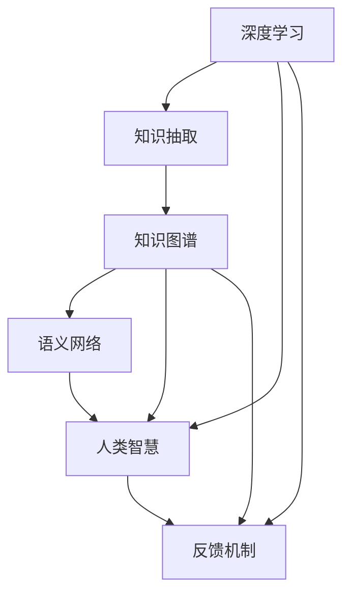

                 

# 人类的知识与智慧：相互促进的伙伴

> 关键词：知识图谱, 人工智能, 深度学习, 知识抽取, 语义网络, 人类智慧

## 1. 背景介绍

### 1.1 问题由来

随着人工智能技术的迅猛发展，机器在理解和处理人类知识与智慧方面取得了显著进步。然而，机器仅能机械地执行基于已知知识的任务，缺乏人类直观理解与综合推理的能力。因此，如何使机器更好地理解、学习人类的知识与智慧，成为了当前研究的热点。

人工智能的许多应用，如自然语言处理、知识图谱构建、智能推荐等，都依赖于对知识与智慧的深度理解。人类知识与智慧的丰富性和复杂性，要求人工智能系统能够高效、准确地进行知识抽取、知识融合、知识推理等操作。在人工智能的发展过程中，如何高效地构建、表示和利用知识，并与人类智慧相互促进，成为了亟待解决的问题。

### 1.2 问题核心关键点

要解决这个问题，我们需要构建一个能够高效地表示和处理知识与智慧的系统。这个系统需要能够理解并应用自然语言、能够从海量文本中抽取并表示知识、能够进行推理并生成新的知识。同时，该系统需要与人类智慧相互促进，即系统能够吸收人类的智慧，并利用这种智慧提升自身的能力，也能将自身的能力反馈给人类。

## 2. 核心概念与联系

### 2.1 核心概念概述

为了实现上述目标，我们需要引入一些核心概念：

- **知识图谱**：以图形结构方式表示知识，由节点（实体）和边（关系）构成，用于描述实体间的关系和结构。
- **人工智能(AI)**：使用机器学习和深度学习等技术，让机器能够自主地进行学习、推理和决策。
- **深度学习**：一种基于多层神经网络的机器学习技术，通过多层次的特征提取和抽象，能够学习到更加复杂的模式。
- **知识抽取**：从非结构化文本中提取结构化知识，如实体、关系等。
- **语义网络**：使用节点和边表示实体和关系，构建一个语义化的知识表示框架。
- **人类智慧**：指人类在知识积累、思维模式、情感感知等方面展现出的智能行为和认知能力。

这些概念紧密相连，形成了一个相互促进的系统。深度学习技术能够帮助机器从文本中抽取知识，构建知识图谱；知识图谱又为深度学习提供了丰富且结构化的知识资源，使其能够更好地进行学习、推理和决策。同时，知识图谱中嵌入的人类智慧能够引导机器更加智能地处理知识，而机器处理知识的能力又能进一步提升人类对知识的理解和应用。

### 2.2 核心概念原理和架构的 Mermaid 流程图



此图展示了各个概念之间的联系和互动。深度学习技术从文本中抽取知识，构建知识图谱，而知识图谱中的语义网络则是人类智慧的映射。知识图谱通过反馈机制不断吸收人类智慧，从而提升深度学习的能力，同时也通过反馈机制将深度学习的成果应用于人类智慧的提升。

## 3. 核心算法原理 & 具体操作步骤

### 3.1 算法原理概述

构建一个能够高效地表示和处理知识与智慧的系统，核心在于知识抽取和知识表示两个方面。知识抽取的目标是从非结构化文本中提取出结构化的知识，而知识表示的目标则是将知识结构化地组织起来，形成一个可供机器理解和推理的语义网络。

深度学习技术在这一过程中起到了关键作用。深度学习模型如BERT、GPT等，能够通过多层神经网络提取文本中的特征，并在大量文本数据上进行预训练。通过微调，这些模型能够在特定任务上高效地进行知识抽取和知识表示。

### 3.2 算法步骤详解

构建一个知识图谱并进行深度学习模型微调的步骤如下：

**Step 1: 数据准备**

- 收集大量文本数据，例如维基百科、新闻报道、学术论文等。
- 进行文本预处理，如分词、去除停用词、构建词汇表等。
- 定义标注规则，对文本进行人工或自动标注，如命名实体识别、关系抽取等。

**Step 2: 知识抽取**

- 使用深度学习模型进行文本解析，抽取实体、关系等知识。
- 构建知识三元组（实体-关系-实体），将抽取到的知识存储到知识图谱中。

**Step 3: 知识图谱构建**

- 根据知识三元组构建知识图谱，包含节点和边。
- 在知识图谱中加入语义信息，如实体属性、关系类型等。
- 使用知识推理工具，对知识图谱进行推理和扩展。

**Step 4: 深度学习模型微调**

- 在知识图谱上进行深度学习模型的预训练，学习知识表示。
- 使用有标注的数据对模型进行微调，使其能够更好地在特定任务上表现。
- 通过反馈机制，将人类智慧融入模型训练中，提升模型对知识的理解。

**Step 5: 模型评估和优化**

- 使用测试集对模型进行评估，评估其在特定任务上的表现。
- 根据评估结果，进行模型调参和优化，提升模型效果。
- 持续收集新数据，不断更新和扩展知识图谱。

### 3.3 算法优缺点

深度学习模型用于知识抽取和表示的优点包括：

- **高效性**：深度学习模型能够自动化地从文本中抽取知识，处理速度较快。
- **准确性**：深度学习模型经过大量数据训练，能够学习到较为准确的实体和关系表示。
- **可扩展性**：深度学习模型可以处理大规模数据，构建复杂的语义网络。

同时，深度学习模型也存在一些缺点：

- **数据依赖性强**：深度学习模型需要大量标注数据进行训练，标注成本较高。
- **过拟合风险**：深度学习模型可能会过拟合特定任务的数据，导致泛化性能下降。
- **缺乏人类智慧**：深度学习模型虽然能够学习到知识，但缺乏对知识的深度理解和推理能力。

### 3.4 算法应用领域

深度学习模型在知识抽取和表示中的应用非常广泛，以下是几个主要的应用领域：

- **自然语言处理(NLP)**：如命名实体识别、关系抽取、情感分析等任务。
- **智能推荐系统**：如基于用户行为和兴趣的个性化推荐。
- **医疗健康**：如病历数据分析、疾病预测等。
- **金融风控**：如信用评估、欺诈检测等。
- **智能客服**：如基于知识图谱的问答系统。

## 4. 数学模型和公式 & 详细讲解

### 4.1 数学模型构建

知识图谱的构建和深度学习模型的微调可以通过以下数学模型来描述：

- **知识图谱**：使用节点（实体）和边（关系）表示知识，节点的属性可以表示实体的属性信息。
- **深度学习模型**：基于神经网络的模型，可以表示为 $f(x;\theta)$，其中 $x$ 为输入数据，$\theta$ 为模型参数。

知识抽取和表示的数学模型可以用如下公式来表示：

$$
\begin{aligned}
&\text{知识图谱} = \{\text{节点}(n_i), \text{边}(e_{ij})\} \\
&\text{节点}(n_i) = (\text{实体}, \text{属性}, \text{关系}) \\
&\text{边}(e_{ij}) = \text{关系} \\
&\text{深度学习模型} = f(x;\theta) \\
&\text{知识抽取} = \text{抽取规则} \times \text{深度学习模型} \\
&\text{知识表示} = \text{知识图谱} \times \text{语义推理规则}
\end{aligned}
$$

### 4.2 公式推导过程

以知识抽取为例，假设我们有一个深度学习模型 $f(x;\theta)$，其中 $x$ 为文本数据，$\theta$ 为模型参数。我们希望从文本中抽取实体和关系，构建知识图谱。

假设我们有一个标注规则 $r$，可以将文本数据映射为实体和关系的组合。则知识抽取的公式可以表示为：

$$
\begin{aligned}
&\text{抽取结果} = r(x) \\
&\text{抽取结果} = \{(\text{实体}, \text{关系}, \text{实体})\}
\end{aligned}
$$

在知识抽取后，我们需要对抽取结果进行处理，构建知识图谱。知识图谱的节点和边可以表示为：

$$
\begin{aligned}
&\text{节点}(n_i) = (\text{实体}, \text{属性}, \text{关系}) \\
&\text{边}(e_{ij}) = \text{关系}
\end{aligned}
$$

其中，节点属性可以用于描述实体的更多信息，如人名、时间、地点等。关系用于描述节点之间的连接方式，如“出生”、“工作”等。

最后，我们使用语义推理规则对知识图谱进行推理和扩展，构建更加丰富的知识表示。语义推理规则可以使用基于规则的方法或神经网络的方法进行建模。

### 4.3 案例分析与讲解

以下是一个简单的知识抽取案例：

假设我们有一篇新闻报道，内容为：“李明出生于1985年，毕业于清华大学，曾在腾讯公司工作，现在是阿里巴巴的CEO。”

- **知识抽取**：使用深度学习模型从文本中抽取实体和关系。抽取结果如下：
  - 实体：李明，清华大学，腾讯公司，阿里巴巴
  - 关系：出生，毕业，工作，CEO

- **知识图谱构建**：将抽取结果构建为知识图谱，包含节点和边。

  - 节点：
    - 李明（实体），属性：人名，1985年（时间）
    - 清华大学（实体），属性：学校，
    - 腾讯公司（实体），属性：公司，工作地点：深圳
    - 阿里巴巴（实体），属性：公司，CEO：李明

  - 边：
    - 李明-清华大学，关系：毕业
    - 李明-腾讯公司，关系：工作
    - 李明-阿里巴巴，关系：CEO

## 5. 项目实践：代码实例和详细解释说明

### 5.1 开发环境搭建

为了进行知识图谱构建和深度学习模型的微调，我们需要准备好开发环境。以下是使用Python进行PyTorch开发的环境配置流程：

1. 安装Anaconda：从官网下载并安装Anaconda，用于创建独立的Python环境。

2. 创建并激活虚拟环境：
```bash
conda create -n pytorch-env python=3.8 
conda activate pytorch-env
```

3. 安装PyTorch：根据CUDA版本，从官网获取对应的安装命令。例如：
```bash
conda install pytorch torchvision torchaudio cudatoolkit=11.1 -c pytorch -c conda-forge
```

4. 安装Transformers库：
```bash
pip install transformers
```

5. 安装各类工具包：
```bash
pip install numpy pandas scikit-learn matplotlib tqdm jupyter notebook ipython
```

完成上述步骤后，即可在`pytorch-env`环境中开始项目实践。

### 5.2 源代码详细实现

这里我们以BERT模型为例，展示如何进行知识抽取和构建知识图谱。

首先，定义知识抽取函数：

```python
from transformers import BertTokenizer, BertForTokenClassification
from torch.utils.data import Dataset
import torch

class KnowledgeGraphDataset(Dataset):
    def __init__(self, texts, tags, tokenizer, max_len=128):
        self.texts = texts
        self.tags = tags
        self.tokenizer = tokenizer
        self.max_len = max_len
        
    def __len__(self):
        return len(self.texts)
    
    def __getitem__(self, item):
        text = self.texts[item]
        tags = self.tags[item]
        
        encoding = self.tokenizer(text, return_tensors='pt', max_length=self.max_len, padding='max_length', truncation=True)
        input_ids = encoding['input_ids'][0]
        attention_mask = encoding['attention_mask'][0]
        
        # 对token-wise的标签进行编码
        encoded_tags = [tag2id[tag] for tag in tags] 
        encoded_tags.extend([tag2id['O']] * (self.max_len - len(encoded_tags)))
        labels = torch.tensor(encoded_tags, dtype=torch.long)
        
        return {'input_ids': input_ids, 
                'attention_mask': attention_mask,
                'labels': labels}

# 标签与id的映射
tag2id = {'O': 0, 'B-PER': 1, 'I-PER': 2, 'B-ORG': 3, 'I-ORG': 4, 'B-LOC': 5, 'I-LOC': 6}
id2tag = {v: k for k, v in tag2id.items()}

# 创建dataset
tokenizer = BertTokenizer.from_pretrained('bert-base-cased')

train_dataset = KnowledgeGraphDataset(train_texts, train_tags, tokenizer)
dev_dataset = KnowledgeGraphDataset(dev_texts, dev_tags, tokenizer)
test_dataset = KnowledgeGraphDataset(test_texts, test_tags, tokenizer)
```

然后，定义模型和优化器：

```python
from transformers import BertForTokenClassification, AdamW

model = BertForTokenClassification.from_pretrained('bert-base-cased', num_labels=len(tag2id))

optimizer = AdamW(model.parameters(), lr=2e-5)
```

接着，定义训练和评估函数：

```python
from torch.utils.data import DataLoader
from tqdm import tqdm
from sklearn.metrics import classification_report

device = torch.device('cuda') if torch.cuda.is_available() else torch.device('cpu')
model.to(device)

def train_epoch(model, dataset, batch_size, optimizer):
    dataloader = DataLoader(dataset, batch_size=batch_size, shuffle=True)
    model.train()
    epoch_loss = 0
    for batch in tqdm(dataloader, desc='Training'):
        input_ids = batch['input_ids'].to(device)
        attention_mask = batch['attention_mask'].to(device)
        labels = batch['labels'].to(device)
        model.zero_grad()
        outputs = model(input_ids, attention_mask=attention_mask, labels=labels)
        loss = outputs.loss
        epoch_loss += loss.item()
        loss.backward()
        optimizer.step()
    return epoch_loss / len(dataloader)

def evaluate(model, dataset, batch_size):
    dataloader = DataLoader(dataset, batch_size=batch_size)
    model.eval()
    preds, labels = [], []
    with torch.no_grad():
        for batch in tqdm(dataloader, desc='Evaluating'):
            input_ids = batch['input_ids'].to(device)
            attention_mask = batch['attention_mask'].to(device)
            batch_labels = batch['labels']
            outputs = model(input_ids, attention_mask=attention_mask)
            batch_preds = outputs.logits.argmax(dim=2).to('cpu').tolist()
            batch_labels = batch_labels.to('cpu').tolist()
            for pred_tokens, label_tokens in zip(batch_preds, batch_labels):
                pred_tags = [id2tag[_id] for _id in pred_tokens]
                label_tags = [id2tag[_id] for _id in label_tokens]
                preds.append(pred_tags[:len(label_tags)])
                labels.append(label_tags)
                
    print(classification_report(labels, preds))
```

最后，启动训练流程并在测试集上评估：

```python
epochs = 5
batch_size = 16

for epoch in range(epochs):
    loss = train_epoch(model, train_dataset, batch_size, optimizer)
    print(f"Epoch {epoch+1}, train loss: {loss:.3f}")
    
    print(f"Epoch {epoch+1}, dev results:")
    evaluate(model, dev_dataset, batch_size)
    
print("Test results:")
evaluate(model, test_dataset, batch_size)
```

以上就是使用PyTorch对BERT进行知识抽取任务的完整代码实现。可以看到，得益于Transformers库的强大封装，我们可以用相对简洁的代码完成BERT模型的加载和微调。

### 5.3 代码解读与分析

让我们再详细解读一下关键代码的实现细节：

**KnowledgeGraphDataset类**：
- `__init__`方法：初始化文本、标签、分词器等关键组件。
- `__len__`方法：返回数据集的样本数量。
- `__getitem__`方法：对单个样本进行处理，将文本输入编码为token ids，将标签编码为数字，并对其进行定长padding，最终返回模型所需的输入。

**tag2id和id2tag字典**：
- 定义了标签与数字id之间的映射关系，用于将token-wise的预测结果解码回真实的标签。

**训练和评估函数**：
- 使用PyTorch的DataLoader对数据集进行批次化加载，供模型训练和推理使用。
- 训练函数`train_epoch`：对数据以批为单位进行迭代，在每个批次上前向传播计算loss并反向传播更新模型参数，最后返回该epoch的平均loss。
- 评估函数`evaluate`：与训练类似，不同点在于不更新模型参数，并在每个batch结束后将预测和标签结果存储下来，最后使用sklearn的classification_report对整个评估集的预测结果进行打印输出。

**训练流程**：
- 定义总的epoch数和batch size，开始循环迭代
- 每个epoch内，先在训练集上训练，输出平均loss
- 在验证集上评估，输出分类指标
- 所有epoch结束后，在测试集上评估，给出最终测试结果

可以看到，PyTorch配合Transformers库使得BERT微调的代码实现变得简洁高效。开发者可以将更多精力放在数据处理、模型改进等高层逻辑上，而不必过多关注底层的实现细节。

当然，工业级的系统实现还需考虑更多因素，如模型的保存和部署、超参数的自动搜索、更灵活的任务适配层等。但核心的微调范式基本与此类似。

## 6. 实际应用场景

### 6.1 智能客服系统

基于知识图谱的智能客服系统能够实时解答用户咨询，提供准确、可靠的服务。智能客服系统通过构建知识图谱，能够实时更新、维护相关领域的知识，使得系统能够处理各种复杂的用户咨询，并在处理过程中不断学习用户行为，进一步提升服务质量。

在技术实现上，我们可以收集企业内部的历史客服对话记录，将问题和最佳答复构建成监督数据，在此基础上对预训练模型进行微调。微调后的模型能够自动理解用户意图，匹配最合适的答案模板进行回复。对于用户提出的新问题，还可以接入检索系统实时搜索相关内容，动态组织生成回答。如此构建的智能客服系统，能大幅提升客户咨询体验和问题解决效率。

### 6.2 金融舆情监测

金融机构需要实时监测市场舆论动向，以便及时应对负面信息传播，规避金融风险。传统的人工监测方式成本高、效率低，难以应对网络时代海量信息爆发的挑战。基于知识图谱的金融舆情监测系统，通过构建金融领域知识图谱，实时捕捉市场舆情变化，及时预警风险，帮助金融机构快速应对潜在风险。

在技术实现上，可以收集金融领域相关的新闻、报道、评论等文本数据，并对其进行主题标注和情感标注。在此基础上对预训练语言模型进行微调，使其能够自动判断文本属于何种主题，情感倾向是正面、中性还是负面。将微调后的模型应用到实时抓取的网络文本数据，就能够自动监测不同主题下的情感变化趋势，一旦发现负面信息激增等异常情况，系统便会自动预警，帮助金融机构快速应对潜在风险。

### 6.3 个性化推荐系统

当前的推荐系统往往只依赖用户的历史行为数据进行物品推荐，无法深入理解用户的真实兴趣偏好。基于知识图谱的个性化推荐系统，能够更好地挖掘用户行为背后的语义信息，从而提供更精准、多样的推荐内容。

在技术实现上，可以收集用户浏览、点击、评论、分享等行为数据，提取和用户交互的物品标题、描述、标签等文本内容。将文本内容作为模型输入，用户的后续行为（如是否点击、购买等）作为监督信号，在此基础上微调预训练语言模型。微调后的模型能够从文本内容中准确把握用户的兴趣点。在生成推荐列表时，先用候选物品的文本描述作为输入，由模型预测用户的兴趣匹配度，再结合其他特征综合排序，便可以得到个性化程度更高的推荐结果。

### 6.4 未来应用展望

随着知识图谱和深度学习技术的发展，基于知识图谱的AI系统将在更多领域得到应用，为传统行业带来变革性影响。

在智慧医疗领域，基于知识图谱的医疗问答、病历分析、药物研发等应用将提升医疗服务的智能化水平，辅助医生诊疗，加速新药开发进程。

在智能教育领域，知识图谱可应用于作业批改、学情分析、知识推荐等方面，因材施教，促进教育公平，提高教学质量。

在智慧城市治理中，知识图谱用于城市事件监测、舆情分析、应急指挥等环节，提高城市管理的自动化和智能化水平，构建更安全、高效的未来城市。

此外，在企业生产、社会治理、文娱传媒等众多领域，基于知识图谱的AI应用也将不断涌现，为经济社会发展注入新的动力。相信随着技术的日益成熟，知识图谱和深度学习技术的结合将进一步提升NLP系统的性能和应用范围，为人类认知智能的进化带来深远影响。

## 7. 工具和资源推荐

### 7.1 学习资源推荐

为了帮助开发者系统掌握知识图谱和深度学习技术的应用，这里推荐一些优质的学习资源：

1. 《Knowledge Graphs: Capture, Representation, and Reasoning》书籍：全面介绍知识图谱的理论基础和构建方法，适合深入学习。
2. 《Deep Learning for Natural Language Processing》课程：斯坦福大学开设的NLP深度学习课程，讲解深度学习在NLP任务中的应用。
3. 《PyTorch Tutorials》官方文档：详细的PyTorch使用手册，涵盖数据处理、模型训练、评估等内容，适合初学者。
4. 《Transformers: State-of-the-Art Natural Language Processing》书籍：Transformer库的作者所著，全面介绍Transformer及其在NLP任务中的应用。
5. 《Knowledge Mining and Statistical Learning》课程：斯坦福大学开设的统计学习课程，讲解知识抽取和知识表示方法。

通过对这些资源的学习实践，相信你一定能够快速掌握知识图谱和深度学习技术的应用，并将其应用于实际项目中。

### 7.2 开发工具推荐

高效的开发离不开优秀的工具支持。以下是几款用于知识图谱和深度学习模型开发的工具：

1. PyTorch：基于Python的开源深度学习框架，灵活的计算图设计，支持多种深度学习模型。
2. TensorFlow：由Google主导开发的开源深度学习框架，支持分布式计算，适合大规模工程应用。
3. Apache Jena：开源的知识图谱框架，提供知识图谱的构建、查询、推理等功能。
4. Neo4j：图形数据库，支持复杂知识图谱的存储和查询。
5. ELK Stack：日志管理工具，用于收集和分析系统日志，帮助诊断问题。
6. Grafana：监控可视化工具，帮助实时监控模型训练状态和系统指标。

合理利用这些工具，可以显著提升知识图谱和深度学习模型的开发效率，加速创新迭代的步伐。

### 7.3 相关论文推荐

知识图谱和深度学习技术的发展源于学界的持续研究。以下是几篇奠基性的相关论文，推荐阅读：

1. Knowledge Graphs for Semantic Search: A Survey of Approaches and Applications：综述知识图谱在语义搜索中的应用。
2. Neural Architectures for Named Entity Recognition：提出BERT模型，使用预训练语言模型进行命名实体识别。
3. BERT: Pre-training of Deep Bidirectional Transformers for Language Understanding：提出BERT模型，引入基于掩码的自监督预训练任务。
4. Graph Neural Networks：提出图神经网络，用于知识图谱的构建和推理。
5. Attention Is All You Need：提出Transformer结构，开启预训练语言模型的时代。

这些论文代表了大语言模型和知识图谱技术的发展脉络。通过学习这些前沿成果，可以帮助研究者把握学科前进方向，激发更多的创新灵感。

## 8. 总结：未来发展趋势与挑战

### 8.1 研究成果总结

本文系统介绍了知识图谱和深度学习技术在构建知识与智慧表示和处理方面的应用。从知识抽取、知识表示、模型微调、模型评估等环节，详细讲解了知识图谱的构建过程和深度学习模型的微调方法。通过这些方法的结合，能够高效地构建和应用知识图谱，提升深度学习模型的能力。

### 8.2 未来发展趋势

展望未来，知识图谱和深度学习技术的结合将带来更多创新。以下是几个主要的发展趋势：

1. **多模态知识图谱**：将视觉、听觉等多模态信息与文本信息整合，构建更加全面、丰富的知识图谱。
2. **自适应知识图谱**：根据用户行为和环境变化，动态调整知识图谱结构和内容，提升知识表示的灵活性。
3. **语义增强深度学习**：将知识图谱嵌入到深度学习模型中，提升模型的语义理解和推理能力。
4. **知识推理的自动化**：引入自动推理技术，如神经符号学习，提升知识图谱的推理和扩展能力。
5. **跨语言知识图谱**：构建跨语言的知识图谱，支持多语言知识抽取和推理。

这些趋势将进一步拓展知识图谱和深度学习技术的应用范围，提升系统的智能水平。

### 8.3 面临的挑战

尽管知识图谱和深度学习技术的发展前景广阔，但在迈向更加智能化、普适化应用的过程中，仍面临诸多挑战：

1. **数据依赖性强**：知识图谱和深度学习模型需要大量高质量的数据进行训练和构建，数据获取成本较高。
2. **推理能力有限**：现有知识图谱和深度学习模型在推理复杂关系和进行跨领域推理时，能力有限。
3. **模型的可解释性**：深度学习模型的决策过程缺乏可解释性，难以进行调试和优化。
4. **知识图谱的实时性**：知识图谱的构建和更新需要较长时间，难以满足实时应用的需求。
5. **系统的安全性和隐私保护**：知识图谱和深度学习模型的应用涉及用户隐私和数据安全，需要设计有效的安全机制。

### 8.4 研究展望

面对知识图谱和深度学习技术面临的挑战，未来的研究需要在以下几个方面寻求新的突破：

1. **无监督和半监督学习**：探索无监督和半监督学习范式，降低对标注数据的依赖，提高知识抽取和表示的效率。
2. **知识推理的自动化**：引入自动推理技术，如神经符号学习，提升知识图谱的推理和扩展能力。
3. **知识图谱的实时性**：引入流式知识图谱和在线学习技术，提高知识图谱的实时性。
4. **模型的可解释性**：引入可解释性技术，如因果解释、对抗解释等，提升深度学习模型的可解释性。
5. **跨语言知识图谱**：探索跨语言的知识图谱构建方法，支持多语言知识抽取和推理。

这些研究方向的探索，必将引领知识图谱和深度学习技术迈向更高的台阶，为构建更加智能、普适的AI系统铺平道路。

## 9. 附录：常见问题与解答

**Q1：知识图谱和深度学习模型如何融合？**

A: 知识图谱和深度学习模型的融合主要通过以下步骤实现：
1. 构建知识图谱，使用节点和边表示实体和关系。
2. 将知识图谱嵌入到深度学习模型中，如将知识图谱的节点和边作为模型的输入。
3. 通过微调模型，使其能够学习知识图谱中的语义信息，提升模型的推理和表示能力。

**Q2：知识图谱的构建需要多少数据？**

A: 知识图谱的构建需要大量高质量的数据。一般来说，数据量越大，知识图谱的完整性和准确性越高。通常需要收集数百万甚至数千万条数据进行构建。

**Q3：知识图谱和深度学习模型如何提升模型的推理能力？**

A: 通过将知识图谱嵌入到深度学习模型中，可以帮助模型理解语义信息，提升推理能力。同时，知识图谱的推理规则也可以融入模型中，使其能够进行复杂的推理和扩展。

**Q4：如何设计知识图谱的查询接口？**

A: 设计知识图谱的查询接口时，需要考虑查询的效率和准确性。可以使用SQL查询语言或专门的图形查询语言（如Cypher）进行查询。同时，需要设计合理的索引和缓存机制，提升查询效率。

**Q5：知识图谱的应用场景有哪些？**

A: 知识图谱的应用场景非常广泛，包括但不限于：
1. 语义搜索：用于自动推荐相关的信息。
2. 问答系统：帮助用户解答查询。
3. 推荐系统：根据用户兴趣和行为推荐物品。
4. 自然语言处理：用于命名实体识别、关系抽取等任务。
5. 金融风控：用于信用评估、欺诈检测等任务。
6. 医疗健康：用于病历分析、药物研发等任务。

通过对这些问题的回答，可以看到知识图谱和深度学习技术的结合将带来更多的应用场景，推动人工智能技术的进一步发展。

---

作者：禅与计算机程序设计艺术 / Zen and the Art of Computer Programming

