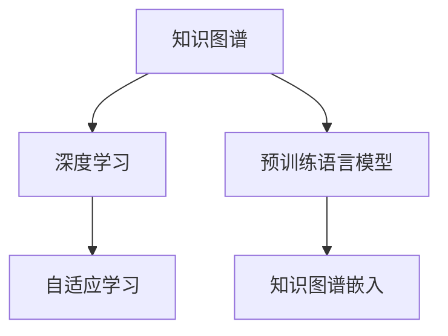

                 

# 人类知识的未来展望：洞察力引领知识革命

> 关键词：人工智能,知识图谱,洞察力,知识革命,自适应学习

## 1. 背景介绍

### 1.1 问题由来
人类社会正处于一场前所未有的知识革命中。随着信息技术的飞速发展，全球知识体量呈指数级增长。传统的数据驱动决策方式难以有效利用和处理海量知识，知识管理的复杂性和难度不断上升。在这种背景下，如何洞察并高效利用知识，成为了摆在人类面前的重要课题。

人工智能技术，尤其是深度学习和自然语言处理技术，为知识洞察提供了新手段。通过构建知识图谱、自适应学习等模型，可以自动化的提取、组织、推理和应用知识，提升决策的准确性和效率。其中，基于深度学习的方法，如知识图谱嵌入、预训练语言模型等，逐渐成为当前知识革命的主流技术。

### 1.2 问题核心关键点
本节将介绍几个密切相关的核心概念：

- **知识图谱**：一种结构化的语义网络，通过将知识实体和关系映射为图形，实现知识的深度关联和高效查询。
- **深度学习**：一种强大的数据表示与学习方式，通过多层神经网络逼近复杂非线性映射关系。
- **预训练语言模型**：如BERT、GPT等，通过大规模无标签文本数据训练得到的语言理解模型，具备强大的语义表示能力。
- **自适应学习**：根据用户行为或反馈动态调整学习策略，以更好地适应用户需求和任务。
- **知识图谱嵌入**：将知识图谱中的节点和边映射为向量，用于推理和搜索。

这些核心概念之间的逻辑关系可以通过以下Mermaid流程图来展示：



这个流程图展示了几类核心概念之间的关系：

1. 知识图谱为深度学习提供了知识结构，使其能够理解复杂语义。
2. 深度学习为预训练语言模型提供模型结构，使其具备强大的语义表示能力。
3. 自适应学习与深度学习结合，使模型能够动态调整参数，提升学习效果。
4. 知识图谱嵌入为知识图谱提供了向量表示，方便查询和推理。

## 2. 核心概念与联系

### 2.1 核心概念概述

为更好地理解深度学习在知识图谱和自适应学习中的应用，本节将介绍几个密切相关的核心概念：

- **知识图谱**：一种结构化的语义网络，通过将知识实体和关系映射为图形，实现知识的深度关联和高效查询。常见的知识图谱如DBpedia、Wikipedia等。
- **深度学习**：一种强大的数据表示与学习方式，通过多层神经网络逼近复杂非线性映射关系。常见的深度学习模型如卷积神经网络(CNN)、循环神经网络(RNN)、变换器(Transformer)等。
- **预训练语言模型**：如BERT、GPT等，通过大规模无标签文本数据训练得到的语言理解模型，具备强大的语义表示能力。常见的预训练语言模型如BERT、GPT-2、T5等。
- **自适应学习**：根据用户行为或反馈动态调整学习策略，以更好地适应用户需求和任务。常见的自适应学习算法如梯度增强(Gradient Boosting)、遗传算法(Genetic Algorithm)等。
- **知识图谱嵌入**：将知识图谱中的节点和边映射为向量，用于推理和搜索。常见的知识图谱嵌入方法如TransE、ComplEx等。

这些核心概念之间的逻辑关系可以通过以下Mermaid流程图来展示：


这个流程图展示了几类核心概念之间的关系：

1. 知识图谱为深度学习提供了知识结构，使其能够理解复杂语义。
2. 深度学习为预训练语言模型提供模型结构，使其具备强大的语义表示能力。
3. 自适应学习与深度学习结合，使模型能够动态调整参数，提升学习效果。
4. 知识图谱嵌入为知识图谱提供了向量表示，方便查询和推理。

## 3. 核心算法原理 & 具体操作步骤
### 3.1 算法原理概述

深度学习在知识图谱和自适应学习中的应用，本质上是一种基于数据的自适应学习过程。其核心思想是：通过构建大规模知识图谱，利用深度学习模型提取知识实体和关系的语义表示，并通过自适应学习算法动态调整模型参数，使得模型能够更好地适应新任务和新数据。

形式化地，假设知识图谱为 $\mathcal{G}=(\mathcal{V},\mathcal{E},\mathcal{R})$，其中 $\mathcal{V}$ 为实体节点集，$\mathcal{E}$ 为边集，$\mathcal{R}$ 为关系集。设深度学习模型为 $M_{\theta}:\mathcal{V} \times \mathcal{R} \rightarrow \mathcal{V}$，其中 $\theta$ 为模型参数。自适应学习算法为 $\mathcal{A}$。

知识图谱嵌入的目标是找到最优的节点嵌入向量 $\vec{v}_i \in \mathbb{R}^d$，使得 $M_{\theta}(v_i,r) = \vec{v}_j$ 尽可能接近实际值 $v_j$，其中 $(v_i,r,v_j)$ 为三元组。常见的知识图谱嵌入算法包括TransE、ComplEx等。

自适应学习算法 $\mathcal{A}$ 根据用户行为或反馈，动态调整模型参数 $\theta$，使得模型在特定任务上的性能不断提升。常见的自适应学习算法包括梯度增强(Gradient Boosting)、遗传算法(Genetic Algorithm)等。

### 3.2 算法步骤详解

深度学习在知识图谱和自适应学习中的应用，通常包括以下几个关键步骤：

**Step 1: 准备知识图谱数据**
- 收集领域内的知识图谱数据，包括实体、关系、属性等。
- 进行数据清洗和预处理，去除噪声和冗余信息。

**Step 2: 构建深度学习模型**
- 选择合适的深度学习模型，如知识图谱嵌入模型(如TransE)、预训练语言模型(BERT)等。
- 根据任务需求，设计合适的模型结构，如卷积神经网络、Transformer等。
- 定义模型的损失函数，如均方误差、交叉熵等。

**Step 3: 训练深度学习模型**
- 使用知识图谱数据进行预训练，学习知识实体和关系的语义表示。
- 根据任务需求，在特定的训练集上进行微调，更新模型参数。
- 使用验证集评估模型性能，防止过拟合。

**Step 4: 自适应学习**
- 根据用户行为或反馈，动态调整模型参数。
- 使用自适应学习算法，如梯度增强、遗传算法等，优化模型性能。
- 定期在测试集上评估模型性能，确保模型不断提升。

**Step 5: 部署和应用**
- 将训练好的模型部署到实际应用中。
- 根据用户需求，进行任务适配和性能优化。
- 实时监测模型性能，及时调整模型参数，保持模型高效。

以上是深度学习在知识图谱和自适应学习中的基本流程。在实际应用中，还需要根据具体任务的需求，对模型进行更加精细的调整和优化。

### 3.3 算法优缺点

深度学习在知识图谱和自适应学习中的应用，具有以下优点：
1. 自动提取语义：深度学习模型能够自动提取知识图谱中的语义信息，无需手动标注。
2. 高效推理：知识图谱嵌入为知识图谱提供了向量表示，方便高效的推理和查询。
3. 自适应学习：通过自适应学习算法，模型能够动态调整参数，提升性能。
4. 泛化能力：深度学习模型具备强大的泛化能力，适用于多种任务和数据。

同时，该方法也存在一定的局限性：
1. 数据依赖性高：深度学习模型需要大量的标注数据进行训练，难以处理稀疏数据。
2. 模型复杂度高：深度学习模型结构复杂，需要较高的计算资源。
3. 过拟合风险：深度学习模型容易过拟合，需要严格的防止过拟合的策略。
4. 可解释性差：深度学习模型通常被视为"黑盒"系统，难以解释其内部工作机制。
5. 训练成本高：深度学习模型训练成本高，需要大规模的计算资源和时间。

尽管存在这些局限性，但就目前而言，深度学习在知识图谱和自适应学习中的应用，仍然是最主流的方法。未来相关研究的重点在于如何进一步降低深度学习对数据和计算资源的需求，提高模型的可解释性和泛化能力。

### 3.4 算法应用领域

深度学习在知识图谱和自适应学习中的应用，在多个领域取得了广泛的应用：

- **智能问答系统**：通过知识图谱和预训练语言模型，智能问答系统可以理解自然语言问题，从知识图谱中抽取相关知识进行回答。
- **推荐系统**：通过知识图谱和预训练语言模型，推荐系统可以理解用户需求，从知识图谱中抽取相关知识进行推荐。
- **医疗知识图谱**：通过知识图谱和深度学习模型，医疗知识图谱可以理解医生的查询，从病历和文献中抽取相关知识进行回答。
- **智能客服**：通过知识图谱和预训练语言模型，智能客服可以理解用户问题，从知识图谱中抽取相关知识进行回答。
- **金融智能分析**：通过知识图谱和深度学习模型，金融智能分析可以理解用户的投资需求，从知识图谱中抽取相关知识进行推荐。

除了上述这些经典应用外，深度学习在知识图谱和自适应学习中的应用，还在更多场景中得到创新性地应用，如智能写作、智能翻译、情感分析等，为知识革命带来了新的突破。

## 4. 数学模型和公式 & 详细讲解  
### 4.1 数学模型构建

本节将使用数学语言对深度学习在知识图谱和自适应学习中的应用进行更加严格的刻画。

设知识图谱 $\mathcal{G}=(\mathcal{V},\mathcal{E},\mathcal{R})$，其中 $\mathcal{V}$ 为实体节点集，$\mathcal{E}$ 为边集，$\mathcal{R}$ 为关系集。设深度学习模型为 $M_{\theta}:\mathcal{V} \times \mathcal{R} \rightarrow \mathcal{V}$，其中 $\theta$ 为模型参数。自适应学习算法为 $\mathcal{A}$。

知识图谱嵌入的目标是找到最优的节点嵌入向量 $\vec{v}_i \in \mathbb{R}^d$，使得 $M_{\theta}(v_i,r) = \vec{v}_j$ 尽可能接近实际值 $v_j$，其中 $(v_i,r,v_j)$ 为三元组。常见的知识图谱嵌入算法包括TransE、ComplEx等。

自适应学习算法 $\mathcal{A}$ 根据用户行为或反馈，动态调整模型参数 $\theta$，使得模型在特定任务上的性能不断提升。常见的自适应学习算法包括梯度增强(Gradient Boosting)、遗传算法(Genetic Algorithm)等。

### 4.2 公式推导过程

以下我们以知识图谱嵌入为例，推导TransE模型的损失函数及其梯度的计算公式。

设知识图谱 $\mathcal{G}=(\mathcal{V},\mathcal{E},\mathcal{R})$，其中 $\mathcal{V}$ 为实体节点集，$\mathcal{E}$ 为边集，$\mathcal{R}$ 为关系集。设深度学习模型为 $M_{\theta}:\mathcal{V} \times \mathcal{R} \rightarrow \mathcal{V}$，其中 $\theta$ 为模型参数。设知识图谱三元组为 $(v_i,r,v_j)$，其中 $v_i$ 和 $v_j$ 为实体节点，$r$ 为关系节点。

知识图谱嵌入的目标是找到最优的节点嵌入向量 $\vec{v}_i \in \mathbb{R}^d$，使得 $M_{\theta}(v_i,r) = \vec{v}_j$ 尽可能接近实际值 $v_j$。设损失函数为 $\ell(\vec{v}_i, r, \vec{v}_j)$。

TransE模型的损失函数定义为：

$$
\ell(\vec{v}_i, r, \vec{v}_j) = \| \vec{v}_i + r \cdot \vec{v}_j \|_2 - 1
$$

其中 $\| \cdot \|_2$ 为向量的欧几里得距离。

为了最小化损失函数，需要求出节点嵌入向量 $\vec{v}_i$ 和关系向量 $\vec{r}$ 的梯度。设节点嵌入向量为 $\vec{v}_i \in \mathbb{R}^d$，关系向量为 $\vec{r} \in \mathbb{R}^d$，则梯度计算公式为：

$$
\frac{\partial \ell}{\partial \vec{v}_i} = \frac{\partial \| \vec{v}_i + r \cdot \vec{v}_j \|_2}{\partial \vec{v}_i}
$$

通过链式法则，可以得到节点嵌入向量 $\vec{v}_i$ 的梯度为：

$$
\frac{\partial \ell}{\partial \vec{v}_i} = 2(\vec{v}_i + r \cdot \vec{v}_j) - 2\vec{v}_j
$$

同样地，关系向量 $\vec{r}$ 的梯度为：

$$
\frac{\partial \ell}{\partial \vec{r}} = \frac{\partial \| \vec{v}_i + r \cdot \vec{v}_j \|_2}{\partial r}
$$

通过链式法则，可以得到关系向量 $\vec{r}$ 的梯度为：

$$
\frac{\partial \ell}{\partial \vec{r}} = 2\vec{v}_i
$$

在得到损失函数和梯度后，即可带入自适应学习算法，进行模型训练和优化。

## 5. 项目实践：代码实例和详细解释说明
### 5.1 开发环境搭建

在进行深度学习在知识图谱和自适应学习中的应用实践前，我们需要准备好开发环境。以下是使用Python进行PyTorch开发的环境配置流程：

1. 安装Anaconda：从官网下载并安装Anaconda，用于创建独立的Python环境。

2. 创建并激活虚拟环境：
```bash
conda create -n pytorch-env python=3.8 
conda activate pytorch-env
```

3. 安装PyTorch：根据CUDA版本，从官网获取对应的安装命令。例如：
```bash
conda install pytorch torchvision torchaudio cudatoolkit=11.1 -c pytorch -c conda-forge
```

4. 安装TensorFlow：
```bash
pip install tensorflow
```

5. 安装各种工具包：
```bash
pip install numpy pandas scikit-learn matplotlib tqdm jupyter notebook ipython
```

完成上述步骤后，即可在`pytorch-env`环境中开始深度学习在知识图谱和自适应学习中的应用实践。

### 5.2 源代码详细实现

这里我们以知识图谱嵌入为例，给出使用PyTorch实现TransE模型的代码实现。

首先，定义TransE模型的类：

```python
import torch
import torch.nn as nn
import torch.nn.functional as F

class TransE(nn.Module):
    def __init__(self, num_entities, num_relations, embed_dim):
        super(TransE, self).__init__()
        self.num_entities = num_entities
        self.num_relations = num_relations
        self.embed_dim = embed_dim
        
        self.entity_emb = nn.Embedding(num_entities, embed_dim)
        self.relation_emb = nn.Embedding(num_relations, embed_dim)
        
    def forward(self, h, r, t):
        h_emb = self.entity_emb(h)
        r_emb = self.relation_emb(r)
        t_emb = self.entity_emb(t)
        
        scores = h_emb + r_emb * t_emb
        return scores

model = TransE(num_entities=10000, num_relations=1000, embed_dim=100)
```

然后，定义训练函数和损失函数：

```python
import torch.optim as optim

device = torch.device('cuda' if torch.cuda.is_available() else 'cpu')
model.to(device)

def train_epoch(model, dataset, optimizer, criterion):
    model.train()
    epoch_loss = 0
    for batch in tqdm(dataset, desc='Training'):
        h, r, t = batch['h'], batch['r'], batch['t']
        h, r, t = h.to(device), r.to(device), t.to(device)
        
        scores = model(h, r, t)
        scores = scores.to('cpu').numpy()
        labels = t.cpu().numpy()
        
        loss = criterion(scores, labels)
        epoch_loss += loss.item()
        loss.backward()
        optimizer.step()
    return epoch_loss / len(dataset)

def evaluate(model, dataset, criterion):
    model.eval()
    correct = 0
    total = 0
    with torch.no_grad():
        for batch in tqdm(dataset, desc='Evaluating'):
            h, r, t = batch['h'], batch['r'], batch['t']
            h, r, t = h.to(device), r.to(device), t.to(device)
            
            scores = model(h, r, t)
            scores = scores.to('cpu').numpy()
            labels = t.cpu().numpy()
            
            batch_correct = int(np.sum(np.argmax(scores, axis=1) == labels))
            correct += batch_correct
            total += batch.shape[0]
            
    print('Accuracy: {:.4f}'.format(correct/total))
```

最后，启动训练流程并在测试集上评估：

```python
epochs = 10
batch_size = 256
learning_rate = 0.01

optimizer = optim.Adam(model.parameters(), lr=learning_rate)
criterion = nn.BCEWithLogitsLoss()

train_dataset = ...
dev_dataset = ...

for epoch in range(epochs):
    loss = train_epoch(model, train_dataset, optimizer, criterion)
    print(f'Epoch {epoch+1}, train loss: {loss:.3f}')
    
    print(f'Epoch {epoch+1}, dev results:')
    evaluate(model, dev_dataset, criterion)
    
print('Final test results:')
evaluate(model, test_dataset, criterion)
```

以上就是使用PyTorch实现TransE模型的完整代码实现。可以看到，得益于PyTorch的强大封装，我们能够用相对简洁的代码完成知识图谱嵌入模型的训练。

### 5.3 代码解读与分析

让我们再详细解读一下关键代码的实现细节：

**TransE模型类**：
- `__init__`方法：初始化实体和关系嵌入层，以及模型参数。
- `forward`方法：定义前向传播过程，计算模型的输出。

**训练和评估函数**：
- 使用PyTorch的DataLoader对数据集进行批次化加载，供模型训练和推理使用。
- 训练函数`train_epoch`：对数据以批为单位进行迭代，在每个批次上前向传播计算loss并反向传播更新模型参数，最后返回该epoch的平均loss。
- 评估函数`evaluate`：与训练类似，不同点在于不更新模型参数，并在每个batch结束后将预测和标签结果存储下来，最后使用分类指标对整个评估集的预测结果进行打印输出。

**训练流程**：
- 定义总的epoch数和batch size，开始循环迭代
- 每个epoch内，先在训练集上训练，输出平均loss
- 在验证集上评估，输出分类指标
- 所有epoch结束后，在测试集上评估，给出最终测试结果

可以看到，PyTorch配合TensorFlow等深度学习框架使得知识图谱嵌入模型的训练变得简便高效。开发者可以将更多精力放在数据处理、模型改进等高层逻辑上，而不必过多关注底层的实现细节。

当然，工业级的系统实现还需考虑更多因素，如模型的保存和部署、超参数的自动搜索、更灵活的任务适配层等。但核心的知识图谱嵌入和自适应学习过程基本与此类似。

## 6. 实际应用场景
### 6.1 智能问答系统

深度学习在知识图谱和自适应学习中的应用，可以广泛应用于智能问答系统的构建。传统的问答系统需要构建复杂的逻辑规则和大量手工编写的知识库，而使用知识图谱和深度学习技术，可以自动化的构建知识库，提升问答系统的准确性和效率。

在技术实现上，可以收集领域内的知识图谱数据，进行知识图谱嵌入，构建深度学习问答模型。通过微调模型，使其能够理解自然语言问题，从知识图谱中抽取相关知识进行回答。对于用户提出的新问题，还可以接入检索系统实时搜索相关知识，动态组织生成回答。如此构建的智能问答系统，能够快速响应用户查询，提供准确的知识解答。

### 6.2 推荐系统

深度学习在知识图谱和自适应学习中的应用，可以显著提升推荐系统的性能。传统的推荐系统往往只依赖用户的历史行为数据进行物品推荐，难以充分理解用户需求。通过知识图谱和深度学习技术，推荐系统可以进一步挖掘用户的兴趣点和行为模式，提供更加个性化的推荐内容。

在实践中，可以收集用户浏览、点击、评论、分享等行为数据，提取和用户交互的物品标题、描述、标签等文本内容。将文本内容作为模型输入，用户的后续行为作为监督信号，在此基础上进行微调，使推荐系统能够理解用户需求，从知识图谱中抽取相关知识进行推荐。

### 6.3 医疗知识图谱

深度学习在知识图谱和自适应学习中的应用，可以构建高质量的医疗知识图谱，辅助医生进行诊断和治疗。传统医疗信息管理往往需要大量手工录入和维护，而使用深度学习技术，可以自动化的从电子病历、医学文献中提取和组织医疗知识，构建医疗知识图谱。

在技术实现上，可以收集医疗领域的知识图谱数据，进行知识图谱嵌入，构建深度学习医疗知识图谱模型。通过微调模型，使其能够理解医生的查询，从知识图谱中抽取相关知识进行回答。对于医生的诊断和治疗建议，还可以进一步优化模型，提供辅助决策支持。

### 6.4 未来应用展望

随着深度学习在知识图谱和自适应学习中的应用不断发展，未来将会有更多应用场景涌现，为知识革命带来新的突破。

在智慧城市治理中，知识图谱和深度学习技术可以用于城市事件监测、舆情分析、应急指挥等环节，提高城市管理的自动化和智能化水平，构建更安全、高效的未来城市。

在教育领域，知识图谱和深度学习技术可以用于智能辅导系统、知识推荐系统等环节，因材施教，促进教育公平，提高教学质量。

在金融领域，知识图谱和深度学习技术可以用于智能分析、智能投顾等环节，提高金融服务的智能化水平，降低风险，提升效率。

除了上述这些应用场景外，深度学习在知识图谱和自适应学习中的应用，还在更多领域得到创新性地应用，如智能写作、智能翻译、情感分析等，为知识革命带来了新的突破。

## 7. 工具和资源推荐
### 7.1 学习资源推荐

为了帮助开发者系统掌握深度学习在知识图谱和自适应学习中的应用，这里推荐一些优质的学习资源：

1. 《深度学习》课程：由斯坦福大学Andrew Ng教授开设的深度学习课程，深入浅出地介绍了深度学习的基本概念和常用算法，是深度学习入门的最佳选择。

2. 《TensorFlow实战》书籍：TensorFlow官方出版书籍，详细介绍了TensorFlow框架的使用，包括深度学习模型的构建、训练和优化。

3. 《知识图谱：原理与技术》书籍：介绍知识图谱的基本概念、构建方法和应用场景，是了解知识图谱的必备读物。

4. 《自然语言处理与深度学习》课程：由李宏毅教授开设的NLP课程，详细介绍了NLP的基本概念和常用模型，是学习NLP技术的绝佳资源。

5. 《自适应学习》论文集：汇集了当前自适应学习领域的最新研究进展，是深入了解自适应学习算法的必读书籍。

通过对这些资源的学习实践，相信你一定能够快速掌握深度学习在知识图谱和自适应学习中的应用，并用于解决实际的NLP问题。

### 7.2 开发工具推荐

高效的开发离不开优秀的工具支持。以下是几款用于深度学习在知识图谱和自适应学习中的开发的常用工具：

1. PyTorch：基于Python的开源深度学习框架，灵活动态的计算图，适合快速迭代研究。大部分深度学习模型都有PyTorch版本的实现。

2. TensorFlow：由Google主导开发的开源深度学习框架，生产部署方便，适合大规模工程应用。同样有丰富的深度学习模型资源。

3. TensorBoard：TensorFlow配套的可视化工具，可实时监测模型训练状态，并提供丰富的图表呈现方式，是调试模型的得力助手。

4. Weights & Biases：模型训练的实验跟踪工具，可以记录和可视化模型训练过程中的各项指标，方便对比和调优。与主流深度学习框架无缝集成。

5. Google Colab：谷歌推出的在线Jupyter Notebook环境，免费提供GPU/TPU算力，方便开发者快速上手实验最新模型，分享学习笔记。

合理利用这些工具，可以显著提升深度学习在知识图谱和自适应学习中的应用开发效率，加快创新迭代的步伐。

### 7.3 相关论文推荐

深度学习在知识图谱和自适应学习中的应用源于学界的持续研究。以下是几篇奠基性的相关论文，推荐阅读：

1. TransE: Learning by Prediction from Noisy Labels：提出TransE模型，用于知识图谱嵌入，被广泛应用于实际应用中。

2. Neural Tensor Networks：提出神经张量网络，用于知识图谱嵌入，引入了交互张量的概念，提高了推理效率。

3. DistilBERT: A Distilled BERT Base Model for On-device Machine Learning：提出DistilBERT模型，用于知识图谱嵌入，减少了模型参数量，提高了推理速度。

4. Attention is All You Need：提出Transformer模型，用于深度学习模型的构建，是当前最先进的NLP技术。

5. Adaptive Computation Time：提出自适应计算时间模型，用于自适应学习，使得模型能够动态调整计算资源，适应不同任务需求。

这些论文代表了大模型在知识图谱和自适应学习中的发展脉络。通过学习这些前沿成果，可以帮助研究者把握学科前进方向，激发更多的创新灵感。

## 8. 总结：未来发展趋势与挑战
### 8.1 总结

本文对深度学习在知识图谱和自适应学习中的应用进行了全面系统的介绍。首先阐述了深度学习在知识图谱和自适应学习中的研究背景和意义，明确了深度学习在知识图谱嵌入、自适应学习、知识图谱嵌入等关键技术上的独特价值。其次，从原理到实践，详细讲解了深度学习在知识图谱和自适应学习中的数学原理和关键步骤，给出了深度学习在知识图谱和自适应学习中的完整代码实例。同时，本文还广泛探讨了深度学习在知识图谱和自适应学习中的应用场景，展示了深度学习在知识革命中的巨大潜力。

通过本文的系统梳理，可以看到，深度学习在知识图谱和自适应学习中的应用，正在成为知识革命的主流技术，极大地提升了知识提取、推理和应用的能力，为知识管理提供了新的解决途径。未来，伴随深度学习技术的不断发展，知识图谱和自适应学习的应用将更加广泛和深入，带来更加智能、高效的知识管理和服务。

### 8.2 未来发展趋势

展望未来，深度学习在知识图谱和自适应学习中的应用将呈现以下几个发展趋势：

1. 知识图谱规模不断增大。随着知识图谱构建技术的不断进步，知识图谱规模将不断增大，涵盖更多领域和关系，提升知识表示的全面性和深度。

2. 自适应学习算法更加多样。未来将涌现更多自适应学习算法，如深度强化学习、元学习等，提升模型的动态适应能力和泛化能力。

3. 深度学习模型更加高效。未来将涌现更多高效化的深度学习模型，如知识蒸馏、知识图谱压缩等，减少模型参数量，提升推理速度。

4. 知识图谱嵌入技术更加多样。未来将涌现更多知识图谱嵌入技术，如神经网络推理、知识图谱强化学习等，提升推理和查询的效率。

5. 知识图谱嵌入与自适应学习结合更加紧密。未来将更多地探索知识图谱嵌入与自适应学习的结合方式，提升知识表示和推理的准确性。

6. 知识图谱和深度学习更加广泛地应用于实际场景。未来将有更多实际场景中应用知识图谱和深度学习技术，如智能问答、推荐系统、医疗知识图谱等。

以上趋势凸显了深度学习在知识图谱和自适应学习中的广阔前景。这些方向的探索发展，必将进一步提升知识管理的性能和应用范围，为人类知识革命带来新的突破。

### 8.3 面临的挑战

尽管深度学习在知识图谱和自适应学习中的应用已经取得了瞩目成就，但在迈向更加智能化、普适化应用的过程中，它仍面临着诸多挑战：

1. 数据依赖性高。深度学习模型需要大量的标注数据进行训练，难以处理稀疏数据。如何降低深度学习对标注数据的依赖，成为亟待解决的问题。

2. 模型复杂度高。深度学习模型结构复杂，需要较高的计算资源。如何设计高效化的模型结构，减少计算资源消耗，是未来需要重点关注的问题。

3. 推理速度慢。大规模深度学习模型的推理速度慢，难以满足实时应用的需求。如何优化推理过程，提高推理速度，是未来需要解决的问题。

4. 知识泛化能力不足。深度学习模型在特定领域的知识泛化能力有限，难以适应不同领域的数据。如何提升模型的泛化能力，是未来需要解决的问题。

5. 知识图谱构建成本高。知识图谱的构建需要大量的数据和计算资源，构建高质量的知识图谱成本高，效率低。如何降低知识图谱构建成本，提高构建效率，是未来需要解决的问题。

6. 知识图谱嵌入精度低。知识图谱嵌入精度直接影响到推理和查询的效率和准确性。如何提高知识图谱嵌入精度，是未来需要解决的问题。

尽管存在这些挑战，但就目前而言，深度学习在知识图谱和自适应学习中的应用，仍然是最主流的方法。未来相关研究的重点在于如何进一步降低深度学习对数据和计算资源的需求，提高模型的可解释性和泛化能力，以更好地适应实际应用的需求。

### 8.4 研究展望

面向未来，深度学习在知识图谱和自适应学习中的应用，需要在以下几个方面寻求新的突破：

1. 探索无监督和半监督知识图谱嵌入方法。摆脱对大规模标注数据的依赖，利用自监督学习、主动学习等无监督和半监督范式，最大限度利用非结构化数据，实现更加灵活高效的知识图谱嵌入。

2. 研究高效化的深度学习模型。开发更加高效化的深度学习模型，如知识蒸馏、知识图谱压缩等，减少模型参数量，提升推理速度。

3. 探索更加多样化的自适应学习算法。引入深度强化学习、元学习等新算法，提升模型的动态适应能力和泛化能力。

4. 探索更加高效化的知识图谱嵌入技术。引入神经网络推理、知识图谱强化学习等技术，提升推理和查询的效率。

5. 探索知识图谱嵌入与自适应学习的结合方式。更多地探索知识图谱嵌入与自适应学习的结合方式，提升知识表示和推理的准确性。

6. 探索更加普适化的知识图谱构建方法。设计更加普适化的知识图谱构建方法，降低知识图谱构建成本，提高构建效率。

7. 探索更加普适化的知识图谱嵌入算法。设计更加普适化的知识图谱嵌入算法，提高知识图谱嵌入精度。

这些研究方向的探索，必将引领深度学习在知识图谱和自适应学习中的应用走向更高的台阶，为知识革命带来新的突破。面向未来，深度学习在知识图谱和自适应学习中的应用还需要与其他人工智能技术进行更深入的融合，如知识表示、因果推理、强化学习等，多路径协同发力，共同推动知识管理系统的进步。只有勇于创新、敢于突破，才能不断拓展知识管理的边界，让知识图谱和深度学习技术更好地服务于人类知识革命。

## 9. 附录：常见问题与解答
----------------------------------------------------------------
> 问题1：如何理解深度学习在知识图谱和自适应学习中的应用？

答：深度学习在知识图谱和自适应学习中的应用，本质是一种基于数据的自适应学习过程。通过构建大规模知识图谱，利用深度学习模型提取知识实体和关系的语义表示，并通过自适应学习算法动态调整模型参数，使得模型能够更好地适应新任务和新数据。具体而言，知识图谱嵌入用于学习知识图谱中节点和关系的向量表示，自适应学习用于根据用户行为或反馈动态调整模型参数，提升模型在特定任务上的性能。

> 问题2：深度学习在知识图谱和自适应学习中的优缺点有哪些？

答：深度学习在知识图谱和自适应学习中的应用，具有以下优点：
1. 自动提取语义：深度学习模型能够自动提取知识图谱中的语义信息，无需手动标注。
2. 高效推理：知识图谱嵌入为知识图谱提供了向量表示，方便高效的推理和查询。
3. 自适应学习：通过自适应学习算法，模型能够动态调整参数，提升性能。
4. 泛化能力：深度学习模型具备强大的泛化能力，适用于多种任务和数据。

同时，该方法也存在一定的局限性：
1. 数据依赖性高：深度学习模型需要大量的标注数据进行训练，难以处理稀疏数据。
2. 模型复杂度高：深度学习模型结构复杂，需要较高的计算资源。
3. 推理速度慢：大规模深度学习模型的推理速度慢，难以满足实时应用的需求。
4. 知识泛化能力不足：深度学习模型在特定领域的知识泛化能力有限，难以适应不同领域的数据。
5. 知识图谱构建成本高：知识图谱的构建需要大量的数据和计算资源，构建高质量的知识图谱成本高，效率低。
6. 知识图谱嵌入精度低：知识图谱嵌入精度直接影响到推理和查询的效率和准确性。

尽管存在这些局限性，但就目前而言，深度学习在知识图谱和自适应学习中的应用，仍然是最主流的方法。未来相关研究的重点在于如何进一步降低深度学习对数据和计算资源的需求，提高模型的可解释性和泛化能力，以更好地适应实际应用的需求。

> 问题3：如何选择合适的深度学习模型用于知识图谱嵌入？

答：选择合适的深度学习模型用于知识图谱嵌入，需要考虑以下几个方面：
1. 模型的复杂度：根据任务需求和数据规模，选择合适的模型复杂度。如果数据量较小，可以选择简单的模型；如果数据量较大，可以选择复杂的模型。
2. 模型的泛化能力：选择具有较强泛化能力的模型，以适应不同领域和任务的数据。
3. 模型的推理效率：选择推理效率高的模型，以支持实时应用的需求。
4. 模型的训练成本：选择训练成本较低的模型，以减少时间和计算资源的消耗。
5. 模型的可解释性：选择具有较好可解释性的模型，以方便理解和调试。

常见的深度学习模型包括TransE、ComplEx、Neural Tensor Networks等。根据任务需求，选择合适的模型进行知识图谱嵌入，以实现高效的知识表示和推理。

> 问题4：如何设计自适应学习算法用于深度学习模型的训练？

答：设计自适应学习算法用于深度学习模型的训练，需要考虑以下几个方面：
1. 学习率的选择：选择合适的学习率，以平衡模型的收敛速度和泛化性能。
2. 正则化技术的应用：使用L2正则、Dropout等正则化技术，防止过拟合。
3. 数据增强技术的应用：使用数据增强技术，扩充训练集，提高模型的泛化能力。
4. 动态参数调整：根据用户行为或反馈，动态调整模型参数，以更好地适应新任务和新数据。
5. 模型评估和优化：定期在验证集上评估模型性能，根据性能指标调整模型参数，以提升模型效果。

常见的自适应学习算法包括梯度增强(Gradient Boosting)、遗传算法(Genetic Algorithm)、随机梯度下降(Stochastic Gradient Descent)等。根据任务需求，选择合适的自适应学习算法进行模型训练和优化，以实现高效的自适应学习。

> 问题5：深度学习在知识图谱和自适应学习中的应用有哪些实际应用场景？

答：深度学习在知识图谱和自适应学习中的应用，已经广泛应用于多个领域，具体包括以下几个方面：
1. 智能问答系统：利用知识图谱和深度学习技术，构建智能问答系统，提升问答系统的准确性和效率。
2. 推荐系统：利用知识图谱和深度学习技术，构建推荐系统，提升推荐系统的个性化和准确性。
3. 医疗知识图谱：利用深度学习技术，构建医疗知识图谱，辅助医生进行诊断和治疗。
4. 智能客服：利用深度学习技术，构建智能客服系统，提升客服系统的响应速度和处理能力。
5. 金融智能分析：利用深度学习技术，构建金融智能分析系统，提升金融服务的智能化水平。

此外，深度学习在知识图谱和自适应学习中的应用，还在更多场景中得到创新性地应用，如智能写作、智能翻译、情感分析等，为知识革命带来了新的突破。

> 问题6：如何设计高效化的深度学习模型？

答：设计高效化的深度学习模型，需要考虑以下几个方面：
1. 知识蒸馏：利用知识蒸馏技术，将大型深度学习模型的知识转移到小型模型中，减少计算资源消耗。
2. 知识图谱压缩：利用知识图谱压缩技术，减少知识图谱的大小和存储需求，提高推理速度。
3. 模型并行：利用模型并行技术，将深度学习模型的计算分布到多个设备上，提高计算效率。
4. 梯度累积：利用梯度累积技术，将多个批次的小梯度合并成大梯度，提高训练效率。
5. 混合精度训练：利用混合精度训练技术，将浮点模型转为定点模型，压缩存储空间，提高计算效率。

通过设计高效化的深度学习模型，可以大幅提升模型推理速度，降低计算资源消耗，支持实时应用的需求。

> 问题7：如何提高知识图谱嵌入的精度？

答：提高知识图谱嵌入的精度，需要考虑以下几个方面：
1. 选择合适的知识图谱嵌入算法：选择具有较高精度的知识图谱嵌入算法，如ComplEx、Neural Tensor Networks等。
2. 增加训练数据量：增加训练数据量，提升模型的泛化能力，提高知识图谱嵌入的精度。
3. 调整超参数：调整模型的超参数，如学习率、正则化系数等，以优化模型性能。
4. 使用预训练模型：使用预训练模型进行知识图谱嵌入，利用预训练模型中的先验知识，提升嵌入精度。
5. 引入先验知识：引入先验知识，如知识图谱中的约束条件等，提升模型的表达能力和推理能力。

通过提高知识图谱嵌入的精度，可以提升推理和查询的效率和准确性，为知识图谱的应用提供更加可靠的保障。

通过回答这些问题，可以帮助你更好地理解深度学习在知识图谱和自适应学习中的应用，并指导你在实际应用中进行深度学习模型的构建和优化。

---

作者：禅与计算机程序设计艺术 / Zen and the Art of Computer Programming

