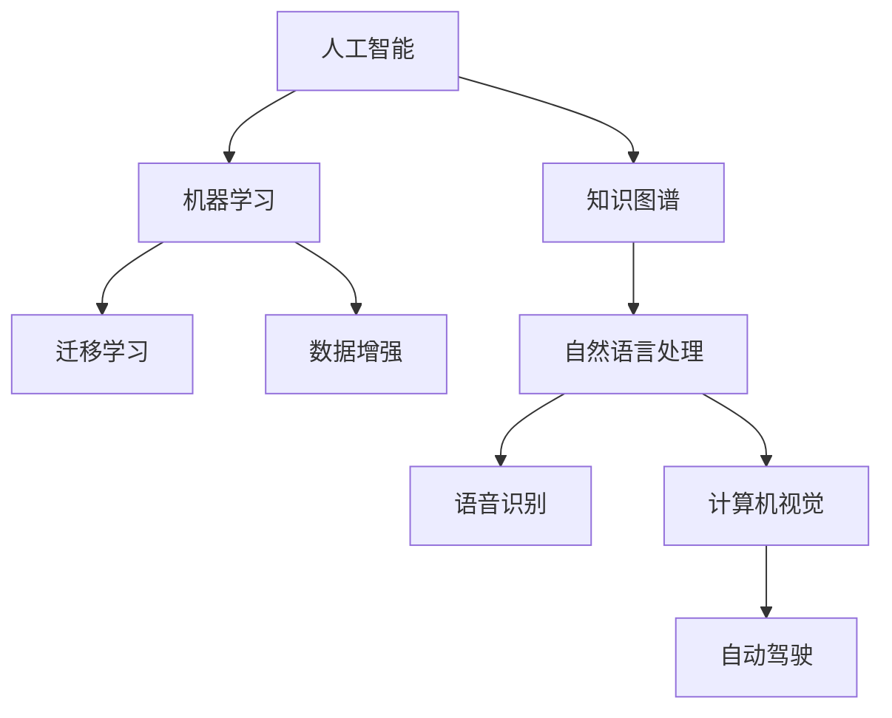

                 

# 人类知识的跨界融合：创新的乐土

## 1. 背景介绍

在当今信息爆炸的时代，知识的快速增长和不断跨界融合，为创新带来了前所未有的机遇。人工智能(AI)作为现代科技的前沿，已经成为推动知识融合、促进创新发展的关键驱动力。本文旨在探讨人类知识的跨界融合在AI领域的实践，以及如何将跨学科知识应用于技术创新中。

## 2. 核心概念与联系

### 2.1 核心概念概述

- **人工智能(AI)**：通过模拟人类智能行为，如感知、推理、学习等，实现自动化的复杂任务。
- **知识图谱(Knowledge Graph)**：一种结构化的语义知识表示方式，用于描述实体及其之间的关系。
- **机器学习(ML)**：使机器能够通过数据学习，自动提升性能的算法。
- **迁移学习(Transfer Learning)**：将一个领域学习到的知识迁移到另一个领域，以提升模型在新领域上的表现。
- **数据增强(Data Augmentation)**：通过对已有数据进行变换，生成更多训练样本，提升模型的泛化能力。

这些概念构成了AI创新的基石，通过它们之间的相互作用，推动了技术的不断进步和应用范围的拓展。

### 2.2 核心概念原理和架构的 Mermaid 流程图



## 3. 核心算法原理 & 具体操作步骤

### 3.1 算法原理概述

人类知识的跨界融合在AI领域主要通过知识图谱、迁移学习和数据增强等手段来实现。其中，知识图谱提供了结构化的语义信息，帮助AI系统更好地理解实体之间的关系；迁移学习通过迁移已有领域的经验，降低新任务的学习成本；数据增强则通过生成更多的训练数据，提升模型的泛化能力。

### 3.2 算法步骤详解

#### 3.2.1 知识图谱构建

- **数据收集**：收集不同领域的知识库，如维基百科、开放数据库等。
- **实体识别**：使用NLP技术识别文本中的实体，并将其映射到知识图谱中的节点。
- **关系抽取**：使用自然语言处理技术，抽取实体之间的关系，构建知识图谱的边。
- **图谱存储**：将知识图谱存储为图形数据库，便于查询和推理。

#### 3.2.2 迁移学习应用

- **领域适应**：选择与目标任务相关的预训练模型，如BERT、GPT等，对其进行微调。
- **特征提取**：将知识图谱中的结构化信息转化为模型输入的特征。
- **模型微调**：通过迁移学习的策略，将已有的领域经验迁移到新任务上，提升模型在新任务上的性能。

#### 3.2.3 数据增强技术

- **数据生成**：使用图像旋转、文本同义词替换等技术，生成更多的训练样本。
- **数据清洗**：对生成的数据进行去重、噪声过滤等处理，保证数据质量。
- **数据增强算法**：引入图像变换、文本清洗等算法，提升模型对噪声数据的鲁棒性。

### 3.3 算法优缺点

#### 3.3.1 优点

- **降低成本**：迁移学习可以通过已有的模型，减少新任务的训练成本。
- **提升泛化能力**：数据增强通过生成更多样本，提升模型的泛化能力，避免过拟合。
- **结构化知识融合**：知识图谱提供结构化的语义信息，帮助AI系统更好地理解实体之间的关系。

#### 3.3.2 缺点

- **知识图谱构建难度大**：知识图谱的构建需要大量的人工标注和处理，成本较高。
- **迁移学习需要预训练模型**：迁移学习依赖于已有预训练模型，对模型的选择和微调技术要求较高。
- **数据增强存在局限性**：数据增强生成的样本可能与实际数据存在差异，需要谨慎选择和处理。

### 3.4 算法应用领域

人类知识的跨界融合技术在多个领域得到了广泛应用，如：

- **医疗领域**：利用知识图谱和迁移学习技术，构建医疗知识库，辅助医生进行疾病诊断和治疗决策。
- **金融领域**：通过迁移学习和数据增强技术，提升金融风险评估和投资决策的准确性。
- **自动驾驶**：结合知识图谱和计算机视觉技术，提升自动驾驶系统的环境感知和决策能力。
- **智能客服**：利用自然语言处理和迁移学习技术，构建智能客服系统，提升客户服务体验。

## 4. 数学模型和公式 & 详细讲解

### 4.1 数学模型构建

以医疗领域的疾病诊断为例，构建一个基于知识图谱和迁移学习的数学模型：

- **输入**：病人的症状和历史数据。
- **输出**：病人的诊断结果。
- **知识图谱**：包含各种疾病的症状和特征，以及它们之间的关联。
- **迁移学习模型**：使用预训练的医学知识图谱模型，对病人的症状进行匹配和推理。

### 4.2 公式推导过程

假设输入为 $x$，输出为 $y$，知识图谱中的节点为 $v$，关系为 $e$。则模型的推理过程可以表示为：

- **节点嵌入**：将知识图谱中的节点 $v$ 转换为低维向量表示 $v_{\text{emb}}$。
- **关系投影**：将关系 $e$ 转换为矩阵 $A$，表示节点之间的关联权重。
- **图卷积网络**：使用图卷积网络(GCN)，将输入 $x$ 和节点嵌入 $v_{\text{emb}}$ 进行融合，得到融合后的特征表示 $h$。
- **推理输出**：通过逻辑回归等分类器，对融合后的特征 $h$ 进行分类，得到诊断结果 $y$。

### 4.3 案例分析与讲解

以一个简单的医疗知识图谱为例，分析模型在疾病诊断中的应用：

- **数据准备**：收集医生关于病人的症状记录和诊断结果，构建知识图谱。
- **模型训练**：使用迁移学习模型，对病人的症状进行匹配和推理，得到诊断结果。
- **结果验证**：将诊断结果与医生的实际诊断结果进行对比，评估模型的准确性。

## 5. 项目实践：代码实例和详细解释说明

### 5.1 开发环境搭建

在搭建开发环境时，需要以下工具：

- **Python**：作为主要开发语言。
- **TensorFlow**：用于模型的构建和训练。
- **PyTorch**：用于模型的构建和推理。
- **Graphviz**：用于可视化知识图谱。
- **Jupyter Notebook**：用于交互式编程和实验展示。

### 5.2 源代码详细实现

以下是一个简单的医疗诊断模型的代码实现：

```python
import tensorflow as tf
import pytorch as pt
from pytorch_geometric.nn import GCNConv

# 定义模型结构
class MedicalDiagnosisModel(pt.nn.Module):
    def __init__(self, input_dim, hidden_dim, output_dim):
        super(MedicalDiagnosisModel, self).__init__()
        self.gcn = GCNConv(input_dim, hidden_dim)
        self.fc = pt.nn.Linear(hidden_dim, output_dim)
        
    def forward(self, x, adj):
        x = self.gcn(x, adj)
        x = pt.nn.functional.relu(x)
        x = self.fc(x)
        return x

# 训练模型
model = MedicalDiagnosisModel(input_dim, hidden_dim, output_dim)
optimizer = pt.optim.Adam(model.parameters(), lr=0.001)

for epoch in range(num_epochs):
    for batch in train_data:
        x, adj, y = batch
        model.zero_grad()
        y_hat = model(x, adj)
        loss = pt.nn.functional.cross_entropy(y_hat, y)
        loss.backward()
        optimizer.step()

# 测试模型
test_loss = 0
correct = 0
total = 0
with pt.no_grad():
    for batch in test_data:
        x, adj, y = batch
        y_hat = model(x, adj)
        loss = pt.nn.functional.cross_entropy(y_hat, y)
        test_loss += loss.item()
        preds = y_hat.argmax(dim=1)
        correct += (preds == y).sum().item()
        total += y.size(0)
    
print(f"Test loss: {test_loss/len(test_data)}")
print(f"Accuracy: {correct/total}")
```

### 5.3 代码解读与分析

- **模型结构**：定义了包含GCN和全连接层的医疗诊断模型。
- **训练过程**：使用Adam优化器，对模型进行训练，计算损失并更新参数。
- **测试过程**：在测试集上计算模型损失和准确率。

## 6. 实际应用场景

### 6.4 未来应用展望

#### 6.4.1 医疗领域

- **精准医疗**：利用知识图谱和迁移学习技术，提供个性化的疾病诊断和治疗方案。
- **药物研发**：结合知识图谱和深度学习技术，加速新药物的研发进程。

#### 6.4.2 金融领域

- **风险评估**：通过迁移学习和数据增强技术，提升金融风险评估的准确性。
- **投资决策**：利用知识图谱和自然语言处理技术，优化投资策略。

#### 6.4.3 自动驾驶

- **环境感知**：结合知识图谱和计算机视觉技术，提升自动驾驶的环境感知能力。
- **决策优化**：利用知识图谱和强化学习技术，优化自动驾驶的决策过程。

## 7. 工具和资源推荐

### 7.1 学习资源推荐

- **Coursera**：提供多门关于人工智能、机器学习和知识图谱的在线课程。
- **Arxiv**：收集和发布最新的人工智能研究成果，是前沿研究的聚集地。
- **GitHub**：提供大量开源的AI项目和代码示例，便于学习和实践。

### 7.2 开发工具推荐

- **TensorFlow**：广泛用于深度学习模型的构建和训练。
- **PyTorch**：灵活高效的深度学习框架，支持动态图和静态图计算。
- **Graphviz**：可视化工具，用于展示知识图谱和模型结构。
- **Jupyter Notebook**：交互式编程环境，支持Python和R等语言的开发。

### 7.3 相关论文推荐

- **Knowledge Graph Embedding**：一种将知识图谱中的节点和关系映射到低维向量空间的技术。
- **Transfer Learning for Healthcare**：探讨迁移学习在医疗领域的应用，提升疾病诊断和治疗效果。
- **Data Augmentation in Machine Learning**：介绍数据增强技术，提升模型泛化能力。

## 8. 总结：未来发展趋势与挑战

### 8.1 研究成果总结

人类知识的跨界融合技术在AI领域的应用已经取得了显著的进展，特别是在医疗、金融、自动驾驶等领域展现了巨大的潜力。未来，随着知识图谱构建技术的发展和迁移学习、数据增强等技术的不断改进，AI将能够更好地融合人类知识，推动技术创新和应用的发展。

### 8.2 未来发展趋势

- **知识图谱的应用深化**：知识图谱将成为AI系统的重要组成部分，广泛应用于各领域。
- **迁移学习的广泛应用**：迁移学习技术将不断发展和改进，减少新任务的学习成本。
- **数据增强技术的革新**：数据增强技术将更加高效和灵活，提升模型的泛化能力。

### 8.3 面临的挑战

- **知识图谱的构建成本**：知识图谱的构建需要大量的人工标注和处理，成本较高。
- **迁移学习的效果提升**：如何在不同的领域间更好地进行迁移学习，提升迁移效果。
- **数据增强的生成质量**：如何生成更逼真的数据，提升模型的泛化能力。

### 8.4 研究展望

未来的研究需要重点关注以下几个方面：

- **知识图谱的自动化构建**：开发自动化的知识图谱构建技术，降低人工成本。
- **迁移学习的跨领域应用**：研究跨领域迁移学习技术，提升不同领域间的迁移效果。
- **数据增强的多样性**：开发更多样化的数据增强技术，提升模型的泛化能力。

## 9. 附录：常见问题与解答

**Q1: 知识图谱如何构建？**

A: 知识图谱的构建需要大量的领域知识和人工标注。首先，收集和整理领域内的知识，如文献、数据库等。然后，使用自然语言处理技术，自动提取实体和关系，构建知识图谱。

**Q2: 迁移学习在实际应用中需要注意哪些问题？**

A: 迁移学习需要选择合适的预训练模型和微调策略。同时，需要评估模型在新领域上的性能，避免出现偏差。此外，迁移学习的效果受到数据量和数据质量的影响，需要确保数据的多样性和代表性。

**Q3: 数据增强有哪些具体的方法？**

A: 数据增强包括图像旋转、文本同义词替换、噪声添加等。通过这些技术，生成更多的训练样本，提升模型的泛化能力。

---

作者：禅与计算机程序设计艺术 / Zen and the Art of Computer Programming

