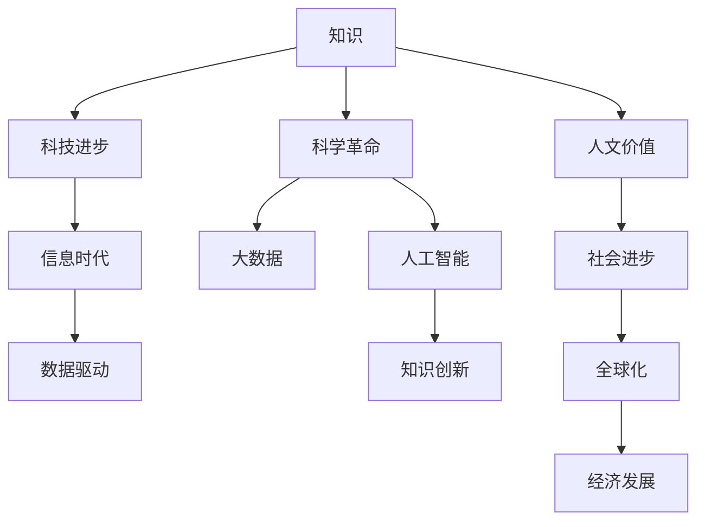

                 

# 人类知识的进步史：一部创新史

> 关键词：人类历史,知识进化,科技进步,人工智能,大数据,科学革命,数据驱动,信息时代

## 1. 背景介绍

### 1.1 问题由来

人类历史上的每一次知识突破，都极大地推动了社会的进步和科技的发展。从最早的农业革命到工业革命，再到信息革命，知识和技术的发展始终是推动人类文明演进的主要动力。

在当代，知识的获取和应用已经成为人类社会进步的关键。随着大数据、人工智能等新兴技术的发展，知识的产生、组织和应用方式也在不断演进，成为推动未来科技发展的重要引擎。

本文将通过回顾人类知识的历史发展，探索知识获取、存储和应用的不同阶段，揭示知识与科技、社会之间的关系。同时，也将重点讨论现代科技背景下，知识创新与科技发展之间的相互作用，以及未来科技发展趋势。

## 2. 核心概念与联系

### 2.1 核心概念概述

为更好地理解知识与科技的关系，本节将介绍几个关键概念及其相互关系：

- **知识(Knowledge)**：指人类对于世界运行规律的认识和理解，包括事实、概念、理论、技能等。
- **科技进步(Progress of Science and Technology)**：指人类在应用知识过程中，通过技术创新和应用，提高生产力、改善生活质量的过程。
- **科学革命(Scientific Revolution)**：指科学领域内，新的发现、理论和方法对旧有的认知体系产生颠覆性影响的过程。
- **数据驱动(Data-Driven)**：指利用大数据分析方法，从数据中提取知识，进行决策和预测的过程。
- **信息时代(Information Age)**：指以信息的生成、存储、传播和应用为基础的社会发展阶段，显著依赖于技术的进步和知识的创新。

这些概念之间的关系可以通过以下Mermaid流程图来展示：



这个流程图展示了几组关键概念之间的逻辑关系：

1. 知识作为人类对于世界运行规律的理解和认识，是科技进步的基础。
2. 科技进步是人类利用知识和创新驱动社会发展的直接体现。
3. 科学革命通过颠覆性的理论和技术革新，推动知识体系的更新和进步。
4. 大数据和人工智能技术为知识获取和应用提供了新的工具和方法。
5. 信息时代通过技术进步和知识创新，形成了新的社会发展模式。
6. 人文价值和科学价值的融合，推动社会进步和全球化发展。
7. 全球化经济和知识创新为经济发展提供了新的动力。

这些概念共同构成了人类知识与科技进步的宏观框架，展示了知识、科技和社会之间的相互作用。

## 3. 核心算法原理 & 具体操作步骤
### 3.1 算法原理概述

人类知识的发展历程，本质上是一系列算法和工具的演进过程。从早期的数学、物理等科学理论，到现代的大数据、人工智能等技术方法，每一步都在不断优化知识的获取、存储和应用方式。

具体而言，算法原理主要包括以下几个方面：

- **知识获取**：通过观察、实验、推理等方法，从自然界和社会中获取知识。
- **知识表示**：将知识以符号、图形、数据库等方式进行编码和存储。
- **知识推理**：通过逻辑、统计等方法，从已知知识中推导出新的知识。
- **知识应用**：将知识应用到实践中，通过技术创新提高生产力、改善生活质量。

### 3.2 算法步骤详解

以下将详细讲解知识获取和应用过程中的关键算法步骤：

**Step 1: 知识获取**
- **观察**：通过感官获取外部信息。
- **实验**：通过控制变量，观察因果关系。
- **推理**：根据已有知识，进行逻辑推理和归纳。
- **数据收集**：利用大数据技术，从互联网、社交媒体等平台获取数据。

**Step 2: 知识表示**
- **符号表示**：将知识以符号和逻辑公式进行编码。
- **数据库存储**：将知识存储在关系型数据库、NoSQL数据库中。
- **图形表示**：利用图数据库进行知识的图形化表示，方便推理和查询。

**Step 3: 知识推理**
- **逻辑推理**：利用逻辑代数，进行推理和验证。
- **统计推理**：利用概率统计方法，从数据中提取规律和知识。
- **归纳推理**：通过模型训练和预测，发现数据中的模式和关系。

**Step 4: 知识应用**
- **原型开发**：根据已有知识，设计技术原型。
- **技术实现**：利用编程语言和工具，实现技术原型。
- **模型训练**：利用大数据和人工智能技术，训练和优化模型。
- **应用部署**：将技术应用部署到实际系统中，实现商业价值。

### 3.3 算法优缺点

知识获取和应用过程中的算法，具有以下优缺点：

**优点**：
- **自动化和智能化**：通过算法可以自动化地获取、处理和应用知识，提高效率。
- **精度和可靠性**：算法可以量化和验证知识的正确性，减少人为误差。
- **可扩展性**：算法可以处理大规模数据，支持知识体系的不断扩展。

**缺点**：
- **依赖数据质量**：算法的效果高度依赖于数据的质量和完整性，低质量数据可能导致错误结论。
- **解释性不足**：一些算法模型（如深度学习）缺乏可解释性，难以理解其内部决策过程。
- **资源消耗大**：算法往往需要大量的计算资源和存储空间，成本较高。

### 3.4 算法应用领域

知识获取和应用过程中的算法，在多个领域得到了广泛应用：

- **科学研究**：通过算法获取实验数据和分析结果，推动科学进步。
- **医疗健康**：利用算法进行疾病诊断和个性化治疗，提高医疗水平。
- **金融服务**：通过算法进行风险控制和投资预测，优化金融决策。
- **工业制造**：通过算法进行质量控制和生产优化，提高生产效率。
- **智能家居**：利用算法实现智能控制和数据分析，提升生活品质。

此外，算法还被应用于更多新兴领域，如智慧城市、教育、环境保护等，推动各行业的智能化发展。

## 4. 数学模型和公式 & 详细讲解 & 举例说明

### 4.1 数学模型构建

在知识获取和应用过程中，数学模型扮演了重要的角色。以下将介绍几个常见的数学模型及其构建方法：

**线性回归模型**：
- 定义：$y = \theta_0 + \theta_1 x_1 + \cdots + \theta_n x_n + \epsilon$
- 原理：通过拟合数据集，找到最优的线性组合参数，预测新的数据点。
- 应用：经济预测、股票分析等。

**决策树模型**：
- 定义：通过一系列的决策节点，将数据集分为不同的类别。
- 原理：基于特征重要性，逐步划分数据集，找到最优的决策路径。
- 应用：分类、回归等。

**神经网络模型**：
- 定义：由多个神经元组成的网络，通过反向传播算法训练模型参数。
- 原理：通过多层非线性映射，逐步提取数据特征，进行分类和预测。
- 应用：图像识别、语音识别、自然语言处理等。

### 4.2 公式推导过程

以下将详细推导几种常见数学模型的公式：

**线性回归模型推导**：
- 假设数据集为 $(x_i, y_i), i=1,\cdots,N$，其中 $x_i$ 为自变量，$y_i$ 为因变量。
- 定义回归系数 $\theta = [\theta_0, \theta_1, \cdots, \theta_n]^T$，则模型为 $y = \theta_0 + \theta_1 x_1 + \cdots + \theta_n x_n$
- 最小二乘法求解回归系数 $\theta$，即最小化损失函数 $J(\theta) = \frac{1}{2N} \sum_{i=1}^N (y_i - \theta_0 - \theta_1 x_{1,i} - \cdots - \theta_n x_{n,i})^2$
- 通过求导和求解，得到最优回归系数 $\theta = (X^TX)^{-1}X^Ty$，其中 $X = [1, x_{1,1}, \cdots, x_{n,1}, x_{1,2}, \cdots, x_{n,N}]$

**决策树模型推导**：
- 假设数据集为 $(x_i, y_i), i=1,\cdots,N$，其中 $x_i$ 为特征向量，$y_i$ 为标签。
- 定义决策树节点 $T = (x, y, R, L, R)$，其中 $x$ 为特征，$y$ 为标签，$R$ 为子节点列表，$L$ 为子节点特征索引。
- 定义信息增益 $Gain(X, D) = \sum_{i=1}^N p_i \log \frac{p_i}{\sum_{j=1}^N p_j}$
- 通过信息增益选择最优特征 $x_k$，递归构建决策树。

**神经网络模型推导**：
- 定义输入层 $x = [x_1, x_2, \cdots, x_n]^T$，输出层 $y = [y_1, y_2, \cdots, y_m]^T$
- 定义神经网络参数 $\theta = [\theta_1^T, \theta_2^T, \cdots, \theta_l^T]$，其中 $\theta_i = [w_i, b_i]$，$w_i$ 为权重矩阵，$b_i$ 为偏置向量
- 定义神经元激活函数 $f(z) = \sigma(z)$，其中 $\sigma(z) = \frac{1}{1 + \exp(-z)}$
- 定义损失函数 $L(y, \hat{y}) = \frac{1}{2N} \sum_{i=1}^N (y_i - \hat{y}_i)^2$
- 通过反向传播算法更新参数 $\theta$，最小化损失函数

### 4.3 案例分析与讲解

以图像识别为例，详细讲解深度神经网络模型在实际应用中的推导和实现。

**模型推导**：
- 假设数据集为 $\{x_i\}, i=1,\cdots,N$，其中 $x_i$ 为图像像素向量。
- 定义卷积层 $\mathcal{F}_{conv} = \mathcal{F}_{conv} * x_i + b_i$
- 定义池化层 $\mathcal{F}_{pool} = \max_{i=1}^{n} \mathcal{F}_{conv}$
- 定义全连接层 $\mathcal{F}_{fc} = \theta x$
- 定义输出层 $\mathcal{F}_{out} = \sigma(\mathcal{F}_{fc})$
- 定义损失函数 $L(y, \hat{y}) = \frac{1}{N} \sum_{i=1}^N \mathbb{I}(y_i \neq \hat{y}_i)$

**模型实现**：
- 使用Python和TensorFlow库实现卷积神经网络模型。
- 加载数据集，进行预处理和批处理。
- 定义模型结构，包括卷积层、池化层、全连接层和输出层。
- 定义损失函数和优化器。
- 训练模型，调整超参数。
- 测试模型，评估性能。

通过以上步骤，可以实现图像识别任务的高效处理。

## 5. 项目实践：代码实例和详细解释说明
### 5.1 开发环境搭建

在进行深度神经网络项目实践前，我们需要准备好开发环境。以下是使用Python进行TensorFlow开发的环境配置流程：

1. 安装Anaconda：从官网下载并安装Anaconda，用于创建独立的Python环境。

2. 创建并激活虚拟环境：
```bash
conda create -n tensorflow-env python=3.8 
conda activate tensorflow-env
```

3. 安装TensorFlow：根据CUDA版本，从官网获取对应的安装命令。例如：
```bash
conda install tensorflow -c tensorflow -c conda-forge
```

4. 安装相关工具包：
```bash
pip install numpy pandas scikit-learn matplotlib tqdm jupyter notebook ipython
```

完成上述步骤后，即可在`tensorflow-env`环境中开始项目实践。

### 5.2 源代码详细实现

以下以图像识别项目为例，给出使用TensorFlow实现卷积神经网络模型的PyTorch代码实现。

```python
import tensorflow as tf
from tensorflow.keras import datasets, layers, models

# 加载数据集
(train_images, train_labels), (test_images, test_labels) = datasets.cifar10.load_data()

# 数据预处理
train_images, test_images = train_images / 255.0, test_images / 255.0

# 构建模型
model = models.Sequential()
model.add(layers.Conv2D(32, (3, 3), activation='relu', input_shape=(32, 32, 3)))
model.add(layers.MaxPooling2D((2, 2)))
model.add(layers.Conv2D(64, (3, 3), activation='relu'))
model.add(layers.MaxPooling2D((2, 2)))
model.add(layers.Conv2D(64, (3, 3), activation='relu'))
model.add(layers.Flatten())
model.add(layers.Dense(64, activation='relu'))
model.add(layers.Dense(10))

# 编译模型
model.compile(optimizer='adam',
              loss=tf.keras.losses.SparseCategoricalCrossentropy(from_logits=True),
              metrics=['accuracy'])

# 训练模型
history = model.fit(train_images, train_labels, epochs=10, 
                    validation_data=(test_images, test_labels))

# 测试模型
test_loss, test_acc = model.evaluate(test_images, test_labels)
print('Test accuracy:', test_acc)
```

### 5.3 代码解读与分析

让我们再详细解读一下关键代码的实现细节：

**数据加载和预处理**：
- 使用TensorFlow内置的CIFAR-10数据集，加载训练集和测试集。
- 对数据进行归一化处理，将像素值压缩到[0,1]范围内。

**模型构建**：
- 使用Sequential模型，定义多个卷积层和池化层，构建卷积神经网络。
- 最后添加两个全连接层，输出10个类别的概率分布。

**模型编译和训练**：
- 编译模型时设置优化器和损失函数。
- 使用fit方法训练模型，指定训练轮数。
- 在每个epoch结束后，记录验证集的准确率。

**模型评估**：
- 使用evaluate方法评估模型在测试集上的性能。
- 打印测试集上的准确率。

可以看到，TensorFlow提供了丰富的工具和API，可以方便地实现深度神经网络模型。通过组合不同的层和激活函数，可以构建各种复杂的神经网络模型，满足不同应用场景的需求。

## 6. 实际应用场景
### 6.1 医疗健康

在大数据和深度学习技术推动下，医疗健康领域得到了显著的提升。以下详细讲解深度学习技术在医疗健康中的应用：

**疾病诊断**：
- 利用深度学习模型，对医学影像（如X光片、CT、MRI等）进行自动分析和诊断。
- 通过卷积神经网络，提取影像特征，识别病灶和病变区域。
- 在肺结节检测、乳腺癌诊断等任务上取得了不错的效果。

**个性化治疗**：
- 利用深度学习模型，分析患者的基因数据和病史，制定个性化的治疗方案。
- 通过多模态学习，结合基因、影像、文本等多源数据，提高诊断和治疗的准确性。
- 在基因组学、临床试验、药物研发等方面，展示了巨大的潜力。

**智能医疗设备**：
- 利用深度学习模型，开发智能医疗设备，如智能影像分析系统、电子病历系统等。
- 通过自然语言处理技术，自动生成医疗报告和诊断摘要，提升医生的工作效率。
- 在健康管理、远程医疗等方面，实现了智能化和个性化。

**公共卫生**：
- 利用深度学习模型，分析公共卫生数据，预测疫情传播和流行趋势。
- 通过时间序列分析和异常检测，早期发现和防控传染病。
- 在流行病学研究、疾病监测、应急响应等方面，提供了有力支持。

### 6.2 金融服务

金融服务领域，深度学习技术已经广泛应用于风险控制、投资决策等方面：

**风险控制**：
- 利用深度学习模型，分析客户的信用数据和行为数据，预测其信用风险。
- 通过深度学习模型，识别异常交易和欺诈行为，提升风控模型的准确性和效率。
- 在信用评分、贷款审批、反欺诈检测等方面，展示了强大的能力。

**投资决策**：
- 利用深度学习模型，分析股票、债券等金融资产的历史数据，预测市场趋势。
- 通过深度学习模型，进行量化投资，优化投资组合，提升收益。
- 在金融市场分析、量化交易、算法交易等方面，提供了新的思路和工具。

**智能客服**：
- 利用深度学习模型，开发智能客服系统，自动回答客户咨询和处理问题。
- 通过自然语言处理技术，分析客户的意图和需求，提供个性化的服务。
- 在客户关系管理、销售自动化、客户支持等方面，实现了智能化和效率提升。

### 6.3 智慧城市

智慧城市是城市信息化的高级阶段，深度学习技术在其中发挥了重要的作用：

**智能交通**：
- 利用深度学习模型，分析交通流量和道路情况，优化交通信号控制和路线规划。
- 通过视频监控和图像识别技术，实时监测交通状况，减少拥堵。
- 在智能交通系统、智能导航、智能停车等方面，提高了城市的运行效率和安全性。

**公共安全**：
- 利用深度学习模型，分析视频监控数据，识别和跟踪可疑行为。
- 通过人脸识别、车辆识别等技术，提高公共安全防范水平。
- 在城市安防、应急响应、智能监控等方面，实现了智能化和实时化。

**环境监测**：
- 利用深度学习模型，分析环境监测数据，预测天气变化和空气质量。
- 通过图像识别和遥感技术，监测自然灾害和环境污染。
- 在智慧环保、智慧农业、智慧水利等方面，提供了有力的支持。

## 7. 工具和资源推荐
### 7.1 学习资源推荐

为了帮助开发者系统掌握深度学习技术的应用，这里推荐一些优质的学习资源：

1. **《深度学习》（Ian Goodfellow等著）**：系统介绍了深度学习的基本原理、算法和应用，是深度学习领域的经典教材。
2. **CS231n《卷积神经网络》课程**：斯坦福大学开设的深度学习课程，详细讲解了卷积神经网络、图像分类等经典任务。
3. **Kaggle竞赛**：全球知名的数据科学竞赛平台，涵盖各种深度学习项目和应用场景，可以锻炼实战能力。
4. **PyTorch官方文档**：PyTorch深度学习框架的官方文档，提供了丰富的教程和示例代码。
5. **DeepLearning.AI的深度学习专项课程**：由吴恩达教授主讲的深度学习课程，涵盖深度学习的基本原理和应用。

通过对这些资源的学习实践，相信你一定能够快速掌握深度学习技术的精髓，并用于解决实际的业务问题。

### 7.2 开发工具推荐

高效的开发离不开优秀的工具支持。以下是几款用于深度学习开发的常用工具：

1. **PyTorch**：基于Python的开源深度学习框架，灵活动态的计算图，适合快速迭代研究。
2. **TensorFlow**：由Google主导开发的开源深度学习框架，生产部署方便，适合大规模工程应用。
3. **Keras**：高层次的深度学习API，可以简化模型设计和训练过程，适合快速原型开发。
4. **MXNet**：灵活高效的深度学习框架，支持多种编程语言和硬件平台，适合复杂工程应用。
5. **Caffe**：高效的深度学习框架，适合图像识别和计算机视觉任务。

合理利用这些工具，可以显著提升深度学习任务的开发效率，加快创新迭代的步伐。

### 7.3 相关论文推荐

深度学习技术的发展源于学界的持续研究。以下是几篇奠基性的相关论文，推荐阅读：

1. **AlexNet**：ImageNet 2012比赛的冠军模型，奠定了卷积神经网络在图像识别领域的应用基础。
2. **Inception**：Google提出的多尺度卷积神经网络，提升了深度学习模型的效率和效果。
3. **ResNet**：Microsoft提出的深度残差网络，解决了深度网络训练中的梯度消失问题，实现了非常深的神经网络。
4. **AlphaGo**：DeepMind开发的深度强化学习模型，在围棋比赛中战胜了世界冠军，展示了深度学习在复杂决策中的应用。
5. **BERT**：Google提出的预训练语言模型，通过自监督学习任务，提升了语言模型的通用表示能力。

这些论文代表了大数据和深度学习技术的发展脉络。通过学习这些前沿成果，可以帮助研究者把握学科前进方向，激发更多的创新灵感。

## 8. 总结：未来发展趋势与挑战
### 8.1 研究成果总结

本文通过回顾人类知识的历史发展，探索知识获取、存储和应用的不同阶段，揭示了知识与科技、社会之间的关系。同时，详细讲解了深度学习技术在医疗健康、金融服务、智慧城市等实际应用中的具体应用，展示了深度学习技术的强大潜力。

通过本文的系统梳理，可以看到，深度学习技术已经成为推动科技进步和社会发展的重要引擎。未来的研究需要在以下几个方面寻求新的突破：

### 8.2 未来发展趋势

1. **多模态学习**：深度学习技术将逐步向多模态学习发展，结合图像、语音、文本等多种数据源，提升模型的综合理解能力。
2. **自监督学习**：通过自监督学习，利用无标签数据进行预训练，减少对标注数据的依赖，提升模型的泛化能力。
3. **迁移学习**：通过迁移学习，将预训练模型迁移到新的任务和领域，提高模型的适应性和效率。
4. **联邦学习**：通过联邦学习，分布式地训练模型，保护数据隐私，提升模型的安全性和可靠性。
5. **边缘计算**：通过边缘计算，将深度学习模型部署到智能设备和物联网中，实现本地推理和实时响应。
6. **模型压缩**：通过模型压缩，减少模型的参数量和计算量，提升模型的部署效率和资源利用率。

### 8.3 面临的挑战

尽管深度学习技术取得了瞩目成就，但在迈向更加智能化、普适化应用的过程中，它仍面临着诸多挑战：

1. **数据质量与隐私保护**：深度学习模型的效果高度依赖于数据的质量和隐私保护，如何获取高质量的数据，保护用户隐私，是重要挑战。
2. **模型可解释性**：深度学习模型的内部决策过程缺乏可解释性，难以理解其推理逻辑，如何提高模型的可解释性，是关键问题。
3. **资源消耗与计算效率**：深度学习模型需要大量的计算资源和存储空间，如何优化模型结构，提高计算效率，是工程实践的难点。
4. **模型鲁棒性与泛化能力**：深度学习模型在处理复杂任务时，容易出现过拟合和泛化能力不足的问题，如何提高模型的鲁棒性和泛化能力，是研究重点。
5. **模型公平性与偏见**：深度学习模型可能会学习到数据中的偏见和歧视，如何消除模型偏见，提高公平性，是伦理和安全的重要考量。

### 8.4 研究展望

面对深度学习技术面临的挑战，未来的研究需要在以下几个方面寻求新的突破：

1. **多源数据融合**：将符号化的先验知识，如知识图谱、逻辑规则等，与深度学习模型进行融合，提高模型的综合理解能力。
2. **因果推理**：将因果推理方法引入深度学习模型，增强模型的解释性和逻辑性，提升模型的决策能力。
3. **强化学习**：通过强化学习，使深度学习模型在复杂环境中进行智能决策，提升模型的自主性和适应性。
4. **自适应学习**：开发自适应学习算法，使深度学习模型能够根据环境变化进行动态调整，提升模型的灵活性和鲁棒性。
5. **联邦学习**：通过联邦学习，分布式地训练深度学习模型，保护数据隐私，提升模型的安全性。

这些研究方向将引领深度学习技术迈向更高的台阶，为构建安全、可靠、可解释、可控的智能系统铺平道路。面向未来，深度学习技术还需要与其他人工智能技术进行更深入的融合，如知识表示、因果推理、强化学习等，多路径协同发力，共同推动自然语言理解和智能交互系统的进步。只有勇于创新、敢于突破，才能不断拓展深度学习模型的边界，让智能技术更好地造福人类社会。

## 9. 附录：常见问题与解答

**Q1：深度学习技术是否适用于所有应用场景？**

A: 深度学习技术在许多应用场景中已经取得了显著效果，但并不是所有应用都适合使用深度学习。对于一些简单和规则明确的任务，传统的统计方法和机器学习算法可能更为合适。此外，深度学习模型对于数据质量、计算资源和工程实现要求较高，需要根据具体情况进行评估和选择。

**Q2：深度学习技术面临哪些挑战？**

A: 深度学习技术面临的挑战主要包括以下几个方面：
1. 数据质量与隐私保护：深度学习模型高度依赖于数据的质量和隐私保护，如何获取高质量数据，保护用户隐私，是重要挑战。
2. 模型可解释性：深度学习模型的内部决策过程缺乏可解释性，难以理解其推理逻辑，如何提高模型的可解释性，是关键问题。
3. 资源消耗与计算效率：深度学习模型需要大量的计算资源和存储空间，如何优化模型结构，提高计算效率，是工程实践的难点。
4. 模型鲁棒性与泛化能力：深度学习模型在处理复杂任务时，容易出现过拟合和泛化能力不足的问题，如何提高模型的鲁棒性和泛化能力，是研究重点。
5. 模型公平性与偏见：深度学习模型可能会学习到数据中的偏见和歧视，如何消除模型偏见，提高公平性，是伦理和安全的重要考量。

**Q3：如何优化深度学习模型的性能？**

A: 优化深度学习模型性能可以从以下几个方面入手：
1. 数据预处理：进行数据清洗、归一化、增强等操作，提高数据质量。
2. 模型结构设计：合理设计网络结构，避免过拟合和泛化能力不足的问题。
3. 超参数调优：通过网格搜索、贝叶斯优化等方法，优化模型超参数。
4. 正则化技术：使用L2正则、Dropout等方法，提高模型的鲁棒性。
5. 优化器选择：选择合适的优化器，如Adam、SGD等，并调整学习率和学习率衰减策略。
6. 模型压缩：通过量化、剪枝、蒸馏等方法，减少模型参数量和计算量。

通过以上步骤，可以显著提升深度学习模型的性能和泛化能力。

**Q4：如何保护深度学习模型的隐私？**

A: 保护深度学习模型的隐私可以从以下几个方面入手：
1. 数据加密：在数据传输和存储过程中，使用加密技术保护数据隐私。
2. 差分隐私：通过在数据中加入噪声，限制模型对个体数据的依赖，保护用户隐私。
3. 联邦学习：通过分布式训练模型，避免将数据集中存储在单一服务器中，保护数据隐私。
4. 匿名化处理：通过去除或模糊化敏感信息，保护用户隐私。

通过以上方法，可以有效地保护深度学习模型的隐私，保护用户数据安全。

---

作者：禅与计算机程序设计艺术 / Zen and the Art of Computer Programming

