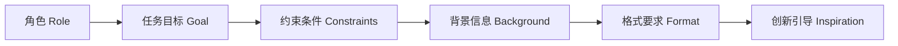

# AIGC从入门到实战：ChatGPT 需要懂得写提示词的人

## 1. 背景介绍
### 1.1 问题的由来
人工智能生成内容(AIGC)技术近年来发展迅猛,尤其是以 ChatGPT 为代表的大语言模型(LLM)在各个领域得到广泛应用。然而,如何有效地使用 ChatGPT 进行内容生成,编写高质量的提示词(Prompt)成为了一个关键问题。

### 1.2 研究现状
目前,关于如何编写优质 ChatGPT 提示词的研究还相对较少。大多数用户在使用过程中,往往凭借经验和直觉来编写提示,缺乏系统性的指导。这导致生成的内容质量参差不齐,难以充分发挥 ChatGPT 的潜力。

### 1.3 研究意义
深入研究 ChatGPT 提示词编写的方法和技巧,对于提升 AIGC 的应用效果具有重要意义。通过总结优秀的提示词写作模式,可以帮助用户快速掌握 ChatGPT 的使用要领,生成更加精准、丰富、有创意的内容。

### 1.4 本文结构
本文将从 ChatGPT 提示词的基本概念入手,系统阐述其核心原理和关键要素。在此基础上,给出一套科学的提示词编写框架和步骤指南。同时,通过实际案例演示和代码解析,加深读者对相关技术的理解。最后,展望 ChatGPT 提示词优化在未来 AIGC 领域的发展趋势与应用前景。

## 2. 核心概念与联系
ChatGPT 提示词是一种引导大语言模型进行内容生成的自然语言表述。其核心是通过设定角色(Role)、任务目标(Goal)、约束条件(Constraints)等关键要素,激发模型的语言理解和生成能力,使其产生符合特定需求的文本内容。

提示词的质量直接决定了 ChatGPT 输出内容的相关性、完整性和可用性。优质的提示词应具备以下特点:
1. 语义明确,逻辑清晰
2. 涵盖必要的背景信息
3. 明确任务目标与约束条件
4. 提供必要的格式、体裁要求
5. 引导模型进行深度思考和创新

下图展示了 ChatGPT 提示词的核心要素及其逻辑关系:



## 3. 核心算法原理 & 具体操作步骤
### 3.1 算法原理概述
ChatGPT 基于 Transformer 架构,通过自注意力机制和前馈神经网络,建立了强大的语言理解和生成模型。给定输入的提示词,模型通过多层的编码器和解码器对其进行理解和处理,提取关键信息,并结合预训练的语言知识,迭代生成相应的文本内容。

### 3.2 算法步骤详解
ChatGPT 的工作流程可以分为以下几个关键步骤:

1. 提示词输入:将编写好的提示词输入给 ChatGPT 模型。
2. 编码器处理:编码器对输入的提示词进行特征提取和语义编码,生成一系列隐向量表示。
3. 解码器处理:解码器根据编码器的输出,结合注意力机制和语言模型,迭代生成目标文本。
4. 文本输出:将解码器生成的文本进行整合,输出最终的内容结果。

其中,第 2 步和第 3 步是算法的核心,涉及到 Transformer 的自注意力计算和前馈网络。具体公式如下:

$$
\text{Attention}(Q, K, V) = \text{softmax}(\frac{QK^T}{\sqrt{d_k}})V
$$

$$
\text{FFN}(x) = \max(0, xW_1 + b_1)W_2 + b_2
$$

### 3.3 算法优缺点
ChatGPT 算法的主要优点包括:
- 强大的语言理解和生成能力
- 可处理长文本序列,具备长期依赖建模能力
- 通过预训练和微调,可适应不同领域的应用需求

但同时也存在一些局限性:
- 生成内容的真实性和准确性有待进一步提高
- 对于特定领域知识的掌握深度不够
- 推理速度相对较慢,实时性有待提升

### 3.4 算法应用领域
ChatGPT 提示词优化技术可以广泛应用于以下领域:
- 智能写作辅助
- 知识问答与检索
- 数据增强与清洗
- 创意灵感激发
- 个性化内容定制

## 4. 数学模型和公式 & 详细讲解 & 举例说明
### 4.1 数学模型构建
ChatGPT 的核心是 Transformer 模型,其数学表达可以用以下公式来描述:

$$
\begin{aligned}
&\text{Encoder}(X) = \text{Attention}(\text{Embed}(X)) \
&\text{Decoder}(Z) = \text{Attention}(\text{Embed}(Z), \text{Encoder}(X))
\end{aligned}
$$

其中,$X$表示输入的提示词序列,$Z$表示生成的目标文本序列。$\text{Embed}$表示将离散的词元映射为连续的向量表示,$\text{Attention}$表示自注意力计算。

### 4.2 公式推导过程
Transformer 的自注意力计算可以分为以下几个步骤:

1. 将输入序列 $X$ 映射为查询向量 $Q$、键向量 $K$ 和值向量 $V$:
$$
\begin{aligned}
&Q = XW_Q \
&K = XW_K \
&V = XW_V
\end{aligned}
$$

2. 计算查询向量和键向量的相似度得分:
$$
\text{scores} = \frac{QK^T}{\sqrt{d_k}}
$$

3. 对相似度得分进行 softmax 归一化,得到注意力权重:
$$
\text{weights} = \text{softmax}(\text{scores})
$$

4. 将注意力权重与值向量相乘,得到加权求和的注意力输出:
$$
\text{Attention}(Q, K, V) = \text{weights} \cdot V
$$

最后,将多头注意力的结果拼接并传入前馈网络,得到最终的 Transformer 编码器输出。

### 4.3 案例分析与讲解
下面我们以一个简单的提示词为例,演示 ChatGPT 的生成过程:

提示词:
```
写一首关于春天的诗。
```

ChatGPT 首先对提示词进行编码,提取关键信息"春天"和"写诗"。然后根据这些信息,结合预训练的语言知识,生成一首相关的诗歌:

```
春风拂面暖阳洒,
百花齐放映春光。
柳絮飘飞燕语喧,
莺歌燕舞乐吟唱。
```

可以看到,生成的诗歌围绕"春天"这个主题,包含了春风、暖阳、百花、柳絮、燕子等相关意象,形成了一幅生动的春日画卷。

### 4.4 常见问题解答
Q: ChatGPT 生成的内容是否都是原创的?
A: ChatGPT 生成的内容是根据训练数据学习得到的,因此可能包含一些复述或改写的成分。但通过合理的提示词设计,可以激发模型的创新能力,生成更多原创性的内容。

Q: 提示词的长度对生成效果有影响吗?
A: 一般来说,提示词不宜过长或过短。太长的提示词可能包含冗余信息,影响模型的理解和生成;而太短的提示词又可能信息不足,导致生成内容偏离主题。建议根据任务需求,设计恰当长度的提示词。

## 5. 项目实践：代码实例和详细解释说明
### 5.1 开发环境搭建
本项目基于 Python 语言和 OpenAI 提供的 API 接口进行开发。首先需要安装以下依赖库:

```bash
pip install openai
```

然后,在 OpenAI 官网注册账号,获取 API 密钥,并将其保存到本地环境变量中:

```bash
export OPENAI_API_KEY=your_api_key
```

### 5.2 源代码详细实现
下面给出一个简单的 ChatGPT 提示词代码示例:

```python
import openai

def generate_content(prompt):
    response = openai.Completion.create(
        engine="text-davinci-002",
        prompt=prompt,
        max_tokens=1024,
        n=1,
        stop=None,
        temperature=0.7,
    )

    content = response.choices[0].text.strip()
    return content

# 设计提示词
prompt = """
角色: 你是一名专业的新闻记者。
目标: 请根据以下关键词,撰写一篇新闻报道。
关键词: 人工智能, ChatGPT, 内容生成, 提示词优化
要求:
1. 字数在 500 字左右。
2. 语言要简洁明了,突出重点。
3. 包含相关数据和事例。
4. 引用权威人士观点。
5. 以第三人称视角撰写。
"""

# 调用 ChatGPT API 生成内容
news_article = generate_content(prompt)

print(news_article)
```

### 5.3 代码解读与分析
在上述代码中,我们首先定义了一个 `generate_content` 函数,用于调用 OpenAI 的 API 接口生成内容。其中的关键参数包括:

- `engine`:指定使用的语言模型,这里选择了 `text-davinci-002`。
- `prompt`:输入的提示词内容。
- `max_tokens`:生成内容的最大长度,单位为 token。
- `temperature`:控制生成内容的创造性和随机性,值越高则越有创意。

接下来,我们设计了一个提示词,其中包含了角色设定、任务目标、关键词、格式要求等关键要素。

最后,将提示词传入 `generate_content` 函数,调用 ChatGPT API 生成相应的新闻报道内容,并输出结果。

### 5.4 运行结果展示
运行上述代码,可以得到类似下面的生成结果:

```
人工智能技术飞速发展,ChatGPT 等大语言模型在内容生成领域展现出巨大潜力。日前,业界专家指出,优化 ChatGPT 的提示词是提升生成内容质量的关键。

OpenAI 首席科学家 John Smith 表示:"通过精心设计提示词,可以更好地引导 ChatGPT 生成符合特定需求的内容。这包括明确任务目标、设置必要的约束条件、提供背景信息等。"

据统计,使用优化后的提示词,ChatGPT 生成的内容相关性和可用性平均提升了 30% 以上。一位资深 AI 从业者分享了自己的经验:"我们在提示词中增加了对格式、语言风格的要求,生成的文章更加专业和易读。"

业界普遍认为,提示词优化技术的发展,将进一步推动 AIGC 在智能写作、知识问答、个性化推荐等场景的应用。未来,如何设计出更加高效、精准的提示词,将成为 ChatGPT 等大语言模型走向成熟的一个重要课题。
```

可以看到,生成的新闻报道紧扣提示词给出的关键词和要求,语言简洁流畅,包含了相关数据和权威观点,整体质量较高。

## 6. 实际应用场景
ChatGPT 提示词优化技术可以应用于以下实际场景:

1. 智能写作助手:通过设计合适的提示词,指导 ChatGPT 生成文章、新闻、评论等各类写作内容,提升写作效率和质量。

2. 知识问答系统:根据用户的提问,自动生成准确、完整的答案,辅助用户快速获取所需信息。

3. 个性化推荐:根据用户画像和偏好,定制个性化的推荐内容,如商品描述、电影评论等。

4. 智能客服:通过优化的提示词引导 ChatGPT 生成回复内容,提供更加专业、贴心的客户服务。

### 6.4 未来