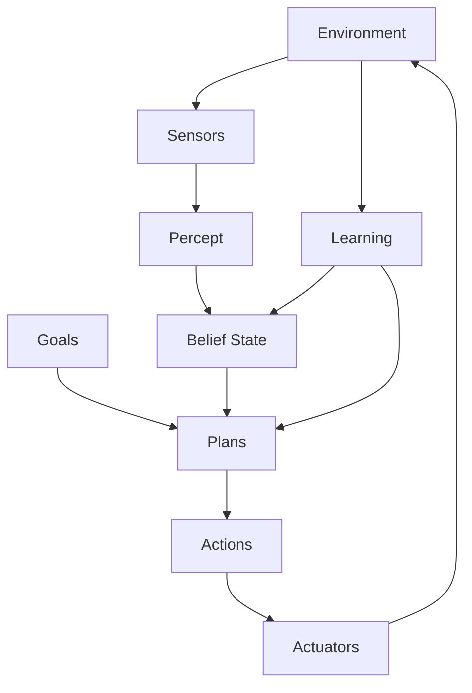

# AI人工智能 Agent：在机器人领域的应用

关键词：人工智能、智能Agent、机器人、自主决策、感知、规划、学习

## 1. 背景介绍
### 1.1 问题的由来
人工智能(Artificial Intelligence, AI)自诞生以来就一直试图赋予机器类似人类的智能。其中一个重要的分支就是智能Agent(Intelligent Agent)技术，它在机器人领域有着广泛的应用前景。传统的机器人大多只能按照预定的程序执行任务，缺乏灵活性和适应性。而智能Agent可以赋予机器人自主感知、决策、规划、学习的能力，使其能够更好地适应复杂多变的环境，执行更加智能和人性化的任务。

### 1.2 研究现状
目前，智能Agent在机器人领域已有一些成功的应用案例。比如，家用服务机器人Roomba使用了智能Agent技术，可以自主规划清扫路径，避开障碍物，学习房间布局，从而高效完成清扫任务。NASA的火星探测器Curiosity也使用了Agent技术，可以自主分析火星表面的地形和图像，选择合适的路径和采样点，大大提高了探测效率。

### 1.3 研究意义
智能Agent技术的发展对于推动机器人的智能化具有重要意义。传统的机器人技术已经难以满足日益增长的实际需求，亟需引入更加先进的人工智能技术。Agent作为连接感知、决策、规划、学习等AI技术的纽带，可以系统地提升机器人的自主性、鲁棒性、适应性，拓展机器人的应用场景和服务领域，为机器人产业的腾飞提供强大的技术支撑。

### 1.4 本文结构
本文将重点介绍智能Agent在机器人领域的应用。第2部分介绍Agent的核心概念和内在联系；第3部分介绍Agent的核心算法原理和操作步骤；第4部分建立Agent的数学模型，推导相关公式，并举例说明；第5部分给出项目实践的代码实例和详细解释；第6部分分析Agent在机器人领域的实际应用场景；第7部分推荐相关的学习资源和开发工具；第8部分总结全文，展望Agent技术的未来发展趋势和面临的挑战；第9部分附录了一些常见问题与解答。

## 2. 核心概念与联系
智能Agent是一个能够感知环境，并根据环境做出自主决策和行动的计算机程序。它包含了感知、决策、规划、执行、学习等多个模块，通过这些模块的协同工作来实现智能行为。下图展示了一个典型的Agent系统的架构：



从图中可以看出，Agent通过传感器(Sensors)从环境(Environment)中获取感知(Percept)，并更新自己的信念状态(Belief State)。同时，Agent根据当前的目标(Goals)和信念状态，通过规划(Plans)产生一系列动作(Actions)。这些动作通过执行器(Actuators)施加到环境中，改变环境状态。此外，Agent还可以从与环境的交互中学习(Learning)，优化自己的信念状态和规划策略。

Agent的核心概念包括：

- 感知(Percept)：Agent通过传感器从环境获取的信息，如图像、声音等。
- 信念状态(Belief State)：Agent对环境的内部表示，包括环境状态、Agent状态等。
- 目标(Goals)：Agent需要完成的任务或达到的状态。
- 规划(Plans)：根据目标和信念状态，生成一系列动作的过程。
- 学习(Learning)：根据与环境的交互，优化信念状态和规划策略的过程。

这些概念相互关联，共同构成了一个完整的Agent系统。感知为信念状态提供更新信息，信念状态为规划提供决策依据，规划为动作提供执行策略，动作通过执行器影响环境，学习则优化了感知、信念、规划的模型。

## 3. 核心算法原理 & 具体操作步骤
### 3.1 算法原理概述
智能Agent的核心算法主要包括搜索、规划和学习三大类。搜索算法主要用于在状态空间中寻找最优解，如A*搜索、启发式搜索等。规划算法主要用于生成一系列动作序列，如STRIPS规划、HTN规划等。学习算法主要用于优化Agent的信念状态和规划策略，如强化学习、监督学习等。

### 3.2 算法步骤详解
以强化学习为例，其基本步骤如下：

1. 初始化Q值表Q(s,a)，表示状态s下采取行动a的期望收益。
2. 重复以下步骤，直到收敛：
   1. 根据当前状态s，使用一定的策略(如ε-贪心)选择一个行动a。
   2. 执行行动a，观察环境反馈的下一个状态s'和奖励r。
   3. 更新Q值：$Q(s,a) \leftarrow Q(s,a) + \alpha [r + \gamma \max_{a'} Q(s',a') - Q(s,a)]$
   4. 更新当前状态：$s \leftarrow s'$
3. 输出最优策略：$\pi(s) = \arg\max_a Q(s,a)$

其中，α是学习率，γ是折扣因子。这个算法可以通过不断试错，学习到一个最优的行动策略π，使得Agent能够获得最大的长期累积奖励。

### 3.3 算法优缺点
强化学习的优点是能够在没有先验知识的情况下，通过与环境的交互学习最优策略。它适用于奖励稀疏、状态空间大、环境动态变化的场景。

但是，强化学习也有一些缺点，如学习效率低、难以收敛、对参数敏感等。针对这些问题，研究者提出了一些改进方法，如Deep Q-Network(DQN)、Policy Gradient等。

### 3.4 算法应用领域
强化学习在机器人领域有广泛应用，如机器人运动规划、机械臂控制、自动驾驶等。通过强化学习，机器人可以自主学习如何在复杂环境中采取最优行动，提高了机器人的智能水平和工作效率。

## 4. 数学模型和公式 & 详细讲解 & 举例说明
### 4.1 数学模型构建
我们可以用马尔可夫决策过程(Markov Decision Process, MDP)来建模强化学习问题。一个MDP由一个六元组 $\langle S,A,P,R,\gamma \rangle$ 构成，其中：

- $S$是状态空间，$s \in S$ 表示Agent的状态。
- $A$是行动空间，$a \in A$ 表示Agent的行动。
- $P$是状态转移概率，$P(s'|s,a)$表示在状态$s$下采取行动$a$后转移到状态$s'$的概率。
- $R$是奖励函数，$R(s,a)$表示在状态$s$下采取行动$a$后获得的即时奖励。
- $\gamma \in [0,1]$是折扣因子，表示未来奖励的重要程度。

Agent的目标是找到一个最优策略$\pi^*$，使得长期累积奖励最大化：

$$\pi^* = \arg\max_\pi \mathbb{E}[\sum_{t=0}^{\infty} \gamma^t R(s_t,\pi(s_t))]$$

其中，$\mathbb{E}$表示期望，$t$表示时间步，$s_t$表示$t$时刻的状态。

### 4.2 公式推导过程
为了求解最优策略，我们引入价值函数的概念。价值函数分为状态价值函数和动作价值函数两种。

状态价值函数$V^\pi(s)$表示从状态$s$开始，遵循策略$\pi$能够获得的长期累积奖励的期望：

$$V^\pi(s) = \mathbb{E}[\sum_{t=0}^{\infty} \gamma^t R(s_t,\pi(s_t)) | s_0=s]$$

动作价值函数$Q^\pi(s,a)$表示从状态$s$开始，采取行动$a$，然后遵循策略$\pi$能够获得的长期累积奖励的期望：

$$Q^\pi(s,a) = \mathbb{E}[\sum_{t=0}^{\infty} \gamma^t R(s_t,\pi(s_t)) | s_0=s, a_0=a]$$

两者之间有如下关系：

$$V^\pi(s) = \sum_{a \in A} \pi(a|s) Q^\pi(s,a)$$

$$Q^\pi(s,a) = R(s,a) + \gamma \sum_{s' \in S} P(s'|s,a) V^\pi(s')$$

最优价值函数满足Bellman最优方程：

$$V^*(s) = \max_{a \in A} [R(s,a) + \gamma \sum_{s' \in S} P(s'|s,a) V^*(s')]$$

$$Q^*(s,a) = R(s,a) + \gamma \sum_{s' \in S} P(s'|s,a) \max_{a' \in A} Q^*(s',a')$$

我们的目标就是求解这两个最优价值函数，进而得到最优策略：

$$\pi^*(s) = \arg\max_{a \in A} Q^*(s,a)$$

### 4.3 案例分析与讲解
考虑一个简单的机器人导航问题。假设机器人在一个4x4的网格地图中运动，目标是从起点走到终点。机器人每一步可以选择上下左右四个方向移动，每移动一步获得-1的即时奖励，到达终点后获得+10的即时奖励。

我们可以将这个问题建模为MDP：
- 状态空间S：地图中的16个网格。
- 行动空间A：{上,下,左,右}。
- 奖励函数R：每一步-1，到达终点+10。
- 状态转移概率P：1.0，表示行动的执行是确定的。
- 折扣因子γ：0.9，表示更看重短期奖励。

下图展示了机器人导航的网格地图，S表示起点，G表示终点：
```
+---+---+---+---+
| S |   |   |   |
+---+---+---+---+
|   |   |   |   |
+---+---+---+---+
|   |   |   |   |
+---+---+---+---+
|   |   |   | G |
+---+---+---+---+
```

我们可以使用价值迭代或策略迭代算法求解这个MDP，得到最优价值函数和最优策略。例如，最优状态价值函数为：
```
+----+----+----+-----+
|6.48|7.29|8.10| 9.00|
+----+----+----+-----+
|5.67|6.48|7.29| 8.10|
+----+----+----+-----+
|4.86|5.67|6.48| 7.29|
+----+----+----+-----+
|3.24|4.05|5.67|10.00|
+----+----+----+-----+
```

最优策略为：
```
+---+---+---+---+
| ↑ | ↑ | ↑ | ↑ |
+---+---+---+---+
| ↑ | ↑ | ↑ | ↑ |
+---+---+---+---+
| ↑ | ↑ | ↑ | ↑ |
+---+---+---+---+
| ← | ← | ↑ | . |
+---+---+---+---+
```

可以看出，机器人学会了一条从起点到终点的最短路径。这说明通过MDP和强化学习，机器人能够自主学习解决导航问题的最优策略。

### 4.4 常见问题解答
**Q1: 强化学习和监督学习、非监督学习有什么区别？**

A1: 强化学习是一种序列决策问题，通过最大化长期累积奖励来学习最优策略。而监督学习是通过拟合标注数据来学习输入到输出的映射，非监督学习是在无标注数据的情况下学习数据的内在结构和规律。三者的学习目标和反馈机制不同。

**Q2: 强化学习容易陷入局部最优吗？**

A2: 容易。由于强化学习