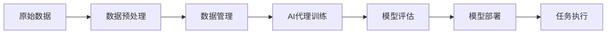

# AI代理工作流中的数据预处理与管理策略

关键词：AI代理、数据预处理、数据管理、工作流、机器学习

## 1. 背景介绍
### 1.1 问题的由来
随着人工智能技术的快速发展,AI代理在各行各业中得到了广泛应用。然而,AI代理的性能很大程度上取决于输入数据的质量。原始数据往往存在噪声、缺失值、异常值等问题,直接使用会影响模型的训练效果。因此,在AI代理工作流中,数据预处理与管理显得尤为重要。

### 1.2 研究现状
目前,学术界和工业界已经提出了多种数据预处理与管理的方法。常见的预处理技术包括数据清洗、数据集成、数据变换、数据规约等。一些研究致力于探索端到端的自动化数据处理管道。此外,也有学者提出利用元学习、迁移学习等技术来优化数据处理流程。

### 1.3 研究意义
高效的数据预处理与管理策略可以显著提升AI代理的性能表现。它不仅能够改善数据质量,去除噪声干扰,而且有助于挖掘数据的内在价值,使模型能够更好地学习数据中蕴含的知识。此外,规范的数据管理有利于提高团队协作效率,促进项目的可复现性和可维护性。

### 1.4 本文结构
本文将重点探讨AI代理工作流中的数据预处理与管理策略。第2部分介绍相关的核心概念。第3部分详细阐述几种主要的数据预处理算法。第4部分建立数学模型并给出公式推导。第5部分通过代码实例演示具体的实现过程。第6部分讨论实际应用场景。第7部分推荐一些有用的工具和学习资源。第8部分总结全文并展望未来。第9部分列出一些常见问题解答。

## 2. 核心概念与联系

在讨论AI代理工作流中的数据预处理与管理之前,我们有必要先明确一些核心概念:

- 数据预处理:是指在数据应用之前,对原始数据进行转换、清洗、集成、规约等一系列处理,以提高数据质量,使其能够满足后续任务的需求。
- 数据管理:是指采用系统化的方法来组织、存储、维护和使用数据,涉及元数据管理、版本控制、数据安全等多个方面。
- AI代理:是一种智能软件系统,能够代替人类执行特定任务。它通常基于机器学习算法,需要大量数据来训练模型。
- 工作流:定义了一个任务的处理流程和规范,有利于实现自动化和标准化。将数据预处理和管理纳入AI代理工作流,可以提高整个过程的效率和可靠性。

下图展示了数据预处理、数据管理与AI代理工作流之间的关系:



从图中可以看出,原始数据经过预处理和管理后,成为AI代理训练的输入。训练得到的模型会不断迭代优化,直至满足性能要求后部署上线,执行具体任务。数据预处理和管理贯穿AI代理开发的整个生命周期。

## 3. 核心算法原理 & 具体操作步骤
### 3.1 算法原理概述
数据预处理的常用算法包括数据清洗、数据集成、数据变换和数据规约。其中,数据清洗主要处理缺失值、噪声和异常值;数据集成将不同来源的数据合并为一致的数据存储;数据变换对数据进行归一化、离散化等转换操作;数据规约通过降维、数值规约、数据压缩来减小数据集的大小。

### 3.2 算法步骤详解

以数据清洗中的异常值检测为例,介绍具体的算法步骤:

1. 计算数据的统计量,如均值、标准差、四分位数等。
2. 根据统计量设定异常值的判定标准,比如超出3倍标准差。
3. 遍历数据集,识别出异常值数据。
4. 对异常值进行处理,通常有删除、替换、不处理三种策略。
5. 重新检查处理后的数据集,确保没有遗漏异常值。

其他数据预处理算法的步骤大同小异,一般包括分析数据特点、制定处理规则、执行转换操作、检验处理效果等环节。

### 3.3 算法优缺点

异常值检测的优点是可以有效识别和去除数据中的噪声点,提高数据质量。但其缺点在于,简单的统计方法有时难以发现某些隐藏较深的异常值,而且对异常值的处理策略也需要根据具体场景权衡利弊。

数据变换的优点是能够将数据映射到适合建模的空间,找出数据中的某些规律。但变换操作可能改变数据原有的内在结构,造成信息损失。

数据集成与规约的优点是降低了数据冗余,节省了存储和计算开销。但同时也可能丢失一些有价值的信息,影响后续的分析挖掘。

### 3.4 算法应用领域

数据预处理算法在多个领域得到广泛应用,如:

- 金融风控:通过异常检测识别欺诈行为
- 工业制造:利用数据变换寻找设备故障模式
- 生物医疗:运用数据集成整合多源异构数据
- 互联网营销:使用数据规约进行用户画像

不同行业的数据处理需求不尽相同,需要针对具体问题选择合适的算法。

## 4. 数学模型和公式 & 详细讲解 & 举例说明
### 4.1 数学模型构建

以异常值检测中的基于距离的方法为例,介绍相关数学模型的构建过程。

假设数据集 $D=\{x_1,x_2,\dots,x_n\}$,其中每个数据点 $x_i$ 是一个 $m$ 维向量。定义点 $x_i$ 与点 $x_j$ 之间的距离为:

$$
d(x_i,x_j) = \sqrt{\sum_{k=1}^m (x_{ik}-x_{jk})^2}
$$

其中 $x_{ik}$ 表示点 $x_i$ 的第 $k$ 维特征值。

对于点 $x_i$,定义其k-距离邻域 $N_k(x_i)$ 为与 $x_i$ 距离最近的 $k$ 个点(不包括 $x_i$ 本身)构成的集合。$x_i$ 的局部离群因子 $LOF_k(x_i)$ 定义为:

$$
LOF_k(x_i) = \frac{\sum_{x_j \in N_k(x_i)} \frac{lrd_k(x_j)}{lrd_k(x_i)}}{|N_k(x_i)|}
$$

其中 $lrd_k(x_i)$ 为 $x_i$ 的 $k$ 距离局部可达密度:

$$
lrd_k(x_i) = 1/(\frac{\sum_{x_j \in N_k(x_i)} reach\text{-}dist_k(x_i,x_j)}{|N_k(x_i)|})
$$

$reach\text{-}dist_k(x_i,x_j)$ 表示 $x_i$ 到 $x_j$ 的 $k$ 距离可达距离:

$$
reach\text{-}dist_k(x_i,x_j) = \max\{k\text{-}dist(x_j), d(x_i,x_j)\}
$$

如果点 $x_i$ 的 $LOF_k(x_i)$ 显著大于1,则认为 $x_i$ 是一个异常点。

### 4.2 公式推导过程

局部离群因子 $LOF$ 的推导过程如下:

1. 引入 $k$ 距离邻域 $N_k(x)$ 的概念,表示与 $x$ 距离最近的 $k$ 个点构成的集合。这个概念用于刻画点 $x$ 的局部邻域范围。

2. 定义 $k$ 距离可达距离 $reach\text{-}dist_k(x,y)$。它表示点 $x$ 到点 $y$ 的距离,但不小于 $y$ 的 $k$ 距离。引入这个概念是为了降低孤立点的影响。

3. 定义局部可达密度 $lrd_k(x)$。它表示点 $x$ 邻域内点的可达距离的平均值的倒数。$lrd$ 度量了点 $x$ 所在区域的紧密程度。

4. 对于点 $x$,计算其每个 $k$ 距离邻域点 $y$ 的 $lrd_k(y)/lrd_k(x)$,再求平均值,得到点 $x$ 的局部离群因子 $LOF_k(x)$。直观地说,$LOF_k(x)$ 反映了点 $x$ 的密度与其邻域点的密度的对比关系。

5. $LOF_k(x)$ 越大,表明点 $x$ 的密度与其邻域点的密度差异越大,越有可能是异常点。通常取 $LOF_k(x)>1$ 作为异常点的判定标准。

### 4.3 案例分析与讲解

下面以一个简单的二维数据集为例,演示 $LOF$ 算法的计算过程。

假设有6个数据点,坐标如下:

```
A(1, 1), B(2, 1), C(1, 2), D(2, 2), E(3, 3), F(5, 5)
```

取 $k=2$,计算每个点的 $LOF$ 值。

对于点A,其2-距离邻域 $N_2(A)=\{B,C\}$。
$reach\text{-}dist(A,B) = d(A,B) = 1$
$reach\text{-}dist(A,C) = d(A,C) = 1$
$lrd(A) = 1/(0.5 \times (1+1)) = 1$

类似地,可以计算出:
$lrd(B)=0.5, lrd(C)=0.5$

因此,$LOF(A) = \frac{0.5/1 + 0.5/1}{2} = 0.5$,小于1,不是异常点。

对于点F,其2-距离邻域 $N_2(F)=\{D,E\}$。
$reach\text{-}dist(F,D) = d(F,D) = 3.16$
$reach\text{-}dist(F,E) = d(F,E) = 2.83$
$lrd(F) = 1/(0.5 \times (3.16+2.83)) = 0.33$

而$lrd(D)=1, lrd(E)=1$。

因此,$LOF(F) = \frac{1/0.33 + 1/0.33}{2} = 6$,远大于1,很可能是异常点。

通过计算可以发现,点F的局部密度明显低于其邻近点,因此被判定为异常值,而其他点的局部密度与邻域点差异不大,不是异常点。

### 4.4 常见问题解答

Q: $LOF$ 算法对参数 $k$ 的选择敏感吗?

A: $k$ 值的选择会影响算法的效果。$k$ 太小,容易将正常点误判为异常点;$k$ 太大,又可能遗漏一些异常点。一般根据数据量大小和分布情况选择适当的 $k$ 值,可以通过交叉验证来优化。

Q: 除了基于距离的方法,还有哪些异常检测算法?

A: 常见的异常检测算法还有基于分布的方法,如假设数据服从高斯分布,将偏离均值较多的点视为异常点;基于密度的方法,如 $DBSCAN$,将密度明显较低的点视为异常点;以及基于隔离森林等集成学习方法。

Q: 如何评估异常检测算法的性能?

A: 主要采用准确率、召回率、$F1$ 值等指标。准确率衡量检测出的异常点中有多少是真正的异常点,召回率衡量真实异常点中有多少被成功检测出来,$F1$ 值是二者的调和平均。此外,还可以绘制 $ROC$ 曲线和 $PR$ 曲线直观评估性能。

## 5. 项目实践：代码实例和详细解释说明
### 5.1 开发环境搭建