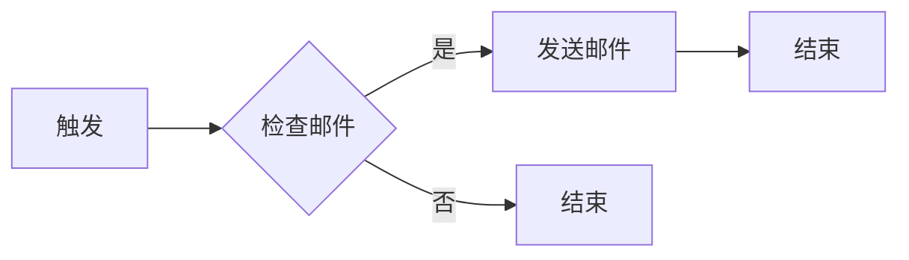

# AI代理工作流便捷性：无代码平台的应用前景

作者：禅与计算机程序设计艺术 / Zen and the Art of Computer Programming

## 1. 背景介绍

### 1.1 问题的由来

随着人工智能技术的飞速发展，AI代理（AI Agent）的应用场景日益广泛。AI代理是指能够自主执行任务、与环境交互的智能实体，它们在自动化、优化决策、个性化服务等方面具有巨大潜力。然而，传统的AI代理开发流程复杂，需要深厚的编程知识和技能，这对于非专业技术人员来说是一个巨大的挑战。

### 1.2 研究现状

为了降低AI代理的开发门槛，无代码平台应运而生。这些平台提供可视化的操作界面，让用户无需编写代码即可构建和部署AI代理。目前，市面上已经涌现出许多无代码平台，如Airtable、Zapier、Microsoft Power Automate等。

### 1.3 研究意义

研究AI代理工作流的便捷性，特别是无代码平台的应用前景，对于推动AI技术的发展和应用具有重要意义。它可以降低AI代理的开发门槛，让更多人参与到AI代理的设计和开发中，加速AI技术的普及和应用。

### 1.4 本文结构

本文将首先介绍AI代理工作流便捷性的核心概念与联系，然后分析无代码平台在AI代理工作流中的应用，并探讨其面临的挑战和未来发展趋势。最后，将给出具体的项目实践案例，以及相关工具和资源推荐。

## 2. 核心概念与联系

### 2.1 AI代理工作流

AI代理工作流是指将AI代理应用于实际场景时，所需经历的一系列步骤。它包括以下几个核心概念：

- **任务分解**：将复杂任务分解为多个可执行的子任务。
- **流程设计**：设计AI代理执行任务的流程，包括子任务的执行顺序、条件判断等。
- **数据管理**：管理AI代理所需的数据，包括数据的采集、存储、处理等。
- **模型训练与优化**：根据任务需求，训练和优化AI代理的模型。

### 2.2 无代码平台

无代码平台是一种无需编写代码即可实现软件开发和应用程序构建的平台。它通过可视化的操作界面，将软件开发的过程抽象化，让非专业人员也能轻松构建应用程序。

### 2.3 AI代理工作流与无代码平台的关系

无代码平台可以简化AI代理工作流的开发过程，降低开发门槛。用户可以通过无代码平台提供的组件和工具，快速构建AI代理工作流，实现任务自动化、优化决策、个性化服务等功能。

## 3. 核心算法原理 & 具体操作步骤

### 3.1 算法原理概述

无代码平台在AI代理工作流中的应用，主要基于以下原理：

- **可视化编程**：将软件开发过程中的代码编写过程抽象化，通过图形化界面进行操作。
- **组件化开发**：将应用程序分解为多个可复用的组件，用户可以根据需求组合这些组件。
- **流程引擎**：提供流程设计、执行、监控等功能，确保AI代理工作流的正常运作。

### 3.2 算法步骤详解

1. **任务分解**：根据任务需求，将AI代理工作流分解为多个子任务。
2. **流程设计**：使用无代码平台提供的流程设计工具，设计AI代理工作流的执行顺序、条件判断等。
3. **数据管理**：使用无代码平台的数据管理功能，实现数据的采集、存储、处理等。
4. **模型训练与优化**：根据任务需求，使用无代码平台提供的机器学习工具，训练和优化AI代理的模型。
5. **部署与监控**：将AI代理工作流部署到实际场景，并对工作流进行监控和优化。

### 3.3 算法优缺点

#### 3.3.1 优点

- **降低开发门槛**：无需编写代码，降低了AI代理工作流的开发门槛，让更多人参与到AI代理的开发中。
- **提高开发效率**：可视化编程和组件化开发，提高了AI代理工作流的开发效率。
- **易于维护**：无代码平台提供的可视化界面和组件化结构，方便用户进行维护和升级。

#### 3.3.2 缺点

- **功能限制**：无代码平台的功能相对有限，可能无法满足复杂场景的需求。
- **性能瓶颈**：无代码平台在执行效率上可能存在瓶颈，特别是在处理大量数据或复杂任务时。
- **依赖平台**：用户对无代码平台的依赖性较高，一旦平台发生变化，可能会导致工作流失效。

### 3.4 算法应用领域

无代码平台在以下领域具有广泛的应用前景：

- **企业自动化**：帮助企业实现业务流程自动化，提高效率，降低成本。
- **个人生产力提升**：帮助个人用户实现日常任务的自动化，提高工作效率。
- **创新应用开发**：鼓励创新性应用的开发，推动AI技术的发展和应用。

## 4. 数学模型和公式 & 详细讲解 & 举例说明

### 4.1 数学模型构建

在AI代理工作流中，可以使用以下数学模型进行描述：

1. **马尔可夫决策过程（MDP）**：用于描述AI代理在不确定环境中的决策过程。
2. **强化学习**：用于训练AI代理在特定任务上的决策能力。
3. **神经网络**：用于模拟AI代理的感知、推理和决策过程。

### 4.2 公式推导过程

以马尔可夫决策过程为例，假设AI代理处于状态$s$，可选择的动作集合为$A$，状态转移概率为$P(s' | s, a)$，奖励函数为$R(s, a)$，则AI代理的期望回报为：

$$\mathbb{E}[R] = \sum_{s' \in S} P(s' | s, a) \sum_{a' \in A} R(s', a')$$

### 4.3 案例分析与讲解

假设一个AI代理需要在一个网格世界中进行导航，其状态转移概率和奖励函数如下：

- **状态转移概率**：从状态$s$移动到状态$s'$的概率。
- **奖励函数**：到达目标状态的奖励为正，其他状态的奖励为负。

我们可以使用强化学习算法（如Q-Learning）来训练AI代理在网格世界中导航。

### 4.4 常见问题解答

#### 4.4.1 无代码平台是否适用于所有场景？

无代码平台适用于大部分场景，但对于一些需要高度定制化、高性能的应用，可能需要使用传统的编程方式。

#### 4.4.2 无代码平台的性能如何？

无代码平台的性能与具体平台和场景有关。一些平台可能存在性能瓶颈，但在大多数场景下，其性能已能满足需求。

#### 4.4.3 无代码平台的开发成本如何？

无代码平台的开发成本相对较低，因为它降低了开发门槛。用户可以根据需求选择合适的平台，并利用平台提供的组件和工具进行开发。

## 5. 项目实践：代码实例和详细解释说明

### 5.1 开发环境搭建

以Microsoft Power Automate为例，以下是搭建开发环境的基本步骤：

1. 在Microsoft Power Automate官方网站注册账号。
2. 创建一个新的工作流。
3. 根据需要选择合适的触发器和操作。
4. 设置操作参数和条件判断。

### 5.2 源代码详细实现

以下是一个简单的Power Automate工作流示例，用于实现邮件自动化：

### 5.3 代码解读与分析

该示例工作流包含以下步骤：

1. **触发**：当接收到新邮件时，触发工作流。
2. **检查邮件**：检查邮件是否符合特定条件（如主题包含特定关键词）。
3. **发送邮件**：如果邮件符合条件，则发送一封自动回复邮件。
4. **结束**：工作流执行完毕。

### 5.4 运行结果展示

当接收到一封符合条件的新邮件时，系统会自动发送一封回复邮件，无需人工干预。

## 6. 实际应用场景

### 6.1 企业自动化

无代码平台在企业自动化领域有着广泛的应用，如：

- **客户关系管理（CRM）**：自动化客户信息录入、邮件回复、跟进等工作。
- **供应链管理**：自动化采购申请、订单处理、物流跟踪等工作。
- **人力资源**：自动化招聘流程、员工培训、绩效考核等工作。

### 6.2 个人生产力提升

无代码平台可以帮助个人用户实现日常任务的自动化，如：

- **日程管理**：自动化日程提醒、会议预约等工作。
- **财务管理**：自动化账单支付、收支统计等工作。
- **学习与工作**：自动化课程学习、文档整理等工作。

### 6.3 创新应用开发

无代码平台可以鼓励创新性应用的开发，如：

- **智能家居**：自动化家中的电器设备，实现场景化控制。
- **健康监测**：自动化监测个人健康数据，提供个性化健康建议。
- **教育科技**：自动化教学过程，提高教学效果。

## 7. 工具和资源推荐

### 7.1 学习资源推荐

1. **Microsoft Power Automate官方文档**：[https://docs.microsoft.com/en-us/power-platform/admin/power-automate-overview](https://docs.microsoft.com/en-us/power-platform/admin/power-automate-overview)
2. **Zapier官方文档**：[https://zapier.com/help](https://zapier.com/help)

### 7.2 开发工具推荐

1. **Microsoft Power Automate**：[https://flow.microsoft.com/](https://flow.microsoft.com/)
2. **Zapier**：[https://zapier.com/](https://zapier.com/)
3. **Airtable**：[https://www.airtable.com/](https://www.airtable.com/)

### 7.3 相关论文推荐

1. **《The State of Workflow Automation and Integration Platforms**》
2. **《Automating the World: The Rise of Workflow Automation**》
3. **《Democratizing Automation with No-Code Platforms**》

### 7.4 其他资源推荐

1. **Stack Overflow**：[https://stackoverflow.com/](https://stackoverflow.com/)
2. **GitHub**：[https://github.com/](https://github.com/)
3. **LinkedIn Learning**：[https://www.linkedin.com/learning/](https://www.linkedin.com/learning/)

## 8. 总结：未来发展趋势与挑战

### 8.1 研究成果总结

本文介绍了AI代理工作流便捷性的核心概念与联系，分析了无代码平台在AI代理工作流中的应用，并探讨了其面临的挑战和未来发展趋势。

### 8.2 未来发展趋势

#### 8.2.1 功能增强

无代码平台将提供更丰富的组件和功能，以满足更多场景的需求。

#### 8.2.2 性能提升

无代码平台的性能将得到提升，特别是在处理大量数据或复杂任务时。

#### 8.2.3 生态完善

无代码平台将与其他技术（如云计算、大数据等）深度融合，形成更完善的生态系统。

### 8.3 面临的挑战

#### 8.3.1 安全性与隐私保护

无代码平台需要解决数据安全和隐私保护问题，确保用户数据的安全。

#### 8.3.2 技术门槛降低

随着无代码平台的普及，技术门槛的降低可能导致滥用和误用。

#### 8.3.3 人才短缺

无代码平台的普及可能导致传统编程人才的短缺。

### 8.4 研究展望

未来，无代码平台将在AI代理工作流便捷性方面发挥越来越重要的作用。通过不断的技术创新和优化，无代码平台将推动AI技术的发展和应用，为人类社会创造更多价值。

## 9. 附录：常见问题与解答

### 9.1 无代码平台与传统编程方式有何区别？

无代码平台通过可视化的操作界面和组件化开发，降低了开发门槛，让非专业人员也能参与软件开发。而传统编程方式需要编写代码，对编程知识要求较高。

### 9.2 无代码平台适用于哪些场景？

无代码平台适用于大部分场景，如企业自动化、个人生产力提升、创新应用开发等。

### 9.3 无代码平台的性能如何？

无代码平台的性能与具体平台和场景有关。一些平台可能存在性能瓶颈，但在大多数场景下，其性能已能满足需求。

### 9.4 无代码平台的开发成本如何？

无代码平台的开发成本相对较低，因为它降低了开发门槛。用户可以根据需求选择合适的平台，并利用平台提供的组件和工具进行开发。

### 9.5 如何选择合适的无代码平台？

选择合适的无代码平台需要考虑以下因素：

- **功能需求**：根据实际需求，选择功能完善的平台。
- **易用性**：选择操作简单、易上手的平台。
- **生态支持**：选择拥有良好生态支持的平台。
- **成本**：根据预算，选择性价比高的平台。

通过以上分析，相信读者对AI代理工作流便捷性及无代码平台的应用前景有了更深入的了解。未来，无代码平台将在AI代理领域发挥越来越重要的作用，推动人工智能技术的发展和应用。