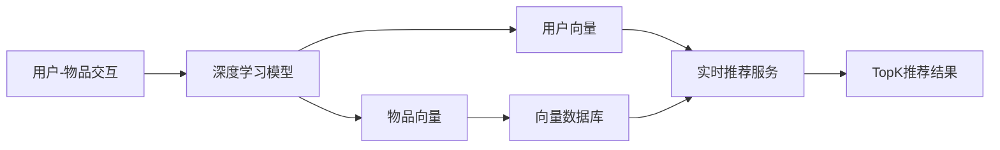

# AI向量数据库在实时推荐系统中的应用

关键词：AI向量数据库, 实时推荐系统, 相似度搜索, 深度学习, 向量嵌入, 近似最近邻搜索

## 1. 背景介绍
### 1.1 问题的由来
随着互联网技术的飞速发展,海量数据的不断积累,以及用户个性化需求的日益增长,传统的推荐系统已经难以满足实时性、准确性和可扩展性等方面的要求。传统的推荐系统主要基于协同过滤、基于内容等方法,存在数据稀疏、冷启动、可解释性差等问题。如何利用人工智能技术,特别是深度学习和向量数据库,来构建高效、准确、可扩展的实时推荐系统,成为了业界和学术界共同关注的热点问题。

### 1.2 研究现状
近年来,深度学习技术在推荐系统领域取得了广泛的应用和突破。一方面,深度学习能够学习到数据的深层特征表示,克服了传统方法的局限性；另一方面,端到端的深度学习模型能够同时完成特征学习和用户-物品匹配,大大简化了系统架构。典型的深度学习推荐模型包括:Deep Crossing、PNN、Wide&Deep、DeepFM等。

与此同时,向量数据库技术也在蓬勃发展。向量数据库是一种专门针对高维向量数据的数据库系统,支持高效的相似度搜索和最近邻查询。代表性的向量数据库包括Faiss、Annoy、HNSW等。向量数据库能够有效地解决深度学习推荐中向量检索的效率瓶颈,使得实时推荐成为可能。

一些先进的推荐系统架构开始尝试将深度学习和向量数据库进行结合,如Facebook的DLRM(Deep Learning Recommendation Model)、Google的双塔模型等。这些工作证明了AI向量数据库在实时推荐中的广阔应用前景。

### 1.3 研究意义
研究AI向量数据库在实时推荐系统中的应用,具有重要的理论意义和实践价值:

1. 有助于突破传统推荐系统的局限性,利用深度学习和向量检索实现更加精准、高效的推荐。
2. 推动了人工智能技术与数据库系统的交叉融合,为两个领域的发展提供了新的思路。
3. 对于工业界具有很强的指导意义,能够帮助企业构建先进的个性化推荐系统,提升用户体验和商业价值。

### 1.4 本文结构
本文将围绕AI向量数据库在实时推荐系统中的应用展开深入探讨。第2部分介绍核心概念及其内在联系；第3部分重点阐述核心算法原理与具体操作步骤；第4部分给出数学模型和公式推导过程；第5部分展示项目实践,包括代码实例和详细解释；第6部分分析实际应用场景；第7部分推荐相关工具和学习资源；第8部分总结全文,展望未来发展趋势与挑战；第9部分附录,解答常见问题。

## 2. 核心概念与联系
实时推荐系统需要解决三大核心问题:

1. 用户-物品表示学习:如何学习用户和物品的低维稠密向量表示,捕捉其潜在特征。
2. 用户-物品相关性计算:如何基于用户和物品的向量表示,计算它们之间的相关性或相似度。
3. 用户-物品匹配检索:如何从海量物品向量库中快速检索与给定用户最相关的TopK个物品。

针对上述三大问题,AI向量数据库推荐架构引入了三个关键技术:

1. 深度学习:利用深度神经网络从原始的用户-物品交互数据中学习抽象的向量表示,克服了人工特征工程的局限性。
2. 向量相似度:通过向量间的点积、欧式距离、余弦相似度等度量,直接计算用户-物品的相关性,避免了显式的特征交叉。
3. 近似最近邻(ANN)搜索:利用向量数据库的ANN索引,在毫秒级响应时间内从亿级物品中检索出最相关的结果,满足了实时推荐的苛刻要求。

下图展示了一个典型的AI向量数据库推荐架构,包含离线训练和在线服务两大部分:

可以看出,深度学习、向量相似度和ANN搜索三者环环相扣,共同构成了AI向量数据库推荐的核心,下面将对其原理进行详细阐述。

## 3. 核心算法原理 & 具体操作步骤
### 3.1 算法原理概述
AI向量数据库推荐的核心算法可以概括为两大步骤:

1. 离线训练阶段:利用深度学习模型对用户-物品交互记录进行学习,得到用户和物品的低维向量表示,并将物品向量批量入库。
2. 在线服务阶段:对于每个用户请求,先通过深度模型计算用户的实时向量,然后在向量数据库中进行ANN检索,返回TopK相似物品。

### 3.2 算法步骤详解
下面对离线训练和在线服务两个阶段的具体算法步骤进行详细说明。

#### 3.2.1 离线训练
输入:用户-物品交互记录(如点击、购买等),记为$D=\{(u_i,v_j,y_{ij})\}$。其中$u_i$为用户,$v_j$为物品,$y_{ij}$为交互标签。

输出:用户向量$\mathbf{u}\in \mathbb{R}^d$和物品向量$\mathbf{v}\in \mathbb{R}^d$。

1. 构建用户塔和物品塔。用户塔和物品塔分别接收用户ID和物品ID的one-hot编码,然后通过Embedding层、DNN层逐步将高维稀疏特征压缩为低维稠密的向量表示。
2. 在用户塔和物品塔的顶部添加交互层。交互层通过向量点积、串联等方式,显式地建模用户向量和物品向量的相关性。
3. 接交互层的输出到一个输出层,用于预测用户-物品交互概率。输出层通常采用Sigmoid函数,将相关性分数映射到(0,1)区间。
4. 定义损失函数,如交叉熵、BPR等。损失函数衡量了模型预测分数与真实交互标签之间的误差。
5. 利用优化算法(如Adam、Adagrad等)最小化损失函数,对模型参数进行训练,直到模型收敛或达到预设的迭代次数。
6. 将训练好的物品塔提取出来,将其产生的物品向量批量离线入库。同时将用户塔保存为在线服务模型。

#### 3.2.2 在线服务
输入:用户ID$u_i$,以及物品向量数据库$\mathcal{V}=\{\mathbf{v}_1,\dots,\mathbf{v}_N\}$。

输出:TopK推荐物品列表$R_K(u_i)$。

1. 将用户ID$u_i$输入到用户塔,得到用户的实时向量表示$\mathbf{u}_i$。
2. 将$\mathbf{u}_i$作为查询向量,在物品向量数据库$\mathcal{V}$中进行ANN检索,得到与$\mathbf{u}_i$最相似的K个物品向量$\{\mathbf{v}_{i1},\dots,\mathbf{v}_{iK}\}$。
3. 将检索结果中的物品ID作为TopK推荐$R_K(u_i)$返回给用户。

其中,第2步的ANN检索通常采用局部敏感哈希(LSH)、乘积量化(PQ)、图索引等技术,在毫秒级别内从海量向量库中找出最近邻,是向量数据库的核心功能。

### 3.3 算法优缺点
AI向量数据库推荐算法的优点包括:

1. 端到端学习:避免了人工特征工程,自动学习用户-物品的抽象表示,挖掘出深层语义信息。
2. 泛化能力强:学习到的向量表示可以应用于各种下游任务,如相似物品检索、用户聚类等。
3. 实时性高:通过向量数据库的ANN检索,在毫秒级别生成个性化推荐。
4. 可解释性好:可以分析用户和物品的向量表示,解释推荐结果的原因。

同时,该算法也存在一些局限性:

1. 离线训练耗时:深度学习模型的训练需要大量时间和计算资源,模型更新频率受限。
2. 冷启动问题:对于新用户和新物品,缺乏足够的交互数据,学习到的向量表示可能不准确。
3. 数据偏差:用户行为数据存在固有偏差(如流行度偏差),学习到的表示可能放大这种偏差。

### 3.4 算法应用领域
AI向量数据库推荐算法在诸多领域得到了成功应用,包括:

1. 电商推荐:如亚马逊、淘宝等电商平台,利用用户的历史浏览、购买记录学习用户表示,实时推荐相关商品。
2. 社交推荐:如Facebook、微博等社交网络,根据用户的社交行为学习用户表示,推荐相似用户、话题等。
3. 视频推荐:如YouTube、抖音等视频网站,通过用户的观看记录学习用户兴趣表示,推荐个性化视频内容。
4. 广告推荐:根据用户的人口属性、历史点击行为学习用户表示,实时推荐相关广告。
5. 新闻推荐:通过用户的阅读历史学习用户表示,推荐用户感兴趣的新闻文章。

## 4. 数学模型和公式 & 详细讲解 & 举例说明
### 4.1 数学模型构建
设用户-物品交互数据集为$\mathcal{D}=\{(u_i,v_j,y_{ij})\}$,其中$u_i \in \mathcal{U}$表示用户集合,$v_j \in \mathcal{V}$表示物品集合,$y_{ij} \in \{0,1\}$为交互标签。

我们的目标是学习一个用户表示函数$f_u: \mathcal{U} \to \mathbb{R}^d$和一个物品表示函数$f_v: \mathcal{V} \to \mathbb{R}^d$,使得用户$u_i$和物品$v_j$的向量内积$\langle f_u(u_i), f_v(v_j) \rangle$能够反映它们的相关性。

用户表示函数$f_u$和物品表示函数$f_v$通常由深度神经网络构成。以$f_u$为例,其数学形式为:

$$
f_u(u_i) = \mathbf{u}_i = \mathrm{DNN}_u(\mathbf{e}_{u_i})
$$

其中$\mathbf{e}_{u_i} \in \{0,1\}^{|\mathcal{U}|}$为用户$u_i$的one-hot编码向量,$\mathrm{DNN}_u$表示用户塔网络,可以是多层感知机(MLP)、卷积神经网络(CNN)、循环神经网络(RNN)等。

物品表示函数$f_v$的形式与之类似:

$$
f_v(v_j) = \mathbf{v}_j = \mathrm{DNN}_v(\mathbf{e}_{v_j})
$$

其中$\mathbf{e}_{v_j} \in \{0,1\}^{|\mathcal{V}|}$为物品$v_j$的one-hot编码向量,$\mathrm{DNN}_v$表示物品塔网络。

在得到用户向量$\mathbf{u}_i$和物品向量$\mathbf{v}_j$后,我们通过向量内积来计算它们的相关性:

$$
\hat{y}_{ij} = \langle \mathbf{u}_i, \mathbf{v}_j \rangle = \mathbf{u}_i^\top \mathbf{v}_j
$$

其中$\hat{y}_{