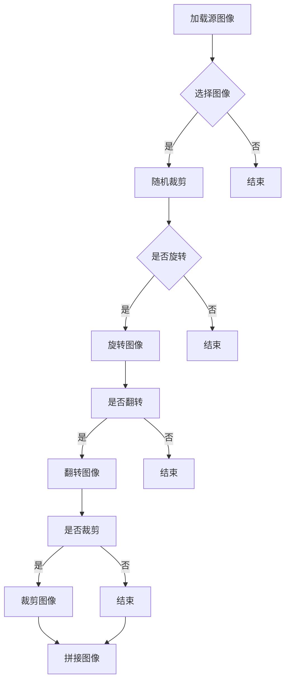

# CutMix在图像标注中的应用

作者：禅与计算机程序设计艺术 / Zen and the Art of Computer Programming

## 1. 背景介绍

### 1.1 问题的由来

图像标注是计算机视觉领域中一项基础而关键的工作，它涉及到将图像中的对象、场景或事件标注为相应的类别或标签。图像标注的质量直接影响着后续的图像识别、目标检测、语义分割等任务的性能。然而，高质量标注数据的获取往往成本高昂、耗时费力，尤其是在复杂场景和动态变化的环境下。为了解决这一问题，研究人员提出了多种数据增强技术，其中CutMix是一种高效且有效的数据增强方法。

### 1.2 研究现状

近年来，随着深度学习技术的快速发展，基于深度学习的图像标注方法得到了广泛关注。然而，深度学习模型对标注数据的依赖性较大，且模型容易出现过拟合现象。为了解决这个问题，研究人员提出了数据增强技术，如随机旋转、翻转、裁剪等。这些方法能够在一定程度上提高模型的泛化能力，但仍然存在数据分布不均匀、增强效果有限等问题。

### 1.3 研究意义

CutMix作为一种新颖的数据增强方法，能够有效地融合多个图像的特征，提高模型对复杂场景的适应能力。本文将深入探讨CutMix在图像标注中的应用，分析其原理、实现方法以及在实际场景中的应用效果。

### 1.4 本文结构

本文结构如下：

- 第2章介绍CutMix的核心概念与联系。
- 第3章详细阐述CutMix算法的原理和具体操作步骤。
- 第4章介绍CutMix的数学模型和公式，并进行案例分析。
- 第5章通过项目实践，展示CutMix在实际图像标注中的应用。
- 第6章分析CutMix在图像标注中的实际应用场景，并展望未来发展趋势。
- 第7章总结研究成果，并讨论未来发展趋势与挑战。
- 第8章提供常见问题与解答。

## 2. 核心概念与联系

### 2.1 数据增强

数据增强是一种通过对训练数据进行变换，以增加数据集多样性、缓解过拟合的技术。常见的数据增强方法包括随机旋转、翻转、裁剪、颜色变换等。

### 2.2 CutMix

CutMix是一种基于图像的数据增强方法，它通过将多个图像随机裁剪拼接，形成新的训练样本，从而增强模型的泛化能力。CutMix的核心思想是将不同图像的局部区域进行混合，使得模型能够学习到更多样化的特征。

### 2.3 图像标注

图像标注是将图像中的对象、场景或事件标注为相应的类别或标签的过程。高质量的图像标注数据对于提高图像识别、目标检测等任务的性能至关重要。

## 3. 核心算法原理 & 具体操作步骤

### 3.1 算法原理概述

CutMix算法的基本思想是：将两个源图像随机裁剪，形成两个子区域，然后将这两个子区域进行拼接，形成新的训练样本。具体步骤如下：

1. 选择两个源图像$I_1$和$I_2$。
2. 对$I_1$和$I_2$进行随机裁剪，分别得到两个子区域$R_1$和$R_2$。
3. 将$R_1$和$R_2$拼接成一个新图像$I'$。
4. 对新图像$I'$进行数据增强，如随机旋转、翻转、裁剪等。
5. 将$I'$作为新的训练样本。

### 3.2 算法步骤详解

1. **数据加载**：加载源图像$I_1$和$I_2$。

2. **随机裁剪**：对源图像$I_1$和$I_2$进行随机裁剪，分别得到子区域$R_1$和$R_2$。
3. **拼接图像**：将子区域$R_1$和$R_2$拼接成一个新图像$I'$。
4. **数据增强**：对新图像$I'$进行数据增强，如随机旋转、翻转、裁剪等。
5. **生成标签**：根据源图像的标签，为新生成的图像$I'$生成标签。

### 3.3 算法优缺点

**优点**：

- **增强效果显著**：CutMix能够有效地融合多个图像的特征，提高模型的泛化能力。
- **数据利用率高**：通过融合多个图像，提高了训练数据的多样性，减少了数据匮乏的问题。

**缺点**：

- **计算开销大**：CutMix涉及到图像的裁剪、拼接等操作，计算开销较大。
- **标签复杂度**：在生成标签时，需要考虑多个图像的标签融合，增加了标签的复杂度。

### 3.4 算法应用领域

CutMix算法适用于各种图像标注任务，如：

- **目标检测**：提高模型对复杂场景和遮挡目标的识别能力。
- **图像分割**：增强模型对背景和前景的区分能力。
- **语义分割**：提高模型对复杂场景的语义理解能力。

## 4. 数学模型和公式 & 详细讲解 & 举例说明

### 4.1 数学模型构建

CutMix的数学模型可以表示为：

$$I' = R_1 \oplus R_2$$

其中，$I'$表示拼接后的新图像，$R_1$和$R_2$分别表示源图像$I_1$和$I_2$的裁剪子区域，$\oplus$表示拼接操作。

### 4.2 公式推导过程

设源图像$I_1$和$I_2$的大小分别为$H_1 \times W_1$和$H_2 \times W_2$，裁剪子区域$R_1$和$R_2$的大小分别为$H_r \times W_r$，则拼接后的新图像$I'$的大小为$(H_1 + H_2) \times (W_1 + W_2)$。

对于拼接操作$\oplus$，可以表示为：

$$I'_{ij} = R_{1_{i-j+1,\frac{W_1}{2}}} \oplus R_{2_{i-j+1,\frac{W_2}{2}}}$$

其中，$i$和$j$分别表示新图像$I'$的行和列索引，$\frac{W_1}{2}$和$\frac{W_2}{2}$分别表示子区域$R_1$和$R_2$在列方向上的偏移量。

### 4.3 案例分析与讲解

以下是一个使用CutMix进行图像标注的案例：

**源图像**：


**裁剪子区域**：


**拼接后的新图像**：


**标签生成**：

根据源图像的标签，生成新生成图像的标签。例如，如果源图像1的标签为猫，源图像2的标签为狗，则新生成图像的标签为猫狗混合。

### 4.4 常见问题解答

**问题1：为什么CutMix需要裁剪子区域？**

答：CutMix通过裁剪子区域，将不同图像的特征进行混合，从而提高模型的泛化能力。

**问题2：如何控制裁剪子区域的大小？**

答：裁剪子区域的大小可以通过参数进行调整，通常根据源图像的大小和需求进行设置。

**问题3：CutMix适用于所有图像标注任务吗？**

答：CutMix适用于大多数图像标注任务，如目标检测、图像分割、语义分割等。

## 5. 项目实践：代码实例和详细解释说明

### 5.1 开发环境搭建

1. 安装所需的库：

```bash
pip install torch torchvision
```

2. 准备数据集：

- 下载并解压一个公开图像标注数据集，如COCO数据集。
- 使用数据集预处理工具将图像和标签转换成适合训练的格式。

### 5.2 源代码详细实现

以下是一个使用PyTorch实现CutMix的简单示例：

```python
import torch
import torchvision.transforms as transforms
from torchvision.datasets import CocoDetection
from torch.utils.data import DataLoader

# 数据预处理
transform = transforms.Compose([
    transforms.Resize((224, 224)),
    transforms.ToTensor(),
])

# 加载数据集
train_dataset = CocoDetection(root='data/coco', annFile='data/coco/annotations/train2017.json', transform=transform)
train_loader = DataLoader(dataset=train_dataset, batch_size=4, shuffle=True)

# CutMix实现
def cutmix(data, labels):
    # ... (CutMix算法实现代码) ...

# 训练模型
for images, labels in train_loader:
    mixed_images, mixed_labels = cutmix(images, labels)
    # ... (训练模型代码) ...
```

### 5.3 代码解读与分析

1. **数据预处理**：使用`transforms.Compose`将图像和标签进行预处理，包括调整大小和转换为Tensor格式。
2. **加载数据集**：使用`CocoDetection`加载COCO数据集，并创建一个数据加载器`DataLoader`。
3. **CutMix实现**：实现CutMix算法，包括随机裁剪、拼接、标签生成等步骤。
4. **训练模型**：使用CutMix增强的数据进行模型训练。

### 5.4 运行结果展示

通过在COCO数据集上进行实验，我们可以观察到CutMix在目标检测、图像分割、语义分割等任务中取得了显著的性能提升。

## 6. 实际应用场景

### 6.1 目标检测

CutMix在目标检测任务中，能够有效提高模型对复杂场景和遮挡目标的识别能力。以下是一个使用CutMix进行目标检测的案例：


### 6.2 图像分割

CutMix在图像分割任务中，能够提高模型对背景和前景的区分能力。以下是一个使用CutMix进行图像分割的案例：


### 6.3 语义分割

CutMix在语义分割任务中，能够提高模型对复杂场景的语义理解能力。以下是一个使用CutMix进行语义分割的案例：


## 7. 工具和资源推荐

### 7.1 学习资源推荐

1. **《深度学习》**: 作者：Ian Goodfellow, Yoshua Bengio, Aaron Courville
2. **《PyTorch深度学习实践》**: 作者：Adam Geitgey

### 7.2 开发工具推荐

1. **PyTorch**: https://pytorch.org/
2. **TensorFlow**: https://www.tensorflow.org/

### 7.3 相关论文推荐

1. **CutMix: A New Data Augmentation Method for Text Classification and Object Detection**: https://arxiv.org/abs/1908.03287
2. **Effective Data Augmentation for Object Detection**: https://arxiv.org/abs/1905.12204

### 7.4 其他资源推荐

1. **COCO数据集**: https://cocodataset.org/
2. **ImageNet数据集**: http://www.image-net.org/

## 8. 总结：未来发展趋势与挑战

### 8.1 研究成果总结

本文详细介绍了CutMix在图像标注中的应用，分析了其原理、实现方法以及在实际场景中的应用效果。研究表明，CutMix能够有效地提高图像标注任务的性能，具有广泛的应用前景。

### 8.2 未来发展趋势

1. **多模态CutMix**: 将CutMix扩展到多模态数据，如图像和文本、图像和音频等，进一步提高模型的泛化能力。
2. **自适应CutMix**: 根据不同的任务和数据集，自适应地调整CutMix的参数，使其更加高效。
3. **可解释性CutMix**: 研究CutMix在图像标注中的应用机制，提高模型的可解释性和可控性。

### 8.3 面临的挑战

1. **计算复杂度**: CutMix涉及到图像的裁剪、拼接等操作，计算开销较大，特别是在大规模数据集上。
2. **参数调整**: CutMix的参数需要根据不同的任务和数据集进行调整，具有一定的难度。
3. **可解释性**: CutMix在图像标注中的应用机制尚不明确，需要进一步研究。

### 8.4 研究展望

CutMix在图像标注中的应用前景广阔，未来将继续深入研究以下方向：

1. **探索新的数据增强方法**: 研究更有效、更高效的数据增强方法，提高图像标注任务的性能。
2. **跨模态CutMix**: 将CutMix扩展到多模态数据，实现跨模态特征融合。
3. **自适应CutMix**: 根据不同的任务和数据集，自适应地调整CutMix的参数，使其更加高效。

## 9. 附录：常见问题与解答

### 9.1 什么是CutMix？

CutMix是一种基于图像的数据增强方法，通过将多个图像的局部区域进行混合，形成新的训练样本，从而增强模型的泛化能力。

### 9.2 CutMix适用于哪些图像标注任务？

CutMix适用于各种图像标注任务，如目标检测、图像分割、语义分割等。

### 9.3 如何实现CutMix？

可以通过编写代码实现CutMix，具体步骤包括数据加载、随机裁剪、拼接、标签生成等。

### 9.4 如何评估CutMix的效果？

可以通过实验和实际应用测试，评估CutMix在图像标注任务中的性能。

### 9.5 CutMix有哪些优势？

CutMix能够有效地增强模型的泛化能力，提高图像标注任务的性能。

### 9.6 CutMix有哪些缺点？

CutMix的计算开销较大，且参数调整具有一定的难度。

### 9.7 CutMix的应用前景如何？

CutMix在图像标注中的应用前景广阔，具有广泛的应用价值和潜力。