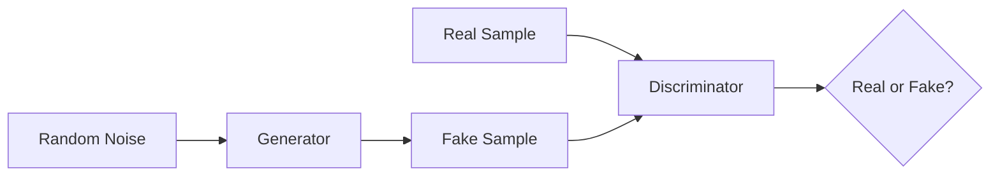

# GAN 生成模型：生成器 (Generator) 原理与代码实例讲解

关键词：生成对抗网络, GAN, 生成器, Generator, 深度学习, 无监督学习, 图像生成

## 1. 背景介绍
### 1.1 问题的由来
近年来,随着深度学习技术的快速发展,生成对抗网络(Generative Adversarial Networks, GANs)作为一种强大的生成模型引起了广泛关注。GAN 由 Ian Goodfellow 等人于2014年提出,它能够学习数据分布,并生成与真实数据极其相似的样本。GAN 在图像生成、图像翻译、语音合成等领域取得了令人瞩目的成果。

### 1.2 研究现状
自 GAN 提出以来,大量学者对其展开了深入研究。目前已经出现了多种 GAN 的变体和改进模型,如 DCGAN、WGAN、CGAN、CycleGAN 等。这些模型在原有 GAN 的基础上,从网络结构、损失函数、训练技巧等方面进行了优化,进一步提升了生成效果和训练稳定性。同时,GAN 在计算机视觉、自然语言处理等领域得到了广泛应用。

### 1.3 研究意义
GAN 作为一种新颖的生成模型,在理论和应用层面都具有重要意义。从理论角度看,GAN 为学习复杂数据分布提供了新思路,有助于推动无监督学习的发展。从应用角度看,GAN 为解决传统方法难以处理的问题提供了新工具,在图像生成、风格迁移、数据增强等任务中展现出巨大潜力。深入研究 GAN 的原理和实现,对于推动人工智能技术进步具有重要意义。

### 1.4 本文结构
本文将围绕 GAN 的核心组成部分 - 生成器(Generator)展开深入探讨。第2部分介绍 GAN 的核心概念及其内部组件之间的关系。第3部分详细阐述生成器的工作原理和具体实现步骤。第4部分建立生成器的数学模型,推导相关公式,并给出案例分析。第5部分提供生成器的代码实例,并进行详细解读。第6部分讨论生成器在实际应用场景中的作用。第7部分推荐学习 GAN 的相关资源。第8部分总结全文,并展望 GAN 技术的未来发展方向。

## 2. 核心概念与联系
生成对抗网络由生成器(Generator)和判别器(Discriminator)两个核心组件构成。生成器的目标是生成尽可能逼真的假样本,以欺骗判别器;判别器的目标是准确区分真实样本和生成器生成的假样本。两个网络在训练过程中互相博弈,形成动态对抗,最终使生成器能够生成与真实数据分布接近的样本。

生成器接收一个随机噪声向量作为输入,通过一系列卷积、转置卷积等操作将其转换为目标图像。生成器的结构通常采用卷积神经网络(CNN)。输入的随机噪声向量在生成器内部经过上采样(Upsampling)和卷积操作,逐步放大特征图尺寸,同时提取高级语义特征,最终生成与真实图像尺寸相同的假样本。

判别器接收真实图像和生成器生成的图像,通过卷积神经网络提取特征,并输出一个标量值,表示输入图像为真实样本的概率。判别器的结构通常采用分类器的形式,如普通的 CNN 分类网络。

生成器和判别器在训练过程中交替优化。生成器的优化目标是最大化判别器对生成图像的评分,即希望生成的图像能够欺骗判别器;判别器的优化目标是最大化对真实图像的评分,同时最小化对生成图像的评分。两个网络互为对手,在不断的博弈中同时提升性能,最终达到纳什均衡。

下图展示了 GAN 的基本架构,包括生成器和判别器的关系:



## 3. 核心算法原理 & 具体操作步骤
### 3.1 算法原理概述
GAN 的核心思想是让两个神经网络相互博弈,最终学习到真实数据的分布。生成器接收随机噪声作为输入,生成假样本;判别器接收真实样本和生成的假样本,判断它们是否为真。两个网络的目标函数相互对立,生成器希望生成的样本能够欺骗判别器,判别器希望能够准确区分真假样本。

### 3.2 算法步骤详解
1. 初始化生成器和判别器的参数。
2. 固定生成器,训练判别器:
   - 从真实数据集中采样一批真实样本。
   - 从随机噪声中采样一批噪声样本,输入生成器生成一批假样本。
   - 将真实样本和生成的假样本分别输入判别器,计算判别器的损失函数。
   - 根据判别器的损失函数,利用反向传播算法更新判别器的参数。
3. 固定判别器,训练生成器:
   - 从随机噪声中采样一批噪声样本,输入生成器生成一批假样本。
   - 将生成的假样本输入判别器,计算生成器的损失函数。
   - 根据生成器的损失函数,利用反向传播算法更新生成器的参数。
4. 重复步骤2和步骤3,直到达到预设的训练轮数或满足收敛条件。

### 3.3 算法优缺点
GAN 的优点包括:
- 能够生成高质量、逼真的样本
- 无需大量标注数据,属于无监督学习范畴
- 可扩展性强,适用于多种数据类型和应用场景

GAN 的缺点包括:
- 训练过程不稳定,容易出现模式崩溃等问题
- 对超参数敏感,调参难度大
- 评估生成样本质量缺乏统一标准

### 3.4 算法应用领域
GAN 在多个领域得到了广泛应用,如:
- 图像生成:根据文本描述、草图等生成逼真的图像
- 图像翻译:实现风格迁移、图像增强、超分辨率等任务
- 语音合成:生成特定语者的声音
- 视频生成:合成逼真的视频片段
- 异常检测:通过学习正常样本分布,检测异常情况

## 4. 数学模型和公式 & 详细讲解 & 举例说明
### 4.1 数学模型构建
GAN 的数学模型可以表示为一个二人零和博弈。将生成器记为 $G$,判别器记为 $D$。生成器 $G$ 接收随机噪声 $z$ 生成假样本,判别器 $D$ 接收真实样本 $x$ 和生成样本 $G(z)$,输出样本为真的概率。

生成器和判别器的博弈过程可以用如下的值函数 $V(G,D)$ 表示:

$$
\min_{G} \max_{D} V(D,G) = \mathbb{E}_{x \sim p_{data}(x)}[\log D(x)] + \mathbb{E}_{z \sim p_{z}(z)}[\log (1-D(G(z)))]
$$

其中,$p_{data}$ 表示真实数据分布,$p_z$ 表示随机噪声分布。生成器 $G$ 的目标是最小化值函数,即最大化 $D(G(z))$,让生成的假样本更逼真;判别器 $D$ 的目标是最大化值函数,即最大化 $D(x)$,同时最小化 $D(G(z))$,让自己能够准确区分真假样本。

### 4.2 公式推导过程
对于生成器 $G$,其损失函数为:

$$
\mathcal{L}_G = \mathbb{E}_{z \sim p_{z}(z)}[\log (1-D(G(z)))]
$$

对于判别器 $D$,其损失函数为:

$$
\mathcal{L}_D = -\mathbb{E}_{x \sim p_{data}(x)}[\log D(x)] - \mathbb{E}_{z \sim p_{z}(z)}[\log (1-D(G(z)))]
$$

根据博弈论,求解 GAN 模型等价于求解下列最小最大问题:

$$
G^* = \arg \min_{G} \max_{D} V(D,G)
$$

可以证明,当判别器 $D$ 达到最优时,值函数 $V(G,D)$ 可以简化为:

$$
C(G) = \max_{D} V(G,D) = \mathbb{E}_{x \sim p_{data}(x)}[\log D^*(x)] + \mathbb{E}_{z \sim p_{z}(z)}[\log (1-D^*(G(z)))]
$$

其中,$D^*$ 表示最优判别器。此时,生成器的目标是最小化 $C(G)$,即:

$$
G^* = \arg \min_{G} C(G)
$$

### 4.3 案例分析与讲解
下面以图像生成任务为例,讲解 GAN 的数学模型和优化过程。假设我们要生成手写数字图像,真实数据分布 $p_{data}$ 为 MNIST 数据集的图像分布。

首先,随机初始化生成器 $G$ 和判别器 $D$ 的参数。然后,从 MNIST 数据集中采样一批真实手写数字图像 $\{x^{(1)},\dots,x^{(m)}\}$,从随机噪声分布 $p_z$ 中采样一批噪声样本 $\{z^{(1)},\dots,z^{(m)}\}$,利用生成器生成一批假手写数字图像 $\{G(z^{(1)}),\dots,G(z^{(m)})\}$。

接下来,固定生成器 $G$,利用真实图像和生成图像训练判别器 $D$,优化目标为最小化判别器损失 $\mathcal{L}_D$:

$$
\mathcal{L}_D = -\frac{1}{m}\sum_{i=1}^m \log D(x^{(i)}) - \frac{1}{m}\sum_{i=1}^m \log (1-D(G(z^{(i)})))
$$

然后,固定判别器 $D$,利用生成图像训练生成器 $G$,优化目标为最小化生成器损失 $\mathcal{L}_G$:

$$
\mathcal{L}_G = \frac{1}{m}\sum_{i=1}^m \log (1-D(G(z^{(i)})))
$$

通过交替训练生成器和判别器,不断更新它们的参数,最终使生成器能够生成逼真的手写数字图像。

### 4.4 常见问题解答
**问:** GAN 训练过程中容易出现哪些问题?

**答:** GAN 训练过程中常见的问题包括:
1. 模式崩溃(Mode Collapse):生成器只生成少数几种样本,缺乏多样性。
2. 梯度消失(Vanishing Gradient):判别器太强,导致生成器梯度消失,无法继续优化。
3. 训练不稳定:生成器和判别器的优化难以同步,容易出现振荡。

解决这些问题的方法包括改进网络结构、采用新的损失函数(如 WGAN)、引入正则化项等。

**问:** 如何评估 GAN 生成样本的质量?

**答:** 评估 GAN 生成样本质量是一个开放性问题,目前尚无公认的评价指标。常用的评估方法包括:
1. 主观评估:由人工对生成样本的真实性、多样性等进行主观打分。
2. Inception Score (IS):利用预训练的 Inception 网络对生成样本进行分类,根据类别概率分布计算分数。
3. Fréchet Inception Distance (FID):计算真实样本和生成样本在 Inception 特征空间的距离。
4. 可视化分析:将生成样本可视化,直观评估其质量。

综合使用多种评估方法,可以较全面地评判 GAN 生成样本的质量。

## 5. 项目实践：代码实例和详细解释说明
### 5.1 开发环境搭建
首先,我们需要搭建 GAN 的开发环境。这里以 Python 3 和 PyTorch 为例。

安装所需库:
```bash
pip install torch torchvision matplotlib
```

导入所需库:
```python