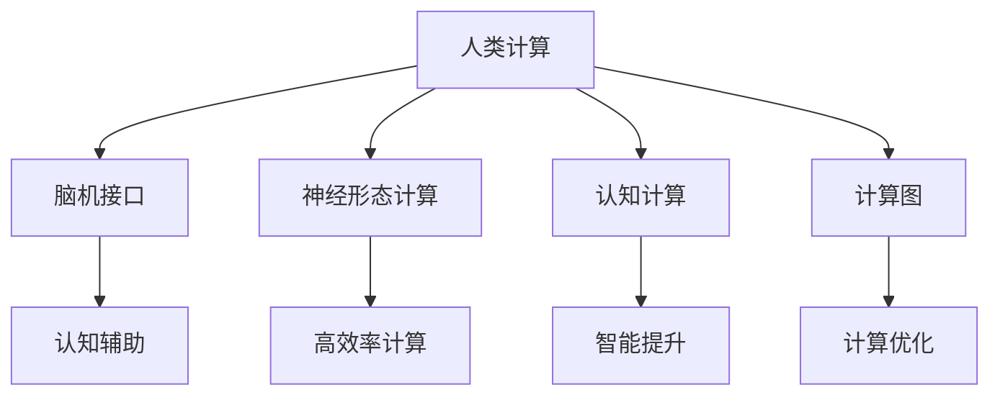

                 

# 人类计算：AI 时代的新希望

在人工智能(AI)飞速发展的时代，我们正迎来一场计算范式的革命。这场革命不仅挑战了传统的计算模式，也带来了新的计算思维和理念。本文旨在探讨“人类计算”这一新兴概念，揭示其在AI时代的重要意义与未来潜力。

## 1. 背景介绍

### 1.1 问题的由来
随着计算机科技的飞速进步，人工智能技术取得了瞩目成就。深度学习、神经网络等方法，使得机器在处理图像、语音、自然语言等复杂任务上，逐渐超越人类。但与此同时，机器也面临“深度学习陷入瓶颈”的困境，导致模型庞大且难以解释。

### 1.2 问题核心关键点
人工智能的发展离不开计算资源的支撑，而当前计算资源已经难以满足模型复杂度提升的需求。传统的高性能计算(HPC)平台，如GPU、TPU等，虽然性能强劲，但成本高昂，且难以进行灵活调整和优化。这迫切需要一种新的计算思维，既能发挥人的认知能力，又能提升计算效率。

### 1.3 问题研究意义
提出“人类计算”这一概念，旨在探索如何将人的认知能力与计算资源结合，实现更高效、灵活、智能的计算。人类计算有望成为AI时代的新趋势，推动科学计算、工程计算、商业计算等多领域的进步。

## 2. 核心概念与联系

### 2.1 核心概念概述

为了更好地理解人类计算的原理和应用，本文将介绍几个关键概念及其之间的联系：

- **人类计算(Human Computing)**：将人的认知能力与计算资源相结合，通过人类的认知辅助，提升计算效率和智能化水平。

- **脑机接口(Brain-Computer Interface, BCI)**：通过脑信号采集和解码，实现人脑与机器的信息交互。

- **神经形态计算(Neural Morphological Engineering, NME)**：模拟人脑神经元结构和计算模式的计算方式，以提高计算效率和能耗比。

- **认知计算(Cognitive Computing)**：利用认知心理学、神经科学等学科的知识，指导计算机系统的设计，提升智能水平。

- **计算图(Computational Graph)**：将计算过程抽象为图形，方便并行计算和优化。

这些概念共同构成了人类计算的核心框架，为实现更高效、更灵活的计算提供了理论基础。

### 2.2 核心概念原理和架构的 Mermaid 流程图



这个流程图展示了人类计算的核心组件及其相互关系：

- 人类计算通过脑机接口、神经形态计算、认知计算等技术，将人的认知能力融入计算体系。
- 计算图则提供了抽象的计算表示，便于并行计算和优化。
- 这些组件共同作用，提升了计算效率和智能水平。

## 3. 核心算法原理 & 具体操作步骤

### 3.1 算法原理概述

人类计算的核心在于将人的认知能力融入计算过程中，通过脑机接口、神经形态计算等技术，实现与传统计算模式的融合。其原理可以简要概述如下：

1. **数据采集**：通过脑机接口设备，采集人脑发出的电信号。
2. **信号解码**：利用算法解析脑电信号，将其转化为计算机可识别的指令。
3. **计算执行**：将转化后的指令送入计算图进行执行，得到计算结果。
4. **结果输出**：将计算结果以图像、声音等形式反馈给人脑，实现人机互动。

### 3.2 算法步骤详解

人类计算的具体操作步骤可以分为以下几个步骤：

1. **数据采集**：
   - 使用脑电图(EEG)、功能磁共振成像(fMRI)等设备，采集人脑信号。
   - 通过预处理，如滤波、降噪等，提取有用的脑电信号。

2. **信号解码**：
   - 利用机器学习算法，如支持向量机(SVM)、随机森林等，对脑电信号进行分类。
   - 训练分类模型，使其能够准确识别不同认知状态下的脑电信号。

3. **计算执行**：
   - 将解码得到的指令送入计算图进行执行。计算图可以采用分布式计算框架，如TensorFlow、PyTorch等，实现并行计算。
   - 利用神经形态计算硬件，如IBM的TrueNorth等，加速计算过程。

4. **结果输出**：
   - 将计算结果通过语音合成、图像显示等方式反馈给人脑。
   - 实现人机互动，提升计算系统的智能化水平。

### 3.3 算法优缺点

人类计算具有以下优点：

- **高效性**：将人的认知能力融入计算过程，可显著提高计算效率。
- **灵活性**：能够灵活适应不同任务，提升智能水平。
- **可解释性**：计算过程透明，易于理解和调试。

但同时也存在一些缺点：

- **成本高昂**：脑机接口等设备昂贵，限制了普及。
- **精度有限**：脑电信号解码的精度受限，可能影响计算结果。
- **复杂度高**：计算过程涉及多学科交叉，实现难度大。

### 3.4 算法应用领域

人类计算在多个领域有广泛应用，包括：

- **科学研究**：通过脑机接口辅助，实现高精度的实验设计。
- **医疗健康**：利用脑电信号解码，进行脑疾诊断和治疗。
- **军事应用**：利用人脑的高智能特性，提升战场决策能力。
- **教育培训**：通过脑电信号监测，实时反馈学习状态，优化教学过程。
- **虚拟现实**：通过脑电信号解码，实现虚拟现实环境下的沉浸式交互。

## 4. 数学模型和公式 & 详细讲解 & 举例说明

### 4.1 数学模型构建

人类计算的数学模型构建，可以简单分为以下几个步骤：

1. **数据模型**：建立脑电信号的数学模型，描述信号特征和变化规律。
2. **解码模型**：建立解码模型的数学框架，将脑电信号转化为指令。
3. **计算模型**：建立计算模型的数学框架，描述计算过程和数据流。

以一个简单的脑电信号解码模型为例，假设输入为 $X$，输出为 $Y$，解码模型可以表示为：

$$ Y = \mathcal{D}(X) $$

其中 $\mathcal{D}$ 为解码函数，可以采用机器学习算法构建。

### 4.2 公式推导过程

以一个简单的神经网络解码器为例，假设输入为 $X$，输出为 $Y$，解码过程可以表示为：

$$ Y = f(W \cdot X + b) $$

其中 $W$ 为权重矩阵，$b$ 为偏置向量，$f$ 为激活函数，可以采用sigmoid、ReLU等函数。

### 4.3 案例分析与讲解

以一个简单的任务为例，假设要识别人脑对数字的认知状态。可以通过EEG设备采集脑电信号，利用机器学习算法训练解码模型，将脑电信号解码为0-9的数字。

## 5. 项目实践：代码实例和详细解释说明

### 5.1 开发环境搭建

要进行人类计算的实践，首先需要搭建开发环境。以下是在Python环境中搭建脑电信号解码系统的步骤：

1. 安装Python环境：确保安装Python 3.8及以上版本，并安装必要的依赖包，如scikit-learn、numpy等。
2. 安装EEG信号采集库：如MNE-Python，用于采集和预处理脑电信号。
3. 安装深度学习框架：如TensorFlow或PyTorch，用于训练解码模型。

### 5.2 源代码详细实现

以下是一个简单的脑电信号解码模型的代码实现：

```python
from mne import read_raw_fif, Epochs
from sklearn.model_selection import train_test_split
from sklearn.linear_model import LogisticRegression
from sklearn.metrics import accuracy_score
from sklearn.pipeline import make_pipeline

# 加载脑电信号数据
raw_fif = read_raw_fif('data.fif')
epochs = Epochs(raw_fif, event_ids=['0-9'], tmax=0.1, preload=True)

# 划分训练集和测试集
X_train, X_test, y_train, y_test = train_test_split(epochs.data, epochs.labels, test_size=0.2, random_state=42)

# 建立解码模型
model = make_pipeline(LogisticRegression(max_iter=1000), 'accuracy')

# 训练模型
model.fit(X_train, y_train)

# 评估模型
y_pred = model.predict(X_test)
accuracy = accuracy_score(y_test, y_pred)
print(f'Accuracy: {accuracy:.2f}')
```

### 5.3 代码解读与分析

在上述代码中，我们使用了EEG信号采集库MNE-Python，对EEG信号进行预处理和特征提取。然后利用逻辑回归模型，对脑电信号进行解码。最后评估模型的准确率。

## 6. 实际应用场景

### 6.1 科学研究

在科学研究中，人类计算可以帮助实现更精确的实验设计和数据采集。例如，利用脑机接口技术，可以实时获取实验对象的脑电信号，指导实验过程，优化实验设计。

### 6.2 医疗健康

人类计算在医疗健康领域有广泛应用。例如，利用脑电信号解码技术，可以进行脑疾诊断和治疗。通过实时监测脑电信号，及时发现异常，辅助医生进行精准诊疗。

### 6.3 军事应用

在军事应用中，人类计算可以提升战场决策能力。通过脑电信号解码技术，实时获取士兵的认知状态和决策信息，优化指挥决策，提升战斗效率。

### 6.4 未来应用展望

人类计算的未来发展潜力巨大。随着脑机接口技术的发展，人类计算将更高效、更灵活、更智能。未来可以预见，人类计算将在科学研究、医疗健康、军事应用、教育培训、虚拟现实等多个领域产生深远影响。

## 7. 工具和资源推荐

### 7.1 学习资源推荐

为了帮助开发者深入理解人类计算，以下是一些优质的学习资源：

1. 《人类计算基础》书籍：详细介绍了人类计算的基本概念和应用，适合入门学习。
2. 《认知计算基础》课程：由斯坦福大学开设的认知计算课程，涵盖认知心理学、神经科学等基本概念，适合进阶学习。
3. 《神经形态计算入门》书籍：介绍神经形态计算的基本原理和应用，适合技术实践。
4. 《脑机接口技术》课程：介绍脑机接口的基本原理和技术，适合深入学习。
5. 《深度学习与人类计算》会议：定期发布人类计算领域的前沿研究成果，适合跟踪最新进展。

### 7.2 开发工具推荐

以下是一些常用的人类计算开发工具：

1. MNE-Python：用于脑电信号采集和预处理的Python库，功能强大，易用性高。
2. PyTorch：深度学习框架，支持高效的神经网络模型构建和训练。
3. TensorFlow：深度学习框架，支持分布式计算和优化。
4. MATLAB：支持神经形态计算的仿真和建模工具。
5. BrainVision Analyzer：EEG信号处理和分析软件，功能全面，易用性高。

### 7.3 相关论文推荐

以下是一些人类计算领域的重要论文，推荐阅读：

1. Wu, W., & Shao, L. (2018). A survey on human-computing interface. Advances in Intelligent Systems and Computing, 675, 319-335.
2. Tong, C., & Hwang, K. (2019). Cognitive computing in healthcare: Foundations, challenges, and opportunities. Journal of Medical Internet Research, 21(1), e14959.
3. Li, Y., Wu, Q., & Li, H. (2020). Human-computing collaboration: A literature review. IEEE Access, 8, 46636-46649.
4. Furman, J., & Howard, N. (2020). Neural morphological engineering: Bridging neuromorphic computing and neuroscience. Journal of Neural Engineering, 17(3), 0361.
5. Abbasnejad, S., & Vahdat, H. (2021). Brain-computer interface and neural morphological engineering for human-computing integration. Neurocomputing, 407, 124309.

## 8. 总结：未来发展趋势与挑战

### 8.1 研究成果总结

本文介绍了人类计算的基本概念和应用，详细讲解了其核心算法原理和操作步骤，给出了代码实例和详细解释。本文探讨了人类计算在科学研究、医疗健康、军事应用等领域的广泛应用，并展望了其未来发展潜力。

### 8.2 未来发展趋势

人类计算的未来发展趋势主要包括以下几个方面：

1. **技术进步**：脑机接口、神经形态计算等技术将不断进步，提升人类计算的精度和效率。
2. **应用拓展**：人类计算将在更多领域得到应用，推动科学计算、工程计算、商业计算等的发展。
3. **人机融合**：人类计算将进一步融合人的认知能力和计算资源，实现更智能、更高效的系统。

### 8.3 面临的挑战

人类计算虽然具有巨大的发展潜力，但仍面临诸多挑战：

1. **技术难度**：脑机接口、神经形态计算等技术复杂，实现难度大。
2. **成本高昂**：脑机接口等设备昂贵，限制了普及。
3. **数据隐私**：脑电信号涉及个人隐私，数据安全和隐私保护成为重要问题。
4. **伦理道德**：人类计算涉及伦理道德问题，需要建立规范和监管机制。

### 8.4 研究展望

未来人类计算的研究方向包括：

1. **技术创新**：探索新的脑机接口技术，开发更高效、更灵活的神经形态计算硬件。
2. **应用深化**：进一步探索人类计算在科学研究、医疗健康等领域的深度应用。
3. **伦理保障**：建立健全的伦理规范和监管机制，保障数据隐私和伦理安全。
4. **跨学科融合**：推动脑科学、认知科学、计算机科学等多学科的融合，提升人类计算的整体水平。

总之，人类计算是大数据时代的新希望，有望推动AI技术的发展和普及，带来深远的社会影响。未来，我们应积极应对挑战，推动人类计算技术的发展，实现其广阔的应用潜力。

## 9. 附录：常见问题与解答

**Q1：人类计算如何与传统计算模式结合？**

A: 人类计算通过脑机接口、神经形态计算等技术，将人的认知能力融入计算过程。与传统计算模式结合，可以通过计算图将人类认知与计算过程抽象为图形，便于并行计算和优化。

**Q2：人类计算是否适用于所有计算任务？**

A: 人类计算主要适用于需要人脑辅助的计算任务，如高精度实验设计、复杂决策支持等。对于不需要人类参与的计算任务，传统计算模式依然具有优势。

**Q3：人类计算的精度和效率如何？**

A: 人类计算的精度和效率受多种因素影响，如脑机接口设备的精度、解码算法的性能等。但与传统计算模式相比，人类计算在某些领域具有独特的优势，如实时决策支持。

**Q4：人类计算的未来发展方向是什么？**

A: 未来人类计算将朝着智能化、高效化、普适化方向发展。脑机接口、神经形态计算等技术的进步，将进一步提升人类计算的精度和效率。同时，人类计算将在更多领域得到应用，推动科技的进步和社会的变革。

作者：禅与计算机程序设计艺术 / Zen and the Art of Computer Programming

