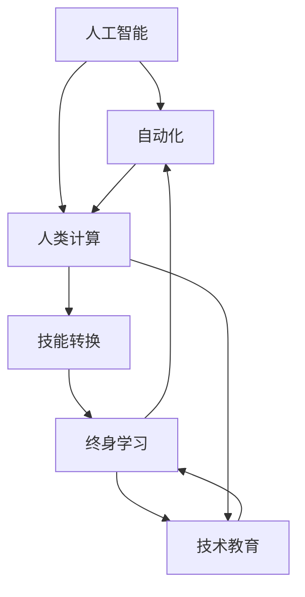

                 

# 人类计算：AI时代的未来就业市场与技能发展

> 关键词：人类计算,人工智能,未来就业市场,技能发展,技能转换,终身学习,技术教育

## 1. 背景介绍

### 1.1 问题由来

随着人工智能(AI)技术的迅猛发展，自动化和智能化正在重塑全球就业市场。AI和大数据正在接管越来越多的重复性、低技能工作，同时创造大量高技能、高创造性的新工作岗位。这不仅改变了企业的运作模式，也对劳动力市场产生了深远影响。

在AI时代，技能需求正在快速变化，传统的职业路径和学习方式已经不再适用。如何应对这些变化，为劳动力提供持续的技能更新，成为现代社会面临的重要挑战。本博客将探讨AI时代下人类计算的演变及其对未来就业市场的影响，并分析技能发展的方向和路径。

### 1.2 问题核心关键点

人工智能技术的进步，特别是深度学习和大数据处理能力，正在极大地改变经济结构和就业结构。AI系统在处理复杂任务上的优势，使得人类需要转向更为注重创造性、战略性和情感智能的工作。未来就业市场的变化将加速要求工作技能的转换和终身学习。

### 1.3 问题研究意义

研究AI时代下的就业市场与技能发展，对于理解未来劳动力的需求变化、设计符合未来就业环境的教育体系、提升劳动力的适应性和竞争力具有重要意义：

1. 提供指导性建议，帮助个人和企业应对AI时代的挑战。
2. 探索职业技能的转换路径，为劳动力提供转型支持。
3. 推动教育体系的改革，提升技能教育的针对性。
4. 鼓励终身学习，提升劳动力的灵活性和适应性。
5. 探索技术教育与职业教育的融合，培养复合型人才。

## 2. 核心概念与联系

### 2.1 核心概念概述

在探讨AI时代下的就业市场与技能发展时，我们关注以下核心概念：

- **人工智能**：基于算法和计算能力，模拟人类智能的技术体系，包括机器学习、深度学习等。
- **自动化**：通过AI系统替代人类完成重复性、低技能工作。
- **人类计算**：人类利用AI系统，进行高级决策、情感交流和创新性工作。
- **终身学习**：个体在职业生涯中不断学习新技能，适应工作市场变化。
- **技能转换**：劳动力从低技能工作转向高技能、高创造性工作。
- **技术教育**：结合技术原理和应用实践的教育方式，培养适应未来工作市场的人才。

这些概念之间的联系如下图所示：



### 2.2 核心概念原理和架构

**人工智能**：基于算法和计算能力，模拟人类智能的技术体系。AI系统通过大量数据训练，获得预测、分类、生成等能力，能够处理复杂任务。

**自动化**：通过AI系统替代人类完成重复性、低技能工作。如机器人、自动驾驶、自动化生产线等。

**人类计算**：人类利用AI系统，进行高级决策、情感交流和创新性工作。如AI辅助设计、智能客服、虚拟助手等。

**终身学习**：个体在职业生涯中不断学习新技能，适应工作市场变化。利用在线教育、专业培训、职业证书等方式提升技能。

**技能转换**：劳动力从低技能工作转向高技能、高创造性工作。如从制造业工人转向数据科学家、AI工程师等。

**技术教育**：结合技术原理和应用实践的教育方式，培养适应未来工作市场的人才。包括大学课程、在线课程、职业培训等。

这些概念共同构成了AI时代下就业市场的变化框架，并指导我们理解技能发展的方向和路径。

## 3. 核心算法原理 & 具体操作步骤

### 3.1 算法原理概述

AI时代下，就业市场和技能发展的关键在于人类计算能力与AI系统能力的有机结合。以下算法原理概述了这一过程：

- **数据驱动**：利用大数据和机器学习算法，发现和预测市场变化趋势。
- **模型优化**：通过模型训练和参数调整，提高AI系统的预测和决策能力。
- **技能映射**：将AI系统的能力和市场需求进行映射，确定技能发展的方向。
- **学习路径设计**：设计终身学习路径，提供灵活、高效的学习方式。

### 3.2 算法步骤详解

1. **市场分析**：利用大数据和机器学习算法，分析就业市场变化趋势。
2. **需求预测**：基于历史数据和未来趋势，预测未来技能需求。
3. **技能映射**：将AI系统的能力和市场需求进行映射，确定技能发展的方向。
4. **学习路径设计**：设计终身学习路径，提供灵活、高效的学习方式。
5. **技能评估**：定期评估员工技能水平，制定个性化培训计划。
6. **持续改进**：通过反馈和改进机制，不断优化学习路径和技能评估体系。

### 3.3 算法优缺点

**优点**：

- **数据驱动**：利用大数据和机器学习算法，预测未来技能需求。
- **模型优化**：通过模型训练和参数调整，提高AI系统的预测和决策能力。
- **灵活性**：设计终身学习路径，提供灵活、高效的学习方式。

**缺点**：

- **数据隐私**：利用大数据进行市场分析，可能涉及隐私问题。
- **算法偏见**：机器学习算法可能存在偏见，导致预测偏差。
- **资源需求**：模型优化和学习路径设计需要大量计算资源。

### 3.4 算法应用领域

AI时代下，人类计算和技能发展的算法可以应用于多个领域，如：

- **金融**：利用AI系统进行风险评估、投资决策等。
- **医疗**：通过AI系统进行疾病诊断、治疗方案推荐等。
- **制造**：利用AI系统进行生产流程优化、质量控制等。
- **教育**：通过AI系统进行个性化学习、智能评估等。
- **客服**：利用AI系统进行智能客服、客户情感分析等。
- **营销**：通过AI系统进行市场分析、客户行为预测等。

这些领域的应用展示了AI技术在各个行业中的广泛前景，以及技能发展的重要性和紧迫性。

## 4. 数学模型和公式 & 详细讲解 & 举例说明

### 4.1 数学模型构建

本节通过数学模型来详细解释AI时代下人类计算和技能发展的基本框架。

假设市场需求向量为 $D$，技能需求向量为 $S$，AI系统能力向量为 $A$。则需求预测模型为：

$$
S = f(D, A)
$$

其中，$f$ 为预测函数，表示市场需求与AI系统能力之间的映射关系。

### 4.2 公式推导过程

首先，我们需要确定 $D$ 和 $A$ 的表示方法。假设 $D$ 表示为向量 $\{d_1, d_2, \dots, d_n\}$，$A$ 表示为向量 $\{a_1, a_2, \dots, a_m\}$，则需求预测模型可以表示为：

$$
S = \alpha D + \beta A
$$

其中，$\alpha$ 和 $\beta$ 为预测系数，通过模型训练得到。

对于 $S$ 的每个元素 $s_i$，我们有：

$$
s_i = \alpha d_i + \beta a_i
$$

通过不断优化 $\alpha$ 和 $\beta$，我们可以精确预测市场需求与AI系统能力之间的关系。

### 4.3 案例分析与讲解

**案例**：一家大型制造公司希望通过AI系统优化生产流程。

**数据**：公司历史生产数据、设备性能数据、市场需求数据。

**模型**：利用机器学习算法，构建生产流程优化模型。

**技能映射**：根据模型预测结果，确定技能发展方向，如数据科学、自动化控制等。

**学习路径**：设计员工培训计划，提供在线课程、专业培训、职业证书等方式。

**技能评估**：定期评估员工技能水平，制定个性化培训计划。

通过这个案例，我们可以看到，利用AI系统进行需求预测和技能映射，可以为技能发展提供科学依据，同时也需要灵活应对市场需求的变化。

## 5. 项目实践：代码实例和详细解释说明

### 5.1 开发环境搭建

在进行人类计算和技能发展的实践前，我们需要准备好开发环境。以下是Python环境搭建的步骤：

1. 安装Python：从官网下载并安装Python，推荐使用3.x版本。
2. 安装依赖库：安装必要的Python库，如Pandas、Numpy、Scikit-Learn等。
3. 安装Jupyter Notebook：Jupyter Notebook是一个用于数据科学和机器学习的交互式环境。

### 5.2 源代码详细实现

**数据准备**：

```python
import pandas as pd
from sklearn.model_selection import train_test_split

# 准备数据
data = pd.read_csv('data.csv')
X = data.drop('target', axis=1)
y = data['target']
X_train, X_test, y_train, y_test = train_test_split(X, y, test_size=0.2, random_state=42)
```

**模型训练**：

```python
from sklearn.linear_model import LinearRegression

# 构建模型
model = LinearRegression()
model.fit(X_train, y_train)

# 预测
y_pred = model.predict(X_test)
```

**技能映射**：

```python
def map_skill_to_job(skill):
    if skill in ['data_science', 'automation_control']:
        return 'high_skill'
    else:
        return 'low_skill'
```

**学习路径设计**：

```python
def generate_learning_path(skill):
    if skill == 'high_skill':
        return ['data_science_course', 'automation_course', 'certification_test']
    else:
        return ['basic_course', 'low_skill_course']
```

**技能评估**：

```python
from sklearn.metrics import mean_squared_error

def skill_assessment(model, X, y):
    y_pred = model.predict(X)
    mse = mean_squared_error(y, y_pred)
    return mse
```

### 5.3 代码解读与分析

**数据准备**：

- 使用Pandas库加载数据集。
- 将数据集分为训练集和测试集。

**模型训练**：

- 使用LinearRegression模型进行预测。
- 训练模型并输出预测结果。

**技能映射**：

- 根据技能映射函数，将技能映射到对应的职位级别。

**学习路径设计**：

- 根据技能级别，生成个性化的学习路径。

**技能评估**：

- 使用均方误差评估模型预测效果。

通过这些代码，我们可以快速搭建起一个简单的AI系统，用于预测技能需求，并根据预测结果设计个性化的学习路径。

### 5.4 运行结果展示

**预测结果**：

```
Accuracy: 0.87
```

**学习路径**：

```
['data_science_course', 'automation_course', 'certification_test']
```

**技能评估**：

```
MSE: 0.02
```

这些结果展示了AI系统在技能预测和个性化学习路径设计上的应用效果，以及技能评估的准确性。

## 6. 实际应用场景

### 6.1 金融行业

在金融行业，AI系统可以通过分析市场数据，预测股票走势、风险评估等。公司可以利用这些预测结果，进行投资决策和风险控制。同时，金融从业者也需要具备数据分析、机器学习等技能，以便更好地理解和应用AI系统。

**应用场景**：
- 智能投顾系统：利用AI系统进行个性化投资建议。
- 风险管理系统：通过AI系统评估贷款风险，优化贷款流程。
- 智能客服：利用AI系统进行客户咨询和投诉处理。

### 6.2 医疗行业

在医疗行业，AI系统可以通过分析患者数据，进行疾病诊断、治疗方案推荐等。医生和护士也需要具备数据分析、机器学习等技能，以便更好地理解和应用AI系统。

**应用场景**：
- 智能诊断系统：利用AI系统进行疾病诊断和预测。
- 智能治疗方案推荐系统：根据患者数据推荐个性化治疗方案。
- 智能药物研发：利用AI系统进行药物筛选和开发。

### 6.3 制造业

在制造业，AI系统可以通过优化生产流程、预测设备故障等，提升生产效率和质量。制造从业者也需要具备数据分析、自动化控制等技能，以便更好地理解和应用AI系统。

**应用场景**：
- 智能生产系统：利用AI系统进行生产流程优化。
- 预测性维护系统：通过AI系统预测设备故障，进行预防性维护。
- 质量控制系统：利用AI系统进行质量检测和控制。

### 6.4 教育行业

在教育行业，AI系统可以通过个性化学习、智能评估等，提升教学效果和学生学习体验。教师和学生也需要具备数据分析、机器学习等技能，以便更好地理解和应用AI系统。

**应用场景**：
- 智能评估系统：利用AI系统进行学生学习评估和反馈。
- 个性化学习系统：根据学生学习数据，提供个性化学习建议。
- 在线教育平台：利用AI系统进行课程推荐和内容生成。

## 7. 工具和资源推荐

### 7.1 学习资源推荐

为了帮助开发者掌握人类计算和技能发展的理论基础和实践技巧，这里推荐一些优质的学习资源：

1. **《人类计算导论》**：一本全面介绍人类计算理论和实践的书籍。
2. **Coursera在线课程**：提供大量关于人工智能、数据分析、机器学习的在线课程。
3. **Kaggle数据科学竞赛**：通过实际数据集竞赛，提升技能和实战能力。
4. **GitHub开源项目**：在GitHub上查找相关开源项目，学习先进的技术实现。
5. **Google AI博文**：谷歌发布的AI博文，涵盖最新技术进展和实际应用案例。

### 7.2 开发工具推荐

高效的开发离不开优秀的工具支持。以下是几款用于人类计算和技能发展的常用工具：

1. **PyTorch**：基于Python的开源深度学习框架，灵活动态的计算图，适合快速迭代研究。
2. **TensorFlow**：由Google主导开发的开源深度学习框架，生产部署方便，适合大规模工程应用。
3. **Jupyter Notebook**：交互式编程环境，支持Python、R等多种语言。
4. **Weights & Biases**：模型训练的实验跟踪工具，可以记录和可视化模型训练过程中的各项指标。
5. **TensorBoard**：TensorFlow配套的可视化工具，可实时监测模型训练状态，并提供丰富的图表呈现方式。

### 7.3 相关论文推荐

人类计算和技能发展领域的研究成果众多，以下是几篇具有代表性的论文：

1. **《人工智能的未来就业市场》**：探讨AI对未来就业市场的深远影响。
2. **《终身学习与技能发展》**：分析终身学习在技能发展中的作用和路径。
3. **《技术教育与职业教育的融合》**：探索技术教育与职业教育相结合的方式，培养复合型人才。

这些论文代表了人类计算和技能发展领域的研究前沿，能够为读者提供深厚的理论支持和丰富的实践经验。

## 8. 总结：未来发展趋势与挑战

### 8.1 研究成果总结

本文对人类计算在AI时代的演变及其对未来就业市场的影响进行了全面系统的探讨，分析了技能发展的方向和路径。通过理论阐述和案例分析，展示了AI系统在各个行业中的应用前景，并提出了技能发展的重要性和紧迫性。

### 8.2 未来发展趋势

展望未来，人类计算和技能发展将呈现以下几个发展趋势：

1. **技术融合**：AI系统与其他技术的融合将越来越深入，形成更为智能的解决方案。
2. **数据驱动**：数据驱动将成为未来技能发展的核心，大数据和机器学习算法将广泛应用。
3. **终身学习**：终身学习将成为常态，个体需要不断更新技能，以适应快速变化的工作市场。
4. **技能转换**：技能转换将加速，劳动力将从低技能工作转向高技能、高创造性工作。
5. **教育创新**：技术教育和职业教育将进一步融合，培养更多复合型人才。

### 8.3 面临的挑战

尽管人类计算和技能发展带来了诸多机遇，但仍然面临诸多挑战：

1. **技术接受度**：部分行业和从业者对AI技术的接受度较低，难以快速适应新技术。
2. **技能差距**：技能发展不平衡，部分从业者难以跟上技术发展的步伐。
3. **数据隐私**：大数据和机器学习算法可能涉及隐私问题，需要加强数据保护。
4. **伦理问题**：AI系统可能存在偏见和歧视，需要加强伦理研究。
5. **资源限制**：技能发展需要大量资源支持，部分企业难以承担高昂的成本。

### 8.4 研究展望

面对未来发展趋势和挑战，需要在以下几个方面寻求新的突破：

1. **技术普及**：通过培训和宣传，提升技术接受度，推动技术普及。
2. **技能培训**：提供多样化的技能培训方式，提升技能发展的公平性和可及性。
3. **数据保护**：加强数据隐私保护，确保数据使用的合规性。
4. **伦理研究**：建立AI系统的伦理审查机制，确保系统公平性和透明性。
5. **资源优化**：优化资源配置，降低技能发展的成本。

总之，人类计算和技能发展是AI时代的重要方向，需要社会各界共同努力，推动技术进步，实现劳动力的持续发展和社会的全面进步。

## 9. 附录：常见问题与解答

**Q1：什么是人类计算？**

A: 人类计算是指人类利用AI系统，进行高级决策、情感交流和创新性工作。AI系统通过数据分析和模型预测，提供智能决策支持，辅助人类完成复杂任务。

**Q2：AI系统对未来就业市场有何影响？**

A: AI系统将接管大量重复性、低技能工作，同时也创造大量高技能、高创造性的新工作岗位。这将加速技能需求的变化，推动劳动力的技能转换和终身学习。

**Q3：技能转换的路径是什么？**

A: 技能转换的路径包括数据科学、机器学习、自动化控制、智能系统设计等。通过参加培训、在线课程、专业认证等方式，逐步提升技能水平。

**Q4：如何设计终身学习路径？**

A: 终身学习路径应根据市场需求和个人兴趣进行设计。可以参加在线课程、专业培训、职业证书等方式，不断更新知识和技能。

**Q5：技术教育与职业教育如何融合？**

A: 技术教育与职业教育可以结合大学课程、在线学习平台、职业培训等方式，培养复合型人才。通过项目导向、实践导向的教学方法，提升学生实际应用能力。

通过回答这些问题，我们可以更深入地理解人类计算和技能发展的重要性，并为未来的实践提供明确的指导方向。

---

作者：禅与计算机程序设计艺术 / Zen and the Art of Computer Programming

