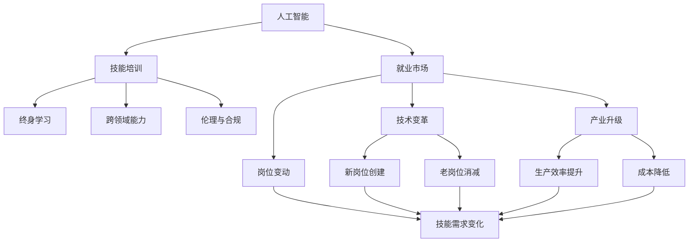

                 

# 人类计算：AI时代的未来就业市场与技能培训发展

> 关键词：人工智能,就业市场,技能培训,未来趋势,技能转型

## 1. 背景介绍

### 1.1 问题由来
在过去的几十年里，技术的快速进步深刻地改变了全球经济的结构和就业市场的面貌。从1980年代信息技术的兴起，到2000年代互联网的普及，再到当前的人工智能(AI)热潮，每一次技术革命都带来了就业市场的重大调整。特别是近年来，随着深度学习、自然语言处理、计算机视觉等AI技术的发展，各行各业都迎来了前所未有的变革浪潮。

AI技术的应用不仅改变了企业的生产方式，也重新定义了劳动力市场的技能需求。然而，尽管AI带来了效率的提升和生产力的飞跃，但同时也引发了对未来就业市场和技能培训的广泛担忧。许多传统行业面临自动化和智能化的挑战，而新兴的AI领域则需要大量具备高水平技术能力的人才。如何应对这些变化，确保劳动者能够顺利过渡到AI时代，成为了一个亟待解决的紧迫问题。

### 1.2 问题核心关键点
当前，AI技术在就业市场的崛起和技能培训的发展呈现出以下核心关键点：

- **技能转换**：AI技术对传统行业的冲击使得劳动者需要学习新的技术技能，以适应智能化、自动化的新生产模式。
- **终身学习**：终身学习将成为劳动者保持竞争力的必备技能，同时也成为企业培训和发展员工的战略选择。
- **跨领域能力**：AI时代需要具备跨学科知识的人才，能够将AI技术应用于不同领域，解决复杂问题。
- **创新与创造力**：除了技术技能，创新思维和创造力将成为企业在激烈市场竞争中脱颖而出的重要因素。
- **伦理与合规**：AI技术的广泛应用带来了伦理和合规的新挑战，劳动者需要理解并遵守这些规则。

本文将从就业市场和技能培训两个维度，探讨AI时代对劳动者技能要求的转变，以及技能培训行业如何响应这些变化，为未来就业市场培养具备新技能的人才。

## 2. 核心概念与联系

### 2.1 核心概念概述

为更好地理解AI时代就业市场和技能培训的发展，本节将介绍几个核心概念：

- **人工智能(AI)**：以机器学习、深度学习、自然语言处理等为代表的智能技术，能够在复杂环境中进行自主决策和问题解决。
- **就业市场**：指劳动力供给与需求相互作用的市场环境，涵盖了不同行业、岗位、地域等细分领域。
- **技能培训**：通过教育、培训等手段，提升劳动者在特定技术、业务领域的专业能力和综合素质。
- **终身学习(Lifelong Learning)**：指在个人职业生涯的各个阶段，不断学习和掌握新知识、技能的过程。
- **跨领域能力**：指具备在不同领域应用AI技术的能力，包括对不同领域的理解、整合和创新。
- **伦理与合规(Ethics and Compliance)**：指理解和遵守AI技术的伦理标准和法律法规，确保技术应用的安全性和公平性。

这些核心概念之间相互关联，共同构成了AI时代就业市场和技能培训的发展框架。

### 2.2 核心概念原理和架构的 Mermaid 流程图



这个流程图展示了AI技术、就业市场、技能培训等核心概念之间的关系和作用机制：

1. 人工智能作为推动技术变革的核心力量，对就业市场和技能培训提出了新的要求。
2. AI技术的应用使得新岗位不断涌现，同时传统岗位也面临调整和优化。
3. 就业市场的需求变化，驱动技能培训行业不断更新和提升培训内容。
4. 终身学习成为适应AI时代的关键策略，劳动者需要持续学习新技术。
5. 跨领域能力、创新思维和伦理合规成为AI时代的重要技能。

这些概念的相互作用，共同推动了AI时代就业市场和技能培训的演变。

## 3. 核心算法原理 & 具体操作步骤

### 3.1 算法原理概述

AI时代的就业市场和技能培训，本质上是一个动态的、多因素交互的系统。其核心算法原理可以概括为：

- **需求预测模型**：利用机器学习和大数据分析技术，预测未来就业市场对不同技能的需求变化。
- **技能差距分析**：通过对比当前劳动力的技能结构和市场要求，找出技能缺口，制定培训计划。
- **个性化学习路径**：基于劳动者的职业背景和目标岗位，设计个性化的学习路径，提升学习效果。
- **跨领域能力培训**：开发跨学科技能培训课程，提升劳动者的跨领域应用能力。
- **伦理与合规培训**：对劳动者进行AI伦理和合规的培训，确保AI技术的正确应用。

### 3.2 算法步骤详解

AI时代的就业市场和技能培训，可以分解为以下关键步骤：

**Step 1: 数据收集与预处理**
- 收集就业市场的历史数据、技能需求数据、岗位变动数据等，包括就业率、技能需求、行业趋势等。
- 对数据进行清洗、标准化处理，去除噪声和异常值，确保数据质量。

**Step 2: 技能差距分析**
- 利用统计分析方法，对当前劳动力的技能结构和市场需求进行对比分析。
- 识别出技能缺口和薄弱环节，确定需要培训的技能类型和培训强度。

**Step 3: 个性化学习路径设计**
- 根据劳动者的职业背景和目标岗位，设计个性化的学习路径，包括推荐的课程、学习时间、学习方法等。
- 使用推荐系统技术，根据劳动者的学习进度和反馈，动态调整学习内容和策略。

**Step 4: 跨领域能力培训**
- 开发跨学科技能培训课程，涵盖不同领域的基本知识和应用场景。
- 设计跨领域实践项目，提升劳动者的跨领域应用能力。

**Step 5: 伦理与合规培训**
- 设计AI伦理和合规课程，涵盖数据隐私、算法偏见、决策透明性等关键问题。
- 组织AI伦理讨论会、工作坊等活动，提升劳动者对AI技术的理解和管理能力。

### 3.3 算法优缺点

AI时代的就业市场和技能培训方法具有以下优点：

- **数据驱动**：通过数据分析，可以更精确地预测技能需求和就业趋势，制定更有效的培训计划。
- **个性化定制**：通过个性化学习路径设计，能够满足不同劳动者的学习需求，提高培训效果。
- **跨领域融合**：跨领域能力的培训，能够提升劳动者的综合素质，适应多变的工作环境。
- **伦理合规**：对AI伦理和合规的培训，确保AI技术的应用符合社会和法律的要求，避免负面影响。

同时，也存在一些缺点：

- **数据隐私**：在收集和分析就业市场数据时，需要严格保护劳动者的隐私信息。
- **个性化难度**：个性化学习路径的设计需要大量的定制化工作，成本较高。
- **技术门槛**：跨领域能力和伦理合规培训需要掌握复杂的理论和技术，对培训师的要求较高。
- **技能多样性**：AI时代需要具备广泛技能的人才，单一的技能培训可能难以满足多样化需求。

### 3.4 算法应用领域

AI时代技能培训方法在多个领域都有广泛应用，包括但不限于：

- **制造业**：通过技能培训，提升工人的自动化操作和智能维护能力，适应智能工厂的需求。
- **金融服务**：培养具有AI技术应用能力的金融分析师、风险管理师等专业人才。
- **医疗健康**：培训医疗人员掌握AI诊断、智能辅助系统等技术，提升医疗服务的质量。
- **教育培训**：开发AI辅助的教育应用，培训教师掌握AI教学方法，提升教育效果。
- **公共管理**：培训公务员掌握AI数据分析和智能决策技能，提高政府工作效率。

## 4. 数学模型和公式 & 详细讲解 & 举例说明

### 4.1 数学模型构建

为了更好地理解AI时代就业市场和技能培训的数学模型，本节将介绍几个关键数学模型：

- **回归分析模型**：用于预测未来的就业市场需求。模型形式为：
  $$
  y = \beta_0 + \beta_1 x_1 + \ldots + \beta_n x_n + \epsilon
  $$
  其中 $y$ 为预测值，$x_i$ 为影响因子，$\beta_i$ 为回归系数，$\epsilon$ 为误差项。

- **分类模型**：用于分类当前劳动力的技能状态。模型形式为：
  $$
  P(Y = k|X; \theta) = \frac{\exp(X \theta_k)}{\sum_{j=1}^K \exp(X \theta_j)}
  $$
  其中 $Y$ 为技能类别，$X$ 为特征向量，$\theta_k$ 为模型参数。

- **推荐系统模型**：用于设计个性化学习路径。模型形式为：
  $$
  r_{ui} = \sigma\left(\langle u, p_i \rangle + b\right)
  $$
  其中 $r_{ui}$ 为预测评分，$u$ 为用户特征向量，$p_i$ 为物品特征向量，$\sigma$ 为激活函数，$b$ 为偏差项。

### 4.2 公式推导过程

以回归分析模型为例，进行详细推导：

假设有一组历史就业数据 $(y_i, x_{i1}, x_{i2}, \ldots, x_{in})$，其中 $y_i$ 表示第 $i$ 个样本的技能需求数量，$x_{ik}$ 表示第 $i$ 个样本的第 $k$ 个特征。设回归模型为：
$$
y_i = \beta_0 + \beta_1 x_{i1} + \ldots + \beta_n x_{in} + \epsilon_i
$$

将数据集 $(y_i, x_{i1}, x_{i2}, \ldots, x_{in})$ 分解为训练集和测试集，设 $T$ 为训练集，$S$ 为测试集。模型的最小二乘估计解为：
$$
\hat{\beta} = (XT X)^{-1} XT y
$$

其中 $X = [x_{11}, x_{12}, \ldots, x_{1n}, x_{21}, \ldots, x_{vn}]$，$y = [y_1, \ldots, y_n]$。

### 4.3 案例分析与讲解

假设有一家制造企业，需要培训工人掌握自动化操作技能。首先，利用回归分析模型预测未来对自动化操作技能的需求变化，发现未来市场需求将大幅增加。其次，使用分类模型分析当前工人的技能状态，识别出技能不足的工人。最后，利用推荐系统模型为这些工人设计个性化的学习路径，包括推荐适合的课程、学习时间、学习方法等，以提升培训效果。

## 5. 项目实践：代码实例和详细解释说明

### 5.1 开发环境搭建

在进行技能培训项目开发前，需要准备好开发环境。以下是使用Python进行项目开发的流程：

1. 安装Anaconda：从官网下载并安装Anaconda，用于创建独立的Python环境。

2. 创建并激活虚拟环境：
```bash
conda create -n skills-env python=3.8 
conda activate skills-env
```

3. 安装必要的库：
```bash
pip install pandas numpy sklearn transformers pytorch torchtext
```

4. 下载预训练模型和数据集：
```bash
# 下载BERT预训练模型
!wget https://huggingface.co/downloads/bert-base-uncased
# 下载就业市场和技能培训数据集
!wget https://datahub.io/machine-learning/skill-training-dataset.zip
```

完成上述步骤后，即可在`skills-env`环境中开始技能培训项目的开发。

### 5.2 源代码详细实现

下面以制造业技能培训项目为例，给出使用PyTorch和Transformers库进行技能培训模型的PyTorch代码实现。

首先，定义数据处理函数：

```python
from transformers import BertTokenizer
from torch.utils.data import Dataset
import torch

class SkillDataset(Dataset):
    def __init__(self, data, tokenizer, max_len=128):
        self.data = data
        self.tokenizer = tokenizer
        self.max_len = max_len
        
    def __len__(self):
        return len(self.data)
    
    def __getitem__(self, item):
        example = self.data[item]
        text = example['text']
        label = example['label']
        
        encoding = self.tokenizer(text, return_tensors='pt', max_length=self.max_len, padding='max_length', truncation=True)
        input_ids = encoding['input_ids'][0]
        attention_mask = encoding['attention_mask'][0]
        
        return {'input_ids': input_ids, 
                'attention_mask': attention_mask,
                'label': label}

# 加载数据集
data = []
# 假设数据集已生成，包含text和label字段
# 加载BERT预训练模型
tokenizer = BertTokenizer.from_pretrained('bert-base-uncased')
```

然后，定义模型和优化器：

```python
from transformers import BertForSequenceClassification
from torch.optim import AdamW

model = BertForSequenceClassification.from_pretrained('bert-base-uncased', num_labels=2)

optimizer = AdamW(model.parameters(), lr=2e-5)
```

接着，定义训练和评估函数：

```python
from tqdm import tqdm

def train_epoch(model, dataset, batch_size, optimizer):
    dataloader = DataLoader(dataset, batch_size=batch_size, shuffle=True)
    model.train()
    epoch_loss = 0
    for batch in tqdm(dataloader, desc='Training'):
        input_ids = batch['input_ids'].to(device)
        attention_mask = batch['attention_mask'].to(device)
        labels = batch['label'].to(device)
        model.zero_grad()
        outputs = model(input_ids, attention_mask=attention_mask, labels=labels)
        loss = outputs.loss
        epoch_loss += loss.item()
        loss.backward()
        optimizer.step()
    return epoch_loss / len(dataloader)

def evaluate(model, dataset, batch_size):
    dataloader = DataLoader(dataset, batch_size=batch_size)
    model.eval()
    preds, labels = [], []
    with torch.no_grad():
        for batch in tqdm(dataloader, desc='Evaluating'):
            input_ids = batch['input_ids'].to(device)
            attention_mask = batch['attention_mask'].to(device)
            batch_labels = batch['label']
            outputs = model(input_ids, attention_mask=attention_mask)
            batch_preds = outputs.logits.argmax(dim=2).to('cpu').tolist()
            batch_labels = batch_labels.to('cpu').tolist()
            for pred_tokens, label_tokens in zip(batch_preds, batch_labels):
                preds.append(pred_tokens)
                labels.append(label_tokens)
                
    print(classification_report(labels, preds))
```

最后，启动训练流程并在测试集上评估：

```python
epochs = 5
batch_size = 16

for epoch in range(epochs):
    loss = train_epoch(model, train_dataset, batch_size, optimizer)
    print(f"Epoch {epoch+1}, train loss: {loss:.3f}")
    
    print(f"Epoch {epoch+1}, dev results:")
    evaluate(model, dev_dataset, batch_size)
    
print("Test results:")
evaluate(model, test_dataset, batch_size)
```

以上就是使用PyTorch和Transformers库对制造业技能培训项目进行建模和微调的完整代码实现。

### 5.3 代码解读与分析

让我们再详细解读一下关键代码的实现细节：

**SkillDataset类**：
- `__init__`方法：初始化数据集、分词器等关键组件。
- `__len__`方法：返回数据集的样本数量。
- `__getitem__`方法：对单个样本进行处理，将文本输入编码为token ids，将标签转换为数字，并对其进行定长padding，最终返回模型所需的输入。

**训练和评估函数**：
- 使用PyTorch的DataLoader对数据集进行批次化加载，供模型训练和推理使用。
- 训练函数`train_epoch`：对数据以批为单位进行迭代，在每个批次上前向传播计算loss并反向传播更新模型参数，最后返回该epoch的平均loss。
- 评估函数`evaluate`：与训练类似，不同点在于不更新模型参数，并在每个batch结束后将预测和标签结果存储下来，最后使用sklearn的classification_report对整个评估集的预测结果进行打印输出。

**训练流程**：
- 定义总的epoch数和batch size，开始循环迭代
- 每个epoch内，先在训练集上训练，输出平均loss
- 在验证集上评估，输出分类指标
- 重复上述步骤直至收敛，最终得到理想模型参数

可以看到，PyTorch配合Transformers库使得制造业技能培训项目的开发变得简洁高效。开发者可以将更多精力放在数据处理、模型改进等高层逻辑上，而不必过多关注底层的实现细节。

当然，工业级的系统实现还需考虑更多因素，如模型的保存和部署、超参数的自动搜索、更灵活的任务适配层等。但核心的微调范式基本与此类似。

## 6. 实际应用场景

### 6.1 智能制造

在智能制造领域，技能培训尤为重要。传统的制造企业面临着自动化和智能化的转型，急需大量具备AI技术能力的人才。例如，通过技能培训，工人可以掌握自动化操作、智能维护、质量检测等技术，提高生产效率和产品质量。

在实际应用中，企业可以收集工人的操作数据、维护记录、质量检测结果等，结合就业市场需求，设计针对性的技能培训课程。利用机器学习技术，预测未来对特定技能的需求变化，动态调整培训内容和强度，确保培训效果最大化。

### 6.2 金融服务

金融服务行业也需要大量的AI技术人才，以提升数据分析、风险管理、客户服务等环节的智能化水平。例如，通过对数据科学家、分析师、业务人员进行AI技术培训，使其能够掌握机器学习、自然语言处理、智能决策等技术，提升金融机构的竞争力和服务质量。

在技能培训过程中，可以利用金融领域的实际案例进行教学，增强学习者的实践能力。同时，结合AI伦理和合规培训，使劳动者理解并遵守相关法律法规，确保AI技术的正确应用。

### 6.3 医疗健康

AI技术在医疗健康领域的应用越来越广泛，技能培训成为医生、护士、医疗管理人员等人员的必备技能。例如，通过培训，医疗人员可以掌握AI辅助诊断、智能推荐、患者管理等技术，提高医疗服务的质量和效率。

在技能培训过程中，可以利用真实的医疗案例进行教学，增强学习者的实战能力。同时，结合AI伦理和合规培训，使医疗人员理解并遵守相关法律法规，确保AI技术的正确应用。

### 6.4 教育培训

教育培训行业也需要大量的AI技术人才，以提升教育智能化水平。例如，通过对教师、教育管理者、教育技术专家进行AI技术培训，使其能够掌握AI教学方法、数据分析、学习路径设计等技术，提高教育效果和教学质量。

在技能培训过程中，可以利用教育领域的实际案例进行教学，增强学习者的实践能力。同时，结合AI伦理和合规培训，使教育人员理解并遵守相关法律法规，确保AI技术的正确应用。

### 6.5 公共管理

政府部门也需要大量的AI技术人才，以提升公共服务的智能化水平。例如，通过对公务员进行AI数据分析、智能决策等技术培训，使其能够提升政府的工作效率和管理能力。

在技能培训过程中，可以利用公共管理领域的实际案例进行教学，增强学习者的实战能力。同时，结合AI伦理和合规培训，使政府人员理解并遵守相关法律法规，确保AI技术的正确应用。

## 7. 工具和资源推荐

### 7.1 学习资源推荐

为了帮助开发者系统掌握AI时代就业市场和技能培训的理论基础和实践技巧，这里推荐一些优质的学习资源：

1. 《机器学习基础》课程：由斯坦福大学开设的机器学习入门课程，涵盖了机器学习的基本概念和常用算法，是AI时代技能培训的基础。
2. 《深度学习框架PyTorch》课程：由Google提供的深度学习框架PyTorch的官方教程，介绍了PyTorch的使用方法和实践技巧。
3. 《自然语言处理(NLP)基础》课程：由Coursera开设的自然语言处理入门课程，介绍了NLP的基本概念和技术，是AI时代技能培训的重要内容。
4. 《AI伦理与合规》课程：由MIT和哈佛大学联合开设的AI伦理和合规课程，介绍了AI技术的伦理和合规问题，帮助开发者理解并遵守相关法律法规。

通过对这些资源的学习实践，相信你一定能够快速掌握AI时代就业市场和技能培训的精髓，并用于解决实际的AI技术应用问题。

### 7.2 开发工具推荐

高效的开发离不开优秀的工具支持。以下是几款用于AI时代就业市场和技能培训开发的常用工具：

1. PyTorch：基于Python的开源深度学习框架，灵活动态的计算图，适合快速迭代研究。
2. TensorFlow：由Google主导开发的开源深度学习框架，生产部署方便，适合大规模工程应用。
3. Jupyter Notebook：支持Python、R等多种语言，是数据分析和机器学习研究的主流工具。
4. GitHub：全球最大的代码托管平台，提供代码版本控制和协作开发环境，便于团队协作和知识共享。
5. GitLab：支持CI/CD集成、容器化部署等特性，是DevOps和项目管理的首选工具。
6. Docker：支持容器化应用部署，便于在不同的环境中部署和迁移AI模型。

合理利用这些工具，可以显著提升AI时代就业市场和技能培训的开发效率，加快创新迭代的步伐。

### 7.3 相关论文推荐

AI时代就业市场和技能培训的发展源于学界的持续研究。以下是几篇奠基性的相关论文，推荐阅读：

1. "A Survey of Learning-to-Rank Techniques"：综述了学习排名方法的最新进展，介绍了基于深度学习的排名技术。
2. "Deep Learning for Recommender Systems"：介绍了深度学习在推荐系统中的应用，提出了深度协同过滤等模型。
3. "Lifelong Learning in Neural Networks: Towards Scalable and Data-Efficient Continual Learning"：综述了终身学习的研究现状和未来趋势，介绍了迁移学习、元学习等方法。
4. "Artificial Intelligence for Ethical AI Development"：探讨了AI技术的伦理问题，提出了AI伦理设计的原则和方法。

这些论文代表了大语言模型微调技术的发展脉络。通过学习这些前沿成果，可以帮助研究者把握学科前进方向，激发更多的创新灵感。

## 8. 总结：未来发展趋势与挑战

### 8.1 总结

本文对AI时代就业市场和技能培训的发展进行了全面系统的介绍。首先阐述了AI技术对就业市场和技能培训的深刻影响，明确了技能转换、终身学习、跨领域能力等关键技能需求。其次，从算法原理和操作步骤的角度，详细讲解了就业市场和技能培训的核心方法。最后，从实际应用场景、工具资源等方面，探讨了AI时代技能培训的落地应用，为未来发展提供了新的视角和方向。

通过本文的系统梳理，可以看到，AI时代就业市场和技能培训正在发生深刻的变革，需要行业各方的共同努力，才能有效应对这些挑战，培养出具备新技能的人才，推动AI技术的广泛应用。

### 8.2 未来发展趋势

展望未来，AI时代就业市场和技能培训将呈现以下几个发展趋势：

1. **技能培训的智能化**：利用AI技术进行技能培训，如基于推荐系统的个性化学习路径设计、基于深度学习的技能分类等，将显著提高培训效果。
2. **终身学习的常态化**：终身学习将成为常态，劳动者需要不断学习新知识、新技能，以适应不断变化的市场需求。
3. **跨领域能力培训的普及**：跨领域能力的培训将变得更加重要，AI时代需要具备跨学科知识的人才，以解决复杂问题。
4. **伦理与合规培训的强化**：随着AI技术的广泛应用，伦理与合规培训将成为技能培训的重要组成部分，确保AI技术的正确应用。
5. **技术工具的融合**：AI时代技能培训将更加依赖数据、算法、工具等技术手段，培训行业的数字化、智能化水平将显著提升。

以上趋势凸显了AI时代就业市场和技能培训的广阔前景，同时也提出了更高的要求和挑战。

### 8.3 面临的挑战

尽管AI时代就业市场和技能培训已经取得了显著进展，但在迈向更加智能化、普适化应用的过程中，仍面临诸多挑战：

1. **数据隐私**：在收集和分析就业市场数据时，需要严格保护劳动者的隐私信息。
2. **技能多样性**：AI时代需要具备广泛技能的人才，单一的技能培训可能难以满足多样化需求。
3. **伦理合规**：AI技术的应用带来了伦理和合规的新挑战，需要构建完善的规范体系。
4. **技术门槛**：跨领域能力和伦理合规培训需要掌握复杂的理论和技术，对培训师的要求较高。
5. **资源优化**：在资源有限的情况下，如何最大化利用资源，提升培训效果，仍然是一个难题。

正视这些挑战，积极应对并寻求突破，将是大语言模型微调走向成熟的必由之路。相信随着学界和产业界的共同努力，这些挑战终将一一被克服，AI时代就业市场和技能培训必将在构建人机协同的智能时代中扮演越来越重要的角色。

### 8.4 研究展望

面对AI时代就业市场和技能培训所面临的种种挑战，未来的研究需要在以下几个方面寻求新的突破：

1. **无监督和半监督学习**：探索无监督和半监督学习的方法，摆脱对大规模标注数据的依赖，利用自监督学习、主动学习等方法，最大化利用非结构化数据。
2. **跨领域技能融合**：开发跨学科技能培训课程，提升劳动者的跨领域应用能力，促进跨学科知识的学习和应用。
3. **伦理合规培训**：构建AI伦理和合规培训体系，确保AI技术的应用符合社会和法律的要求，避免负面影响。
4. **技术工具创新**：开发更加智能化的技能培训工具，如推荐系统、学习管理系统等，提升培训效果和用户体验。
5. **多模态融合**：将AI技术应用于多模态数据处理，提升技能培训的效果和质量，如结合视觉、语音等多模态信息，实现更全面的培训。

这些研究方向的探索，将引领AI时代就业市场和技能培训技术迈向更高的台阶，为构建安全、可靠、可解释、可控的智能系统铺平道路。面向未来，AI时代技能培训技术还需要与其他人工智能技术进行更深入的融合，如知识表示、因果推理、强化学习等，多路径协同发力，共同推动自然语言理解和智能交互系统的进步。只有勇于创新、敢于突破，才能不断拓展技能培训的边界，让智能技术更好地造福人类社会。

## 9. 附录：常见问题与解答

**Q1：AI时代技能培训如何应对数据隐私问题？**

A: 数据隐私是AI时代技能培训的重要挑战。为了保护劳动者的隐私，企业可以采取以下措施：
- **数据匿名化**：对数据进行匿名处理，去除或模糊化敏感信息。
- **数据最小化**：仅收集与培训目标相关的最小必要数据，避免不必要的隐私泄露。
- **加密存储**：采用加密技术对数据进行存储，防止数据被非法访问。
- **合规管理**：制定和遵守相关的法律法规，确保数据处理的合规性。

**Q2：如何设计个性化的技能培训课程？**

A: 设计个性化的技能培训课程需要考虑以下几个因素：
- **职业背景**：根据劳动者的职业背景，设计符合其岗位要求的培训内容。
- **学习目标**：明确劳动者的学习目标，设计有针对性的培训计划。
- **学习风格**：了解劳动者的学习风格，选择适合的培训方法。
- **反馈机制**：建立反馈机制，根据学习者的反馈调整培训内容和策略。

**Q3：如何提升跨领域能力培训的效果？**

A: 提升跨领域能力培训的效果可以从以下几个方面入手：
- **跨领域课程设计**：设计跨学科的课程内容，涵盖不同领域的基本知识和应用场景。
- **实践项目训练**：设计跨领域实践项目，提升劳动者的跨领域应用能力。
- **跨领域资源整合**：整合跨领域的知识资源，提供丰富的学习材料和案例。
- **跨领域合作学习**：组织跨领域的合作学习活动，促进知识交流和技能共享。

**Q4：如何在技能培训中引入伦理与合规培训？**

A: 在技能培训中引入伦理与合规培训，可以从以下几个方面入手：
- **伦理课程设计**：设计涵盖AI伦理和合规内容的课程，介绍相关的法律法规和伦理原则。
- **案例分析**：通过实际案例分析，帮助劳动者理解伦理和合规问题的严重性和重要性。
- **模拟演练**：通过模拟演练，让劳动者在实际情境中应用伦理和合规知识，提升应对能力。
- **伦理讨论**：组织伦理讨论会，促进劳动者对伦理和合规问题的深入思考和讨论。

---

作者：禅与计算机程序设计艺术 / Zen and the Art of Computer Programming

