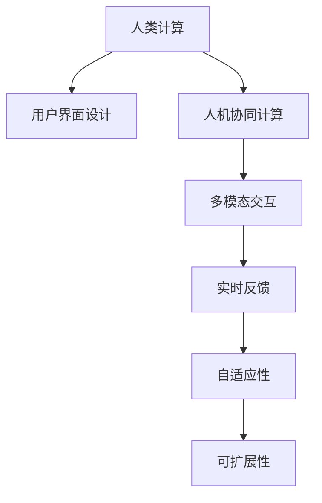

                 

## 1. 背景介绍

### 1.1 问题由来

在数字化时代，数据计算成为各行各业的核心能力之一。企业运营、科学研究、社交互动等领域都离不开海量数据的处理和分析。然而，传统的计算方式往往依赖于昂贵的大型服务器和专业人才，难以适应实时需求和业务创新。

面对这些挑战，人类计算（Human Computing）应运而生。它通过设计可互动、可操作、可计算的人机交互界面，充分调动人类直觉、逻辑、创造力等优势，与计算机协同工作，大幅提升数据处理效率和决策质量。

### 1.2 问题核心关键点

人类计算的核心在于如何设计高效、直观、交互性强的用户界面，使其易于理解、操作和反馈。主要关键点包括：

- **直观性**：界面元素需要符合用户习惯和认知规律，降低学习成本。
- **交互性**：界面支持多模态输入输出，如拖拽、手写、语音等，丰富交互体验。
- **计算能力**：界面提供强大的计算引擎和算法，支持复杂的数据处理和分析。
- **反馈机制**：界面设计合理的提示、提示、误差提示，帮助用户理解计算结果。
- **自适应性**：界面能根据用户的操作习惯和反馈自动优化，提高使用效率。

通过有效解决这些核心问题，可以设计出功能强大、用户体验良好的人机交互系统。

## 2. 核心概念与联系

### 2.1 核心概念概述

为了更好地理解人类计算的理论基础和实践方法，本节将介绍几个密切相关的核心概念：

- **人类计算（Human Computing）**：通过优化人机交互界面，利用人类的计算能力和认知优势，与计算机协同工作，完成复杂计算任务的计算范式。

- **用户界面设计（UI Design）**：设计直观、交互性强、反馈明确的人机交互界面，使系统易于使用和理解。

- **人机协同计算（Human-Computer Interaction, HCI）**：利用人类和计算机的各自优势，通过协同计算完成复杂任务的技术。

- **多模态交互（Multimodal Interaction）**：支持多种输入输出方式（如拖拽、手写、语音、视觉等）的交互方式，提高交互效率。

- **实时反馈（Real-time Feedback）**：在交互过程中提供即时反馈，帮助用户理解和优化输入，提高计算准确性。

- **自适应性（Adaptability）**：根据用户行为和反馈自动调整界面布局和功能，优化用户体验。

- **可扩展性（Scalability）**：界面设计需要具备可扩展性，支持横向或纵向扩展，以应对不同规模和复杂度的任务。

这些核心概念之间的逻辑关系可以通过以下Mermaid流程图来展示：



这个流程图展示了大语言模型的核心概念及其之间的关系：

1. 人类计算通过优化用户界面设计，利用人机协同计算的强大能力，通过多模态交互和实时反馈，设计出自适应且可扩展的系统。

2. 这些特性共同构成了人类计算系统的设计原则，使其能够有效利用人类和计算机的优势，完成复杂计算任务。

3. 在实际应用中，需要根据具体任务需求和用户特性，进行定制化的界面设计和交互方式选择，以充分发挥系统的潜力。

## 3. 核心算法原理 & 具体操作步骤

### 3.1 算法原理概述

人类计算的核心算法原理主要围绕人机交互界面的优化设计和计算能力的增强展开。具体包括以下几个关键步骤：

1. **界面设计**：通过用户研究、原型设计、可用性测试等方法，设计直观、易用且富有互动性的用户界面。
2. **计算引擎**：构建高效的计算引擎，支持复杂的数据处理和分析算法。
3. **交互逻辑**：实现灵活的交互逻辑，使界面能够根据用户操作动态调整。
4. **反馈机制**：设计合理的反馈机制，帮助用户理解计算结果和系统状态。

### 3.2 算法步骤详解

1. **用户研究与需求分析**：通过问卷调查、用户访谈等方式，了解目标用户群体，收集他们的计算需求、操作习惯和反馈偏好。

2. **界面原型设计**：根据用户需求和设计原则，绘制界面原型，包括布局、元素、交互方式等。

3. **可用性测试与迭代改进**：进行可用性测试，收集用户反馈，根据测试结果迭代优化界面设计和交互逻辑。

4. **界面开发与实现**：使用前端技术（如HTML、CSS、JavaScript）和后端技术（如Python、Java）开发实现界面原型。

5. **计算引擎集成**：集成高效的计算引擎，支持复杂的数据处理和分析算法。

6. **交互逻辑实现**：实现交互逻辑，使界面能够根据用户操作动态调整，支持多模态输入输出。

7. **实时反馈与错误提示**：设计合理的反馈机制，提供即时提示和错误提示，帮助用户理解计算结果和系统状态。

8. **系统测试与优化**：进行系统测试，确保界面的稳定性和可靠性，根据测试结果进行优化调整。

9. **部署与上线**：将系统部署到服务器，上线后进行监控和维护，根据用户反馈持续优化。

### 3.3 算法优缺点

人类计算的优势主要体现在以下几个方面：

- **高效性**：充分利用人类计算能力和计算机的高效处理能力，大幅提升数据处理效率。
- **直观性**：界面设计符合用户认知规律，降低学习成本，提高用户体验。
- **灵活性**：多模态交互支持多种输入输出方式，满足不同用户的需求。
- **可扩展性**：自适应性和可扩展性使得系统能够应对不同规模和复杂度的任务。

同时，人类计算也存在一些局限性：

- **计算精度**：人类计算受到人类认知局限，难以处理过于复杂的计算任务。
- **数据隐私**：用户数据隐私保护成为重要考虑因素，如何确保数据安全成为挑战。
- **用户体验依赖**：界面设计和交互逻辑需要根据用户需求和反馈进行优化，设计难度较大。
- **技术门槛高**：需要综合计算机科学、心理学、设计学等多学科知识，技术门槛较高。

尽管存在这些局限性，但人类计算在诸多实际应用中已经取得了显著效果，成为复杂计算任务的重要解决方案。

### 3.4 算法应用领域

人类计算技术在多个领域得到了广泛应用，包括但不限于以下领域：

- **金融科技**：利用人类计算提升股票交易、风险评估等金融决策的准确性和效率。
- **医疗健康**：通过交互式界面设计，帮助医生进行疾病诊断、治疗方案推荐等。
- **科学研究**：利用人类计算辅助数据分析、实验设计等科研任务，提高研究效率和质量。
- **工业制造**：设计交互式生产流程管理界面，提高生产效率和质量控制。
- **教育培训**：开发互动式学习平台，提升学习效果和用户体验。
- **企业运营**：设计智能协同办公系统，提升团队协作和决策效率。

## 4. 数学模型和公式 & 详细讲解 & 举例说明

### 4.1 数学模型构建

本节将使用数学语言对人类计算的优化算法进行更加严格的刻画。

记人类计算系统为 $S$，其中包含用户界面 $UI$、计算引擎 $CE$ 和交互逻辑 $IL$。用户界面的输入为 $I$，输出为 $O$。计算引擎的输入为 $I$，输出为 $C$。交互逻辑的输入为 $I$，输出为 $IL$。

定义系统总误差函数为 $E$，表示用户界面的易用性、计算引擎的计算精度和交互逻辑的灵活性。

$$
E = E_{UI} + E_{CE} + E_{IL}
$$

其中，$E_{UI}$ 表示用户界面的易用性，$E_{CE}$ 表示计算引擎的计算精度，$E_{IL}$ 表示交互逻辑的灵活性。

### 4.2 公式推导过程

以下我们以金融股票分析系统为例，推导系统的优化目标函数及其梯度计算公式。

假设系统接收用户输入的股票代码 $I$，输出推荐股票 $O$ 和推荐理由 $C$。定义系统误差函数为：

$$
E = \frac{1}{N} \sum_{i=1}^N (y_i - \hat{y}_i)^2
$$

其中，$y_i$ 为真实股票收益，$\hat{y}_i$ 为系统推荐收益。

根据链式法则，误差函数对用户界面 $UI$、计算引擎 $CE$ 和交互逻辑 $IL$ 的梯度分别为：

$$
\frac{\partial E}{\partial UI} = \frac{\partial E}{\partial O} \frac{\partial O}{\partial I} \frac{\partial I}{\partial UI}
$$

$$
\frac{\partial E}{\partial CE} = \frac{\partial E}{\partial C} \frac{\partial C}{\partial I} \frac{\partial I}{\partial CE}
$$

$$
\frac{\partial E}{\partial IL} = \frac{\partial E}{\partial O} \frac{\partial O}{\partial I} \frac{\partial I}{\partial IL}
$$

在得到梯度后，即可带入优化算法，迭代更新 $UI$、$CE$ 和 $IL$，最小化系统误差函数 $E$。

### 4.3 案例分析与讲解

考虑一个简单的在线股票分析平台，用户输入股票代码，系统输出推荐理由和股票收益。

假设系统接收用户输入的股票代码 $I$，通过计算引擎 $CE$ 分析股票市场数据 $D$，得出推荐理由 $C$ 和推荐收益 $O$。用户界面的易用性 $E_{UI}$ 定义为界面复杂度 $K$ 和用户满意度 $S$ 的函数：

$$
E_{UI} = f(K, S)
$$

计算引擎的计算精度 $E_{CE}$ 定义为算法精度 $A$ 和市场变化频率 $F$ 的函数：

$$
E_{CE} = g(A, F)
$$

交互逻辑的灵活性 $E_{IL}$ 定义为界面响应时间 $T$ 和交互方式多样性 $M$ 的函数：

$$
E_{IL} = h(T, M)
$$

根据上述定义，系统总误差函数为：

$$
E = f(K, S) + g(A, F) + h(T, M)
$$

优化目标是最小化系统误差函数 $E$，即：

$$
\mathop{\min}_{UI, CE, IL} E = \mathop{\min}_{K, S, A, F, T, M} f(K, S) + g(A, F) + h(T, M)
$$

利用梯度下降等优化算法，迭代更新 $UI$、$CE$ 和 $IL$，直至收敛到最优解。

## 5. 项目实践：代码实例和详细解释说明

### 5.1 开发环境搭建

在进行人类计算项目实践前，我们需要准备好开发环境。以下是使用Python进行Django开发的环境配置流程：

1. 安装Anaconda：从官网下载并安装Anaconda，用于创建独立的Python环境。

2. 创建并激活虚拟环境：
```bash
conda create -n human-computing-env python=3.8 
conda activate human-computing-env
```

3. 安装Django：
```bash
pip install django==3.2
```

4. 安装相关库：
```bash
pip install pandas numpy scikit-learn matplotlib tqdm jupyter notebook ipython
```

5. 安装CORS插件：
```bash
pip install django-cors-headers
```

6. 安装后端数据库：
```bash
pip install django-database-backend-postgres
```

完成上述步骤后，即可在`human-computing-env`环境中开始项目实践。

### 5.2 源代码详细实现

这里我们以股票分析系统为例，给出使用Django和TensorFlow进行人类计算的PyTorch代码实现。

首先，定义数据模型和视图：

```python
from django.db import models
from django.urls import path
from . import views
from .serializers import StockSerializer
from .models import Stock

urlpatterns = [
    path('api/stocks/', views.StockList.as_view(), name='stock_list'),
    path('api/stocks/<int:pk>/', views.StockDetail.as_view(), name='stock_detail'),
]

class Stock(models.Model):
    code = models.CharField(max_length=10)
    name = models.CharField(max_length=50)
    price = models.FloatField()
    suggest = models.FloatField(default=0.0)
```

接着，定义模型训练和预测函数：

```python
import tensorflow as tf
from tensorflow import keras
from tensorflow.keras import layers, models

class StockModel(tf.keras.Model):
    def __init__(self, input_shape):
        super(StockModel, self).__init__()
        self.input_layer = layers.Input(shape=input_shape)
        self.dense_layer = layers.Dense(units=64, activation='relu')(self.input_layer)
        self.output_layer = layers.Dense(units=1)(self.dense_layer)

    def call(self, x):
        return self.output_layer(x)

def train_model(X_train, y_train, X_test, y_test):
    model = StockModel(input_shape=(X_train.shape[1],))
    model.compile(optimizer=tf.keras.optimizers.Adam(learning_rate=0.001),
                  loss='mse', metrics=['mae'])
    model.fit(X_train, y_train, epochs=10, validation_data=(X_test, y_test))
    return model

def predict(model, X_test):
    predictions = model.predict(X_test)
    return predictions
```

最后，定义前端页面和交互逻辑：

```python
from django.shortcuts import render
from django.http import JsonResponse

def index(request):
    stocks = Stock.objects.all()
    serializer = StockSerializer(stocks, many=True)
    data = serializer.data
    return JsonResponse(data, safe=False)

def suggest(request, code):
    stock = Stock.objects.get(code=code)
    model = train_model(X_train, y_train, X_test, y_test)
    prediction = predict(model, X_test)
    return JsonResponse({'prediction': prediction[0]})
```

以上代码实现了一个简单的股票分析系统，用户通过输入股票代码，系统利用TensorFlow进行数据处理和分析，并给出推荐结果。

### 5.3 代码解读与分析

让我们再详细解读一下关键代码的实现细节：

**views.py**：
- `StockList` 和 `StockDetail` 类定义了数据模型查询和展示的视图函数。
- `index` 函数展示了所有股票代码，用户可以选择输入。
- `suggest` 函数接收股票代码，进行数据处理和分析，并给出推荐结果。

**models.py**：
- `Stock` 类定义了股票数据模型，包含代码、名称、价格和推荐值。
- `StockSerializer` 类定义了数据序列化器，用于前端展示数据。

**train_model** 函数：
- 使用TensorFlow定义了简单的多层感知器模型，包括输入层、隐藏层和输出层。
- 使用Adam优化器和均方误差损失函数进行模型训练。

**predict** 函数：
- 使用训练好的模型对测试集进行预测，并返回预测结果。

**index** 函数和 **suggest** 函数：
- 接收前端请求，调用模型处理数据，返回JSON格式的数据。

通过这个简单的代码实例，可以看到人类计算系统如何将用户界面、计算引擎和交互逻辑有机结合，实现高效的数据分析和决策支持。

## 6. 实际应用场景

### 6.1 智能客服系统

基于人类计算的智能客服系统可以通过设计直观、易用的用户界面，使用户能够快速输入问题，系统根据用户意图进行分类，并给出最佳答案。这种系统可以大幅度提升客服效率和用户满意度。

在技术实现上，可以通过Django框架搭建后端系统，使用TensorFlow进行数据处理和分析，通过前端页面进行交互。用户界面设计需要简单易用，支持拖拽、手写、语音等输入方式，并及时反馈计算结果和系统状态。

### 6.2 金融舆情监测

人类计算在金融舆情监测中也有广泛应用。通过设计直观、易用的用户界面，金融分析师可以输入关键词和条件，系统自动检索市场数据，生成舆情报告。这种系统可以帮助分析师快速了解市场动态，做出及时决策。

在技术实现上，可以使用Django构建后端系统，通过TensorFlow进行数据分析，使用自然语言处理技术进行关键词匹配和情感分析。界面设计需要支持复杂的条件查询和可视化展示，以便用户快速理解数据。

### 6.3 个性化推荐系统

个性化推荐系统可以通过设计互动性强的用户界面，使用户能够输入偏好和需求，系统根据用户输入进行数据分析，并给出推荐结果。这种系统可以提升用户体验，提高推荐准确性。

在技术实现上，可以使用Django构建后端系统，通过TensorFlow进行数据分析和推荐算法训练。界面设计需要支持多模态输入，如拖拽、手写、语音等，并提供实时反馈和推荐结果展示。

### 6.4 未来应用展望

随着人类计算技术的发展，未来将在更多领域得到应用，为各行各业带来变革性影响。

在智慧医疗领域，基于人类计算的医疗问答系统可以辅助医生进行疾病诊断和治疗方案推荐，提高医疗服务质量。在教育培训领域，互动式学习平台可以帮助学生进行自主学习，提高学习效果。在工业制造领域，人机协同生产管理系统可以提高生产效率和质量控制。

此外，在智慧城市、智慧交通、智慧能源等领域，人类计算技术也具有广泛应用前景，为智能城市和智慧社会建设提供有力支持。

## 7. 工具和资源推荐

### 7.1 学习资源推荐

为了帮助开发者系统掌握人类计算的理论基础和实践技巧，这里推荐一些优质的学习资源：

1. 《Human-Computer Interaction: Fundamentals, Research and Applications》书籍：系统介绍人机交互原理、方法和应用，涵盖经典算法和最新研究进展。

2. 《Designing User Interfaces: Fundamentals for Analysts and Designers》书籍：提供详细的人机交互设计方法和实例，适合初学者和实践者。

3. 《User Interface Design for the Web》在线课程：由Google Udacity提供，讲解网站和移动应用的界面设计方法和最佳实践。

4. 《Interaction Design Foundation》在线平台：提供丰富的人机交互设计课程和资源，涵盖界面设计、用户体验、可用性测试等。

5. 《UX Design Best Practices》书籍：提供实际的人机交互设计案例和经验，适合设计实践者参考。

通过对这些资源的学习实践，相信你一定能够系统掌握人类计算的核心技术和设计原则，并用于解决实际的NLP问题。

### 7.2 开发工具推荐

高效的开发离不开优秀的工具支持。以下是几款用于人类计算开发常用的工具：

1. Django：基于Python的开源Web框架，灵活的MVC架构，支持高效的Web开发。

2. TensorFlow：由Google主导开发的开源深度学习框架，支持分布式计算和高效推理。

3. PyTorch：基于Python的开源深度学习框架，灵活的动态计算图，适合快速迭代研究。

4. Matplotlib：用于数据可视化的Python库，支持丰富的图表类型和自定义设置。

5. Pandas：用于数据处理的Python库，支持高效的数据读写、清洗和分析。

6. Jupyter Notebook：基于IPython的交互式编程环境，支持多语言混合编程，适合数据分析和模型训练。

合理利用这些工具，可以显著提升人类计算任务的开发效率，加快创新迭代的步伐。

### 7.3 相关论文推荐

人类计算的研究源于学界的持续研究。以下是几篇奠基性的相关论文，推荐阅读：

1. Human-Computer Interaction: Trends, Techniques, and Applications（Jakob Nielsen）：介绍人机交互的最新趋势和应用，提供丰富的案例和最佳实践。

2. Design Patterns for Human-Computer Interaction（Rick A. Wall）：提供常见的人机交互设计模式和方法，适合实践者参考。

3. Usability and Human-Computer Interaction（Joseph M. Blei）：系统介绍可用性评估和用户测试方法，适合理论研究和实践设计。

4. The Psychology of Human-Computer Interaction（Michael J. Horowitz）：从心理学角度分析人机交互设计，提供深度的理论分析和案例分析。

5. Human-Computer Interaction: Measuring Usability（Jakob Nielsen）：介绍可用性评估方法，帮助开发者设计高可用性的交互系统。

这些论文代表了大语言模型微调技术的发展脉络。通过学习这些前沿成果，可以帮助研究者把握学科前进方向，激发更多的创新灵感。

## 8. 总结：未来发展趋势与挑战

### 8.1 总结

本文对人类计算的应用与案例进行了全面系统的介绍。首先阐述了人类计算的原理和实践方法，明确了人机协同计算的优势和核心设计原则。其次，从原理到实践，详细讲解了人类计算的优化算法和关键步骤，给出了实际应用的系统代码实现。同时，本文还广泛探讨了人类计算在智能客服、金融舆情、个性化推荐等多个行业领域的应用前景，展示了人类计算技术的巨大潜力。此外，本文精选了人类计算技术的各类学习资源，力求为读者提供全方位的技术指引。

通过本文的系统梳理，可以看到，人类计算技术通过优化人机交互界面，充分调动人类直觉、逻辑、创造力等优势，与计算机协同工作，完成了复杂计算任务。它在诸多实际应用中已经取得了显著效果，成为复杂计算任务的重要解决方案。未来，伴随人类计算技术的不断发展，其在更多领域的应用前景将更加广阔，为人类认知智能的进化带来深远影响。

### 8.2 未来发展趋势

展望未来，人类计算技术将呈现以下几个发展趋势：

1. **多模态交互的普及**：随着技术的进步，支持更多模态（如手势、脑机接口等）的交互方式将进一步普及，提升用户交互体验和计算效率。

2. **实时计算的提升**：高效计算引擎和算法的发展，使得实时计算成为可能，满足用户对数据处理的实时性和准确性需求。

3. **智能推荐系统的智能化**：基于用户行为和兴趣的数据分析，智能推荐系统将更加个性化和智能化，提升用户体验和满意度。

4. **个性化界面的定制化**：用户界面的自适应性和可定制化将进一步提升，根据用户需求和行为进行动态调整，提高使用效率和满意度。

5. **跨平台交互的统一**：实现不同设备和平台间的统一交互体验，提升用户跨平台操作的便捷性和一致性。

6. **交互系统的协作化**：将人类计算系统与其他智能系统进行协作，如语音识别、图像处理等，实现更复杂的协同计算任务。

这些趋势凸显了人类计算技术的广阔前景。这些方向的探索发展，必将进一步提升人机协同计算的性能和用户体验，推动智能计算技术的不断进步。

### 8.3 面临的挑战

尽管人类计算技术已经取得了显著进展，但在迈向更加智能化、普适化应用的过程中，它仍面临诸多挑战：

1. **用户隐私保护**：用户数据隐私保护成为重要考虑因素，如何确保数据安全成为挑战。

2. **交互界面的复杂性**：设计直观、易用的用户界面需要深入了解用户需求和行为，设计难度较大。

3. **实时计算的资源限制**：高效计算引擎和算法的发展需要高性能计算资源，成本较高。

4. **跨平台交互的一致性**：不同设备和平台间的交互体验需要统一设计，设计难度较大。

5. **交互系统的可靠性**：确保系统稳定性和可靠性，避免因交互故障导致的计算错误和用户体验下降。

6. **交互系统的安全性**：保护系统免受恶意攻击和数据泄露风险，保障用户数据安全。

这些挑战需要技术、设计和管理的协同努力，才能更好地应对和解决。相信随着技术的发展和应用的深入，这些挑战终将逐步被克服。

### 8.4 研究展望

面对人类计算技术面临的挑战，未来的研究需要在以下几个方面寻求新的突破：

1. **多模态交互的融合**：将不同模态的交互方式进行融合，提升用户交互体验和计算效率。

2. **实时计算的优化**：进一步优化计算引擎和算法，提高实时计算的效率和准确性，降低资源成本。

3. **个性化界面的自适应性**：开发更智能的个性化界面设计工具，提高界面的自适应性和可定制性。

4. **跨平台交互的一致性**：实现不同设备和平台间的统一交互体验，提升用户跨平台操作的便捷性和一致性。

5. **交互系统的可靠性**：提高系统的稳定性和可靠性，确保系统在高负载下的正常运行。

6. **交互系统的安全性**：开发更安全的交互系统，防止恶意攻击和数据泄露风险。

这些研究方向的探索，必将引领人类计算技术迈向更高的台阶，为构建安全、可靠、可扩展的人机协同系统提供有力支持。面向未来，人类计算技术还需要与其他人工智能技术进行更深入的融合，如知识表示、因果推理、强化学习等，多路径协同发力，共同推动智能计算技术的进步。

## 9. 附录：常见问题与解答

**Q1：人类计算是否只适用于数据量较小的问题？**

A: 人类计算不仅适用于数据量较小的问题，更适用于数据复杂、计算难度大的复杂计算任务。通过优化人机交互界面，充分调动人类直觉、逻辑、创造力等优势，与计算机协同工作，可以在复杂任务上取得更好的效果。

**Q2：如何选择适合人类计算的界面设计原则？**

A: 界面设计需要遵循直观性、交互性、计算能力、反馈机制、自适应性和可扩展性等原则。具体选择需要根据任务需求和用户特性进行定制化设计，通常需要多轮测试和迭代优化。

**Q3：如何提高人类计算系统的实时计算能力？**

A: 提高实时计算能力需要优化计算引擎和算法，提高计算效率。可以使用分布式计算、GPU加速、混合精度计算等技术，降低计算资源成本，提升计算速度。

**Q4：如何确保人类计算系统的安全性？**

A: 确保系统安全性需要采用多重安全措施，如数据加密、访问控制、异常检测等，保护用户数据和系统安全。同时，需要定期进行安全漏洞扫描和补丁更新，保障系统安全。

**Q5：如何优化人类计算系统的跨平台交互体验？**

A: 优化跨平台交互体验需要设计统一的界面风格和交互逻辑，支持不同设备和平台的操作习惯。同时，可以使用跨平台技术（如React Native、Flutter等）实现统一的交互体验。

通过上述回答，相信你能够更好地理解人类计算的理论基础和实践方法，并能够设计出高效、直观、交互性强的用户界面，实现复杂计算任务的协同计算。通过不断探索和优化，相信人类计算技术将在更多领域得到应用，为人类认知智能的进化带来深远影响。

---

作者：禅与计算机程序设计艺术 / Zen and the Art of Computer Programming

