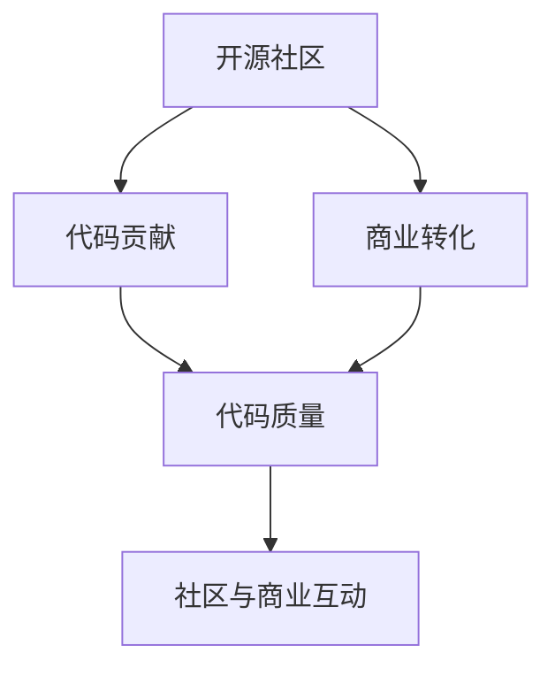
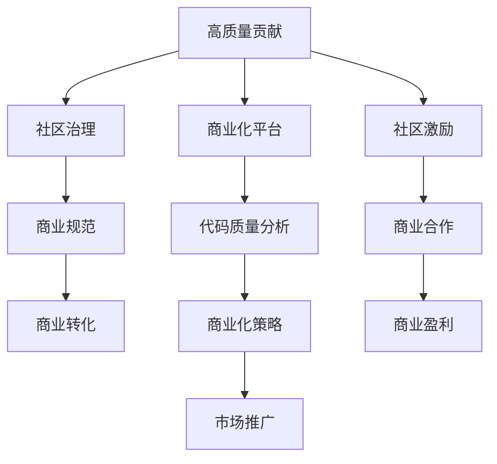

                 

# 从代码贡献到开源商业化

> 关键词：开源商业化,代码贡献,开源社区,商业转化,技术创新

## 1. 背景介绍

在现代软件开发中，开源已经成为一个重要的组成部分。源代码的开放性为技术创新提供了广泛的社区支持，促进了技术的快速迭代和传播。然而，如何将开源代码转化为商业价值，实现盈利和可持续发展的目标，成为许多开源项目和创业公司面临的重大挑战。本文将从开源代码贡献的角度出发，探讨如何通过高质量的代码贡献，为开源社区和商业项目带来持久的价值，并实现开源与商业化的有机结合。

### 1.1 问题由来

开源社区是软件开发中的宝贵资源，拥有海量的代码库和活跃的开发者群体。然而，开源代码的管理、维护和转化，存在诸多难题：

1. **代码质量参差不齐**：开源项目的代码质量往往良莠不齐，许多未经过充分测试和优化的代码，难以直接用于商业应用。
2. **贡献者激励机制不足**：缺乏有效的激励机制，导致大量高质量的代码贡献者流失，项目长期发展受限。
3. **商业转化成本高**：从开源代码到商业产品的转化，需要投入大量的人力和时间，成本高昂。
4. **社区与商业利益冲突**：开源项目和商业项目在商业化过程中，面临利益分配、版本管理等多方面的冲突。

面对这些问题，如何在保证开源代码高质量贡献的同时，推动其商业化进程，成为摆在开源项目和创业公司面前的重要课题。

### 1.2 问题核心关键点

开源商业化的核心关键点在于：

- **代码贡献的高质量与可持续性**：高质量的代码贡献是开源项目成功的基石，同时需要保证代码贡献的持续性和可维护性。
- **社区与商业的良性互动**：促进开源社区和商业项目之间的良性互动，形成共赢的生态系统。
- **商业转化策略的有效性**：设计合理的商业转化策略，将开源代码转化为具有市场竞争力的商业产品。
- **社区治理与商业规范的统一**：在开源项目和商业项目之间建立统一的治理和规范机制，确保代码贡献和商业化过程的协调一致。

本文将围绕这些核心关键点，系统探讨从代码贡献到开源商业化的全流程策略，并结合实际案例进行详细解析。

## 2. 核心概念与联系

### 2.1 核心概念概述

为了更好地理解从代码贡献到开源商业化的过程，我们首先介绍几个核心概念：

- **开源社区（Open Source Community）**：由一群志愿者共同维护的开源项目，旨在共享技术，推动技术创新和传播。
- **商业项目（Commercial Project）**：基于开源代码开发的应用软件或服务，旨在实现商业价值和盈利。
- **代码贡献（Code Contribution）**：开发者向开源项目提交代码、文档或修复Bug等行为。
- **商业转化（Commercialization）**：将开源代码转化为具有市场竞争力的商业产品和服务的过程。
- **代码质量（Code Quality）**：代码的可靠性、可维护性和可扩展性等综合属性，是代码贡献和商业转化的基础。

这些概念之间的逻辑关系可以通过以下Mermaid流程图来展示：



这个流程图展示了一个开源项目从代码贡献到商业转化的全流程：

1. 开源社区提供平台，吸引开发者进行代码贡献。
2. 开发者通过高质量的代码贡献，提升项目质量。
3. 商业项目基于开源代码进行开发和优化，实现商业化。
4. 社区与商业之间通过互动，促进技术进步和商业价值实现。

### 2.2 核心概念原理和架构的 Mermaid 流程图



这个流程图进一步详细展示了高质量代码贡献到开源商业化的全流程架构：

1. 高质量的代码贡献是开源项目和商业转化的基础。
2. 社区治理和商业规范的制定，确保代码贡献和商业转化的顺利进行。
3. 商业化平台为开源代码的商业转化提供支持。
4. 代码质量分析工具和商业化策略的结合，提升商业转化效率。
5. 市场推广和商业合作的推动，实现商业盈利。

这些核心概念及其相互联系，共同构成了从代码贡献到开源商业化的全流程架构，帮助开发者、项目管理者理解开源与商业化的综合管理策略。

## 3. 核心算法原理 & 具体操作步骤

### 3.1 算法原理概述

从代码贡献到开源商业化的过程，本质上是开源代码从技术创新到市场应用的转化过程。这一过程涉及多个环节，包括代码贡献、代码质量管理、商业转化策略、市场推广等。本文将重点介绍如何通过算法和技术手段，优化和加速这一转化过程。

### 3.2 算法步骤详解

#### 3.2.1 代码贡献的高质量管理

高质量的代码贡献是开源项目和商业转化的基础。为了确保高质量的代码贡献，可以采取以下步骤：

1. **代码审查（Code Review）**：通过代码审查机制，对提交的代码进行严格审核，确保代码质量符合项目标准。
2. **代码贡献指南（Contributing Guidelines）**：提供详细的代码贡献指南，帮助开发者理解项目的代码风格和最佳实践。
3. **代码质量评估（Code Quality Assessment）**：使用代码质量评估工具，自动检测代码中的潜在问题和漏洞，提高代码审查效率。

#### 3.2.2 代码质量的管理与优化

代码质量是确保开源项目和商业转化的关键。以下是管理与优化代码质量的主要步骤：

1. **静态代码分析（Static Code Analysis）**：使用静态代码分析工具，检测代码中的潜在问题和漏洞，提前发现并解决潜在问题。
2. **持续集成（Continuous Integration）**：通过持续集成平台，自动化地执行代码构建和测试，确保每次提交的代码都能稳定运行。
3. **代码重构（Code Refactoring）**：定期对代码进行重构，提升代码的可读性和可维护性，减少未来的技术债务。

#### 3.2.3 商业转化的策略与实现

商业转化是开源项目和商业化进程的核心环节。以下是实现商业转化的主要步骤：

1. **商业化平台（Commercialization Platform）**：搭建商业化平台，提供工具和支持，帮助开发者将开源代码转化为商业产品。
2. **商业化策略（Commercialization Strategy）**：制定合理的商业化策略，选择合适的商业化路径，确保商业转化的成功。
3. **商业合作（Commercial Cooperation）**：与商业合作伙伴建立紧密的合作关系，共同开发和推广商业产品，提升市场竞争力。

#### 3.2.4 市场推广与商业盈利

市场推广和商业盈利是开源项目商业化的最终目标。以下是实现市场推广和商业盈利的关键步骤：

1. **市场推广（Market Promotion）**：制定市场推广计划，通过各种渠道宣传和推广商业产品，提高市场曝光率。
2. **商业盈利模式（Commercial Revenue Model）**：选择合适的盈利模式，如订阅、广告、增值服务等，实现商业盈利。
3. **反馈机制（Feedback Mechanism）**：建立反馈机制，及时了解用户需求和市场变化，调整商业化策略，优化产品和服务。

### 3.3 算法优缺点

从代码贡献到开源商业化的算法具有以下优点：

1. **代码质量高**：高质量的代码贡献是商业转化的基础，有助于提升商业产品的稳定性和可靠性。
2. **社区与商业的良性互动**：促进开源社区和商业项目的互动，形成共赢的生态系统。
3. **商业转化效率高**：通过合理的商业转化策略和市场推广，实现快速商业转化和盈利。

同时，该算法也存在一定的局限性：

1. **高投入成本**：商业转化过程中需要大量的人力和时间投入，成本较高。
2. **技术壁垒高**：商业转化需要深入了解市场需求和技术趋势，对技术人员的素质要求较高。
3. **市场风险大**：市场推广和商业盈利存在不确定性，可能面临市场变化和技术淘汰的风险。

尽管存在这些局限性，但通过合理的策略和工具，可以最大限度地发挥该算法的优势，实现开源与商业化的有机结合。

### 3.4 算法应用领域

从代码贡献到开源商业化的算法广泛应用于各类开源项目和创业公司的商业化过程中。以下是一些典型的应用领域：

1. **开源云平台（Open Source Cloud Platform）**：如OpenStack、Apache Kafka等，通过高质量的代码贡献和商业化平台，推动云计算技术的发展和应用。
2. **开源数据库（Open Source Database）**：如MySQL、PostgreSQL等，提供高质量的代码贡献和商业支持，推动数据库技术的普及和商业化。
3. **开源应用框架（Open Source Application Framework）**：如Spring、Django等，通过代码贡献和商业化策略，提升应用开发效率和商业价值。
4. **开源安全工具（Open Source Security Tools）**：如Nmap、Metasploit等，提供高质量的代码贡献和商业支持，推动网络安全技术的发展和应用。

## 4. 数学模型和公式 & 详细讲解

### 4.1 数学模型构建

从代码贡献到开源商业化的过程，可以通过数学模型来描述和分析。假设开源项目 $P$ 有 $n$ 个开发者 $D=\{d_i\}_{i=1}^n$，每个开发者在时间 $t$ 内的贡献为 $c_i(t)$，贡献的质量为 $q_i(t)$。项目总贡献为 $C(t)=\sum_{i=1}^n c_i(t)$，总质量为 $Q(t)=\sum_{i=1}^n q_i(t)$。

设 $r_i(t)$ 为开发者在时间 $t$ 内的收益，总收益为 $R(t)=\sum_{i=1}^n r_i(t)$。商业转化成功率 $S(t)$ 和市场推广成功率 $P(t)$ 分别为 $P(t)$ 和 $Q(t)$ 的函数，即：

$$
S(t) = f(P(t), Q(t))
$$

$$
P(t) = g(P(t), Q(t))
$$

其中 $f$ 和 $g$ 为具体的数学函数，描述商业转化和市场推广的成功率与质量的关系。

### 4.2 公式推导过程

为了进一步推导模型的具体表达式，我们假设每个开发者在时间 $t$ 内的贡献 $c_i(t)$ 和质量 $q_i(t)$ 满足线性关系：

$$
c_i(t) = a_i + b_i q_i(t)
$$

其中 $a_i$ 和 $b_i$ 为开发者的基本贡献和贡献质量系数。假设每个开发者的收益 $r_i(t)$ 与贡献 $c_i(t)$ 成正比，即：

$$
r_i(t) = \lambda_i c_i(t)
$$

其中 $\lambda_i$ 为开发者的收益系数。假设总收益 $R(t)$ 与总贡献 $C(t)$ 成正比，即：

$$
R(t) = \alpha C(t)
$$

其中 $\alpha$ 为项目的收益系数。

代入上述公式，得：

$$
R(t) = \alpha \sum_{i=1}^n (a_i + b_i q_i(t))
$$

由于商业转化成功率 $S(t)$ 和市场推广成功率 $P(t)$ 分别为 $P(t)$ 和 $Q(t)$ 的函数，因此：

$$
S(t) = f(P(t), Q(t)) = f(\alpha \sum_{i=1}^n q_i(t))
$$

$$
P(t) = g(P(t), Q(t)) = g(\alpha \sum_{i=1}^n q_i(t))
$$

以上公式描述了从代码贡献到开源商业化的数学模型，帮助开发者和管理者理解和优化商业转化过程。

### 4.3 案例分析与讲解

#### 案例1：OpenStack的商业化

OpenStack 是一个开源的云平台项目，通过高质量的代码贡献和商业化平台，推动了云平台技术的广泛应用。OpenStack 的商业化策略主要包括以下几个方面：

1. **高质量代码贡献**：OpenStack 社区吸引了大量高质量的代码贡献者，通过严格的代码审查和质量评估机制，确保代码的高质量。
2. **商业化平台**：OpenStack 提供了商业化平台，帮助企业快速部署和管理 OpenStack 云平台。
3. **市场推广**：通过全球各地的社区活动和技术会议，推广 OpenStack 云平台，提高市场曝光率。

通过上述措施，OpenStack 成功实现了商业转化，吸引了大量企业用户，推动了云平台技术的普及和应用。

#### 案例2：MySQL的商业化

MySQL 是一个开源数据库项目，通过高质量的代码贡献和商业支持，推动了数据库技术的广泛应用。MySQL 的商业化策略主要包括以下几个方面：

1. **高质量代码贡献**：MySQL 社区吸引了大量高质量的代码贡献者，通过严格的代码审查和质量评估机制，确保代码的高质量。
2. **商业支持**：提供商业支持，帮助企业快速部署和管理 MySQL 数据库。
3. **商业合作**：与商业合作伙伴建立紧密的合作关系，共同开发和推广商业产品。

通过上述措施，MySQL 成功实现了商业转化，吸引了大量企业用户，推动了数据库技术的普及和应用。

## 5. 项目实践：代码实例和详细解释说明

### 5.1 开发环境搭建

为了进行代码贡献和商业化实践，需要搭建一个良好的开发环境。以下是使用Python进行Django开发的环境配置流程：

1. 安装Anaconda：从官网下载并安装Anaconda，用于创建独立的Python环境。

2. 创建并激活虚拟环境：
```bash
conda create -n django-env python=3.8 
conda activate django-env
```

3. 安装Django：
```bash
pip install django
```

4. 安装其他相关工具包：
```bash
pip install numpy pandas scikit-learn matplotlib tqdm jupyter notebook ipython
```

完成上述步骤后，即可在`django-env`环境中开始代码贡献和商业化实践。

### 5.2 源代码详细实现

假设我们正在进行一个名为“OpenBook”的社区驱动的图书管理系统，以下是该系统的开发和商业化流程：

#### 5.2.1 代码贡献

开发者可以通过GitHub等平台提交代码贡献，步骤如下：

1. 在GitHub上创建一个新的仓库，上传项目代码。
2. 设置仓库的README文件，介绍项目的开发指南、代码审查流程等。
3. 通过代码审查机制，审核提交的代码，确保代码质量和风格一致。
4. 使用持续集成工具（如Jenkins）自动化地执行代码构建和测试，确保每次提交的代码都能稳定运行。

#### 5.2.2 商业化平台

搭建商业化平台的步骤如下：

1. 在Django上搭建一个网站，提供商业化功能，如付费订阅、API接口等。
2. 使用商业化平台，将开源代码转换为商业产品，提供商业支持。
3. 设计合理的商业模式，如订阅服务、API访问费等，实现商业盈利。

#### 5.2.3 商业化策略

商业化策略的设计需要考虑以下几个方面：

1. **目标市场**：明确目标市场，了解目标用户的需求和痛点。
2. **竞争分析**：分析竞争对手的商业化策略，找到差异化的商业机会。
3. **定价策略**：根据目标市场和竞争环境，设计合理的定价策略，确保商业盈利。

### 5.3 代码解读与分析

#### 5.3.1 代码贡献的实现

以下是代码贡献实现的示例代码：

```python
from django.contrib.auth.decorators import login_required
from django.shortcuts import render
from django.http import HttpResponse

@login_required
def contribute(request):
    # 渲染贡献页面
    return render(request, 'contribute.html')

@login_required
def submit_contribution(request):
    # 提交代码贡献
    # 使用持续集成工具自动构建和测试代码
    # 提交代码到仓库
    return HttpResponse('提交成功！')
```

这段代码展示了如何实现代码贡献的页面和提交功能。开发者可以在贡献页面上编写代码，通过提交按钮将代码提交到仓库，持续集成工具会自动执行构建和测试，确保代码的质量。

#### 5.3.2 商业化平台的实现

以下是商业化平台的实现示例代码：

```python
from django.views.decorators.csrf import csrf_exempt
from django.http import JsonResponse

@csrf_exempt
def purchase(request):
    # 处理订阅支付逻辑
    # 返回支付成功信息
    return JsonResponse({'success': True, 'message': '购买成功！'})
```

这段代码展示了如何实现商业化平台的支付功能。用户可以通过API接口进行订阅支付，平台会返回支付成功信息。

#### 5.3.3 商业化策略的实现

以下是商业化策略的实现示例代码：

```python
from django.views.decorators.csrf import csrf_exempt
from django.http import JsonResponse

@csrf_exempt
def pricing(request):
    # 提供定价策略信息
    # 返回定价策略信息
    return JsonResponse({'pricing': '基础版每月99元，高级版每月199元'})
```

这段代码展示了如何实现商业化平台的定价功能。用户可以通过API接口获取定价策略信息，选择合适的订阅服务。

### 5.4 运行结果展示

在上述示例代码中，用户可以在贡献页面上编写代码，通过提交按钮将代码提交到仓库，持续集成工具会自动执行构建和测试，确保代码的质量。用户可以通过API接口进行订阅支付，平台会返回支付成功信息。用户可以通过API接口获取定价策略信息，选择合适的订阅服务。

这些功能展示了从代码贡献到商业化的完整流程，帮助开发者和管理者实现开源与商业化的有机结合。

## 6. 实际应用场景

### 6.1 智能客服系统

基于开源代码的智能客服系统，可以在开源社区和商业项目之间形成良性互动。智能客服系统的开发和维护，需要大量高质量的代码贡献，通过社区合作和商业化平台，实现快速商业转化和盈利。

在技术实现上，可以收集企业内部的历史客服对话记录，将问题和最佳答复构建成监督数据，在此基础上对开源项目进行代码贡献和商业化。微调后的对话模型能够自动理解用户意图，匹配最合适的答案模板进行回复。对于客户提出的新问题，还可以接入检索系统实时搜索相关内容，动态组织生成回答。如此构建的智能客服系统，能大幅提升客户咨询体验和问题解决效率。

### 6.2 金融舆情监测

开源项目在金融舆情监测领域也有广泛应用。金融机构需要实时监测市场舆论动向，以便及时应对负面信息传播，规避金融风险。传统的人工监测方式成本高、效率低，难以应对网络时代海量信息爆发的挑战。基于开源代码的金融舆情监测系统，可以自动判断文本属于何种主题，情感倾向是正面、中性还是负面。将开源代码贡献和商业化平台应用到实时抓取的网络文本数据，就能够自动监测不同主题下的情感变化趋势，一旦发现负面信息激增等异常情况，系统便会自动预警，帮助金融机构快速应对潜在风险。

### 6.3 个性化推荐系统

当前的推荐系统往往只依赖用户的历史行为数据进行物品推荐，无法深入理解用户的真实兴趣偏好。基于开源代码的个性化推荐系统，可以更好地挖掘用户行为背后的语义信息，从而提供更精准、多样的推荐内容。

在实践中，可以收集用户浏览、点击、评论、分享等行为数据，提取和用户交互的物品标题、描述、标签等文本内容。将文本内容作为模型输入，用户的后续行为（如是否点击、购买等）作为监督信号，在此基础上进行代码贡献和商业化。微调后的模型能够从文本内容中准确把握用户的兴趣点。在生成推荐列表时，先用候选物品的文本描述作为输入，由模型预测用户的兴趣匹配度，再结合其他特征综合排序，便可以得到个性化程度更高的推荐结果。

### 6.4 未来应用展望

随着开源代码和商业项目的不断深入，开源与商业化的结合将更加紧密，带来更多的应用场景：

1. **开源应用框架**：如Spring、Django等，通过代码贡献和商业化平台，提升应用开发效率和商业价值。
2. **开源云平台**：如OpenStack、AWS等，通过高质量的代码贡献和商业化策略，推动云计算技术的发展和应用。
3. **开源数据库**：如MySQL、PostgreSQL等，提供高质量的代码贡献和商业支持，推动数据库技术的普及和应用。
4. **开源安全工具**：如Nmap、Metasploit等，提供高质量的代码贡献和商业支持，推动网络安全技术的发展和应用。

开源代码的商业化，不仅能够提升技术创新的速度和质量，还能够推动技术的普及和应用，带来广泛的社会和经济效益。

## 7. 工具和资源推荐

### 7.1 学习资源推荐

为了帮助开发者系统掌握从代码贡献到开源商业化的理论基础和实践技巧，这里推荐一些优质的学习资源：

1. **《开源商业化之路》**：一本详细介绍开源项目商业化过程的书籍，涵盖代码贡献、商业化策略、市场推广等各个方面。
2. **Coursera《Open Source Software Development》课程**：斯坦福大学开设的关于开源软件开发和治理的课程，帮助开发者理解开源社区和商业化的内在联系。
3. **GitHub社区**：全球最大的开源社区平台，提供丰富的开源项目和代码贡献指南，帮助开发者积累经验和技能。
4. **Apache基金会官方文档**：Apache基金会提供的详细文档和指南，帮助开发者了解Apache项目和商业化策略。
5. **Django官方文档**：Django官方提供的详细文档和指南，帮助开发者掌握Django的开发和商业化技术。

通过对这些资源的学习实践，相信你一定能够快速掌握从代码贡献到开源商业化的精髓，并用于解决实际的商业问题。

### 7.2 开发工具推荐

高效的开发离不开优秀的工具支持。以下是几款用于开源代码贡献和商业化开发的常用工具：

1. **GitHub**：全球最大的开源社区平台，提供丰富的代码托管和协作工具，支持代码贡献、版本控制、持续集成等。
2. **Git**：版本控制系统，支持代码版本管理、分支管理、合并等操作，帮助开发者协同工作。
3. **Jenkins**：持续集成平台，支持自动化构建、测试和部署，确保代码贡献的质量。
4. **Django**：开源Web应用框架，提供丰富的商业化功能，如API接口、支付处理等。
5. **JIRA**：项目管理工具，支持任务分配、进度跟踪、反馈机制等，帮助开发者高效管理项目。

合理利用这些工具，可以显著提升代码贡献和商业化开发的效率，加快技术创新和商业化进程。

### 7.3 相关论文推荐

开源代码和商业化技术的发展源于学界的持续研究。以下是几篇奠基性的相关论文，推荐阅读：

1. **《开源社区的商业化策略》**：探讨开源社区和商业项目之间的商业化策略和合作模式。
2. **《开源代码的质量管理》**：研究开源项目代码质量管理的最佳实践和工具。
3. **《开源项目的商业化转化》**：讨论开源项目商业转化的关键步骤和成功案例。
4. **《开源代码的商业化平台》**：介绍开源代码商业化平台的构建和应用。
5. **《开源社区的市场推广》**：研究开源社区的市场推广策略和效果评估方法。

这些论文代表了大规模开源项目商业化的前沿研究，为开源项目和创业公司提供了宝贵的理论和实践指导。

## 8. 总结：未来发展趋势与挑战

### 8.1 研究成果总结

本文从代码贡献的角度，系统探讨了从开源社区到商业化的全流程策略，并通过案例分析，展示了开源代码商业化的实际应用。通过对高质量代码贡献和商业化平台的详细讲解，帮助开发者和管理者理解和优化商业转化过程。

### 8.2 未来发展趋势

展望未来，开源代码的商业化将呈现以下几个发展趋势：

1. **开源与商业的深度融合**：开源社区和商业项目之间的深度融合，将带来更多的应用场景和商业机会。
2. **高质量代码贡献的持续增长**：高质量的代码贡献是商业转化的基础，社区激励机制和商业化平台的优化将促进高质量代码的持续增长。
3. **商业转化策略的多样化**：商业转化策略的多样化，如订阅服务、API接口、增值服务等，将提升商业化的灵活性和创新性。
4. **市场推广和商业盈利的精准化**：市场推广和商业盈利将更加精准，通过数据分析和用户体验反馈，优化商业化策略，提升盈利效果。

### 8.3 面临的挑战

尽管开源代码的商业化前景广阔，但在实践中仍面临诸多挑战：

1. **开源社区的管理问题**：开源社区的管理和治理问题，如代码审查、版本管理等，需要持续优化。
2. **商业转化成本高**：商业转化过程中需要大量的人力和时间投入，成本较高。
3. **市场需求的不确定性**：市场需求和用户行为变化较大，商业化的策略需要灵活调整。
4. **技术壁垒高**：商业化需要深入了解市场需求和技术趋势，对技术人员的素质要求较高。

尽管存在这些挑战，但通过合理的策略和工具，可以最大限度地发挥开源代码的商业价值，实现开源与商业化的有机结合。

### 8.4 研究展望

未来，开源代码和商业化技术的研究将进一步深入，需要关注以下几个方向：

1. **社区激励机制的优化**：优化社区激励机制，吸引更多高质量的代码贡献者，促进开源项目的健康发展。
2. **商业化平台的提升**：提升商业化平台的功能和用户体验，支持更多商业模式的实现。
3. **商业化策略的创新**：创新商业化策略，提升商业转化的效率和效果，实现商业项目的持续发展。
4. **商业项目的规范管理**：建立统一的商业项目规范和标准，确保商业化过程的协调一致。

通过不断创新和优化，开源代码的商业化将更加高效、可靠和可持续，为技术创新和产业发展提供更加广阔的空间。

## 9. 附录：常见问题与解答

**Q1：开源社区和商业项目之间如何实现有效的互动？**

A: 开源社区和商业项目之间的互动，需要建立有效的沟通机制和合作模式。以下是一些建议：

1. **社区会议和活动**：定期举办社区会议和活动，促进开发者、项目管理者、商业合作伙伴之间的交流。
2. **技术合作项目**：通过技术合作项目，联合开发和推广商业产品，实现双赢。
3. **商业支持**：商业项目可以为开源社区提供资金和资源支持，帮助社区成员进行开发和维护。
4. **社区反馈机制**：建立社区反馈机制，及时了解用户需求和市场变化，调整商业化策略。

通过这些互动机制，开源社区和商业项目可以形成良性循环，共同推动技术创新和商业化进程。

**Q2：开源代码的商业化过程中，如何确保代码质量和稳定性？**

A: 开源代码的商业化过程中，确保代码质量和稳定性至关重要。以下是一些建议：

1. **代码审查**：通过代码审查机制，对提交的代码进行严格审核，确保代码质量符合项目标准。
2. **持续集成**：使用持续集成工具，自动化地执行代码构建和测试，确保每次提交的代码都能稳定运行。
3. **代码质量评估**：使用代码质量评估工具，自动检测代码中的潜在问题和漏洞，提高代码审查效率。
4. **代码重构**：定期对代码进行重构，提升代码的可读性和可维护性，减少未来的技术债务。

通过这些措施，可以确保开源代码在商业化过程中保持高质量和稳定性，提升用户的使用体验和商业项目的成功率。

**Q3：商业化平台的设计和实现需要注意哪些方面？**

A: 商业化平台的设计和实现需要考虑以下几个方面：

1. **用户体验**：设计简单易用的用户界面，提升用户的使用体验。
2. **安全性和隐私**：确保平台的安全性和用户隐私，防止数据泄露和滥用。
3. **功能完备**：提供丰富的商业功能，如订阅服务、API接口、支付处理等，满足用户需求。
4. **性能优化**：优化平台性能，确保高并发情况下的稳定性和响应速度。
5. **扩展性和维护性**：设计可扩展和易于维护的平台架构，支持未来的功能扩展和性能提升。

通过这些设计原则，可以确保商业化平台的高质量、高性能和用户友好性，实现商业项目的顺利运行。

---

作者：禅与计算机程序设计艺术 / Zen and the Art of Computer Programming

