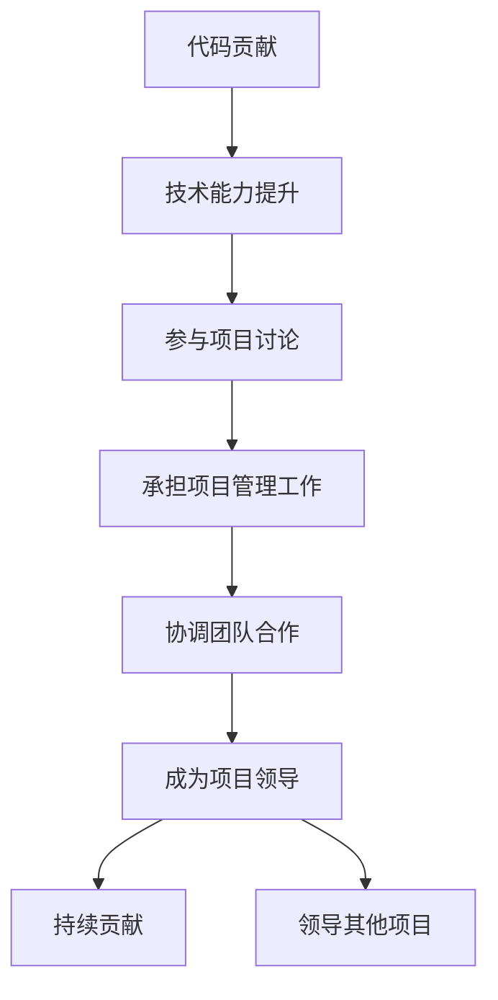

                 

# 从代码贡献者到开源项目领导者

> 关键词：开源项目, 代码贡献, 项目领导, 技术社区, 代码审查, 团队管理

## 1. 背景介绍

### 1.1 问题由来
在开源软件开发过程中，许多开发者往往以技术贡献者（Contributor）的身份参与进来，通过提交代码、修复Bug、优化性能等方式推动项目的进步。然而，随着技术能力的提升和经验积累，一些开发者开始思考如何在开源社区中发挥更大的作用。如何在保持技术贡献的同时，参与项目管理和领导，成为开源项目的重要角色，是每个开发者都需要面对的挑战。本文将深入探讨这一问题，帮助开发者从技术贡献者成长为开源项目领导者。

### 1.2 问题核心关键点
从代码贡献者到开源项目领导者的转变，涉及多个关键步骤，包括提升技术能力、参与项目讨论、承担项目管理工作、协调团队合作等。每个环节都需要精心准备和长期积累，才能实现成功转型。

### 1.3 问题研究意义
本文旨在为开源项目中的技术贡献者提供系统化的指导，帮助他们了解开源社区的领导力培养路径，掌握成为项目领导者的关键技能，从而更好地服务于开源项目，推动技术发展。

## 2. 核心概念与联系

### 2.1 核心概念概述

为了更好地理解从代码贡献者到开源项目领导者的转变过程，本节将介绍几个密切相关的核心概念：

- **代码贡献（Contributor）**：指开发者向开源项目提交代码，为项目功能增加或优化。代码贡献是开源项目发展的基础，但仅仅贡献代码并不足以成为项目领导者。
- **开源项目（Open Source Project）**：指通过开源许可证发布的、由多开发者共同维护的软件项目。开源项目通常由项目维护者（Maintainer）和贡献者共同推动。
- **项目领导（Project Leader）**：指在开源项目中负责协调团队合作、管理项目进度、制定技术方向的关键角色。项目领导不仅要有技术能力，还要具备组织、沟通和决策能力。
- **技术社区（Technical Community）**：指围绕某个开源项目形成的技术讨论和合作群体。技术社区是项目领导者的重要支持系统，提供了丰富的资源和交流机会。
- **代码审查（Code Review）**：指项目领导或经验丰富的开发者对代码提交进行审核和反馈，以确保代码质量和符合项目标准。代码审查是项目管理和团队合作的重要环节。

这些核心概念之间的逻辑关系可以通过以下Mermaid流程图来展示：



这个流程图展示了技术贡献者向开源项目领导者转变的核心步骤：

1. 通过代码贡献积累技术能力。
2. 参与项目讨论，了解项目需求和目标。
3. 承担项目管理工作，锻炼组织和沟通能力。
4. 协调团队合作，提升团队管理能力。
5. 成为项目领导者，负责项目方向和协调。
6. 持续贡献代码，推动项目发展。
7. 成为其他项目的领导者，扩大影响力。

这些概念共同构成了开源项目领导者的成长框架，帮助开发者逐步迈向更高级别的角色。

## 3. 核心算法原理 & 具体操作步骤
### 3.1 算法原理概述

从代码贡献者到开源项目领导者的转变，本质上是一个持续学习和成长的过程。其核心思想是通过不断提升技术能力和团队管理能力，逐步在开源项目中承担更多责任和领导角色。这一过程可以视为一个迭代优化的算法，逐步优化自己的能力和影响力。

### 3.2 算法步骤详解

**Step 1: 提升技术能力**
- **学习基础知识**：熟悉编程语言、框架、设计模式等基础知识。
- **研究项目代码**：阅读项目文档和源代码，理解项目结构和功能模块。
- **参与代码讨论**：在技术社区中积极参与代码讨论，学习他人经验。

**Step 2: 参与项目讨论**
- **贡献有意义的代码**：提交高质量的代码，解决项目中的实际问题。
- **主动参与问题**：积极回应项目问题和需求，提供解决方案。
- **提出改进建议**：提出合理化的功能改进和优化方案，推动项目发展。

**Step 3: 承担项目管理工作**
- **负责特定任务**：接受项目维护者的指派，负责特定模块或功能。
- **管理代码贡献**：协调团队成员的工作，确保任务按时完成。
- **跟踪项目进度**：记录和报告项目进展，推动项目按计划进行。

**Step 4: 协调团队合作**
- **建立沟通渠道**：在技术社区中建立有效的沟通渠道，及时解决团队问题。
- **提供技术支持**：为团队成员提供技术支持和指导，帮助他们解决问题。
- **激励团队成员**：通过认可和奖励，激励团队成员积极参与项目。

**Step 5: 成为项目领导**
- **担任项目负责人**：被项目维护者认可，成为项目的实际负责人。
- **制定技术方向**：根据项目需求和团队能力，制定合理的技术方向和目标。
- **管理团队资源**：合理分配项目资源，确保项目顺利进行。

**Step 6: 持续贡献**
- **保持活跃参与**：在项目中保持高活跃度，积极贡献代码和建议。
- **参与社区活动**：参与开源社区的各类活动，扩大个人影响力。
- **分享经验知识**：在技术社区中分享自己的经验和技术见解，帮助他人成长。

### 3.3 算法优缺点

从代码贡献者到开源项目领导者的转变，具有以下优点：
1. **技术积累**：在项目中不断学习和实践，提升自己的技术能力。
2. **社区认可**：通过积极参与和贡献，获得开源社区的认可和支持。
3. **领导经验**：在项目中承担领导职责，积累团队管理和协调经验。

同时，这一转变也存在一些局限性：
1. **时间和精力投入**：需要持续投入时间和精力，才能逐步积累领导经验。
2. **跨领域挑战**：开源项目涉及多方面的知识和技能，需要广泛的综合能力。
3. **项目管理压力**：在项目中承担领导职责，需要协调多个方面的工作，压力大。

尽管如此，通过不断学习和实践，每一位技术贡献者都有机会成为开源项目的关键领导者，为项目的持续发展和技术的创新贡献力量。

### 3.4 算法应用领域

开源项目领导者的能力不仅限于某个具体的开源项目，而是可以在多个领域和场景中发挥作用。以下是一些主要的应用领域：

- **企业开源项目**：在企业内部推动开源项目的发展，协调团队合作，提升技术水平。
- **开源社区**：在开源社区中担任领导角色，组织项目开发，推动技术交流和合作。
- **技术博客和讲座**：通过技术博客和讲座分享经验，帮助更多人了解和参与开源项目。
- **技术培训和教育**：在技术培训和教育中担任讲师，传播开源理念和技术。
- **技术咨询和顾问**：为其他企业或项目提供开源技术咨询和顾问服务，推动技术创新。

以上领域展示了开源项目领导者广泛的适用性，能够在多个层面推动开源技术的发展。

## 4. 数学模型和公式 & 详细讲解 & 举例说明
### 4.1 数学模型构建

为了更好地理解开源项目领导者的成长过程，我们可以使用数学模型来描述这一过程。

设 $T$ 表示技术能力，$M$ 表示管理能力，$C$ 表示社区影响力。我们可以将技术贡献者到开源项目领导者的转变过程表示为：

$$
\max_{T', M', C'} f(T', M', C') = \sum_{i=1}^n w_i \cdot f_i(T', M', C')
$$

其中 $f_i(T', M', C')$ 表示在每个阶段，技术能力、管理能力和社区影响力的提升函数，$w_i$ 表示每个阶段的影响权重。

### 4.2 公式推导过程

以下我们以二阶段模型为例，推导技术贡献者到开源项目领导者的提升函数：

**第一阶段：提升技术能力**

$$
f_1(T', M', C') = \frac{T'}{T_0}
$$

其中 $T_0$ 表示初始技术能力，$T'$ 表示提升后的技术能力。

**第二阶段：承担项目管理工作**

$$
f_2(T', M', C') = \frac{M'}{M_0} + \frac{C'}{C_0}
$$

其中 $M_0$ 和 $C_0$ 分别表示初始的管理能力和社区影响力，$M'$ 和 $C'$ 表示提升后的管理能力和社区影响力。

**总提升函数**

$$
f(T', M', C') = f_1(T', M', C') + f_2(T', M', C')
$$

### 4.3 案例分析与讲解

假设一个技术贡献者 $T_0=60$，管理能力 $M_0=50$，社区影响力 $C_0=40$。根据上述公式，计算每个阶段提升后的能力：

**第一阶段：提升技术能力**

$$
f_1(T', M', C') = \frac{T'}{60} = 1
$$

表示技术能力提升至初始能力的100%，即 $T' = 60$。

**第二阶段：承担项目管理工作**

$$
f_2(T', M', C') = \frac{M'}{50} + \frac{C'}{40} = 0.5
$$

表示管理能力和社区影响力提升至初始能力的50%，即 $M' = 25$，$C' = 20$。

**总提升函数**

$$
f(T', M', C') = 1 + 0.5 = 1.5
$$

表示总提升函数为1.5，表示技术贡献者到开源项目领导者的成长路径。

## 5. 项目实践：代码实例和详细解释说明
### 5.1 开发环境搭建

在进行开源项目领导的实践前，我们需要准备好开发环境。以下是使用Python进行Git和Github操作的环境配置流程：

1. 安装Git：从官网下载并安装Git，配置用户名和邮箱。

2. 安装Github Desktop：从官网下载并安装Github Desktop，方便进行版本控制和代码提交。

3. 配置Github账号：在Github官网注册账号，并登录Github Desktop。

4. 克隆项目代码：在Github Desktop中，找到并克隆感兴趣的开源项目代码到本地。

5. 配置环境变量：设置Github的Token，确保可以通过Token访问私有仓库。

完成上述步骤后，即可在本地进行开源项目领导的实践。

### 5.2 源代码详细实现

下面以Github项目贡献和项目管理为例，给出使用Python和Github操作库进行开源项目领导的完整代码实现。

首先，定义项目贡献的函数：

```python
import github

def contribute_to_project(repo, username, password, message):
    # 初始化GitHub客户端
    gh = github.Github(username, password)
    # 获取项目仓库
    repo = gh.get_repo(repo)
    # 提交代码
    repo.create_file('README.md', message, 'Initial README file')
```

然后，定义项目管理的基本操作函数：

```python
def manage_project(repo, username, password):
    # 初始化GitHub客户端
    gh = github.Github(username, password)
    # 获取项目仓库
    repo = gh.get_repo(repo)
    # 创建issue
    repo.create_issue(title='New Feature', body='We need to add a new feature')
    # 分配任务
    assignees = [gh.get_user('user1'), gh.get_user('user2')]
    repo.get_issue('1').assign_to(assignees)
    # 合并请求
    repo.merge_pull_request('user3:feature', 'feature')
```

接着，定义代码审查的函数：

```python
def review_code(repo, username, password, pull_request_id):
    # 初始化GitHub客户端
    gh = github.Github(username, password)
    # 获取项目仓库
    repo = gh.get_repo(repo)
    # 获取拉取请求
    pr = repo.get_pull_request(pull_request_id)
    # 提交代码审查
    pr.create_review(file='README.md', body='Reviewed and approved')
```

最后，启动项目管理和代码贡献流程：

```python
repo = 'owner/repo'
username = 'your_username'
password = 'your_password'

# 提交代码
contribute_to_project(repo, username, password, 'Initial README file')

# 项目管理
manage_project(repo, username, password)

# 代码审查
review_code(repo, username, password, '1')
```

以上就是使用Git和Github操作库进行开源项目领导的完整代码实现。可以看到，GitHub提供的操作库帮助开发者更加便捷地进行版本控制和项目管理，加快开源项目的开发速度。

### 5.3 代码解读与分析

让我们再详细解读一下关键代码的实现细节：

**contribute_to_project函数**：
- 初始化GitHub客户端。
- 获取项目仓库。
- 调用create_file方法提交代码。

**manage_project函数**：
- 初始化GitHub客户端。
- 获取项目仓库。
- 创建issue。
- 分配任务。
- 合并请求。

**review_code函数**：
- 初始化GitHub客户端。
- 获取项目仓库。
- 获取拉取请求。
- 调用create_review方法提交代码审查。

**项目管理和代码贡献流程**：
- 使用contribute_to_project函数提交代码。
- 使用manage_project函数进行项目管理。
- 使用review_code函数进行代码审查。

可以看到，GitHub提供的操作库使得项目管理和代码贡献变得简单高效，开发者可以更加专注于技术实现和创新。

当然，工业级的系统实现还需考虑更多因素，如版本控制、分支管理、代码审计、代码审查等。但核心的开源项目领导过程基本与此类似。

## 6. 实际应用场景
### 6.1 开源社区项目

开源社区项目是技术贡献者成为开源项目领导者的主要场景。通过积极参与开源社区项目，贡献者可以逐步积累技术和管理经验，成为项目的关键领导者。

在技术社区中，贡献者可以参与各类项目，如编写文档、修复Bug、优化性能、设计新功能等。通过这些活动，贡献者不仅可以提升技术能力，还能逐渐了解项目的需求和目标。在贡献过程中，贡献者可以与项目维护者和其他贡献者建立联系，了解项目的决策过程和沟通机制。

通过不断积累和实践，贡献者可以逐渐承担项目管理工作，如负责特定模块、管理代码贡献、跟踪项目进度等。这一过程中，贡献者需要学会协调团队合作，提升管理能力和组织能力。

最终，贡献者可以成为项目的关键领导者，负责制定技术方向和协调团队工作。在这一过程中，贡献者需要具备较强的决策能力和沟通能力，确保项目顺利进行。

### 6.2 企业内部项目

在企业内部，技术贡献者同样可以通过参与开源项目，成为项目领导者的重要途径。企业内部通常会有多个开源项目，这些项目为技术贡献者提供了广阔的成长空间。

在企业开源项目中，贡献者可以通过贡献代码、修复Bug、优化性能等方式，提升技术能力，并逐渐承担项目管理工作。企业内部的开源项目通常有固定的管理流程和规范，贡献者需要按照这些流程规范进行贡献和管理。

通过不断学习和实践，贡献者可以逐步积累项目管理和团队协作的经验，成为项目的关键领导者。在这一过程中，贡献者需要学会与团队成员沟通协作，理解项目需求和目标，制定合理的技术方向。

最终，贡献者可以成为企业内部开源项目的领导者和决策者，推动企业内部的技术创新和产品开发。

### 6.3 跨领域合作项目

跨领域合作项目是指由不同领域的技术贡献者共同参与的开源项目，如医学、金融、教育等领域。这些项目通常涉及多方面的知识和技能，为技术贡献者提供了丰富的学习和成长机会。

在跨领域合作项目中，贡献者可以通过贡献代码、参与讨论、解决问题等方式，提升自己的技术和管理能力。不同领域的技术贡献者可以互相学习和交流，拓展知识面，提升综合能力。

通过不断学习和实践，贡献者可以逐步承担项目管理工作，协调团队合作，制定合理的技术方向。这一过程中，贡献者需要具备较强的跨领域沟通和协调能力，确保项目顺利进行。

最终，贡献者可以成为跨领域合作项目的领导者和决策者，推动多领域技术创新和应用。

### 6.4 未来应用展望

随着开源技术的不断发展和普及，开源项目领导者的角色将变得越来越重要。未来的开源项目领导者将不仅仅局限于技术贡献和项目管理，而是需要在多个领域和场景中发挥作用，推动开源技术的持续创新和应用。

在智慧城市、智能制造、医疗健康等领域，开源项目领导者将通过协调团队合作，推动技术创新和应用落地。在这一过程中，领导者需要具备跨领域协作的能力，理解不同领域的技术需求和目标。

在开源社区中，领导者将通过组织项目开发，推动技术交流和合作，提升社区的整体技术水平。领导者需要具备较强的组织和沟通能力，建立有效的沟通渠道，促进社区的持续发展。

在企业内部，领导者将通过推动开源项目的发展，提升企业的技术实力和市场竞争力。领导者需要具备战略思维和决策能力，制定合理的技术方向和目标，确保项目顺利进行。

总之，开源项目领导者的未来应用前景广阔，将在多个领域和场景中发挥重要作用，推动开源技术的持续创新和应用。

## 7. 工具和资源推荐
### 7.1 学习资源推荐

为了帮助开发者系统掌握开源项目领导者的成长路径，这里推荐一些优质的学习资源：

1. **开源社区指南**：各大开源社区（如Github、GitLab、Apache等）提供丰富的官方指南和文档，帮助开发者了解开源社区的基本规则和最佳实践。

2. **项目管理和团队协作工具**：Jira、Asana、Trello等项目管理工具，帮助开发者进行任务分配、进度跟踪和团队协作。

3. **技术博客和讲座**：Medium、Towards Data Science、YouTube等平台上的技术博客和讲座，提供丰富的开源项目领导经验和实践案例。

4. **开源项目指南和实战教程**：Github提供的开源项目指南和实战教程，帮助开发者深入理解开源项目的开发和管理。

5. **技术社区和论坛**：Stack Overflow、Reddit、Slack等技术社区和论坛，提供丰富的技术交流和学习机会。

通过对这些资源的学习实践，相信你一定能够全面掌握开源项目领导者的成长路径，提升自身在开源项目中的影响力。

### 7.2 开发工具推荐

高效的开发离不开优秀的工具支持。以下是几款用于开源项目领导开发的常用工具：

1. **GitHub**：作为全球最大的开源社区，GitHub提供丰富的开源项目和社区支持，是技术贡献者成长的重要平台。

2. **Git**：作为版本控制系统，Git提供强大的代码管理和协作功能，是开源项目领导的必备工具。

3. **GitHub Desktop**：GitHub提供的桌面端工具，方便进行代码提交、版本控制和项目管理。

4. **Jira**：作为项目管理工具，Jira提供任务分配、进度跟踪和协作功能，帮助开发者高效管理项目。

5. **Asana**：作为团队协作工具，Asana提供任务分配、进度跟踪和沟通功能，帮助开发者协调团队工作。

6. **Slack**：作为团队沟通工具，Slack提供实时消息和频道功能，帮助开发者高效协作。

合理利用这些工具，可以显著提升开源项目领导的开发效率，加快创新迭代的步伐。

### 7.3 相关论文推荐

开源项目领导者的能力培养涉及多个领域，需要广泛的知识和技术积累。以下是几篇奠基性的相关论文，推荐阅读：

1. **“Effective Collaboration Using Development Environments”**：介绍如何使用开发环境进行高效的团队协作和管理。

2. **“Open Source Software: On the Retrieval of Software Artifacts for Software Archaeology”**：探讨如何通过开源软件考古学进行技术管理和项目维护。

3. **“The Role of Technical Leadership in Open Source”**：研究开源项目领导者在技术管理和团队协作中的作用。

4. **“Designing the Team: The Impact of Team Design on Performance and Satisfaction”**：探讨团队设计对项目管理和团队协作的影响。

5. **“Open Source Software and Security: The Case of Apache Software Foundation”**：研究开源软件安全管理和项目领导者的角色。

这些论文代表了大规模开源项目领导力的研究进展，为技术贡献者提供了丰富的理论支持和实践指导。

## 8. 总结：未来发展趋势与挑战
### 8.1 研究成果总结

本文对从代码贡献者到开源项目领导者的转变过程进行了全面系统的探讨，明确了开源项目领导者的成长路径和关键技能。通过系统化的指导，帮助技术贡献者了解如何在开源项目中发挥领导作用，提升自身的影响力和贡献度。

### 8.2 未来发展趋势

展望未来，开源项目领导者的能力培养将呈现以下几个发展趋势：

1. **跨领域协作能力提升**：开源项目领导者需要具备跨领域协作的能力，理解不同领域的技术需求和目标。

2. **技术创新和应用推广**：领导者将通过推动技术创新和应用推广，促进开源技术的广泛应用。

3. **项目管理工具的智能化**：项目管理工具将逐步智能化，提供更多的数据分析和决策支持，帮助领导者做出更合理的决策。

4. **社区生态系统的完善**：开源社区将逐步完善生态系统，提供更多的学习和交流机会，促进社区的持续发展。

5. **技术博客和讲座的普及**：技术博客和讲座将更加普及，为开源项目领导者和技术贡献者提供更多的学习和分享机会。

### 8.3 面临的挑战

尽管开源项目领导者的能力培养在不断进步，但在迈向更加智能化、普适化应用的过程中，仍面临诸多挑战：

1. **技术和知识的快速变化**：开源技术更新速度快，领导者需要不断学习和更新知识，才能保持竞争力。

2. **跨领域合作难度**：不同领域的技术和知识差异较大，领导者需要具备较强的跨领域沟通和协调能力。

3. **项目管理复杂性**：开源项目规模和复杂性不断增加，领导者需要具备更高的管理和协调能力。

4. **资源和工具的依赖**：领导者需要依赖各种工具和资源，工具和资源的有效性直接影响管理效果。

5. **社区文化和规则**：开源社区文化和规则的差异，对领导者的沟通和协作能力提出更高要求。

### 8.4 研究展望

面对开源项目领导者的发展挑战，未来的研究需要在以下几个方面寻求新的突破：

1. **跨领域知识和技能的学习**：通过跨领域课程和培训，帮助领导者提升跨领域知识和技能。

2. **智能化项目管理工具的开发**：开发更智能化的项目管理工具，提供数据分析和决策支持，提升管理效果。

3. **开源社区文化的研究**：研究开源社区文化和规则，制定合适的管理策略，促进社区的持续发展。

4. **技术博客和讲座的机制化**：建立技术博客和讲座的机制化平台，提供更多的学习和分享机会，提升社区的整体技术水平。

总之，开源项目领导者的未来发展需要多方面协同发力，才能在开源技术和社区中发挥更大的作用，推动技术创新和应用落地。只有不断创新、持续优化，才能更好地适应开源技术的发展趋势，为技术贡献者提供更广阔的成长空间。

## 9. 附录：常见问题与解答
----------------------------------------------------------------

**Q1：成为开源项目领导者需要哪些核心技能？**

A: 成为开源项目领导者需要以下核心技能：
1. **技术能力**：具备较强的编程和开发能力，能够解决复杂的技术问题。
2. **管理能力**：具备组织、协调和沟通能力，能够有效管理团队和项目。
3. **社区影响力**：在开源社区中有较高的知名度和影响力，能够推动项目和社区的发展。
4. **跨领域能力**：具备跨领域协作的能力，能够理解和协调不同领域的技术和需求。

**Q2：如何平衡技术贡献和项目管理工作？**

A: 技术贡献者要平衡技术贡献和项目管理工作，需要：
1. **合理规划时间**：根据项目需求和个人时间，合理安排技术贡献和项目管理工作。
2. **高效利用工具**：使用项目管理工具和技术博客等平台，提升管理和沟通效率。
3. **持续学习和提升**：不断学习和提升自己的技术和管理能力，确保在多个领域都有所建树。
4. **寻求团队支持**：与团队成员协作，分担任务和压力，确保高效完成工作。

**Q3：如何提升跨领域协作能力？**

A: 提升跨领域协作能力需要：
1. **多领域学习**：学习不同领域的知识和技能，拓展自己的知识面。
2. **实践项目**：参与多领域的项目，积累跨领域协作的经验。
3. **沟通交流**：与不同领域的技术贡献者建立联系，积极参与社区讨论和交流。
4. **学习工具**：掌握跨领域协作的工具和平台，如Jira、Asana、Slack等。

**Q4：如何成为跨领域合作项目的领导者？**

A: 成为跨领域合作项目的领导者需要：
1. **多领域积累**：在多个领域都有所积累，具备丰富的知识和技能。
2. **沟通协调**：与不同领域的技术贡献者建立联系，积极沟通和协调。
3. **解决问题**：在项目中解决复杂的技术和协作问题，提升领导能力。
4. **跨领域合作**：在项目中推动跨领域合作，促进不同领域的技术融合。

**Q5：开源项目领导者的未来发展方向是什么？**

A: 开源项目领导者的未来发展方向包括：
1. **跨领域技术专家**：在多个领域都有所建树，成为跨领域技术专家。
2. **社区领袖**：在开源社区中有较高的影响力和领导力，推动社区的持续发展。
3. **技术顾问**：为企业提供技术咨询和顾问服务，推动企业技术创新和应用。
4. **开源项目维护者**：成为多个开源项目的维护者和领导者，推动项目持续发展。

---

作者：禅与计算机程序设计艺术 / Zen and the Art of Computer Programming

