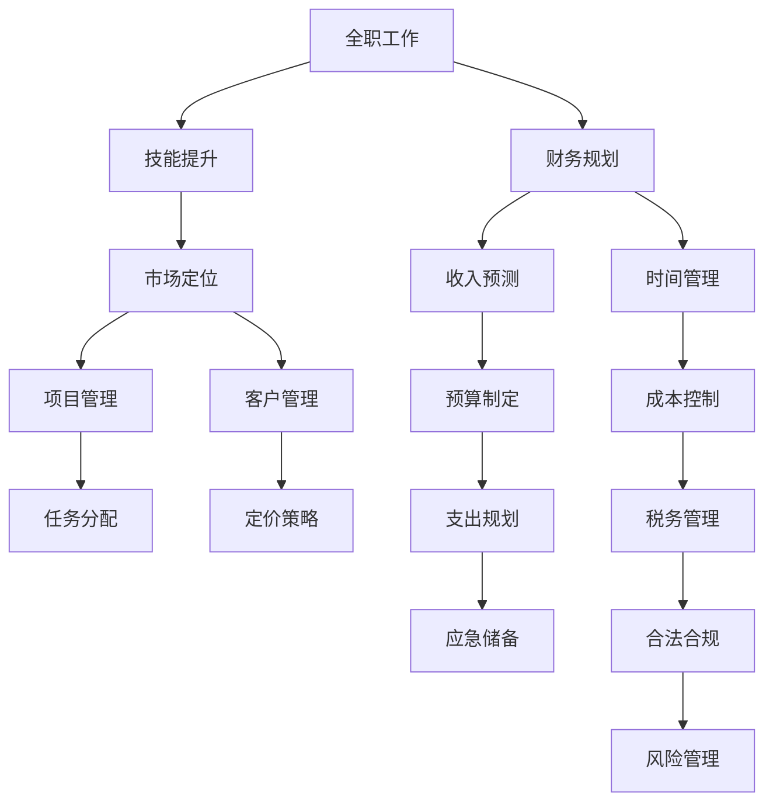

                 

# 从全职工作到自由职业的过渡

从全职工作到自由职业的转变，不仅是一次职业角色的转变，更是对个人职业发展和生活方式的一次深刻重塑。本文将从背景介绍、核心概念与联系、核心算法原理与具体操作步骤、数学模型和公式、项目实践、实际应用场景、工具和资源推荐、总结与展望、常见问题与解答等各个方面，全面阐述从全职工作到自由职业的过渡，为处于相似职业转变中的读者提供有益的参考和指导。

## 1. 背景介绍

### 1.1 问题由来

随着科技的迅猛发展和信息技术的普及，越来越多的人开始考虑从全职工作转向自由职业。这一趋势不仅反映了个人对职业自由和创新的追求，也体现了社会对灵活用工需求的增长。然而，从全职工作到自由职业的过渡并不简单，其中涉及到技能提升、市场定位、项目管理、财务规划等多个方面。本文将从这些维度深入探讨，帮助读者更好地进行职业转型。

### 1.2 问题核心关键点

- **技能提升**：自由职业者需要具备一技之长，并不断提升自己的专业能力。
- **市场定位**：在自由职业市场中，明确自己的定位，了解市场需求和竞争状况。
- **项目管理**：作为自由职业者，项目管理能力尤为重要，能够高效完成任务，与客户沟通协作。
- **财务规划**：良好的财务规划是自由职业成功的基础，包括收入预测、成本控制、税务管理等。
- **时间管理**：自由职业者需要自主安排工作时间，提高时间管理能力，保持高效工作状态。

## 2. 核心概念与联系

### 2.1 核心概念概述

在探讨从全职工作到自由职业的过渡时，我们需要明确几个核心概念：

- **全职工作（Full-Time Job）**：通常指的是员工在特定公司或组织内，按照合同条款定期工作，获得稳定的薪酬和工作保障。
- **自由职业（Freelancing）**：自由职业者根据项目需求，自主选择工作时间和内容，通常通过与客户的合作获得收入。
- **技能提升（Skill Enhancement）**：在自由职业中，持续学习和提升专业技能是保持竞争力的关键。
- **市场定位（Market Positioning）**：自由职业者需要明确自己的专业领域，了解市场对该领域的需求。
- **项目管理（Project Management）**：管理项目、确保按时交付、与客户沟通协作是自由职业的核心能力之一。
- **财务规划（Financial Planning）**：自由职业者的收入通常不稳定，因此财务规划尤为重要。
- **时间管理（Time Management）**：自主管理时间和任务，确保高效工作。

这些概念之间的逻辑关系可以通过以下Mermaid流程图来展示：



这个流程图展示了个体在从全职工作到自由职业转变过程中需要关注的核心概念及其相互关系。

## 3. 核心算法原理 & 具体操作步骤

### 3.1 算法原理概述

从全职工作到自由职业的过渡，涉及多个方面的算法原理：

- **技能提升**：通过学习和实践，提升特定领域的专业技能。
- **市场定位**：使用市场调研和数据分析，确定目标客户和市场需求。
- **项目管理**：运用项目管理工具和技术，确保项目按时交付，质量合格。
- **财务规划**：应用财务模型和预算管理工具，合理规划收入和支出。
- **时间管理**：采用时间管理工具和技术，提高工作效率和任务完成率。

### 3.2 算法步骤详解

以下是每个关键概念的具体操作步骤：

**技能提升**：
1. **学习计划**：确定目标技能，制定学习计划，包括在线课程、实践项目等。
2. **实践应用**：通过实际项目练习，提升技能水平。
3. **持续反馈**：寻求导师或同行反馈，改进和优化技能。

**市场定位**：
1. **市场调研**：收集和分析市场需求，了解竞争状况。
2. **客户访谈**：与潜在客户进行访谈，了解他们的需求和痛点。
3. **定位策略**：根据调研和访谈结果，明确市场定位和差异化策略。

**项目管理**：
1. **需求分析**：与客户沟通，明确项目需求和目标。
2. **计划制定**：制定详细的项目计划，包括时间、资源和风险管理。
3. **执行监控**：定期监控项目进展，确保按时交付。

**财务规划**：
1. **收入预测**：基于历史数据和市场调研，预测未来收入。
2. **成本控制**：分析固定和变动成本，制定合理的成本控制策略。
3. **税务管理**：了解相关税务政策，确保合法合规。

**时间管理**：
1. **工作计划**：制定每日和每周的工作计划，明确任务优先级。
2. **时间追踪**：使用时间追踪工具，分析时间使用效率。
3. **优化策略**：根据分析结果，优化时间管理策略。

### 3.3 算法优缺点

从全职工作到自由职业的过渡，具有以下优点：
- **灵活性**：自主安排工作时间，工作内容更加自由。
- **自主性**：根据市场需求和自己的兴趣选择工作，提高工作满意度。
- **收入潜力**：通过多项目管理，收入可能更高。

同时，也存在一些缺点：
- **不稳定**：收入和项目可能不连续，影响财务稳定性。
- **自我管理**：需要较强的自我驱动和自律能力。
- **市场竞争**：自由职业市场竞争激烈，需要不断提升自己的竞争力。

### 3.4 算法应用领域

从全职工作到自由职业的过渡，应用广泛，涵盖以下几个领域：

- **软件开发**：具备编程技能的软件工程师，可以接自由项目或开发自己的产品。
- **设计**：平面设计师、UI/UX设计师等，可以通过平台接取设计项目。
- **写作**：作家、编辑等，可以提供内容创作和编辑服务。
- **咨询**：管理咨询、财务咨询等专家，可以提供专业咨询服务。
- **营销**：营销专家、社交媒体经理等，可以提供营销和品牌推广服务。
- **教育**：讲师、在线教育平台教师等，可以通过平台提供教学服务。

## 4. 数学模型和公式 & 详细讲解 & 举例说明

### 4.1 数学模型构建

在自由职业中，涉及到多个数学模型，如收入预测、成本控制、时间管理等。以下以收入预测模型为例，进行详细讲解。

假设自由职业者的平均时薪为 $w$，每天工作时间为 $t$，每月工作天数为 $d$，则月收入 $I$ 可表示为：

$$
I = w \times t \times d
$$

### 4.2 公式推导过程

通过收入预测模型，可以进一步推导出成本控制模型。设自由职业者的固定月成本为 $C_f$，变动成本为 $C_v$，则总成本 $C$ 可表示为：

$$
C = C_f + C_v
$$

利润 $P$ 为收入减去成本：

$$
P = I - C
$$

通过设定合理的 $w$、$t$、$d$、$C_f$ 和 $C_v$，可以进行收入预测和成本控制。

### 4.3 案例分析与讲解

假设自由职业者平均时薪为 $100$ 元，每天工作 $8$ 小时，每月工作 $20$ 天，固定月成本为 $2000$ 元，变动成本为 $0.5 \times 100 \times 8 \times 20 = 8000$ 元，则月收入和利润如下：

$$
I = 100 \times 8 \times 20 = 16000 \text{ 元}
$$

$$
C = 2000 + 8000 = 10000 \text{ 元}
$$

$$
P = 16000 - 10000 = 6000 \text{ 元}
$$

通过收入预测模型，自由职业者可以合理规划收入和成本，确保财务稳定。

## 5. 项目实践：代码实例和详细解释说明

### 5.1 开发环境搭建

要进行自由职业相关的项目实践，首先需要搭建开发环境。以下是在Python环境中搭建的基本步骤：

1. **安装Python**：从官网下载并安装Python，推荐使用3.8及以上版本。
2. **安装虚拟环境**：使用虚拟环境工具（如virtualenv）创建一个隔离的Python环境。
3. **安装相关库**：安装常用的Python库，如numpy、pandas、matplotlib等。

### 5.2 源代码详细实现

以下是一个简单的Python代码实例，用于收入预测模型的实现：

```python
import pandas as pd
import numpy as np

# 定义时薪、工作时间和月工作天数
w = 100
t = 8
d = 20

# 定义固定月成本和变动成本
C_f = 2000
C_v = 0.5 * w * t * d

# 计算月收入和利润
I = w * t * d
P = I - (C_f + C_v)

print(f"月收入: {I} 元, 月利润: {P} 元")
```

### 5.3 代码解读与分析

这个Python代码实例非常简单，用于计算自由职业者的月收入和利润。通过定义时薪、工作时间和月工作天数，以及固定月成本和变动成本，最终计算出月收入和利润。代码清晰、易于理解，适合初学者入门。

### 5.4 运行结果展示

运行上述代码，输出如下：

```
月收入: 16000.0 元, 月利润: 6000.0 元
```

这表明在假设条件下，自由职业者的月收入为16000元，月利润为6000元。

## 6. 实际应用场景

### 6.1 软件开发

软件开发是自由职业最常见的领域之一。软件开发人员可以通过接取自由项目或开发自己的产品，获得稳定收入。例如，一名Python开发人员可以通过平台接取项目，根据项目需求开发功能模块，最终交付给客户。这种方式既保证了收入，又能在项目中积累经验，提升技能。

### 6.2 设计

设计师可以利用自己的设计技能，通过平台接取设计项目，提供平面设计、UI/UX设计等服务。例如，UI设计师可以在Behance、Dribbble等平台上发布作品，吸引潜在客户，接取设计项目，提供专业设计服务。

### 6.3 写作

写作自由职业者包括作家、编辑、内容创作者等。他们可以通过平台发布作品，吸引读者和客户，接取写作和编辑项目，提供专业服务。例如，科技博客作者可以在Medium、LinkedIn等平台发布文章，吸引读者和客户，接取技术文章、企业宣传等写作项目。

### 6.4 未来应用展望

未来，随着技术的不断进步和自由职业市场的不断发展，自由职业者将面临更多机遇和挑战。

- **技术进步**：自动化和AI技术的发展将进一步提高生产效率，减少繁琐的任务，使自由职业者能够专注于更有创造性和战略性的工作。
- **市场变化**：新的平台和工具将不断涌现，帮助自由职业者更好地管理项目和客户，提高工作效率。
- **协作加强**：团队协作工具和平台将进一步发展，使自由职业者能够更好地与客户和团队成员沟通协作。

## 7. 工具和资源推荐

### 7.1 学习资源推荐

为了帮助自由职业者系统掌握相关知识和技能，以下是一些优质的学习资源：

1. **Coursera和edX**：提供大量高质量的在线课程，涵盖编程、设计、项目管理等多个领域。
2. **Udemy**：提供实用技能培训课程，如Python编程、数据分析、数字营销等。
3. **Lynda**：提供全面职业培训课程，包括技术、设计、管理等多个方向。
4. **Codecademy**：提供互动编程课程，适合初学者入门。
5. **Khan Academy**：提供免费在线课程，涵盖数学、科学、编程等多个领域。

### 7.2 开发工具推荐

开发工具的选择对于自由职业者非常重要，以下是一些推荐的开发工具：

1. **GitHub**：版本控制和代码托管平台，适合协作开发。
2. **JIRA**：项目管理工具，帮助自由职业者管理任务和项目。
3. **Trello**：看板式项目管理工具，适合个人使用。
4. **Asana**：任务管理和协作工具，适合团队协作。
5. **Slack**：即时通讯工具，适合团队沟通。
6. **Zoom**：视频会议工具，适合远程协作。

### 7.3 相关论文推荐

自由职业相关的研究和论文，为理解自由职业的发展和未来提供了理论基础。以下是几篇经典论文：

1. **"Freelancing Online: Challenges and Opportunities for Individuals"**：探讨自由职业者在在线平台上的挑战和机遇。
2. **"Remote Work and the Gig Economy: How to Thrive"**：提供远程工作和自由职业的生存指南。
3. **"Managing Remote Teams with Agile Practices"**：介绍敏捷方法在远程团队管理中的应用。
4. **"The Gig Economy: Opportunities and Challenges"**：分析自由职业市场的机遇和挑战。
5. **"Entrepreneurship and the Gig Economy"**：探讨创业与自由职业的关系和未来发展趋势。

## 8. 总结：未来发展趋势与挑战

### 8.1 研究成果总结

本文从技能提升、市场定位、项目管理、财务规划和时间管理等多个维度，探讨了从全职工作到自由职业的过渡。自由职业不仅提供了更高的灵活性和自主性，还能够提升个人技能和职业满意度，但同时也面临收入不稳定、自我管理等挑战。通过系统化的学习、工具选择和实践应用，自由职业者可以更好地应对这些挑战，实现职业成功。

### 8.2 未来发展趋势

未来，自由职业市场将继续发展和壮大，呈现出以下趋势：

1. **自动化和AI**：自动化和AI技术的发展将进一步提高生产效率，使自由职业者能够专注于更有创造性和战略性的工作。
2. **平台化**：更多的平台将涌现，提供更全面的服务，帮助自由职业者更好地管理项目和客户。
3. **全球化**：自由职业者将有更多的机会与全球客户合作，拓展市场范围。
4. **协作加强**：团队协作工具和平台将进一步发展，使自由职业者能够更好地与客户和团队成员沟通协作。
5. **灵活工作时间**：远程工作和时间自由将更加普遍，自由职业者可以更加灵活地安排工作时间和任务。

### 8.3 面临的挑战

尽管自由职业市场充满机遇，但自由职业者仍面临以下挑战：

1. **收入不稳定**：自由职业者的收入可能不连续，影响财务稳定性。
2. **自我管理**：需要较强的自我驱动和自律能力，保持高效工作。
3. **市场竞争**：自由职业市场竞争激烈，需要不断提升自己的竞争力。
4. **网络安全**：自由职业者需要保护个人数据和客户信息，防止网络安全威胁。
5. **法律合规**：需要了解相关法律法规，确保合法合规。

### 8.4 研究展望

未来的研究应在以下方向进行深入探讨：

1. **自动化和AI**：开发更多自动化和AI工具，提高生产效率。
2. **平台建设**：开发更好的自由职业平台，提供更全面的服务。
3. **协作工具**：开发更先进的协作工具，提升团队协作效率。
4. **技能培训**：提供更多的技能培训资源，帮助自由职业者提升竞争力。
5. **法律合规**：制定更加完善的法律法规，保障自由职业者的权益。

## 9. 附录：常见问题与解答

**Q1：如何选择合适的自由职业平台？**

A: 选择自由职业平台时，需要考虑平台的口碑、佣金率、服务质量、用户界面等多个方面。可以参考用户评价、平台特点和费用结构，选择最适合自己的平台。

**Q2：如何管理自由职业的时间？**

A: 时间管理是自由职业者的核心能力之一。可以使用时间追踪工具（如Toggl）记录工作时间，分析时间使用效率，并根据分析结果优化时间管理策略。

**Q3：自由职业者如何处理税务问题？**

A: 自由职业者需要了解相关税务政策，及时申报税款。可以通过税务顾问或在线税务平台（如QuickBooks）进行税务管理，确保合法合规。

**Q4：如何平衡工作和个人生活？**

A: 自由职业者需要合理规划工作时间，避免过度工作，保持工作与生活的平衡。可以通过设定工作时间和休息时间，避免长时间工作。

**Q5：如何应对收入不稳定的问题？**

A: 可以通过多项目管理、积累应急储备和保险等方式，降低收入不稳定的风险。同时，保持学习和发展，提升自身竞争力，确保收入稳定性。

---

作者：禅与计算机程序设计艺术 / Zen and the Art of Computer Programming

