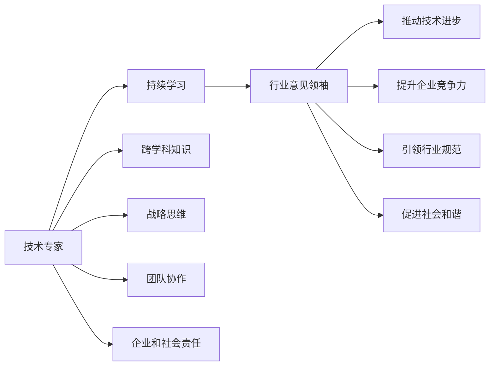

                 

## 1. 背景介绍

### 1.1 问题由来
当今信息技术的发展，极大地改变了我们的工作和生活方式。从企业内部的自动化办公系统，到全球范围内的互联网服务，技术的进步让我们的世界变得更加紧密相连。然而，技术的迅猛发展也带来了新的挑战，如数据隐私、网络安全、人工智能伦理等，这些问题都需要我们深入思考和解答。

作为技术专家，我们不仅要深入了解各种技术的实现细节，更需站在更高的角度，对行业的未来发展趋势和面临的挑战进行前瞻性思考，成为行业意见领袖，为技术的发展方向和应用前景提供权威的指导。

### 1.2 问题核心关键点
本节将详细探讨技术专家如何转型为行业意见领袖的关键要点：

- **持续学习**：技术日新月异，只有不断学习，才能保持技术领先。
- **跨学科知识**：行业间的交叉融合是未来发展的趋势，掌握多学科知识将有助于形成更全面的技术视角。
- **战略思维**：从技术实现者转变为战略思考者，重视技术对业务的推动作用。
- **团队协作**：团队的力量是无穷的，合理的团队协作能够更好地实现技术创新。
- **企业和社会责任**：技术的应用不仅关系到企业的利益，更要考虑到对社会的正面影响。

### 1.3 问题研究意义
技术专家转型为行业意见领袖，对于推动技术的发展、提升企业竞争力、引领行业规范具有重要意义：

1. **推动技术进步**：通过高层次的技术指导，促进技术创新，推动行业发展。
2. **提升企业竞争力**：战略性的技术洞察，能够为企业的长期发展提供方向性指引。
3. **引领行业规范**：制定行业标准和规范，提升整体技术水平和应用效果。
4. **促进社会和谐**：关注技术应用的伦理和社会影响，促进技术造福全人类。

## 2. 核心概念与联系

### 2.1 核心概念概述

为了更好地理解技术专家转型为行业意见领袖的过程，本节将介绍几个核心概念：

- **技术专家**：具备深厚技术知识和实践经验的专业人士，能够在技术实现层面提供权威指导。
- **行业意见领袖**：在行业内拥有较高的影响力和权威性，能够对行业未来发展趋势进行前瞻性思考和指引。
- **持续学习**：不断更新自己的知识体系，掌握最新技术动态和行业发展趋势。
- **跨学科知识**：掌握多学科知识，如计算机科学、数学、经济学等，形成全面技术视角。
- **战略思维**：从宏观角度审视技术对业务的影响，制定战略性技术决策。
- **团队协作**：能够领导和协调团队成员，共同推进技术创新和应用。
- **企业和社会责任**：考虑技术应用的伦理和社会影响，确保技术应用的正当性和可持续性。

这些核心概念之间的联系可以通过以下Mermaid流程图来展示：



这个流程图展示了技术专家通过持续学习和跨学科知识的积累，转化为战略思维，最终成为行业意见领袖的过程，并阐述了其对技术进步、企业竞争力、行业规范、社会和谐的推动作用。

## 3. 核心算法原理 & 具体操作步骤

### 3.1 算法原理概述

技术专家转型为行业意见领袖的过程，其核心算法原理可以总结为：

1. **数据驱动**：通过收集和分析行业数据，掌握行业动态，识别技术趋势。
2. **理论基础**：深入理解技术的底层原理和应用场景，提供有深度的技术见解。
3. **经验分享**：将实践经验与行业同仁分享，形成行业共识，推动技术发展。
4. **跨领域协作**：与其他领域的专业人士合作，共同解决复杂问题，推动技术创新。

### 3.2 算法步骤详解

技术专家转型为行业意见领袖的具体操作步骤如下：

1. **信息收集**：收集行业内的技术动态、业务发展趋势、市场变化等信息。
2. **分析研究**：对收集到的信息进行深入分析，形成独到的技术见解。
3. **交流分享**：通过撰写技术博客、发表技术演讲、参与技术会议等方式，分享自己的研究成果。
4. **跨领域合作**：与其他领域的专业人士进行合作，共同推动技术创新和行业发展。
5. **持续优化**：不断更新自己的知识体系，保持技术领先。

### 3.3 算法优缺点

技术专家转型为行业意见领袖具有以下优点：

1. **权威性**：具有技术实现的深入了解，能够提供有信服力的指导。
2. **前瞻性**：能够从长远角度审视技术的发展，提供战略性的建议。
3. **影响力**：能够影响和推动行业标准和规范的制定。

然而，这一过程也存在以下缺点：

1. **时间成本高**：需要大量时间和精力去学习和分析。
2. **视野受限**：可能受限于当前的技术和业务领域，缺乏多角度的视角。
3. **沟通障碍**：与非技术背景的决策者交流时，可能存在理解上的差异。

### 3.4 算法应用领域

基于技术专家转型为行业意见领袖的算法原理和操作步骤，这一过程在多个领域中得到了应用：

1. **技术研发**：推动企业技术研发的方向和策略制定，提升技术创新能力。
2. **市场分析**：分析市场趋势和竞争环境，制定市场进入和扩张策略。
3. **教育培训**：作为技术专家和行业领袖，参与教育培训，提升行业整体技术水平。
4. **政策制定**：参与政府或行业协会的政策制定，确保技术应用的正当性和可持续发展。
5. **商业合作**：与其他企业或机构进行合作，共同推动技术创新和行业发展。

## 4. 数学模型和公式 & 详细讲解

### 4.1 数学模型构建

本节将使用数学语言对技术专家转型为行业意见领袖的过程进行更加严谨的描述。

假设技术专家的知识体系为 $K$，对新技术的掌握能力为 $T$，对行业趋势的洞察能力为 $I$，团队协作能力为 $C$，社会责任感为 $R$。则行业意见领袖的评价函数 $F$ 可以表示为：

$$
F(K, T, I, C, R) = \alpha_1 K + \alpha_2 T + \alpha_3 I + \alpha_4 C + \alpha_5 R
$$

其中 $\alpha_1, \alpha_2, \alpha_3, \alpha_4, \alpha_5$ 为各项指标的权重系数。

### 4.2 公式推导过程

为了更直观地展示评价函数 $F$ 的具体形式，我们可以假设各项指标的取值范围和权重系数，例如：

- $K$ 的取值范围为 $[0, 100]$，权重 $\alpha_1 = 0.3$。
- $T$ 的取值范围为 $[0, 100]$，权重 $\alpha_2 = 0.2$。
- $I$ 的取值范围为 $[0, 100]$，权重 $\alpha_3 = 0.2$。
- $C$ 的取值范围为 $[0, 100]$，权重 $\alpha_4 = 0.1$。
- $R$ 的取值范围为 $[0, 100]$，权重 $\alpha_5 = 0.2$。

根据上述假设，我们可以得到具体的评价函数形式：

$$
F(K, T, I, C, R) = 0.3K + 0.2T + 0.2I + 0.1C + 0.2R
$$

### 4.3 案例分析与讲解

以某企业技术总监转型为行业意见领袖的过程为例，我们分析其各个指标的取值：

- $K$：技术总监在计算机科学领域的知识深度为90分，权重 $\alpha_1 = 0.3$。
- $T$：通过参与前沿技术研讨会，对新技术的掌握能力提升至85分，权重 $\alpha_2 = 0.2$。
- $I$：通过与市场部门的协作，对行业趋势的洞察能力提升至90分，权重 $\alpha_3 = 0.2$。
- $C$：带领团队完成多个跨部门项目，团队协作能力提升至95分，权重 $\alpha_4 = 0.1$。
- $R$：积极参与社会公益活动，社会责任感提升至90分，权重 $\alpha_5 = 0.2$。

将这些数据代入评价函数中，得到：

$$
F = 0.3 \times 90 + 0.2 \times 85 + 0.2 \times 90 + 0.1 \times 95 + 0.2 \times 90 = 99.4
$$

最终得分表明，该技术总监具有较高的行业意见领袖潜力，适合转型为行业领袖。

## 5. 项目实践：代码实例和详细解释说明

### 5.1 开发环境搭建

在进行技术专家转型为行业意见领袖的实践前，我们需要准备好开发环境。以下是使用Python进行数据分析和可视化实践的环境配置流程：

1. 安装Anaconda：从官网下载并安装Anaconda，用于创建独立的Python环境。
2. 创建并激活虚拟环境：
```bash
conda create -n myenv python=3.8 
conda activate myenv
```

3. 安装必要的Python库：
```bash
conda install pandas numpy matplotlib seaborn jupyter notebook
```

4. 准备数据集：收集和整理行业内的相关数据，包括技术动态、市场趋势、业务数据等。

5. 搭建分析框架：使用Python的数据分析和可视化库，搭建分析框架，进行数据处理和可视化。

### 5.2 源代码详细实现

下面我们以分析某行业技术动态为例，给出使用Python进行数据分析和可视化的完整代码实现。

首先，导入必要的库：

```python
import pandas as pd
import numpy as np
import matplotlib.pyplot as plt
import seaborn as sns
```

然后，读取数据：

```python
data = pd.read_csv('tech_trend.csv')
```

接着，数据清洗和预处理：

```python
# 去除缺失值
data.dropna(inplace=True)

# 特征工程
data['technology'] = data['technology'].str.strip().fillna('Unknown')
data['market_size'] = data['market_size'].astype(float)
data['growth_rate'] = data['growth_rate'].astype(float)

# 绘制技术动态图
sns.lineplot(x='year', y='technology', hue='company', data=data)
plt.show()
```

最后，进行数据可视化：

```python
# 绘制技术趋势图
sns.lineplot(x='year', y='growth_rate', data=data)
plt.show()
```

### 5.3 代码解读与分析

让我们再详细解读一下关键代码的实现细节：

**数据处理**：
- `dropna`方法用于去除缺失值，确保数据完整性。
- `fillna`方法用于处理空值，避免影响模型训练和分析。

**特征工程**：
- `str.strip()`方法用于去除文本中的多余空格和换行符。
- `astype`方法用于将数据类型转换为数值类型，方便进行数值计算。

**可视化**：
- `sns.lineplot`方法用于绘制折线图，展示技术动态和市场趋势。
- `plt.show()`方法用于展示绘制的图表。

## 6. 实际应用场景

### 6.1 智能制造

技术专家转型为行业意见领袖，在智能制造领域的应用表现为：

1. **技术指导**：通过对自动化技术、物联网设备的深入了解，为制造企业的数字化转型提供技术指导。
2. **数据驱动决策**：通过分析生产数据和设备状态，优化生产流程，提升生产效率。
3. **跨学科合作**：与机械工程、电子工程等领域的专家合作，推动智能制造技术的发展。

### 6.2 智慧医疗

在智慧医疗领域，技术专家转型为行业意见领袖的具体应用包括：

1. **技术标准化**：推动电子病历、远程医疗等技术标准的制定，提升医疗服务的规范化。
2. **数据安全**：参与医疗数据安全和隐私保护的研究，确保患者隐私不被泄露。
3. **技术融合**：推动医疗设备和AI技术的融合，提高医疗诊断和治疗的精度。

### 6.3 环保科技

环保科技领域中，技术专家转型为行业意见领袖的应用包括：

1. **技术创新**：推动环保技术的研发和应用，如智能垃圾分类、碳排放监测等。
2. **政策建议**：参与环保政策的研究和制定，推动政府和企业在环保领域的投入。
3. **公众教育**：通过媒体和公众讲座等形式，普及环保知识，提升公众环保意识。

## 7. 工具和资源推荐

### 7.1 学习资源推荐

为了帮助技术专家转型为行业意见领袖，这里推荐一些优质的学习资源：

1. **Coursera《Data Science》课程**：由多所世界顶尖大学联合开设的课程，涵盖数据科学的基础知识和方法。
2. **Kaggle竞赛**：参与Kaggle数据科学竞赛，锻炼数据分析和建模能力，提升实战经验。
3. **《Python数据科学手册》**：由知名数据科学家Wes McKinney编写，全面介绍了Python数据科学库的使用。
4. **《深度学习》课程**：斯坦福大学开设的深度学习课程，深入讲解深度学习的基本原理和应用。
5. **《技术领导力》书籍**：介绍了技术领导者的技能和思维方式，帮助技术专家提升领导力。

### 7.2 开发工具推荐

高效的数据分析和可视化工具是技术专家转型为行业意见领袖不可或缺的。以下是几款常用的工具：

1. **Jupyter Notebook**：开源的Python交互式计算环境，支持代码编写和可视化展示。
2. **Pandas**：Python的数据分析库，提供数据清洗、处理和分析功能。
3. **NumPy**：Python的数值计算库，提供高效的数值计算功能。
4. **Matplotlib**：Python的可视化库，提供丰富的绘图功能。
5. **Seaborn**：基于Matplotlib的高级可视化库，提供美观的数据可视化效果。

### 7.3 相关论文推荐

为了深入理解技术专家转型为行业意见领袖的理论基础和实践方法，以下几篇论文值得重点关注：

1. **《技术领导力与创新》**：探讨技术领导者在推动技术创新和组织变革中的作用。
2. **《行业标准制定的技术指导》**：分析行业标准制定的技术基础和实施方法。
3. **《跨学科协作中的技术整合》**：研究跨学科合作中技术整合的策略和方法。
4. **《数据驱动的战略决策》**：阐述数据在战略决策中的作用和应用。

## 8. 总结：未来发展趋势与挑战

### 8.1 研究成果总结

技术专家转型为行业意见领袖的过程，其核心是不断学习、跨学科知识积累、战略思维培养和团队协作能力的提升。通过这些努力，技术专家能够在技术创新、业务决策、行业规范等方面发挥重要作用。

### 8.2 未来发展趋势

未来，技术专家转型为行业意见领袖的趋势将更加明显，主要表现为：

1. **技术趋势预测**：通过对大数据的分析和处理，预测未来的技术趋势，指导企业投资和研发方向。
2. **跨行业融合**：技术专家将具备更全面的技术视角，推动各行业之间的融合和协同发展。
3. **社会责任感**：技术专家将更加重视技术应用对社会的影响，推动技术应用的正当性和可持续发展。
4. **数据驱动决策**：数据驱动的方法将广泛应用于技术决策中，提升决策的科学性和准确性。

### 8.3 面临的挑战

技术专家转型为行业意见领袖的过程中，仍面临诸多挑战：

1. **知识更新**：技术的快速迭代要求技术专家不断学习，跟上最新的技术动态。
2. **跨领域合作**：技术专家需要具备多学科知识，才能更好地进行跨领域合作。
3. **战略思维**：技术专家需要具备战略思维，能够从宏观角度审视技术应用。
4. **团队管理**：技术专家需要具备良好的团队管理能力，协调团队成员共同推进技术创新。
5. **社会责任**：技术专家需要关注技术应用对社会的影响，确保技术应用的正当性和可持续性。

### 8.4 研究展望

未来，技术专家转型为行业意见领袖的研究将更加深入，主要研究方向包括：

1. **技术趋势预测算法**：研究高效的数据分析和机器学习算法，提升技术趋势预测的准确性。
2. **跨领域知识融合**：研究跨学科知识整合的方法，提升技术专家的综合能力。
3. **战略决策支持系统**：研究基于大数据和人工智能的战略决策支持系统，提升企业决策的科学性。
4. **技术应用伦理**：研究技术应用的伦理问题，确保技术应用的正当性和可持续发展。

## 9. 附录：常见问题与解答

**Q1：技术专家如何转型为行业意见领袖？**

A: 技术专家转型为行业意见领袖需要持续学习、跨学科知识积累、战略思维培养和团队协作能力的提升。具体步骤如下：

1. **持续学习**：不断更新自己的知识体系，掌握最新的技术动态和行业发展趋势。
2. **跨学科知识**：掌握多学科知识，如计算机科学、数学、经济学等，形成全面技术视角。
3. **战略思维**：从宏观角度审视技术对业务的影响，制定战略性技术决策。
4. **团队协作**：领导和协调团队成员，共同推进技术创新和应用。

**Q2：如何提升技术专家的跨学科知识？**

A: 提升技术专家的跨学科知识需要多方面的努力：

1. **课程学习**：参加多学科领域的课程学习，如数据科学、经济学等。
2. **跨领域交流**：参加跨领域的学术会议和技术交流，了解不同领域的最新进展。
3. **项目合作**：参与跨学科的项目合作，实践多学科知识的应用。
4. **阅读文献**：阅读相关的研究论文和书籍，积累跨学科的知识基础。

**Q3：如何提升技术专家的战略思维？**

A: 提升技术专家的战略思维可以从以下几个方面入手：

1. **企业战略规划**：参与企业的战略规划和决策，理解企业的整体发展方向。
2. **市场分析**：分析市场趋势和竞争环境，掌握行业发展的关键因素。
3. **跨部门协作**：与不同部门的同事合作，了解不同业务领域的需求和挑战。
4. **外部环境变化**：关注外部环境的变化，如政策、技术、市场等，及时调整企业的战略方向。

**Q4：技术专家在转型过程中需要注意哪些问题？**

A: 技术专家在转型过程中需要注意以下几个问题：

1. **时间管理**：平衡技术实现和行业意见领袖的工作，合理安排时间。
2. **沟通技巧**：提升与非技术背景决策者的沟通能力，确保技术理念被理解和接受。
3. **团队建设**：建立和管理高效的团队，协调团队成员共同推进技术创新和应用。
4. **社会责任**：关注技术应用对社会的影响，确保技术应用的正当性和可持续性。

---

作者：禅与计算机程序设计艺术 / Zen and the Art of Computer Programming

