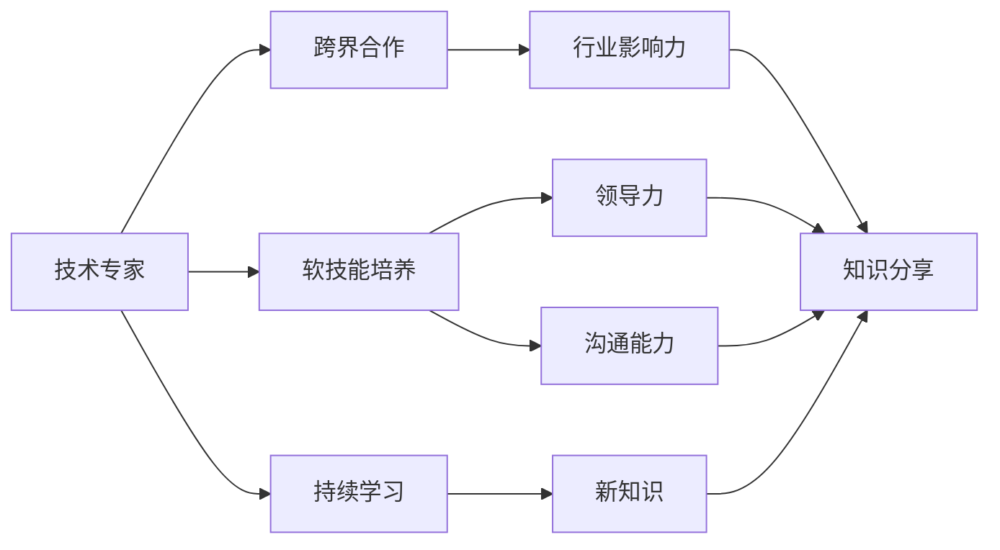

                 

# 从技术专家到行业意见领袖之路

> 关键词：技术专家,行业意见领袖,技术影响,领导力培养,知识分享,跨界合作,社区参与,持续学习

## 1. 背景介绍

### 1.1 问题由来
在信息爆炸的互联网时代，技术的更新迭代日新月异，无论是深度学习、自然语言处理、计算机视觉，还是区块链、人工智能、量子计算，每一个领域都在迅速变革。作为一个技术专家，如何在不断变化的领域中保持领先地位，并且从技术专家逐步成长为行业意见领袖？本文将探讨从技术专家成长为行业意见领袖的关键路径，分享一些实用的策略和经验，帮助你在科技领域中脱颖而出。

### 1.2 问题核心关键点
从技术专家到行业意见领袖的过程，不仅是技术能力的提升，更是对软技能、领导力、品牌建设、跨界合作等多方面能力的全面提升。以下将详细阐述这一过程的关键点：

- **技术深度**：在某一领域深入掌握核心技术，成为该领域的权威。
- **广泛知识**：具备跨领域知识，了解行业动态，能够进行跨学科思考。
- **领导力**：不仅具备领导团队的能力，也能通过影响力引导行业趋势。
- **沟通能力**：能够清晰、有说服力地表达技术观点，与不同背景的人交流。
- **创新思维**：不拘泥于现有技术框架，敢于提出新的解决方案。
- **影响力建设**：在社区、媒体、业界等不同渠道建立个人品牌。

## 2. 核心概念与联系

### 2.1 核心概念概述

为了更好地理解这一转变过程，我们将介绍一些核心概念，并探讨它们之间的联系：

- **技术专家**：在特定领域内精通核心技术，能够解决复杂问题的个人或团队。
- **行业意见领袖**：在某个行业内具有影响力，能够影响行业趋势和标准的人。
- **软技能**：包括领导力、沟通能力、团队协作等，对技术专家成长为行业意见领袖至关重要。
- **跨界合作**：不同领域间的合作，有助于技术专家获取新知识和技能，扩大影响力。
- **知识分享**：通过写作、演讲、教学等方式，将自己的知识和经验分享给更多人群。
- **社区参与**：活跃于开源社区、行业论坛等，建立个人品牌和影响力。
- **持续学习**：在技术迅速发展的环境中，持续学习是必不可少的。

这些概念之间的联系通过以下Mermaid流程图展示：



这个流程图展示了技术专家通过培养软技能、持续学习、跨界合作，逐步提升领导力和沟通能力，在行业内建立影响力，并最终通过知识分享成为行业意见领袖的过程。

## 3. 核心算法原理 & 具体操作步骤
### 3.1 算法原理概述

从技术专家到行业意见领袖的转变，本质上是一个综合能力的提升过程。这一过程可以通过以下核心算法和操作步骤来实现：

1. **技术深度挖掘**：深入学习某一领域的核心技术，掌握其原理和应用。
2. **软技能提升**：通过培训、实践等方式，提升领导力、沟通能力等软技能。
3. **跨界知识整合**：了解并整合不同领域的知识，拓宽视野。
4. **持续学习与实践**：在技术快速发展的背景下，不断学习新知识，并将其应用到实际项目中。
5. **知识与经验分享**：通过博客、论文、讲座、公开课等方式，分享知识和经验。
6. **社区与网络构建**：积极参与开源社区、行业会议等，建立人脉和影响力。
7. **品牌建设与影响力扩大**：通过持续输出高质量内容，建立个人品牌，扩大行业影响力。

### 3.2 算法步骤详解

以下是详细的步骤详解：

#### 3.2.1 技术深度挖掘

1. **选择合适的技术领域**：根据自己的兴趣和优势，选择一个具有广阔发展前景的技术领域。
2. **系统学习核心技术**：深入阅读相关书籍、文献，参加专业培训课程，构建完整的知识体系。
3. **实践项目积累**：参与实际项目，通过实践巩固知识，解决复杂问题。
4. **技术社区参与**：加入相关的技术社区，与同行交流，获取最新动态。

#### 3.2.2 软技能提升

1. **领导力培训**：参加领导力培训课程，理解领导力在团队中的作用。
2. **沟通技巧提升**：学习有效的沟通技巧，包括倾听、表达、非语言沟通等。
3. **团队协作实践**：在实际项目中，培养团队协作能力，了解不同角色和职责。
4. **冲突管理**：学习冲突管理和解决技巧，提升团队凝聚力。

#### 3.2.3 跨界知识整合

1. **多元领域学习**：涉猎不同领域的知识，如市场营销、金融、心理学等，建立跨学科的知识框架。
2. **跨领域项目参与**：参与跨领域的项目，如数据科学与市场分析相结合的项目，获取新知识。
3. **跨界合作实践**：与不同领域的专家合作，共同解决问题，学习对方领域的思维方式和技能。

#### 3.2.4 持续学习与实践

1. **跟踪最新研究**：定期阅读相关领域的最新研究论文，保持知识更新。
2. **参加行业会议**：参加行业会议，了解最新的技术趋势和应用案例。
3. **在线课程学习**：利用在线课程平台，学习新知识和技能。
4. **技术博客写作**：通过技术博客记录学习心得，分享技术见解。

#### 3.2.5 知识与经验分享

1. **技术博客**：撰写技术博客，分享项目经验和心得。
2. **公开课**：在公开课平台，如Coursera、edX等，开设课程，传授知识和技能。
3. **演讲和讲座**：参加行业会议，进行演讲和讲座，提升影响力。
4. **出版书籍**：将自己的研究和经验总结成书，分享深度的技术见解。

#### 3.2.6 社区与网络构建

1. **开源社区参与**：参与开源项目，贡献代码，与其他开发者交流。
2. **行业会议与论坛**：积极参加行业会议和论坛，结识行业专家和同行。
3. **社交媒体活跃**：在LinkedIn、Twitter等社交媒体上活跃，分享技术见解和项目进展。
4. **建立个人网站**：建立个人网站，展示自己的项目、研究成果和联系方式。

#### 3.2.7 品牌建设与影响力扩大

1. **高质量内容输出**：持续输出高质量的技术文章和博客，吸引读者关注。
2. **公开演示和项目展示**：在公开演示和项目展示中，展示技术能力和项目成果。
3. **媒体合作**：与媒体合作，撰写技术专栏，提升个人品牌影响力。
4. **社交媒体互动**：在社交媒体上积极互动，回答问题，建立个人品牌形象。

### 3.3 算法优缺点

从技术专家到行业意见领袖的转变，具有以下优点：

1. **提升影响力**：通过分享知识和经验，能够影响更多人的思维方式和行为。
2. **推动技术创新**：作为行业意见领袖，能够在技术领域引导创新方向，推动技术进步。
3. **增加职业机会**：具有广泛影响力的人，更容易在企业和技术社区中担任重要角色。

但同时也存在以下缺点：

1. **时间成本高**：要成为行业意见领袖，需要投入大量时间学习和实践。
2. **压力较大**：在公众面前表现压力较大，需要不断保持专业性和权威性。
3. **知识更新快**：需要不断学习新知识，保持技术的领先性。

## 4. 数学模型和公式 & 详细讲解 & 举例说明

### 4.1 数学模型构建

为了更系统地阐述这一过程，我们可以构建一个数学模型。假设我们定义一个技术专家的成长路径为 $P$，包括技术深度 $T$、软技能 $S$、跨界知识 $C$、持续学习与实践 $L$、知识与经验分享 $K$、社区与网络构建 $N$、品牌建设与影响力扩大 $B$。则成长路径 $P$ 可以表示为：

$$
P = T + S + C + L + K + N + B
$$

其中，每个组件可以进一步细分为多个子组件，例如 $T = T_1 + T_2 + T_3$，其中 $T_1$ 表示基础知识掌握，$T_2$ 表示项目实践经验，$T_3$ 表示技术社区参与。

### 4.2 公式推导过程

假设每个组件的权重分别为 $w_i$，则成长路径的总权重为：

$$
w_P = w_T + w_S + w_C + w_L + w_K + w_N + w_B
$$

其中，$w_T = \frac{1}{3}, w_S = \frac{1}{5}, w_C = \frac{1}{4}, w_L = \frac{1}{4}, w_K = \frac{1}{6}, w_N = \frac{1}{5}, w_B = \frac{1}{6}$。

每个组件的具体实现可以通过以下公式表示：

$$
T = \frac{1}{1+e^{-\alpha_1x}} \cdot (1 + \frac{1}{1+e^{-\alpha_2y}})
$$

其中，$\alpha_1, \alpha_2$ 为学习率和损失函数参数，$x, y$ 为时间变量。

### 4.3 案例分析与讲解

以构建一个知名的开源项目为例：

1. **选择技术领域**：选择深度学习作为技术领域。
2. **系统学习核心技术**：阅读《深度学习》等经典书籍，参加深度学习课程。
3. **实践项目积累**：在Kaggle等平台上参加项目竞赛，积累实战经验。
4. **技术社区参与**：在GitHub上参与开源项目，与社区成员交流。
5. **跨界知识整合**：学习市场营销知识，了解如何推广开源项目。
6. **持续学习与实践**：定期参加深度学习会议，学习最新研究。
7. **知识与经验分享**：撰写深度学习博客，发布开源项目代码。
8. **社区与网络构建**：在LinkedIn上积极互动，建立行业联系。
9. **品牌建设与影响力扩大**：通过公开演示和媒体合作，提升个人品牌影响力。

## 5. 项目实践：代码实例和详细解释说明

### 5.1 开发环境搭建

以下是Python开发环境的搭建步骤：

1. **安装Anaconda**：从官网下载并安装Anaconda，创建独立的Python环境。
2. **创建虚拟环境**：
```bash
conda create -n myenv python=3.8
conda activate myenv
```
3. **安装必要的Python库**：
```bash
conda install pandas numpy matplotlib scikit-learn jupyter notebook
```

### 5.2 源代码详细实现

以下是一个简单的深度学习项目的实现：

```python
import pandas as pd
import numpy as np
from sklearn.model_selection import train_test_split
from sklearn.linear_model import LogisticRegression
from sklearn.metrics import accuracy_score

# 读取数据集
data = pd.read_csv('data.csv')

# 数据预处理
X = data.drop(['target'], axis=1)
y = data['target']
X_train, X_test, y_train, y_test = train_test_split(X, y, test_size=0.2, random_state=42)

# 建立模型
model = LogisticRegression()
model.fit(X_train, y_train)

# 预测和评估
y_pred = model.predict(X_test)
accuracy = accuracy_score(y_test, y_pred)
print(f'Accuracy: {accuracy:.2f}')
```

### 5.3 代码解读与分析

- **数据读取**：使用Pandas读取CSV格式的数据集。
- **数据预处理**：将目标变量分离出来，并进行训练集和测试集的划分。
- **模型建立**：使用Scikit-learn库中的LogisticRegression模型进行训练。
- **预测和评估**：在测试集上进行预测，计算模型准确率。

## 6. 实际应用场景

### 6.1 软件开发

在软件开发领域，成为行业意见领袖需要具备较强的技术深度和跨界知识整合能力。例如，DevOps领域的技术专家可以通过撰写技术博客、开设公开课、参与行业会议等方式，分享自己的经验和见解，从而提升影响力。

### 6.2 数据科学

数据科学领域的技术专家，可以通过在开源社区积极参与项目，发布高质量的代码和文档，建立个人品牌。同时，通过参加Kaggle等数据竞赛，不断挑战自我，积累实战经验。

### 6.3 人工智能

在人工智能领域，技术专家可以通过发布深度学习项目、参加学术会议、撰写学术论文等方式，推动技术进步和社区发展。例如，OpenAI的研究人员通过发布GPT-3等模型，成为行业领袖。

### 6.4 未来应用展望

未来，随着技术的不断进步，跨界合作和持续学习将成为更加重要的能力。例如，人工智能与物联网的结合，将带来新的应用场景和技术挑战，需要在这一领域进行深入探索。

## 7. 工具和资源推荐

### 7.1 学习资源推荐

1. **Coursera**：提供各类在线课程，包括计算机科学、数据科学等。
2. **edX**：与全球顶尖大学合作，提供高质量的在线课程和学位项目。
3. **Udacity**：专注于技术领域的职业教育和认证。
4. **Kaggle**：数据科学竞赛平台，提供实战项目和数据集。
5. **GitHub**：全球最大的开源社区，提供丰富的代码和项目资源。

### 7.2 开发工具推荐

1. **PyCharm**：流行的Python IDE，支持代码调试、版本控制等。
2. **Jupyter Notebook**：交互式编程环境，适合数据科学和机器学习项目。
3. **Visual Studio Code**：轻量级的开发工具，支持多种编程语言。
4. **Git**：版本控制系统，适合协作开发和代码管理。
5. **Docker**：容器化技术，方便部署和管理复杂应用。

### 7.3 相关论文推荐

1. **《Deep Learning》**：Ian Goodfellow等人著，深度学习领域的经典教材。
2. **《Hands-On Machine Learning with Scikit-Learn, Keras, and TensorFlow》**：Aurélien Géron著，实战导向的机器学习入门书籍。
3. **《Programming Pearls》**：Jon Bentley著，计算机程序设计经典著作。
4. **《Artificial Intelligence: A Modern Approach》**：Stuart Russell和Peter Norvig著，AI领域的经典教材。
5. **《Design Patterns》**：Erich Gamma等人著，设计模式领域的经典著作。

## 8. 总结：未来发展趋势与挑战

### 8.1 总结

本文详细探讨了从技术专家到行业意见领袖的关键路径和策略。通过深入技术领域、提升软技能、跨界学习、持续学习与实践、知识与经验分享、社区与网络构建、品牌建设与影响力扩大，技术专家能够逐步成长为行业意见领袖。

### 8.2 未来发展趋势

未来，技术专家的成长将更加注重跨界合作和持续学习。人工智能、物联网、量子计算等新兴技术领域的融合，将带来更多创新机会。同时，技术的快速发展要求技术专家不断更新知识，保持领先地位。

### 8.3 面临的挑战

尽管成长之路充满机遇，但也面临诸多挑战：

1. **时间管理**：需要在多任务间平衡，投入时间学习新知识。
2. **知识更新**：保持对新技术的敏锐感知，不断学习。
3. **影响力建立**：需要建立广泛的行业联系，提升个人品牌。
4. **技术深度**：在特定领域内不断深入，成为领域专家。

### 8.4 研究展望

未来，技术的深度和广度将进一步扩展，技术专家需要不断探索新的领域和方向。跨界合作和持续学习将成为常态，建立强大的技术社区和品牌影响力将成为核心竞争力。

## 9. 附录：常见问题与解答

**Q1：如何建立自己的技术社区？**

A: 建立技术社区需要明确目标和定位，吸引志同道合的人加入。可以通过创建技术博客、参加行业会议、举办技术讲座等方式，逐步扩大影响力。

**Q2：如何提升沟通能力？**

A: 提升沟通能力需要多方面的训练，包括倾听、表达、非语言沟通等。可以通过参与演讲比赛、参加沟通技巧培训课程等方式，不断提升。

**Q3：如何保持技术领先？**

A: 保持技术领先需要不断学习新知识，跟踪最新研究动态。可以定期参加技术会议、阅读前沿论文、参与开源项目等方式，保持自己的技术敏感性。

**Q4：如何建立品牌影响力？**

A: 建立品牌影响力需要持续输出高质量的内容。可以通过撰写技术博客、开设公开课、参与学术会议等方式，逐步建立自己的技术品牌。

**Q5：如何平衡工作与学习？**

A: 平衡工作与学习需要良好的时间管理能力。可以制定详细的学习计划，合理安排时间，利用碎片时间进行学习。

---

作者：禅与计算机程序设计艺术 / Zen and the Art of Computer Programming

