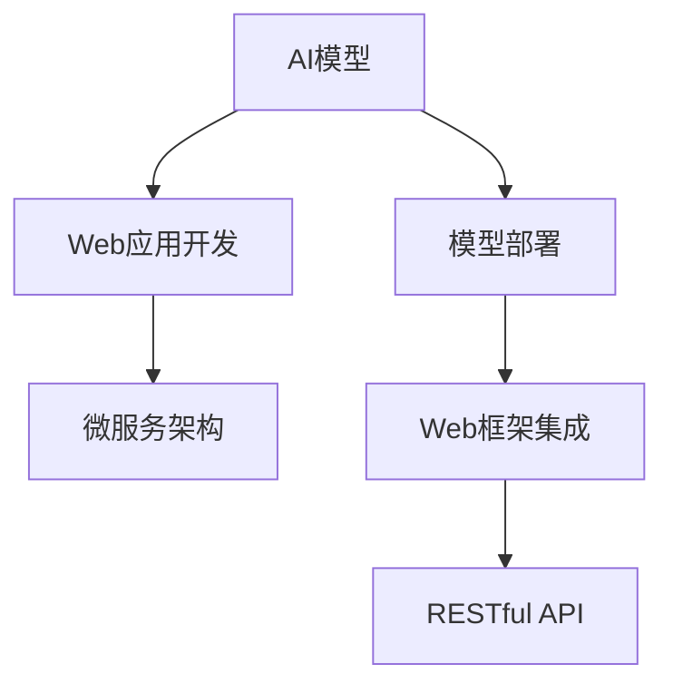

                 

# 从模型到产品：AI模型部署及Web应用开发

> 关键词：模型部署, AI应用开发, Web框架, 微服务架构, API开发, 数据接口

## 1. 背景介绍

### 1.1 问题由来
随着人工智能(AI)技术的迅猛发展，AI模型在图像识别、自然语言处理、智能推荐等多个领域取得了令人瞩目的成果。然而，模型开发只是AI应用的起点，如何将这些高质量的AI模型高效部署、集成到业务系统中，并转化为有价值的产品，是一个亟需解决的重要问题。

AI模型通常是在专用硬件（如GPU、TPU）上训练的，模型参数规模巨大，性能强悍。如何将这些模型有效地部署到普通的服务器、移动设备、Web应用等不同场景中，并确保其在实时应用场景中的高性能、高可用性，是一大技术难题。同时，如何将这些模型与Web应用、移动应用等结合，构建完整的产品功能，使其能够服务于广大用户，也是AI应用落地的关键。

因此，本文将深入探讨AI模型的部署技术，以及基于Web框架和微服务架构的AI应用开发实践。通过详细分析模型部署、应用开发、微服务架构等关键技术点，为AI应用产品的构建提供全面指导。

### 1.2 问题核心关键点
AI模型部署及Web应用开发的核心关键点包括：

- 模型部署：如何将大模型高效、稳定地部署到各种硬件和平台上，确保模型能够在实时场景中高效运行。
- Web应用开发：基于Web框架和微服务架构构建高质量的AI应用，实现模型的可视化展示和用户交互。
- 微服务架构：利用微服务架构，将应用系统拆分为多个微服务模块，增强系统的弹性和可扩展性。

这些关键点共同构成了AI应用从模型到产品的完整链路，通过研究这些问题，可以构建稳定、高效、可扩展的AI应用产品。

## 2. 核心概念与联系

### 2.1 核心概念概述

为更好地理解AI模型部署及Web应用开发的原理和实现，本节将介绍几个密切相关的核心概念：

- AI模型部署：将训练好的AI模型迁移到指定服务器或平台，使其能够在实时场景中高效运行的过程。
- Web框架：用于构建Web应用的框架，常见的包括Django、Flask等，提供了快速开发Web应用的工具和接口。
- 微服务架构：将应用系统拆分为多个独立部署、功能单一的服务模块，通过RESTful API进行通信和协作，增强系统的灵活性和可扩展性。

这些核心概念之间的逻辑关系可以通过以下Mermaid流程图来展示：



这个流程图展示了AI模型部署、Web应用开发、微服务架构之间的联系：

1. 将训练好的AI模型部署到服务器或平台，为Web应用提供数据处理和推理服务。
2. Web应用开发基于Web框架和RESTful API构建，实现用户界面和交互逻辑。
3. 微服务架构将Web应用拆分为多个独立的服务模块，增强系统的弹性和可扩展性。

## 3. 核心算法原理 & 具体操作步骤

### 3.1 算法原理概述

AI模型的部署与Web应用开发，本质上是一个软件工程问题。其核心思想是：将AI模型作为一个"数据处理和推理引擎"，通过API接口将其服务集成到Web应用中，从而实现模型的在线化应用。

具体而言，包括以下几个关键步骤：

1. **模型导出与存储**：将训练好的AI模型导出为可部署的格式，并存储在服务器或云平台上。
2. **模型部署与加载**：将模型部署到目标服务器或平台，并实现快速加载和推理。
3. **API接口设计**：设计RESTful API接口，使Web应用能够调用模型服务。
4. **Web应用集成**：将API接口集成到Web应用中，实现模型的可视化展示和用户交互。

### 3.2 算法步骤详解

**Step 1: 模型导出与存储**

- 使用深度学习框架（如TensorFlow、PyTorch等）训练并导出AI模型。通常使用onnx格式、pb格式或pickle格式进行模型导出。
- 将导出的模型文件存储到云存储（如AWS S3、阿里云OSS等）或本地文件系统，以便后续部署。

**Step 2: 模型部署与加载**

- 选择目标服务器或平台（如AWS EC2、Google Cloud Platform等）进行模型部署。
- 在目标服务器上安装相应的深度学习框架和依赖库，如TensorFlow、Keras、MXNet等。
- 配置服务器环境，确保模型加载和推理过程的性能和稳定性。
- 使用服务器端语言（如Python、C++、Java等）编写模型加载和推理代码。

**Step 3: API接口设计**

- 定义RESTful API接口规范，包括请求URL、请求方法、请求参数、响应数据等。
- 使用Web框架（如Flask、Django、Express等）实现API接口。
- 设计API接口的请求和响应示例，并进行单元测试验证接口的正确性。

**Step 4: Web应用集成**

- 在Web应用中集成API接口，通过AJAX、WebSocket等方式与API进行交互。
- 实现模型推理界面的UI设计，包括输入数据、显示结果、用户交互等。
- 对Web应用进行部署和测试，确保UI和API接口的无缝集成。

### 3.3 算法优缺点

AI模型部署与Web应用开发的优点包括：

- 模型在线化应用：将AI模型部署到目标服务器，使其能够在实时场景中高效运行。
- 灵活性高：通过RESTful API接口，模型可以与多种应用场景和业务逻辑无缝集成。
- 扩展性强：使用微服务架构，系统可以按需扩展，提升系统的可维护性和可扩展性。

然而，这些方法也存在一些局限性：

- 开发复杂度：模型部署和应用开发的流程相对复杂，需要一定的技术积累。
- 性能优化：模型加载和推理过程需要优化，确保系统的高性能和高可用性。
- 安全性和隐私保护：模型和数据需要合理的安全措施，避免数据泄露和模型滥用。

尽管存在这些局限性，但总体而言，AI模型部署与Web应用开发在当前技术条件下，是实现AI应用落地的最有效方法之一。

### 3.4 算法应用领域

AI模型部署与Web应用开发技术，已在多个行业领域得到广泛应用，包括：

- 智能推荐系统：利用机器学习模型，推荐个性化商品或内容。
- 金融风控：使用AI模型，进行欺诈检测、风险评估等。
- 智能客服：通过自然语言处理模型，提供自动化的客户服务和问题解答。
- 医疗诊断：使用AI模型，辅助医生进行疾病诊断和治疗方案推荐。
- 语音识别：部署语音识别模型，实现语音转文字、语音助手等功能。
- 智能安防：利用人脸识别、行为分析等模型，提升安防系统的智能化水平。
- 游戏开发：使用AI模型，实现游戏内的NPC行为生成、游戏推荐等功能。

## 4. 数学模型和公式 & 详细讲解

### 4.1 数学模型构建

本节将使用数学语言对AI模型部署与Web应用开发的原理进行更加严格的刻画。

记AI模型为 $M$，输入数据为 $x$，输出数据为 $y$。假设模型在输入 $x$ 上的输出为 $y = M(x)$。

### 4.2 公式推导过程

为了使模型能够高效部署和在线化应用，需要对模型进行以下处理：

1. **模型导出**：将训练好的模型参数 $w$ 导出为ONNX格式。
2. **模型加载**：在目标服务器上加载模型，并将其转换为可用的格式。
3. **API接口设计**：定义API接口的请求和响应格式，如JSON、XML等。
4. **模型推理**：在API接口中实现模型的推理过程，将输入数据 $x$ 转化为输出数据 $y$。

### 4.3 案例分析与讲解

以下以一个简单的图像分类模型为例，解释模型导出和部署的过程：

- **模型导出**：使用TensorFlow训练一个图像分类模型，并导出为ONNX格式。
- **模型加载**：在AWS EC2实例上安装TensorFlow，并加载导出的ONNX模型。
- **API接口设计**：使用Flask实现API接口，接受图像数据作为输入，返回模型预测结果。
- **模型推理**：在API接口中实现模型推理过程，将输入的图像数据转化为模型预测结果。

## 5. 项目实践：代码实例和详细解释说明

### 5.1 开发环境搭建

在进行模型部署和应用开发前，我们需要准备好开发环境。以下是使用Python进行Flask开发的环境配置流程：

1. 安装Anaconda：从官网下载并安装Anaconda，用于创建独立的Python环境。

2. 创建并激活虚拟环境：
```bash
conda create -n pyflask-env python=3.8 
conda activate pyflask-env
```

3. 安装Flask：
```bash
pip install flask
```

4. 安装其他必要依赖：
```bash
pip install numpy pandas scikit-learn scikit-image
```

完成上述步骤后，即可在`pyflask-env`环境中开始开发。

### 5.2 源代码详细实现

下面以一个简单的图像分类应用为例，展示Flask框架中模型的导出、部署和API接口的实现。

```python
from flask import Flask, request, jsonify
import numpy as np
import cv2
import onnxruntime as ort
import json

app = Flask(__name__)

# 加载ONNX模型
model_path = 'model.onnx'
ort_session = ort.InferenceSession(model_path)
input_name = ort_session.get_inputs()[0].name
output_name = ort_session.get_outputs()[0].name

# 定义API接口
@app.route('/classify', methods=['POST'])
def classify():
    data = request.json['image']
    img = np.array(bytearray(data), dtype=np.uint8)
    img = cv2.imdecode(img, cv2.IMREAD_COLOR)
    img = cv2.resize(img, (224, 224))
    img = np.expand_dims(img, axis=0)
    inputs = {input_name: img}
    outputs = ort_session.run(None, inputs)
    label = np.argmax(outputs[0], axis=1)
    result = {'label': label[0]}
    return jsonify(result)

if __name__ == '__main__':
    app.run(host='0.0.0.0', port=5000)
```

以上代码实现了模型的部署和API接口的开发。具体步骤如下：

- 使用Flask创建Web应用。
- 加载ONNX格式的模型文件，创建OrtSession对象。
- 定义POST请求的API接口`/classify`，接受图像数据作为输入，返回模型预测结果。
- 在主函数中启动Flask应用，监听请求。

### 5.3 代码解读与分析

让我们再详细解读一下关键代码的实现细节：

**Flask应用创建**：
- `from flask import Flask`：导入Flask框架。
- `app = Flask(__name__)`：创建Flask应用对象。

**模型加载**：
- `ort_session = ort.InferenceSession(model_path)`：加载ONNX模型文件，创建OrtSession对象。
- `input_name = ort_session.get_inputs()[0].name`：获取模型的输入名称。
- `output_name = ort_session.get_outputs()[0].name`：获取模型的输出名称。

**API接口实现**：
- `@app.route('/classify', methods=['POST'])`：定义POST请求的API接口路径`/classify`。
- `data = request.json['image']`：从请求中获取图像数据。
- `img = np.array(bytearray(data), dtype=np.uint8)`：将请求中的图像数据转换为NumPy数组。
- `img = cv2.imdecode(img, cv2.IMREAD_COLOR)`：解码图像。
- `img = cv2.resize(img, (224, 224))`：调整图像尺寸。
- `img = np.expand_dims(img, axis=0)`：将图像数据转化为3D数组。
- `inputs = {input_name: img}`：将图像数据作为输入，传递给模型。
- `outputs = ort_session.run(None, inputs)`：执行模型推理。
- `label = np.argmax(outputs[0], axis=1)`：获取模型预测结果。
- `result = {'label': label[0]}`：将预测结果转换为JSON格式。
- `return jsonify(result)`：返回JSON格式结果。

可以看到，Flask框架的使用使得模型的部署和API接口的开发变得简洁高效。开发者可以将更多精力放在模型推理、数据处理等核心逻辑上，而不必过多关注底层的实现细节。

当然，在实际应用中，还需要考虑更多因素，如模型安全性、API接口的性能优化、应用部署等。但核心的微调范式基本与此类似。

## 6. 实际应用场景

### 6.1 智能推荐系统

基于AI模型和Web框架构建的智能推荐系统，可以广泛应用于电商、视频、新闻等领域。推荐系统通过机器学习模型对用户行为进行分析和预测，实时推荐个性化的商品、内容或信息，提升用户体验和转化率。

在技术实现上，可以使用深度学习模型对用户行为数据进行训练，导出模型并部署到Web应用中。用户通过Web界面输入行为数据，调用API接口，获取推荐结果。推荐系统可以实时处理用户的交互数据，动态更新推荐模型，提升推荐效果。

### 6.2 金融风控

使用AI模型和Web框架构建的金融风控系统，能够实时分析交易数据，检测异常交易和欺诈行为，保障金融安全。

在技术实现上，可以使用深度学习模型对交易数据进行训练，导出模型并部署到Web应用中。用户通过Web界面输入交易数据，调用API接口，获取风控结果。系统可以根据实时交易数据，动态更新风控模型，提升检测精度。

### 6.3 智能客服

基于AI模型和Web框架构建的智能客服系统，可以广泛应用于企业客户服务、医疗咨询、金融顾问等领域。系统通过自然语言处理模型对用户查询进行处理，生成自然流畅的回复，提升客户满意度。

在技术实现上，可以使用深度学习模型对历史客服数据进行训练，导出模型并部署到Web应用中。用户通过Web界面输入查询，调用API接口，获取客服回复。系统可以实时分析用户查询，动态更新模型参数，提升回复质量。

### 6.4 未来应用展望

随着AI模型和Web框架的不断发展，基于AI模型的应用将拓展到更多领域，为各行各业带来变革性影响。

在智慧医疗领域，基于AI模型的医疗诊断、治疗推荐、药物研发等应用将提升医疗服务的智能化水平，辅助医生诊疗，加速新药开发进程。

在智能教育领域，智能推荐系统可以辅助教师进行课程推荐，智能问答系统可以辅助学生进行问题解答，因材施教，促进教育公平，提高教学质量。

在智慧城市治理中，AI模型可以用于城市事件监测、舆情分析、应急指挥等环节，提高城市管理的自动化和智能化水平，构建更安全、高效的未来城市。

此外，在企业生产、社会治理、文娱传媒等众多领域，基于AI模型的应用也将不断涌现，为经济社会发展注入新的动力。相信随着技术的日益成熟，AI模型将进一步拓展其应用边界，为人类认知智能的进化带来深远影响。

## 7. 工具和资源推荐

### 7.1 学习资源推荐

为了帮助开发者系统掌握AI模型部署及Web应用开发的技术基础和实践技巧，这里推荐一些优质的学习资源：

1. TensorFlow官方文档：TensorFlow官方提供的深度学习框架文档，包含模型导出、模型加载、API接口等详细说明。
2. ONNX官方文档：ONNX官方提供的模型格式标准文档，详细介绍了ONNX模型格式的规范和工具。
3. Flask官方文档：Flask官方提供的Web框架文档，包含API接口设计和实现的具体方法。
4. RESTful API设计规范：关于RESTful API设计规范的权威教程，详细介绍了API接口的规范和设计原则。
5. 《Python Web开发实战》书籍：介绍Flask、Django等Web框架的使用方法和最佳实践，适合初学者和中级开发者。

通过对这些资源的学习实践，相信你一定能够快速掌握AI模型部署及Web应用开发的精髓，并用于解决实际的AI应用问题。

### 7.2 开发工具推荐

高效的开发离不开优秀的工具支持。以下是几款用于AI模型部署及Web应用开发的常用工具：

1. AWS EC2：提供高性能的云服务器，支持深度学习模型的在线化部署。
2. Google Cloud Platform：提供高效的云计算资源，支持深度学习模型的在线化部署。
3. TensorFlow Serving：提供高效的模型推理服务，支持多种深度学习框架的模型部署。
4. FastAPI：高性能的Web框架，支持异步API接口的实现。
5. AWS Lambda：提供高效的函数计算服务，支持API接口的无服务器部署。
6. Docker：提供容器化部署技术，支持模型和应用的打包和部署。

合理利用这些工具，可以显著提升AI模型部署和Web应用开发的效率，加快创新迭代的步伐。

### 7.3 相关论文推荐

AI模型部署及Web应用开发技术的发展源于学界的持续研究。以下是几篇奠基性的相关论文，推荐阅读：

1. "TensorFlow: A System for Large-Scale Machine Learning"：介绍TensorFlow的体系结构和设计思想，详细介绍了模型导出和部署的过程。
2. "ONNX: Format for Neural Networks Exchange"：提出ONNX模型格式标准，详细介绍了ONNX模型格式的规范和工具。
3. "RESTful Web Services Architectures"：介绍RESTful Web服务架构的基本概念和设计原则，详细介绍了API接口的规范和实现方法。
4. "TensorFlow Serving: Flexible, High-Performance TensorFlow Serving"：介绍TensorFlow Serving的体系结构和实现方法，详细介绍了模型推理服务和API接口的设计。
5. "FastAPI: Fast APIs with Python 3.7+ based on standard Python type hints"：介绍FastAPI的体系结构和实现方法，详细介绍了API接口的异步实现。

这些论文代表了大语言模型微调技术的发展脉络。通过学习这些前沿成果，可以帮助研究者把握学科前进方向，激发更多的创新灵感。

## 8. 总结：未来发展趋势与挑战

### 8.1 总结

本文对AI模型部署及Web应用开发的原理和实践进行了全面系统的介绍。首先阐述了AI模型部署及Web应用开发的背景和意义，明确了模型部署、应用开发、微服务架构等关键技术点。其次，从原理到实践，详细讲解了模型部署、API接口设计、Web应用集成等关键步骤，给出了模型部署和应用开发的完整代码实例。同时，本文还广泛探讨了模型部署及Web应用开发在多个行业领域的应用前景，展示了AI模型部署及Web应用开发的巨大潜力。此外，本文精选了相关学习资源，力求为开发者提供全方位的技术指引。

通过本文的系统梳理，可以看到，AI模型部署及Web应用开发技术正在成为AI应用落地的重要手段，极大地拓展了AI应用的边界，催生了更多的落地场景。AI模型在线化应用，使得模型能够在实时场景中高效运行，Web应用开发则通过API接口实现了模型的可视化展示和用户交互，微服务架构则增强了系统的弹性和可扩展性。AI模型部署及Web应用开发，正成为构建高质量AI应用产品的核心技术。

### 8.2 未来发展趋势

展望未来，AI模型部署及Web应用开发技术将呈现以下几个发展趋势：

1. 模型在线化普及：AI模型在线化部署将成为主流趋势，为实时应用场景提供高效、稳定的模型服务。
2. 微服务架构广泛应用：微服务架构将广泛应用于AI应用系统，增强系统的灵活性和可扩展性。
3. 模型推理优化：通过优化模型推理过程，提升系统的性能和可靠性。
4. 数据接口标准化：建立统一的数据接口标准，提升系统的互操作性和易用性。
5. 服务化部署：将AI模型服务化部署，通过API接口提供通用、标准化的服务，提升系统的复用性和可靠性。

以上趋势凸显了AI模型部署及Web应用开发的广阔前景。这些方向的探索发展，必将进一步提升AI应用的性能和应用范围，为经济社会发展注入新的动力。

### 8.3 面临的挑战

尽管AI模型部署及Web应用开发技术已经取得了显著进展，但在迈向更加智能化、普适化应用的过程中，它仍面临着诸多挑战：

1. 模型性能优化：模型推理过程需要优化，确保系统的高性能和高可用性。
2. 数据接口设计：数据接口需要规范化和标准化，提升系统的互操作性和易用性。
3. 模型安全性：模型和数据需要合理的安全措施，避免数据泄露和模型滥用。
4. 系统可扩展性：系统需要具备良好的可扩展性，支持按需扩展。
5. 系统可靠性：系统需要具备高可靠性，支持故障转移和数据冗余。

尽管存在这些挑战，但总体而言，AI模型部署及Web应用开发技术在当前技术条件下，是实现AI应用落地的最有效方法之一。

### 8.4 研究展望

面对AI模型部署及Web应用开发所面临的挑战，未来的研究需要在以下几个方面寻求新的突破：

1. 优化模型推理过程：通过优化模型推理过程，提升系统的性能和可靠性。
2. 规范化数据接口：建立统一的数据接口标准，提升系统的互操作性和易用性。
3. 加强系统安全性：采取合理的安全措施，确保模型和数据的安全性。
4. 增强系统可扩展性：采用微服务架构，提升系统的弹性和可扩展性。
5. 提高系统可靠性：采用容错设计和数据冗余机制，确保系统的可靠性。

这些研究方向的探索，必将引领AI模型部署及Web应用开发技术迈向更高的台阶，为构建稳定、高效、可扩展的AI应用产品铺平道路。面向未来，AI模型部署及Web应用开发技术还需要与其他AI技术进行更深入的融合，如知识表示、因果推理、强化学习等，多路径协同发力，共同推动人工智能技术在垂直行业的规模化落地。只有勇于创新、敢于突破，才能不断拓展AI模型的边界，让AI技术更好地造福人类社会。

## 9. 附录：常见问题与解答

**Q1：AI模型部署是否需要考虑性能和可扩展性？**

A: 是的，AI模型的部署需要考虑性能和可扩展性。模型加载和推理过程需要优化，确保系统的高性能和高可用性。同时，系统需要具备良好的可扩展性，支持按需扩展，提升系统的灵活性和可维护性。

**Q2：Web应用开发中API接口的设计有哪些注意事项？**

A: 设计API接口时，需要注意以下几点：

1. 接口规范：API接口的设计需要遵循RESTful规范，使用标准化的HTTP方法（如GET、POST、PUT、DELETE等）和状态码。
2. 输入验证：需要对输入数据进行验证，确保数据的合法性和一致性。
3. 输出格式：API接口的输出需要采用标准的格式（如JSON、XML等），方便客户端解析和处理。
4. 安全性：API接口需要采用安全措施，如访问鉴权、数据脱敏等，防止数据泄露和滥用。

**Q3：如何评估AI模型的部署效果？**

A: 评估AI模型的部署效果可以从以下几个方面进行：

1. 模型推理速度：测试模型推理的响应时间，确保系统的高性能。
2. 模型准确率：通过测试数据集，评估模型推理的准确率，确保模型的精度。
3. 系统可靠性：测试系统的容错能力和数据冗余机制，确保系统的可靠性。
4. 用户满意度：通过用户反馈，评估系统的易用性和用户体验，提升系统的可维护性。

**Q4：如何处理AI模型的在线化部署中的存储问题？**

A: 处理AI模型的在线化部署中的存储问题可以从以下几个方面进行：

1. 模型压缩：使用模型压缩技术，减小模型的存储空间。
2. 数据缓存：使用缓存技术，减少模型推理的I/O开销。
3. 分布式存储：使用分布式存储技术，提高系统的可扩展性和可靠性。
4. 数据冗余：使用数据冗余机制，提高系统的容错能力和可靠性。

**Q5：AI模型在线化部署中如何保证数据安全？**

A: 保证AI模型在线化部署中的数据安全可以从以下几个方面进行：

1. 数据加密：对存储和传输的数据进行加密处理，防止数据泄露。
2. 访问鉴权：采用访问鉴权机制，确保只有授权用户可以访问数据。
3. 数据脱敏：对敏感数据进行脱敏处理，保护用户隐私。
4. 安全监控：对系统的安全事件进行监控和记录，及时发现和处理安全问题。

这些问题的解答和处理，可以为AI模型的在线化部署和Web应用开发提供指导和参考，帮助开发者构建安全、稳定、高效的应用系统。

