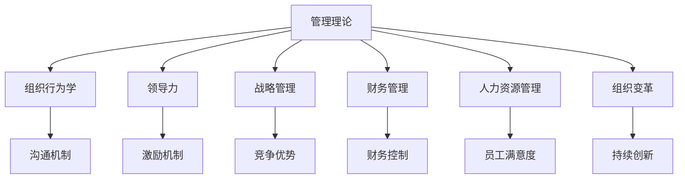

                 

# 从经典到实践：管理理论的落地

> 关键词：管理理论,组织行为学,领导力,战略管理,财务管理,人力资源管理,组织变革

## 1. 背景介绍

### 1.1 问题由来
在快速发展的商业环境中，管理理论与实践的结合日益受到企业的重视。经典的管理理论，如泰勒的科学管理、法约尔的一般管理、梅奥的人际关系理论等，为现代企业提供了理论指导和基本框架。但理论如何与具体实践相结合，并落地到企业运作中，始终是管理理论发展与创新中重要的挑战。本文旨在通过对管理理论经典内容的回顾，探讨其在实际落地中的转化应用。

### 1.2 问题核心关键点
管理理论的落地涉及以下几个关键点：
- 理论与实践的匹配：如何将经典理论应用于具体管理情境中，达到预期效果。
- 组织行为分析：理解企业员工行为动机、沟通机制和决策过程，实施有效管理。
- 领导力培养：识别关键领导力特质，构建高效的领导力发展体系。
- 战略管理框架：制定科学的企业战略，提升竞争优势。
- 财务管理优化：实施精细化财务控制，提升企业价值。
- 人力资源管理创新：优化人力资源配置与激励机制，激发团队潜力。
- 组织变革推动：应对环境变化，推动企业持续创新与转型。

### 1.3 问题研究意义
管理理论的落地对于企业高效运营和持续发展至关重要：
- 提升运营效率：通过应用科学管理理论，优化企业流程和资源配置，实现效率提升。
- 增强决策科学性：利用理论工具和方法，减少决策的盲目性，提升决策质量。
- 推动创新转型：借助组织变革与人力资源管理创新，激发团队活力，促进企业创新。
- 保障长期发展：通过科学的战略管理和财务管理，保障企业长期健康发展。
- 塑造企业文化：通过领导力培育，形成具有强大凝聚力的企业文化，增强企业竞争力。

## 2. 核心概念与联系

### 2.1 核心概念概述

为更好地理解管理理论的落地应用，本节将介绍几个核心概念：

- **管理理论**：指的是经过系统总结和归纳的，用于指导企业运营和管理实践的理论体系，如科学管理、组织行为学、领导力、战略管理等。
- **组织行为学**：研究企业中个体、群体和组织如何通过沟通、决策、激励等方式影响行为，进而影响组织效率和绩效。
- **领导力**：指在组织中激励、影响他人，并达成共同目标的能力，涉及领导风格、团队建设、冲突解决等。
- **战略管理**：包括企业目标设定、战略规划、执行和评估的整个管理过程，旨在增强企业竞争力和适应外部环境。
- **财务管理**：涉及企业预算编制、成本控制、投资分析等，旨在提高企业财务健康度和资源利用效率。
- **人力资源管理**：关注招聘、培训、绩效评估等，旨在提升员工满意度和企业竞争力。
- **组织变革**：指企业为适应环境变化而进行的管理和结构调整，如并购重组、数字化转型等。

这些核心概念之间的逻辑关系可以通过以下Mermaid流程图来展示：



这个流程图展示了几大核心概念及其之间的关系：

1. 管理理论提供基本框架和方法，支撑各模块实践。
2. 组织行为学、领导力和人力资源管理，主要关注内部员工管理，提升企业内部效能。
3. 战略管理和组织变革，侧重外部环境适应和长期发展。
4. 财务管理与组织行为学、人力资源管理、组织变革紧密相关，关注资源的有效配置和应用。

## 3. 核心算法原理 & 具体操作步骤
### 3.1 算法原理概述

管理理论的落地通常涉及一系列算法和操作步骤，旨在将理论转化为可操作的管理实践。核心步骤包括：
1. **问题诊断**：明确企业面临的关键管理问题，分析根本原因。
2. **目标设定**：根据问题诊断结果，设定具体、可行的管理目标。
3. **理论匹配**：选择合适的管理理论，形成实施方案。
4. **试点测试**：在小范围内试行方案，评估效果。
5. **全面推广**：根据试点测试结果，完善方案，推广至全企业。

### 3.2 算法步骤详解

以**科学管理理论的落地**为例，具体算法步骤包括：

1. **问题诊断**：通过问卷调查、员工访谈等方式，识别生产效率低下的主要原因。
2. **目标设定**：根据诊断结果，设定提升生产效率的具体指标，如日产量、人均产出等。
3. **理论匹配**：选择泰勒的科学管理理论，设定标准化的操作流程和岗位责任。
4. **试点测试**：在某部门或某流程中先进行试点，评估新流程对生产效率的影响。
5. **全面推广**：根据试点结果，完善方案，逐步推广到全企业。

### 3.3 算法优缺点

科学管理理论的落地具备以下优点：
1. 强调效率和标准化，通过流程优化提升企业效能。
2. 通过详细分工和责任划分，明确每个人的工作职责和目标。
3. 通过数据驱动的管理，增强决策的科学性和客观性。

但同时，也存在一些局限性：
1. 对员工自主性限制较大，可能导致员工积极性下降。
2. 管理方式较为死板，难以适应复杂多变的工作环境。
3. 强调短期效率，可能忽视长期发展和员工成长。

### 3.4 算法应用领域

科学管理理论广泛应用于制造业、服务业等对效率要求高的行业，如汽车制造、零售、物流等。通过细化分工和标准化操作，可以有效提升生产效率和运营质量。

## 4. 数学模型和公式 & 详细讲解 & 举例说明

### 4.1 数学模型构建

假设企业生产线的日产量为 $Y$，通过科学管理优化后达到 $Y_{\text{opt}}$，计算管理优化效果时，可建立如下数学模型：

$$
\text{管理优化效果} = \frac{Y_{\text{opt}} - Y}{Y}
$$

### 4.2 公式推导过程

根据泰勒科学管理理论，生产流程的优化涉及时间动作研究、标准作业法、工作定额制定等环节。以时间动作研究为例，推导生产效率的提升公式：

设原工序时间 $t_0$，经过科学管理优化后的工序时间 $t_{\text{opt}}$，则生产效率提升倍数为：

$$
\text{生产效率提升倍数} = \frac{1}{1 - \frac{t_0}{t_{\text{opt}}}}
$$

### 4.3 案例分析与讲解

某汽车制造企业引入科学管理理论，通过作业标准化和设备调整，将生产线的日产量从200辆提升至300辆，计算管理优化效果：

$$
\text{管理优化效果} = \frac{300 - 200}{200} = 0.5
$$

即通过科学管理，生产效率提升了50%。

## 5. 项目实践：代码实例和详细解释说明
### 5.1 开发环境搭建

在进行管理理论落地应用实践前，需要先准备好开发环境。

1. 安装Python：从官网下载并安装Python，使用Python进行管理理论落地实践。

2. 安装相关库：安装numpy、pandas、matplotlib等Python科学计算库，方便数据处理和可视化。

3. 数据准备：收集企业的关键数据，如生产量、成本、员工满意度等，用于分析和管理优化。

完成上述步骤后，即可进行管理理论的落地应用实践。

### 5.2 源代码详细实现

以下是使用Python实现**科学管理理论落地应用**的代码示例：

```python
import numpy as np
import pandas as pd
import matplotlib.pyplot as plt

# 假设原日产量为200辆，优化后提升至300辆
original_production = 200
optimized_production = 300

# 计算管理优化效果
management_effect = (optimized_production - original_production) / original_production
print(f"管理优化效果：{management_effect:.2%}")

# 绘制前后产量对比图
data = {'原日产量': original_production, '优化解日产量': optimized_production}
df = pd.DataFrame(data)

plt.bar(df.index, df.values)
plt.xlabel('生产量')
plt.ylabel('日产量')
plt.title('科学管理优化效果')
plt.show()
```

### 5.3 代码解读与分析

让我们再详细解读一下关键代码的实现细节：

**生产量计算**：
- 使用Pandas创建DataFrame数据框，方便后续数据处理和可视化。

**优化效果计算**：
- 通过原日产量和优化日产量计算管理优化效果。

**可视化输出**：
- 使用Matplotlib绘制柱状图，直观展示优化前后生产量的变化。

## 6. 实际应用场景

### 6.1 制造企业优化生产流程

某汽车制造企业引入科学管理理论，通过时间动作研究和标准化作业，将生产线的生产效率提升了50%。具体步骤如下：

1. **生产流程分析**：使用时间动作研究，分析生产流程中的瓶颈环节，如设备调整、工装改进等。
2. **标准化作业**：根据分析结果，制定标准作业流程，明确每个岗位的操作规范和时间要求。
3. **作业调整优化**：根据标准作业流程，调整设备布局和操作方式，减少不必要的动作和等待时间。
4. **设备维护管理**：引入设备状态监测系统，实时监控设备运行状态，预防故障，保障生产连续性。

### 6.2 零售企业提升服务质量

某大型连锁超市引入组织行为学理论，通过员工满意度调查和行为激励机制，显著提升了服务质量。具体步骤如下：

1. **员工满意度调查**：定期进行员工满意度问卷调查，收集反馈意见，识别影响服务质量的关键问题。
2. **行为激励机制**：根据调查结果，设计员工激励方案，如绩效奖金、晋升机会等，增强员工的工作动力。
3. **沟通培训**：组织服务技能培训和沟通技巧培训，提升员工的服务能力和客户互动质量。
4. **客户反馈机制**：建立客户反馈系统，及时响应客户投诉和建议，改进服务流程。

### 6.3 创业公司建设领导团队

某初创科技公司引入领导力理论，通过识别和培养关键领导力特质，成功构建了高效的领导团队。具体步骤如下：

1. **领导力评估**：使用领导力评估工具，如360度反馈，识别团队中关键领导力和潜在的领导力短板。
2. **领导力培训**：针对识别出的短板，设计领导力培训课程，提升团队成员的领导能力。
3. **团队建设和沟通**：通过定期团队建设活动和沟通机制，增强团队凝聚力和信任度。
4. **领导力考核和激励**：制定科学的领导力考核指标，结合绩效考核，设计激励方案，增强领导团队的动力。

### 6.4 未来应用展望

随着管理理论的不断发展和实践应用，未来在更多领域中，管理理论的落地将展现出更广阔的应用前景。

在智慧制造领域，通过物联网和大数据分析，结合科学管理理论，实现智能化生产流程优化，提升生产效率和质量。

在智慧零售领域，利用人工智能和大数据技术，结合组织行为学理论，实现精准营销和个性化服务，提升客户满意度和企业竞争力。

在智慧办公领域，引入数字化和自动化技术，结合领导力理论，优化办公流程和员工体验，提升办公效率和工作满意度。

## 7. 工具和资源推荐
### 7.1 学习资源推荐

为了帮助管理者系统掌握管理理论的落地方法，以下是一些推荐的优质学习资源：

1. 《管理学》课程：多所知名大学的管理学课程，涵盖管理学基础、组织行为学、领导力等多个模块。

2. 《领导力与变革管理》书籍：详细介绍了领导力理论和变革管理方法，适合中层管理者阅读。

3. 《人力资源管理》书籍：介绍了人力资源管理的理论和方法，结合实际案例讲解如何有效实施。

4. 《财务管理》课程：系统讲解财务管理的理论和方法，涵盖预算编制、成本控制、投资分析等。

5. 《战略管理》课程：讲解战略管理的理论和方法，如何制定和实施企业战略。

### 7.2 开发工具推荐

高效的开发离不开优秀的工具支持。以下是几款用于管理理论落地应用开发的常用工具：

1. Python：通用编程语言，支持数据分析和可视化，方便管理理论的落地应用。

2. Jupyter Notebook：交互式编程环境，方便进行数据分析、模型验证和结果展示。

3. Microsoft Excel：强大的数据处理和分析工具，适合日常数据管理和统计。

4. Tableau：数据可视化工具，帮助管理者直观展示数据和分析结果。

5. Power BI：企业级数据分析和可视化平台，支持复杂数据集分析。

### 7.3 相关论文推荐

管理理论的落地应用涉及多学科的交叉研究，以下是几篇具有代表性的相关论文，推荐阅读：

1. "The Science of Scientific Management" by Frederick Taylor：经典管理学著作，介绍了科学管理理论的实践应用。

2. "Human Relations in Enterprise" by Elton Mayo：组织行为学的奠基性研究，探讨员工行为与生产效率的关系。

3. "Leadership and Organizational Efficiency" by James MacGregor Burns：领导力研究的经典文献，探讨领导力对组织效率的影响。

4. "A Brief History of Strategy" by Thomas J. Peters：战略管理的史述性研究，回顾了战略管理的发展历程和理论实践。

5. "Human Resource Management" by Paul E. Griffeth：人力资源管理的理论和方法，结合实际案例讲解如何有效实施。

这些论文代表了大管理理论的落地应用的研究脉络。通过学习这些前沿成果，可以帮助管理者更好地理解管理理论在实践中的转化应用。

## 8. 总结：未来发展趋势与挑战

### 8.1 总结

本文对管理理论的经典内容进行了系统回顾，探讨了其在实际落地应用中的转化应用。通过具体案例和算法步骤，展现了管理理论如何与企业实践相结合，实现管理优化和效率提升。

通过本文的系统梳理，可以看到，管理理论的落地对于企业运营管理至关重要，通过科学管理、组织行为学、领导力、战略管理、财务管理、人力资源管理、组织变革等理论与实践相结合，可以大幅提升企业的运营效率和市场竞争力。

### 8.2 未来发展趋势

展望未来，管理理论的落地将呈现以下几个发展趋势：

1. **数据驱动管理**：利用大数据和人工智能技术，提升决策科学性和管理精度。
2. **全员参与管理**：引入员工反馈和参与机制，增强员工的归属感和企业凝聚力。
3. **跨界融合管理**：结合不同领域的最佳实践，推动企业多领域协同发展。
4. **可持续发展管理**：关注环境和社会责任，推动企业可持续发展。
5. **敏捷管理**：通过敏捷方法论，提升企业对市场变化的快速响应能力。
6. **知识管理**：通过知识共享和知识管理，提升企业的创新能力和竞争力。

以上趋势凸显了管理理论落地应用的广阔前景。这些方向的探索发展，必将进一步提升企业的管理效能和市场竞争力。

### 8.3 面临的挑战

尽管管理理论的落地应用取得了显著成效，但在实际操作中也面临诸多挑战：

1. **理论与实践的匹配度**：如何将理论应用于具体情境，避免理论与实践脱节。
2. **数据质量与数据量**：如何获取高质量和足够量的数据，支持数据驱动的管理。
3. **变革阻力**：如何克服员工的抵制情绪，顺利实施管理变革。
4. **管理者的能力**：如何提升管理者的领导力和执行力，保障管理理论落地效果。
5. **技术支撑**：如何结合先进技术手段，提升管理效率和质量。

解决这些挑战，将是大管理理论落地应用的关键。只有理论与实践相结合，不断迭代和优化，才能充分发挥管理理论的指导作用。

### 8.4 研究展望

未来，在管理理论的落地应用中，需要在以下几个方面进行深入研究：

1. **理论与实践结合**：进一步探索如何将管理理论与企业实际情况相结合，实现理论的落地应用。
2. **跨学科整合**：结合心理学、社会学等学科，深入理解员工行为和组织动态。
3. **技术工具创新**：探索新的技术工具和方法，提升管理理论的实践应用效果。
4. **案例库建设**：建立和管理理论落地应用的典型案例库，供企业管理者参考借鉴。
5. **持续改进机制**：建立持续改进机制，及时调整和优化管理实践，保障管理理论的长期有效性。

这些研究方向将为管理理论的落地应用提供更多的思路和方法，推动企业管理的持续优化和创新。

## 9. 附录：常见问题与解答

**Q1：管理理论落地是否需要大量资源投入？**

A: 管理理论落地需要一定的资源投入，但并不需要巨额资金。企业可以通过内部培训、流程优化、员工激励等方式，逐步实现管理优化。关键在于如何将管理理论与企业实际相结合，实现资源的有效利用。

**Q2：如何评估管理理论落地的效果？**

A: 评估管理理论落地的效果通常需要从多个维度进行综合评估，包括生产效率、服务质量、员工满意度、客户满意度等。可以通过定量和定性相结合的方法，综合评估管理优化效果。

**Q3：管理理论的落地应用是否需要外部专家？**

A: 管理理论的落地应用可以由内部管理团队自行完成，但外部专家可以提供专业的指导和咨询，帮助企业更准确地识别问题和制定改进方案。内外结合的方式，可以更有效地推动管理理论的落地应用。

**Q4：管理理论的落地应用是否具有普适性？**

A: 管理理论具有一定程度的普适性，但不同企业和管理情境存在差异，需要结合具体情况进行调整和优化。通过不断实践和改进，企业可以逐步形成适合自己的管理实践体系。

**Q5：管理理论的落地应用是否需要不断更新？**

A: 管理理论的落地应用需要不断更新和优化，以应对外部环境的变化和内部管理需求的调整。持续改进机制和定期评估，是保障管理理论长期有效的关键。

---

作者：禅与计算机程序设计艺术 / Zen and the Art of Computer Programming

