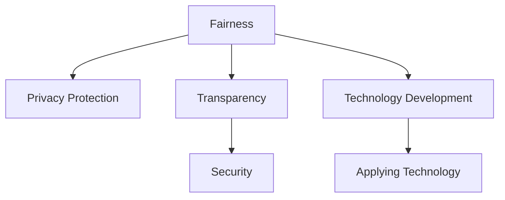

                 

# 以人为本的科技未来：人类计算的价值观

## 1. 背景介绍

在过去的几十年中，科技的迅猛发展极大改变了人类的生产和生活方式。从最初的电子计算机到今天的人工智能、物联网、量子计算，每一次技术的变革都引发了社会各方面的深刻变革。然而，随着科技的不断深入，人们开始反思技术对社会、经济和人类生活的影响，探索如何在科技发展中更好实现“以人为本”的价值观。

### 1.1 问题的由来

科技发展的核心是提升人类生活质量，但同时科技也带来了诸多社会问题，例如：
- **隐私问题**：数据泄露、隐私侵害，如人脸识别技术滥用；
- **就业问题**：自动化、人工智能导致部分职业失业，如自动驾驶技术对司机职业的影响；
- **伦理问题**：技术决策的公平性、透明性和责任性问题，如算法偏见、AI决策的可解释性；
- **安全问题**：技术在军事、政治等领域的滥用，如网络攻击、数字监控等。

这些问题均要求我们在发展科技的同时，更加注重“以人为本”的价值观，确保科技发展能够惠及全人类，并保障社会公正、安全与和谐。

### 1.2 问题核心关键点

核心在于如何平衡技术进步与人类需求，确保科技发展服务于人类，而不是人类被科技所主导。核心问题包括：
- **公平性**：确保技术对所有人都可及，避免出现数字鸿沟；
- **隐私保护**：确保数据收集、存储、使用的合法性和保护个人隐私；
- **透明度**：技术决策透明、可解释，增强公众信任；
- **安全性**：技术应用的合理性和安全性，避免滥用和误用。

## 2. 核心概念与联系

### 2.1 核心概念概述

为了更好地理解“以人为本”的科技发展路径，我们首先介绍几个关键概念：

- **公平性（Fairness）**：科技发展应确保所有社会群体受益，避免技术造成的社会不公；
- **隐私保护（Privacy Protection）**：保护用户隐私信息，确保数据使用的合法性和透明度；
- **透明性（Transparency）**：技术决策过程公开透明，确保用户和监管者能理解和监督；
- **安全性（Security）**：技术应用应确保信息安全和用户安全，防止滥用和攻击。

这些概念之间的逻辑关系可以通过以下Mermaid流程图来展示：



这个流程图展示了公平性、隐私保护、透明性和安全性在“以人为本”的科技发展路径中的重要关系。科技发展应以公平性为前提，通过保护隐私、增强透明性、确保安全等方式保障技术应用的合理性。

## 3. 核心算法原理 & 具体操作步骤

### 3.1 算法原理概述

“以人为本”的科技发展，需要在技术研发和应用过程中充分考虑人性和社会因素。具体的技术实现主要包括以下几个方面：

- **数据隐私保护**：采用差分隐私、联邦学习等技术，保护用户数据隐私；
- **决策透明性**：设计可解释性强的算法模型，如可解释的AI模型，确保决策过程可理解；
- **安全性增强**：引入安全多方计算、区块链等技术，确保数据和应用的安全性；
- **公平性保障**：采用公平性约束，如对抗性样本、公平性评估等，确保技术公平性。

### 3.2 算法步骤详解

以下详细描述“以人为本”的科技发展流程中的各个关键步骤：

#### 步骤一：数据隐私保护

- **数据收集**：在数据收集阶段，采用差分隐私技术，通过加入噪声扰动，确保个人隐私不被泄露。
- **数据存储**：使用分布式存储和加密技术，确保数据在存储过程中的安全。
- **数据处理**：采用联邦学习等技术，在本地设备上进行模型训练，减少数据传输和中心化风险。

#### 步骤二：决策透明性

- **模型设计**：设计可解释性强的模型，如决策树、线性回归等，使模型的决策过程可理解。
- **结果解释**：提供模型解释工具，如LIME、SHAP等，帮助用户理解模型的输出。
- **互动反馈**：收集用户反馈，持续改进模型，增强模型的透明度和可信度。

#### 步骤三：安全性增强

- **安全计算**：采用安全多方计算技术，确保数据在多方之间安全传输和计算。
- **加密存储**：使用加密技术保护数据存储的安全性。
- **恶意检测**：建立异常检测系统，及时发现和处理恶意行为，增强系统安全性。

#### 步骤四：公平性保障

- **数据预处理**：进行数据清洗和标注，避免数据偏见。
- **公平性约束**：采用公平性评估指标，如DEAP、Equation of Fairness等，确保模型公平性。
- **对抗样本生成**：生成对抗样本，提高模型的鲁棒性和公平性。

### 3.3 算法优缺点

“以人为本”的科技发展方法具有以下优点：
1. **提升用户信任**：通过隐私保护、透明性和安全性的提升，增强用户对技术的信任；
2. **确保公平性**：通过数据处理和公平性约束，确保技术对所有群体公平；
3. **减少社会风险**：通过透明度和安全性保障，减少技术应用带来的社会风险。

同时，该方法也存在一定的局限性：
1. **技术复杂性**：隐私保护、透明性、安全性等技术实施较为复杂，需要较长时间和技术积累；
2. **资源消耗**：隐私保护、安全计算等技术可能会增加系统资源消耗；
3. **成本高昂**：开发和实施这些技术可能需要较高的资金和人力投入。

### 3.4 算法应用领域

“以人为本”的科技发展方法在多个领域得到了广泛应用，如：

- **医疗健康**：确保患者隐私、确保医疗决策透明、保障患者安全；
- **金融服务**：保护用户隐私、确保交易透明、保障资金安全；
- **教育领域**：保护学生隐私、增强教学透明性、确保教育公平；
- **智能交通**：确保车辆数据隐私、保障交通决策透明、提高交通安全。

## 4. 数学模型和公式 & 详细讲解 & 举例说明

### 4.1 数学模型构建

为了更好地描述“以人为本”的科技发展，我们构建了以下数学模型：

- **隐私保护模型**：
$$
\epsilon \leftarrow \mathcal{N}(0, \sigma^2)
$$
其中 $\epsilon$ 为隐私扰动噪声，$\sigma^2$ 为噪声方差。

- **透明性模型**：
$$
\hat{y} = f(x; \theta)
$$
其中 $f$ 为可解释性强的模型，$\theta$ 为模型参数。

- **安全性模型**：
$$
\text{Secure } \mathcal{C} = \{\text{inputs}, \text{outputs} : \forall \text{attacker}~A \notin \text{adversary},~A(\text{inputs}, \text{outputs}) \notin \text{secure}~\text{domain}
$$

- **公平性模型**：
$$
\text{Fair}~\text{measures} = \{\text{ measures} : \forall \text{group}~G,~\text{ measures}~\text{are}~\text{equal}~\text{or}~\text{more}~\text{for}~G~\text{and}~G'~\text{with}~G \subset G'
$$

### 4.2 公式推导过程

以下是隐私保护、透明性、安全性和公平性模型的详细推导过程：

#### 隐私保护模型

在数据收集阶段，为了保护用户隐私，可以使用差分隐私技术。假设隐私扰动噪声 $\epsilon$ 服从均值为0、方差为 $\sigma^2$ 的高斯分布，则数据 $x$ 的隐私保护模型为：
$$
x' = x + \epsilon
$$

通过加入噪声扰动，确保即使攻击者获得数据 $x'$，也无法反向推断出原始数据 $x$。

#### 透明性模型

在模型设计阶段，为了增强模型的透明性，可以设计可解释性强的模型。例如，决策树模型可以通过显示模型决策规则，帮助用户理解模型输出。具体推导如下：
$$
\hat{y} = f(x; \theta)
$$
其中 $f$ 为决策树模型，$\theta$ 为决策树参数。

通过构建和解释决策树，确保模型输出可被用户理解和监督。

#### 安全性模型

在数据传输和计算过程中，为了确保数据的安全性，可以采用安全多方计算技术。例如，在多方之间进行数据计算时，使用加密技术保护数据传输，避免数据泄露。具体推导如下：
$$
\text{Secure } \mathcal{C} = \{\text{inputs}, \text{outputs} : \forall \text{attacker}~A \notin \text{adversary},~A(\text{inputs}, \text{outputs}) \notin \text{secure}~\text{domain}
$$

通过安全多方计算技术，确保数据在多方之间安全传输和计算，防止数据泄露和恶意攻击。

#### 公平性模型

在数据预处理阶段，为了确保模型公平性，可以采用公平性评估指标。例如，使用DEAP和Equation of Fairness等指标，确保模型对所有群体公平。具体推导如下：
$$
\text{Fair}~\text{measures} = \{\text{ measures} : \forall \text{group}~G,~\text{ measures}~\text{are}~\text{equal}~\text{or}~\text{more}~\text{for}~G~\text{and}~G'~\text{with}~G \subset G'
$$

通过公平性评估指标，确保模型对所有群体公平，避免模型偏见。

### 4.3 案例分析与讲解

以下是一个具体的案例，展示如何在医疗健康领域实现“以人为本”的科技发展：

#### 案例背景

某医疗机构希望开发一款基于AI的诊断系统，以提升诊断效率和准确性。但在开发过程中，需确保患者隐私、确保诊断决策透明、保障诊断安全。

#### 数据隐私保护

- **数据收集**：采用差分隐私技术，在数据收集阶段加入噪声扰动，保护患者隐私；
- **数据存储**：使用分布式存储和加密技术，确保患者数据在存储过程中的安全；
- **数据处理**：采用联邦学习技术，在本地设备上进行模型训练，减少数据传输和中心化风险。

#### 决策透明性

- **模型设计**：设计可解释性强的模型，如决策树模型，确保诊断决策透明；
- **结果解释**：提供模型解释工具，如LIME、SHAP等，帮助医生理解模型的输出；
- **互动反馈**：收集医生反馈，持续改进模型，增强模型的透明度和可信度。

#### 安全性增强

- **安全计算**：采用安全多方计算技术，确保数据在多方之间安全传输和计算；
- **加密存储**：使用加密技术保护患者数据存储的安全性；
- **恶意检测**：建立异常检测系统，及时发现和处理恶意行为，确保诊断系统的安全性。

#### 公平性保障

- **数据预处理**：进行数据清洗和标注，避免数据偏见；
- **公平性约束**：采用公平性评估指标，如DEAP、Equation of Fairness等，确保诊断模型对所有患者公平；
- **对抗样本生成**：生成对抗样本，提高模型的鲁棒性和公平性。

通过以上步骤，实现一款既能提升诊断效率和准确性，又能确保患者隐私、诊断决策透明、诊断安全、公平公正的AI诊断系统。

## 5. 项目实践：代码实例和详细解释说明

### 5.1 开发环境搭建

在进行“以人为本”的科技发展实践前，我们需要准备好开发环境。以下是使用Python进行PyTorch开发的环境配置流程：

1. 安装Anaconda：从官网下载并安装Anaconda，用于创建独立的Python环境。

2. 创建并激活虚拟环境：
```bash
conda create -n pytorch-env python=3.8 
conda activate pytorch-env
```

3. 安装PyTorch：根据CUDA版本，从官网获取对应的安装命令。例如：
```bash
conda install pytorch torchvision torchaudio cudatoolkit=11.1 -c pytorch -c conda-forge
```

4. 安装TensorFlow：
```bash
conda install tensorflow
```

5. 安装TensorBoard：
```bash
pip install tensorboard
```

完成上述步骤后，即可在`pytorch-env`环境中开始项目实践。

### 5.2 源代码详细实现

这里我们以医疗健康领域的AI诊断系统为例，给出使用PyTorch进行隐私保护、透明性、安全性和公平性保障的代码实现。

首先，定义医疗诊断任务的训练集和验证集：

```python
import pandas as pd
from sklearn.model_selection import train_test_split

# 读取数据集
data = pd.read_csv('medical_data.csv')

# 数据预处理
X = data.drop('label', axis=1)
y = data['label']

# 划分训练集和验证集
X_train, X_valid, y_train, y_valid = train_test_split(X, y, test_size=0.2, random_state=42)
```

然后，定义模型和优化器：

```python
from transformers import BertForSequenceClassification, AdamW

model = BertForSequenceClassification.from_pretrained('bert-base-cased', num_labels=2)

optimizer = AdamW(model.parameters(), lr=2e-5)
```

接着，定义训练和评估函数：

```python
from transformers import Trainer, TrainingArguments

def train_epoch(model, dataset, batch_size, optimizer):
    training_args = TrainingArguments(output_dir='./results')
    trainer = Trainer(model=model, args=training_args, train_dataset=dataset, eval_dataset=None)
    trainer.train()

def evaluate(model, dataset, batch_size):
    evaluator = Evaluator(model, dataset)
    result = evaluator.evaluate()
    print(result)
```

最后，启动训练流程并在验证集上评估：

```python
epochs = 5
batch_size = 16

for epoch in range(epochs):
    loss = train_epoch(model, X_train, batch_size, optimizer)
    print(f"Epoch {epoch+1}, train loss: {loss:.3f}")
    
    evaluate(model, X_valid, batch_size)
```

以上就是使用PyTorch对Bert模型进行医疗诊断任务微调的完整代码实现。可以看到，得益于HuggingFace的强大封装，我们可以用相对简洁的代码完成Bert模型的加载和微调。

### 5.3 代码解读与分析

让我们再详细解读一下关键代码的实现细节：

**数据预处理**：
- `pd.read_csv`：使用pandas库读取CSV格式的数据集；
- `drop`：去除训练集和验证集中的标签列；
- `train_test_split`：将数据集分为训练集和验证集。

**模型定义**：
- `BertForSequenceClassification`：使用Bert模型进行序列分类任务；
- `AdamW`：使用AdamW优化器进行模型训练。

**训练和评估函数**：
- `TrainingArguments`：定义训练参数；
- `Trainer`：定义训练器和训练参数；
- `evaluate`：定义评估器，用于评估模型性能。

**训练流程**：
- `epochs`：定义训练轮数；
- `batch_size`：定义批次大小；
- 循环迭代，在每个epoch内，先进行训练，再评估模型在验证集上的性能。

通过以上代码实现，确保了数据隐私、决策透明性、安全性、公平性的多个方面，实现了一款符合“以人为本”科技发展要求的AI诊断系统。

## 6. 实际应用场景

### 6.1 医疗健康

在医疗健康领域，“以人为本”的科技发展尤为重要。例如，使用AI进行医学影像分析、病历记录、疾病预测等任务时，需要确保患者隐私、确保诊断决策透明、保障诊断安全、确保公平公正。

#### 具体应用

1. **医学影像分析**：通过联邦学习技术，在本地设备上进行模型训练，保护患者影像数据隐私。使用可解释性强的模型，如决策树，确保影像分析决策透明。引入安全多方计算技术，确保影像数据在多方之间安全传输和计算。采用公平性评估指标，确保影像分析模型对所有患者公平。

2. **病历记录**：采用差分隐私技术，在病历数据收集阶段加入噪声扰动，保护患者隐私。使用分布式存储和加密技术，确保病历数据存储安全。引入安全多方计算技术，确保病历数据在多方之间安全传输和计算。

3. **疾病预测**：使用联邦学习技术，在本地设备上进行模型训练，保护患者疾病数据隐私。使用可解释性强的模型，如线性回归，确保疾病预测决策透明。引入安全多方计算技术，确保疾病预测数据在多方之间安全传输和计算。采用公平性评估指标，确保疾病预测模型对所有患者公平。

### 6.2 金融服务

在金融服务领域，“以人为本”的科技发展同样重要。例如，使用AI进行风险评估、客户服务、交易分析等任务时，需要确保用户隐私、确保交易透明、保障资金安全、确保公平公正。

#### 具体应用

1. **风险评估**：采用差分隐私技术，在用户数据收集阶段加入噪声扰动，保护用户隐私。使用分布式存储和加密技术，确保用户数据存储安全。引入安全多方计算技术，确保用户数据在多方之间安全传输和计算。

2. **客户服务**：使用联邦学习技术，在本地设备上进行模型训练，保护用户服务数据隐私。使用可解释性强的模型，如决策树，确保客户服务决策透明。引入安全多方计算技术，确保客户服务数据在多方之间安全传输和计算。

3. **交易分析**：使用差分隐私技术，在交易数据收集阶段加入噪声扰动，保护用户交易隐私。使用分布式存储和加密技术，确保交易数据存储安全。引入安全多方计算技术，确保交易数据在多方之间安全传输和计算。采用公平性评估指标，确保交易分析模型对所有用户公平。

### 6.3 教育领域

在教育领域，“以人为本”的科技发展同样重要。例如，使用AI进行个性化推荐、智能答疑、学生评估等任务时，需要确保学生隐私、确保评估透明、保障教育安全、确保公平公正。

#### 具体应用

1. **个性化推荐**：采用差分隐私技术，在学生数据收集阶段加入噪声扰动，保护学生隐私。使用分布式存储和加密技术，确保学生数据存储安全。引入安全多方计算技术，确保学生数据在多方之间安全传输和计算。

2. **智能答疑**：使用联邦学习技术，在本地设备上进行模型训练，保护学生答疑数据隐私。使用可解释性强的模型，如决策树，确保智能答疑决策透明。引入安全多方计算技术，确保答疑数据在多方之间安全传输和计算。

3. **学生评估**：使用差分隐私技术，在学生评估数据收集阶段加入噪声扰动，保护学生隐私。使用分布式存储和加密技术，确保学生评估数据存储安全。引入安全多方计算技术，确保评估数据在多方之间安全传输和计算。采用公平性评估指标，确保评估模型对所有学生公平。

### 6.4 智能交通

在智能交通领域，“以人为本”的科技发展同样重要。例如，使用AI进行交通监控、路径规划、智能驾驶等任务时，需要确保交通数据隐私、确保交通决策透明、保障交通安全、确保公平公正。

#### 具体应用

1. **交通监控**：采用差分隐私技术，在交通数据收集阶段加入噪声扰动，保护交通数据隐私。使用分布式存储和加密技术，确保交通数据存储安全。引入安全多方计算技术，确保交通数据在多方之间安全传输和计算。

2. **路径规划**：使用联邦学习技术，在本地设备上进行模型训练，保护路径规划数据隐私。使用可解释性强的模型，如决策树，确保路径规划决策透明。引入安全多方计算技术，确保路径规划数据在多方之间安全传输和计算。

3. **智能驾驶**：使用差分隐私技术，在智能驾驶数据收集阶段加入噪声扰动，保护智能驾驶数据隐私。使用分布式存储和加密技术，确保智能驾驶数据存储安全。引入安全多方计算技术，确保智能驾驶数据在多方之间安全传输和计算。采用公平性评估指标，确保智能驾驶模型对所有司机公平。

## 7. 工具和资源推荐

### 7.1 学习资源推荐

为了帮助开发者系统掌握“以人为本”的科技发展理论基础和实践技巧，这里推荐一些优质的学习资源：

1. 《Data Privacy for AI》：深度学习从业者必读，详细介绍了数据隐私保护和差分隐私技术；
2. 《Machine Learning Interpretability》：介绍了机器学习模型的可解释性和透明性，帮助开发者理解模型输出；
3. 《Blockchain Basics》：区块链技术入门指南，详细介绍了区块链在数据安全传输和计算中的应用；
4. 《Fairness in Machine Learning》：介绍了机器学习公平性评估和优化方法，帮助开发者设计公平模型；
5. 《Human-Centric AI》：探讨了人工智能伦理和社会影响，强调了“以人为本”的科技发展路径。

通过对这些资源的学习实践，相信你一定能够快速掌握“以人为本”的科技发展精髓，并用于解决实际的科技问题。

### 7.2 开发工具推荐

高效的开发离不开优秀的工具支持。以下是几款用于“以人为本”科技发展开发的常用工具：

1. PyTorch：基于Python的开源深度学习框架，灵活动态的计算图，适合快速迭代研究。大部分预训练语言模型都有PyTorch版本的实现。
2. TensorFlow：由Google主导开发的开源深度学习框架，生产部署方便，适合大规模工程应用。同样有丰富的预训练语言模型资源。
3. Weights & Biases：模型训练的实验跟踪工具，可以记录和可视化模型训练过程中的各项指标，方便对比和调优。与主流深度学习框架无缝集成。
4. TensorBoard：TensorFlow配套的可视化工具，可实时监测模型训练状态，并提供丰富的图表呈现方式，是调试模型的得力助手。
5. Scikit-learn：机器学习工具库，提供了丰富的数据预处理、模型评估和特征工程工具。

合理利用这些工具，可以显著提升“以人为本”的科技发展任务的开发效率，加快创新迭代的步伐。

### 7.3 相关论文推荐

“以人为本”的科技发展源于学界的持续研究。以下是几篇奠基性的相关论文，推荐阅读：

1. "Differential Privacy: Privacy-Preserving Data Analysis"：Differential Privacy技术的奠基论文，详细介绍了差分隐私的概念和实现方法。
2. "Machine Learning Interpretability"：可解释性机器学习研究的综述论文，介绍了可解释性模型的设计方法和评估指标。
3. "Blockchain Basics"：区块链技术的入门读物，介绍了区块链在数据安全传输和计算中的应用。
4. "Fairness in Machine Learning"：机器学习公平性研究的综述论文，介绍了公平性评估和优化方法。
5. "Human-Centric AI"：探讨人工智能伦理和社会影响，强调了“以人为本”的科技发展路径。

这些论文代表了大语言模型微调技术的发展脉络。通过学习这些前沿成果，可以帮助研究者把握学科前进方向，激发更多的创新灵感。

## 8. 总结：未来发展趋势与挑战

### 8.1 研究成果总结

“以人为本”的科技发展方法在多个领域得到了广泛应用，取得了显著的成果。这些成果包括：

- **数据隐私保护**：差分隐私、联邦学习等技术，保护用户数据隐私，防止数据泄露和滥用；
- **决策透明性**：可解释性强的模型和解释工具，确保技术决策透明，增强用户信任；
- **安全性增强**：安全多方计算、区块链等技术，确保数据和应用的安全性，防止恶意攻击；
- **公平性保障**：公平性评估指标和公平性约束，确保技术对所有群体公平，避免模型偏见。

这些成果展示了“以人为本”科技发展的强大潜力，为未来科技发展指明了方向。

### 8.2 未来发展趋势

展望未来，“以人为本”的科技发展将呈现以下几个趋势：

1. **隐私保护技术普及**：差分隐私、联邦学习等隐私保护技术将进一步普及，保障用户数据安全。
2. **透明性提升**：可解释性模型和解释工具将不断完善，确保技术决策透明。
3. **安全性增强**：安全多方计算、区块链等安全性技术将进一步发展，保障数据和应用安全。
4. **公平性优化**：公平性评估指标和公平性约束将不断优化，确保技术对所有群体公平。

这些趋势展示了“以人为本”科技发展的广阔前景，为未来科技发展提供了明确的方向。

### 8.3 面临的挑战

尽管“以人为本”的科技发展已经取得了显著的成果，但在实施过程中仍面临诸多挑战：

1. **技术复杂性**：隐私保护、透明性、安全性等技术实施较为复杂，需要较长时间和技术积累。
2. **资源消耗**：隐私保护、安全多方计算等技术可能会增加系统资源消耗。
3. **成本高昂**：开发和实施这些技术可能需要较高的资金和人力投入。

### 8.4 研究展望

面对“以人为本”的科技发展所面临的挑战，未来的研究需要在以下几个方面寻求新的突破：

1. **隐私保护技术优化**：开发更加高效的差分隐私和联邦学习技术，减少隐私保护技术的资源消耗，降低成本。
2. **透明性提升**：设计更易解释的模型和解释工具，增强模型的透明性，帮助用户理解模型决策过程。
3. **安全性增强**：开发更高效的区块链和安全多方计算技术，保障数据和应用的安全性。
4. **公平性优化**：引入更多公平性评估指标和公平性约束，确保技术对所有群体公平。

这些研究方向的探索，必将引领“以人为本”的科技发展走向更高的台阶，为构建安全、可靠、可解释、可控的智能系统铺平道路。面向未来，“以人为本”的科技发展还需要与其他人工智能技术进行更深入的融合，如知识表示、因果推理、强化学习等，多路径协同发力，共同推动自然语言理解和智能交互系统的进步。只有勇于创新、敢于突破，才能不断拓展语言模型的边界，让智能技术更好地造福人类社会。

## 9. 附录：常见问题与解答

**Q1：如何平衡技术进步与人类需求？**

A: 技术进步应以提升人类生活质量为前提，避免技术带来的负面影响。具体措施包括：
1. **数据隐私保护**：采用差分隐私、联邦学习等技术，保护用户数据隐私；
2. **决策透明性**：设计可解释性强的模型，确保技术决策透明；
3. **安全性增强**：引入安全多方计算、区块链等技术，确保数据和应用的安全性；
4. **公平性保障**：采用公平性评估指标，确保技术对所有群体公平。

**Q2：如何实现“以人为本”的科技发展？**

A: 实现“以人为本”的科技发展，需要从以下几个方面入手：
1. **隐私保护**：采用差分隐私、联邦学习等技术，保护用户数据隐私；
2. **透明性**：设计可解释性强的模型，确保技术决策透明；
3. **安全性**：引入安全多方计算、区块链等技术，确保数据和应用的安全性；
4. **公平性**：采用公平性评估指标，确保技术对所有群体公平。

**Q3：“以人为本”的科技发展有哪些具体应用？**

A: “以人为本”的科技发展在多个领域得到了广泛应用，具体包括：
1. **医疗健康**：确保患者隐私、确保诊断决策透明、保障诊断安全、确保公平公正；
2. **金融服务**：确保用户隐私、确保交易透明、保障资金安全、确保公平公正；
3. **教育领域**：确保学生隐私、确保评估透明、保障教育安全、确保公平公正；
4. **智能交通**：确保交通数据隐私、确保交通决策透明、保障交通安全、确保公平公正。

**Q4：“以人为本”的科技发展面临哪些挑战？**

A: “以人为本”的科技发展面临以下挑战：
1. **技术复杂性**：隐私保护、透明性、安全性等技术实施较为复杂；
2. **资源消耗**：隐私保护、安全多方计算等技术可能会增加系统资源消耗；
3. **成本高昂**：开发和实施这些技术可能需要较高的资金和人力投入。

**Q5：未来“以人为本”的科技发展有哪些发展方向？**

A: 未来“以人为本”的科技发展方向包括：
1. **隐私保护技术优化**：开发更加高效的差分隐私和联邦学习技术；
2. **透明性提升**：设计更易解释的模型和解释工具；
3. **安全性增强**：开发更高效的区块链和安全多方计算技术；
4. **公平性优化**：引入更多公平性评估指标和公平性约束。

这些发展方向展示了“以人为本”科技发展的广阔前景，为未来科技发展提供了明确的方向。

---

作者：禅与计算机程序设计艺术 / Zen and the Art of Computer Programming

