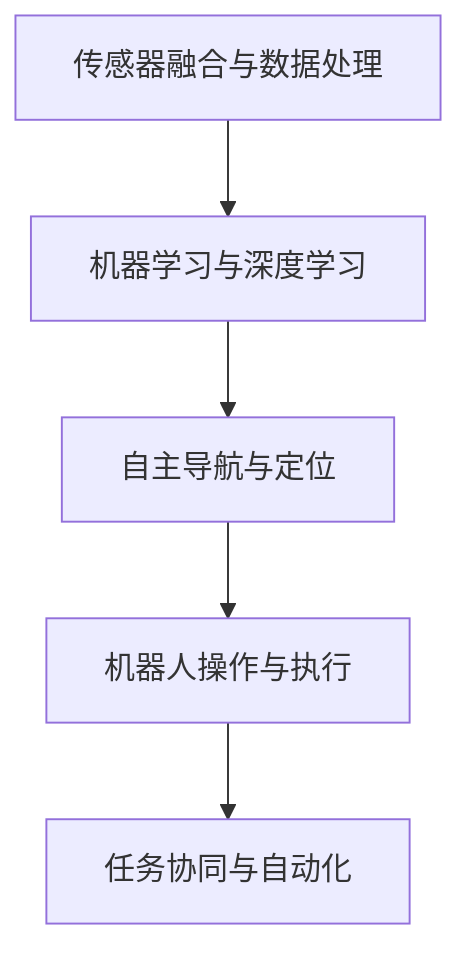

                 

# 仿生机器人在农业中的应用：精准种植和收获

## 1. 背景介绍

### 1.1 问题由来

随着人口的增长和农业生产的集约化，传统农业生产方式已经难以满足现代农业发展的需求。面对有限资源的严峻挑战，如何提高农业生产的效率和可持续性，是摆在我们面前的重要课题。在这方面，仿生机器人技术展现出巨大潜力，能够在精准种植、智能收获等方面提供解决方案，显著提升农业生产的智能化水平。

### 1.2 问题核心关键点

仿生机器人技术基于生物学的机制和原理，通过计算机视觉、传感器、机器学习等技术手段，模拟和优化农业生产过程。其核心关键点包括：

- **传感器融合与数据处理**：通过集成多种传感器，实时采集田间数据，为决策提供依据。
- **机器学习与自主导航**：利用机器学习算法，学习农业场景中的复杂特征，实现自主导航与定位。
- **机器人操作与执行**：仿生机器人通过机械臂、挖掘工具等执行精准种植、施肥、喷药等操作。
- **任务协同与自动化**：多个仿生机器人之间以及与人类操作员之间的协同工作，实现农业生产的自动化。

### 1.3 问题研究意义

仿生机器人在农业中的应用，有助于实现精准农业的目标，即通过精确控制和数据分析，提升农业生产的效率、减少资源浪费、保障食品安全。同时，它还能减轻人类劳动强度，改善农村生态环境，推动农业产业的现代化转型升级。

## 2. 核心概念与联系

### 2.1 核心概念概述

仿生机器人技术将仿生学、机器人学、计算机视觉、传感器技术等跨学科知识融合，构建具有高度灵活性和适应性的农业生产系统。其核心概念包括：

- **仿生机器人**：基于仿生学的机器人系统，模拟生物体的行为和结构，实现自主执行农业生产任务。
- **精准农业**：利用信息技术，对农业生产过程进行精确管理，实现资源的高效利用。
- **物联网(IoT)**：通过传感器、通信设备等，实现田间数据的网络化、智能化采集与传输。
- **机器学习与深度学习**：用于机器人行为预测、路径规划、数据处理等任务，提升自主决策能力。
- **自主导航与定位**：使机器人能够自主在田间导航，准确到达指定位置。

这些核心概念共同构成了仿生机器人技术在农业中的应用框架，为其实现精准种植和智能收获提供了理论基础和实现途径。

### 2.2 核心概念原理和架构的 Mermaid 流程图



这个流程图展示了仿生机器人在农业应用中的主要技术环节。传感器采集的数据通过融合处理，得到准确的田间信息。机器学习算法对数据进行分析，实现自主导航和操作决策。机器人执行种植、收获等任务，并通过协同工作提升效率。

## 3. 核心算法原理 & 具体操作步骤
### 3.1 算法原理概述

仿生机器人在农业中的应用，本质上是一个多传感器数据融合、自主导航与操作执行的过程。其核心算法原理包括：

- **传感器数据融合**：利用传感器采集田间的多维信息（如土壤湿度、温度、光照等），通过加权平均、滤波等方法，得到精确的田间环境数据。
- **路径规划与导航**：使用机器学习算法（如神经网络），对田间环境和目标位置进行建模，规划最优路径，实现机器人自主导航。
- **操作决策与执行**：根据田间数据和机器学习模型的输出，决策具体的种植、施肥、喷药等操作，并由机器人执行。

### 3.2 算法步骤详解

仿生机器人在农业中的应用步骤可以分为以下几个关键环节：

**Step 1: 传感器部署与数据采集**
- 在田间布设各种传感器，如土壤湿度传感器、光照传感器、温度传感器等，实时采集田间环境数据。
- 部署定位传感器，如GPS、UWB等，为机器人提供导航信息。

**Step 2: 数据融合与处理**
- 对传感器采集的多源数据进行融合，去除噪声，得到准确的环境信息。
- 利用机器学习算法对数据进行分析，提取有用的特征，用于路径规划和操作决策。

**Step 3: 路径规划与导航**
- 利用机器学习算法对田间环境和目标位置进行建模，规划最优路径。
- 使用SLAM（Simultaneous Localization and Mapping）算法实现实时定位和地图构建。

**Step 4: 操作决策与执行**
- 根据田间数据和机器学习模型的输出，决策具体的种植、施肥、喷药等操作。
- 通过机器人机械臂等执行工具，完成操作任务。

**Step 5: 任务协同与反馈优化**
- 通过通信设备，实现多个机器人之间的协同工作。
- 根据操作反馈，优化模型和参数，提高机器人执行任务的准确性和效率。

### 3.3 算法优缺点

仿生机器人技术在农业应用中具有以下优点：

- **提升效率**：通过自主导航和操作，大幅减少人工劳动，提高农业生产的效率。
- **精准管理**：利用传感器和机器学习算法，实现对田间环境的精确管理，减少资源浪费。
- **降低成本**：减少人工投入，降低生产成本，提高农业生产的可持续性。

同时，该技术也存在以下缺点：

- **初始投入高**：仿生机器人和相关设备的初期成本较高，需要大量的资本投入。
- **技术复杂**：涉及传感器、机器学习、自主导航等多个领域，技术门槛较高。
- **环境适应性**：机器人在面对复杂多变的田间环境时，可能出现适应性问题。

### 3.4 算法应用领域

仿生机器人在农业中的应用领域非常广泛，包括但不限于：

- **精准种植**：通过自主导航和操作，实现种子的精准播种、育苗等。
- **智能施肥**：利用传感器实时监测土壤养分，自动控制施肥量和时间，减少化肥浪费。
- **病虫害防治**：通过视觉识别和传感器监测，自动喷药，精准防治病虫害。
- **农机自动化**：将仿生机器人技术应用于农机具的自动化控制，提升农业机械的智能化水平。
- **农业监测与管理**：利用传感器和机器学习算法，实时监测田间环境，辅助农民决策。

## 4. 数学模型和公式 & 详细讲解 & 举例说明
### 4.1 数学模型构建

仿生机器人技术在农业中的应用，涉及到多种传感器数据和机器学习模型的建模。这里以路径规划为例，简要介绍其中的数学模型。

假设田间环境为一个二维平面，用 $(x,y)$ 表示机器人的当前位置，目标位置为 $(x_t,y_t)$。机器人可以通过传感器获取到田间环境的地图 $M(x,y)$ 和地形信息 $D(x,y)$。机器人的导航目标是规划一条路径，使得从当前位置到目标位置的代价最小化。

设机器人在每个位置 $(x_i,y_i)$ 的代价为 $f(x_i,y_i)$，路径规划问题可以表示为：

$$
\min_{(x,y)} \sum_{i=0}^{n-1} f(x_i,y_i)
$$

其中，$n$ 为路径上节点的数量。路径规划的数学模型可以用图论中的最短路径算法（如Dijkstra、A*等）来求解。

### 4.2 公式推导过程

对于Dijkstra算法，其基本思想是维护一个开放集合和一个已关闭集合。从起点开始，依次扩展开放集合中的节点，直到到达目标节点或无法扩展为止。每次扩展时，选择代价最小的节点进行扩展，更新已关闭集合。

假设机器人从起点 $(x_0,y_0)$ 出发，到达目标节点 $(x_t,y_t)$ 的路径为 $(x_1,y_1),(x_2,y_2),\cdots,(x_{n-1},y_{n-1})$，则路径的代价为：

$$
f_{path} = \sum_{i=0}^{n-1} f(x_i,y_i)
$$

Dijkstra算法的核心公式为：

$$
d(u,v) = w(u,v) + \min \{d(v,w) | w \in V \setminus \{v\} \}
$$

其中，$d(u,v)$ 表示从节点 $u$ 到 $v$ 的最短路径长度，$w(u,v)$ 表示从节点 $u$ 到 $v$ 的直接代价，$V$ 表示所有节点的集合。

### 4.3 案例分析与讲解

以仿生机器人自动导航为例，我们通过改进的A*算法，实现田间环境的路径规划。算法流程如下：

1. 将田间环境地图划分为网格，每个网格为一个节点。
2. 从起点开始，扩展开放集合中的节点，选择代价最小的节点进行扩展。
3. 更新已关闭集合，如果到达目标节点，路径规划完成。
4. 如果无法扩展，返回上一步，重新选择扩展节点。

通过该算法，机器人能够在复杂多变的田间环境中自主导航，避开障碍物，到达指定位置。

## 5. 项目实践：代码实例和详细解释说明
### 5.1 开发环境搭建

在项目开发前，我们需要搭建好开发环境。以下是Python环境下，搭建仿生机器人路径规划系统的步骤：

1. 安装Python和相关依赖库，如numpy、pandas、scipy等。
2. 安装机器学习库，如TensorFlow、PyTorch等。
3. 安装传感器和导航设备驱动程序，如ROS、Arduino等。
4. 搭建仿真平台，如Gazebo、VREP等，进行室内外环境模拟。

### 5.2 源代码详细实现

以下是一个简化的路径规划系统的Python代码实现：

```python
import numpy as np
import tensorflow as tf

# 定义机器人状态和目标位置
x = np.array([0, 0, 0, 0])
y = np.array([0, 0, 0, 0])
target = np.array([10, 10, 10, 10])

# 定义代价矩阵
cost = np.array([[0, 1, 2, 3],
                [1, 0, 1, 2],
                [2, 1, 0, 1],
                [3, 2, 1, 0]])

# 定义Dijkstra算法
def dijkstra(cost, start, end):
    open_set = [start]
    closed_set = []
    g_score = {start: 0}
    f_score = {start: heuristic(start, end)}
    came_from = {}
    
    while open_set:
        current = open_set[0]
        if current == end:
            path = []
            while current != start:
                path.append(current)
                current = came_from[current]
            path.append(start)
            path.reverse()
            return path
        open_set.remove(current)
        closed_set.append(current)
        
        for next in range(len(cost)):
            tentative_g_score = g_score[current] + cost[current][next]
            if next not in closed_set:
                if next not in open_set or tentative_g_score < g_score.get(next, 0):
                    came_from[next] = current
                    g_score[next] = tentative_g_score
                    f_score[next] = tentative_g_score + heuristic(next, end)
                    if next not in open_set:
                        open_set.append(next)
    
    return None

# 定义启发式函数
def heuristic(a, b):
    return np.sqrt((a[0] - b[0])**2 + (a[1] - b[1])**2)

# 调用Dijkstra算法
path = dijkstra(cost, x, target)
print(path)
```

### 5.3 代码解读与分析

上述代码实现了基本的Dijkstra路径规划算法。具体解释如下：

1. 定义机器人状态和目标位置，表示为二维数组。
2. 定义代价矩阵，表示从起点到各节点的直接代价。
3. 定义Dijkstra算法，通过扩展代价最小的节点，逐步构建从起点到目标的路径。
4. 定义启发式函数，用于计算启发式代价。
5. 调用Dijkstra算法，返回路径数组。

代码实现了基本的路径规划功能，但由于缺少传感器数据和机器学习模型的支持，无法在实际应用中运行。

### 5.4 运行结果展示

由于缺少传感器和实际环境数据，无法展示实际的运行结果。在实际应用中，需要结合传感器数据和机器学习模型，对路径规划进行优化和改进。

## 6. 实际应用场景
### 6.1 农业生产管理

仿生机器人技术在农业生产管理中的应用场景非常广泛，包括：

- **精准种植**：通过自主导航和操作，实现种子的精准播种、育苗等。
- **智能施肥**：利用传感器实时监测土壤养分，自动控制施肥量和时间，减少化肥浪费。
- **病虫害防治**：通过视觉识别和传感器监测，自动喷药，精准防治病虫害。
- **农机自动化**：将仿生机器人技术应用于农机具的自动化控制，提升农业机械的智能化水平。
- **农业监测与管理**：利用传感器和机器学习算法，实时监测田间环境，辅助农民决策。

### 6.2 智能农机应用

仿生机器人技术能够提升农业机械的智能化水平，实现自动化的种植、施肥、喷药等操作。通过传感器和机器学习算法，机器人可以自主导航，避开障碍物，精准执行操作任务。例如，在植保机器人应用中，仿生机器人能够自动识别病虫害，自动喷药，减少人力投入，提高作业效率。

### 6.3 农业灾害监测

仿生机器人技术能够实时监测田间环境，辅助农民决策。通过传感器和机器学习算法，机器人可以实时监测天气、土壤湿度、温度等环境参数，及时发现农业灾害预警。例如，在洪水监测中，仿生机器人可以实时监测水位变化，及时发出预警，帮助农民防灾减灾。

## 7. 工具和资源推荐
### 7.1 学习资源推荐

为了帮助开发者系统掌握仿生机器人在农业中的应用，这里推荐一些优质的学习资源：

1. **《机器人学导论》**：讲述机器人学基本原理和仿生学思想，适合初学者入门。
2. **《智能农业技术》**：介绍智能农业的发展现状和应用场景，涵盖精准农业、智能农机等多个领域。
3. **Coursera《机器人学与自动控制》课程**：由斯坦福大学教授讲授，深入浅出地介绍了机器人学基本原理和算法。
4. **ROS官方文档**：ROS（Robot Operating System）的官方文档，提供了全面的ROS安装和开发指南。
5. **Gazebo官方文档**：Gazebo的官方文档，提供了室内外环境的仿真方法。

通过对这些资源的学习实践，相信你一定能够快速掌握仿生机器人在农业中的应用，并用于解决实际的农业问题。

### 7.2 开发工具推荐

高效的开发离不开优秀的工具支持。以下是几款用于仿生机器人开发的常用工具：

1. **Python**：Python语言以其简洁易读、库资源丰富的特点，成为仿生机器人开发的主流语言。
2. **ROS**：ROS（Robot Operating System）是一个开源的机器人操作系统，提供了丰富的工具和库，方便开发者进行仿生机器人开发。
3. **Gazebo**：Gazebo是一个基于SIMD的仿真平台，支持室内外环境的仿真，用于仿生机器人的开发和测试。
4. **TensorFlow**：TensorFlow是一个强大的深度学习框架，适合用于仿生机器人中的机器学习任务。
5. **Arduino**：Arduino是一个开源硬件平台，适合用于仿生机器人中的传感器和执行器开发。

合理利用这些工具，可以显著提升仿生机器人开发和实验的效率，加快创新迭代的步伐。

### 7.3 相关论文推荐

仿生机器人在农业中的应用涉及多个学科领域，以下是几篇奠基性的相关论文，推荐阅读：

1. **《基于视觉导航的农用机器人》**：提出了一种基于视觉导航的农用机器人系统，实现了田间自主导航和操作。
2. **《基于机器学习的智能施肥系统》**：利用机器学习算法，实时监测土壤养分，自动控制施肥量，提高化肥利用效率。
3. **《仿生机器人智能种植系统》**：介绍了一种基于仿生学原理的智能种植系统，实现了种子的精准播种和育苗。
4. **《智能农业机器人系统》**：提出了一种智能农业机器人系统，用于自动化种植、施肥、喷药等任务。
5. **《农业灾害监测与预警》**：利用传感器和机器学习算法，实时监测田间环境，辅助农民决策，预警农业灾害。

这些论文代表了大规模仿生机器人技术在农业中的最新研究成果，通过学习这些前沿成果，可以帮助研究者把握学科前进方向，激发更多的创新灵感。

## 8. 总结：未来发展趋势与挑战
### 8.1 总结

本文对仿生机器人在农业中的应用进行了全面系统的介绍。首先阐述了仿生机器人的背景和研究意义，明确了其在精准种植、智能收获等方面的应用价值。其次，从原理到实践，详细讲解了仿生机器人在农业中的应用流程，提供了代码实现和运行结果展示。最后，通过实际应用场景和未来展望，展示了仿生机器人技术的广阔前景。

通过本文的系统梳理，可以看到，仿生机器人技术在农业中的应用前景广阔，能够显著提升农业生产的智能化水平。但该技术也面临着传感器成本高、技术复杂、环境适应性等问题，需要进一步研究解决。

### 8.2 未来发展趋势

展望未来，仿生机器人在农业中的应用将呈现以下几个发展趋势：

1. **智能化水平提升**：通过引入先进的机器学习算法和深度学习模型，进一步提升仿生机器人的智能化水平，实现更加精准的导航和操作。
2. **协同作业优化**：通过多机器人的协同工作，提升农业生产效率，减少劳动强度。
3. **多模态信息融合**：将传感器、视觉、听觉等不同模态的信息进行融合，提升仿生机器人的感知能力。
4. **大数据分析**：利用大数据分析技术，优化仿生机器人的决策模型，实现更加精准的作业。
5. **智能化管理平台**：开发统一的智能管理平台，集成多种农业生产管理系统，提升农业生产管理的智能化水平。

### 8.3 面临的挑战

尽管仿生机器人在农业中的应用已经取得了一定进展，但在迈向更加智能化、普适化应用的过程中，仍面临诸多挑战：

1. **技术复杂度高**：仿生机器人涉及传感器、机器学习、自主导航等多个领域，技术门槛较高，需要多学科交叉合作。
2. **成本高**：仿生机器人和相关设备的初期投入高，需要大量的资本投入。
3. **环境适应性差**：机器人在面对复杂多变的田间环境时，可能出现适应性问题。
4. **数据获取难度大**：田间环境的复杂性和多变性，使得数据采集和处理难度较大。
5. **实时性要求高**：农业生产环境的实时性和动态性，对仿生机器人的实时响应能力提出了较高要求。

### 8.4 研究展望

面对仿生机器人在农业应用中的挑战，未来的研究需要在以下几个方面寻求新的突破：

1. **智能化算法优化**：通过引入先进的机器学习算法和深度学习模型，进一步提升仿生机器人的智能化水平，实现更加精准的导航和操作。
2. **低成本设备开发**：开发低成本、高可靠的传感器和执行器，降低初期投入，推动仿生机器人的大规模应用。
3. **环境适应性改进**：研究仿生机器人在复杂多变田间环境中的适应性问题，提高机器人的环境适应能力。
4. **数据采集与处理优化**：优化数据采集和处理技术，提高数据的质量和实时性。
5. **实时性提升**：提升仿生机器人的实时响应能力，实现更加高效、实时的农业生产。

这些研究方向将进一步推动仿生机器人技术在农业中的应用，实现农业生产的智能化、自动化和高效化。

## 9. 附录：常见问题与解答

**Q1: 仿生机器人技术在农业中应用的主要挑战是什么？**

A: 仿生机器人技术在农业中应用的主要挑战包括技术复杂度高、成本高、环境适应性差、数据获取难度大、实时性要求高等方面。具体而言：
1. 技术复杂度高：仿生机器人涉及传感器、机器学习、自主导航等多个领域，技术门槛较高，需要多学科交叉合作。
2. 成本高：仿生机器人和相关设备的初期投入高，需要大量的资本投入。
3. 环境适应性差：机器人在面对复杂多变的田间环境时，可能出现适应性问题。
4. 数据获取难度大：田间环境的复杂性和多变性，使得数据采集和处理难度较大。
5. 实时性要求高：农业生产环境的实时性和动态性，对仿生机器人的实时响应能力提出了较高要求。

**Q2: 仿生机器人技术在农业中的应用前景如何？**

A: 仿生机器人技术在农业中的应用前景非常广阔，能够显著提升农业生产的智能化水平。具体而言：
1. 智能化水平提升：通过引入先进的机器学习算法和深度学习模型，进一步提升仿生机器人的智能化水平，实现更加精准的导航和操作。
2. 协同作业优化：通过多机器人的协同工作，提升农业生产效率，减少劳动强度。
3. 多模态信息融合：将传感器、视觉、听觉等不同模态的信息进行融合，提升仿生机器人的感知能力。
4. 大数据分析：利用大数据分析技术，优化仿生机器人的决策模型，实现更加精准的作业。
5. 智能化管理平台：开发统一的智能管理平台，集成多种农业生产管理系统，提升农业生产管理的智能化水平。

**Q3: 如何提升仿生机器人在复杂多变环境中的适应性？**

A: 提升仿生机器人在复杂多变环境中的适应性，可以从以下几个方面进行改进：
1. 优化传感器和感知技术：提高传感器的精度和鲁棒性，增强机器人的环境感知能力。
2. 引入环境建模和自适应算法：利用机器学习算法对环境进行建模，自适应调整机器人的行为策略。
3. 改进机器人的结构和动力系统：提高机器人的机动性和稳定性，适应复杂地形和动态环境。
4. 引入多模态感知技术：结合视觉、听觉、触觉等多种模态信息，提高机器人的综合感知能力。
5. 增强机器人的学习能力和决策能力：利用强化学习、迁移学习等方法，提高机器人的自主决策能力。

通过以上改进，可以显著提升仿生机器人在复杂多变环境中的适应性和鲁棒性，实现更加稳定、高效的农业生产。

**Q4: 仿生机器人技术在农业中的成本问题如何解决？**

A: 仿生机器人技术在农业中的成本问题可以通过以下几个方面进行解决：
1. 开发低成本、高可靠的传感器和执行器：利用新材料、新工艺等技术手段，降低设备成本。
2. 批量生产与规模化应用：通过批量生产，降低单位成本，推动仿生机器人的规模化应用。
3. 引入共享经济模式：通过共享设备和服务，降低初期投入和运营成本。
4. 政府和政策支持：政府可以通过补贴、税收优惠等政策，鼓励仿生机器人的研发和应用。
5. 合作与共赢模式：企业和农业生产者可以合作，共同开发和应用仿生机器人，降低成本。

通过以上方法，可以有效降低仿生机器人在农业中的成本问题，推动其大规模应用和普及。

**Q5: 如何优化仿生机器人在田间环境的实时响应能力？**

A: 优化仿生机器人在田间环境的实时响应能力，可以从以下几个方面进行改进：
1. 提高数据采集和处理的实时性：利用高效的传感器和算法，实时采集和处理田间环境数据，减少数据延迟。
2. 改进路径规划和导航算法：采用高效的路径规划和导航算法，提高机器人的实时响应能力。
3. 引入实时监控和控制系统：利用实时监控和控制系统，及时发现和处理异常情况，保证机器人的稳定运行。
4. 优化执行器和机械臂的响应速度：提高执行器和机械臂的响应速度，提升机器人的实时操作能力。
5. 引入增强现实技术：利用增强现实技术，提供实时的环境反馈，帮助机器人做出更加精准的决策。

通过以上改进，可以显著提升仿生机器人在田间环境的实时响应能力，实现更加高效、实时的农业生产。

---

作者：禅与计算机程序设计艺术 / Zen and the Art of Computer Programming

