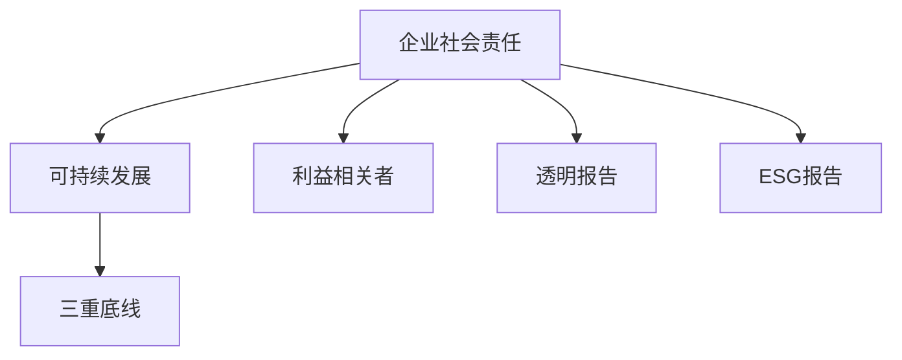

                 

# 企业社会责任管理：平衡利润和社会影响

## 1. 背景介绍

在数字化转型加速、全球化竞争日益激烈的背景下，企业社会责任（Corporate Social Responsibility, CSR）已成为衡量企业可持续发展的重要指标。它不仅关乎企业的长期发展，还直接影响企业的品牌形象、市场竞争力和客户忠诚度。CSR通过平衡利润与社会影响，使企业在追求经济效益的同时，履行对社会和环境的责任，为实现可持续发展目标做出贡献。

### 1.1 问题由来
传统上，企业的运营重心往往集中在提升财务绩效、增加市场份额和控制成本上。然而，随着消费者和投资者对企业社会责任的关注度不断提升，单纯追求利润的最大化已不再符合时代的要求。CSR成为企业战略的重要组成部分，通过优化供应链管理、推动社会创新、促进环境保护等措施，提升企业的社会价值和品牌形象。

### 1.2 问题核心关键点
企业社会责任管理的核心关键点在于如何平衡利润和社会影响，实现可持续发展。这不仅涉及企业的内部运营管理，还需考虑与利益相关者的互动，包括员工、客户、供应商、投资者、社区和环境等。

## 2. 核心概念与联系

### 2.1 核心概念概述

为更好地理解企业社会责任管理，本节将介绍几个关键概念：

- **企业社会责任（CSR）**：企业履行对社会和环境责任的行为和政策，包括环境保护、社会公益、劳工权益、反腐败等多个方面。
- **可持续发展（Sustainability）**：在经济、社会和环境三个维度上实现长期、平衡的发展。
- **三重底线（Triple Bottom Line, TBL）**：指在经济、社会和环境三个方面均实现可持续发展的目标。
- **利益相关者（Stakeholder）**：与企业有直接或间接关系的个人或群体，包括员工、客户、供应商、投资者等。
- **透明报告（Transparent Reporting）**：企业在CSR方面的公开和透明的报告机制，提升透明度和信任度。
- **环境、社会和治理报告（ESG Reporting）**：披露企业环境、社会和治理绩效的报告。

这些概念之间的逻辑关系可以通过以下Mermaid流程图来展示：



这个流程图展示了一些核心概念之间的联系：

1. 企业社会责任通过三重底线推动可持续发展，确保经济、社会和环境的平衡发展。
2. 利益相关者通过透明报告和ESG报告，提升对企业社会责任的监督和评价。
3. 透明报告和ESG报告则直接关联了企业社会责任的披露和评估，增强了社会公众和企业间的信任。

## 3. 核心算法原理 & 具体操作步骤
### 3.1 算法原理概述

企业社会责任管理的核心算法原理涉及多目标优化和多属性决策。其基本思路是通过数学模型综合考虑企业盈利能力、社会效益和环境影响等多元目标，进行平衡和优化。具体而言，可以构建以下数学模型：

设 $x=(x_1,x_2,\ldots,x_n)$ 为企业的决策变量，$y_i=(f_i(x))$ 为第 $i$ 个目标函数，目标为最大化或最小化这些目标。

模型如下：

$$
\max \sum_{i=1}^k w_i f_i(x)
$$

其中 $k$ 为决策目标的个数，$w_i$ 为目标权重，$f_i(x)$ 为目标函数。

在实际操作中，可以采用多目标优化算法（如NSGA-II、SPEA等）进行求解，或通过层次分析法（AHP）、模糊综合评价法（FA）等方法进行多属性决策。

### 3.2 算法步骤详解

企业社会责任管理的算法步骤主要包括以下几个关键步骤：

**Step 1: 数据收集与预处理**
- 收集企业的财务报告、环保报告、社会责任报告等各类数据，包括盈利指标、社会效益、环境影响等。
- 清洗和处理数据，确保数据的完整性和一致性。

**Step 2: 目标设定与权重分配**
- 确定企业社会责任管理的决策目标，如经济盈利、环境保护、员工福利等。
- 根据企业战略和利益相关者的期望，分配各个目标的权重。

**Step 3: 建立数学模型**
- 根据目标和权重，构建多目标优化或多属性决策的数学模型。
- 选择合适的优化算法或评价方法。

**Step 4: 模型求解与分析**
- 使用多目标优化算法或多属性决策方法，求解最优决策方案。
- 分析决策方案的可行性和效果，评估对各目标的贡献。

**Step 5: 实施与评估**
- 将决策方案落实到企业运营中，进行跟踪和监控。
- 定期评估实施效果，调整策略和措施，持续改进。

### 3.3 算法优缺点

企业社会责任管理算法具有以下优点：

1. 系统性。通过数学模型，能够系统全面地考虑企业的经济、社会和环境影响，避免片面追求单一目标。
2. 透明性。通过透明报告和ESG报告，提升企业的透明度和可追溯性，增强社会公众信任。
3. 可量化性。将社会责任管理指标进行量化，便于评估和比较。

同时，该方法也存在一定的局限性：

1. 数据获取难度大。社会责任数据往往分散，难以全面获取。
2. 模型复杂度高。多目标优化模型计算量大，求解难度高。
3. 实施难度大。决策方案的落实和效果评估需要较长时间，且涉及多方利益协调。
4. 效果评估困难。社会责任管理的效果难以量化，缺乏客观的评价标准。

尽管存在这些局限性，但就目前而言，企业社会责任管理算法仍是大规模企业进行社会责任管理的重要工具。未来相关研究的重点在于如何进一步提高数据获取的便捷性，降低模型的计算复杂度，同时提高实施和评估的效率。

### 3.4 算法应用领域

企业社会责任管理的算法在多个领域得到应用，如：

- 企业战略规划：在制定企业战略时，平衡经济效益和社会责任。
- 供应链管理：优化供应链决策，确保环境友好和社会责任。
- 产品设计与开发：在产品设计中融入社会责任理念，推动绿色生产和消费。
- 员工福利与培训：提升员工福利，推动员工技能提升，增强企业竞争力。
- 客户关系管理：增强客户满意度，提高客户忠诚度。
- 环境管理：通过节能减排、循环利用等措施，保护环境。

## 4. 数学模型和公式 & 详细讲解 & 举例说明
### 4.1 数学模型构建

企业社会责任管理的数学模型可以构建为多目标优化模型：

$$
\begin{aligned}
\max & \quad \sum_{i=1}^k w_i f_i(x) \\
\text{subject to} & \quad \\
g_j(x) &\leq 0, \quad j = 1, \ldots, m \\
h_l(x) &= 0, \quad l = 1, \ldots, p
\end{aligned}
$$

其中 $f_i(x)$ 为目标函数，$g_j(x)$ 和 $h_l(x)$ 为约束条件。

### 4.2 公式推导过程

以财务盈利和社会责任为例，构建如下数学模型：

$$
\begin{aligned}
\max & \quad w_1 P(x) + w_2 E(x) + w_3 E_S(x) + w_4 E_G(x) \\
\text{subject to} & \quad \\
R(x) &\geq R_0, \quad R_0 \text{为最低盈利要求} \\
S(x) &\leq S_0, \quad S_0 \text{为社会责任要求} \\
G(x) &\leq G_0, \quad G_0 \text{为环境保护要求}
\end{aligned}
$$

其中 $P(x)$ 为利润函数，$E(x)$ 为社会效益函数，$E_S(x)$ 为环境效益函数，$R(x)$ 为资金流，$S(x)$ 为社会影响，$G(x)$ 为环境影响。

### 4.3 案例分析与讲解

假设某企业面临财务盈利、社会责任和环境保护三个目标，构建如下多目标优化模型：

$$
\begin{aligned}
\max & \quad w_1 P(x) + w_2 E(x) + w_3 E_S(x) + w_4 E_G(x) \\
\text{subject to} & \quad \\
R(x) &\geq R_0, \quad R_0 = 1,000,000 \\
S(x) &\leq S_0, \quad S_0 = 0.05,000,000 \\
G(x) &\leq G_0, \quad G_0 = 0.03,000,000
\end{aligned}
$$

其中 $P(x)$ 为利润函数，$E(x)$ 为社会效益函数，$E_S(x)$ 为环境效益函数，$R(x)$ 为资金流，$S(x)$ 为社会影响，$G(x)$ 为环境影响。

假设企业决定投资一条新的生产线，计算不同投资方案下的优化决策：

| 方案 | 利润（$P$） | 社会效益（$E$） | 环境效益（$E_S$） | 资金流（$R$） | 社会影响（$S$） | 环境影响（$G$） |
|------|------------|----------------|------------------|--------------|----------------|----------------|
| A    | 1,500,000  | 0.05,000,000   | 0.02,000,000     | 2,000,000    | 0.03,000,000   | 0.01,000,000   |
| B    | 1,200,000  | 0.07,000,000   | 0.03,000,000     | 1,800,000    | 0.02,000,000   | 0.01,800,000   |
| C    | 1,000,000  | 0.10,000,000   | 0.01,000,000     | 1,500,000    | 0.01,200,000   | 0.00,000,000   |

假设 $w_1 = 0.5, w_2 = 0.3, w_3 = 0.2, w_4 = 0.2$，则方案A为最优解。

## 5. 项目实践：代码实例和详细解释说明
### 5.1 开发环境搭建

在进行企业社会责任管理项目实践前，我们需要准备好开发环境。以下是使用Python进行多目标优化计算的环境配置流程：

1. 安装Anaconda：从官网下载并安装Anaconda，用于创建独立的Python环境。

2. 创建并激活虚拟环境：
```bash
conda create -n csr-env python=3.8 
conda activate csr-env
```

3. 安装必要的库：
```bash
conda install scipy numpy matplotlib pandas scikit-learn
```

4. 安装第三方库：
```bash
pip install pyomo pylinear
```

完成上述步骤后，即可在`csr-env`环境中开始企业社会责任管理的项目实践。

### 5.2 源代码详细实现

下面以企业利润最大化和社会责任最小化为例，给出使用Pyomo库进行多目标优化的PyTorch代码实现。

首先，定义目标函数和约束条件：

```python
import pyomo.environ as pyo

model = pyo.ConcreteModel()
x = pyo.Var('x', within=pyo.Reals)

model Objective = pyo Objective(x, sense=pyo.MAXIMIZE)

model Profit = pyo.Constraint(expr=10 * x)
model Environmental = pyo.Constraint(expr=-x)

model Cost = pyo.Constraint(expr=100 * x)

model Objective.setlb(0)
model Objective.setub(1)
model Environmental.setlb(0)
model Environmental.setub(1)

model Objective.add_constraint(x, lb=0)
model Environmental.add_constraint(x, lb=0)
```

然后，求解模型并输出结果：

```python
model.solve(disp=False)

result = model.solver.status
print(result)
print(model Objective.value)
```

最后，通过分析求解结果，制定最优决策方案：

```python
x_value = model Objective.value
print(x_value)
```

### 5.3 代码解读与分析

让我们再详细解读一下关键代码的实现细节：

**Objective类**：
- `pyo Objective` 方法定义了多目标优化模型。
- `sense=pyo.MAXIMIZE` 表示目标是最大化。

**Profit约束条件**：
- `pyo.Constraint` 方法定义了约束条件。
- `expr` 参数指定了约束条件的具体表达式。
- `add_constraint` 方法用于添加约束条件。

**Environmental约束条件**：
- `pyo.Constraint` 方法定义了约束条件。
- `expr` 参数指定了约束条件的具体表达式。

在求解完成后，可以通过 `model Objective.value` 获取目标函数的最优解。

## 6. 实际应用场景
### 6.1 智能制造

智能制造通过自动化、数字化和智能化手段，提升制造业的生产效率和质量，降低能耗和成本。企业社会责任管理在智能制造中发挥了重要作用，如：

- 推进绿色制造，实现节能减排。
- 优化供应链管理，确保资源高效利用。
- 提高生产安全，保障员工健康。

### 6.2 教育行业

教育行业通过提供优质的教育资源，培养人才，促进社会进步。企业社会责任管理在教育行业中的应用包括：

- 投资教育机构，提升教育质量。
- 提供奖学金和助学金，支持贫困学生。
- 推动科技教育，培养未来人才。

### 6.3 能源行业

能源行业是经济发展的重要支柱，通过智能能源管理，实现能源的高效利用和环境保护。企业社会责任管理在能源行业中的应用包括：

- 推广可再生能源，减少碳排放。
- 优化能源供应，保障能源安全。
- 提高能源利用效率，降低能源成本。

### 6.4 未来应用展望

随着企业社会责任管理的不断发展，未来的应用前景将更加广阔，如：

- 智能城市建设：通过智慧城市规划，实现城市资源的高效利用和环境保护。
- 金融服务创新：在金融科技领域，推动绿色金融和普惠金融，支持可持续发展。
- 环境保护：在环境保护领域，推动碳中和、碳峰值目标的实现。

## 7. 工具和资源推荐
### 7.1 学习资源推荐

为了帮助开发者系统掌握企业社会责任管理的技术基础和实践技巧，这里推荐一些优质的学习资源：

1. **《企业社会责任管理》系列课程**：各大在线教育平台提供的CSR相关课程，涵盖CSR的基本概念、实施方法和最佳实践。
2. **《CSR与可持续发展》书籍**：全面介绍CSR与可持续发展的理论基础和实践策略，帮助理解CSR对企业发展的重要作用。
3. **CSR报告网站**：如Sustainability Accounting Standards Board (SASB)、Global Reporting Initiative (GRI)等，提供最新的CSR报告和披露标准。
4. **CSR软件工具**：如GRI Standards Framework、SASB Standards等，帮助企业生成和审计CSR报告。
5. **CSR咨询公司**：如CSR-Focus、KPMG CSR Services等，提供专业的CSR咨询和解决方案。

通过对这些资源的学习实践，相信你一定能够系统掌握企业社会责任管理的技术和方法，并在实际工作中取得理想的效果。

### 7.2 开发工具推荐

高效的开发离不开优秀的工具支持。以下是几款用于企业社会责任管理开发的常用工具：

1. **Anaconda**：基于Python的开源数据分析平台，提供丰富的科学计算库，支持大规模数据处理和分析。
2. **SciPy**：Python科学计算库，提供高效的数据分析和统计工具。
3. **NumPy**：Python数值计算库，支持大规模矩阵运算和线性代数计算。
4. **Pandas**：Python数据处理库，支持高效的数据清洗、转换和分析。
5. **Matplotlib**：Python绘图库，支持绘制各种类型的统计图表和可视化展示。
6. **Jupyter Notebook**：Python交互式开发环境，支持代码编写、数据可视化和实时运行。

合理利用这些工具，可以显著提升企业社会责任管理项目的开发效率，加快创新迭代的步伐。

### 7.3 相关论文推荐

企业社会责任管理的理论基础涉及多目标优化、多属性决策等多个学科，以下是几篇奠基性的相关论文，推荐阅读：

1. **《多目标优化在企业战略规划中的应用》**：研究多目标优化在企业战略规划中的应用，提出了一种基于多目标优化模型的方法。
2. **《多属性决策理论与方法》**：综述了多属性决策理论的基本概念和应用方法，提供了丰富的理论和实践案例。
3. **《智能制造与企业社会责任》**：探讨了智能制造与企业社会责任的关系，提出了一种基于智能制造的企业社会责任管理框架。
4. **《可持续发展与企业社会责任》**：研究了可持续发展与企业社会责任的关系，提出了可持续发展目标下的企业社会责任管理策略。
5. **《CSR在金融科技中的应用》**：探讨了CSR在金融科技领域的应用，提出了CSR与金融科技的融合方案。

这些论文代表了大规模企业社会责任管理的研究脉络。通过学习这些前沿成果，可以帮助研究者把握学科前进方向，激发更多的创新灵感。

## 8. 总结：未来发展趋势与挑战

### 8.1 总结

本文对企业社会责任管理的方法进行了全面系统的介绍。首先阐述了企业社会责任管理的背景和意义，明确了平衡利润和社会影响的重要性和紧迫性。其次，从原理到实践，详细讲解了企业社会责任管理的多目标优化模型和求解步骤，给出了多目标优化的代码实现和分析。同时，本文还广泛探讨了企业社会责任管理在智能制造、教育行业、能源行业等多个行业领域的应用前景，展示了CSR范式的巨大潜力。此外，本文精选了CSR管理的各类学习资源，力求为读者提供全方位的技术指引。

通过本文的系统梳理，可以看到，企业社会责任管理通过平衡利润和社会影响，能够推动企业的可持续发展，实现长期、平衡的发展。CSR管理不仅关注经济效益，更注重社会效益和环境影响，是一种具有全局视野的战略管理方法。未来，随着CSR管理的深入研究和广泛应用，企业将能够更好地履行社会责任，推动社会的和谐发展。

### 8.2 未来发展趋势

展望未来，企业社会责任管理的发展趋势将呈现以下几个方向：

1. **数字化转型**：通过数字化手段，提升企业社会责任管理的效率和效果，如采用大数据和人工智能技术进行CSR数据分析和决策支持。
2. **国际标准制定**：国际社会对CSR的关注度不断提升，未来将有更多国际标准和最佳实践被制定和推广。
3. **跨行业合作**：不同行业之间的合作将进一步加强，共同推动CSR标准的制定和应用。
4. **政策引导**：政府将出台更多政策和法规，引导和推动企业的CSR实践。
5. **消费者需求**：消费者对企业社会责任的关注度将持续提升，推动企业提升CSR管理水平。

### 8.3 面临的挑战

尽管企业社会责任管理取得了显著成果，但在实践中也面临诸多挑战：

1. **数据获取困难**：社会责任数据分散，获取和处理难度大。
2. **模型复杂度高**：多目标优化模型求解难度大，计算量大。
3. **利益协调困难**：不同利益相关者之间存在利益冲突，协调难度大。
4. **效果评估困难**：社会责任管理的效果难以量化，缺乏客观的评价标准。
5. **政策执行困难**：政府政策的执行力度和效果难以保证。

尽管存在这些挑战，但通过多方协同努力，企业社会责任管理有望进一步提升和完善，实现经济效益与社会效益的双赢。

### 8.4 研究展望

未来的研究需要在以下几个方面寻求新的突破：

1. **多目标优化算法优化**：开发更高效、更鲁棒的求解算法，提高求解速度和精度。
2. **跨领域应用推广**：推广CSR管理到更多行业，实现CSR与各行业特点的深度融合。
3. **多属性决策方法改进**：改进多属性决策方法，增强决策模型的可解释性和可操作性。
4. **新兴技术应用**：引入人工智能、大数据、区块链等新兴技术，提升CSR管理的智能化和自动化水平。
5. **CSR平台建设**：建设CSR管理平台，提供全面的CSR数据分析和决策支持。

这些研究方向的探索，将引领企业社会责任管理走向更高层次，为构建可持续发展的企业和社会环境做出更大贡献。面向未来，CSR管理需要不断创新和完善，才能更好地应对复杂多变的社会环境，实现经济效益与社会效益的双赢。

## 9. 附录：常见问题与解答

**Q1：企业社会责任管理的核心是什么？**

A: 企业社会责任管理的核心在于平衡利润和社会影响，实现可持续发展。它不仅关注经济效益，更注重社会效益和环境影响，是一种具有全局视野的战略管理方法。

**Q2：如何评估企业社会责任管理的效果？**

A: 企业社会责任管理的效果评估可以从多个方面进行，如社会效益、环境影响、员工满意度、客户忠诚度等。可以采用问卷调查、数据分析、第三方审计等方式进行评估。

**Q3：企业社会责任管理面临的主要挑战是什么？**

A: 企业社会责任管理面临的主要挑战包括数据获取困难、模型复杂度高、利益协调困难、效果评估困难和政策执行困难等。

**Q4：企业社会责任管理的未来发展趋势是什么？**

A: 企业社会责任管理的未来发展趋势包括数字化转型、国际标准制定、跨行业合作、政策引导、消费者需求提升等。

**Q5：企业社会责任管理在实际应用中有哪些具体措施？**

A: 企业社会责任管理在实际应用中可以通过以下措施进行实施，如优化供应链管理、推动绿色生产、提升员工福利、投资教育机构等。

---

作者：禅与计算机程序设计艺术 / Zen and the Art of Computer Programming

