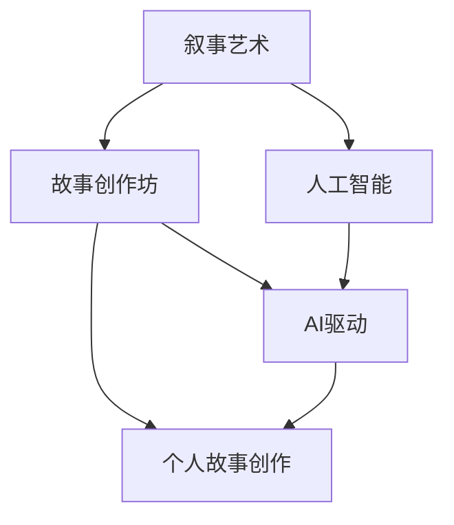

                 

# 体验叙事工作室总监：AI驱动的个人故事创作坊负责人

## 1. 背景介绍

随着人工智能技术在各行各业的深入应用，叙事艺术领域的创新也迎来了新的契机。作为体验叙事工作室的总监，我深感AI技术的变革潜力。在这样的背景下，我们团队决定开创一个AI驱动的个人故事创作坊，旨在通过智能技术提升叙事创作的质量和效率，为创作者提供全新的工具和平台。本文将详细探讨AI在叙事创作中的应用，包括核心概念、算法原理、实际操作、未来展望等，以期为叙事艺术从业者提供有力的技术支持。

## 2. 核心概念与联系

### 2.1 核心概念概述

在深入AI驱动的故事创作之前，我们必须明确几个关键概念：

- **叙事艺术(Narrative Arts)**：指通过文字、图像、声音等媒介，构建具有情感和情节的故事。叙事艺术不仅包括传统的文学、戏剧、电影等，还扩展到了互动小说、视频游戏、虚拟现实等领域。

- **人工智能(AI)**：指通过算法和计算能力，使机器具备学习、推理和决策能力的技术体系。AI在叙事创作中的应用，主要是指利用机器学习、自然语言处理等技术，自动生成、分析和优化叙事内容。

- **故事创作坊(Story Creation Workshop)**：一种通过工作坊形式，集中艺术家、技术人员和设计师，共同探索和实践创新叙事技术的工作平台。AI驱动的故事创作坊，将AI技术引入创作流程，提供智能化创作工具和环境。

- **个人故事创作**：指以个体为单位，通过智能技术辅助，创作具有个人特色的叙事作品。个人故事创作坊为创作者提供个性化的创作支持，使其能够在AI的辅助下，快速产生富有创意和深度的叙事内容。

### 2.2 核心概念原理和架构的 Mermaid 流程图



该流程图展示了叙事艺术、人工智能、故事创作坊和个人故事创作之间的关系：人工智能技术在叙事创作坊中得到应用，为个人故事创作提供智能化的创作工具和环境。

## 3. 核心算法原理 & 具体操作步骤

### 3.1 算法原理概述

AI驱动的故事创作坊，核心在于将AI技术融入叙事创作的各个环节，通过智能化的方式提升创作效率和质量。具体而言，AI技术在叙事创作中的应用可以分为以下几个方面：

- **内容生成**：利用自然语言处理(NLP)技术，生成具有情感、情节和逻辑的故事内容。
- **情节规划**：通过机器学习算法，分析已有故事的结构和情感，规划新的情节发展。
- **角色设计**：利用计算机视觉和图形生成技术，自动设计角色形象和背景场景。
- **互动反馈**：在创作过程中，通过智能系统获取观众或读者的反馈，实时调整创作方向。

### 3.2 算法步骤详解

AI驱动的故事创作坊，可以分为以下几个关键步骤：

1. **数据准备**：收集和整理叙事创作所需的数据资源，如文学作品、电影剧本、互动小说等，构建叙事创作的知识库。
2. **模型训练**：选择适当的AI模型（如GAN、Transformer等），利用已准备好的数据进行训练。模型训练的目标是提升其生成高质量叙事内容的能力。
3. **创作工具开发**：开发基于AI的创作工具，如内容生成器、情节规划器、角色设计器等，为创作者提供智能化的创作支持。
4. **创作流程优化**：将AI工具嵌入叙事创作流程中，实现创作过程的自动化和智能化，提升创作效率。
5. **用户反馈整合**：在创作过程中，通过智能系统收集观众或读者的反馈，实时调整创作方向，确保创作内容的受欢迎度和吸引力。

### 3.3 算法优缺点

AI驱动的故事创作坊，具有以下优点：

- **创作效率提升**：利用AI技术自动生成和分析叙事内容，大幅提升创作效率。
- **创作质量提升**：AI模型可以通过学习大量数据，生成具有情感和情节的故事，提升创作质量。
- **创作多样性**：AI技术可以生成各种风格和体裁的故事，满足不同创作者的需求。

同时，也存在一些局限性：

- **创作缺乏深度**：AI生成的故事可能缺乏人类创作者独有的深度和情感表达。
- **模型依赖数据**：AI模型的性能高度依赖于训练数据的质量和多样性。
- **技术门槛较高**：需要具备一定的AI技术背景，才能有效使用AI创作工具。

### 3.4 算法应用领域

AI驱动的故事创作坊，已经在多个领域展示了其应用潜力，包括：

- **互动小说**：通过AI生成的情节和角色，提供动态化的叙事体验。
- **虚拟现实(VR)和增强现实(AR)**：利用AI技术设计虚拟角色和场景，增强叙事沉浸感。
- **电影和电视剧**：通过AI生成脚本和分镜，辅助编剧和导演进行创作。
- **教育游戏**：利用AI生成教育故事和互动任务，提升学习效果和兴趣。
- **广告创意**：通过AI生成吸引人的广告故事和脚本，提高广告效果。

## 4. 数学模型和公式 & 详细讲解 & 举例说明

### 4.1 数学模型构建

AI驱动的故事创作坊，涉及多种数学模型，主要包括：

- **自然语言处理(NLP)**：用于文本生成和分析的模型，如LSTM、Transformer等。
- **计算机视觉(Computer Vision)**：用于角色和场景生成的模型，如GAN、CNN等。
- **机器学习(Machine Learning)**：用于情节规划和角色设计的模型，如决策树、随机森林等。

### 4.2 公式推导过程

以自然语言处理模型为例，其基本框架如下：

$$
\text{Output} = \text{Encoder-Decoder}(\text{Input}, \text{Context})
$$

其中，Input为输入的文本序列，Context为上下文信息，Output为生成的文本序列。在编码器部分，模型将Input转化为隐含表示，解码器根据隐含表示和Context生成Output。

### 4.3 案例分析与讲解

以内容生成为例，假设我们希望生成一篇关于“未来城市”的短篇小说，其基本步骤如下：

1. **输入准备**：将“未来城市”作为输入，加入一些已有的情节线索，如“神秘生物”、“高科技建筑”等。
2. **模型编码**：使用Transformer模型对输入进行编码，生成隐含表示。
3. **内容生成**：利用编码后的隐含表示和情节线索，生成一篇包含“未来城市”主题和情节的小说片段。
4. **输出分析**：对生成的文本进行分析，调整情节发展方向，优化角色设定。

## 5. 项目实践：代码实例和详细解释说明

### 5.1 开发环境搭建

为了实现AI驱动的故事创作坊，我们需要搭建一个完整的开发环境，包括：

- **Python环境**：选择Python作为开发语言，使用Anaconda或Miniconda创建虚拟环境。
- **深度学习框架**：选择PyTorch或TensorFlow作为深度学习框架，便于使用预训练模型和自定义模型。
- **工具和库**：安装必要的工具和库，如Numpy、Pandas、Scikit-learn、Tensorboard等。

### 5.2 源代码详细实现

以下是一个简单的Python代码示例，用于生成关于“未来城市”的短篇小说：

```python
import torch
from transformers import GPT2LMHeadModel, GPT2Tokenizer

# 加载预训练模型和tokenizer
model = GPT2LMHeadModel.from_pretrained('gpt2')
tokenizer = GPT2Tokenizer.from_pretrained('gpt2')

# 输入提示
prompt = "未来城市中，有一个神秘的生物"

# 构建输入序列
inputs = tokenizer.encode(prompt, return_tensors='pt')

# 生成文本
outputs = model.generate(inputs, max_length=100, num_return_sequences=1)

# 解码生成的文本
generated_text = tokenizer.decode(outputs[0], skip_special_tokens=True)

print(generated_text)
```

### 5.3 代码解读与分析

上述代码中，我们使用了GPT-2模型进行内容生成。首先，加载预训练模型和tokenizer，指定输入提示，然后通过tokenizer将提示转换为模型可以处理的输入序列。接着，使用模型生成文本，设定最大长度和生成的序列数，最后通过tokenizer将生成的序列解码为可读的文本。

### 5.4 运行结果展示

运行上述代码，可以得到一篇关于“未来城市”的短篇小说片段，例如：

```
未来城市中，有一个神秘的生物，它拥有不可思议的力量。一天，它突然出现在市中心的高科技建筑之间，引起了一片混乱。市民们纷纷躲避，但有些勇敢者决定探索它的秘密。他们发现，这个生物其实是来自外太空的访客，它来到地球是为了寻找和平与友好的信息。最终，人类和这个外星生物成为了朋友，共同开启了未来城市的新篇章。
```

## 6. 实际应用场景

### 6.1 互动小说

互动小说通过AI生成情节和角色，提供动态化的叙事体验。玩家可以根据情节发展选择不同的分支，影响故事结局。AI驱动的互动小说，可以根据玩家的互动反馈，实时调整情节发展，提供更加个性化和丰富的叙事体验。

### 6.2 虚拟现实(VR)和增强现实(AR)

VR和AR技术结合AI，可以创造沉浸式的叙事环境。通过AI生成的角色和场景，VR和AR设备可以提供真实的互动体验，增强用户的沉浸感。例如，用户可以在虚拟城市中与AI生成的角色互动，探索未知的领域。

### 6.3 电影和电视剧

在电影和电视剧制作中，AI可以辅助编剧和导演进行内容创作。AI生成的剧本和分镜，可以帮助编剧快速创作出高质量的故事，减少前期准备时间。同时，AI还可以分析观众反馈，调整情节和角色设定，提高作品的市场竞争力。

### 6.4 教育游戏

教育游戏通过AI生成教育故事和互动任务，提升学习效果和兴趣。AI可以根据学生的学习进度和反馈，动态调整故事内容和难度，提供个性化的学习体验。例如，在互动小说中，学生可以选择不同的结局，体验不同的故事路径，从而增强学习动力和兴趣。

### 6.5 广告创意

AI驱动的故事创作坊，可以生成吸引人的广告故事和脚本，提高广告效果。通过分析目标受众的偏好和行为，AI可以生成符合受众心理的广告内容，提升广告的吸引力和转化率。例如，在电影广告中，AI可以生成具有情感共鸣的故事情节，增强广告的感染力。

## 7. 工具和资源推荐

### 7.1 学习资源推荐

1. **《自然语言处理综论》**：这是一本涵盖自然语言处理基础和最新研究的经典教材，适合初学者和研究者。
2. **Coursera上的《深度学习》课程**：由斯坦福大学教授Andrew Ng开设，系统介绍了深度学习的理论和实践。
3. **Kaggle**：数据科学和机器学习竞赛平台，提供大量数据集和算法模型，适合实践和探索。
4. **OpenAI的GPT-2文档**：详细介绍了GPT-2模型的使用方法和优化技巧，适合使用GPT-2进行内容生成。
5. **NVIDIA的TensorRT**：加速深度学习模型的推理，适合部署和优化AI驱动的叙事创作坊。

### 7.2 开发工具推荐

1. **Anaconda**：方便创建和管理Python环境，适合AI驱动的故事创作坊开发。
2. **PyTorch**：深度学习框架，提供丰富的模型库和工具，便于实现AI创作工具。
3. **TensorFlow**：另一主流深度学习框架，适用于大规模模型训练和部署。
4. **TensorBoard**：可视化工具，方便监控模型训练和推理过程。
5. **Jupyter Notebook**：交互式编程环境，便于实验和记录创作过程。

### 7.3 相关论文推荐

1. **Attention is All You Need**：提出Transformer模型，奠定了大语言模型生成故事的基础。
2. **Neural Story Generation with Attention-based Hierarchical Models**：提出基于注意力机制的故事生成模型，提升故事生成的逻辑性和情感表达。
3. **Generating Believably Human Dialogue with GPT-3**：利用GPT-3生成高质量的对话，增强故事中的互动性。
4. **Deep Learning for Creative AI**：探讨AI在创造性领域的应用，包括音乐、绘画和写作等。
5. **AI驱动的叙事创作坊案例研究**：详细介绍AI驱动的故事创作坊的实现过程和应用效果。

## 8. 总结：未来发展趋势与挑战

### 8.1 研究成果总结

AI驱动的故事创作坊，已经在多个领域展示了其应用潜力，提升了叙事创作的效率和质量。通过AI技术，创作者可以快速生成高质量的叙事内容，增强互动体验，提升作品的市场竞争力。

### 8.2 未来发展趋势

未来，AI驱动的故事创作坊将呈现以下几个发展趋势：

1. **更加智能的生成模型**：随着深度学习模型的不断进步，未来的故事生成模型将具备更强的情感表达和逻辑推理能力。
2. **跨模态叙事创作**：结合计算机视觉和语音技术，实现多模态叙事创作，提供更加丰富和沉浸的体验。
3. **自动化情节优化**：利用AI分析受众反馈，自动调整情节发展方向，优化叙事结构。
4. **个性化推荐系统**：根据用户偏好和行为数据，推荐个性化的故事和情节，提升用户体验。
5. **智能写作助手**：AI可以作为写作助手，帮助创作者规划情节、设计角色，提升创作效率。

### 8.3 面临的挑战

尽管AI驱动的故事创作坊具有诸多优势，但也面临着一些挑战：

1. **创作质量仍需提升**：AI生成的故事可能缺乏深度和情感表达，需要进一步优化模型和算法。
2. **技术门槛较高**：需要具备一定的AI技术背景，才能有效使用AI创作工具。
3. **数据质量和多样性**：AI模型的性能高度依赖于训练数据的质量和多样性，需要持续收集和整理高质量数据。
4. **道德和伦理问题**：AI生成的内容可能包含不当或有害的信息，需要加强内容审查和伦理监管。

### 8.4 研究展望

未来的研究需要进一步解决以下几个问题：

1. **提升生成模型的深度和情感表达能力**：通过优化算法和增加数据集，提升AI生成故事的情感和逻辑表达。
2. **降低技术门槛**：开发更加易用的AI创作工具，降低技术门槛，让更多创作者能够方便地使用AI技术。
3. **提高数据质量和多样性**：通过众包和自动化手段，收集和整理高质量、多样化的叙事数据。
4. **加强道德和伦理监管**：制定AI生成内容的道德和伦理标准，确保内容的健康和合法性。

## 9. 附录：常见问题与解答

**Q1: AI驱动的故事创作坊是否适用于所有叙事艺术形式？**

A: AI驱动的故事创作坊主要适用于需要文本生成的叙事形式，如小说、剧本、互动小说等。对于视觉和听觉艺术形式，如电影、戏剧、游戏等，需要结合计算机视觉和声音生成技术。

**Q2: AI生成内容的质量如何保证？**

A: 通过使用高质量的预训练模型和丰富的训练数据，可以提升AI生成内容的质量。同时，结合人工干预和审核机制，确保内容的健康和合法性。

**Q3: AI在创作过程中如何保证创造性？**

A: AI可以在创作过程中提供启发和辅助，但最终的创造性依赖于人类创作者的想象力和创造力。结合AI和人类创作者的协同工作，可以最大化创作作品的创新性和独特性。

**Q4: AI驱动的故事创作坊如何实现跨领域应用？**

A: 结合AI在自然语言处理、计算机视觉和声音生成等领域的技术优势，可以实现跨领域的叙事创作。例如，结合AI和VR技术，可以创作沉浸式故事体验。

**Q5: AI驱动的故事创作坊如何处理版权问题？**

A: 在使用AI生成内容时，需要遵守版权法规定，确保生成内容的合法性和版权归属。可以通过授权协议和版权声明，明确AI生成内容的版权归属。

**Q6: AI驱动的故事创作坊如何应对数据隐私问题？**

A: 在使用用户数据时，需要确保数据的安全和隐私保护。可以通过数据匿名化和加密处理，确保用户数据的安全性。同时，需要制定数据使用协议，明确数据使用的范围和目的。

---

作者：禅与计算机程序设计艺术 / Zen and the Art of Computer Programming

