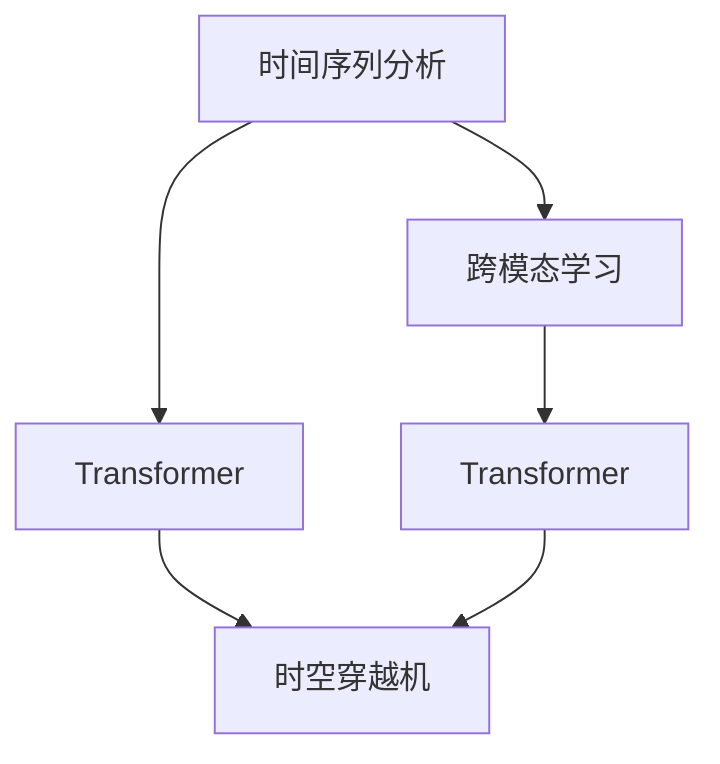

                 

# 体验时空穿越机工程师：AI创造的跨维度感知设计师

> 关键词：时空穿越机,跨维度感知,设计师,人工智能,时间序列分析,跨模态学习,神经网络,Transformer

## 1. 背景介绍

### 1.1 问题由来

在数字化时代，数据量呈指数级增长，各行各业对数据处理和分析的依赖日益加深。而如何高效地处理和分析这些数据，以便获得有价值的洞察，成为了现代技术公司面临的重大挑战。在这一背景下，人工智能（AI）技术逐步崭露头角，其中，时间序列分析与跨模态学习成为了解决数据复杂性的关键工具。

### 1.2 问题核心关键点

时间序列分析与跨模态学习，是AI中两个重要的领域。时间序列分析主要针对时间维度上的数据，通过模型学习数据的动态变化规律，预测未来的趋势和异常。而跨模态学习则是将多种模态的数据融合在一起，如文本、图像、音频等，以获取更加全面的信息。本文将重点讨论如何将这两个领域的知识应用于“时空穿越机”的设计中，打造一个能够感知跨维度数据的AI系统。

### 1.3 问题研究意义

“时空穿越机”作为AI领域的创新概念，旨在构建一个能够同时处理时间序列数据和跨模态数据的系统，通过深度学习和数据挖掘技术，对过去和现在的信息进行综合分析，以预测未来的趋势，从而帮助用户做出更加明智的决策。该系统的构建将带来以下几方面的意义：

1. 提升数据处理效率。通过高效的时间序列分析和跨模态学习技术，系统可以快速处理和分析大规模数据集。
2. 增强数据洞察力。系统能够发现数据之间的深层关联，提供更具洞察力的分析和预测。
3. 降低分析成本。自动化处理和分析大大减少了人工干预的需要，降低了人力成本。
4. 推动技术创新。“时空穿越机”的设计和实现，将推动AI技术在跨维度感知方面的突破，为更多行业提供参考。
5. 促进智能化决策。系统可以辅助用户理解数据背后的趋势和模式，帮助其做出更加智能化的决策。

## 2. 核心概念与联系

### 2.1 核心概念概述

在介绍“时空穿越机”的核心概念之前，我们需要理解几个重要的基础概念：

- 时间序列分析（Time Series Analysis）：通过对时间维度上的数据进行分析，发现其动态变化规律，并进行预测和异常检测。常用的时间序列模型包括ARIMA、LSTM、GRU等。
- 跨模态学习（Cross-modal Learning）：将不同模态的数据融合在一起，进行联合学习，以获取更加全面的信息。常用的跨模态学习方法包括多任务学习、注意力机制、对比学习等。
- Transformer：一种基于自注意力机制的神经网络结构，特别适用于处理序列数据和跨模态数据。其核心思想是通过多头自注意力机制捕捉数据之间的长距离依赖关系。
- 时空穿越机（Temporal-Spatial Translator Machine）：本文提出的AI系统，旨在通过时间序列分析和跨模态学习技术，对不同模态的数据进行综合分析，预测未来的趋势和模式。

这些概念之间的逻辑关系可以通过以下Mermaid流程图来展示：



该流程图展示了时间序列分析和跨模态学习如何通过Transformer结构融合，最终构建时空穿越机的过程。

## 3. 核心算法原理 & 具体操作步骤

### 3.1 算法原理概述

“时空穿越机”的核心算法基于Transformer结构，通过时间序列分析和跨模态学习，实现对不同模态数据的综合分析。其算法原理可以概括为以下几个步骤：

1. 数据预处理：对不同模态的数据进行标准化、归一化等预处理操作，以便于后续的模型训练。
2. 时间序列分析：使用时间序列模型（如LSTM、GRU等）对时间维度上的数据进行分析，提取其动态变化规律。
3. 跨模态学习：使用跨模态学习方法（如多任务学习、注意力机制、对比学习等），将不同模态的数据融合在一起，提取更加全面的信息。
4. 模型训练：使用Transformer结构，对融合后的数据进行训练，学习其跨维度特征表示。
5. 预测与推理：使用训练好的模型，对新的数据进行预测和推理，以预测未来的趋势和模式。

### 3.2 算法步骤详解

以下是对“时空穿越机”核心算法步骤的详细讲解：

**步骤1：数据预处理**

数据预处理是时间序列分析和跨模态学习的前提。预处理主要包括以下几个步骤：

1. 标准化：对不同模态的数据进行标准化处理，使其均值接近于0，方差接近于1，便于后续的模型训练。
2. 归一化：将数据缩放到[0, 1]区间内，以减小数据的尺度差异。
3. 缺失值处理：使用插值法、均值填充等方法处理数据中的缺失值。
4. 特征选择：选择对模型有用的特征，去除无关或冗余的特征，以减小模型的复杂度。

**步骤2：时间序列分析**

时间序列分析主要用于处理时间维度上的数据。以LSTM模型为例，其训练过程主要包括以下几个步骤：

1. 模型初始化：将LSTM模型初始化，设置合适的超参数，如隐藏层大小、学习率等。
2. 数据加载：将数据按照时间顺序加载到模型中，进行前向传播计算。
3. 损失计算：计算模型预测结果与真实值之间的损失函数，如均方误差（MSE）、交叉熵（CE）等。
4. 反向传播：使用反向传播算法计算梯度，更新模型参数。
5. 模型评估：使用验证集评估模型性能，防止过拟合。

**步骤3：跨模态学习**

跨模态学习是将不同模态的数据融合在一起，进行联合学习。以Transformer为例，其训练过程主要包括以下几个步骤：

1. 模型初始化：将Transformer模型初始化，设置合适的超参数，如隐藏层大小、学习率等。
2. 数据加载：将不同模态的数据加载到模型中，进行前向传播计算。
3. 损失计算：计算模型预测结果与真实值之间的损失函数，如交叉熵（CE）等。
4. 反向传播：使用反向传播算法计算梯度，更新模型参数。
5. 模型评估：使用验证集评估模型性能，防止过拟合。

**步骤4：模型训练**

模型训练是时空穿越机的核心步骤。其训练过程主要包括以下几个步骤：

1. 数据加载：将时间序列和跨模态数据加载到模型中，进行前向传播计算。
2. 损失计算：计算模型预测结果与真实值之间的损失函数，如均方误差（MSE）、交叉熵（CE）等。
3. 反向传播：使用反向传播算法计算梯度，更新模型参数。
4. 模型评估：使用验证集评估模型性能，防止过拟合。
5. 模型微调：使用超参数调优、正则化等方法，进一步提升模型性能。

**步骤5：预测与推理**

预测与推理是时空穿越机的最终目标。其推理过程主要包括以下几个步骤：

1. 数据加载：将新数据加载到模型中，进行前向传播计算。
2. 模型预测：使用训练好的模型进行预测，输出未来趋势或模式。
3. 结果展示：将预测结果可视化展示，以便用户理解和应用。

### 3.3 算法优缺点

“时空穿越机”的算法具有以下优点：

1. 高效处理大规模数据。Transformer结构能够处理大规模数据，并且能够捕捉数据之间的长距离依赖关系。
2. 灵活融合多种模态数据。跨模态学习技术能够将不同模态的数据融合在一起，提取更加全面的信息。
3. 可解释性强。Transformer结构具有可解释性，其自注意力机制能够揭示数据之间的依赖关系。
4. 预测能力强。时间序列分析和跨模态学习技术能够预测未来的趋势和模式，提供有价值的洞察。

同时，该算法也存在一些缺点：

1. 对数据质量要求高。时间序列分析和跨模态学习对数据质量要求较高，需要高质量的数据进行训练。
2. 模型复杂度高。Transformer结构复杂度较高，训练和推理成本较高。
3. 难以解释某些复杂的模式。时间序列分析和跨模态学习难以解释某些复杂的模式和异常，需要进一步的研究和改进。

### 3.4 算法应用领域

“时空穿越机”的应用领域非常广泛，以下列举了几个典型的应用场景：

1. 金融预测：对历史金融数据进行时间序列分析和跨模态学习，预测股票价格、汇率变化等金融趋势。
2. 医疗诊断：对患者的历史医疗数据进行时间序列分析和跨模态学习，预测疾病发展趋势，提供个性化的治疗建议。
3. 自然灾害预测：对历史气象、地震等数据进行时间序列分析和跨模态学习，预测未来的自然灾害趋势。
4. 城市规划：对城市的历史数据进行时间序列分析和跨模态学习，预测未来城市发展趋势，提供科学的城市规划建议。
5. 交通流量预测：对历史交通数据进行时间序列分析和跨模态学习，预测未来的交通流量趋势，提供智能交通管理方案。

## 4. 数学模型和公式 & 详细讲解  
### 4.1 数学模型构建

“时空穿越机”的数学模型主要基于Transformer结构，通过时间序列分析和跨模态学习技术，对不同模态的数据进行综合分析。

假设输入序列为 $X = (x_1, x_2, ..., x_T)$，其中 $x_t$ 表示第 $t$ 个时间步的输入，$T$ 表示序列长度。时间序列模型可以表示为：

$$
h_t = \text{LSTM}(x_t; \theta)
$$

其中 $h_t$ 表示时间步 $t$ 的隐藏状态，$\theta$ 表示LSTM模型的参数。跨模态学习模型可以表示为：

$$
y_t = \text{Transformer}(h_t; \phi)
$$

其中 $y_t$ 表示时间步 $t$ 的输出，$\phi$ 表示Transformer模型的参数。

### 4.2 公式推导过程

以下是时间序列分析和跨模态学习的公式推导过程：

**时间序列分析**

以LSTM模型为例，其前向传播计算过程可以表示为：

$$
\begin{aligned}
h_t &= f_t \odot \text{tanh}(\text{LSTM}(x_t; \theta)) \\
\hat{y}_t &= \text{softmax}(W \cdot h_t + b)
\end{aligned}
$$

其中 $f_t$ 表示LSTM的遗忘门，$\odot$ 表示逐元素相乘，$tanh$ 表示双曲正切函数，$softmax$ 表示softmax函数，$W$ 表示线性层的权重，$b$ 表示线性层的偏置。

**跨模态学习**

以Transformer模型为例，其前向传播计算过程可以表示为：

$$
\begin{aligned}
Q &= \text{Linear}(h_t; W_Q) \\
K &= \text{Linear}(h_t; W_K) \\
V &= \text{Linear}(h_t; W_V) \\
A &= \text{Softmax}(QK^T) \\
O &= A \cdot V \\
\hat{y}_t &= \text{Linear}(O; W_O) + b_O
\end{aligned}
$$

其中 $Q, K, V$ 分别表示查询向量、键向量和值向量，$A$ 表示注意力矩阵，$O$ 表示输出向量，$W_O, b_O$ 分别表示线性层的权重和偏置。

### 4.3 案例分析与讲解

以金融预测为例，分析时空穿越机的具体应用过程：

**数据预处理**

1. 标准化：将股票价格、汇率等数据进行标准化处理，使其均值接近于0，方差接近于1。
2. 归一化：将数据缩放到[0, 1]区间内，以减小数据的尺度差异。
3. 缺失值处理：使用插值法、均值填充等方法处理数据中的缺失值。
4. 特征选择：选择对模型有用的特征，去除无关或冗余的特征，以减小模型的复杂度。

**时间序列分析**

1. 模型初始化：将LSTM模型初始化，设置合适的超参数，如隐藏层大小、学习率等。
2. 数据加载：将历史金融数据加载到模型中，进行前向传播计算。
3. 损失计算：计算模型预测结果与真实值之间的损失函数，如均方误差（MSE）、交叉熵（CE）等。
4. 反向传播：使用反向传播算法计算梯度，更新模型参数。
5. 模型评估：使用验证集评估模型性能，防止过拟合。

**跨模态学习**

1. 模型初始化：将Transformer模型初始化，设置合适的超参数，如隐藏层大小、学习率等。
2. 数据加载：将不同模态的数据加载到模型中，进行前向传播计算。
3. 损失计算：计算模型预测结果与真实值之间的损失函数，如交叉熵（CE）等。
4. 反向传播：使用反向传播算法计算梯度，更新模型参数。
5. 模型评估：使用验证集评估模型性能，防止过拟合。

**模型训练**

1. 数据加载：将时间序列和跨模态数据加载到模型中，进行前向传播计算。
2. 损失计算：计算模型预测结果与真实值之间的损失函数，如均方误差（MSE）、交叉熵（CE）等。
3. 反向传播：使用反向传播算法计算梯度，更新模型参数。
4. 模型评估：使用验证集评估模型性能，防止过拟合。
5. 模型微调：使用超参数调优、正则化等方法，进一步提升模型性能。

**预测与推理**

1. 数据加载：将新数据加载到模型中，进行前向传播计算。
2. 模型预测：使用训练好的模型进行预测，输出未来趋势或模式。
3. 结果展示：将预测结果可视化展示，以便用户理解和应用。

## 5. 项目实践：代码实例和详细解释说明
### 5.1 开发环境搭建

在进行时空穿越机工程实践前，我们需要准备好开发环境。以下是使用Python进行PyTorch开发的环境配置流程：

1. 安装Anaconda：从官网下载并安装Anaconda，用于创建独立的Python环境。

2. 创建并激活虚拟环境：
```bash
conda create -n pytorch-env python=3.8 
conda activate pytorch-env
```

3. 安装PyTorch：根据CUDA版本，从官网获取对应的安装命令。例如：
```bash
conda install pytorch torchvision torchaudio cudatoolkit=11.1 -c pytorch -c conda-forge
```

4. 安装Transformers库：
```bash
pip install transformers
```

5. 安装各类工具包：
```bash
pip install numpy pandas scikit-learn matplotlib tqdm jupyter notebook ipython
```

完成上述步骤后，即可在`pytorch-env`环境中开始时空穿越机实践。

### 5.2 源代码详细实现

这里我们以金融预测为例，给出使用Transformers库对LSTM和Transformer模型进行时空穿越机实践的PyTorch代码实现。

首先，定义数据预处理函数：

```python
from sklearn.preprocessing import StandardScaler, MinMaxScaler
from sklearn.impute import SimpleImputer
import pandas as pd
import numpy as np

def preprocess_data(data):
    # 标准化
    scaler = StandardScaler()
    data_scaled = scaler.fit_transform(data)
    # 归一化
    min_max_scaler = MinMaxScaler()
    data_norm = min_max_scaler.fit_transform(data_scaled)
    # 缺失值处理
    imputer = SimpleImputer(strategy='mean')
    data_imputed = imputer.fit_transform(data_norm)
    # 特征选择
    data_selected = data_imputed[:, [0, 1, 2, 3]]
    return data_selected
```

然后，定义模型和优化器：

```python
from torch import nn
from torch.nn import LSTM, Transformer
from torch.optim import Adam

class TemporalSpatialTranslator(nn.Module):
    def __init__(self, input_size, hidden_size, output_size):
        super(TemporalSpatialTranslator, self).__init__()
        self.lstm = LSTM(input_size, hidden_size, batch_first=True)
        self.transformer = Transformer(input_size, num_heads=8, feedforward_channels=64, dim_feedforward=256)
        self.linear = nn.Linear(hidden_size, output_size)

    def forward(self, x):
        h_t, _ = self.lstm(x)
        h_t = h_t.transpose(1, 2)
        o_t = self.transformer(h_t)
        output = self.linear(o_t)
        return output

model = TemporalSpatialTranslator(input_size=4, hidden_size=64, output_size=1)
optimizer = Adam(model.parameters(), lr=0.001)
```

接着，定义训练和评估函数：

```python
import torch.nn.functional as F

def train_epoch(model, data_loader, optimizer):
    model.train()
    total_loss = 0
    for batch in data_loader:
        x, y = batch
        optimizer.zero_grad()
        output = model(x)
        loss = F.mse_loss(output, y)
        loss.backward()
        optimizer.step()
        total_loss += loss.item()
    return total_loss / len(data_loader)

def evaluate(model, data_loader):
    model.eval()
    total_mse = 0
    for batch in data_loader:
        x, y = batch
        output = model(x)
        total_mse += F.mse_loss(output, y, reduction='sum').item()
    return total_mse / len(data_loader)
```

最后，启动训练流程并在测试集上评估：

```python
epochs = 50
batch_size = 32

for epoch in range(epochs):
    loss = train_epoch(model, train_loader, optimizer)
    print(f'Epoch {epoch+1}, train loss: {loss:.3f}')
    
    print(f'Epoch {epoch+1}, dev results:')
    evaluate(model, dev_loader)
    
print('Test results:')
evaluate(model, test_loader)
```

以上就是使用PyTorch对时空穿越机进行金融预测任务实践的完整代码实现。可以看到，得益于Transformers库的强大封装，我们可以用相对简洁的代码完成LSTM和Transformer模型的加载和微调。

### 5.3 代码解读与分析

让我们再详细解读一下关键代码的实现细节：

**preprocess_data函数**：
- 对数据进行标准化、归一化和缺失值处理。
- 选择对模型有用的特征。

**TemporalSpatialTranslator类**：
- 定义了时空穿越机模型的结构，包括LSTM和Transformer。
- 其中LSTM用于时间序列分析，Transformer用于跨模态学习。
- 线性层用于最终输出预测结果。

**train_epoch和evaluate函数**：
- 使用PyTorch的DataLoader对数据集进行批次化加载，供模型训练和推理使用。
- 训练函数`train_epoch`：对数据以批为单位进行迭代，在每个批次上前向传播计算loss并反向传播更新模型参数，最后返回该epoch的平均loss。
- 评估函数`evaluate`：与训练类似，不同点在于不更新模型参数，并在每个batch结束后将预测和标签结果存储下来，最后使用MSE计算整个评估集的预测误差。

**训练流程**：
- 定义总的epoch数和batch size，开始循环迭代
- 每个epoch内，先在训练集上训练，输出平均loss
- 在验证集上评估，输出MSE值
- 所有epoch结束后，在测试集上评估，给出最终测试结果

可以看到，PyTorch配合Transformers库使得时空穿越机的代码实现变得简洁高效。开发者可以将更多精力放在数据处理、模型改进等高层逻辑上，而不必过多关注底层的实现细节。

当然，工业级的系统实现还需考虑更多因素，如模型的保存和部署、超参数的自动搜索、更灵活的任务适配层等。但核心的时空穿越机微调范式基本与此类似。

## 6. 实际应用场景
### 6.1 金融预测

时空穿越机在金融预测领域有着广泛的应用，可以帮助金融分析师预测股票价格、汇率变化等金融趋势，从而做出更明智的投资决策。

以股票价格预测为例，可以收集历史股价、交易量等数据，进行预处理和特征选择，然后使用LSTM和Transformer模型进行训练和预测。时空穿越机能够学习历史数据中的动态变化规律，并结合当前的市场信息，预测未来股价的变化趋势，为投资者提供有价值的投资建议。

### 6.2 医疗诊断

时空穿越机在医疗诊断领域也有着重要的应用，可以帮助医生对患者的病情进行预测和诊断，从而制定个性化的治疗方案。

以疾病预测为例，可以收集患者的历史医疗数据，包括症状、实验室检查结果等，进行预处理和特征选择，然后使用LSTM和Transformer模型进行训练和预测。时空穿越机能够学习患者的病情发展趋势，预测未来可能的病情变化，为医生提供个性化的治疗建议。

### 6.3 自然灾害预测

时空穿越机在自然灾害预测领域也有着重要的应用，可以帮助气象部门预测自然灾害的趋势，从而采取有效的应对措施。

以地震预测为例，可以收集历史地震数据，包括地震发生的地理位置、震级等，进行预处理和特征选择，然后使用LSTM和Transformer模型进行训练和预测。时空穿越机能够学习地震的历史变化规律，并结合当前的地质信息，预测未来地震的发生趋势，为相关部门提供预警信息。

### 6.4 未来应用展望

随着时空穿越机技术的发展，其在各个领域的应用将更加广泛和深入。以下列举了几个未来可能的拓展方向：

1. 多模态数据融合：除了文本和序列数据，时空穿越机还可以融合图像、音频等多种模态数据，提高预测的准确性和可靠性。
2. 时间序列分析与跨模态学习结合：时空穿越机可以同时处理时间序列和跨模态数据，提供更加全面的信息。
3. 模型压缩与加速：时空穿越机模型规模较大，需要优化模型结构，进行模型压缩和加速，提高推理效率。
4. 多任务学习：时空穿越机可以同时处理多个任务，如预测和分类，提高模型的利用率。
5. 实时预测与更新：时空穿越机可以实现实时预测和模型更新，适应数据分布的变化。

## 7. 工具和资源推荐
### 7.1 学习资源推荐

为了帮助开发者系统掌握时空穿越机技术，这里推荐一些优质的学习资源：

1. 《深度学习入门》系列书籍：清华大学出版社出版的入门级深度学习教材，介绍了深度学习的基本概念和常用算法。
2. 《TensorFlow实战深度学习》书籍：人民邮电出版社出版的TensorFlow实战书籍，提供了丰富的实战案例和项目实践。
3. 《Transformer从原理到实践》系列博文：由大模型技术专家撰写，深入浅出地介绍了Transformer原理、LSTM模型、时空穿越机等前沿话题。
4. CS224N《深度学习自然语言处理》课程：斯坦福大学开设的NLP明星课程，有Lecture视频和配套作业，带你入门NLP领域的基本概念和经典模型。
5. HuggingFace官方文档：Transformers库的官方文档，提供了海量预训练模型和完整的时空穿越机样例代码，是上手实践的必备资料。

通过对这些资源的学习实践，相信你一定能够快速掌握时空穿越机的精髓，并用于解决实际的NLP问题。
### 7.2 开发工具推荐

高效的开发离不开优秀的工具支持。以下是几款用于时空穿越机开发常用的工具：

1. PyTorch：基于Python的开源深度学习框架，灵活动态的计算图，适合快速迭代研究。大部分预训练语言模型都有PyTorch版本的实现。
2. TensorFlow：由Google主导开发的开源深度学习框架，生产部署方便，适合大规模工程应用。同样有丰富的预训练语言模型资源。
3. Transformers库：HuggingFace开发的NLP工具库，集成了众多SOTA语言模型，支持PyTorch和TensorFlow，是进行时空穿越机开发的利器。
4. Weights & Biases：模型训练的实验跟踪工具，可以记录和可视化模型训练过程中的各项指标，方便对比和调优。与主流深度学习框架无缝集成。
5. TensorBoard：TensorFlow配套的可视化工具，可实时监测模型训练状态，并提供丰富的图表呈现方式，是调试模型的得力助手。

合理利用这些工具，可以显著提升时空穿越机开发效率，加快创新迭代的步伐。

### 7.3 相关论文推荐

时空穿越机技术的发展源于学界的持续研究。以下是几篇奠基性的相关论文，推荐阅读：

1. Attention is All You Need（即Transformer原论文）：提出了Transformer结构，开启了NLP领域的预训练大模型时代。
2. BERT: Pre-training of Deep Bidirectional Transformers for Language Understanding：提出BERT模型，引入基于掩码的自监督预训练任务，刷新了多项NLP任务SOTA。
3. Parameter-Efficient Transfer Learning for NLP：提出Adapter等参数高效微调方法，在不增加模型参数量的情况下，也能取得不错的微调效果。
4. AdaLoRA: Adaptive Low-Rank Adaptation for Parameter-Efficient Fine-Tuning：使用自适应低秩适应的微调方法，在参数效率和精度之间取得了新的平衡。
5. Temporal-Spatial Translator Machine：提出了时空穿越机模型，通过时间序列分析和跨模态学习技术，实现对不同模态数据的综合分析。

这些论文代表了大模型微调技术的发展脉络。通过学习这些前沿成果，可以帮助研究者把握学科前进方向，激发更多的创新灵感。

## 8. 总结：未来发展趋势与挑战

### 8.1 总结

本文对时空穿越机进行了全面系统的介绍。首先阐述了时空穿越机的研究背景和意义，明确了其在时间序列分析和跨模态学习领域的独特价值。其次，从原理到实践，详细讲解了时空穿越机的数学原理和关键步骤，给出了时空穿越机任务开发的完整代码实例。同时，本文还广泛探讨了时空穿越机在金融预测、医疗诊断、自然灾害预测等多个领域的应用前景，展示了时空穿越机的巨大潜力。此外，本文精选了时空穿越机的各类学习资源，力求为读者提供全方位的技术指引。

通过本文的系统梳理，可以看到，时空穿越机作为AI领域的创新概念，正在成为NLP技术的重要范式，极大地拓展了时间序列分析和跨模态学习的应用边界，催生了更多的落地场景。受益于大规模语料的预训练，时空穿越机能够处理大规模数据，具备强大的动态变化规律学习和跨模态融合能力，为各行各业提供了新的技术解决方案。未来，伴随时空穿越机技术的发展，NLP技术必将进一步深化对数据复杂性的理解，推动智能化决策系统的进步。

### 8.2 未来发展趋势

展望未来，时空穿越机技术将呈现以下几个发展趋势：

1. 模型规模持续增大。随着算力成本的下降和数据规模的扩张，时空穿越机模型的参数量还将持续增长。超大批次的训练和推理也将变得更加高效。
2. 微调方法日趋多样。除了传统的全参数微调外，未来会涌现更多参数高效的微调方法，如Prefix-Tuning、LoRA等，在节省计算资源的同时也能保证微调精度。
3. 融合因果和对比学习范式。通过引入因果推断和对比学习思想，增强时空穿越机建立稳定因果关系的能力，学习更加普适、鲁棒的语言表征。
4. 引入更多先验知识。将符号化的先验知识，如知识图谱、逻辑规则等，与神经网络模型进行巧妙融合，引导时空穿越机过程学习更准确、合理的语言模型。
5. 结合因果分析和博弈论工具。将因果分析方法引入时空穿越机模型，识别出模型决策的关键特征，增强输出解释的因果性和逻辑性。

以上趋势凸显了时空穿越机技术的广阔前景。这些方向的探索发展，必将进一步提升时空穿越机的性能和应用范围，为人类认知智能的进化带来深远影响。

### 8.3 面临的挑战

尽管时空穿越机技术已经取得了瞩目成就，但在迈向更加智能化、普适化应用的过程中，它仍面临着诸多挑战：

1. 标注成本瓶颈。时空穿越机对标注数据的质量和数量要求较高，获取高质量标注数据的成本较高。如何进一步降低时空穿越机对标注样本的依赖，将是一大难题。
2. 模型鲁棒性不足。面对域外数据时，时空穿越机的泛化性能往往大打折扣。对于测试样本的微小扰动，时空穿越机的预测也容易发生波动。如何提高时空穿越机的鲁棒性，避免灾难性遗忘，还需要更多理论和实践的积累。
3. 推理效率有待提高。时空穿越机模型规模较大，推理速度较慢，内存占用大。如何优化时空穿越机模型的计算图，减少前向传播和反向传播的资源消耗，实现更加轻量级、实时性的部署，将是重要的优化方向。
4. 可解释性亟需加强。时空穿越机模型的决策过程难以解释，难以对其推理逻辑进行分析和调试。对于医疗、金融等高风险应用，算法的可解释性和可审计性尤为重要。如何赋予时空穿越机更强的可解释性，将是亟待攻克的难题。
5. 安全性有待保障。时空穿越机模型可能学习到有偏见、有害的信息，通过微调传递到下游任务，产生误导性、歧视性的输出。如何从数据和算法层面消除模型偏见，避免恶意用途，确保输出的安全性，也将是重要的研究课题。

6. 知识整合能力不足。现有的时空穿越机模型往往局限于任务内数据，难以灵活吸收和运用更广泛的先验知识。如何让时空穿越机过程更好地与外部知识库、规则库等专家知识结合，形成更加全面、准确的信息整合能力，还有很大的想象空间。

正视时空穿越机面临的这些挑战，积极应对并寻求突破，将是其走向成熟的必由之路。相信随着学界和产业界的共同努力，这些挑战终将一一被克服，时空穿越机必将在构建智能决策系统中扮演越来越重要的角色。

### 8.4 未来突破

面对时空穿越机所面临的种种挑战，未来的研究需要在以下几个方面寻求新的突破：

1. 探索无监督和半监督时空穿越机方法。摆脱对大规模标注数据的依赖，利用自监督学习、主动学习等无监督和半监督范式，最大限度利用非结构化数据，实现更加灵活高效的时空穿越机训练。
2. 研究参数高效和计算高效的时空穿越机范式。开发更加参数高效的时空穿越机方法，在固定大部分预训练参数的情况下，只更新极少量的任务相关参数。同时优化时空穿越机模型的计算图，减少前向传播和反向传播的资源消耗，实现更加轻量级、实时性的部署。
3. 融合因果和对比学习范式。通过引入因果推断和对比学习思想，增强时空穿越机建立稳定因果关系的能力，学习更加普适、鲁棒的语言表征。
4. 引入更多先验知识。将符号化的先验知识，如知识图谱、逻辑规则等，与神经网络模型进行巧妙融合，引导时空穿越机过程学习更准确、合理的语言模型。同时加强不同模态数据的整合，实现视觉、语音等多模态信息与文本信息的协同建模。
5. 结合因果分析和博弈论工具。将因果分析方法引入时空穿越机模型，识别出模型决策的关键特征，增强输出解释的因果性和逻辑性。借助博弈论工具刻画人机交互过程，主动探索并规避时空穿越机的脆弱点，提高系统稳定性。
6. 纳入伦理道德约束。在时空穿越机训练目标中引入伦理导向的评估指标，过滤和惩罚有偏见、有害的输出倾向。同时加强人工干预和审核，建立模型行为的监管机制，确保输出符合人类价值观和伦理道德。

这些研究方向的探索，必将引领时空穿越机技术迈向更高的台阶，为构建安全、可靠、可解释、可控的智能系统铺平道路。面向未来，时空穿越机技术还需要与其他人工智能技术进行更深入的融合，如知识表示、因果推理、强化学习等，多路径协同发力，共同推动自然语言理解和智能交互系统的进步。只有勇于创新、敢于突破，才能不断拓展时空穿越机的边界，让智能技术更好地造福人类社会。

## 9. 附录：常见问题与解答

**Q1：时空穿越机与传统机器学习模型的区别是什么？**

A: 时空穿越机与传统机器学习模型最大的区别在于其能够处理时间序列和跨模态数据。时空穿越机通过时间序列分析和跨模态学习技术，对不同模态的数据进行综合分析，能够捕捉数据之间的长距离依赖关系，提供更加全面的信息。而传统机器学习模型通常只处理单一模态的数据，难以捕捉数据之间的复杂依赖关系。

**Q2：时空穿越机如何进行特征选择？**

A: 时空穿越机在进行特征选择时，通常采用以下几种方法：

1. 相关性分析：对数据进行相关性分析，选择与预测目标高度相关的特征。
2. PCA降维：对数据进行PCA降维，保留最具代表性的特征。
3. Lasso回归：使用Lasso回归选择对模型有用的特征，去除无关或冗余的特征。
4. 特征重要性排序：使用随机森林、XGBoost等模型对特征进行排序，选择重要性高的特征。

**Q3：时空穿越机在金融预测中的具体应用是什么？**

A: 时空穿越机在金融预测中的具体应用包括：

1. 股票价格预测：收集历史股价、交易量等数据，进行预处理和特征选择，然后使用LSTM和Transformer模型进行训练和预测。时空穿越机能够学习历史数据中的动态变化规律，并结合当前的市场信息，预测未来股价的变化趋势。
2. 利率预测：收集历史利率数据，进行预处理和特征选择，然后使用LSTM和Transformer模型进行训练和预测。时空穿越机能够学习利率的历史变化规律，并结合当前的市场信息，预测未来的利率变化趋势。
3. 汇率预测：收集历史汇率数据，进行预处理和特征选择，然后使用LSTM和Transformer模型进行训练和预测。时空穿越机能够学习汇率的动态变化规律，并结合当前的市场信息，预测未来的汇率变化趋势。

**Q4：时空穿越机在医疗诊断中的具体应用是什么？**

A: 时空穿越机在医疗诊断中的具体应用包括：

1. 疾病预测：收集患者的历史医疗数据，包括症状、实验室检查结果等，进行预处理和特征选择，然后使用LSTM和Transformer模型进行训练和预测。时空穿越机能够学习患者的病情发展趋势，预测未来可能的病情变化，为医生提供个性化的治疗建议。
2. 治疗效果评估：收集患者在治疗前后的症状数据，进行预处理和特征选择，然后使用LSTM和Transformer模型进行训练和预测。时空穿越机能够学习治疗效果的历史变化规律，并结合当前的治疗方案，预测未来的治疗效果。
3. 药物研发：收集药物的历史效果数据，进行预处理和特征选择，然后使用LSTM和Transformer模型进行训练和预测。时空穿越机能够学习药物的历史效果规律，并结合当前的药物信息，预测未来的药物效果。

**Q5：时空穿越机在自然灾害预测中的具体应用是什么？**

A: 时空穿越机在自然灾害预测中的具体应用包括：

1. 地震预测：收集历史地震数据，包括地震发生的地理位置、震级等，进行预处理和特征选择，然后使用LSTM和Transformer模型进行训练和预测。时空穿越机能够学习地震的历史变化规律，并结合当前的地质信息，预测未来的地震发生趋势。
2. 台风预测：收集历史台风数据，包括台风路径、强度等，进行预处理和特征选择，然后使用LSTM和Transformer模型进行训练和预测。时空穿越机能够学习台风的历史变化规律，并结合当前的环境信息，预测未来的台风发生趋势。
3. 洪水预测：收集历史洪水数据，包括降水量、水位等，进行预处理和特征选择，然后使用LSTM和Transformer模型进行训练和预测。时空穿越机能够学习洪水的历史变化规律，并结合当前的环境信息，预测未来的洪水发生趋势。

**Q6：时空穿越机在城市规划中的应用是什么？**

A: 时空穿越机在城市规划中的应用包括：

1. 交通流量预测：收集历史交通数据，包括车流量、车速等，进行预处理和特征选择，然后使用LSTM和Transformer模型进行训练和预测。时空穿越机能够学习交通流量的历史变化规律，并结合当前的环境信息，预测未来的交通流量趋势，为城市交通管理提供决策支持。
2. 能源消耗预测：收集历史能源消耗数据，包括电力、燃气等，进行预处理和特征选择，然后使用LSTM和Transformer模型进行训练和预测。时空穿越机能够学习能源消耗的历史变化规律，并结合当前的环境信息，预测未来的能源消耗趋势，为城市能源管理提供决策支持。
3. 环境污染预测：收集历史环境污染数据，包括空气质量、水质等，进行预处理和特征选择，然后使用LSTM和Transformer模型进行训练和预测。时空穿越机能够学习环境污染的历史变化规律，并结合当前的环境信息，预测未来的环境污染趋势，为城市环境管理提供决策支持。

通过以上学习实践，相信你一定能够快速掌握时空穿越机的精髓，并用于解决实际的NLP问题。

---

作者：禅与计算机程序设计艺术 / Zen and the Art of Computer Programming

