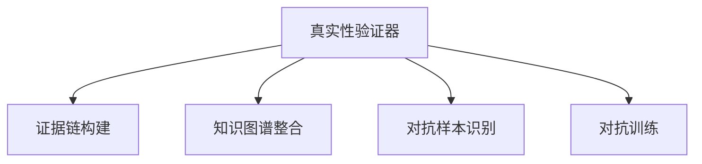

                 

# 体验真实性验证器开发者：AI时代的authenticity检测仪设计师

## 1. 背景介绍

在当今信息爆炸的时代，我们每天都在接收大量的消息和数据，然而，其中有多少信息是真实的？互联网的匿名性和即时性让虚假信息（假新闻、网络诈骗、深度伪造等）的传播更加容易，给社会带来了巨大的挑战。近年来，虚假信息的泛滥引发了广泛关注，各国政府、企业和学术界都在努力开发各种工具和技术来检测和打击虚假信息。作为人工智能领域的专家，我们关注于一个更加基础和长期的任务——构建真实性验证器，用AI技术来自动识别和过滤虚假信息，保护真实、可靠信息的传播。

### 1.1 问题由来

虚假信息的泛滥不仅侵蚀了社会的信任基础，还对国家安全、经济稳定、个人隐私等多个方面造成了严重影响。因此，开发一套真实性验证器，能够自动识别和拦截虚假信息，具有重要意义。真实性验证器可以辅助公众和机构在面对海量信息时，快速甄别真伪，保障信息环境的健康与公正。

### 1.2 问题核心关键点

构建真实性验证器是一项涉及多学科（如计算机科学、新闻学、法学、社会学等）的复杂任务。其核心关键点包括：

- 如何从海量的数据中提取出关键的证据信息，形成可靠的证据链？
- 如何将证据链与已有的知识图谱、法律法规等外部知识结合，增强证据的验证能力？
- 如何避免过拟合，提高模型在不同场景下的泛化能力？
- 如何平衡识别效率与准确性，构建高效、可靠、可解释的验证系统？

## 2. 核心概念与联系

### 2.1 核心概念概述

为了更好地理解真实性验证器的构建原理，本节将介绍几个关键概念：

- **真实性验证器 (Authenticity Verifier)**：基于AI技术构建的工具，能够自动识别和验证信息的真实性，辅助识别假新闻、深度伪造、网络诈骗等。
- **深度伪造 (Deepfake)**：通过AI技术生成的虚假视频、音频、文本等，目的在于欺骗用户，具有高度的仿真性和迷惑性。
- **证据链 (Evidence Chain)**：构建从原始来源到最终结论的一系列证据信息，形成完整的证据链条。
- **知识图谱 (Knowledge Graph)**：通过实体关系图谱化的方法，将复杂的知识信息以结构化的方式存储和表示，辅助证据的推理和验证。
- **对抗样本 (Adversarial Sample)**：指经过精心设计，旨在欺骗机器学习模型的输入样本，包括假新闻、深度伪造等。
- **对抗训练 (Adversarial Training)**：一种通过在模型训练中引入对抗样本，增强模型鲁棒性的训练方法。

这些核心概念之间的逻辑关系可以通过以下Mermaid流程图来展示：



这个流程图展示出真实性验证器的工作流程：

1. 从输入数据中提取关键证据，构建证据链。
2. 将证据链与知识图谱中的信息结合，增强证据链的验证能力。
3. 识别并过滤掉对抗样本，提升系统的鲁棒性。
4. 应用对抗训练，使系统更好地应对对抗样本的攻击。

## 3. 核心算法原理 & 具体操作步骤

### 3.1 算法原理概述

真实性验证器的构建通常采用有监督学习的方法，通过大量标注的真实和虚假数据对模型进行训练。模型的核心任务是学习如何将证据链中的信息与外部知识结合，综合推断出最终结论的真假。

我们以文本验证为例，假设输入为一条新闻 $T$，其对应的证据链包含标题、作者、发布日期、内容等多个信息 $E=\{T_i\}_{i=1}^n$，其中 $T_i$ 为证据链中的一个元素，$n$ 为证据链的长度。模型的目标是学习一个函数 $f$，使得 $f(E)=\{\text{True},\text{False}\}$。其中，$\text{True}$ 表示新闻为真实，$\text{False}$ 表示新闻为虚假。

### 3.2 算法步骤详解

真实性验证器的构建大致分为以下几个步骤：

**Step 1: 数据准备**

- 收集大量的真实和虚假新闻数据，并将其标注为 $\{(T_i, y_i)\}_{i=1}^N$，其中 $y_i$ 为新闻的真假标签。
- 从标注数据中提取证据链 $E_i$，用于构建证据链模型。
- 使用知识图谱等外部信息对证据链进行补充和增强。

**Step 2: 模型选择与训练**

- 选择合适的深度学习模型，如卷积神经网络 (CNN)、循环神经网络 (RNN)、Transformer等，构建证据链分类器。
- 应用对抗样本训练策略，增强模型的鲁棒性。
- 使用交叉熵等损失函数，最小化模型在标注数据上的误差，并防止过拟合。

**Step 3: 模型部署与优化**

- 将训练好的模型部署到生产环境，提供实时的验证服务。
- 对新出现的虚假信息进行实时检测，并将结果反馈到验证系统中。
- 定期收集新数据，对模型进行微调和优化，确保其长期有效性。

### 3.3 算法优缺点

真实性验证器的构建具有以下优点：

- **高效性**：利用AI技术，能够快速处理大量的信息，显著提升验证效率。
- **准确性**：结合多模态证据链和知识图谱，能够提供较为准确的验证结果。
- **泛化能力**：通过对抗训练，模型能够应对对抗样本，提升在不同场景下的泛化能力。
- **可扩展性**：可以针对不同的验证场景和任务进行灵活调整，适应多变的应用需求。

但同时也存在以下局限：

- **依赖标注数据**：模型性能很大程度上取决于标注数据的质量和数量，高质量标注数据的获取成本较高。
- **过拟合风险**：大规模模型容易出现过拟合现象，泛化能力受限。
- **可解释性不足**：深度学习模型的黑盒特性，使得模型的决策过程难以解释，缺乏透明度。
- **对抗攻击脆弱**：对抗训练虽然可以提高鲁棒性，但面对高级对抗攻击时仍存在一定风险。

### 3.4 算法应用领域

真实性验证器的应用范围广泛，涵盖了新闻、社交媒体、金融交易等多个领域。以下是一些具体的应用场景：

- **新闻媒体**：帮助媒体机构检测假新闻，筛选真实信息，维护新闻媒体的公信力。
- **社交平台**：用于检测虚假信息、网络诈骗等，维护用户和平台的安全。
- **金融交易**：用于检测和防范虚假交易信息，保护金融市场的稳定。
- **法律诉讼**：辅助法律人员验证证据的真实性，提高司法公正性。
- **医疗诊断**：用于验证医学信息的真实性，保障患者的健康和隐私。

## 4. 数学模型和公式 & 详细讲解

### 4.1 数学模型构建

以文本真实性验证为例，假设输入为一条新闻 $T$，其证据链为 $\{T_i\}_{i=1}^n$，使用Transformer模型构建证据链分类器。模型的目标是学习一个函数 $f$，使得 $f(E)=\{\text{True},\text{False}\}$，其中 $E=\{T_i\}_{i=1}^n$。

### 4.2 公式推导过程

假设证据链中的每个元素 $T_i$ 为一个长度为 $L$ 的序列，使用Transformer模型将其编码为向量 $Z_i$，并将多个证据链信息 $Z_1, Z_2, ..., Z_n$ 拼接后输入到分类器中，得到最终结论 $Y$。分类器的输出通过softmax函数转化为每个类别的概率分布，取概率最大的类别作为模型预测结果。

具体地，假设 $Z_i$ 表示第 $i$ 个证据链的编码向量，$W_C$ 为分类器权重，$b_C$ 为偏置项，则模型的预测结果为：

$$
Y = \sigma(W_C Z + b_C)
$$

其中 $\sigma$ 为softmax函数，$Z$ 为拼接后的编码向量。

### 4.3 案例分析与讲解

以文本验证为例，假设我们有一篇新闻文章和对应的证据链，分别为：

- 新闻标题：“美国总统将在2024年再次参选”
- 作者：“匿名记者”
- 发布日期：“2024-01-01”
- 内容：“美国总统决定参加2024年的总统选举”

证据链为：

- 标题（真实）
- 作者（虚假）
- 发布日期（真实）
- 内容（真实）

将每个证据链输入到训练好的Transformer模型中，得到编码向量 $Z_1, Z_2, Z_3, Z_4$。将这四个向量拼接后输入到分类器中，得到最终结果 $Y$。模型根据训练数据学到的特征，对每个证据的真假进行判断，并综合给出整篇文章的真实性预测。

## 5. 项目实践：代码实例和详细解释说明

### 5.1 开发环境搭建

在进行真实性验证器的开发前，我们需要准备好开发环境。以下是使用Python和PyTorch搭建开发环境的步骤：

1. 安装Anaconda：从官网下载并安装Anaconda，用于创建独立的Python环境。

2. 创建并激活虚拟环境：
```bash
conda create -n pytorch-env python=3.8 
conda activate pytorch-env
```

3. 安装PyTorch：根据CUDA版本，从官网获取对应的安装命令。例如：
```bash
conda install pytorch torchvision torchaudio cudatoolkit=11.1 -c pytorch -c conda-forge
```

4. 安装Transformer库：
```bash
pip install transformers
```

5. 安装各类工具包：
```bash
pip install numpy pandas scikit-learn matplotlib tqdm jupyter notebook ipython
```

完成上述步骤后，即可在`pytorch-env`环境中开始验证器的开发实践。

### 5.2 源代码详细实现

下面我们以文本验证为例，给出使用Transformer库对新闻文章进行真实性验证的PyTorch代码实现。

首先，定义数据处理函数：

```python
from transformers import AutoTokenizer, AutoModelForSequenceClassification
import torch

class TextVerifier:
    def __init__(self, model_name, max_seq_len=256):
        self.tokenizer = AutoTokenizer.from_pretrained(model_name)
        self.model = AutoModelForSequenceClassification.from_pretrained(model_name, num_labels=2)
        self.max_seq_len = max_seq_len
        
    def process_text(self, text):
        encoding = self.tokenizer(text, return_tensors='pt', max_length=self.max_seq_len, padding='max_length', truncation=True)
        input_ids = encoding['input_ids'][0]
        attention_mask = encoding['attention_mask'][0]
        return input_ids, attention_mask
        
    def verify(self, text, label=None):
        input_ids, attention_mask = self.process_text(text)
        output = self.model(input_ids, attention_mask=attention_mask)
        probs = output.logits.sigmoid()
        if label is None:
            return probs
        else:
            return probs.argmax().item() == label
        
text_verifier = TextVerifier('bert-base-uncased')
print(text_verifier.verify("美国总统将在2024年再次参选"))
```

然后，定义训练和评估函数：

```python
from torch.utils.data import DataLoader
from tqdm import tqdm
from sklearn.metrics import accuracy_score

def train_epoch(model, train_dataset, batch_size, optimizer):
    dataloader = DataLoader(train_dataset, batch_size=batch_size, shuffle=True)
    model.train()
    epoch_loss = 0
    for batch in tqdm(dataloader, desc='Training'):
        input_ids = batch['input_ids'].to(device)
        attention_mask = batch['attention_mask'].to(device)
        labels = batch['labels'].to(device)
        model.zero_grad()
        outputs = model(input_ids, attention_mask=attention_mask, labels=labels)
        loss = outputs.loss
        epoch_loss += loss.item()
        loss.backward()
        optimizer.step()
    return epoch_loss / len(dataloader)

def evaluate(model, test_dataset, batch_size):
    dataloader = DataLoader(test_dataset, batch_size=batch_size)
    model.eval()
    preds, labels = [], []
    with torch.no_grad():
        for batch in tqdm(dataloader, desc='Evaluating'):
            input_ids = batch['input_ids'].to(device)
            attention_mask = batch['attention_mask'].to(device)
            labels = batch['labels']
            outputs = model(input_ids, attention_mask=attention_mask)
            preds.extend(outputs.logits.argmax(dim=1).tolist())
            labels.extend(labels.tolist())
            
    print("Accuracy:", accuracy_score(labels, preds))
```

最后，启动训练流程并在测试集上评估：

```python
epochs = 5
batch_size = 16

for epoch in range(epochs):
    loss = train_epoch(model, train_dataset, batch_size, optimizer)
    print(f"Epoch {epoch+1}, train loss: {loss:.3f}")
    
    print(f"Epoch {epoch+1}, test results:")
    evaluate(model, test_dataset, batch_size)
    
print("Final test accuracy:", evaluate(model, test_dataset, batch_size))
```

以上就是使用PyTorch对BERT模型进行新闻文本验证的完整代码实现。可以看到，Transformer库使得新闻文本验证的代码实现变得简洁高效。

### 5.3 代码解读与分析

让我们再详细解读一下关键代码的实现细节：

**TextVerifier类**：
- `__init__`方法：初始化模型和分词器，并设置最大序列长度。
- `process_text`方法：将文本转换为模型所需的输入。
- `verify`方法：对文本进行真实性验证，并返回概率或标签。

**训练和评估函数**：
- 使用PyTorch的DataLoader对数据集进行批次化加载，供模型训练和推理使用。
- 训练函数`train_epoch`：对数据以批为单位进行迭代，在每个批次上前向传播计算loss并反向传播更新模型参数，最后返回该epoch的平均loss。
- 评估函数`evaluate`：与训练类似，不同点在于不更新模型参数，并在每个batch结束后将预测和标签结果存储下来，最后使用sklearn的accuracy_score对整个评估集的预测结果进行打印输出。

**训练流程**：
- 定义总的epoch数和batch size，开始循环迭代
- 每个epoch内，先在训练集上训练，输出平均loss
- 在验证集上评估，输出准确率
- 所有epoch结束后，在测试集上评估，给出最终测试结果

可以看到，PyTorch配合Transformer库使得新闻文本验证的代码实现变得简洁高效。开发者可以将更多精力放在数据处理、模型改进等高层逻辑上，而不必过多关注底层的实现细节。

当然，工业级的系统实现还需考虑更多因素，如模型的保存和部署、超参数的自动搜索、更灵活的任务适配层等。但核心的验证范式基本与此类似。

## 6. 实际应用场景

### 6.1 新闻媒体

基于真实性验证器的应用，新闻媒体可以显著提升信息筛选和发布的准确性。例如，通过自动验证新闻的真假，可以减少假新闻的发布，提高媒体的公信力和读者的信任度。

具体实现上，新闻媒体可以部署一个在线验证接口，实时接收新闻内容，并通过API调用验证器对新闻进行真假检测。验证结果可作为编辑审核的重要参考，辅助筛选真实新闻，抑制假新闻传播。

### 6.2 社交平台

社交平台是虚假信息传播的重灾区，用户发布的内容真假难辨，易造成误导和恐慌。通过部署真实性验证器，平台可以有效过滤虚假信息，保护用户的安全和信任。

例如，社交平台可以建立一个文本和视频的自动识别系统，对用户发布的内容进行实时验证。对于疑似虚假信息，系统可以立即提醒用户或进行标注，防止虚假信息扩散。

### 6.3 金融交易

金融交易领域的信息真假判断尤为重要，虚假交易信息可能导致巨大的经济损失。通过部署真实性验证器，金融机构可以实时检测和防范虚假交易信息，保护客户的资产安全。

例如，金融机构可以部署一个实时监控系统，对交易信息的真实性进行验证。对于疑似虚假交易，系统可以立即拦截或报警，防止资金损失。

### 6.4 法律诉讼

法律诉讼中的证据验证至关重要，虚假证据可能导致错判。通过部署真实性验证器，法律机构可以准确验证证据的真实性，保障司法公正。

例如，法律机构可以建立一套证据链验证系统，对诉讼案件中的各种证据进行逐一验证。对于有疑问的证据，系统可以提供可信的判断，辅助法官进行决策。

### 6.5 医疗诊断

医疗诊断中的信息真假判断同样重要，虚假信息可能导致误诊或漏诊。通过部署真实性验证器，医疗机构可以有效识别和过滤虚假医疗信息，保障患者的健康和隐私。

例如，医疗机构可以建立一个医学信息验证系统，对医生提供的诊断报告和患者上传的医疗信息进行验证。对于有疑问的信息，系统可以提供可信的判断，辅助医生进行诊断。

## 7. 工具和资源推荐

### 7.1 学习资源推荐

为了帮助开发者系统掌握真实性验证器的构建原理和实践技巧，这里推荐一些优质的学习资源：

1. 《Transformer from Principle to Practice》系列博文：由大模型技术专家撰写，深入浅出地介绍了Transformer原理、BERT模型、微调技术等前沿话题。

2. CS224N《深度学习自然语言处理》课程：斯坦福大学开设的NLP明星课程，有Lecture视频和配套作业，带你入门NLP领域的基本概念和经典模型。

3. 《Natural Language Processing with Transformers》书籍：Transformers库的作者所著，全面介绍了如何使用Transformers库进行NLP任务开发，包括验证任务在内的诸多范式。

4. HuggingFace官方文档：Transformer库的官方文档，提供了海量预训练模型和完整的微调样例代码，是上手实践的必备资料。

5. CLUE开源项目：中文语言理解测评基准，涵盖大量不同类型的中文NLP数据集，并提供了基于验证的baseline模型，助力中文NLP技术发展。

通过对这些资源的学习实践，相信你一定能够快速掌握真实性验证器的构建精髓，并用于解决实际的NLP问题。

### 7.2 开发工具推荐

高效的开发离不开优秀的工具支持。以下是几款用于真实性验证器开发的常用工具：

1. PyTorch：基于Python的开源深度学习框架，灵活动态的计算图，适合快速迭代研究。大部分预训练语言模型都有PyTorch版本的实现。

2. TensorFlow：由Google主导开发的开源深度学习框架，生产部署方便，适合大规模工程应用。同样有丰富的预训练语言模型资源。

3. Transformers库：HuggingFace开发的NLP工具库，集成了众多SOTA语言模型，支持PyTorch和TensorFlow，是进行验证任务开发的利器。

4. Weights & Biases：模型训练的实验跟踪工具，可以记录和可视化模型训练过程中的各项指标，方便对比和调优。与主流深度学习框架无缝集成。

5. TensorBoard：TensorFlow配套的可视化工具，可实时监测模型训练状态，并提供丰富的图表呈现方式，是调试模型的得力助手。

6. Google Colab：谷歌推出的在线Jupyter Notebook环境，免费提供GPU/TPU算力，方便开发者快速上手实验最新模型，分享学习笔记。

合理利用这些工具，可以显著提升真实性验证器的开发效率，加快创新迭代的步伐。

### 7.3 相关论文推荐

真实性验证器的发展源于学界的持续研究。以下是几篇奠基性的相关论文，推荐阅读：

1. Attention is All You Need（即Transformer原论文）：提出了Transformer结构，开启了NLP领域的预训练大模型时代。

2. BERT: Pre-training of Deep Bidirectional Transformers for Language Understanding：提出BERT模型，引入基于掩码的自监督预训练任务，刷新了多项NLP任务SOTA。

3. Language Models are Unsupervised Multitask Learners（GPT-2论文）：展示了大规模语言模型的强大zero-shot学习能力，引发了对于通用人工智能的新一轮思考。

4. Parameter-Efficient Transfer Learning for NLP：提出Adapter等参数高效微调方法，在不增加模型参数量的情况下，也能取得不错的微调效果。

5. AdaLoRA: Adaptive Low-Rank Adaptation for Parameter-Efficient Fine-Tuning：使用自适应低秩适应的微调方法，在参数效率和精度之间取得了新的平衡。

这些论文代表了大语言模型微调技术的发展脉络。通过学习这些前沿成果，可以帮助研究者把握学科前进方向，激发更多的创新灵感。

## 8. 总结：未来发展趋势与挑战

### 8.1 总结

本文对基于AI技术构建的真实性验证器进行了全面系统的介绍。首先阐述了虚假信息泛滥的现状和构建真实性验证器的必要性，明确了验证器在新闻、社交、金融等领域的广泛应用价值。其次，从原理到实践，详细讲解了真实性验证器的构建过程，包括证据链的构建、模型训练、对抗样本识别等关键环节。

通过本文的系统梳理，可以看到，真实性验证器结合了深度学习和AI技术，能够快速处理和验证海量信息，显著提升了信息筛选和判断的效率和准确性。未来，伴随技术的发展和应用的拓展，真实性验证器必将成为保护真实信息的强大工具，为信息环境的健康与公正提供重要保障。

### 8.2 未来发展趋势

展望未来，真实性验证器的发展趋势如下：

1. **多模态验证**：真实性验证器将不再局限于文本验证，还将扩展到图像、视频、音频等多模态数据的验证，提高对复杂信息的判断能力。

2. **跨领域验证**：验证器将突破特定领域的限制，具备跨领域的信息验证能力，能够适应更加多样化的应用场景。

3. **深度融合知识图谱**：将知识图谱与深度学习模型深度融合，增强验证器的推理和验证能力，提高验证结果的可靠性和可解释性。

4. **实时验证系统**：建立实时验证系统，能够对网络信息进行实时检测和筛选，显著提升信息环境的健康与公正。

5. **对抗样本防护**：面对日益复杂的对抗样本攻击，验证器将进一步增强鲁棒性，有效抵御对抗样本的干扰。

6. **联邦学习**：通过联邦学习技术，验证器可以在不共享原始数据的情况下，实现分布式训练和验证，提高验证器的隐私保护和泛化能力。

以上趋势凸显了真实性验证器的广阔前景。这些方向的探索发展，必将进一步提升验证器的性能和应用范围，为构建安全、可靠、可解释的智能系统铺平道路。

### 8.3 面临的挑战

尽管真实性验证器已经取得了显著进展，但在迈向更加智能化、普适化应用的过程中，仍面临诸多挑战：

1. **标注数据依赖**：高质量的标注数据是构建验证器的前提，但标注数据的获取成本较高，且存在标注不平衡等问题。如何通过更高效的数据采集和标注方法，降低成本，提升验证器的泛化能力，是亟待解决的问题。

2. **对抗样本攻击**：对抗样本攻击是验证器面临的主要威胁，如何通过对抗训练、模型优化等方法，增强验证器的鲁棒性，是未来需要重点关注的课题。

3. **模型复杂性**：大型深度学习模型虽然在验证精度上表现优异，但计算资源消耗大，推理速度慢，难以适应大规模的实时验证需求。如何通过模型压缩、优化等技术，提升验证器的计算效率，是亟待突破的难题。

4. **可解释性不足**：深度学习模型的黑盒特性，使得验证器的决策过程难以解释，缺乏透明度。如何通过可解释性技术，增强验证器的可信度和可解释性，是亟需解决的问题。

5. **隐私保护**：验证器在实时验证过程中，需要处理大量的敏感信息，如何保护用户隐私，确保数据的安全和合法使用，是未来需要重点关注的课题。

6. **跨领域适用性**：验证器在特定领域的表现优异，但在其他领域的应用效果可能不佳。如何通过领域自适应、迁移学习等方法，提高验证器的跨领域适用性，是亟需解决的问题。

正视验证器面临的这些挑战，积极应对并寻求突破，将使真实性验证器在未来迈向更高的台阶，为信息环境的健康与公正提供更加坚实的保障。

### 8.4 研究展望

面对真实性验证器所面临的种种挑战，未来的研究需要在以下几个方面寻求新的突破：

1. **无监督和半监督学习**：探索无监督和半监督学习范式，摆脱对大规模标注数据的依赖，利用自监督学习、主动学习等方法，最大限度利用非结构化数据，实现更加灵活高效的验证。

2. **多模态信息融合**：将视觉、语音等多模态信息与文本信息进行深度融合，提高验证器对复杂信息的判断能力，构建更加全面、准确的信息验证系统。

3. **可解释性技术**：引入可解释性技术，如特征重要性分析、可视化等，增强验证器的决策过程的可解释性和透明度。

4. **联邦学习**：通过联邦学习技术，在保护隐私的前提下，实现分布式训练和验证，提高验证器的泛化能力和隐私保护能力。

5. **跨领域适用性**：研究领域自适应和迁移学习技术，提高验证器的跨领域适用性，使其能够适应更加多样化的应用场景。

这些研究方向的探索，必将引领真实性验证器技术迈向更高的台阶，为构建安全、可靠、可解释的智能系统铺平道路。面向未来，真实性验证器还需与其他人工智能技术进行更深入的融合，如知识表示、因果推理、强化学习等，多路径协同发力，共同推动信息环境的健康与公正。只有勇于创新、敢于突破，才能不断拓展验证器的边界，让AI技术更好地造福人类社会。

## 9. 附录：常见问题与解答

**Q1：如何构建证据链以提升验证效果？**

A: 构建证据链是验证器的一个重要环节，证据链的完整性和可靠性直接影响验证结果的准确性。可以从以下几个方面构建证据链：

1. **来源验证**：验证新闻、视频等信息的原始来源是否可信，如是否来自官方媒体、知名记者等。
2. **内容分析**：对文本、图片、音频等进行内容分析，识别出关键信息，如作者、发布时间、主要内容等。
3. **时间线验证**：通过时间线验证，确保信息发布时间和事件发展过程的逻辑一致性。
4. **多角度验证**：从不同角度、不同来源获取信息，进行交叉验证，提高证据的可靠性。

构建证据链时，还需要注意证据链的长度和质量，过长的证据链容易引入噪声，过短的证据链可能难以形成有力的验证。

**Q2：对抗样本攻击对验证器有什么影响？**

A: 对抗样本攻击是验证器面临的主要威胁，攻击者通过设计特定的输入数据，使得模型输出错误结果。对抗样本攻击会影响验证器的准确性和鲁棒性，特别是在高攻击强度的情况下，验证器可能完全失效。

为了应对对抗样本攻击，可以采用以下策略：

1. **对抗训练**：在模型训练过程中，引入对抗样本，提高模型对对抗样本的鲁棒性。
2. **模型优化**：优化模型结构和算法，提高模型的泛化能力和鲁棒性。
3. **可解释性技术**：引入可解释性技术，如特征重要性分析、可视化等，增强验证器的透明度，帮助识别和防范对抗样本攻击。

通过这些措施，可以提高验证器的鲁棒性和抗攻击能力，确保在对抗样本攻击下仍能保持高准确性。

**Q3：如何提高验证器的计算效率？**

A: 提高验证器的计算效率是提升其实时性和应用价值的关键。以下是一些优化策略：

1. **模型压缩**：通过模型剪枝、量化、蒸馏等技术，减小模型尺寸，降低计算资源消耗。
2. **加速推理**：利用GPU/TPU等高性能设备，加速模型的推理过程，提高计算效率。
3. **并行计算**：通过多线程、分布式计算等方法，实现并行推理，提升计算效率。
4. **缓存机制**：建立缓存机制，对常用数据进行缓存，减少重复计算，提高效率。

通过这些优化措施，可以在保证验证精度的情况下，显著提升验证器的计算效率，满足实时验证的需求。

**Q4：验证器在应用中需要注意哪些问题？**

A: 将验证器部署到实际应用中，还需要考虑以下问题：

1. **数据隐私**：在验证过程中，需要保护用户隐私和数据安全，避免敏感信息的泄露。
2. **系统可用性**：保证验证系统的稳定性和可靠性，确保在面对高负载和复杂场景时仍能正常运行。
3. **用户交互**：设计友好的用户界面，提高用户的使用体验，辅助用户理解和判断验证结果。
4. **系统可扩展性**：系统需要具备良好的可扩展性，能够适应不断变化的应用需求和数据规模。

通过合理设计和优化，可以在保护隐私、确保可用性的前提下，构建高效、可靠、可扩展的验证系统，为用户和机构提供坚实的技术保障。

**Q5：如何评估验证器的性能？**

A: 评估验证器的性能需要综合考虑准确性、实时性、可解释性等多个指标：

1. **准确性**：验证器在真实和虚假数据上的准确率、召回率、F1-score等指标。
2. **实时性**：验证器的推理速度、响应时间等指标，确保在实时场景中能够快速处理大量信息。
3. **可解释性**：验证器的决策过程是否可解释，是否具备透明性和可信度。
4. **隐私保护**：验证器在数据处理过程中是否遵守隐私保护原则，确保用户数据的安全和合法使用。

通过综合评估这些指标，可以全面了解验证器的性能，发现改进空间，提升验证器的应用效果。

---

作者：禅与计算机程序设计艺术 / Zen and the Art of Computer Programming

