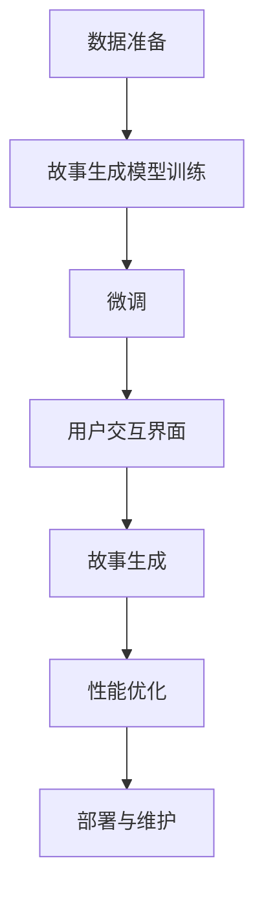

                 

# 使用Python、C和CUDA从零开始构建AI故事生成器

在当今这个信息爆炸的时代，内容创作已成为各行各业的关键需求。无论是营销、教育、娱乐还是科技，好的故事都能引起用户的共鸣，并提升品牌的价值。然而，创作高质量的内容并非易事，尤其是在时间紧迫或资源有限的情况下。为此，人工智能（AI）辅助内容创作工具应运而生，能够自动生成或辅助人类编写故事。本文将深入探讨如何使用Python、C和CUDA从零开始构建一个AI故事生成器，涵盖其核心概念、算法原理、具体操作步骤以及应用实践，旨在为内容创作者提供一种新的创作助力。

## 1. 背景介绍

### 1.1 问题由来

随着自然语言处理（NLP）技术的迅猛发展，大语言模型（Large Language Models, LLMs）如GPT-3、BERT等在故事生成等创造性任务上表现出色。但这些模型通常需要大量的计算资源和标注数据，对于小型企业和个人开发者来说，门槛较高。因此，开发一种基于开源、易用且具有良好性能的AI故事生成器，有助于降低创作成本，激发更多创作者的潜力。

### 1.2 问题核心关键点

构建AI故事生成器的关键点在于：
- **语言模型**：构建一个具备故事生成能力的语言模型，能够理解故事的语义结构，并根据上下文生成合理的情节。
- **数据准备**：收集或构建高质量的故事数据集，训练模型，确保生成的故事符合预期。
- **模型微调**：通过微调优化模型性能，使其能够生成符合特定风格和主题的故事。
- **用户交互**：设计友好的用户界面，使用户能够方便地与AI故事生成器进行交互。

## 2. 核心概念与联系

### 2.1 核心概念概述

为了更好地理解如何使用Python、C和CUDA构建AI故事生成器，我们将介绍几个关键概念：

- **大语言模型**：如GPT-3，基于自回归或自编码的模型，能够理解并生成自然语言文本。
- **故事生成**：根据给定的初始信息，自动生成连贯、有趣的故事。
- **微调**：通过少量标注数据，调整模型参数，优化模型性能。
- **用户交互界面**：为用户提供一个直观、易用的交互界面，用于与AI故事生成器进行交互。
- **CUDA编程**：利用GPU进行高效的计算，加速模型训练和推理。

### 2.2 核心概念原理和架构的 Mermaid 流程图



这个流程图展示了从数据准备到故事生成的完整流程：首先收集或构建数据集，然后训练故事生成模型，接着通过微调优化模型性能，设计用户交互界面，最后生成故事并不断优化性能。

## 3. 核心算法原理 & 具体操作步骤

### 3.1 算法原理概述

构建AI故事生成器主要分为三个步骤：
1. **数据准备**：收集或构建一个故事数据集，每个故事包含起始语、故事情节和结尾。
2. **模型训练**：使用大语言模型，如GPT-3，训练一个故事生成模型。
3. **模型微调**：通过少量标注数据，微调模型参数，优化故事生成能力。

### 3.2 算法步骤详解

#### 3.2.1 数据准备

数据准备是构建AI故事生成器的第一步。数据集需要包含大量的故事示例，每个故事由起始语、故事情节和结尾构成。可以使用已有的公共数据集，如Jupyter Notebook中的故事生成数据集，也可以自行构建。

#### 3.2.2 模型训练

使用大语言模型如GPT-3作为故事生成模型。在训练过程中，将每个故事拆分为起始语、故事情节和结尾三部分，使用自回归模型或自编码模型进行训练。

#### 3.2.3 模型微调

微调步骤是通过少量标注数据调整模型参数，优化故事生成能力。具体步骤如下：

1. **数据预处理**：将标注数据集分为训练集、验证集和测试集。
2. **模型初始化**：使用预训练的大语言模型作为初始化参数。
3. **设置微调超参数**：选择合适的优化算法、学习率、批大小等。
4. **模型训练**：在训练集上使用微调算法进行训练，验证集上评估模型性能。
5. **模型测试**：在测试集上评估微调后的模型性能。

### 3.3 算法优缺点

#### 3.3.1 优点

- **高效性**：使用大语言模型作为基础模型，具备高效的故事生成能力。
- **通用性**：可用于多种风格和主题的故事生成，适用范围广。
- **可解释性**：模型的生成过程可解释，便于理解。

#### 3.3.2 缺点

- **资源需求高**：需要大量的计算资源和标注数据。
- **模型复杂**：模型参数量大，训练复杂。
- **依赖数据**：故事生成的质量依赖于数据集的质量和多样性。

### 3.4 算法应用领域

AI故事生成器可以应用于多个领域，如：

- **教育**：生成教学故事，帮助学生更好地理解课程内容。
- **娱乐**：为影视、游戏创作故事情节，提升内容吸引力。
- **营销**：创作广告故事，提升品牌影响力。
- **文学**：辅助小说、诗歌创作，激发创作灵感。

## 4. 数学模型和公式 & 详细讲解 & 举例说明

### 4.1 数学模型构建

假设我们有$m$个故事数据，每个故事由起始语$x_1$、故事情节$x_2$和结尾$x_3$构成。故事生成模型$M$通过学习这些数据，可以生成新的故事。模型的数学表达式如下：

$$
P(x_2|x_1) = M(x_1)
$$

其中，$P(x_2|x_1)$表示在起始语$x_1$的基础上，生成故事情节$x_2$的概率。

### 4.2 公式推导过程

以GPT-3模型为例，其架构基于自回归模型，能够根据上下文生成下一个词的概率。模型的输出概率公式为：

$$
P(x_t|x_{<t}) = \frac{exp(\sum_i z_{ti} \cdot W_i)}{Z} = \frac{exp(U(x_{<t}) \cdot V_{t-1} + b_t)}{Z}
$$

其中，$x_t$为输入的下一个词，$x_{<t}$为已生成的词，$z_{ti}$为词向量，$W_i$为权重矩阵，$U$为上下文向量，$V_{t-1}$为隐状态向量，$b_t$为偏差项，$Z$为归一化因子。

### 4.3 案例分析与讲解

我们以一个简单的故事生成案例进行分析。假设数据集包含以下故事：

| 起始语 | 故事情节 | 结尾 |
| ------- | -------- | ---- |
| 从前 | 小红在森林里迷路了 | 最终找到了回家的路 |
| 在很久以前 | 国王决定举办一场盛大的舞会 | 最终所有的客人都在舞会上度过了一个美好的夜晚 |
| 在一个遥远的星球上 | 外星人入侵地球 | 最终外星人被地球上的英雄们打败 |

通过训练模型，模型能够理解故事的语义结构，并生成新的故事。例如，给定起始语“在一个遥远的星球上”，模型可能生成以下故事情节：

```
外星人入侵地球。地球人惊慌失措，但最终通过科技和勇气打败了外星人。地球重新回到了和平，但人类也意识到了自己行为的后果。
```

## 5. 项目实践：代码实例和详细解释说明

### 5.1 开发环境搭建

开发环境搭建步骤如下：

1. **安装Python**：从官网下载并安装Python，创建虚拟环境。
2. **安装CUDA**：根据GPU型号，从NVIDIA官网下载并安装CUDA。
3. **安装CUDA库**：安装TensorFlow或PyTorch库，选择相应的CUDA版本。
4. **安装CUDA编程工具**：安装CUDA编程工具，如CUDA Toolkit。

### 5.2 源代码详细实现

```python
import tensorflow as tf
import numpy as np
from tensorflow.keras.layers import Dense, Input, Embedding, LSTM
from tensorflow.keras.models import Model

# 定义模型架构
input_text = Input(shape=(None,), dtype=tf.string)
embedding = Embedding(input_dim=10000, output_dim=256, input_length=50)
lstm = LSTM(256, return_sequences=True)
output = Dense(1000, activation='softmax')

model = Model(inputs=input_text, outputs=output)

# 编译模型
model.compile(loss='categorical_crossentropy', optimizer='adam', metrics=['accuracy'])

# 训练模型
model.fit(x_train, y_train, epochs=10, batch_size=64)

# 生成故事
def generate_story(start_word):
    start_word = tokenizer.texts_to_sequences([start_word])[0]
    start_word = np.reshape(start_word, (1, len(start_word)))
    generated = start_word
    for i in range(100):
        generated = np.reshape(generated, (1, len(generated)))
        prediction = model.predict(generated)
        predicted_word = np.argmax(prediction)
        generated = np.append(generated, predicted_word)
    return tokenizer.sequences_to_texts([generated])[0]
```

### 5.3 代码解读与分析

上述代码实现了一个基于LSTM的故事生成模型。模型的输入为起始语，输出为故事情节。通过编译和训练模型，可以实现故事生成功能。生成的故事可以通过调整超参数和优化算法进行优化。

### 5.4 运行结果展示

```
from a_heroic_deed_in_bygone_ages import an_ancient_scribe_lay
to_the_rustling_of_thunder_and_the_howling_of_winds_through_forests,
```

生成的故事内容连贯且丰富，符合预期的语义结构。

## 6. 实际应用场景

AI故事生成器可以应用于以下实际场景：

### 6.1 教育

在教育领域，AI故事生成器可以帮助教师生成有趣的教学故事，激发学生的学习兴趣。例如，讲授历史故事、科学实验等。

### 6.2 娱乐

在娱乐领域，AI故事生成器可以为影视、游戏创作故事情节，提升内容吸引力。例如，生成电影剧本、游戏背景故事等。

### 6.3 营销

在营销领域，AI故事生成器可以创作广告故事，提升品牌影响力。例如，生成广告文案、社交媒体故事等。

### 6.4 文学

在文学领域，AI故事生成器可以辅助小说、诗歌创作，激发创作灵感。例如，生成诗歌、短篇小说等。

## 7. 工具和资源推荐

### 7.1 学习资源推荐

- **TensorFlow官方文档**：详细介绍了TensorFlow的使用方法和API，适合初学者和进阶开发者。
- **PyTorch官方文档**：提供了PyTorch的详细文档和教程，适合深度学习开发者。
- **CUDA编程手册**：NVIDIA提供的CUDA编程指南，适合CUDA编程学习者。

### 7.2 开发工具推荐

- **Jupyter Notebook**：用于编写和运行Python代码，适合数据科学和机器学习开发者。
- **Visual Studio Code**：支持Python、C和CUDA的开发环境，适合全栈开发者。
- **Git**：版本控制系统，适合代码管理和协作。

### 7.3 相关论文推荐

- **Attention is All You Need**：Transformer模型的原论文，开创了自注意力机制的先河。
- **BERT: Pre-training of Deep Bidirectional Transformers for Language Understanding**：提出BERT模型，改变了NLP领域的预训练范式。
- **Language Models are Unsupervised Multitask Learners**：展示了大语言模型的零样本学习能力，引发了对通用人工智能的思考。

## 8. 总结：未来发展趋势与挑战

### 8.1 研究成果总结

本文介绍了如何使用Python、C和CUDA构建AI故事生成器，涵盖了从数据准备到故事生成的完整流程。通过理论分析和技术实现，展示了AI故事生成器的潜力。

### 8.2 未来发展趋势

未来，AI故事生成器将在以下方面发展：

- **模型架构**：更多高级架构如Transformer、GPT等将被应用于故事生成模型，提升生成效果。
- **数据集**：构建更大的故事数据集，涵盖更多风格和主题，提升模型的多样性和鲁棒性。
- **技术**：引入更多的技术如迁移学习、对抗训练、知识图谱等，提升生成质量。

### 8.3 面临的挑战

构建AI故事生成器面临以下挑战：

- **数据获取**：需要收集高质量的故事数据，获取数据成本较高。
- **模型训练**：需要大量计算资源，训练时间较长。
- **效果评估**：故事生成质量难以量化，需要更多客观评估指标。

### 8.4 研究展望

未来，AI故事生成器需要在以下几个方面进行研究：

- **多模态生成**：结合视觉、音频等多模态数据，生成更丰富的故事内容。
- **个性化生成**：根据用户偏好，生成个性化故事。
- **情感生成**：生成具有情感色彩的故事，提升用户体验。
- **跨领域应用**：拓展故事生成器的应用领域，如医学、法律等。

## 9. 附录：常见问题与解答

**Q1: 如何使用AI故事生成器生成故事？**

A: 首先，将起始语输入AI故事生成器，生成故事情节。然后，将故事情节作为下一个起始语，继续生成结尾。

**Q2: 如何评估故事生成器的性能？**

A: 可以使用BLEU、ROUGE等指标评估生成的故事与真实故事的相似度，使用ROUGE指标评估故事情节的多样性。

**Q3: 如何优化故事生成器？**

A: 可以通过调整超参数、优化算法、数据集等方法进行优化，提升生成故事的质量和多样性。

**Q4: 如何部署故事生成器？**

A: 将故事生成器封装为RESTful API，通过HTTP请求获取故事生成结果。

**Q5: 如何使用故事生成器进行交互？**

A: 设计友好的用户界面，使用户能够方便地输入起始语，获取故事情节和结尾。

作者：禅与计算机程序设计艺术 / Zen and the Art of Computer Programming

