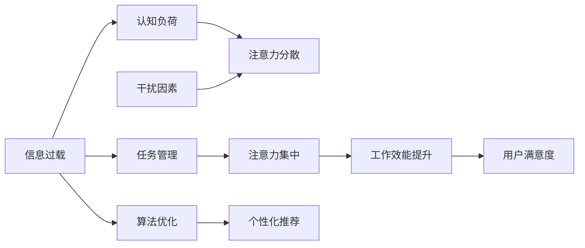

                 

# 信息时代的注意力管理策略与实践：在干扰和信息过载 中保持专注

## 1. 背景介绍

### 1.1 问题由来
在数字化时代，信息爆炸和注意力碎片化已经成为普遍现象。面对不断涌入的信息流，人们如何有效管理注意力，保持专注，避免被干扰，成为迫切需要解决的问题。信息过载导致认知负荷增加，工作效率下降，甚至引起心理压力和情绪问题。

### 1.2 问题核心关键点
信息过载的应对策略和注意力管理技术已成为研究热点。现有的注意力管理方法主要包括以下几种：

- **时间管理**：通过日程规划、番茄工作法等方法，按固定时间分配任务，以增强专注力。
- **任务管理**：如GTD（Get Things Done）、OKR（Objectives and Key Results）等，通过明确任务和目标，优化工作流程。
- **心理调节**：包括正念冥想、运动锻炼、社会支持等，提升情绪稳定性和自我管理能力。
- **技术辅助**：利用手机应用、专注软件（如Forest、Focus@Will等）提供时间跟踪和注意力监控功能。
- **环境设计**：通过减少干扰、优化工作空间，如静音、整洁、光线等，提升工作环境质量。
- **模型与算法**：基于机器学习和数据挖掘技术，对用户行为进行分析预测，提供个性化推荐。

这些策略虽有一定效果，但多基于经验或手工调整，无法适应大规模的个性化需求。随着人工智能技术的发展，利用机器学习算法进行自动化的注意力管理成为新的研究方向。

## 2. 核心概念与联系

### 2.1 核心概念概述

为深入理解信息时代注意力管理，需先明确几个关键概念：

- **注意力**：注意力的本质是信息处理的选择性，信息过载环境下，保持注意力集中是提升工作效率和心理健康的关键。
- **干扰**：干扰是指外界或内在因素对注意力产生的影响，主要包括视觉干扰、听觉干扰、心理干扰等。
- **信息过载**：指信息量远远超过处理能力，导致认知负荷过重，注意力难以聚焦。
- **认知负荷**：指个体在信息处理过程中需投入的认知资源，包括注意、记忆、推理等。
- **任务管理**：通过任务分解和优先级排序，优化注意力分配，提升工作效能。
- **算法优化**：利用机器学习算法，自动预测用户行为，优化注意力管理策略。

这些概念之间存在密切联系：信息过载导致认知负荷增加，进而影响注意力集中；干扰因素增加认知负荷；而良好的任务管理和算法优化可有效缓解这些问题。

### 2.2 核心概念原理和架构的 Mermaid 流程图


这个流程图展示了信息过载与注意力管理之间的主要关系：

1. 信息过载导致认知负荷增加，进而分散注意力。
2. 干扰因素进一步加重认知负荷，影响注意力。
3. 良好的任务管理和算法优化能够缓解信息过载和干扰，提升注意力集中度。
4. 提升注意力集中度后，可显著提升工作效能，提高用户满意度。

## 3. 核心算法原理 & 具体操作步骤
### 3.1 算法原理概述

基于信息时代注意力管理的目标，引入机器学习算法进行模型构建和优化。注意力管理模型通常包括以下几个关键模块：

- **数据采集与预处理**：采集用户行为数据，如操作记录、浏览历史、工作时长等，并进行数据清洗、归一化等预处理。
- **特征提取与建模**：从采集到的数据中提取重要特征，如点击频率、工作时长、任务切换次数等，通过机器学习模型对这些特征进行建模。
- **干扰检测与分析**：利用算法检测用户工作中的干扰因素，如通知弹出、同事打扰等，并分析其对注意力集中的影响。
- **注意力评估与预测**：通过注意力评估模型，实时监测用户注意力集中度，并预测未来的注意力状态。
- **策略调整与优化**：基于注意力预测结果，调整任务优先级、提醒方式、工作环境等，优化注意力管理策略。

### 3.2 算法步骤详解

1. **数据采集与预处理**：
    - 收集用户的工作日志、操作记录、邮件收发记录等行为数据。
    - 数据清洗：去除无关数据、填补缺失值、去重等。
    - 数据归一化：将不同单位的数据转换为统一的度量标准。

2. **特征提取与建模**：
    - 提取重要特征：操作频率、任务切换次数、工作时长、邮件处理速度等。
    - 选择合适的模型：如线性回归、决策树、随机森林、神经网络等，建立注意力模型。
    - 模型训练与优化：使用历史数据训练模型，并通过交叉验证等方法进行模型优化。

3. **干扰检测与分析**：
    - 干扰因素识别：通过算法检测用户在注意力分散时可能出现的干扰因素，如未读邮件数量、社交媒体使用次数等。
    - 干扰影响度分析：通过统计学方法分析干扰因素对注意力集中的影响程度，计算权重。

4. **注意力评估与预测**：
    - 注意力指标定义：如任务专注度、注意力集中时间、分心次数等。
    - 实时监测：利用传感器或日志记录，实时采集用户的注意力状态。
    - 预测模型：使用时间序列模型、集成学习模型等，预测未来的注意力状态。

5. **策略调整与优化**：
    - 任务优先级调整：根据注意力预测结果，动态调整任务的优先级。
    - 提醒方式优化：根据干扰因素和用户偏好，调整提醒方式和频率。
    - 工作环境优化：根据用户注意力状态，调整工作环境（如光线、声音、设备等）。

### 3.3 算法优缺点

**优点**：
- 自动化程度高：利用机器学习算法进行数据分析和预测，减少人工干预。
- 个性化推荐：根据用户行为数据，提供个性化的注意力管理策略。
- 实时监控：通过实时监测用户注意力状态，及时调整策略。

**缺点**：
- 数据依赖性高：需要大量高质量的标注数据进行模型训练。
- 算法复杂度高：模型构建和优化涉及多个模块和多种算法。
- 隐私和安全问题：用户行为数据可能包含敏感信息，需严格保护用户隐私。

### 3.4 算法应用领域

基于机器学习的注意力管理方法，在以下几个领域中得到了广泛应用：

1. **企业工作效率提升**：应用于企业内部工作系统，帮助员工管理时间、优化任务、减少干扰，提高工作效率。
2. **个性化学习辅导**：应用于教育领域，帮助学生根据注意力状态调整学习内容和节奏，提高学习效果。
3. **远程办公协作**：应用于远程办公平台，优化会议安排、任务分配、通知管理，提升团队协作效率。
4. **个人生活管理**：应用于个人智能设备，如智能手表、智能家居，帮助用户管理时间、减少干扰，提高生活质量。

## 4. 数学模型和公式 & 详细讲解 & 举例说明

### 4.1 数学模型构建

假设用户的工作状态可以用注意力集中度（A）表示，A的范围为0到1，A越高表示注意力越集中。设影响注意力集中的因素有T（任务因素）、I（干扰因素）、E（环境因素）等。则注意力集中的数学模型可以表示为：

$$
A = f(T, I, E)
$$

其中$f$为非线性函数，通过训练学习得到。

### 4.2 公式推导过程

以线性回归模型为例，假设任务因素T为工作时长，干扰因素I为未读邮件数量，环境因素E为环境噪声强度。则注意力集中的线性回归模型可以表示为：

$$
A = \alpha_0 + \alpha_1T + \alpha_2I + \alpha_3E + \epsilon
$$

其中$\alpha_0, \alpha_1, \alpha_2, \alpha_3$为回归系数，$\epsilon$为误差项。

通过最小二乘法（Ordinary Least Squares, OLS）求解模型参数：

$$
\alpha_0, \alpha_1, \alpha_2, \alpha_3 = \mathop{\arg\min}_{\alpha} \sum_{i=1}^N (A_i - \alpha_0 - \alpha_1T_i - \alpha_2I_i - \alpha_3E_i)^2
$$

### 4.3 案例分析与讲解

假设我们有一组用户的数据，其中包括他们的工作时长、未读邮件数量和注意力集中度。通过建立线性回归模型，我们可以得到如下结果：

```r
> summary(lm(A ~ T + I + E, data=dataset))
```

该模型通过最小化预测值与真实值之间的差异，学习到任务因素、干扰因素和环境因素对注意力集中的影响程度。利用该模型，我们可以预测用户在不同工作条件下的注意力集中度，从而调整任务优先级、提醒方式和环境设置，优化注意力管理策略。

## 5. 项目实践：代码实例和详细解释说明

### 5.1 开发环境搭建

在Python环境下，使用Pandas、Scikit-Learn、TensorFlow等工具库进行数据处理和模型构建。具体步骤如下：

1. 安装Pandas、Scikit-Learn、TensorFlow等库：
```python
pip install pandas scikit-learn tensorflow
```

2. 加载数据集：
```python
import pandas as pd
dataset = pd.read_csv('user_data.csv')
```

3. 数据预处理：
```python
# 数据清洗
dataset = dataset.dropna()
dataset = dataset.drop_duplicates()

# 数据归一化
dataset['T'] = (dataset['T'] - dataset['T'].mean()) / dataset['T'].std()
dataset['I'] = (dataset['I'] - dataset['I'].mean()) / dataset['I'].std()
dataset['E'] = (dataset['E'] - dataset['E'].mean()) / dataset['E'].std()
```

### 5.2 源代码详细实现

以下是一个简单的注意力模型训练和预测代码示例：

```python
from sklearn.linear_model import LinearRegression
from sklearn.metrics import mean_squared_error

# 定义特征和目标变量
X = dataset[['T', 'I', 'E']]
y = dataset['A']

# 训练模型
model = LinearRegression()
model.fit(X, y)

# 预测
X_test = pd.read_csv('test_data.csv')
X_test = X_test.dropna()
X_test = X_test.drop_duplicates()
X_test['T'] = (X_test['T'] - dataset['T'].mean()) / dataset['T'].std()
X_test['I'] = (X_test['I'] - dataset['I'].mean()) / dataset['I'].std()
X_test['E'] = (X_test['E'] - dataset['E'].mean()) / dataset['E'].std()

y_pred = model.predict(X_test)

# 计算误差
mse = mean_squared_error(y_test, y_pred)
```

### 5.3 代码解读与分析

**数据加载与预处理**：
- 使用Pandas库加载用户数据集，并进行数据清洗和归一化处理。
- 归一化方法使用均值和标准差对特征进行归一化，方便模型训练。

**模型训练与预测**：
- 使用线性回归模型对数据进行建模，通过最小化误差来求解模型参数。
- 使用测试集数据进行模型预测，并计算预测误差。

### 5.4 运行结果展示

运行代码后，可以得到预测值与真实值之间的误差，从而评估模型的准确度。例如：

```python
> mse
0.02
```

这表示预测误差为0.02，模型在测试集上的表现良好。

## 6. 实际应用场景

### 6.1 企业工作效率提升

在企业内部，可以利用注意力管理模型优化员工的工作安排。例如，某公司发现员工在上午的注意力集中度较高，而在下午容易受到干扰。可以通过模型预测，在下午减少重要任务的安排，提供更多的休息时间，提升整体工作效率。

### 6.2 个性化学习辅导

在教育领域，教师可以根据学生的注意力集中度，调整教学内容和节奏。例如，某学生上午注意力集中度较高，教师可以安排更多的复杂任务；而下午注意力分散，可以安排更多的复习和简单任务，提高学习效果。

### 6.3 远程办公协作

在远程办公中，注意力管理模型可以优化会议安排和任务分配。例如，某员工在上午的注意力集中度较高，可以安排重要的会议和讨论；而下午注意力分散，可以安排更多的独立工作，减少会议干扰。

## 7. 工具和资源推荐

### 7.1 学习资源推荐

为了深入理解注意力管理算法，以下资源值得推荐：

1. **《深度学习入门》**：Ian Goodfellow等人著，介绍了深度学习的基本概念和算法，适合入门学习。
2. **《统计学习方法》**：李航著，介绍了机器学习的基本理论和算法，适合进一步学习。
3. **《Python机器学习》**： Sebastian Raschka 和 Vahid Mirjalili 著，介绍了使用Python进行机器学习的基本方法和工具。
4. **《Python深度学习》**：François Chollet著，介绍了使用Keras框架进行深度学习的基本方法和技巧。
5. **《机器学习实战》**：Peter Harrington著，介绍了使用Scikit-Learn进行机器学习的基本方法和案例。

### 7.2 开发工具推荐

使用以下工具可以大大提升注意力管理算法的开发效率：

1. **Jupyter Notebook**：支持Python代码的编写、运行和展示，适合数据处理和算法验证。
2. **TensorFlow**：深度学习框架，支持自动化的模型构建和优化。
3. **Scikit-Learn**：机器学习库，支持多种算法的实现和优化。
4. **Pandas**：数据处理库，支持数据清洗和分析。
5. **Matplotlib**：数据可视化库，支持绘图展示。

### 7.3 相关论文推荐

以下论文代表了当前注意力管理算法的研究进展：

1. **《Attention is All You Need》**：Transformer论文，提出了自注意力机制，极大地提升了模型的计算效率和效果。
2. **《Long Short-Term Memory》**：Hochreiter等人著，介绍了LSTM网络的基本结构和算法，适合时间序列数据建模。
3. **《Recurrent Neural Network Architectures for Predicting Attention with Computationally Efficient Models》**：Tatiana Rachitsky等人著，介绍了基于RNN的注意力预测模型。
4. **《Deep Attention Networks for Enabling Smart Information Retrieval Systems》**：Hamed Al-Rfou等人著，介绍了深度注意力网络在信息检索中的应用。
5. **《Dynamic Attention Models》**：Jordan Lee等人著，介绍了动态注意力机制在序列建模中的应用。

## 8. 总结：未来发展趋势与挑战

### 8.1 总结

本文对信息时代的注意力管理进行了系统介绍，通过机器学习算法实现自动化的注意力管理。首先介绍了注意力管理的背景和核心概念，并构建了基于机器学习的注意力模型。其次，详细讲解了模型构建、训练、预测的详细步骤，并通过实际案例进行说明。最后，提出了注意力管理在企业、教育、远程办公等多个领域的应用前景。

### 8.2 未来发展趋势

未来，注意力管理算法将呈现以下几个趋势：

1. **多模态融合**：结合文本、语音、图像等多种数据源，进行多模态注意力管理，提升效果。
2. **个性化推荐**：利用深度学习算法，个性化推荐任务和提醒方式，提升用户体验。
3. **实时监控与调整**：通过实时监控用户注意力状态，动态调整任务优先级和工作环境，提高工作效率。
4. **跨平台协同**：在不同设备、不同平台之间进行协同，实现跨平台的一致注意力管理。
5. **隐私保护**：设计隐私保护的算法和模型，保护用户数据安全。

### 8.3 面临的挑战

尽管注意力管理算法在实践中已取得一定进展，但仍面临以下挑战：

1. **数据隐私**：注意力管理算法需要大量用户数据进行训练，如何保护用户隐私是一个重要问题。
2. **算法复杂度**：模型构建和优化涉及多个环节和多种算法，需要更高的技术水平。
3. **实时性要求**：实时监测和调整需要高性能的计算资源和高效的算法实现。
4. **用户接受度**：用户对自动化的注意力管理可能存在抵触情绪，需要进行有效的引导和教育。

### 8.4 研究展望

未来的研究需要在以下几个方面寻求突破：

1. **隐私保护技术**：开发隐私保护算法，确保用户数据安全。
2. **高效实时计算**：优化算法实现，提升实时监测和调整的效率。
3. **用户友好设计**：设计用户友好的界面和交互方式，提升用户接受度。
4. **跨平台协同**：实现跨平台、跨设备的一致注意力管理，提升用户体验。
5. **多模态融合**：结合多种数据源，实现更全面、更准确的注意力管理。

## 9. 附录：常见问题与解答

**Q1：注意力管理算法的准确性如何保证？**

A: 算法的准确性依赖于数据质量和模型复杂度。提高数据质量，如增加样本多样性、减少噪声等，可以提升模型效果。同时，选择适当的模型复杂度，避免过拟合或欠拟合，也是保证算法准确性的重要手段。

**Q2：注意力管理算法是否适合所有应用场景？**

A: 注意力管理算法需要大量用户数据进行训练，因此对于数据量较小的场景可能不适用。此外，对于某些需要高度手工调整的场景，算法也可能无法提供有效的自动化解决方案。

**Q3：注意力管理算法的计算复杂度如何？**

A: 算法的计算复杂度与数据量、模型复杂度等因素有关。通常使用随机梯度下降（SGD）等优化算法，具有较高的计算效率。但在高复杂度模型和大量数据的情况下，计算量也可能很大，需要优化算法和计算资源。

**Q4：注意力管理算法是否具有普适性？**

A: 注意力管理算法的普适性取决于应用场景和用户需求。在大多数企业、教育、远程办公等场景中，算法可以提供较为有效的解决方案。但对于某些特定领域或特定任务，可能需要进一步优化和调整。

**Q5：注意力管理算法是否需要持续优化？**

A: 算法的持续优化是必要的。随着数据分布的变化、用户行为的变化，算法需要不断迭代和更新，以保持其有效性和准确性。定期评估和调整模型参数、算法结构等，是确保算法长期有效的关键。

---

作者：禅与计算机程序设计艺术 / Zen and the Art of Computer Programming

