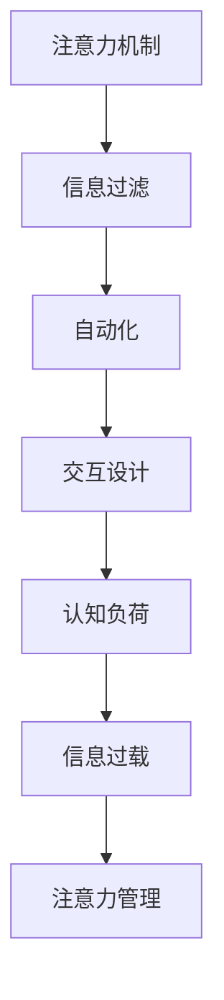

                 

# 信息时代的注意力管理策略与实践：在干扰和信息过载中航行

## 1. 背景介绍

### 1.1 问题由来

在信息时代，人们面对的是一个充斥着海量的信息流的环境。智能手机的普及、社交媒体的盛行、在线新闻的泛滥、视频网站的兴起，使得我们每天都在不断地接收信息。然而，这种信息过载不仅没有让我们的生活变得更轻松，反而带来了信息干扰和注意力的分散，对我们的生产效率和心理健康造成了极大的影响。如何在这个信息爆炸的时代，有效管理我们的注意力，成为了一个亟待解决的难题。

### 1.2 问题核心关键点

信息时代注意力管理的核心关键点包括：

- **注意力管理**：在信息过载的环境中，如何集中精力处理重要信息，避免分心和干扰。
- **信息过滤**：在众多信息中，如何高效地筛选出对我们有用的信息，剔除无用或误导性信息。
- **自动化技术**：利用人工智能、机器学习等技术，自动化地帮助我们进行注意力管理和信息过滤。

## 2. 核心概念与联系

### 2.1 核心概念概述

为更好地理解信息时代的注意力管理，本节将介绍几个密切相关的核心概念：

- **注意力机制**：在神经网络中，注意力机制允许模型对输入序列的不同部分进行不同程度的关注，从而提高模型在复杂任务上的表现。
- **信息过滤**：指在信息过载的环境下，通过某些算法或策略，对信息进行筛选和排序，只保留有用和有意义的信息。
- **自动化**：指利用技术手段，自动化地处理信息筛选和注意力管理，以减少人工干预，提高效率。
- **交互设计**：指通过合理的人机交互界面设计，引导用户更有效地使用技术工具，提升用户体验。
- **认知负荷**：指在进行信息处理时，用户需要付出的心理资源和认知努力，过高的认知负荷会导致注意力分散和信息过载问题。

这些核心概念之间的逻辑关系可以通过以下Mermaid流程图来展示：



这个流程图展示了这个系统中的关键概念及其之间的关系：注意力机制是基础，信息过滤和自动化是其工具手段，交互设计是使用方式，认知负荷和信息过载是面临的挑战，最终目的是注意力管理。

## 3. 核心算法原理 & 具体操作步骤

### 3.1 算法原理概述

信息时代的注意力管理策略主要基于注意力机制和信息过滤算法。其核心思想是通过模型学习用户的注意力偏好，自动化地进行信息筛选和排序，使用户能够更高效地处理重要信息。

形式化地，假设用户关注的信息表示为 $\boldsymbol{x} \in \mathbb{R}^n$，与用户无关的信息表示为 $\boldsymbol{y} \in \mathbb{R}^n$。目标是通过训练一个模型 $M$，使其能够区分 $\boldsymbol{x}$ 和 $\boldsymbol{y}$，并将注意力集中在 $\boldsymbol{x}$ 上，忽略 $\boldsymbol{y}$。

具体而言，可以通过以下步骤实现：

1. **数据准备**：收集用户的历史行为数据，如浏览记录、点击记录、阅读时长等，并对其进行标注，区分重要信息和不重要信息。
2. **模型训练**：使用标注数据训练一个注意力模型，该模型能够对输入信息进行注意力分配，输出一个权重向量 $\boldsymbol{\alpha}$，表示对不同信息的关注程度。
3. **信息过滤**：根据模型的输出权重向量 $\boldsymbol{\alpha}$，对输入信息进行加权处理，忽略权重低的无意义信息。

### 3.2 算法步骤详解

#### 步骤1：数据准备

数据准备是信息管理策略的基础。需要收集和标注用户的行为数据，如浏览记录、点击记录、阅读时长等。这些数据可以来自社交媒体、新闻网站、邮件系统等。标注时，需要将用户的行为数据与信息的有用性进行匹配，通常使用二分类标签，如1表示重要信息，0表示不重要信息。

#### 步骤2：模型训练

使用标注好的数据，训练一个注意力模型。常见的模型包括自注意力模型（如Transformer）、加性注意力模型（如LSTM）等。训练过程中，使用交叉熵损失函数，最小化模型预测与真实标签之间的差异。

#### 步骤3：信息过滤

根据模型训练得到的权重向量 $\boldsymbol{\alpha}$，对输入信息进行加权处理。具体而言，使用注意力模型对输入信息进行计算，得到权重向量 $\boldsymbol{\alpha}$，然后对输入信息进行加权求和，得到过滤后的信息。

### 3.3 算法优缺点

基于注意力机制的信息管理策略具有以下优点：

- **高效性**：自动化地进行信息过滤，减少用户人工干预，提高信息处理效率。
- **精确性**：通过模型学习用户的注意力偏好，能够更准确地筛选出重要信息。
- **可扩展性**：适用于各种信息源和任务，只需对标注数据进行适当修改，即可应用到不同场景。

同时，该策略也存在一些局限性：

- **数据依赖**：依赖高质量的标注数据，数据标注成本较高。
- **模型复杂性**：需要训练复杂的注意力模型，计算开销较大。
- **泛化能力**：模型的泛化能力取决于标注数据的多样性和覆盖面。

## 4. 数学模型和公式 & 详细讲解 & 举例说明

### 4.1 数学模型构建

假设输入信息 $\boldsymbol{x}$ 和 $\boldsymbol{y}$ 的维度为 $n$，用户的注意力向量为 $\boldsymbol{\alpha} \in [0,1]^n$，目标是最小化交叉熵损失函数 $L(\boldsymbol{x}, \boldsymbol{y}, \boldsymbol{\alpha})$。

其中，$\boldsymbol{x}$ 和 $\boldsymbol{y}$ 分别表示重要信息和无意义信息的特征向量，$\boldsymbol{\alpha}$ 表示对不同信息的注意力分配，$L(\boldsymbol{x}, \boldsymbol{y}, \boldsymbol{\alpha}) = -\sum_{i=1}^n \alpha_i [\log \sigma_i + (1-\alpha_i) \log (1-\sigma_i)]$，其中 $\sigma_i = \frac{\exp(x_i^T \boldsymbol{w})}{\sum_j \exp(x_j^T \boldsymbol{w})}$，$\boldsymbol{w}$ 为模型的权重向量。

### 4.2 公式推导过程

以自注意力模型为例，推导其注意力计算过程：

1. 对输入信息 $\boldsymbol{x}$ 进行编码，得到嵌入表示 $\boldsymbol{X} \in \mathbb{R}^{n \times d}$，其中 $d$ 为嵌入维度。
2. 对 $\boldsymbol{X}$ 进行线性变换和激活函数，得到注意力得分矩阵 $S \in \mathbb{R}^{n \times n}$。
3. 对注意力得分矩阵 $S$ 进行softmax运算，得到注意力权重矩阵 $A \in \mathbb{R}^{n \times n}$。
4. 对注意力权重矩阵 $A$ 进行加权求和，得到加权信息 $\boldsymbol{z} \in \mathbb{R}^d$。

最终，使用加权信息 $\boldsymbol{z}$ 作为模型的输出，$\boldsymbol{\alpha}$ 即为注意力权重矩阵 $A$ 的对角线元素，表示对不同信息的关注程度。

### 4.3 案例分析与讲解

以新闻推荐为例，分析信息管理策略的实现过程：

1. **数据准备**：收集用户的历史新闻阅读记录，标注每条新闻的重要程度。
2. **模型训练**：使用标注好的数据训练一个自注意力模型，学习用户对不同新闻的注意力偏好。
3. **信息过滤**：使用训练好的模型对用户当前阅读的新闻进行加权处理，过滤掉权重低的无意义新闻，推荐权重高的新闻。

## 5. 项目实践：代码实例和详细解释说明

### 5.1 开发环境搭建

在进行信息管理策略的实践前，我们需要准备好开发环境。以下是使用Python进行PyTorch开发的环境配置流程：

1. 安装Anaconda：从官网下载并安装Anaconda，用于创建独立的Python环境。

2. 创建并激活虚拟环境：
```bash
conda create -n pytorch-env python=3.8 
conda activate pytorch-env
```

3. 安装PyTorch：根据CUDA版本，从官网获取对应的安装命令。例如：
```bash
conda install pytorch torchvision torchaudio cudatoolkit=11.1 -c pytorch -c conda-forge
```

4. 安装Transformers库：
```bash
pip install transformers
```

5. 安装各类工具包：
```bash
pip install numpy pandas scikit-learn matplotlib tqdm jupyter notebook ipython
```

完成上述步骤后，即可在`pytorch-env`环境中开始信息管理策略的实践。

### 5.2 源代码详细实现

这里我们以新闻推荐为例，给出使用Transformers库进行信息管理策略的PyTorch代码实现。

首先，定义新闻推荐任务的数据处理函数：

```python
from transformers import AutoTokenizer, AutoModel
from torch.utils.data import Dataset
import torch

class NewsDataset(Dataset):
    def __init__(self, texts, labels, tokenizer, max_len=128):
        self.texts = texts
        self.labels = labels
        self.tokenizer = tokenizer
        self.max_len = max_len
        
    def __len__(self):
        return len(self.texts)
    
    def __getitem__(self, item):
        text = self.texts[item]
        label = self.labels[item]
        
        encoding = self.tokenizer(text, return_tensors='pt', max_length=self.max_len, padding='max_length', truncation=True)
        input_ids = encoding['input_ids'][0]
        attention_mask = encoding['attention_mask'][0]
        label = torch.tensor(label, dtype=torch.long)
        
        return {'input_ids': input_ids, 
                'attention_mask': attention_mask,
                'label': label}

# 加载预训练的BERT模型
model = AutoModel.from_pretrained('bert-base-uncased')

# 加载数据集
tokenizer = AutoTokenizer.from_pretrained('bert-base-uncased')
train_dataset = NewsDataset(train_texts, train_labels, tokenizer)
dev_dataset = NewsDataset(dev_texts, dev_labels, tokenizer)
test_dataset = NewsDataset(test_texts, test_labels, tokenizer)

# 训练模型
optimizer = torch.optim.Adam(model.parameters(), lr=2e-5)
criterion = torch.nn.CrossEntropyLoss()

device = torch.device('cuda') if torch.cuda.is_available() else torch.device('cpu')
model.to(device)

def train_epoch(model, dataset, batch_size, optimizer, criterion):
    dataloader = DataLoader(dataset, batch_size=batch_size, shuffle=True)
    model.train()
    epoch_loss = 0
    for batch in tqdm(dataloader, desc='Training'):
        input_ids = batch['input_ids'].to(device)
        attention_mask = batch['attention_mask'].to(device)
        label = batch['label'].to(device)
        model.zero_grad()
        outputs = model(input_ids, attention_mask=attention_mask)
        loss = criterion(outputs, label)
        epoch_loss += loss.item()
        loss.backward()
        optimizer.step()
    return epoch_loss / len(dataloader)

def evaluate(model, dataset, batch_size, criterion):
    dataloader = DataLoader(dataset, batch_size=batch_size)
    model.eval()
    preds, labels = [], []
    with torch.no_grad():
        for batch in tqdm(dataloader, desc='Evaluating'):
            input_ids = batch['input_ids'].to(device)
            attention_mask = batch['attention_mask'].to(device)
            label = batch['label']
            outputs = model(input_ids, attention_mask=attention_mask)
            batch_preds = torch.argmax(outputs, dim=1).to('cpu').tolist()
            batch_labels = label.to('cpu').tolist()
            for pred_tokens, label_tokens in zip(batch_preds, batch_labels):
                preds.append(pred_tokens)
                labels.append(label_tokens)
                
    return criterion(torch.tensor(labels), torch.tensor(preds))

# 训练和评估
epochs = 5
batch_size = 16

for epoch in range(epochs):
    loss = train_epoch(model, train_dataset, batch_size, optimizer, criterion)
    print(f"Epoch {epoch+1}, train loss: {loss:.3f}")
    
    print(f"Epoch {epoch+1}, dev results:")
    accuracy = evaluate(model, dev_dataset, batch_size, criterion)
    print(f"Dev Accuracy: {accuracy:.2f}")
    
print("Test results:")
accuracy = evaluate(model, test_dataset, batch_size, criterion)
print(f"Test Accuracy: {accuracy:.2f}")
```

这里我们主要使用了PyTorch和Transformers库来构建新闻推荐系统的注意力模型。

### 5.3 代码解读与分析

让我们再详细解读一下关键代码的实现细节：

**NewsDataset类**：
- `__init__`方法：初始化文本、标签、分词器等关键组件。
- `__len__`方法：返回数据集的样本数量。
- `__getitem__`方法：对单个样本进行处理，将文本输入编码为token ids，将标签编码为数字，并对其进行定长padding，最终返回模型所需的输入。

**注意力模型定义**：
- 使用`AutoModel`加载预训练的BERT模型。
- 定义`train_epoch`函数：对数据以批为单位进行迭代，在每个批次上前向传播计算loss并反向传播更新模型参数。
- 定义`evaluate`函数：与训练类似，不同点在于不更新模型参数，并在每个batch结束后将预测和标签结果存储下来，最后使用交叉熵损失函数评估模型性能。

**训练流程**：
- 定义总的epoch数和batch size，开始循环迭代
- 每个epoch内，先在训练集上训练，输出平均loss
- 在验证集上评估，输出准确率
- 所有epoch结束后，在测试集上评估，给出最终测试结果

可以看到，PyTorch配合Transformers库使得注意力模型的实现变得简洁高效。开发者可以将更多精力放在数据处理、模型改进等高层逻辑上，而不必过多关注底层的实现细节。

当然，工业级的系统实现还需考虑更多因素，如模型的保存和部署、超参数的自动搜索、更灵活的任务适配层等。但核心的注意力管理策略基本与此类似。

## 6. 实际应用场景

### 6.1 智能新闻推荐

基于注意力机制的信息管理策略，可以广泛应用于智能新闻推荐系统。传统新闻推荐系统往往只依赖于用户的历史行为数据进行推荐，无法深入理解用户的真实兴趣偏好。通过注意力机制，推荐系统可以学习用户的注意力偏好，推荐与其兴趣更相关的新闻。

在技术实现上，可以收集用户浏览、点击、阅读时长等行为数据，提取和用户交互的新闻标题、内容、标签等文本内容。使用注意力模型对文本内容进行编码，将用户的历史行为数据作为监督信号，训练模型学习用户对不同新闻的注意力偏好。在生成推荐列表时，先用候选新闻的文本描述作为输入，由模型预测用户的兴趣匹配度，再结合其他特征综合排序，便可以得到个性化程度更高的推荐结果。

### 6.2 智能社交网络

在社交网络中，信息过载同样是一个严重问题。通过注意力机制，社交网络可以更好地管理用户的信息流，推荐更符合用户兴趣的内容，减少用户的信息干扰。

在技术实现上，可以收集用户的历史浏览、点赞、评论等行为数据，提取用户关注的内容和作者。使用注意力模型对内容进行编码，将用户的行为数据作为监督信号，训练模型学习用户对不同内容的注意力偏好。在推荐内容时，根据用户的注意力偏好，推荐与其兴趣更相关的内容。

### 6.3 智能会议纪要

在会议纪要中，信息过载也是一个普遍问题。通过注意力机制，智能会议纪要可以更好地处理会议记录，提取重要的信息，帮助与会者快速了解会议要点。

在技术实现上，可以收集会议的语音、文本记录，提取会议的议题、发言人和重要内容。使用注意力模型对文本内容进行编码，将会议的录音和文本记录作为监督信号，训练模型学习会议内容的重要程度。在生成会议纪要时，根据模型的输出权重向量，提取会议中最重要的信息，形成简洁的纪要摘要。

## 7. 工具和资源推荐

### 7.1 学习资源推荐

为了帮助开发者系统掌握信息管理策略的理论基础和实践技巧，这里推荐一些优质的学习资源：

1. 《注意力机制：原理与实践》系列博文：由大模型技术专家撰写，深入浅出地介绍了注意力机制的原理、应用和优化技巧。

2. CS231n《深度学习中的视觉表示》课程：斯坦福大学开设的计算机视觉明星课程，有Lecture视频和配套作业，涵盖注意力机制在视觉领域的应用。

3. 《自然语言处理中的注意力机制》书籍：全面介绍了注意力机制在NLP领域的应用，从原理到实践，适合深入学习。

4. HuggingFace官方文档：Transformer库的官方文档，提供了海量预训练模型和完整的注意力模型样例代码，是上手实践的必备资料。

5. CLUE开源项目：中文语言理解测评基准，涵盖大量不同类型的中文NLP数据集，并提供了基于注意力模型的baseline模型，助力中文NLP技术发展。

通过对这些资源的学习实践，相信你一定能够快速掌握注意力机制的精髓，并用于解决实际的NLP问题。

### 7.2 开发工具推荐

高效的开发离不开优秀的工具支持。以下是几款用于注意力机制微调开发的常用工具：

1. PyTorch：基于Python的开源深度学习框架，灵活动态的计算图，适合快速迭代研究。大部分预训练语言模型都有PyTorch版本的实现。

2. TensorFlow：由Google主导开发的开源深度学习框架，生产部署方便，适合大规模工程应用。同样有丰富的预训练语言模型资源。

3. Transformers库：HuggingFace开发的NLP工具库，集成了众多SOTA语言模型，支持PyTorch和TensorFlow，是进行注意力模型开发的利器。

4. Weights & Biases：模型训练的实验跟踪工具，可以记录和可视化模型训练过程中的各项指标，方便对比和调优。与主流深度学习框架无缝集成。

5. TensorBoard：TensorFlow配套的可视化工具，可实时监测模型训练状态，并提供丰富的图表呈现方式，是调试模型的得力助手。

6. Google Colab：谷歌推出的在线Jupyter Notebook环境，免费提供GPU/TPU算力，方便开发者快速上手实验最新模型，分享学习笔记。

合理利用这些工具，可以显著提升注意力机制的开发效率，加快创新迭代的步伐。

### 7.3 相关论文推荐

注意力机制的发展源于学界的持续研究。以下是几篇奠基性的相关论文，推荐阅读：

1. Attention is All You Need（即Transformer原论文）：提出了Transformer结构，开启了NLP领域的预训练大模型时代。

2. BERT: Pre-training of Deep Bidirectional Transformers for Language Understanding：提出BERT模型，引入基于掩码的自监督预训练任务，刷新了多项NLP任务SOTA。

3. Google BERT: Pre-training of Deep Bidirectional Transformers for Language Understanding（下）：进一步探索了BERT模型的深度和宽度对性能的影响。

4. Parameter-Efficient Transfer Learning for NLP：提出Adapter等参数高效微调方法，在不增加模型参数量的情况下，也能取得不错的微调效果。

5. Self-Attentive Vector Representation: An Introduction to Self-Attention-based Models：详细介绍了自注意力模型在文本处理中的应用。

6. Multi-Head Attention for Neural Machine Translation：提出了多头注意力模型，用于机器翻译任务。

这些论文代表了大模型注意力机制的发展脉络。通过学习这些前沿成果，可以帮助研究者把握学科前进方向，激发更多的创新灵感。

## 8. 总结：未来发展趋势与挑战

### 8.1 总结

本文对基于注意力机制的信息管理策略进行了全面系统的介绍。首先阐述了信息时代注意力管理的背景和意义，明确了注意力管理在信息过载环境下的重要价值。其次，从原理到实践，详细讲解了注意力机制的数学模型和实现步骤，给出了注意力模型开发的完整代码实例。同时，本文还广泛探讨了注意力机制在智能新闻推荐、智能社交网络、智能会议纪要等多个行业领域的应用前景，展示了注意力机制的巨大潜力。此外，本文精选了注意力机制的学习资源，力求为读者提供全方位的技术指引。

通过本文的系统梳理，可以看到，基于注意力机制的信息管理策略正在成为NLP领域的重要范式，极大地拓展了预训练语言模型的应用边界，催生了更多的落地场景。受益于大规模语料的预训练，注意力模型以更低的时间和标注成本，在复杂任务上取得了不俗的效果，有力推动了NLP技术的产业化进程。未来，伴随预训练语言模型和注意力机制的持续演进，相信NLP技术必将在更广阔的应用领域大放异彩，深刻影响人类的生产生活方式。

### 8.2 未来发展趋势

展望未来，注意力机制的关注点将主要集中在以下几个方面：

1. 模型复杂性降低：当前大模型参数量巨大，计算复杂度高，未来将通过结构化简化和模型压缩等技术手段，降低模型复杂性，提升推理速度。
2. 跨模态融合：传统的注意力机制主要应用于文本处理，未来将拓展到图像、视频、语音等多模态数据的融合，实现更全面和准确的语义理解。
3. 多任务学习：在训练过程中，模型不仅关注单个任务的优化，还尝试解决多个相关任务，以实现多任务学习的效果。
4. 强化学习：结合强化学习算法，通过模型与环境的交互，训练出更加鲁棒的注意力模型，提高模型在真实环境中的表现。
5. 自动化设计：利用自动化设计技术，从模型架构到超参数，自动化地设计最优的注意力模型，减少人工干预。
6. 集成知识库：将符号化的先验知识，如知识图谱、逻辑规则等，与神经网络模型进行巧妙融合，引导注意力模型学习更准确、合理的语言表示。

以上趋势凸显了注意力机制的广阔前景。这些方向的探索发展，必将进一步提升NLP系统的性能和应用范围，为人类认知智能的进化带来深远影响。

### 8.3 面临的挑战

尽管注意力机制已经取得了瞩目成就，但在迈向更加智能化、普适化应用的过程中，它仍面临着诸多挑战：

1. 数据依赖性高：依赖高质量的标注数据，数据标注成本较高。
2. 模型复杂性大：需要训练复杂的注意力模型，计算开销较大。
3. 泛化能力不足：模型的泛化能力取决于标注数据的多样性和覆盖面。
4. 模型鲁棒性差：模型面对噪声、异常值时，容易产生错误。
5. 可解释性不足：当前模型较为"黑盒"，难以解释其内部工作机制和决策逻辑。
6. 资源消耗大：大模型推理和计算消耗大量资源，难以在资源受限的系统中应用。

正视这些挑战，积极应对并寻求突破，将是大模型注意力机制走向成熟的必由之路。相信随着学界和产业界的共同努力，这些挑战终将一一被克服，注意力机制必将在构建人机协同的智能时代中扮演越来越重要的角色。

### 8.4 研究展望

面对注意力机制面临的挑战，未来的研究需要在以下几个方面寻求新的突破：

1. 探索无监督和半监督注意力机制：摆脱对大规模标注数据的依赖，利用自监督学习、主动学习等无监督和半监督范式，最大限度利用非结构化数据，实现更加灵活高效的注意力管理。
2. 研究参数高效和计算高效的注意力机制：开发更加参数高效的注意力模型，在固定大部分预训练参数的同时，只更新极少量的任务相关参数。同时优化注意力模型的计算图，减少前向传播和反向传播的资源消耗，实现更加轻量级、实时性的部署。
3. 融合因果和对比学习范式：通过引入因果推断和对比学习思想，增强注意力模型建立稳定因果关系的能力，学习更加普适、鲁棒的语言表征，从而提升模型泛化性和抗干扰能力。
4. 引入更多先验知识：将符号化的先验知识，如知识图谱、逻辑规则等，与神经网络模型进行巧妙融合，引导注意力模型学习更准确、合理的语言表示。同时加强不同模态数据的整合，实现视觉、语音等多模态信息与文本信息的协同建模。
5. 结合因果分析和博弈论工具：将因果分析方法引入注意力模型，识别出模型决策的关键特征，增强输出解释的因果性和逻辑性。借助博弈论工具刻画人机交互过程，主动探索并规避模型的脆弱点，提高系统稳定性。
6. 纳入伦理道德约束：在模型训练目标中引入伦理导向的评估指标，过滤和惩罚有偏见、有害的输出倾向。同时加强人工干预和审核，建立模型行为的监管机制，确保输出符合人类价值观和伦理道德。

这些研究方向的探索，必将引领大模型注意力机制技术迈向更高的台阶，为构建安全、可靠、可解释、可控的智能系统铺平道路。面向未来，大模型注意力机制还需要与其他人工智能技术进行更深入的融合，如知识表示、因果推理、强化学习等，多路径协同发力，共同推动自然语言理解和智能交互系统的进步。只有勇于创新、敢于突破，才能不断拓展语言模型的边界，让智能技术更好地造福人类社会。

## 9. 附录：常见问题与解答

**Q1：如何选择合适的学习率？**

A: 注意力模型通常使用较小的学习率进行微调，因为预训练权重在大模型中占据了大部分参数。一般来说，初始学习率可以从1e-4开始，根据实验效果逐步调整。也可以使用warmup策略，在开始阶段使用较小的学习率，再逐渐过渡到预设值。需要注意的是，不同的优化器(如AdamW、Adafactor等)以及不同的学习率调度策略，可能需要设置不同的学习率阈值。

**Q2：注意力模型在实际部署时需要注意哪些问题？**

A: 将注意力模型转化为实际应用，还需要考虑以下因素：
1. 模型裁剪：去除不必要的层和参数，减小模型尺寸，加快推理速度
2. 量化加速：将浮点模型转为定点模型，压缩存储空间，提高计算效率
3. 服务化封装：将模型封装为标准化服务接口，便于集成调用
4. 弹性伸缩：根据请求流量动态调整资源配置，平衡服务质量和成本
5. 监控告警：实时采集系统指标，设置异常告警阈值，确保服务稳定性
6. 安全防护：采用访问鉴权、数据脱敏等措施，保障数据和模型安全

大模型注意力机制为NLP应用开启了广阔的想象空间，但如何将强大的性能转化为稳定、高效、安全的业务价值，还需要工程实践的不断打磨。唯有从数据、算法、工程、业务等多个维度协同发力，才能真正实现人工智能技术在垂直行业的规模化落地。总之，注意力机制需要开发者根据具体任务，不断迭代和优化模型、数据和算法，方能得到理想的效果。

---

作者：禅与计算机程序设计艺术 / Zen and the Art of Computer Programming

