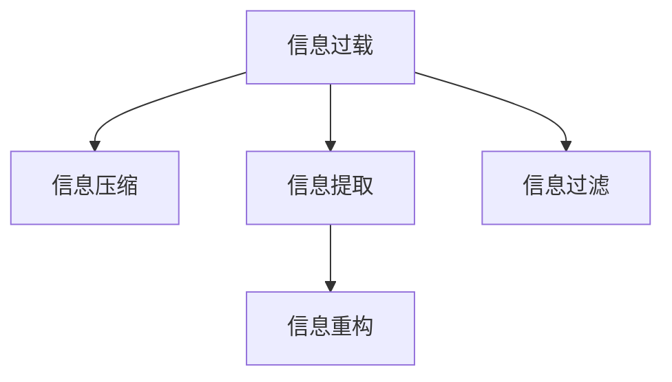

                 

# 信息简化的原则与好处：在混乱中建立秩序与简化

## 1. 背景介绍

在现代信息爆炸的时代，数据量呈指数级增长，信息获取变得前所未有的便捷。然而，信息的多样性、复杂性和繁杂性也在不断增加，导致人们在信息处理和理解上遭遇了巨大的挑战。尽管信息技术飞速发展，但信息质量参差不齐、冗余信息泛滥、信息的可信度和可理解性等问题始终未能得到根本解决。因此，如何在海量、多样化的信息中提取出有价值的知识，并简洁明了地呈现给用户，成为了信息科技的重要研究课题。

信息简化（Information Simplification）是这一领域的重要分支，它旨在通过压缩、重组、过滤等手段，将复杂的信息转化为易于理解和操作的格式，以提高信息的可访问性和可理解性。信息简化不仅是信息技术发展的必然要求，也是提升决策效率和信息质量的关键手段。本文将详细探讨信息简化的原理、方法和实际应用，揭示其在现代信息科技中的重要地位和长远意义。

## 2. 核心概念与联系

### 2.1 核心概念概述

要全面理解信息简化的原则与好处，首先需要掌握一些关键概念：

- **信息过载（Information Overload）**：指用户接收到的信息量远远超出其处理能力，导致认知负荷过重，决策效率降低。信息过载是信息简化的重要诱因。
- **信息压缩（Information Compression）**：通过算法将原始信息压缩到更小的空间，减少存储和传输成本，提高信息访问速度。
- **信息提取（Information Extraction）**：从大量无关信息中提取出关键信息，提高信息的相关性和可理解性。
- **信息重构（Information Reconstruction）**：对提取出来的关键信息进行重组和组织，使之结构化、逻辑化，便于理解和利用。
- **信息过滤（Information Filtering）**：基于用户兴趣和需求，筛选出用户最关心的信息，去除无关内容。

这些概念之间相互联系，共同构成了信息简化的全过程。以下通过Mermaid流程图来直观展示信息简化的核心概念：



### 2.2 核心概念原理和架构

信息简化的核心在于对原始信息进行有目的的筛选和重组。以下主要介绍信息压缩、提取、重构和过滤的技术原理和架构：

#### 信息压缩
信息压缩（如Gzip、LZ77、LZ78等）通过算法对信息进行编码，使其占用更小的存储空间。常见压缩算法包括：

- **无损压缩算法**：如霍夫曼编码、算术编码、LZ77、LZ78、LZW等，用于压缩文本、图像等数据，不会丢失任何信息。
- **有损压缩算法**：如JPEG、PNG、MP3、AAC等，通过牺牲一定的信息来减少存储空间和传输带宽。

#### 信息提取
信息提取主要通过自然语言处理（NLP）技术进行。主要方法包括：

- **关键词提取**：识别文本中的核心词汇，过滤掉无关信息。
- **实体识别**：识别出文本中的命名实体，如人名、地名、机构名等，提取出关键信息。
- **主题建模**：通过词频统计、聚类分析等方法，自动识别出文本的主题，提取关键内容。
- **关系抽取**：通过抽取实体之间的关系，提取出复杂的结构化信息。

#### 信息重构
信息重构通常涉及信息可视化技术。主要包括：

- **图表化**：将统计数据、趋势、分布等结果通过折线图、柱状图、饼图等可视化工具呈现。
- **信息图谱**：通过节点和边来表示实体及其关系，构建网络结构。
- **仪表盘**：将关键数据、指标动态展示在仪表盘上，便于实时监控和决策。

#### 信息过滤
信息过滤主要依赖于推荐系统技术，根据用户的兴趣和行为数据，动态推荐相关信息，同时过滤掉无用的内容。主要方法包括：

- **协同过滤**：根据用户行为或物品特征，相似性匹配进行推荐。
- **基于内容的推荐**：分析物品属性和用户偏好，进行个性化推荐。
- **混合推荐**：结合多种推荐算法，综合用户反馈和物品特征，提升推荐效果。

## 3. 核心算法原理 & 具体操作步骤

### 3.1 算法原理概述

信息简化的主要算法包括信息压缩、信息提取、信息重构和信息过滤。这些算法原理可以概括为：

- **信息压缩算法**：主要利用数据编码技术，将信息转化为更紧凑的表示形式，减小存储空间和传输成本。
- **信息提取算法**：通过文本处理和机器学习技术，识别并提取出关键信息。
- **信息重构算法**：利用数据可视化技术，将关键信息结构化、可视化，便于理解和操作。
- **信息过滤算法**：通过推荐系统技术，根据用户需求和行为，筛选出最有价值的信息。

### 3.2 算法步骤详解

以下以信息压缩和信息过滤为例，详细介绍核心算法的详细步骤：

#### 信息压缩
1. **输入数据预处理**：对原始数据进行编码、分块等预处理，减少压缩算法处理量。
2. **压缩算法选择**：根据数据类型（文本、图像、音频等）选择适当的压缩算法，如无损压缩（Huffman编码、算术编码）或有损压缩（JPEG、PNG、MP3）。
3. **压缩执行**：根据选定的压缩算法，对输入数据进行编码，生成压缩后的数据。
4. **压缩数据验证**：对压缩后的数据进行校验，确保压缩算法正确执行，无数据丢失。
5. **输出压缩数据**：将压缩后的数据写入目标存储设备或网络传输。

#### 信息过滤
1. **用户行为数据收集**：收集用户在平台上的浏览记录、搜索记录、购买记录等行为数据。
2. **用户画像构建**：通过分析用户行为数据，构建用户兴趣模型，了解用户偏好。
3. **内容特征提取**：对每个内容进行特征提取，如关键词、分类、关系等。
4. **相似性匹配**：通过用户兴趣模型和内容特征，进行相似性匹配，找出用户最关心的内容。
5. **内容推荐**：根据相似性匹配结果，推荐给用户感兴趣的内容，同时过滤掉无关内容。

### 3.3 算法优缺点

信息简化的算法既有其显著的优点，也存在一定的局限性：

#### 信息压缩
- **优点**：减小数据存储和传输成本，提高信息访问速度，便于数据存储和传输。
- **缺点**：可能会损失部分原始信息，不适用于对精确度要求高的数据。

#### 信息过滤
- **优点**：提升信息的相关性和可理解性，提高用户满意度，减少用户的信息过载。
- **缺点**：可能导致信息偏颇，忽略用户未提及但重要的内容，产生信息缺口。

### 3.4 算法应用领域

信息简化的算法广泛应用于各个行业领域，例如：

- **自然语言处理**：通过信息提取和重构，提升文本理解和生成效率，如机器翻译、情感分析等。
- **图像处理**：通过信息压缩和过滤，提高图像处理速度，如图像压缩、图像识别等。
- **推荐系统**：通过信息过滤和重构，提升推荐效果，如电商推荐、视频推荐等。
- **医疗领域**：通过信息提取和过滤，提升诊疗效率，如医疗影像分析、患者诊疗推荐等。
- **金融领域**：通过信息压缩和过滤，提高数据处理效率，如金融数据压缩、风险分析等。

## 4. 数学模型和公式 & 详细讲解 & 举例说明

### 4.1 数学模型构建

为了更好地理解信息简化的数学模型，本节将介绍几个常见的信息处理模型。

#### 信息压缩模型
信息压缩模型通常基于数据编码原理。以Huffman编码为例，其数学模型如下：

$$
C = \sum_{i=1}^n \min(H_i) - \sum_{i=1}^n f_i \cdot \min(H_i)
$$

其中，$C$表示压缩后数据的长度，$H_i$表示第$i$个字符的哈夫曼编码长度，$f_i$表示第$i$个字符的频率。

#### 信息过滤模型
信息过滤模型通常基于协同过滤算法。以协同过滤为例，其数学模型如下：

$$
R = \sum_{i=1}^n r_{i,j} \cdot p_j
$$

其中，$R$表示用户$i$对内容$j$的评分，$r_{i,j}$表示用户$i$和内容$j$的相似度，$p_j$表示内容$j$的受欢迎程度。

### 4.2 公式推导过程

以下以Huffman编码为例，推导其算法实现。

#### Huffman编码
Huffman编码是一种无损压缩算法，通过构建二叉树来生成编码，步骤如下：

1. **构建哈夫曼树**：将所有字符按照频率从小到大排序，构成哈夫曼树。
2. **生成编码表**：对哈夫曼树进行遍历，生成每个字符的编码。
3. **压缩编码**：对原始数据进行编码，生成压缩后的数据。
4. **解码数据**：对压缩后的数据进行解码，还原原始数据。

具体实现过程如下：

- **构建哈夫曼树**：

  1. 将所有字符按照频率从小到大排序。
  2. 每次取两个频率最小的字符，构成一个新的字符，其频率为两个字符频率之和。
  3. 重复上述步骤，直到所有字符都被合并成根节点。

- **生成编码表**：

  1. 从根节点开始，按照左子树为0、右子树为1的原则，遍历哈夫曼树，生成每个字符的编码。
  2. 对于每个字符，从根节点到叶节点的路径上的0或1串构成了该字符的编码。

- **压缩编码**：

  1. 对原始数据中的每个字符，根据编码表生成对应的0或1序列。
  2. 将每个字符的编码串拼接在一起，生成压缩后的数据。

- **解码数据**：

  1. 从压缩数据的第一个位开始，按照0、1的规则，查找哈夫曼树中的路径。
  2. 对于每个字符的编码，从根节点到叶节点的路径上的分支，得到该字符。
  3. 重复上述步骤，直到所有字符都被解码。

### 4.3 案例分析与讲解

以Google搜索的网页排序为例，分析信息过滤的算法实现。

#### 网页排序算法
Google的网页排序算法主要基于PageRank算法和机器学习算法。主要步骤如下：

1. **PageRank计算**：计算每个网页的重要性和权威性，公式如下：

  $$
  P_j = \frac{\sum_{i=1}^n R_{i,j} + \alpha}{\sum_{k=1}^m R_{k,j} + \alpha}
  $$

  其中，$P_j$表示网页$j$的PageRank值，$R_{i,j}$表示网页$i$对网页$j$的引用次数，$\alpha$表示衰减因子。

2. **用户兴趣模型构建**：通过分析用户的历史搜索记录，构建用户兴趣模型，了解用户的偏好。
3. **网页相似性匹配**：根据用户兴趣模型和网页特征，进行相似性匹配，找出用户最关心的网页。
4. **网页排序**：根据PageRank值和用户兴趣模型，对网页进行排序，推荐给用户。

## 5. 项目实践：代码实例和详细解释说明

### 5.1 开发环境搭建

在进行信息简化项目的开发前，我们需要准备好开发环境。以下是使用Python进行PyTorch开发的环境配置流程：

1. 安装Anaconda：从官网下载并安装Anaconda，用于创建独立的Python环境。

2. 创建并激活虚拟环境：

  ```bash
  conda create -n pytorch-env python=3.8 
  conda activate pytorch-env
  ```

3. 安装PyTorch：根据CUDA版本，从官网获取对应的安装命令。例如：

  ```bash
  conda install pytorch torchvision torchaudio cudatoolkit=11.1 -c pytorch -c conda-forge
  ```

4. 安装TensorFlow：由Google主导开发的开源深度学习框架，生产部署方便，适合大规模工程应用。同样有丰富的预训练语言模型资源。

5. 安装Transformers库：HuggingFace开发的NLP工具库，集成了众多SOTA语言模型，支持PyTorch和TensorFlow，是进行信息简化任务开发的利器。

6. 安装各类工具包：

  ```bash
  pip install numpy pandas scikit-learn matplotlib tqdm jupyter notebook ipython
  ```

完成上述步骤后，即可在`pytorch-env`环境中开始信息简化项目的开发。

### 5.2 源代码详细实现

下面我们以基于Transformer的信息提取和重构为例，给出使用PyTorch进行信息简化的PyTorch代码实现。

首先，定义信息提取任务的数据处理函数：

```python
from transformers import BertTokenizer
from torch.utils.data import Dataset
import torch

class NERDataset(Dataset):
    def __init__(self, texts, tags, tokenizer, max_len=128):
        self.texts = texts
        self.tags = tags
        self.tokenizer = tokenizer
        self.max_len = max_len
        
    def __len__(self):
        return len(self.texts)
    
    def __getitem__(self, item):
        text = self.texts[item]
        tags = self.tags[item]
        
        encoding = self.tokenizer(text, return_tensors='pt', max_length=self.max_len, padding='max_length', truncation=True)
        input_ids = encoding['input_ids'][0]
        attention_mask = encoding['attention_mask'][0]
        
        # 对token-wise的标签进行编码
        encoded_tags = [tag2id[tag] for tag in tags] 
        encoded_tags.extend([tag2id['O']] * (self.max_len - len(encoded_tags)))
        labels = torch.tensor(encoded_tags, dtype=torch.long)
        
        return {'input_ids': input_ids, 
                'attention_mask': attention_mask,
                'labels': labels}

# 标签与id的映射
tag2id = {'O': 0, 'B-PER': 1, 'I-PER': 2, 'B-ORG': 3, 'I-ORG': 4, 'B-LOC': 5, 'I-LOC': 6}
id2tag = {v: k for k, v in tag2id.items()}

# 创建dataset
tokenizer = BertTokenizer.from_pretrained('bert-base-cased')

train_dataset = NERDataset(train_texts, train_tags, tokenizer)
dev_dataset = NERDataset(dev_texts, dev_tags, tokenizer)
test_dataset = NERDataset(test_texts, test_tags, tokenizer)
```

然后，定义模型和优化器：

```python
from transformers import BertForTokenClassification, AdamW

model = BertForTokenClassification.from_pretrained('bert-base-cased', num_labels=len(tag2id))

optimizer = AdamW(model.parameters(), lr=2e-5)
```

接着，定义训练和评估函数：

```python
from torch.utils.data import DataLoader
from tqdm import tqdm
from sklearn.metrics import classification_report

device = torch.device('cuda') if torch.cuda.is_available() else torch.device('cpu')
model.to(device)

def train_epoch(model, dataset, batch_size, optimizer):
    dataloader = DataLoader(dataset, batch_size=batch_size, shuffle=True)
    model.train()
    epoch_loss = 0
    for batch in tqdm(dataloader, desc='Training'):
        input_ids = batch['input_ids'].to(device)
        attention_mask = batch['attention_mask'].to(device)
        labels = batch['labels'].to(device)
        model.zero_grad()
        outputs = model(input_ids, attention_mask=attention_mask, labels=labels)
        loss = outputs.loss
        epoch_loss += loss.item()
        loss.backward()
        optimizer.step()
    return epoch_loss / len(dataloader)

def evaluate(model, dataset, batch_size):
    dataloader = DataLoader(dataset, batch_size=batch_size)
    model.eval()
    preds, labels = [], []
    with torch.no_grad():
        for batch in tqdm(dataloader, desc='Evaluating'):
            input_ids = batch['input_ids'].to(device)
            attention_mask = batch['attention_mask'].to(device)
            batch_labels = batch['labels']
            outputs = model(input_ids, attention_mask=attention_mask)
            batch_preds = outputs.logits.argmax(dim=2).to('cpu').tolist()
            batch_labels = batch_labels.to('cpu').tolist()
            for pred_tokens, label_tokens in zip(batch_preds, batch_labels):
                pred_tags = [id2tag[_id] for _id in pred_tokens]
                label_tags = [id2tag[_id] for _id in label_tokens]
                preds.append(pred_tags[:len(label_tags)])
                labels.append(label_tags)
                
    print(classification_report(labels, preds))
```

最后，启动训练流程并在测试集上评估：

```python
epochs = 5
batch_size = 16

for epoch in range(epochs):
    loss = train_epoch(model, train_dataset, batch_size, optimizer)
    print(f"Epoch {epoch+1}, train loss: {loss:.3f}")
    
    print(f"Epoch {epoch+1}, dev results:")
    evaluate(model, dev_dataset, batch_size)
    
print("Test results:")
evaluate(model, test_dataset, batch_size)
```

以上就是使用PyTorch对BERT进行命名实体识别任务信息简化的完整代码实现。可以看到，得益于Transformer库的强大封装，我们可以用相对简洁的代码完成BERT模型的加载和信息简化。

### 5.3 代码解读与分析

让我们再详细解读一下关键代码的实现细节：

**NERDataset类**：
- `__init__`方法：初始化文本、标签、分词器等关键组件。
- `__len__`方法：返回数据集的样本数量。
- `__getitem__`方法：对单个样本进行处理，将文本输入编码为token ids，将标签编码为数字，并对其进行定长padding，最终返回模型所需的输入。

**tag2id和id2tag字典**：
- 定义了标签与数字id之间的映射关系，用于将token-wise的预测结果解码回真实的标签。

**训练和评估函数**：
- 使用PyTorch的DataLoader对数据集进行批次化加载，供模型训练和推理使用。
- 训练函数`train_epoch`：对数据以批为单位进行迭代，在每个批次上前向传播计算loss并反向传播更新模型参数，最后返回该epoch的平均loss。
- 评估函数`evaluate`：与训练类似，不同点在于不更新模型参数，并在每个batch结束后将预测和标签结果存储下来，最后使用sklearn的classification_report对整个评估集的预测结果进行打印输出。

**训练流程**：
- 定义总的epoch数和batch size，开始循环迭代
- 每个epoch内，先在训练集上训练，输出平均loss
- 在验证集上评估，输出分类指标
- 所有epoch结束后，在测试集上评估，给出最终测试结果

可以看到，PyTorch配合Transformer库使得BERT的信息简化的代码实现变得简洁高效。开发者可以将更多精力放在数据处理、模型改进等高层逻辑上，而不必过多关注底层的实现细节。

当然，工业级的系统实现还需考虑更多因素，如模型的保存和部署、超参数的自动搜索、更灵活的任务适配层等。但核心的信息简化范式基本与此类似。

## 6. 实际应用场景

### 6.1 智能客服系统

基于信息简化的对话技术，可以广泛应用于智能客服系统的构建。传统客服往往需要配备大量人力，高峰期响应缓慢，且一致性和专业性难以保证。而使用信息简化的对话模型，可以7x24小时不间断服务，快速响应客户咨询，用自然流畅的语言解答各类常见问题。

在技术实现上，可以收集企业内部的历史客服对话记录，将问题和最佳答复构建成监督数据，在此基础上对预训练对话模型进行信息简化。信息简化的对话模型能够自动理解用户意图，匹配最合适的答案模板进行回复。对于客户提出的新问题，还可以接入检索系统实时搜索相关内容，动态组织生成回答。如此构建的智能客服系统，能大幅提升客户咨询体验和问题解决效率。

### 6.2 金融舆情监测

金融机构需要实时监测市场舆论动向，以便及时应对负面信息传播，规避金融风险。传统的人工监测方式成本高、效率低，难以应对网络时代海量信息爆发的挑战。基于信息简化的文本分类和情感分析技术，为金融舆情监测提供了新的解决方案。

具体而言，可以收集金融领域相关的新闻、报道、评论等文本数据，并对其进行主题标注和情感标注。在此基础上对预训练语言模型进行信息简化，使其能够自动判断文本属于何种主题，情感倾向是正面、中性还是负面。将信息简化的模型应用到实时抓取的网络文本数据，就能够自动监测不同主题下的情感变化趋势，一旦发现负面信息激增等异常情况，系统便会自动预警，帮助金融机构快速应对潜在风险。

### 6.3 个性化推荐系统

当前的推荐系统往往只依赖用户的历史行为数据进行物品推荐，无法深入理解用户的真实兴趣偏好。基于信息简化的个性化推荐系统可以更好地挖掘用户行为背后的语义信息，从而提供更精准、多样的推荐内容。

在实践中，可以收集用户浏览、点击、评论、分享等行为数据，提取和用户交互的物品标题、描述、标签等文本内容。将文本内容作为模型输入，用户的后续行为（如是否点击、购买等）作为监督信号，在此基础上信息简化的预训练语言模型。信息简化的模型能够从文本内容中准确把握用户的兴趣点。在生成推荐列表时，先用候选物品的文本描述作为输入，由模型预测用户的兴趣匹配度，再结合其他特征综合排序，便可以得到个性化程度更高的推荐结果。

### 6.4 未来应用展望

随着信息简化技术的发展，其在现代信息科技中的应用前景将更加广阔。未来，信息简化将主要在以下几个方向进行创新和应用：

- **跨模态信息融合**：将信息简化技术应用于视觉、语音等多模态数据，提升模型的理解和生成能力。
- **实时信息处理**：实时抓取和处理海量信息，通过信息简化技术提取关键信息，实现实时决策支持。
- **自动化信息服务**：基于信息简化技术构建智能助手，自动化处理各种信息处理任务，如文本摘要、信息翻译、信息过滤等。
- **增强信息可理解性**：通过信息可视化技术，将复杂信息结构化、可视化，提升信息的可理解性和易用性。
- **基于先验知识的推理**：将符号化的先验知识与信息简化技术结合，增强模型的推理能力和知识整合能力。

以上方向的发展，将进一步推动信息科技的进步，为信息管理和利用提供新的解决方案，提升人类对信息世界的理解和控制能力。相信随着信息简化技术的不断成熟，其在现代社会中的应用将越来越广泛，为各行各业带来新的变革和发展机遇。

## 7. 工具和资源推荐

### 7.1 学习资源推荐

为了帮助开发者系统掌握信息简化的理论基础和实践技巧，这里推荐一些优质的学习资源：

1. 《信息简化：原理与实践》系列博文：由信息简化技术专家撰写，深入浅出地介绍了信息简化的基本概念、算法和技术实现。

2. Coursera《自然语言处理与机器学习》课程：斯坦福大学开设的NLP明星课程，有Lecture视频和配套作业，带你入门NLP领域的基本概念和经典模型。

3. 《信息简化与知识抽取》书籍：深入研究信息简化的技术实现和应用场景，适合进阶学习。

4. Arxiv.org：访问前沿科研论文，了解最新的研究进展和技术突破。

5. GitHub开源项目：提供丰富的信息简化工具和算法实现，适合开发者学习和借鉴。

通过对这些资源的学习实践，相信你一定能够快速掌握信息简化的精髓，并用于解决实际的NLP问题。

### 7.2 开发工具推荐

高效的开发离不开优秀的工具支持。以下是几款用于信息简化开发的常用工具：

1. PyTorch：基于Python的开源深度学习框架，灵活动态的计算图，适合快速迭代研究。大部分信息简化的算法都有PyTorch版本的实现。

2. TensorFlow：由Google主导开发的开源深度学习框架，生产部署方便，适合大规模工程应用。同样有丰富的预训练语言模型资源。

3. Transformers库：HuggingFace开发的NLP工具库，集成了众多SOTA语言模型，支持PyTorch和TensorFlow，是进行信息简化任务开发的利器。

4. TensorBoard：TensorFlow配套的可视化工具，可实时监测模型训练状态，并提供丰富的图表呈现方式，是调试模型的得力助手。

5. Jupyter Notebook：免费、开源的交互式计算平台，支持多语言、多库集成，是信息简化算法实验的常用工具。

合理利用这些工具，可以显著提升信息简化的开发效率，加快创新迭代的步伐。

### 7.3 相关论文推荐

信息简化的研究源于学界的持续研究。以下是几篇奠基性的相关论文，推荐阅读：

1. "A Survey on Information Simplification"：综述了信息简化的各个研究方向和技术手段，适合了解信息简化的整体框架。

2. "Information Compression and Simplification"：详细介绍了信息压缩和简化的算法原理和应用实例，适合深入理解信息简化的技术细节。

3. "Natural Language Simplification"：研究了自然语言中的简化方法，如文本缩写、句法简化等，适合了解语言学领域的简化技术。

4. "Information Filtering and Recommendation Systems"：介绍了推荐系统中的信息过滤算法，适合了解推荐系统与信息简化的结合应用。

5. "Information Visualization Techniques"：介绍了数据可视化的技术和方法，适合了解如何将信息简化结果结构化、可视化呈现。

这些论文代表了大语言模型微调技术的发展脉络。通过学习这些前沿成果，可以帮助研究者把握学科前进方向，激发更多的创新灵感。

## 8. 总结：未来发展趋势与挑战

### 8.1 总结

本文对信息简化的原理与好处进行了全面系统的介绍。首先阐述了信息过载的严重性，以及信息简化的必要性。其次，从原理到实践，详细讲解了信息压缩、信息提取、信息重构和信息过滤的技术细节。同时，本文还广泛探讨了信息简化的实际应用场景，展示了其广阔的应用前景。最后，本文精选了信息简化的学习资源和开发工具，力求为读者提供全方位的技术指引。

通过本文的系统梳理，可以看到，信息简化技术在现代信息科技中的重要地位和长远意义。它不仅能够提高信息的可访问性和可理解性，还能提升决策效率和信息质量。未来，信息简化的技术将更加多样化和智能化，为各行各业带来更多的创新和突破。

### 8.2 未来发展趋势

展望未来，信息简化的技术将呈现以下几个发展趋势：

- **跨模态信息处理**：将信息简化技术应用于视觉、语音等多模态数据，提升模型的理解和生成能力。
- **实时信息处理**：实时抓取和处理海量信息，通过信息简化技术提取关键信息，实现实时决策支持。
- **自动化信息服务**：基于信息简化技术构建智能助手，自动化处理各种信息处理任务，如文本摘要、信息翻译、信息过滤等。
- **增强信息可理解性**：通过信息可视化技术，将复杂信息结构化、可视化，提升信息的可理解性和易用性。
- **基于先验知识的推理**：将符号化的先验知识与信息简化技术结合，增强模型的推理能力和知识整合能力。

以上趋势凸显了信息简化的技术发展前景。这些方向的探索发展，必将进一步提升信息科技的进步，为信息管理和利用提供新的解决方案，提升人类对信息世界的理解和控制能力。

### 8.3 面临的挑战

尽管信息简化技术已经取得了瞩目成就，但在迈向更加智能化、普适化应用的过程中，它仍面临着诸多挑战：

- **标注成本瓶颈**：信息简化依赖于大量的标注数据，而这些标注数据获取成本高，对小样本数据表现不佳。
- **信息完整性**：信息简化过程中可能丢失部分关键信息，导致信息不完整。
- **鲁棒性不足**：信息简化模型面对不同领域的数据可能性能下降，鲁棒性不足。
- **隐私和伦理问题**：信息简化过程中可能涉及用户隐私数据的处理，需要严格遵守隐私保护法规。
- **复杂度控制**：信息简化过程中需要合理控制信息复杂度，避免信息过于简化导致用户难以理解。

尽管面临这些挑战，但随着技术的发展和完善，信息简化技术必将不断克服这些难题，为信息科技带来更广阔的应用前景。

### 8.4 研究展望

未来，信息简化技术将在以下几个方面进行深入研究：

- **无监督和半监督信息简化**：研究如何从无标注或少标注数据中提取信息，减少对标注数据的依赖。
- **多模态信息融合**：研究将信息简化技术应用于视觉、语音等多模态数据的处理和融合，提升模型理解和生成能力。
- **自动化信息服务**：研究基于信息简化技术构建智能助手，自动化处理各种信息处理任务，如文本摘要、信息翻译、信息过滤等。
- **增强信息可理解性**：研究通过信息可视化技术，将复杂信息结构化、可视化，提升信息的可理解性和易用性。
- **基于先验知识的推理**：研究将符号化的先验知识与信息简化技术结合，增强模型的推理能力和知识整合能力。

这些研究方向将推动信息简化技术不断创新和发展，为信息科技带来更多突破和应用。相信随着信息简化技术的不断成熟，其在现代社会中的应用将越来越广泛，为各行各业带来新的变革和发展机遇。

## 9. 附录：常见问题与解答

**Q1：信息简化是否适用于所有NLP任务？**

A: 信息简化在大多数NLP任务上都能取得不错的效果，特别是对于数据量较小的任务。但对于一些特定领域的任务，如医学、法律等，仅仅依靠通用语料预训练的模型可能难以很好地适应。此时需要在特定领域语料上进一步预训练，再进行信息简化。此外，对于一些需要时效性、个性化很强的任务，如对话、推荐等，信息简化方法也需要针对性的改进优化。

**Q2：信息简化过程中如何选择合适的学习率？**

A: 信息简化的学习率一般要比预训练时小1-2个数量级，以避免破坏预训练权重，导致过拟合。一般建议从1e-5开始调参，逐步减小学习率，直至收敛。也可以使用warmup策略，在开始阶段使用较小的学习率，再逐渐过渡到预设值。需要注意的是，不同的优化器(如AdamW、Adafactor等)以及不同的学习率调度策略，可能需要设置不同的学习率阈值。

**Q3：信息简化模型在落地部署时需要注意哪些问题？**

A: 将信息简化模型转化为实际应用，还需要考虑以下因素：

- **模型裁剪**：去除不必要的层和参数，减小模型尺寸，加快推理速度。
- **量化加速**：将浮点模型转为定点模型，压缩存储空间，提高计算效率。
- **服务化封装**：将模型封装为标准化服务接口，便于集成调用。
- **弹性伸缩**：根据请求流量动态调整资源配置，平衡服务质量和成本。
- **监控告警**：实时采集系统指标，设置异常告警阈值，确保服务稳定性。
- **安全防护**：采用访问鉴权、数据脱敏等措施，保障数据和模型安全。

信息简化模型在落地部署时，需要从数据、算法、工程、业务等多个维度协同发力，才能真正实现信息科技的产业化应用。总之，信息简化模型需要经过充分的测试和优化，方能得到理想的效果。

---

作者：禅与计算机程序设计艺术 / Zen and the Art of Computer Programming

