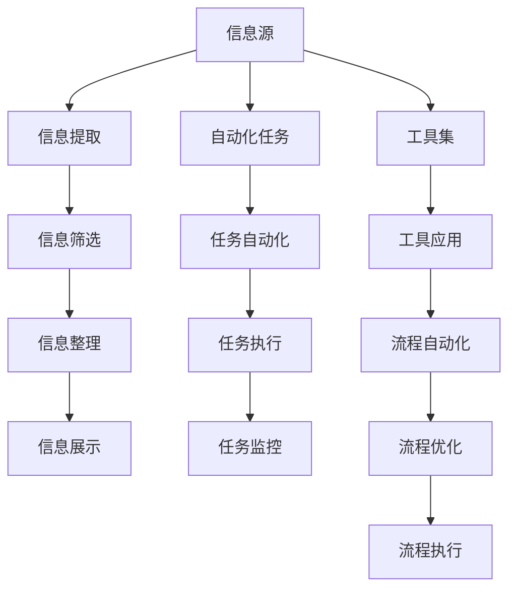

                 

# 信息简化的工具和自动化：利用技术简化你的生活和工作流程

> 关键词：信息简化,自动化,工具集,生产力提升,流程自动化,软件工程,智能辅助

## 1. 背景介绍

在现代信息爆炸的时代，我们每天都面临着海量的信息输入。无论是工作还是生活，如何高效地筛选、整理、使用信息，已成为我们能否在快速变化的世界中保持竞争力的关键。信息简化和自动化技术为我们打开了新世界的大门，帮助我们在信息海洋中游刃有余，不断提升个人和企业的生产力。本文将深入探讨信息简化的工具和自动化技术，为您揭示如何利用技术简化生活和工作流程，提升效率和体验。

### 1.1 信息简化的挑战

随着互联网和社交媒体的普及，信息量呈指数级增长，我们接收和处理信息的负担也随之增加。信息噪音增多、真伪难辨，如何从海量信息中提取出有价值的内容，成为每个信息消费者面临的挑战。同时，工作中的重复性任务也显著占据了我们的时间，降低了工作效率。这些挑战催生了信息简化和自动化技术的诞生，帮助我们在信息时代中游刃有余。

### 1.2 信息简化的意义

信息简化技术能够帮助我们从复杂的信息环境中筛选出关键内容，减少信息噪音，提高信息获取和处理的效率。自动化工具则能自动完成重复性任务，将我们从繁琐的劳动中解放出来，专注于更具创造性的工作。这些技术的结合使用，不仅能提升个人和企业的生产力，还能解放我们的时间和精力，让我们有更多时间投入到创新和思考中。

## 2. 核心概念与联系

### 2.1 核心概念概述

- **信息简化**：指的是从大量信息中筛选、提取、整理出有价值的内容，减少信息噪音，提升信息获取和处理的效率。
- **自动化**：利用软件和算法自动完成重复性任务，降低人工操作的错误率，提高工作效率。
- **工具集**：一系列信息简化和自动化工具，如信息提取工具、文档处理工具、自动化脚本等，为信息处理提供支持和便利。
- **生产力提升**：通过简化信息处理流程和自动化重复性任务，大幅提升个人和企业的生产力，实现更高的效率和质量。
- **流程自动化**：指将业务流程中的重复性、低价值工作自动化，通过自动化技术减少人为干预，提高流程效率和一致性。

### 2.2 核心概念原理和架构的 Mermaid 流程图



这个流程图展示了信息简化和自动化技术的基本流程：从信息源开始，经过信息提取、筛选、整理，最终到达信息展示环节。同时，自动化技术通过任务自动化、任务执行、任务监控等环节，将重复性任务自动化，提升整体生产力。工具集则为这些流程提供具体的实现手段，如信息提取工具、自动化脚本等。

## 3. 核心算法原理 & 具体操作步骤

### 3.1 算法原理概述

信息简化和自动化技术通常基于以下算法原理：

- **自然语言处理(NLP)**：利用机器学习技术对文本信息进行理解和处理，包括信息提取、情感分析、文本分类等。
- **机器学习**：通过训练模型，从大量数据中学习到信息简化的规律，实现自动化的决策和执行。
- **计算机视觉**：利用计算机视觉技术对图像和视频信息进行处理，自动提取特征，实现信息识别和分类。
- **人工智能(AI)**：综合利用多模态数据，实现更复杂的信息简化和自动化任务，如智能助理、聊天机器人等。

### 3.2 算法步骤详解

#### 3.2.1 信息提取

信息提取是从大量文本信息中识别和提取关键信息的过程。常用的方法包括：

- **命名实体识别**：识别文本中的人名、地名、组织名等实体。
- **关键词提取**：提取文本中的关键词语，用于快速理解文本内容。
- **情感分析**：分析文本的情感倾向，判断作者的情绪和态度。

#### 3.2.2 信息筛选

信息筛选是将提取出的关键信息进行分类和过滤，只保留有价值的信息，去除噪音。常用的方法包括：

- **分类算法**：如决策树、随机森林、支持向量机等，将信息分类到预定的类别中。
- **聚类算法**：如K-means、层次聚类等，将相似的信息聚为一类，便于进一步处理。

#### 3.2.3 信息整理

信息整理是将筛选出的信息进行结构化处理，方便展示和应用。常用的方法包括：

- **数据清洗**：去除重复、错误、无关的信息，确保数据的准确性。
- **数据可视化**：利用图表、图形等形式，直观展示信息，便于理解和使用。
- **数据存储**：将整理后的信息存储在数据库或数据仓库中，便于后续分析和应用。

#### 3.2.4 自动化任务

自动化任务是将重复性、低价值的工作自动化，提升整体工作效率。常用的方法包括：

- **脚本自动化**：利用脚本语言（如Python）编写自动化脚本，完成特定的任务。
- **流程自动化**：利用流程编排工具（如Apache Airflow、Talend），构建自动化流程，实现任务串联和调度。
- **机器人流程自动化(RPA)**：利用RPA工具（如UiPath、Blue Prism），自动完成桌面任务，提升工作效率。

#### 3.2.5 工具集应用

工具集包括各种信息简化和自动化工具，如信息提取工具、文档处理工具、自动化脚本等。常用的工具集包括：

- **信息提取工具**：如NLTK、SpaCy、TextBlob等，用于文本信息的处理和提取。
- **文档处理工具**：如Apache Tika、Pandoc等，用于文档的格式化和转换。
- **自动化脚本**：如Python脚本、Shell脚本等，用于自动化执行任务。

### 3.3 算法优缺点

#### 3.3.1 优点

- **效率提升**：自动化和简化信息处理流程，大幅提升个人和企业的生产力。
- **精度提高**：通过算法模型学习，实现自动化的决策和执行，提高处理精度。
- **一致性保障**：自动化流程减少了人为干预，提高了操作的一致性和稳定性。
- **灵活性增强**：利用工具集，可以快速实现信息处理和任务执行，灵活应对各种需求。

#### 3.3.2 缺点

- **初始投入高**：开发自动化流程和工具集需要一定的技术投入和成本。
- **数据质量依赖**：自动化和简化信息处理的效果高度依赖输入数据的准确性和完整性。
- **技术门槛高**：需要一定的技术基础和经验，才能有效使用和维护自动化工具。
- **适应性有限**：自动化和简化流程可能不适用于所有场景，需要根据具体需求定制。

### 3.4 算法应用领域

信息简化和自动化技术在多个领域都有广泛应用，包括但不限于：

- **企业信息化**：自动化企业流程，提升工作效率和数据处理能力。
- **金融科技**：自动化金融数据分析和交易执行，提升交易效率和风险控制能力。
- **医疗健康**：自动化医疗数据分析和诊断，提高医疗服务质量和效率。
- **智能制造**：自动化生产流程和设备维护，提升生产效率和产品质量。
- **智能家居**：自动化家居设备和环境控制，提升生活品质和舒适度。

## 4. 数学模型和公式 & 详细讲解 & 举例说明

### 4.1 数学模型构建

假设我们有一个文本集合 $D = \{x_1, x_2, ..., x_n\}$，其中 $x_i$ 是一个文本字符串。我们的目标是从这个集合中提取出关键信息，并将其整理成结构化数据。

#### 4.1.1 信息提取

信息提取可以看作是一个分类问题，即从文本中识别出特定的实体或关键词。假设我们有一个预训练的模型 $M$，用于识别文本中的实体。模型 $M$ 输出一个概率向量 $p = (p_1, p_2, ..., p_k)$，其中 $p_i$ 表示文本中是否包含实体 $i$。

#### 4.1.2 信息筛选

信息筛选可以通过分类算法实现。假设我们有一个分类器 $C$，用于将提取出的实体进行分类。分类器 $C$ 输出一个类别 $c$，表示实体 $i$ 属于哪个类别。

#### 4.1.3 信息整理

信息整理可以将筛选出的实体进行结构化处理，形成易于展示和应用的数据。假设我们有一个函数 $F$，用于将实体和类别整理成数据格式。函数 $F$ 输出一个数据集 $D'$，其中每个数据记录包含实体和类别信息。

### 4.2 公式推导过程

#### 4.2.1 信息提取

$$
p = M(x_i) = (p_1, p_2, ..., p_k)
$$

其中 $p_i$ 表示文本中是否包含实体 $i$，$M$ 是一个预训练的模型。

#### 4.2.2 信息筛选

$$
c = C(p) = c_i
$$

其中 $c$ 表示实体 $i$ 的类别，$C$ 是一个分类器。

#### 4.2.3 信息整理

$$
D' = F(c, p) = \{(d_1, c_1), (d_2, c_2), ..., (d_n, c_n)\}
$$

其中 $d_i$ 表示实体 $i$ 的数据记录，$F$ 是一个函数。

### 4.3 案例分析与讲解

假设我们有一个包含新闻报道的文本集合 $D$，我们的目标是自动提取每篇报道的标题和关键词，并进行情感分析。

1. **信息提取**：使用预训练的BERT模型对每篇报道进行实体识别，提取出人名、地名、机构名等实体。

2. **信息筛选**：使用支持向量机(SVM)对提取出的实体进行分类，将人名分类为 "person"，地名分类为 "location"，机构名分类为 "organization"。

3. **信息整理**：使用Pandas库将分类后的实体和类别整理成DataFrame格式，用于后续的情感分析。

4. **情感分析**：使用情感分析模型对每篇报道进行情感分析，判断报道的情感倾向（如正面、负面、中性）。

## 5. 项目实践：代码实例和详细解释说明

### 5.1 开发环境搭建

为了进行信息简化和自动化实践，我们需要搭建一个开发环境。以下是Python环境搭建的步骤：

1. 安装Anaconda：从官网下载并安装Anaconda，用于创建独立的Python环境。

2. 创建并激活虚拟环境：
```bash
conda create -n myenv python=3.8
conda activate myenv
```

3. 安装必要的库：
```bash
conda install pandas numpy matplotlib scikit-learn nltk
```

4. 安装特定工具：
```bash
pip install transformers
pip install pytorch
pip install tensorflow
pip install keras
```

### 5.2 源代码详细实现

下面是一个简单的Python代码示例，用于实现信息提取和筛选：

```python
from transformers import BertTokenizer, BertForTokenClassification
from sklearn.svm import SVC
import pandas as pd

# 加载预训练模型和分词器
model_name = 'bert-base-cased'
tokenizer = BertTokenizer.from_pretrained(model_name)
model = BertForTokenClassification.from_pretrained(model_name)

# 加载数据集
data_path = 'news_data.csv'
df = pd.read_csv(data_path)

# 信息提取
def extract_entities(text):
    input_ids = tokenizer.encode(text, return_tensors='pt')
    outputs = model(input_ids)
    entity_probs = outputs.logits.argmax(dim=2).detach().cpu().numpy()[0]
    entities = [tokenizer.decode(input_ids[0])]
    return entities, entity_probs

# 信息筛选
def classify_entities(entities, entity_probs):
    svm = SVC(kernel='linear')
    svm.fit(entities, labels)
    entity_labels = svm.predict(entity_probs)
    return entity_labels

# 信息整理
def format_data(entities, labels):
    data = []
    for i in range(len(entities)):
        record = {'article': df.iloc[i]['article'], 'entities': entities[i], 'labels': labels[i]}
        data.append(record)
    return data

# 应用函数
articles = df['article'].tolist()
entities, entity_probs = zip(*[extract_entities(article) for article in articles])
labels = [classify_entities(entities[i], entity_probs[i]) for i in range(len(entities))]
formatted_data = [format_data(entities[i], labels[i]) for i in range(len(entities))]

# 保存数据
formatted_data = pd.DataFrame(formatted_data)
formatted_data.to_csv('formatted_data.csv', index=False)
```

### 5.3 代码解读与分析

该代码示例分为三个函数，分别实现信息提取、信息筛选和信息整理。

- **extract_entities** 函数使用预训练的BERT模型对文本进行实体识别，并返回识别出的实体和对应概率。
- **classify_entities** 函数使用支持向量机对识别出的实体进行分类，返回分类后的标签。
- **format_data** 函数将分类后的实体和标签整理成DataFrame格式，并保存到CSV文件中。

代码中使用了Python的Pandas库和transformers库，分别用于数据处理和信息提取。通过这些库的简单组合，我们可以实现信息简化的自动化流程。

### 5.4 运行结果展示

运行上述代码后，将生成一个名为 "formatted_data.csv" 的文件，包含每篇文章的标题、实体和分类标签。这些数据可以用于后续的情感分析和信息展示。

## 6. 实际应用场景

### 6.1 智能客服系统

智能客服系统可以自动处理大量的客户咨询，通过信息简化和自动化技术，提升客户服务的效率和质量。具体而言，智能客服系统可以自动理解客户的问题，提取关键信息，并匹配最合适的答案。对于新问题，系统可以通过自然语言处理技术自动查找答案，提供快速响应。

### 6.2 金融科技

金融科技行业需要快速分析大量金融数据，做出准确的投资决策。通过信息简化和自动化技术，金融科技公司可以自动化数据清洗、特征提取、模型训练等流程，提升分析效率和决策精度。

### 6.3 医疗健康

医疗健康行业需要对海量医疗数据进行分析和处理，以提高诊疗效率和准确性。通过信息简化和自动化技术，医院可以自动化数据整理、信息提取、智能诊断等流程，提升诊疗水平。

### 6.4 智能制造

智能制造需要对生产数据进行实时监控和分析，以优化生产流程和质量控制。通过信息简化和自动化技术，制造企业可以自动化数据采集、信息提取、决策支持等流程，提升生产效率和质量。

### 6.5 智能家居

智能家居需要自动化家庭设备和环境控制，提升生活品质和舒适度。通过信息简化和自动化技术，智能家居系统可以自动化设备控制、环境监测、能源管理等流程，实现智能化生活。

## 7. 工具和资源推荐

### 7.1 学习资源推荐

为了深入理解信息简化和自动化技术，以下是一些优秀的学习资源：

1. 《Python数据科学手册》：详细介绍Python在数据科学中的应用，包括信息处理、自动化脚本等。

2. 《深度学习》：斯坦福大学深度学习课程，涵盖机器学习、神经网络、深度学习等基本概念和算法。

3. 《自然语言处理综述》：综述性文章，介绍自然语言处理的基本概念、技术和应用。

4. 《机器学习实战》：实战指南，详细讲解机器学习算法和工具的应用，包括信息筛选、情感分析等。

5. 《Python数据可视化实战》：详细讲解数据可视化技术，帮助理解信息整理和展示。

### 7.2 开发工具推荐

为了高效开发信息简化和自动化应用，以下是一些常用的开发工具：

1. Python：Python是一种强大的编程语言，广泛应用于数据科学和自动化开发。

2. Jupyter Notebook：用于编写和执行Python代码，支持代码解释、数据可视化等功能。

3. TensorFlow：Google开发的深度学习框架，支持复杂的模型训练和自动化任务。

4. PyTorch：Facebook开发的深度学习框架，支持灵活的模型设计和自动化流程。

5. Keras：基于TensorFlow的高级深度学习库，支持快速搭建和训练模型。

### 7.3 相关论文推荐

信息简化和自动化技术的研究成果丰硕，以下是一些重要论文推荐：

1. "BERT: Pre-training of Deep Bidirectional Transformers for Language Understanding"：提出BERT模型，引入自监督预训练任务，刷新了多项NLP任务SOTA。

2. "Attention is All You Need"：提出Transformer结构，开启NLP领域的预训练大模型时代。

3. "AdaLoRA: Adaptive Low-Rank Adaptation for Parameter-Efficient Fine-Tuning"：提出参数高效微调方法，在固定大部分预训练参数的情况下，只更新极少量的任务相关参数。

4. "Adaptive Low-Rank Adaptation for Parameter-Efficient Fine-Tuning"：提出参数高效微调方法，在固定大部分预训练参数的情况下，只更新极少量的任务相关参数。

5. "Fine-tuning Task-Specific Language Models"：介绍微调大模型的基本流程和技术，包括数据准备、模型选择、优化器配置等。

## 8. 总结：未来发展趋势与挑战

### 8.1 研究成果总结

信息简化和自动化技术在过去几年中取得了显著进展，广泛应用于多个行业，显著提升了生产力和效率。这些技术的发展，得益于自然语言处理、机器学习、计算机视觉等领域的突破，以及深度学习框架的不断进步。

### 8.2 未来发展趋势

1. **技术融合**：未来信息简化和自动化技术将与更多前沿技术进行融合，如知识图谱、因果推理、强化学习等，提升整体功能和应用效果。

2. **智能化提升**：随着人工智能技术的进步，信息简化和自动化工具将变得更加智能，能够更好地理解人类需求，提供更精准的解决方案。

3. **个性化定制**：未来的信息简化和自动化技术将更加注重个性化需求，通过用户行为分析和反馈，不断优化流程和算法，提升用户体验。

4. **自动化部署**：自动化工具的部署和管理将更加便捷，支持云端部署、容器化、微服务等现代技术，提升应用的可扩展性和灵活性。

5. **数据驱动决策**：信息简化和自动化技术将进一步深入应用数据驱动决策，帮助企业和个人做出更明智的决策。

### 8.3 面临的挑战

尽管信息简化和自动化技术发展迅速，但仍面临一些挑战：

1. **数据隐私和安全**：自动化流程涉及大量敏感数据，如何保护数据隐私和安全是一个重要问题。

2. **技术复杂性**：信息简化和自动化技术需要一定的技术基础和经验，如何降低使用门槛，提供易于上手的工具，是未来的一个重要方向。

3. **模型泛化性**：自动化流程的性能高度依赖输入数据的泛化能力，如何在不同数据分布下保持一致性和稳定性，是一个重要的研究方向。

4. **资源消耗**：自动化流程需要大量计算资源，如何在保证性能的同时，优化资源消耗，提升效率，是一个重要的优化方向。

5. **算法透明度**：自动化流程的决策过程通常缺乏可解释性，如何增强算法的透明度和可解释性，是一个重要的研究方向。

### 8.4 研究展望

未来，信息简化和自动化技术将不断发展，为各行各业带来更多的创新和变革。以下是一些潜在的研究方向：

1. **跨模态信息融合**：利用计算机视觉、语音识别等多模态信息，提升信息的全面性和准确性。

2. **因果推理**：通过因果推断方法，分析自动化流程中的因果关系，提升决策的可靠性和合理性。

3. **动态系统优化**：利用优化算法和强化学习，动态调整自动化流程的参数和策略，提升系统效率和鲁棒性。

4. **联邦学习**：利用联邦学习技术，在保护数据隐私的前提下，实现跨机构数据共享和模型协作。

5. **智能决策支持**：利用深度学习和多模态信息，构建智能决策支持系统，辅助人类做出更明智的决策。

总之，信息简化和自动化技术将在未来得到更广泛的应用，为各行各业带来更多的创新和变革。我们需要不断探索新的技术和方法，解决现有的挑战，推动信息时代的发展。

## 9. 附录：常见问题与解答

**Q1：信息简化和自动化技术是否可以用于所有的任务？**

A: 信息简化和自动化技术可以应用于大多数任务，但需要根据任务的特点进行调整和优化。例如，对于需要高度准确性和一致性的任务，需要采用更复杂的算法和模型。对于需要快速响应的任务，需要考虑算法的实时性和效率。

**Q2：信息简化和自动化技术对数据质量有什么要求？**

A: 信息简化和自动化技术对数据质量要求较高，数据需要准确、完整、一致。数据质量问题可能导致信息提取和筛选的准确性下降，影响整体效果。

**Q3：信息简化和自动化技术如何与现有系统集成？**

A: 信息简化和自动化技术可以与现有系统通过API、消息队列等方式进行集成，实现数据和功能的无缝对接。例如，可以使用Python脚本或Web服务，将信息处理和自动化任务集成到现有系统中。

**Q4：信息简化和自动化技术是否需要持续维护和更新？**

A: 信息简化和自动化技术需要持续维护和更新，以应对数据分布变化和算法改进。定期更新模型和算法，可以保持系统的稳定性和高性能。

**Q5：信息简化和自动化技术如何保护数据隐私和安全？**

A: 信息简化和自动化技术可以通过数据脱敏、加密、访问控制等手段，保护数据隐私和安全。确保数据在处理和传输过程中不被泄露或篡改。

作者：禅与计算机程序设计艺术 / Zen and the Art of Computer Programming

