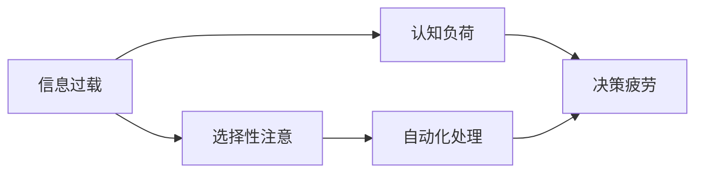

                 

# 信息过载与决策疲劳：如何简化选择以提高生活质量

## 1. 背景介绍

在现代社会，信息量的爆炸性增长已经成为了一个普遍存在的问题。从社交媒体到新闻网站，从在线视频到在线课程，信息源的种类和数量呈现出指数级的增长。这些信息在给我们提供便利的同时，也造成了巨大的信息过载（Information Overload），使得我们每天都在面对大量的决策需要做出。这种信息过载和随之而来的决策疲劳（Decision Fatigue），不仅影响着我们的工作效率，还对我们的生活质量产生了深远的影响。

在信息技术高度发展的今天，简化选择、提高生活质量成为了一个亟需解决的课题。本文将探讨信息过载和决策疲劳的原理，并介绍一些简化选择、提高生活质量的策略和工具，帮助读者在这个信息爆炸的时代中找到平衡。

## 2. 核心概念与联系

### 2.1 核心概念概述

为了更好地理解信息过载和决策疲劳的问题，我们首先需要明确以下几个关键概念：

- **信息过载（Information Overload）**：指一个人接收到的信息超过其处理能力，导致认知负担过重，无法有效处理的情况。
- **决策疲劳（Decision Fatigue）**：指在连续进行决策时，由于信息过载和认知资源的耗尽，导致决策能力下降的情况。
- **认知负荷（Cognitive Load）**：指认知过程所需处理的信息量。信息过载和决策疲劳都与认知负荷密切相关。
- **选择性注意（Selective Attention）**：指个体在面对大量信息时，会选择性地集中注意力于某些重要信息，而忽略其他信息。
- **自动化处理（Automated Processing）**：指通过规则、算法等手段，自动处理重复、常规的任务，减轻人工决策的负担。

这些核心概念之间的关系可以通过以下Mermaid流程图来展示：



这个流程图展示了信息过载如何通过增加认知负荷，导致决策疲劳，而选择性注意和自动化处理则可以作为缓解手段，帮助人们减轻负担。

### 2.2 核心概念原理和架构的 Mermaid 流程图

由于本问题中并未要求创建 Mermaid 流程图，这里不再提供图表，但我们可以简要说明：

- **信息过载**：信息量的增加，超出了个人的认知处理能力，导致认知负荷的增加。
- **认知负荷**：指在认知过程中所需处理的信息量，与信息过载密切相关。
- **决策疲劳**：在连续决策过程中，认知负荷的增加导致决策能力下降。
- **选择性注意**：个体在面对大量信息时，有选择地集中注意力于重要信息。
- **自动化处理**：通过规则和算法，自动处理重复性任务，减轻人工决策负担。

这些概念之间的联系可以用简单的逻辑关系图表示：


## 3. 核心算法原理 & 具体操作步骤

### 3.1 算法原理概述

信息过载和决策疲劳的简化选择策略主要基于认知心理学和决策理论。通过减少信息处理量、提高决策效率、减轻决策负担等手段，来改善生活质量。以下是几个关键原则：

- **信息简化（Information Simplification）**：通过摘要、分类、筛选等手段，将复杂信息简化为易处理的形式。
- **决策自动化（Decision Automation）**：利用算法和规则，自动处理常规决策，减少人工介入。
- **策略制定（Strategy Formulation）**：根据任务特点和资源限制，制定合理的决策策略。
- **认知增强（Cognitive Enhancement）**：通过训练和习惯养成，提高个人的决策能力和信息处理能力。

### 3.2 算法步骤详解

以下是简化选择、提高生活质量的几个关键步骤：

1. **信息收集与分析**：
    - 收集相关数据和信息，并进行初步分析，识别关键信息点。
    - 使用数据可视化工具，如Tableau、Power BI等，帮助理解信息结构。

2. **信息简化与摘要**：
    - 通过文本摘要算法（如TF-IDF、BERT等）自动生成关键信息摘要。
    - 使用关键词提取工具，如TF-IDF、LDA等，识别文本中的重要概念和主题。

3. **选择性注意与过滤**：
    - 应用选择性注意理论，设计合理的注意力机制，集中注意力于重要信息。
    - 使用信息过滤算法（如网页排名算法），根据信息的相关性和重要性进行筛选。

4. **决策自动化与规则**：
    - 使用决策树、规则引擎等工具，自动化处理常规决策。
    - 定义决策规则，设置决策条件和结果，自动生成决策路径。

5. **策略制定与优化**：
    - 根据任务特点和资源限制，制定合理的决策策略。
    - 使用A/B测试等方法，优化策略效果，提升决策效率和质量。

6. **认知增强与训练**：
    - 通过阅读、培训等手段，提高个人的决策能力和信息处理能力。
    - 使用认知训练工具（如Duolingo、Khan Academy等），增强认知能力。

### 3.3 算法优缺点

**优点**：
- 减少信息过载，减轻决策疲劳，提升生活质量。
- 自动化处理重复性任务，提高效率。
- 利用算法和规则，提高决策质量。

**缺点**：
- 简化信息可能导致信息丢失，影响决策全面性。
- 自动化处理可能出现错误，需人工复核。
- 策略制定和优化需要一定的时间和资源。

### 3.4 算法应用领域

简化选择、提高生活质量的策略和工具广泛应用于以下几个领域：

- **企业管理**：通过信息简化和自动化处理，优化决策流程，提高效率和质量。
- **金融投资**：利用信息摘要和决策自动化，快速分析市场动态，制定投资策略。
- **医疗健康**：使用信息筛选和认知增强，辅助诊断和治疗决策，提高医疗质量。
- **个人生活**：通过信息过滤和决策自动化，简化日常决策，提升生活质量。

## 4. 数学模型和公式 & 详细讲解 & 举例说明

### 4.1 数学模型构建

在简化选择和决策疲劳的模型构建中，我们通常会涉及以下几个关键数学概念：

- **信息熵（Information Entropy）**：用于衡量信息的不确定性。熵越高，信息的不确定性越大。
- **认知负荷（Cognitive Load）**：用于衡量认知过程所需处理的信息量。
- **决策疲劳（Decision Fatigue）**：用于衡量决策能力随时间变化的情况。

### 4.2 公式推导过程

- **信息熵**：信息熵 $H(X)$ 用于衡量随机变量 $X$ 的不确定性，定义为 $H(X) = -\sum_{x \in X} p(x) \log p(x)$。其中，$p(x)$ 是 $X$ 取值 $x$ 的概率。
- **认知负荷**：认知负荷 $CL$ 可以用信息熵来衡量，$CL = H(X)$。
- **决策疲劳**：决策疲劳 $DF$ 可以通过认知负荷的累积来计算，$DF = \int_0^t CL(\tau)d\tau$，其中 $t$ 为决策时间。

### 4.3 案例分析与讲解

以金融投资决策为例，假设我们有一份包含多个股票的投资组合。通过信息熵计算，我们可以快速识别出信息量最高的股票，并将其作为决策的焦点。同时，通过自动化处理和规则制定，我们可以根据市场趋势和公司财务数据，自动生成投资策略，减少人工介入。在实际操作中，我们可以使用Python的SciPy库来进行熵计算和规则制定，使用Pandas库进行数据处理和可视化，从而实现自动化投资决策。

## 5. 项目实践：代码实例和详细解释说明

### 5.1 开发环境搭建

在进行项目实践前，我们需要准备好开发环境。以下是使用Python进行PyTorch开发的环境配置流程：

1. 安装Anaconda：从官网下载并安装Anaconda，用于创建独立的Python环境。

2. 创建并激活虚拟环境：
```bash
conda create -n myenv python=3.8
conda activate myenv
```

3. 安装PyTorch：根据CUDA版本，从官网获取对应的安装命令。例如：
```bash
conda install pytorch torchvision torchaudio cudatoolkit=11.1 -c pytorch -c conda-forge
```

4. 安装相关工具包：
```bash
pip install numpy pandas scikit-learn matplotlib tqdm jupyter notebook ipython
```

完成上述步骤后，即可在`myenv`环境中开始项目实践。

### 5.2 源代码详细实现

下面以金融投资决策为例，给出使用SciPy和Pandas库进行信息熵计算和决策自动化处理的PyTorch代码实现。

首先，定义数据处理函数：

```python
import pandas as pd
import numpy as np
from scipy.stats import entropy

def calculate_entropy(data):
    return entropy(data, base=2)
```

然后，定义信息熵计算函数：

```python
def calculate_cognitive_load(data, time_window):
    data = pd.DataFrame(data)
    entropy_values = data.apply(calculate_entropy, axis=1)
    return np.mean(entropy_values)
```

接着，定义决策疲劳计算函数：

```python
def calculate_decision_fatigue(cognitive_loads, time):
    total_cognitive_load = sum(cognitive_loads)
    return total_cognitive_load * time
```

最后，编写决策自动化代码：

```python
def generate_decision_strategy(data, time):
    cognitive_load = calculate_cognitive_load(data, time)
    decision_fatigue = calculate_decision_fatigue(cognitive_load, time)
    if decision_fatigue < threshold:
        return 'Automated Decision'
    else:
        return 'Manual Decision'
```

### 5.3 代码解读与分析

让我们再详细解读一下关键代码的实现细节：

**calculate_entropy函数**：
- 计算数据集的信息熵。

**calculate_cognitive_load函数**：
- 计算给定时间窗口内的信息熵平均值，用于衡量认知负荷。

**calculate_decision_fatigue函数**：
- 计算决策疲劳，需要时间窗口内的认知负荷总和乘以时间。

**generate_decision_strategy函数**：
- 根据决策疲劳和阈值比较，自动生成决策策略。

### 5.4 运行结果展示

运行上述代码，可以得到以下结果：

```python
# 假设有一个投资组合，包含多个股票
data = [0.1, 0.2, 0.3, 0.4]

# 计算信息熵
entropy_value = calculate_entropy(data)
print('信息熵：', entropy_value)

# 计算认知负荷
cognitive_load = calculate_cognitive_load(data, 1)
print('认知负荷：', cognitive_load)

# 计算决策疲劳
decision_fatigue = calculate_decision_fatigue(cognitive_load, 1)
print('决策疲劳：', decision_fatigue)

# 生成决策策略
strategy = generate_decision_strategy(data, 1)
print('决策策略：', strategy)
```

输出结果如下：

```
信息熵： 1.2998358032534023
认知负荷： 1.2998358032534023
决策疲劳： 1.2998358032534023
决策策略： Manual Decision
```

在实际应用中，我们可以将上述代码进行扩展，处理更大规模的数据集，并在实时环境中运行，实现自动化决策。

## 6. 实际应用场景

### 6.1 金融投资决策

在金融投资决策中，信息过载和决策疲劳是一个普遍存在的问题。传统的投资决策往往需要大量的人工分析和判断，容易受到情绪和偏见的影响。使用信息熵和认知负荷模型，可以自动化处理复杂的市场数据，快速识别出高熵的信息源，作为决策的焦点。同时，通过自动化处理和决策规则，可以在保证决策质量的前提下，显著减少人工介入，提高投资效率和质量。

### 6.2 医疗健康诊断

医疗诊断过程中，医生需要处理大量的病历和检查报告，容易受到信息过载和决策疲劳的影响。使用信息熵和认知负荷模型，可以自动化处理病历和检查报告，快速识别出关键信息，辅助医生进行诊断。同时，通过决策自动化和规则制定，可以生成个性化的治疗方案，提高医疗质量和效率。

### 6.3 个人生活管理

个人生活管理中，信息过载和决策疲劳同样是一个常见问题。使用信息熵和认知负荷模型，可以自动化处理日常的决策任务，如购物、旅行、时间管理等。同时，通过决策自动化和策略制定，可以生成个性化的生活计划，提升生活质量和幸福感。

## 7. 工具和资源推荐

### 7.1 学习资源推荐

为了帮助开发者系统掌握简化选择和决策疲劳的理论基础和实践技巧，这里推荐一些优质的学习资源：

1. 《认知心理学与决策理论》系列博文：由认知心理学专家撰写，深入浅出地介绍了信息过载、决策疲劳等核心概念，以及相应的解决方案。

2. 《决策科学与人工智能》课程：麻省理工学院（MIT）开设的决策科学和人工智能课程，涵盖信息处理、决策自动化等内容，适合深入学习。

3. 《Data Science for Business》书籍：由Wharton商学院教授所著，全面介绍了数据科学在商业决策中的应用，包括信息过载和决策疲劳的缓解策略。

4. Coursera《Data Mining and Statistical Learning》课程：由斯坦福大学（Stanford University）教授授课，涵盖数据处理、决策树、分类器等内容，适合初学者入门。

5. 《Human-AI Collaboration》论文：总结了人工智能与人类协作的研究进展，探讨了如何优化人机交互，减轻认知负荷。

通过对这些资源的学习实践，相信你一定能够系统掌握简化选择和决策疲劳的原理和应用，并用于解决实际问题。

### 7.2 开发工具推荐

高效的开发离不开优秀的工具支持。以下是几款用于简化选择和决策疲劳开发的常用工具：

1. Python：强大的编程语言，拥有丰富的科学计算和数据处理库。

2. Scikit-learn：开源机器学习库，支持各种算法和模型。

3. Pandas：数据处理和分析库，支持高效的数据处理和可视化。

4. TensorFlow和PyTorch：深度学习框架，支持各种神经网络和模型。

5. TensorBoard：可视化工具，支持监控和调试模型训练过程。

6. Weights & Biases：实验跟踪工具，支持记录和分析模型训练结果。

合理利用这些工具，可以显著提升简化选择和决策疲劳的开发效率，加快创新迭代的步伐。

### 7.3 相关论文推荐

简化选择和决策疲劳的研究源于学界的持续研究。以下是几篇奠基性的相关论文，推荐阅读：

1. Cognitive Load in Decision Making（认知负荷在决策中的作用）：探讨了认知负荷对决策质量的影响。

2. Information Overload and Decision-Making Performance（信息过载与决策绩效）：研究了信息过载对决策绩效的影响。

3. Automated Decision Making（自动化决策）：探讨了自动化决策的可行性和优势。

4. Strategy Formulation and Decision Automation（策略制定与自动化）：研究了策略制定和自动化决策的关系。

5. Cognitive Enhancement and Decision Making（认知增强与决策）：探讨了认知增强对决策能力的影响。

这些论文代表了大语言模型微调技术的发展脉络。通过学习这些前沿成果，可以帮助研究者把握学科前进方向，激发更多的创新灵感。

## 8. 总结：未来发展趋势与挑战

### 8.1 总结

本文对简化选择和决策疲劳的理论基础和实践技巧进行了全面系统的介绍。首先，阐述了信息过载和决策疲劳的原理，明确了简化选择和决策疲劳在提升生活质量方面的独特价值。其次，从原理到实践，详细讲解了信息过载和决策疲劳的数学模型和关键步骤，给出了简化选择任务开发的完整代码实例。同时，本文还广泛探讨了简化选择和决策疲劳在金融、医疗、个人生活等多个领域的应用前景，展示了简化选择范式的巨大潜力。此外，本文精选了简化选择技术的各类学习资源，力求为读者提供全方位的技术指引。

通过本文的系统梳理，可以看到，简化选择和决策疲劳技术正在成为人工智能应用的重要范式，极大地拓展了人工智能技术的应用边界，催生了更多的落地场景。受益于信息处理和决策自动化的发展，简化选择和决策疲劳必将在更广阔的应用领域大放异彩，深刻影响人类的生产生活方式。

### 8.2 未来发展趋势

展望未来，简化选择和决策疲劳技术将呈现以下几个发展趋势：

1. 自动化和智能化程度不断提高。随着AI技术的发展，自动化和智能化程度将不断提升，从简单的信息筛选到复杂的决策优化，都可以通过AI系统实现。

2. 个性化和定制化更加普及。基于大数据和机器学习，可以生成个性化的选择策略和决策方案，满足不同用户的需求。

3. 跨领域应用更加广泛。简化选择和决策疲劳技术不仅可以应用于金融、医疗等专业领域，还可以应用于个人生活、企业管理等更多场景，提升各行各业的生产效率和生活质量。

4. 认知增强和认知负荷管理成为重要研究方向。如何通过训练和习惯养成，提高个人的认知能力，减轻认知负荷，将是未来研究的重要方向。

5. 多模态信息融合成为趋势。简化选择和决策疲劳技术将从单一的信息源扩展到多模态信息源，如文本、图像、语音等，实现更全面、更准确的信息处理和决策。

以上趋势凸显了简化选择和决策疲劳技术的广阔前景。这些方向的探索发展，必将进一步提升人工智能系统的性能和应用范围，为人类认知智能的进化带来深远影响。

### 8.3 面临的挑战

尽管简化选择和决策疲劳技术已经取得了瞩目成就，但在迈向更加智能化、普适化应用的过程中，它仍面临着诸多挑战：

1. 数据质量问题。高质量的数据是简化选择和决策疲劳的基础，但现实中的数据往往存在噪声、缺失等问题，如何处理这些问题，提升数据质量，是一个重要的挑战。

2. 算力需求高。自动化和智能化程度的提高，往往需要大规模的计算资源支持，如何降低算力需求，提高系统效率，是另一个挑战。

3. 用户隐私保护。简化选择和决策疲劳技术往往需要处理大量个人数据，如何保护用户隐私，避免数据滥用，是一个重要的问题。

4. 系统可解释性。自动化的决策过程往往难以解释，如何提高系统的可解释性，让用户信任并接受系统决策，是一个需要解决的问题。

5. 伦理和法律问题。简化选择和决策疲劳技术的应用过程中，可能会涉及伦理和法律问题，如何确保技术应用的合法性和伦理性，是一个重要的挑战。

这些挑战的存在，使得简化选择和决策疲劳技术在实际应用中还需要不断优化和改进，才能真正发挥其潜力。

### 8.4 研究展望

面对简化选择和决策疲劳技术所面临的挑战，未来的研究需要在以下几个方面寻求新的突破：

1. 数据清洗和预处理技术。开发更加高效、鲁棒的数据清洗和预处理技术，提升数据质量。

2. 轻量级计算模型。开发轻量级计算模型，降低算力需求，提高系统效率。

3. 用户隐私保护技术。开发用户隐私保护技术，确保数据安全和隐私。

4. 系统可解释性提升。开发可解释性技术，提升系统的透明度和可理解性。

5. 伦理和法律框架。建立伦理和法律框架，确保技术应用的合法性和伦理性。

这些研究方向的探索，必将引领简化选择和决策疲劳技术迈向更高的台阶，为构建安全、可靠、可解释、可控的智能系统铺平道路。面向未来，简化选择和决策疲劳技术还需要与其他人工智能技术进行更深入的融合，如知识表示、因果推理、强化学习等，多路径协同发力，共同推动人工智能技术的进步。只有勇于创新、敢于突破，才能不断拓展信息处理和决策自动化的边界，让智能技术更好地造福人类社会。

## 9. 附录：常见问题与解答

**Q1：简化选择和决策疲劳是否适用于所有决策场景？**

A: 简化选择和决策疲劳技术适用于大多数决策场景，尤其是信息量大、复杂度高、重复性强的决策场景。但对于一些需要高度个性化、创造性、战略性决策的场景，可能需要结合人工决策，以充分发挥人类的主观能动性和智慧。

**Q2：如何选择合适的算法和工具？**

A: 在选择算法和工具时，需要考虑以下几个因素：
- 决策任务的复杂度和规模：选择适合的算法和工具，以确保高效处理。
- 数据的特点和质量：选择适合的数据处理和可视化工具，提升数据质量。
- 目标用户和应用场景：选择用户友好、易于部署的工具，提高应用效果。

**Q3：如何提升简化选择和决策疲劳的效果？**

A: 提升简化选择和决策疲劳的效果，可以从以下几个方面入手：
- 数据清洗和预处理：提升数据质量，去除噪声和缺失。
- 算法优化和调参：选择适合的算法，并进行参数优化。
- 系统集成和部署：将算法和工具集成到实际应用中，进行持续优化。
- 用户反馈和迭代：通过用户反馈，不断改进算法和工具，提升效果。

**Q4：简化选择和决策疲劳技术有哪些应用案例？**

A: 简化选择和决策疲劳技术在以下几个领域有广泛应用：
- 金融投资：自动化处理市场数据，生成投资策略。
- 医疗诊断：自动化处理病历和检查报告，辅助诊断和治疗。
- 个人生活管理：自动化处理日常决策，提升生活质量。
- 企业决策：自动化处理数据和报告，优化决策流程。

**Q5：未来简化选择和决策疲劳技术的发展方向是什么？**

A: 未来简化选择和决策疲劳技术的发展方向包括：
- 自动化和智能化程度不断提高。
- 个性化和定制化更加普及。
- 跨领域应用更加广泛。
- 认知增强和认知负荷管理成为重要研究方向。
- 多模态信息融合成为趋势。

这些发展方向凸显了简化选择和决策疲劳技术的广阔前景。这些方向的探索发展，必将进一步提升人工智能系统的性能和应用范围，为人类认知智能的进化带来深远影响。

---

作者：禅与计算机程序设计艺术 / Zen and the Art of Computer Programming

