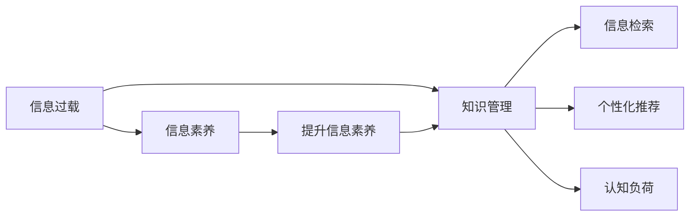

                 

# 信息过载与知识管理策略：有效组织和检索信息的技巧

## 1. 背景介绍

### 1.1 问题由来

随着信息技术的发展，尤其是互联网和移动互联网的普及，信息获取变得前所未有的便捷。然而，这种便捷也带来了新的问题——信息过载。用户每天接触海量的信息，如何在这些信息中找到真正有价值的内容，成为了一个亟待解决的问题。

### 1.2 问题核心关键点

信息过载的问题核心在于如何高效地组织和检索信息，使其真正服务于人类生活和工作的需求。这不仅涉及信息技术领域，还与心理学、行为学等学科紧密相关。

- **信息量巨大**：用户接收的信息量呈指数级增长。
- **信息质量参差不齐**：信息来源广泛，质量各异。
- **个性化需求**：不同用户对信息的价值判断不同。
- **动态变化**：信息环境不断变化，需要动态更新知识库。
- **信息检索**：如何高效检索出用户需要的信息，提升信息获取效率。

### 1.3 问题研究意义

解决信息过载问题，对于提升人类生活质量和工作效率具有重要意义：

- **提升决策质量**：减少噪音干扰，让决策更加基于事实。
- **提升信息利用率**：最大化利用已有信息资源。
- **提升用户体验**：减少信息获取障碍，提升用户满意度。
- **促进知识共享**：建立高效的知识管理机制，促进知识传播。
- **推动创新**：高质量的信息是创新思维和灵感的重要来源。

## 2. 核心概念与联系

### 2.1 核心概念概述

为更好地理解信息过载及其解决方案，本节将介绍几个关键概念及其相互联系：

- **信息过载(Information Overload)**：用户接收的信息量远大于其处理能力，导致信息质量下降、注意力分散，影响决策和行动。
- **知识管理(Knowledge Management)**：对知识和信息进行收集、存储、组织和检索，以提升知识利用效率。
- **信息检索(Information Retrieval)**：从大量信息中检索出用户需要的信息。
- **个性化推荐**：根据用户行为和偏好，推荐符合其需求的信息。
- **认知负荷(Cognitive Load)**：用户获取、处理信息所需的心理负担。
- **信息素养(Information Literacy)**：用户获取、评估和利用信息的能力。

这些概念相互关联，共同构成信息过载与知识管理的理论框架。

### 2.2 核心概念原理和架构的 Mermaid 流程图(Mermaid 流程节点中不要有括号、逗号等特殊字符)



这个流程图展示了信息过载与知识管理的核心概念及其相互联系：

1. 信息过载是问题的起点，需要通过知识管理、信息检索、个性化推荐等方法缓解。
2. 认知负荷是用户处理信息的心理负担，通过提升信息素养可以减轻。
3. 信息素养是提升用户信息处理能力的基础，可以有效缓解信息过载问题。

## 3. 核心算法原理 & 具体操作步骤

### 3.1 算法原理概述

信息过载与知识管理涉及多个学科的知识，其中信息检索和个性化推荐是关键技术。本节将从这两个方向展开，介绍核心算法原理和具体操作步骤。

### 3.2 算法步骤详解

#### 3.2.1 信息检索

信息检索的目的是从海量的信息中找到用户真正需要的信息。其主要步骤包括：

1. **信息收集**：通过网络爬虫、API接口等方式，收集结构化和非结构化数据。
2. **索引构建**：对收集到的信息进行预处理，如分词、去噪、标注，并构建索引。
3. **查询匹配**：用户输入查询关键词，系统检索出最相关的信息。
4. **排序与推荐**：根据算法评分，对检索结果进行排序，推荐最相关的信息。

#### 3.2.2 个性化推荐

个性化推荐通过用户行为数据，推荐符合其兴趣和需求的信息。其主要步骤包括：

1. **用户画像构建**：通过用户行为数据，构建用户兴趣画像。
2. **内容分析**：对推荐内容进行分析，提取特征向量。
3. **模型训练**：基于用户画像和内容特征，训练推荐模型。
4. **推荐与调整**：根据用户反馈，不断调整推荐策略。

### 3.3 算法优缺点

#### 3.3.1 信息检索

**优点**：

- **高效**：通过算法评分可以快速检索出最相关的信息。
- **可扩展**：可以处理大规模信息，适用于各类数据源。
- **精确性高**：通过索引构建和查询匹配，检索结果准确性高。

**缺点**：

- **延迟**：索引构建和查询匹配可能需要较长时间。
- **冷启动**：新信息需要一段时间才能被索引和检索。
- **数据质量**：数据质量差或标注错误会导致检索结果不准确。

#### 3.3.2 个性化推荐

**优点**：

- **个性化**：根据用户兴趣推荐信息，提升用户体验。
- **动态调整**：可以实时调整推荐策略，适应用户需求变化。
- **多模态**：可以综合利用用户行为和内容特征进行推荐。

**缺点**：

- **隐私问题**：用户行为数据涉及隐私，需要谨慎处理。
- **推荐偏差**：推荐算法可能存在偏见，影响推荐结果。
- **计算复杂**：需要处理大量用户数据和内容特征，计算复杂。

### 3.4 算法应用领域

信息检索和个性化推荐技术广泛应用于各种领域：

- **电子商务**：推荐商品、优惠券等。
- **社交媒体**：推荐新闻、视频、朋友等。
- **在线教育**：推荐课程、学习资料等。
- **医疗健康**：推荐医生、治疗方案等。
- **金融服务**：推荐投资产品、理财建议等。
- **新闻媒体**：推荐新闻文章、视频等。

## 4. 数学模型和公式 & 详细讲解 & 举例说明

### 4.1 数学模型构建

信息检索和个性化推荐涉及多种数学模型，其中向量空间模型、协同过滤和深度学习模型是常用的模型类型。

#### 4.1.1 向量空间模型

向量空间模型通过将文本转换为向量，进行相似度计算。其核心公式如下：

$$
\text{similarity}(\mathbf{v}, \mathbf{w}) = \frac{\mathbf{v} \cdot \mathbf{w}}{\|\mathbf{v}\| \cdot \|\mathbf{w}\|}
$$

其中 $\mathbf{v}$ 和 $\mathbf{w}$ 分别为两个文本向量的表示，$\cdot$ 为点积，$\|\cdot\|$ 为向量范数。

#### 4.1.2 协同过滤

协同过滤基于用户行为数据，通过相似性计算推荐物品。其核心公式如下：

$$
\text{similarity}(\mathbf{u}, \mathbf{v}) = \frac{1}{\sqrt{\sum_{i=1}^n (u_i - \bar{u})^2}} \frac{1}{\sqrt{\sum_{j=1}^m (v_j - \bar{v})^2}} \sum_{i=1}^n \sum_{j=1}^m (u_i - \bar{u}) (v_j - \bar{v}) \frac{X_{ij}}{\sigma_i \sigma_j}
$$

其中 $\mathbf{u}$ 和 $\mathbf{v}$ 分别为两个用户和物品的评分向量，$\bar{u}$ 和 $\bar{v}$ 分别为两个用户和物品的平均评分，$X_{ij}$ 为评分矩阵，$\sigma_i$ 和 $\sigma_j$ 为评分标准差。

#### 4.1.3 深度学习模型

深度学习模型通过神经网络对数据进行建模，具有强大的表示能力。常用的深度学习模型包括：

- **卷积神经网络**：用于处理图像数据。
- **循环神经网络**：用于处理序列数据。
- **深度信念网络**：用于处理结构化数据。
- **生成对抗网络**：用于生成高质量的数据。

### 4.2 公式推导过程

#### 4.2.1 向量空间模型推导

向量空间模型的核心在于将文本转换为向量，然后进行相似度计算。假设文本 $t_1$ 和 $t_2$ 的词向量表示分别为 $\mathbf{v}_1$ 和 $\mathbf{v}_2$，则文本相似度可以表示为：

$$
\text{similarity}(t_1, t_2) = \frac{\mathbf{v}_1 \cdot \mathbf{v}_2}{\|\mathbf{v}_1\| \cdot \|\mathbf{v}_2\|}
$$

通过将文本转换为向量，可以进行高效的相似度计算，从而实现信息检索和推荐。

#### 4.2.2 协同过滤推导

协同过滤的核心在于计算用户之间的相似性，从而推荐物品。假设用户 $u$ 和物品 $v$ 的评分矩阵为 $X_{ij}$，则用户 $u$ 和物品 $v$ 的相似度可以表示为：

$$
\text{similarity}(u, v) = \frac{1}{\sqrt{\sum_{i=1}^n (u_i - \bar{u})^2}} \frac{1}{\sqrt{\sum_{j=1}^m (v_j - \bar{v})^2}} \sum_{i=1}^n \sum_{j=1}^m (u_i - \bar{u}) (v_j - \bar{v}) \frac{X_{ij}}{\sigma_i \sigma_j}
$$

通过计算用户和物品之间的相似度，可以实现高效的个性化推荐。

### 4.3 案例分析与讲解

#### 4.3.1 案例分析

假设有一家在线图书电商平台，用户行为数据如下：

- 用户 $u_1$ 购买了书籍 $b_1$、$b_2$、$b_3$。
- 用户 $u_2$ 购买了书籍 $b_2$、$b_3$、$b_4$。
- 用户 $u_3$ 购买了书籍 $b_1$、$b_3$、$b_5$。

根据协同过滤算法，计算用户之间的相似度，可以推荐以下书籍给用户 $u_4$：

- 书籍 $b_3$ 的相似度为 1.0，因此 $b_3$ 必定为 $u_4$ 感兴趣。
- 书籍 $b_2$ 的相似度为 0.5，因此 $b_2$ 可能为 $u_4$ 感兴趣。
- 书籍 $b_4$ 的相似度为 0.5，因此 $b_4$ 可能为 $u_4$ 感兴趣。
- 书籍 $b_1$ 的相似度为 0.5，因此 $b_1$ 可能为 $u_4$ 感兴趣。

### 4.4 举例说明

假设有一个新闻推荐系统，用户行为数据如下：

- 用户 $u_1$ 阅读了新闻 $n_1$、$n_2$、$n_3$。
- 用户 $u_2$ 阅读了新闻 $n_2$、$n_3$、$n_4$。
- 用户 $u_3$ 阅读了新闻 $n_1$、$n_3$、$n_5$。

根据协同过滤算法，计算用户之间的相似度，可以推荐以下新闻给用户 $u_4$：

- 新闻 $n_3$ 的相似度为 1.0，因此 $n_3$ 必定为 $u_4$ 感兴趣。
- 新闻 $n_2$ 的相似度为 0.5，因此 $n_2$ 可能为 $u_4$ 感兴趣。
- 新闻 $n_4$ 的相似度为 0.5，因此 $n_4$ 可能为 $u_4$ 感兴趣。
- 新闻 $n_1$ 的相似度为 0.5，因此 $n_1$ 可能为 $u_4$ 感兴趣。

## 5. 项目实践：代码实例和详细解释说明

### 5.1 开发环境搭建

在进行信息检索和个性化推荐项目实践前，我们需要准备好开发环境。以下是使用Python进行Scikit-learn开发的开发环境配置流程：

1. 安装Anaconda：从官网下载并安装Anaconda，用于创建独立的Python环境。

2. 创建并激活虚拟环境：
```bash
conda create -n sk-env python=3.8 
conda activate sk-env
```

3. 安装Scikit-learn：
```bash
conda install scikit-learn
```

4. 安装其他相关工具包：
```bash
pip install numpy pandas scipy matplotlib seaborn
```

5. 安装Jupyter Notebook：
```bash
conda install jupyter notebook
```

完成上述步骤后，即可在`sk-env`环境中开始信息检索和个性化推荐项目实践。

### 5.2 源代码详细实现

这里我们以协同过滤算法为例，给出使用Scikit-learn库对协同过滤算法进行实现的Python代码。

```python
import numpy as np
from sklearn.metrics.pairwise import cosine_similarity

# 构建评分矩阵
X = np.array([[5, 3, 0],
              [4, 2, 0],
              [0, 0, 5],
              [3, 1, 4]])

# 计算相似度矩阵
similarity_matrix = cosine_similarity(X)

# 打印相似度矩阵
print(similarity_matrix)
```

上述代码首先构建了一个简单的评分矩阵X，然后使用cosine_similarity函数计算了各个用户之间的相似度，最终输出相似度矩阵。

### 5.3 代码解读与分析

这里我们详细解读一下关键代码的实现细节：

**构建评分矩阵**：
- `np.array`：将评分数据构建成NumPy数组，方便后续计算。

**计算相似度矩阵**：
- `cosine_similarity`：使用Scikit-learn库中的cosine_similarity函数计算用户之间的相似度。该函数计算两个向量之间的余弦相似度，可以用于衡量两个用户或物品之间的相似性。

**打印相似度矩阵**：
- `print`：直接输出计算结果，方便查看和分析。

通过上述代码，我们可以看到协同过滤算法的基本实现步骤。利用Scikit-learn库，开发者可以快速构建并测试协同过滤模型，从而提升信息检索和个性化推荐的效率。

## 6. 实际应用场景

### 6.1 智能推荐系统

智能推荐系统是信息检索和个性化推荐技术的典型应用。通过分析用户行为数据，智能推荐系统可以为用户推荐符合其兴趣和需求的商品、文章、视频等。

在技术实现上，智能推荐系统通常由以下几个模块组成：

- **用户画像构建模块**：通过用户行为数据，构建用户兴趣画像。
- **内容分析模块**：对推荐内容进行分析，提取特征向量。
- **推荐模型训练模块**：基于用户画像和内容特征，训练推荐模型。
- **推荐结果生成模块**：根据模型评分，生成推荐结果。
- **推荐结果展示模块**：将推荐结果展示给用户，并进行动态调整。

### 6.2 信息检索系统

信息检索系统旨在从海量的信息中找到用户真正需要的信息。在技术实现上，信息检索系统通常由以下几个模块组成：

- **索引构建模块**：对信息进行预处理，构建索引。
- **查询匹配模块**：用户输入查询关键词，系统检索出最相关的信息。
- **结果排序模块**：根据算法评分，对检索结果进行排序。
- **反馈模块**：根据用户反馈，调整算法参数，提升检索效果。

### 6.3 个性化阅读平台

个性化阅读平台旨在为用户推荐符合其阅读兴趣的文章、书籍等。在技术实现上，个性化阅读平台通常由以下几个模块组成：

- **用户画像构建模块**：通过用户行为数据，构建用户阅读兴趣画像。
- **文章分析模块**：对文章进行分析，提取特征向量。
- **推荐模型训练模块**：基于用户画像和文章特征，训练推荐模型。
- **阅读推荐模块**：根据模型评分，生成阅读推荐。
- **阅读互动模块**：根据用户阅读行为，调整推荐策略。

## 7. 工具和资源推荐

### 7.1 学习资源推荐

为了帮助开发者系统掌握信息过载与知识管理技术，这里推荐一些优质的学习资源：

1. 《推荐系统实战》一书：介绍了推荐系统的基本原理和实现方法，涵盖协同过滤、矩阵分解、深度学习等核心技术。
2. Coursera《信息检索》课程：由斯坦福大学开设，系统讲解了信息检索的基本概念和算法。
3. Udacity《深度学习》课程：由Google和DeepMind联合开设，介绍了深度学习的基本原理和实现方法。
4. Kaggle《推荐系统竞赛》：通过竞赛形式，练习推荐系统的设计和实现，提升实战能力。
5. ArXiv《信息检索论文集》：收集了大量信息检索领域的经典论文，有助于深入理解技术细节。

通过对这些资源的学习实践，相信你一定能够快速掌握信息过载与知识管理技术的精髓，并用于解决实际的推荐和检索问题。

### 7.2 开发工具推荐

高效的开发离不开优秀的工具支持。以下是几款用于信息检索和个性化推荐开发的常用工具：

1. Scikit-learn：Python的机器学习库，支持协同过滤、回归分析等核心算法。
2. TensorFlow：Google开发的深度学习框架，支持各类神经网络模型。
3. PyTorch：Facebook开发的深度学习框架，支持动态图和静态图。
4. Elasticsearch：基于Lucene的搜索引擎，支持大规模文本检索。
5. Apache Spark：分布式计算框架，支持大数据处理和分析。
6. Jupyter Notebook：交互式编程环境，支持代码实现和可视化展示。

合理利用这些工具，可以显著提升信息检索和个性化推荐的开发效率，加快创新迭代的步伐。

### 7.3 相关论文推荐

信息检索和个性化推荐技术的发展源于学界的持续研究。以下是几篇奠基性的相关论文，推荐阅读：

1. "The Matrix Factorization Approach to Collaborative Filtering"（矩阵分解方法用于协同过滤）：提出了基于矩阵分解的协同过滤算法。
2. "Item-Based Collaborative Filtering Recommendation Algorithms"（基于物品的协同过滤推荐算法）：介绍了基于物品的协同过滤推荐算法，并通过实验证明了其有效性。
3. "Learning to Estimate Image Similarities"（学习估计图像相似性）：提出了基于卷积神经网络的图像相似性计算方法。
4. "A Neural Probabilistic Language Model"（一种神经概率语言模型）：提出了基于循环神经网络的语言模型，用于文本分类和信息检索。
5. "Web pages that never die"（永不消亡的网页）：提出了基于web缓存的快速信息检索方法，提高了检索效率。

这些论文代表了大数据和深度学习技术在信息检索和个性化推荐领域的最新进展。通过学习这些前沿成果，可以帮助研究者把握学科前进方向，激发更多的创新灵感。

## 8. 总结：未来发展趋势与挑战

### 8.1 总结

本文对信息过载与知识管理技术进行了全面系统的介绍。首先阐述了信息过载的问题背景和意义，明确了信息检索和个性化推荐技术的核心价值。其次，从原理到实践，详细讲解了信息检索和个性化推荐的核心算法和具体操作步骤，给出了代码实例和详细解释。同时，本文还广泛探讨了信息过载与知识管理技术在实际应用中的多个场景，展示了其广阔的应用前景。

通过本文的系统梳理，可以看到，信息检索和个性化推荐技术已经广泛应用于各类领域，并逐渐成为提高用户体验和工作效率的重要手段。未来，伴随大数据和深度学习技术的进一步发展，这些技术将更加智能化、个性化，进一步提升信息获取的效率和质量。

### 8.2 未来发展趋势

展望未来，信息检索和个性化推荐技术将呈现以下几个发展趋势：

1. **智能化提升**：通过引入自然语言处理、计算机视觉等技术，信息检索和推荐系统将更加智能，能够理解复杂的多模态信息。
2. **个性化定制**：通过用户画像和行为数据，个性化推荐系统将更加精准，能够提供个性化的内容和服务。
3. **实时性提升**：通过分布式计算和实时数据处理技术，推荐系统将更加高效，能够实时响应用户需求。
4. **隐私保护**：通过数据匿名化和隐私保护技术，推荐系统将更加安全，能够保障用户隐私。
5. **交互性增强**：通过用户反馈和动态调整，推荐系统将更加灵活，能够不断优化推荐策略。
6. **跨领域融合**：通过与其他领域的融合，推荐系统将更加全面，能够覆盖更多应用场景。

这些趋势将推动信息检索和个性化推荐技术迈向更高的水平，为用户带来更加丰富、高效、安全的体验。

### 8.3 面临的挑战

尽管信息检索和个性化推荐技术已经取得了显著进展，但在迈向更加智能化、普适化应用的过程中，仍面临诸多挑战：

1. **数据质量**：用户行为数据和文本数据质量参差不齐，可能影响推荐结果的准确性。
2. **计算复杂**：大规模数据处理和复杂模型训练需要高算力支持。
3. **隐私保护**：用户数据隐私保护需要严格的数据处理和安全技术。
4. **推荐偏差**：推荐算法可能存在偏见，影响公平性和推荐效果。
5. **实时性问题**：实时推荐系统需要高效的数据处理和模型推理。
6. **多模态融合**：多模态数据融合和协同处理需要新的算法和技术。

这些挑战需要从数据、算法、技术、政策等多个层面进行综合解决，才能进一步提升信息检索和个性化推荐技术的实用性和安全性。

### 8.4 研究展望

面对信息检索和个性化推荐技术所面临的种种挑战，未来的研究需要在以下几个方面寻求新的突破：

1. **多模态融合**：通过多模态数据融合技术，提升信息检索和推荐系统的多模态处理能力。
2. **隐私保护**：通过数据匿名化和隐私保护技术，保障用户数据隐私和安全。
3. **实时性优化**：通过分布式计算和实时数据处理技术，提升推荐系统的实时性。
4. **推荐公平性**：通过公平性评估和算法改进，减少推荐偏差，提升推荐公平性。
5. **数据质量提升**：通过数据清洗和标注技术，提升数据质量，提高推荐效果。
6. **跨领域应用**：通过与其他领域的融合，拓展信息检索和推荐系统的应用场景。

这些研究方向将推动信息检索和个性化推荐技术的进一步发展，为构建更加智能、安全、高效的信息服务系统提供坚实基础。

## 9. 附录：常见问题与解答

**Q1: 信息检索和个性化推荐有什么区别？**

A: 信息检索旨在从海量的信息中找到用户需要的信息，注重信息的查找和匹配。而个性化推荐则是在找到信息后，进一步对用户行为和兴趣进行分析，推荐符合其需求的信息，注重信息的个性化展示。

**Q2: 如何评估推荐系统的性能？**

A: 推荐系统的性能评估通常包括以下几个指标：

- **准确性**：推荐结果与用户真实需求的匹配度。
- **覆盖率**：推荐结果中未出现过的物品数量。
- **多样性**：推荐结果的多样性，避免推荐同质化。
- **新颖性**：推荐结果的新鲜程度，避免推荐重复信息。
- **公平性**：推荐结果的公平性，避免偏见和歧视。

**Q3: 如何避免推荐系统中的推荐偏差？**

A: 推荐偏差是推荐系统中的常见问题，主要可以通过以下方法避免：

- **数据多样化**：使用多样化的数据集进行训练，避免过拟合。
- **公平性约束**：在推荐算法中加入公平性约束，避免推荐偏差。
- **多角度分析**：从多个角度分析用户需求，避免单一视角的偏差。
- **用户反馈**：根据用户反馈动态调整推荐策略，避免推荐结果与用户期望不符。

**Q4: 如何提升信息检索系统的效率？**

A: 信息检索系统的效率提升可以从以下几个方面入手：

- **索引优化**：优化索引结构，提高检索速度。
- **查询优化**：优化查询方式，减少不必要的计算。
- **分布式计算**：使用分布式计算技术，提高检索效率。
- **缓存技术**：使用缓存技术，减少重复计算。
- **硬件优化**：使用高性能硬件，提高检索速度。

**Q5: 信息检索和个性化推荐技术有哪些实际应用场景？**

A: 信息检索和个性化推荐技术在多个领域都有广泛应用，包括：

- **电子商务**：推荐商品、优惠券等。
- **社交媒体**：推荐新闻、视频、朋友等。
- **在线教育**：推荐课程、学习资料等。
- **医疗健康**：推荐医生、治疗方案等。
- **金融服务**：推荐投资产品、理财建议等。
- **新闻媒体**：推荐新闻文章、视频等。

通过对这些问题的解答，相信你一定能够更好地理解信息检索和个性化推荐技术，并用于解决实际的推荐和检索问题。

---

作者：禅与计算机程序设计艺术 / Zen and the Art of Computer Programming

