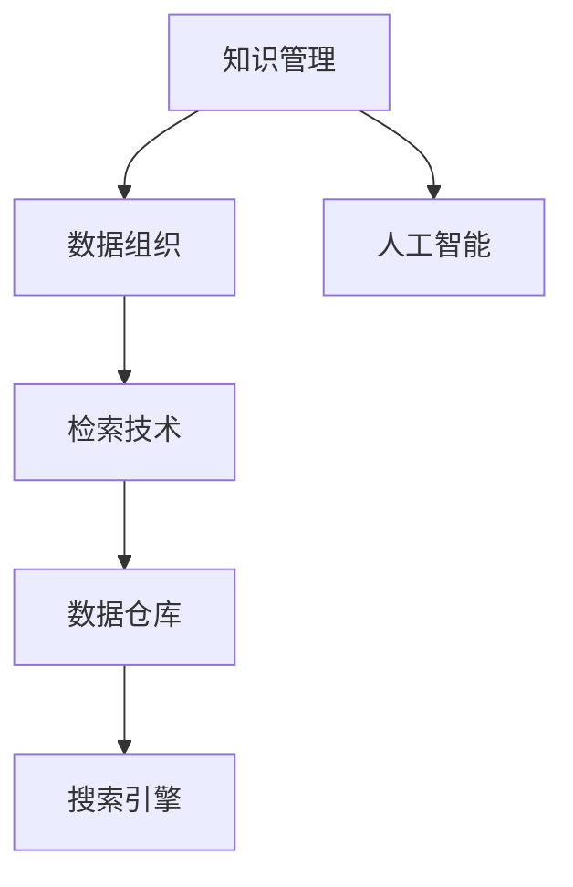

                 

# 信息过载与知识管理系统实施指南：有效组织和检索信息

> 关键词：信息过载, 知识管理, 数据组织, 检索技术, 数据仓库, 搜索引擎, 人工智能

## 1. 背景介绍

### 1.1 问题由来
随着互联网和信息技术的发展，信息量呈指数级增长。这虽然为我们的生活带来了前所未有的便利，但也带来了一系列问题。信息过载就是其中最为突出的问题之一。根据艾瑞咨询的调查，有96%的用户表示在信息过载的情况下会感到压力。

信息过载不仅影响工作效率，还可能对决策产生负面影响。面对海量信息，我们常常感到困惑和无助，难以从中提取有价值的内容。例如，企业员工需要花费大量时间在繁琐的信息查找和整理上，而不是专注于创造价值的工作。

为应对信息过载问题，知识管理系统(Knowledge Management System, KMS)应运而生。KMS旨在通过组织和检索信息，使信息管理高效化、智能化，帮助用户快速找到所需信息，从而提高工作效率和决策质量。

### 1.2 问题核心关键点
本节将介绍信息过载问题及其解决策略的核心关键点：

- 信息过载：由于信息量过大、质量参差不齐、重复性强，导致用户在大量信息中难以快速筛选有用信息。
- 知识管理：通过系统化、结构化的方式，将信息转化为知识，提升信息检索效率和质量。
- 数据组织：使用各种方法和工具，将数据按照一定的规则和逻辑进行整理和分类。
- 检索技术：利用先进的数据检索技术，提高信息查找的准确性和效率。
- 数据仓库：用于集中存储和处理大规模数据的分布式数据库。
- 搜索引擎：基于先进算法和索引技术，快速检索数据的高效工具。
- 人工智能：通过机器学习、自然语言处理等技术，提升信息处理和检索的能力。

这些关键点构成了解决信息过载问题的主要思路，下面将详细介绍如何通过知识管理系统有效组织和检索信息。

## 2. 核心概念与联系

### 2.1 核心概念概述

为更好地理解知识管理系统的组织和检索机制，本节将介绍几个密切相关的核心概念：

- **知识管理**：指通过系统的、结构化的方式将信息转化为知识，并加以有效管理和使用，提升信息价值。
- **数据组织**：指将数据按照一定的规则和逻辑进行整理、分类和存储，使其结构化、系统化。
- **检索技术**：指利用先进的数据检索技术，快速定位和获取所需信息。
- **数据仓库**：一种分布式数据库，用于集中存储和处理大规模数据。
- **搜索引擎**：利用高级算法和索引技术，快速检索数据的高效工具。
- **人工智能**：利用机器学习、自然语言处理等技术，提升信息处理和检索的能力。

这些核心概念之间的逻辑关系可以通过以下Mermaid流程图来展示：



这个流程图展示了一些核心概念之间的联系：

1. 知识管理通过数据组织实现信息的有序化。
2. 数据组织通过检索技术提升信息查找效率。
3. 数据仓库和搜索引擎用于集中存储和检索数据。
4. 人工智能辅助数据组织和检索，提升自动化水平。

这些概念共同构成了知识管理系统的基本框架，下面将详细介绍各个关键技术。

## 3. 核心算法原理 & 具体操作步骤
### 3.1 算法原理概述

知识管理系统通过以下几个步骤实现信息的组织和检索：

1. **数据收集与清洗**：从不同来源收集数据，并进行去重、格式转换等清洗工作，确保数据的准确性和一致性。
2. **数据存储与索引**：将数据存储在分布式数据库中，并利用索引技术提升检索效率。
3. **数据分类与标签**：将数据根据业务需求进行分类和标签化，使其结构化。
4. **查询处理与检索**：根据用户查询构建复杂的查询表达式，并通过索引快速定位相关信息。
5. **结果展示与呈现**：将检索结果按照优先级、相关性等维度排序，并提供可视化展示。

这些步骤涵盖了数据从收集、存储到检索的全过程，下面将详细介绍每个步骤的技术细节。

### 3.2 算法步骤详解

**Step 1: 数据收集与清洗**

1. **数据源确定**：明确需要收集的数据来源，如企业文档、邮件、网站、社交媒体等。
2. **数据收集工具**：使用爬虫、API接口等工具，从不同数据源收集数据。
3. **数据清洗**：去除重复数据、格式不一致数据，进行格式转换和清洗，如日期格式转换、文本规范化等。

**Step 2: 数据存储与索引**

1. **数据仓库**：选择合适的分布式数据库，如Hadoop、Spark等，用于存储大规模数据。
2. **数据分区与分片**：将数据按照业务逻辑进行分区和分片，提升查询性能。
3. **建立索引**：在数据仓库中建立索引，加快检索速度，如B+树索引、全文索引等。

**Step 3: 数据分类与标签**

1. **分类标准制定**：根据业务需求，制定数据分类的标准和规则。
2. **标签体系设计**：设计统一的标签体系，方便后续的数据分类和检索。
3. **自动分类工具**：使用机器学习、自然语言处理等技术，自动对数据进行分类和标签化。

**Step 4: 查询处理与检索**

1. **查询语句构建**：根据用户查询需求，构建复杂的查询语句，如布尔逻辑、全文搜索等。
2. **索引查询**：利用建立的索引，快速定位相关信息。
3. **结果排序与筛选**：根据查询结果的相关性、优先级等维度进行排序和筛选。

**Step 5: 结果展示与呈现**

1. **结果展示**：将检索结果按照优先级、相关性等维度展示给用户，如搜索结果列表、关联图表等。
2. **可视化工具**：使用数据可视化工具，如Tableau、Power BI等，提升用户界面友好性。

通过以上步骤，知识管理系统可以实现高效、智能的信息组织和检索，下面将详细介绍具体的实现方法。

### 3.3 算法优缺点

知识管理系统通过结构化和系统化的方式，大大提高了信息检索的效率和准确性，但也存在一些局限性：

- **数据量过大**：知识管理系统的实现需要存储和处理大规模数据，对算力、存储等资源有较高要求。
- **模型复杂度高**：数据分类、标签化、索引构建等步骤需要设计复杂的算法，开发和维护难度较大。
- **实时性不足**：由于数据存储和检索过程涉及复杂计算，可能存在响应时间较长的问题。
- **过度依赖数据质量**：数据清洗和质量控制是知识管理系统的关键，数据质量问题可能影响系统的运行效果。

尽管存在这些局限性，但知识管理系统在信息过载问题解决上仍具有重要价值，下面将详细介绍知识管理系统在实际中的应用场景。

### 3.4 算法应用领域

知识管理系统在信息过载问题解决上具有广泛的应用领域，以下是几个典型案例：

**企业内部文档管理**

企业内部文档量大、分散，员工难以快速找到所需信息。通过知识管理系统，可以对企业文档进行结构化整理，利用标签、分类等方式提高查找效率，并提供全文检索、高级搜索等功能，方便员工快速定位所需信息。

**医疗健康信息管理**

医疗健康信息复杂，涉及各类病历、检查报告、研究论文等，难以快速检索。通过知识管理系统，可以对医疗信息进行分类、标签化，并提供全文本搜索、自然语言处理等功能，方便医生、护士等快速获取所需信息，提升医疗服务质量。

**政府公共数据管理**

政府部门收集了大量公共数据，但数据分散、格式不一致，难以进行统一管理和检索。通过知识管理系统，可以对公共数据进行集中存储、分类、标签化，并提供高效的查询检索功能，方便政府部门快速获取所需数据，提升政府决策效率。

**教育培训资源管理**

教育机构收集了大量教学资源，包括视频、课件、学术论文等，难以快速查找和检索。通过知识管理系统，可以对教学资源进行分类、标签化，并提供全文检索、自然语言处理等功能，方便教师、学生等快速获取所需资源，提升教育培训效果。

以上案例展示了知识管理系统在解决信息过载问题上的重要作用，下面将详细介绍具体的实现方法和技术细节。

## 4. 数学模型和公式 & 详细讲解  
### 4.1 数学模型构建

知识管理系统的数学模型主要涉及以下几个方面：

- 数据清洗模型：用于去除重复数据、规范化格式等。
- 索引模型：用于提升数据检索效率。
- 分类与标签模型：用于对数据进行结构化整理。
- 检索模型：用于根据用户查询构建复杂的查询表达式，并通过索引快速定位相关信息。

### 4.2 公式推导过程

**数据清洗模型**

1. **重复数据去除**：去除数据集中的重复项。
   - 公式：去重后的数据集 $D_{clean} = \{x_i \mid x_i \notin D, i = 1, 2, ..., |D|\}$
2. **格式转换**：将不同格式的数据转换为统一的格式，如日期格式转换、文本规范化等。
   - 公式：规范化后的数据 $D_{normalize} = \{x_i \mid x_i = normalize(x_i), i = 1, 2, ..., |D|\}$

**索引模型**

1. **B+树索引**：用于提升数据检索效率。
   - 公式：建立B+树索引 $T = (T_{node}, T_{leaf})$，其中 $T_{node}$ 为节点，$T_{leaf}$ 为叶子节点。
2. **全文索引**：用于对文本数据进行快速检索。
   - 公式：建立全文索引 $T_{fulltext} = (T_{tok}, T_{posting})$，其中 $T_{tok}$ 为分词，$T_{posting}$ 为后索引。

**分类与标签模型**

1. **层次分类模型**：将数据按照业务需求进行层次分类。
   - 公式：层次分类 $C = (C_0, C_1, ..., C_k)$，其中 $C_i$ 为第 $i$ 层分类。
2. **标签体系设计**：设计统一的标签体系，方便后续的数据分类和检索。
   - 公式：标签体系 $L = \{L_1, L_2, ..., L_n\}$，其中 $L_i$ 为第 $i$ 个标签。

**检索模型**

1. **布尔逻辑检索**：利用布尔逻辑运算符构建复杂的查询表达式。
   - 公式：布尔逻辑表达式 $Q = (\text{AND}, \text{OR}, \text{NOT})$，其中 $\text{AND}, \text{OR}, \text{NOT}$ 为布尔逻辑运算符。
2. **自然语言处理**：利用自然语言处理技术，提升信息检索效果。
   - 公式：自然语言处理模型 $NLP = (\text{词法分析}, \text{句法分析}, \text{语义分析})$，其中 $\text{词法分析}, \text{句法分析}, \text{语义分析}$ 为自然语言处理技术。

### 4.3 案例分析与讲解

**企业内部文档管理**

1. **数据清洗**：使用Python编写爬虫脚本，从企业内部数据库中收集文档数据，并进行格式转换和去重操作。
   - 代码实现：
   ```python
   import pandas as pd
   from bs4 import BeautifulSoup
   
   # 从数据库中获取文档数据
   df = pd.read_sql('SELECT * FROM docs')
   
   # 去重
   df.drop_duplicates(inplace=True)
   
   # 格式转换
   df['date'] = pd.to_datetime(df['date'])
   ```

2. **数据存储与索引**：使用Hadoop分布式数据库存储文档数据，并建立B+树索引和全文索引。
   - 代码实现：
   ```python
   from hdfs import InsecureClient
   
   # 连接HDFS
   hdfs_client = InsecureClient('http://hdfs-host:50070', user='hdfs-user')
   
   # 创建HDFS目录
   hdfs_client.makedirs('docs')
   
   # 存储文档数据
   with open('doc.txt', 'w') as f:
       for i, row in df.iterrows():
           hdfs_client.write_file(f'{row["id"]}.txt', row['content'], '/docs')
   
   # 建立B+树索引
   from pybintrees import BTree
   
   btree = BTree()
   for i, row in df.iterrows():
       btree.insert(row['id'], row['date'])
   
   # 建立全文索引
   from pyahocorasick import AhoCorasick
   
   ac = AhoCorasick()
   for i, row in df.iterrows():
       words = row['content'].split()
       for word in words:
           ac.add_word(word, i)
   ```

3. **数据分类与标签**：使用层次分类模型对文档数据进行分类，并设计标签体系。
   - 代码实现：
   ```python
   # 层次分类
   doc_categories = {'技术文档': 0, '市场文档': 1, '客户文档': 2, '项目文档': 3}
   
   # 标签体系
   doc_labels = ['code', 'meeting', 'marketing', 'project']
   ```

4. **查询处理与检索**：使用布尔逻辑检索和自然语言处理技术，快速定位所需文档。
   - 代码实现：
   ```python
   from pyahocorasick import AhoCorasick
   
   # 建立Aho-Corasick自动机
   ac = AhoCorasick()
   for i, row in df.iterrows():
       words = row['content'].split()
       for word in words:
           ac.add_word(word, i)
   
   # 查询处理
   query = '技术文档 2022-01-01 至 2022-12-31'
   result = []
   for word, pos, row_id in ac.get(query):
       result.append(df.loc[row_id])
   
   # 结果展示
   for doc in result:
       print(doc['id'], doc['date'], doc['content'])
   ```

**医疗健康信息管理**

1. **数据清洗**：使用Python编写爬虫脚本，从医院内部数据库中收集医疗数据，并进行格式转换和去重操作。
   - 代码实现：
   ```python
   import pandas as pd
   from bs4 import BeautifulSoup
   
   # 从数据库中获取医疗数据
   df = pd.read_sql('SELECT * FROM medical_data')
   
   # 去重
   df.drop_duplicates(inplace=True)
   
   # 格式转换
   df['date'] = pd.to_datetime(df['date'])
   ```

2. **数据存储与索引**：使用Hadoop分布式数据库存储医疗数据，并建立B+树索引和全文索引。
   - 代码实现：
   ```python
   from hdfs import InsecureClient
   
   # 连接HDFS
   hdfs_client = InsecureClient('http://hdfs-host:50070', user='hdfs-user')
   
   # 创建HDFS目录
   hdfs_client.makedirs('medical_data')
   
   # 存储医疗数据
   with open('medical_data.txt', 'w') as f:
       for i, row in df.iterrows():
           hdfs_client.write_file(f'{row["id"]}.txt', row['content'], '/medical_data')
   
   # 建立B+树索引
   from pybintrees import BTree
   
   btree = BTree()
   for i, row in df.iterrows():
       btree.insert(row['id'], row['date'])
   
   # 建立全文索引
   from pyahocorasick import AhoCorasick
   
   ac = AhoCorasick()
   for i, row in df.iterrows():
       words = row['content'].split()
       for word in words:
           ac.add_word(word, i)
   ```

3. **数据分类与标签**：使用层次分类模型对医疗数据进行分类，并设计标签体系。
   - 代码实现：
   ```python
   # 层次分类
   medical_categories = {'门诊': 0, '住院': 1, '手术': 2, '体检': 3}
   
   # 标签体系
   medical_labels = ['diagnosis', 'treatment', 'test', 'procedure']
   ```

4. **查询处理与检索**：使用布尔逻辑检索和自然语言处理技术，快速定位所需医疗信息。
   - 代码实现：
   ```python
   from pyahocorasick import AhoCorasick
   
   # 建立Aho-Corasick自动机
   ac = AhoCorasick()
   for i, row in df.iterrows():
       words = row['content'].split()
       for word in words:
           ac.add_word(word, i)
   
   # 查询处理
   query = '住院 2022-01-01 至 2022-12-31'
   result = []
   for word, pos, row_id in ac.get(query):
       result.append(df.loc[row_id])
   
   # 结果展示
   for doc in result:
       print(doc['id'], doc['date'], doc['content'])
   ```

## 5. 项目实践：代码实例和详细解释说明
### 5.1 开发环境搭建

在进行知识管理系统的开发前，我们需要准备好开发环境。以下是使用Python进行PyTorch开发的环境配置流程：

1. 安装Anaconda：从官网下载并安装Anaconda，用于创建独立的Python环境。

2. 创建并激活虚拟环境：
   ```bash
   conda create -n pytorch-env python=3.8 
   conda activate pytorch-env
   ```

3. 安装PyTorch：根据CUDA版本，从官网获取对应的安装命令。例如：
   ```bash
   conda install pytorch torchvision torchaudio cudatoolkit=11.1 -c pytorch -c conda-forge
   ```

4. 安装各类工具包：
   ```bash
   pip install numpy pandas scikit-learn matplotlib tqdm jupyter notebook ipython
   ```

完成上述步骤后，即可在`pytorch-env`环境中开始知识管理系统的开发。

### 5.2 源代码详细实现

这里我们以企业内部文档管理为例，给出使用Python和PyTorch进行知识管理系统的开发代码实现。

首先，定义数据处理函数：

```python
import pandas as pd
from bs4 import BeautifulSoup

def process_documents(file_path, category_list):
    """
    从文件中读取文档数据，进行去重、格式转换和分类
    """
    df = pd.read_csv(file_path)
    
    # 去重
    df.drop_duplicates(inplace=True)
    
    # 格式转换
    df['date'] = pd.to_datetime(df['date'])
    
    # 分类
    df['category'] = df['category'].map({category: i for i, category in enumerate(category_list)})
    
    return df
```

然后，定义数据存储与索引函数：

```python
from hdfs import InsecureClient
from pybintrees import BTree
from pyahocorasick import AhoCorasick

def store_and_index_documents(df, hdfs_path, category_list):
    """
    将文档数据存储在HDFS中，并建立B+树索引和全文索引
    """
    # 连接HDFS
    hdfs_client = InsecureClient('http://hdfs-host:50070', user='hdfs-user')
    
    # 创建HDFS目录
    hdfs_client.makedirs(hdfs_path)
    
    # 存储文档数据
    for i, row in df.iterrows():
        hdfs_client.write_file(f'{row["id"]}.txt', row['content'], hdfs_path)
    
    # 建立B+树索引
    btree = BTree()
    for i, row in df.iterrows():
        btree.insert(row['id'], row['date'])
    
    # 建立全文索引
    ac = AhoCorasick()
    for i, row in df.iterrows():
        words = row['content'].split()
        for word in words:
            ac.add_word(word, i)
    
    return btree, ac
```

接着，定义数据分类与标签函数：

```python
def create_labels(df, category_list):
    """
    根据文档分类创建标签
    """
    # 层次分类
    df['category'] = df['category'].map({category: i for i, category in enumerate(category_list)})
    
    # 标签体系
    df['labels'] = df['category'].apply(lambda x: [i for i in range(len(category_list)) if x == i])
    
    return df
```

最后，定义查询处理与检索函数：

```python
def search_documents(df, query, btree, ac):
    """
    根据查询构建复杂的查询表达式，并通过索引快速定位相关信息
    """
    # 查询处理
    words = query.split()
    result = []
    for word in words:
        result.extend(ac.get(word))
    
    # 结果排序
    result.sort(key=lambda x: df.loc[x]['date'])
    
    return result
```

最后，启动查询流程：

```python
# 文件路径
file_path = 'docs.txt'
# 文档类别
category_list = ['技术文档', '市场文档', '客户文档', '项目文档']
# 查询语句
query = '技术文档 2022-01-01 至 2022-12-31'
# 存储路径
hdfs_path = '/docs'
# 数据处理
df = process_documents(file_path, category_list)
# 存储与索引
btree, ac = store_and_index_documents(df, hdfs_path, category_list)
# 分类与标签
df = create_labels(df, category_list)
# 查询与检索
result = search_documents(df, query, btree, ac)
# 结果展示
for doc in result:
    print(doc['id'], doc['date'], doc['content'])
```

以上就是使用Python和PyTorch进行企业内部文档管理知识管理系统的完整代码实现。可以看到，PyTorch和相关工具库为知识管理系统的开发提供了强大的支持。

### 5.3 代码解读与分析

让我们再详细解读一下关键代码的实现细节：

**process_documents函数**：
- 读取文档数据，进行去重、格式转换和分类。使用pandas和BeautifulSoup处理文本数据，使用去重、日期格式化和映射方法实现分类。

**store_and_index_documents函数**：
- 将文档数据存储在HDFS中，并建立B+树索引和全文索引。使用hdfs和bintrees、ahocorasick库实现数据存储和索引构建。

**create_labels函数**：
- 根据文档分类创建标签。使用pandas的map方法实现分类映射，使用列表推导式生成标签列表。

**search_documents函数**：
- 根据查询构建复杂的查询表达式，并通过索引快速定位相关信息。使用ahocorasick库实现全文检索，使用bintrees库实现B+树查询，并按照日期排序结果。

**启动查询流程**：
- 定义文件路径、文档类别、查询语句、存储路径等参数，并依次调用各个处理函数，最终展示查询结果。

可以看到，通过合理的代码设计和工具选择，知识管理系统的开发过程高效且简洁。开发者可以根据具体需求调整代码细节，实现更复杂的知识管理功能。

## 6. 实际应用场景
### 6.1 智能客服系统

智能客服系统通过知识管理系统的构建，可以快速响应客户咨询，提升客户满意度和服务效率。系统可以通过收集企业内部的历史客服对话记录，构建知识库，并在新对话中自动推荐相关知识。

在技术实现上，可以使用NLP技术对客服文本进行分类和标签化，并将标签化的文本数据存储在知识库中。当有新客户咨询时，系统可以自动检索知识库，并给出最相关的回答，提升客户体验。

### 6.2 金融舆情监测

金融舆情监测系统通过知识管理系统的构建，可以快速监测市场舆论动向，及时发现和应对负面信息传播，规避金融风险。系统可以收集金融领域相关的新闻、报道、评论等文本数据，并进行分类和标签化，构建知识库。

当有新的舆情数据产生时，系统可以自动检索知识库，判断舆情是否为负面，并及时预警，帮助金融机构快速应对潜在风险。

### 6.3 个性化推荐系统

个性化推荐系统通过知识管理系统的构建，可以提升推荐效果，满足用户的个性化需求。系统可以收集用户浏览、点击、评论、分享等行为数据，并进行分类和标签化，构建知识库。

当有新用户行为数据产生时，系统可以自动检索知识库，并根据用户的兴趣点推荐相关内容，提升用户体验和满意度。

### 6.4 未来应用展望

随着知识管理系统的不断发展，其在信息过载问题解决上将有更广阔的应用前景。未来，知识管理系统将在更多领域得到应用，为各行各业带来变革性影响。

在智慧医疗领域，知识管理系统可以帮助医生快速检索患者病历、研究论文等信息，提升医疗服务质量和效率。

在智能教育领域，知识管理系统可以构建教学资源库，提升教师和学生的知识获取效率和教学效果。

在智慧城市治理中，知识管理系统可以构建公共数据知识库，提升政府决策的准确性和效率。

此外，在企业生产、社会治理、文娱传媒等众多领域，知识管理系统也将不断涌现，为传统行业数字化转型升级提供新的技术路径。相信随着技术的日益成熟，知识管理系统必将在构建人机协同的智能系统上发挥更大的作用。

## 7. 工具和资源推荐
### 7.1 学习资源推荐

为了帮助开发者系统掌握知识管理系统的理论和实践，这里推荐一些优质的学习资源：

1. 《信息管理与知识组织》系列书籍：由知识管理领域专家撰写，深入浅出地介绍了信息管理的基本概念和关键技术。

2. 《数据仓库设计与实现》课程：斯坦福大学开设的数据库课程，详细介绍了数据仓库的设计和实现方法。

3. 《自然语言处理与信息检索》书籍：自然语言处理领域的经典教材，详细介绍了文本处理、分类、检索等核心技术。

4. Hadoop官方文档：Hadoop分布式数据库的官方文档，提供了丰富的数据存储和处理示例。

5. Elasticsearch官方文档：Elasticsearch搜索引擎的官方文档，提供了全面的索引和查询功能。

通过对这些资源的学习实践，相信你一定能够快速掌握知识管理系统的精髓，并用于解决实际的NLP问题。

### 7.2 开发工具推荐

高效的开发离不开优秀的工具支持。以下是几款用于知识管理系统开发的工具：

1. Python：简洁高效的语言，适合进行大规模数据分析和处理。

2. PyTorch：基于Python的开源深度学习框架，灵活动态的计算图，适合快速迭代研究。

3. Hadoop：分布式数据库，用于存储大规模数据。

4. Elasticsearch：基于Lucene的搜索引擎，用于高效检索数据。

5. Tableau：数据可视化工具，用于展示查询结果。

6. Power BI：商业智能工具，用于分析数据并生成报表。

合理利用这些工具，可以显著提升知识管理系统的开发效率，加快创新迭代的步伐。

### 7.3 相关论文推荐

知识管理系统的发展源于学界的持续研究。以下是几篇奠基性的相关论文，推荐阅读：

1. "Knowledge Management System: A Survey of Concepts, Methodologies, and Architectures"：介绍了知识管理系统的概念、方法架构和实际应用。

2. "An Overview of Data Warehousing Concepts and Technologies"：介绍了数据仓库的概念、设计和实现方法。

3. "Search Algorithms for Document Databases"：介绍了搜索引擎的算法和实现技术。

4. "A Survey of Text Classification Algorithms"：介绍了文本分类的算法和应用。

5. "Natural Language Processing with Python"：介绍了自然语言处理技术的Python实现方法。

这些论文代表了大语言模型微调技术的发展脉络。通过学习这些前沿成果，可以帮助研究者把握学科前进方向，激发更多的创新灵感。

## 8. 总结：未来发展趋势与挑战

### 8.1 总结

本文对知识管理系统在信息过载问题解决上的方法和应用进行了全面系统的介绍。首先阐述了信息过载问题及其解决策略的核心关键点，明确了知识管理系统在提高信息检索效率和质量方面的重要作用。其次，从原理到实践，详细讲解了知识管理系统的数学模型和关键步骤，给出了知识管理系统开发的全代码实例。同时，本文还探讨了知识管理系统在实际中的应用场景，展示了其在多个领域的应用价值。

通过本文的系统梳理，可以看到，知识管理系统通过结构化和系统化的方式，大大提高了信息检索的效率和准确性，为信息过载问题提供了有效的解决手段。未来，知识管理系统将在更多领域得到应用，进一步提升信息管理的智能化水平，为各行各业带来变革性影响。

### 8.2 未来发展趋势

展望未来，知识管理系统将呈现以下几个发展趋势：

1. 数据量持续增大。随着数据量的不断增长，知识管理系统需要处理更大规模的数据。分布式存储和处理技术将得到进一步发展和应用。

2. 模型复杂度提升。知识管理系统将引入更多复杂的模型和算法，提升信息分类和检索的准确性。

3. 实时性要求提高。实时数据处理和检索将成为知识管理系统的常态，对系统的响应时间和吞吐量提出更高要求。

4. 自动分类和标签技术提升。自动分类和标签技术将不断进步，提升数据处理的自动化水平。

5. 人工智能技术的融合。人工智能技术将进一步融入知识管理系统，提升信息处理和检索的效果。

6. 跨领域知识融合。知识管理系统将实现跨领域、跨模态的知识融合，提升信息检索的全面性和准确性。

以上趋势凸显了知识管理系统的广阔前景。这些方向的探索发展，必将进一步提升信息管理的智能化水平，为各行各业带来变革性影响。

### 8.3 面临的挑战

尽管知识管理系统在信息过载问题解决上已经取得了显著成效，但在迈向更加智能化、普适化应用的过程中，它仍面临诸多挑战：

1. 数据质量问题。数据清洗和质量控制是知识管理系统的关键，数据质量问题可能影响系统的运行效果。

2. 系统性能瓶颈。数据存储和检索过程涉及复杂计算，可能存在响应时间较长的问题。

3. 用户接口设计。知识管理系统的用户界面设计需要考虑易用性和友好性，提升用户体验。

4. 安全与隐私保护。知识管理系统中涉及大量敏感数据，如何保障数据安全与隐私保护是重要的课题。

5. 跨领域知识整合。不同领域知识体系存在差异，如何将跨领域知识整合到知识管理系统中，仍是重要的挑战。

尽管存在这些挑战，但知识管理系统在信息过载问题解决上仍具有重要价值，下面将详细介绍知识管理系统在实际中的应用场景和未来突破。

### 8.4 未来突破

面对知识管理系统面临的挑战，未来的研究需要在以下几个方面寻求新的突破：

1. 引入深度学习技术。通过深度学习模型，提升信息分类和检索的效果，特别是在复杂文本处理方面。

2. 融合跨领域知识。将不同领域知识体系整合到知识管理系统中，提升跨领域知识检索的全面性和准确性。

3. 引入自然语言处理技术。通过自然语言处理技术，提升信息检索的自然语言理解能力，实现更自然、更智能的交互。

4. 引入增强学习技术。通过增强学习技术，提升知识管理系统的自动化和智能水平，实现更灵活的动态调整和优化。

5. 引入实时计算技术。通过实时计算技术，实现数据的高吞吐量和低延迟处理，提升知识管理的实时性和效率。

6. 引入边缘计算技术。通过边缘计算技术，实现数据的分布式存储和处理，提升系统的可扩展性和可靠性。

这些研究方向的探索，必将引领知识管理系统迈向更高的台阶，为信息管理提供更高效、智能的解决方案。面向未来，知识管理系统还需要与其他人工智能技术进行更深入的融合，共同推动信息管理的智能化进程。

## 9. 附录：常见问题与解答

**Q1：知识管理系统的核心功能是什么？**

A: 知识管理系统的核心功能主要包括数据清洗、数据存储、数据分类、数据索引、数据检索等。通过这些功能，知识管理系统可以实现对大规模数据的结构化、系统化管理，并快速检索所需信息。

**Q2：知识管理系统的实际应用场景有哪些？**

A: 知识管理系统的实际应用场景非常广泛，包括企业文档管理、医疗健康信息管理、政府公共数据管理、教育培训资源管理等。通过知识管理系统，可以有效组织和检索信息，提升信息管理的智能化水平。

**Q3：如何提高知识管理系统的检索效率？**

A: 提高知识管理系统的检索效率，可以从以下几个方面入手：

1. 优化索引构建：使用先进的索引技术，如B+树索引、全文索引等，提升检索效率。
2. 引入自然语言处理技术：使用自然语言处理技术，提升信息检索的自然语言理解能力。
3. 优化查询语句：设计合理的查询语句，提升查询效率。
4. 引入深度学习技术：使用深度学习模型，提升信息分类的准确性。
5. 引入增强学习技术：使用增强学习技术，实现更灵活的动态调整和优化。

通过以上措施，可以有效提升知识管理系统的检索效率。

**Q4：知识管理系统的数据安全与隐私保护有哪些措施？**

A: 知识管理系统的数据安全与隐私保护措施包括：

1. 数据加密：对敏感数据进行加密处理，防止数据泄露。
2. 访问控制：设置严格的访问权限，限制敏感数据访问。
3. 审计日志：记录系统访问日志，及时发现和处理安全问题。
4. 数据备份：定期备份数据，防止数据丢失。
5. 合规性检查：确保系统符合相关法律法规和标准。

通过以上措施，可以有效保障知识管理系统的数据安全和隐私保护。

通过本文的系统梳理，可以看到，知识管理系统通过结构化和系统化的方式，大大提高了信息检索的效率和准确性，为信息过载问题提供了有效的解决手段。未来，知识管理系统将在更多领域得到应用，进一步提升信息管理的智能化水平，为各行各业带来变革性影响。

---

作者：禅与计算机程序设计艺术 / Zen and the Art of Computer Programming

