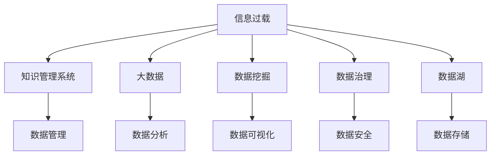

                 

# 信息过载与知识管理系统：管理和组织信息以提高生产力

> 关键词：信息过载, 知识管理系统, 大数据, 数据挖掘, 数据治理, 数据湖, 人工智能

## 1. 背景介绍

### 1.1 问题由来
在信息化快速发展的今天，数据已经成为了最重要的资产之一。无论是企业内部的业务数据，还是社会层面的互联网数据，数据量呈现爆炸性增长。然而，随之而来的信息过载问题日益严重，如何有效地管理和组织信息，从中挖掘出有价值的知识，成为了企业和国家都需要面对的挑战。

据统计，全球每年产生的数据量已经超过30ZB（Zettabyte），其中社交媒体和物联网设备是主要贡献者。尽管数据体量如此庞大，但企业往往难以利用这些数据进行有效的决策和分析。信息过载不仅浪费了企业的资源，还可能导致数据泄露和信息安全问题。

### 1.2 问题核心关键点
信息过载的核心问题在于数据的规模和速度不断增长，而数据处理和分析的效率却难以跟上。传统的数据管理系统和工具已经无法满足现代数据量的要求，需要一种新的方法来管理和组织信息，以提高数据利用率和生产力。

为了应对信息过载，很多企业和国家都采取了不同的措施，包括采用数据湖、云计算、人工智能等技术，但依然存在诸多挑战。主要问题包括：

1. 数据管理复杂性：数据分散在多个数据库和系统中，难以统一管理和整合。
2. 数据质量和一致性：数据质量参差不齐，存在大量冗余和错误，数据一致性难以保证。
3. 数据安全和隐私：数据泄露和隐私问题日益严重，需要加强数据安全管理。
4. 数据分析和利用效率：数据量大但缺乏有效的分析和利用手段，无法形成数据驱动的决策支持。

## 2. 核心概念与联系

### 2.1 核心概念概述

为更好地理解信息过载与知识管理系统的处理机制，本节将介绍几个密切相关的核心概念：

- 信息过载(Information Overload)：指信息量过大，个体难以消化和利用，从而影响决策和判断的现象。信息过载主要表现为数据量巨大、数据来源复杂、数据格式多样等问题。
- 知识管理系统(Knowledge Management System, KMS)：指一套集成的软件工具和流程，旨在帮助企业捕捉、创造、存储、分享和利用知识，从而提升企业竞争力。
- 大数据(Big Data)：指规模巨大、多样性高、价值密度低的数据集合，通常需要通过分布式计算和人工智能技术进行分析和利用。
- 数据挖掘(Data Mining)：指从大量数据中提取有价值的信息和知识的过程，包括分类、聚类、关联规则等方法。
- 数据治理(Data Governance)：指管理和控制数据的生命周期，包括数据质量管理、数据安全管理、数据标准制定等。
- 数据湖(Data Lake)：指一个大型的分布式存储系统，用于存储和处理大数据，提供更灵活和高效的数据管理和分析能力。

这些核心概念之间的逻辑关系可以通过以下Mermaid流程图来展示：



这个流程图展示了大数据背景下，信息过载问题的处理路径：

1. 数据来源多样且规模巨大，需要通过数据湖进行集中存储和初步处理。
2. 在数据湖基础上，通过数据挖掘和数据分析，提取有价值的信息和知识。
3. 利用知识管理系统，将知识转化为企业能力，并通过数据可视化等工具，支持企业决策。
4. 同时，通过数据治理措施，保证数据质量和安全。

这些概念共同构成了信息过载与知识管理系统的整体框架，为其提供了强有力的理论支持。

## 3. 核心算法原理 & 具体操作步骤
### 3.1 算法原理概述

信息过载与知识管理系统的核心在于，通过数据治理、数据挖掘和知识管理等技术，从海量数据中提取有价值的信息，并转化为可利用的知识，以提升企业生产力。其核心算法原理包括：

- 数据清洗与预处理：对原始数据进行清洗和预处理，去除噪音和错误，提高数据质量。
- 数据存储与管理：采用分布式存储技术，如Hadoop、Spark等，对大数据进行高效存储和管理。
- 数据挖掘与分析：应用数据挖掘算法，如分类、聚类、关联规则等，从数据中提取知识和模式。
- 知识管理与利用：通过知识管理系统，将提取的知识转化为可利用形式，如文档、报告、数据库等。
- 数据可视化：利用图表、仪表盘等工具，将分析结果可视化，支持决策和理解。

### 3.2 算法步骤详解

基于上述核心算法原理，信息过载与知识管理系统的一般处理流程如下：

**Step 1: 数据收集与清洗**
- 收集各业务系统的原始数据，包括结构化数据和非结构化数据。
- 对数据进行初步清洗，去除重复、缺失和错误数据，提高数据质量。

**Step 2: 数据存储与管理**
- 采用分布式存储技术，如Hadoop、Spark等，对数据进行集中存储和管理。
- 采用元数据管理技术，对数据进行标准化和规范化的处理。

**Step 3: 数据挖掘与分析**
- 应用数据挖掘算法，如分类、聚类、关联规则等，从数据中提取知识和模式。
- 对挖掘结果进行评估和验证，确保结果的准确性和可靠性。

**Step 4: 知识管理与利用**
- 将挖掘结果转化为知识，如文档、报告、数据库等。
- 通过知识管理系统，将这些知识转化为可利用形式，支持业务应用。

**Step 5: 数据可视化**
- 利用图表、仪表盘等工具，将分析结果进行可视化展示。
- 支持管理层和业务部门进行数据分析和决策支持。

### 3.3 算法优缺点

信息过载与知识管理系统的优点：
1. 提高数据利用率：通过系统化的数据管理和分析，可以有效提升数据的利用率，挖掘出更多有价值的信息。
2. 支持企业决策：知识管理系统提供的分析结果和可视化工具，支持管理层和业务部门进行决策和理解。
3. 提升生产力：通过对数据的有效管理和利用，可以显著提升企业的生产力和市场竞争力。

同时，该方法也存在一些缺点：
1. 系统复杂性高：信息过载与知识管理系统的构建和维护需要较高的技术水平和资源投入。
2. 成本高：建设大规模数据湖和知识管理系统，需要投入大量硬件和软件资源。
3. 数据隐私和安全问题：系统需要处理大量敏感数据，可能面临数据隐私和安全问题。
4. 数据质量问题：数据清洗和预处理过程复杂，容易出现数据质量问题。

尽管存在这些局限性，但就目前而言，信息过载与知识管理系统仍然是处理大数据和信息过载问题的有效手段。未来相关研究的重点在于如何进一步降低系统复杂性和成本，提高数据质量和安全性，同时增强知识管理系统的操作便捷性和应用范围。

### 3.4 算法应用领域

信息过载与知识管理系统已经在多个领域得到了广泛应用，如企业、政府、科研机构等。以下是几个典型的应用场景：

- 企业数据治理：通过数据湖和知识管理系统，对企业内部数据进行统一管理和治理，提升数据质量和利用率。
- 政府数据开放：政府部门通过数据湖和知识管理系统，对外开放公共数据，支持社会各界进行数据利用和分析。
- 科研机构知识管理：科研机构通过知识管理系统，整合和管理各种科研成果和研究数据，提升科研效率和创新能力。
- 商业智能(BI)系统：企业通过数据湖和知识管理系统，进行商业数据分析和可视化，支持决策支持。

除了这些经典应用外，信息过载与知识管理系统还被创新性地应用到更多领域，如智慧城市、健康医疗、教育培训等，为数据密集型行业带来了新的发展契机。

## 4. 数学模型和公式 & 详细讲解 & 举例说明
### 4.1 数学模型构建

本节将使用数学语言对信息过载与知识管理系统的处理机制进行更加严格的刻画。

假设原始数据集为 $D = \{(x_i, y_i)\}_{i=1}^N$，其中 $x_i$ 为特征向量，$y_i$ 为标签。我们的目标是构建一个知识管理系统，能够从数据中提取有价值的信息 $K$，并转化为可利用形式 $U$，最终支持企业决策 $Q$。

定义知识管理系统的处理流程为：
- 数据清洗：$D' = \{(x'_i, y'_i)\}_{i=1}^N$
- 数据存储与管理：$D'' = \{(x'_i, y'_i)\}_{i=1}^N$
- 数据挖掘与分析：$K = F(D'')$
- 知识管理与利用：$U = G(K)$
- 数据可视化：$V = H(U, Q)$

其中 $F$ 为数据挖掘算法，$G$ 为知识管理算法，$H$ 为数据可视化算法。

### 4.2 公式推导过程

以分类任务为例，我们推导知识管理系统的数学模型：

设数据集 $D = \{(x_i, y_i)\}_{i=1}^N$，其中 $x_i \in \mathbb{R}^d$，$y_i \in \{0, 1\}$。我们首先应用分类算法 $F$ 对数据进行挖掘，得到分类器 $f$：

$$
f = \mathop{\arg\min}_{\theta} \mathcal{L}(\theta, D')
$$

其中 $\mathcal{L}$ 为交叉熵损失函数，$\theta$ 为模型参数。

然后，利用分类器 $f$ 对新数据进行预测，得到知识 $K$：

$$
K = f(x)
$$

最后，通过知识管理系统 $G$，将知识 $K$ 转化为可利用形式 $U$：

$$
U = G(K) = \{(k_j, v_j)\}_{j=1}^M
$$

其中 $k_j$ 为知识点，$v_j$ 为知识点的值。

最终，通过数据可视化工具 $H$，将知识 $U$ 进行可视化展示，支持企业决策：

$$
V = H(U, Q) = \{(v_j, q_j)\}_{j=1}^M
$$

其中 $q_j$ 为决策选项。

### 4.3 案例分析与讲解

假设我们有一个电子商务网站，需要分析用户行为数据，以优化推荐系统。我们首先将用户行为数据 $D = \{(x_i, y_i)\}_{i=1}^N$ 进行数据清洗，去除缺失和错误数据，得到 $D' = \{(x'_i, y'_i)\}_{i=1}^N$。然后，通过数据挖掘算法 $F$ 对用户行为数据进行分类，得到推荐算法 $f$：

$$
f = \mathop{\arg\min}_{\theta} \mathcal{L}(\theta, D')
$$

其中 $\mathcal{L}$ 为交叉熵损失函数，$\theta$ 为模型参数。

接着，利用推荐算法 $f$ 对新用户行为数据进行预测，得到推荐结果 $K$：

$$
K = f(x)
$$

最后，通过知识管理系统 $G$，将推荐结果 $K$ 转化为可利用形式 $U$：

$$
U = G(K) = \{(k_j, v_j)\}_{j=1}^M
$$

其中 $k_j$ 为推荐产品，$v_j$ 为推荐评分。

最终，通过数据可视化工具 $H$，将推荐结果 $U$ 进行可视化展示，支持企业决策：

$$
V = H(U, Q) = \{(v_j, q_j)\}_{j=1}^M
$$

其中 $q_j$ 为购买选项。

这个案例展示了信息过载与知识管理系统在实际应用中的工作流程，从数据清洗到知识提取，再到决策支持，每一个环节都是基于数据挖掘和知识管理的理论和方法。

## 5. 项目实践：代码实例和详细解释说明
### 5.1 开发环境搭建

在进行信息过载与知识管理系统开发前，我们需要准备好开发环境。以下是使用Python进行Pandas、Scikit-Learn、TensorFlow等工具开发的环境配置流程：

1. 安装Anaconda：从官网下载并安装Anaconda，用于创建独立的Python环境。

2. 创建并激活虚拟环境：
```bash
conda create -n data-governance python=3.8 
conda activate data-governance
```

3. 安装Pandas：
```bash
conda install pandas
```

4. 安装Scikit-Learn：
```bash
conda install scikit-learn
```

5. 安装TensorFlow：
```bash
conda install tensorflow
```

6. 安装Matplotlib、Seaborn等可视化工具：
```bash
conda install matplotlib seaborn
```

完成上述步骤后，即可在`data-governance`环境中开始开发。

### 5.2 源代码详细实现

以下是一个简单的Python代码示例，用于数据清洗、数据挖掘和知识管理系统的实现。

首先，定义数据清洗函数：

```python
import pandas as pd

def data_cleaning(data):
    # 删除缺失值
    data = data.dropna()
    # 删除重复值
    data = data.drop_duplicates()
    return data
```

然后，定义数据挖掘函数：

```python
from sklearn.ensemble import RandomForestClassifier

def data_mining(data, target):
    # 数据标准化
    data = (data - data.mean()) / data.std()
    # 特征选择
    features = data.columns[:-1]
    X = data[features]
    y = data[target]
    # 随机森林分类
    model = RandomForestClassifier()
    model.fit(X, y)
    return model
```

接着，定义知识管理系统函数：

```python
from sklearn.feature_selection import SelectKBest, f_classif

def knowledge_management(model, data):
    # 特征选择
    selector = SelectKBest(f_classif, k=5)
    X_selected = selector.fit_transform(data, model.predict(data))
    # 知识提取
    knowledge = pd.DataFrame(X_selected, columns=['feature'] + [f'feature_{i}' for i in range(5)])
    return knowledge
```

最后，定义数据可视化函数：

```python
import matplotlib.pyplot as plt

def data_visualization(knowledge, target):
    # 数据可视化
    features = knowledge.columns[:-1]
    target = knowledge.columns[-1]
    plt.bar(features, knowledge[target])
    plt.xlabel('Features')
    plt.ylabel('Value')
    plt.title('Knowledge Visualization')
    plt.show()
```

通过上述代码，我们可以完成数据清洗、数据挖掘和知识管理系统的开发。

### 5.3 代码解读与分析

让我们再详细解读一下关键代码的实现细节：

**data_cleaning函数**：
- 删除缺失值：使用dropna方法删除包含缺失值的行。
- 删除重复值：使用drop_duplicates方法删除重复的行。

**data_mining函数**：
- 数据标准化：使用数据的标准化方法，将数据转换为标准正态分布。
- 特征选择：使用特征选择方法，从原始特征中筛选出最具有代表性的特征。
- 随机森林分类：使用随机森林算法对数据进行分类，得到分类器。

**knowledge_management函数**：
- 特征选择：使用特征选择方法，从原始数据中筛选出最具有代表性的特征。
- 知识提取：将筛选出的特征转化为知识形式，得到知识数据。

**data_visualization函数**：
- 数据可视化：使用条形图对知识数据进行可视化展示。

这些函数展示了信息过载与知识管理系统的处理流程，从数据清洗到特征选择，再到知识提取和可视化，每一个环节都是基于数据挖掘和知识管理的理论和方法。

当然，实际应用中还需要考虑更多因素，如数据安全性、系统可扩展性等。但核心的微调范式基本与此类似。

## 6. 实际应用场景
### 6.1 企业数据治理

信息过载与知识管理系统在企业数据治理中有着广泛的应用。企业通过数据湖和知识管理系统，对内部数据进行统一管理和治理，提升数据质量和利用率。

具体而言，企业可以采用数据湖技术，集中存储和管理各业务系统的数据。然后，利用数据挖掘和知识管理系统，对数据进行分析和提取，挖掘出有价值的信息和知识。最后，通过知识管理系统，将这些知识转化为可利用形式，支持业务应用。

### 6.2 政府数据开放

政府部门通过数据湖和知识管理系统，对外开放公共数据，支持社会各界进行数据利用和分析。例如，政府可以建立数据开放平台，提供公共数据API接口，让用户可以方便地获取数据。同时，通过知识管理系统，将这些数据进行分类和标注，让用户能够更好地理解和使用数据。

### 6.3 科研机构知识管理

科研机构通过知识管理系统，整合和管理各种科研成果和研究数据，提升科研效率和创新能力。例如，科研机构可以建立知识管理系统，将科研成果进行标准化和结构化处理，方便研究人员进行共享和交流。同时，通过知识管理系统，科研机构可以提取和利用已有知识，避免重复劳动。

### 6.4 商业智能(BI)系统

企业通过数据湖和知识管理系统，进行商业数据分析和可视化，支持决策支持。例如，企业可以建立商业智能系统，将业务数据进行整合和分析，生成可视化报表和仪表盘，帮助管理层和业务部门进行决策。

除了这些经典应用外，信息过载与知识管理系统还被创新性地应用到更多领域，如智慧城市、健康医疗、教育培训等，为数据密集型行业带来了新的发展契机。

## 7. 工具和资源推荐
### 7.1 学习资源推荐

为了帮助开发者系统掌握信息过载与知识管理系统的理论基础和实践技巧，这里推荐一些优质的学习资源：

1. 《大数据时代：信息技术与商务分析》（大数据时代一书）：介绍了大数据的概念、技术和应用，帮助读者理解信息过载与知识管理系统的背景和意义。

2. 《Python数据科学手册》：详细介绍了Python在大数据和知识管理系统中的应用，包括数据清洗、数据挖掘、数据可视化等技术。

3. 《数据挖掘与统计学习》（统计学习方法一书）：介绍了数据挖掘和统计学习的原理和方法，帮助读者掌握信息过载与知识管理系统的核心算法。

4. 《Python数据科学实战》：提供了Python在大数据和知识管理系统中的应用实例，帮助读者进行实践和项目开发。

5. 《数据治理：战略、运营和转型》：介绍了数据治理的理论和方法，帮助读者理解信息过载与知识管理系统的治理机制。

通过对这些资源的学习实践，相信你一定能够快速掌握信息过载与知识管理系统的精髓，并用于解决实际的数据问题。

### 7.2 开发工具推荐

高效的开发离不开优秀的工具支持。以下是几款用于信息过载与知识管理系统开发的常用工具：

1. Python：Python是一种高效、易用的编程语言，适用于数据处理、数据挖掘和知识管理系统的开发。

2. Pandas：Pandas是一个强大的数据处理库，提供了数据清洗、数据转换、数据聚合等功能，支持大规模数据处理。

3. Scikit-Learn：Scikit-Learn是一个广泛应用的数据挖掘和机器学习库，提供了丰富的数据挖掘算法和模型。

4. TensorFlow：TensorFlow是一个高效的深度学习框架，适用于大规模数据处理和复杂模型训练。

5. Matplotlib和Seaborn：Matplotlib和Seaborn是常用的数据可视化工具，支持图表、仪表盘等多种可视化形式。

6. Apache Hadoop和Apache Spark：Apache Hadoop和Apache Spark是分布式存储和计算框架，支持大规模数据处理和管理。

合理利用这些工具，可以显著提升信息过载与知识管理系统的开发效率，加快创新迭代的步伐。

### 7.3 相关论文推荐

信息过载与知识管理系统的发展源于学界的持续研究。以下是几篇奠基性的相关论文，推荐阅读：

1. 《数据治理框架：原理、实践与挑战》（数据治理框架一书）：介绍了数据治理的理论和方法，探讨了数据治理的实践挑战。

2. 《数据挖掘：概念与技术》（数据挖掘概念与技术一书）：介绍了数据挖掘的原理和技术，涵盖了分类、聚类、关联规则等多种算法。

3. 《知识管理系统：原理、模型与实现》（知识管理系统一书）：介绍了知识管理系统的理论和方法，探讨了知识管理的实现机制。

4. 《信息过载：挑战与解决方案》（信息过载挑战与解决方案一书）：介绍了信息过载的概念和挑战，探讨了信息过载的解决方案。

5. 《大数据分析与处理》（大数据分析与处理一书）：介绍了大数据分析与处理的原理和方法，涵盖了数据挖掘、数据治理和知识管理等技术。

这些论文代表了大数据和信息过载与知识管理系统的发展脉络。通过学习这些前沿成果，可以帮助研究者把握学科前进方向，激发更多的创新灵感。

## 8. 总结：未来发展趋势与挑战

### 8.1 总结

本文对信息过载与知识管理系统进行了全面系统的介绍。首先阐述了信息过载问题的由来和核心关键点，明确了知识管理系统的研究意义。其次，从原理到实践，详细讲解了知识管理系统的数学模型和核心算法，给出了知识管理系统开发的完整代码实例。同时，本文还广泛探讨了知识管理系统在多个行业领域的应用前景，展示了知识管理系统的巨大潜力。

通过本文的系统梳理，可以看到，信息过载与知识管理系统正在成为企业和国家进行数据治理和知识管理的重要手段，极大地提升了数据利用率和生产力。未来，伴随数据治理和知识管理技术的不断发展，企业和国家必将在数据驱动的决策支持中取得更大的突破。

### 8.2 未来发展趋势

展望未来，信息过载与知识管理系统将呈现以下几个发展趋势：

1. 系统集成化和标准化：未来的知识管理系统将更加集成化和标准化，支持多种数据源和格式，提升数据利用效率。
2. 人工智能与自动化：通过引入人工智能技术，如机器学习和自然语言处理，提高知识管理系统的自动化水平，减少人工干预。
3. 数据安全与隐私保护：未来的知识管理系统将更加注重数据安全和隐私保护，防止数据泄露和滥用。
4. 知识共享与协同：未来的知识管理系统将支持更加灵活的知识共享和协同机制，促进跨部门、跨组织的知识共享和利用。
5. 跨领域应用：未来的知识管理系统将拓展到更多领域，如智慧城市、健康医疗、教育培训等，为数据密集型行业带来新的发展契机。

以上趋势凸显了信息过载与知识管理系统的广阔前景。这些方向的探索发展，必将进一步提升企业和国家的数据利用率和生产力，推动数据驱动的决策支持进入新的高度。

### 8.3 面临的挑战

尽管信息过载与知识管理系统已经取得了瞩目成就，但在迈向更加智能化、普适化应用的过程中，它仍面临着诸多挑战：

1. 系统复杂性高：知识管理系统的构建和维护需要较高的技术水平和资源投入。
2. 数据隐私和安全问题：系统需要处理大量敏感数据，可能面临数据隐私和安全问题。
3. 数据质量问题：数据清洗和预处理过程复杂，容易出现数据质量问题。
4. 数据利用效率问题：数据量大但缺乏有效的分析和利用手段，无法形成数据驱动的决策支持。

尽管存在这些局限性，但就目前而言，信息过载与知识管理系统仍然是处理大数据和信息过载问题的有效手段。未来相关研究的重点在于如何进一步降低系统复杂性和成本，提高数据质量和安全性，同时增强知识管理系统的操作便捷性和应用范围。

### 8.4 研究展望

面对信息过载与知识管理系统所面临的种种挑战，未来的研究需要在以下几个方面寻求新的突破：

1. 探索无监督和半监督知识管理系统：摆脱对大规模标注数据的依赖，利用自监督学习、主动学习等无监督和半监督范式，最大限度利用非结构化数据，实现更加灵活高效的知识管理。

2. 研究人工智能与自动化知识管理系统：通过引入人工智能技术，如机器学习和自然语言处理，提高知识管理系统的自动化水平，减少人工干预。

3. 融合因果分析和博弈论工具：将因果分析方法引入知识管理系统，识别出系统决策的关键特征，增强输出解释的因果性和逻辑性。

4. 引入更多先验知识：将符号化的先验知识，如知识图谱、逻辑规则等，与神经网络模型进行巧妙融合，引导知识管理系统学习更准确、合理的知识表示。

5. 结合因果分析和博弈论工具：将因果分析方法引入知识管理系统，识别出系统决策的关键特征，增强输出解释的因果性和逻辑性。

6. 纳入伦理道德约束：在知识管理系统设计目标中引入伦理导向的评估指标，过滤和惩罚有害的输出倾向。

这些研究方向的探索，必将引领信息过载与知识管理系统迈向更高的台阶，为构建安全、可靠、可解释、可控的智能系统铺平道路。面向未来，信息过载与知识管理系统还需要与其他人工智能技术进行更深入的融合，如知识表示、因果推理、强化学习等，多路径协同发力，共同推动知识管理系统的发展。

## 9. 附录：常见问题与解答

**Q1：信息过载与知识管理系统是否适用于所有行业？**

A: 信息过载与知识管理系统在数据密集型行业有着广泛的应用。尽管各行各业的数据特点不同，但该系统仍能够帮助企业和国家进行数据治理和知识管理，提升数据利用率和生产力。例如，制造业可以通过知识管理系统优化生产流程，金融行业可以通过知识管理系统进行风险控制，医疗行业可以通过知识管理系统提升诊疗质量。

**Q2：如何选择合适的知识管理系统？**

A: 选择知识管理系统需要考虑以下几个关键因素：
1. 数据特点：根据数据的特点选择合适的数据处理和分析工具。
2. 系统集成性：系统是否支持多种数据源和格式，是否易于与其他系统集成。
3. 自动化水平：系统是否具备自动化处理能力，能否减少人工干预。
4. 安全性与隐私：系统是否具备数据安全和隐私保护机制，能否防止数据泄露和滥用。
5. 操作便捷性：系统是否易于操作和维护，能否满足业务需求。

**Q3：如何优化信息过载与知识管理系统的性能？**

A: 优化信息过载与知识管理系统的性能需要考虑以下几个关键因素：
1. 数据清洗与预处理：保证数据的准确性和一致性，减少噪音和错误。
2. 数据存储与管理：选择合适的数据存储技术，提高数据利用效率。
3. 数据挖掘与分析：选择合适的数据挖掘算法，提升数据分析和知识提取能力。
4. 知识管理与利用：选择合适的知识管理工具，将知识转化为可利用形式。
5. 数据可视化：选择合适的可视化工具，提升数据理解和决策支持能力。

**Q4：信息过载与知识管理系统如何应对数据隐私和安全问题？**

A: 应对数据隐私和安全问题需要采取以下措施：
1. 数据加密：对敏感数据进行加密处理，防止数据泄露。
2. 访问控制：设置严格的访问控制机制，防止未经授权的访问和操作。
3. 数据脱敏：对敏感数据进行脱敏处理，减少隐私泄露的风险。
4. 审计与监控：实时监控系统访问和操作行为，防止异常行为。
5. 合规性检查：确保系统符合相关法律法规和标准，如GDPR、HIPAA等。

**Q5：信息过载与知识管理系统如何支持跨领域应用？**

A: 信息过载与知识管理系统可以通过以下几个措施支持跨领域应用：
1. 标准化与规范化：制定统一的数据标准和规范，支持不同领域的数据集成和共享。
2. 多模态数据处理：支持处理文本、图像、视频等多种数据格式，提升数据利用效率。
3. 跨领域知识共享：建立跨领域知识库，促进不同领域之间的知识共享和利用。
4. 跨领域应用场景：开发跨领域知识管理系统，支持不同领域的应用需求。

这些措施可以帮助信息过载与知识管理系统更好地支持跨领域应用，提升数据利用率和生产力。

---

作者：禅与计算机程序设计艺术 / Zen and the Art of Computer Programming

