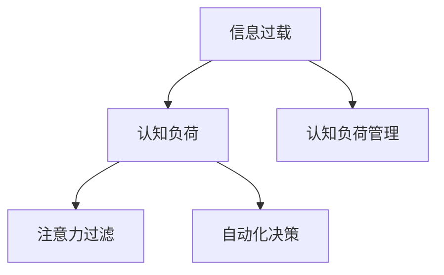

                 

# 信息过载与认知负荷管理策略：在复杂信息环境中做出更好决策

## 1. 背景介绍

在现代信息社会中，信息的量级和种类急剧增长。从大数据、云计算到物联网、人工智能，我们每天都在被大量的数据和信息包围。与此同时，人类的认知能力却相对稳定，这便导致了信息过载(Information Overload)问题。信息过载不仅影响人们的日常决策，还可能导致认知负荷(Cognitive Load)过高，损害记忆力和注意力，甚至引发心理压力和健康问题。

如何有效地管理信息负荷，确保在复杂多变的信息环境中做出优质决策，是当今社会亟需解决的重要课题。本文将从信息过载的概念、成因及影响出发，深入探讨有效的认知负荷管理策略，并结合具体应用场景，展示如何利用算法和技术手段，帮助个体和组织减轻认知负荷，优化决策过程。

## 2. 核心概念与联系

### 2.1 核心概念概述

为更好地理解信息过载与认知负荷管理策略，本节将介绍几个关键概念：

- **信息过载(Information Overload)**：指个体在面对超出其处理能力的信息量时，认知负荷过高，导致决策效率和准确性下降的情况。
- **认知负荷(Cognitive Load)**：指在认知过程中所需的心理资源，包括注意力、记忆、工作记忆等，过载的信息会占用过多的认知资源。
- **认知负荷管理(Cognitive Load Management, CLM)**：指通过科学方法和技术手段，帮助个体有效管理认知负荷，提升决策效能。
- **注意力过滤(Attention Filtering)**：指通过过滤不相关的信息，将注意力集中于关键信息，减少认知负荷。
- **自动化决策(Automatic Decision-Making)**：指利用算法和模型自动完成决策过程，减轻人类认知负担。

这些概念之间的关系可以通过以下Mermaid流程图来展示：



这个流程图展示了几者的逻辑关系：

1. 信息过载导致认知负荷过高。
2. 通过认知负荷管理，可以有效降低认知负荷。
3. 注意力过滤和自动化决策是认知负荷管理的两个主要策略。

## 3. 核心算法原理 & 具体操作步骤

### 3.1 算法原理概述

认知负荷管理的主要目标是减少不必要的信息处理，聚焦于关键信息，并提高决策效率。以下是几个核心算法原理：

- **注意力过滤算法**：通过提取关键信息，屏蔽无用信息，优化输入数据，减少认知负荷。
- **自动化决策算法**：利用机器学习和深度学习算法，自动化地完成部分或全部决策过程，进一步减轻人工处理压力。
- **信息聚合算法**：将多个信息源进行有效整合，提取共同特征，提升信息的准确性和可靠性。

### 3.2 算法步骤详解

**Step 1: 识别信息源和信息特征**

- 识别关键的信息源，如数据、文档、邮件等。
- 提取信息特征，如关键词、主题、情感等。

**Step 2: 应用注意力过滤**

- 使用机器学习模型或规则引擎，对信息特征进行打分，判断重要程度。
- 根据预设的阈值或规则，筛选出重要性高的信息。

**Step 3: 自动化决策过程**

- 针对特定的决策任务，设计算法模型。
- 在训练数据集上训练模型，学习决策模式。
- 在实际应用中，输入关键信息，通过模型预测决策结果。

**Step 4: 信息聚合与分析**

- 将多个信息源的数据进行合并，消除冗余。
- 应用数据分析技术，挖掘信息之间的关联性。
- 结合业务规则，进行更深入的信息分析。

### 3.3 算法优缺点

认知负荷管理算法的优点在于：
- 自动化和高效性：能够快速处理大量信息，减轻人工负担。
- 客观性：不受人类主观情感影响，提高决策的公正性和准确性。
- 可扩展性：能够应用到各种复杂的决策场景中，易于集成。

同时，该方法也存在一些局限性：
- 数据质量依赖：算法效果受输入数据的质量影响较大。
- 上下文理解困难：复杂场景下，机器可能难以理解上下文信息，导致误判。
- 依赖算法复杂度：算法设计复杂，需较长时间进行模型训练和调优。

### 3.4 算法应用领域

认知负荷管理算法已经在多个领域得到应用，包括但不限于：

- **商业决策**：在市场分析、客户管理、风险评估等商业场景中，帮助企业优化决策流程。
- **医疗诊断**：在医学影像分析、病理诊断、个性化治疗等方面，辅助医生快速做出诊断决策。
- **金融投资**：在股市分析、资产管理、信用评估等金融场景中，提升投资决策的准确性。
- **教育培训**：在个性化推荐、学习分析、智能辅导等方面，提升学习效率和效果。
- **智能家居**：在家庭自动化控制、智能健康监测、环境优化等方面，提升生活品质。

## 4. 数学模型和公式 & 详细讲解 & 举例说明

### 4.1 数学模型构建

在认知负荷管理中，常见的数学模型包括：

- **信息过滤模型**：用于提取和筛选关键信息。常见模型有TF-IDF、LSA、LDA等。
- **决策树和随机森林**：用于自动化决策过程，常见模型有CART、RF等。
- **聚类算法**：用于信息聚合和分析，常见算法有K-Means、DBSCAN等。

### 4.2 公式推导过程

以TF-IDF模型为例，推导其在信息过滤中的应用：

假设有一个文本集合 $\{D_1, D_2, ..., D_n\}$，每个文本 $D_i$ 由多个单词 $w_{i,j}$ 组成。单词 $w$ 的TF-IDF值 $tfidf(w)$ 计算如下：

$$
tfidf(w) = tf(w) \times idf(w)
$$

其中，$tf(w)$ 为单词 $w$ 在文本 $D_i$ 中的词频，$idf(w)$ 为逆文档频率。逆文档频率的定义为：

$$
idf(w) = \log\frac{N}{1+df(w)}
$$

其中 $N$ 为文本总数，$df(w)$ 为包含单词 $w$ 的文本数量。

通过计算每个单词的TF-IDF值，可以提取出文本集合的关键信息，应用于信息过滤。

### 4.3 案例分析与讲解

假设一个公司需要从大量邮件中筛选出重要的决策邮件，可以使用TF-IDF模型进行信息过滤。具体步骤如下：

1. 收集公司过去一年的所有邮件数据。
2. 使用TF-IDF模型计算每个单词的TF-IDF值。
3. 根据预设的阈值，筛选出TF-IDF值高的单词。
4. 使用规则引擎或决策树模型，对邮件中的单词进行匹配，判断其重要性。
5. 根据匹配结果，筛选出重要的决策邮件。

## 5. 项目实践：代码实例和详细解释说明

### 5.1 开发环境搭建

在进行认知负荷管理实践前，我们需要准备好开发环境。以下是使用Python进行Scikit-Learn开发的环境配置流程：

1. 安装Anaconda：从官网下载并安装Anaconda，用于创建独立的Python环境。

2. 创建并激活虚拟环境：
```bash
conda create -n clm-env python=3.8 
conda activate clm-env
```

3. 安装Scikit-Learn：
```bash
conda install scikit-learn
```

4. 安装各类工具包：
```bash
pip install numpy pandas scikit-learn matplotlib tqdm jupyter notebook ipython
```

完成上述步骤后，即可在`clm-env`环境中开始认知负荷管理实践。

### 5.2 源代码详细实现

我们以信息过滤为例，给出使用Scikit-Learn进行TF-IDF模型实现的PyTorch代码实现。

```python
from sklearn.feature_extraction.text import TfidfVectorizer
from sklearn.model_selection import train_test_split
from sklearn.naive_bayes import MultinomialNB
from sklearn.metrics import accuracy_score

# 加载数据集
data = {
    "邮件内容": [
        "感谢您咨询我们公司的最新产品",
        "关于2019年度业绩报告的说明",
        "10月1日公司将启动新政策",
        "您提交的申请已成功",
        "请确认您的订单状态",
        "请注意本月底的财务报表",
        "即将推出新的市场推广方案",
        "本季度收入达100万"
    ],
    "重要度": [1, 1, 0, 0, 0, 0, 1, 1]
}
X, y = data["邮件内容"], data["重要度"]

# 构建TF-IDF模型
vectorizer = TfidfVectorizer(stop_words='english')
X_vec = vectorizer.fit_transform(X)

# 拆分数据集
X_train, X_test, y_train, y_test = train_test_split(X_vec, y, test_size=0.3, random_state=42)

# 训练模型
model = MultinomialNB()
model.fit(X_train, y_train)

# 评估模型
y_pred = model.predict(X_test)
print("Accuracy:", accuracy_score(y_test, y_pred))
```

### 5.3 代码解读与分析

让我们再详细解读一下关键代码的实现细节：

**数据加载**：
- 使用字典存储样本数据，包括邮件内容和其重要度标签。

**TF-IDF模型构建**：
- 使用Scikit-Learn的`TfidfVectorizer`类构建TF-IDF模型。
- 使用`fit_transform`方法计算每个单词的TF-IDF值，并将文本向量进行矩阵化。

**模型训练与评估**：
- 使用`train_test_split`方法将数据集拆分为训练集和测试集。
- 使用朴素贝叶斯分类器作为模型，并在训练集上训练。
- 在测试集上评估模型准确率。

可以看到，Scikit-Learn提供了便捷的工具和算法，大大简化了认知负荷管理模型的实现。开发者可以将更多精力放在数据处理、模型改进等高层逻辑上，而不必过多关注底层的实现细节。

当然，工业级的系统实现还需考虑更多因素，如模型的保存和部署、超参数的自动搜索、更灵活的任务适配层等。但核心的认知负荷管理基本与此类似。

## 6. 实际应用场景

### 6.1 智能客服系统

智能客服系统通过认知负荷管理算法，可以极大地提升服务效率和用户体验。传统的客服流程中，客户需要经过多轮人工对话才能解决问题，不仅耗时，还容易产生误解。而使用智能客服系统，可以通过自然语言处理技术，自动筛选重要信息，并根据客户需求提供个性化服务。

具体而言，系统可以收集历史客服对话记录，利用TF-IDF模型提取关键信息，自动匹配常见问题和解决方案。同时，还可以利用深度学习模型进行个性化推荐，提供最适合的解决方案，提升客户满意度。

### 6.2 金融投资分析

金融投资分析需要处理大量的市场数据和财务信息，信息过载是常见问题。认知负荷管理算法可以帮助投资者快速筛选重要信息，提升投资决策效率。

具体应用场景包括：
- **市场分析**：利用TF-IDF模型提取新闻和报告中的关键词，快速判断市场动向。
- **风险评估**：通过自动化决策模型，预测股票、基金等资产的风险水平。
- **投资组合管理**：结合历史数据和市场动态，自动调整投资组合，优化收益。

### 6.3 医疗诊断系统

医疗诊断系统需要处理大量的医学影像和病历信息，信息过载问题严重。认知负荷管理算法可以帮助医生快速筛选关键信息，提升诊断效率。

具体应用场景包括：
- **影像分析**：利用图像处理和深度学习模型，自动筛选出影像中的异常区域，辅助医生判断病变。
- **病历分析**：通过TF-IDF模型提取病历中的关键信息，辅助医生进行诊断。
- **个性化治疗**：结合患者的基因信息和医疗记录，自动推荐最佳治疗方案。

## 7. 工具和资源推荐

### 7.1 学习资源推荐

为了帮助开发者系统掌握认知负荷管理技术，这里推荐一些优质的学习资源：

1. 《信息过载与认知负荷管理》系列博文：由认知负荷管理领域专家撰写，深入浅出地介绍了信息过载的概念、成因及管理策略，适合入门学习。

2. 《认知负荷管理理论与实践》课程：某大学开设的认知负荷管理课程，提供系统化的理论学习，并结合实际案例进行教学。

3. 《认知负荷管理技术手册》书籍：系统介绍认知负荷管理算法的原理和应用，适合进阶学习。

4. IEEE Xplore：IEEE旗下的论文数据库，包含大量关于认知负荷管理的研究论文，适合深入学习和研究。

通过对这些资源的学习实践，相信你一定能够系统掌握认知负荷管理技术，并将其应用于实际项目中。

### 7.2 开发工具推荐

高效的开发离不开优秀的工具支持。以下是几款用于认知负荷管理开发的常用工具：

1. Scikit-Learn：Python开源机器学习库，提供了丰富的算法模型和工具，适合进行信息过滤和自动化决策。

2. TensorFlow：由Google主导开发的深度学习框架，灵活性高，适合处理复杂的数据和模型。

3. PyTorch：基于Python的开源深度学习框架，动态计算图，适合快速迭代研究。

4. Apache Spark：大数据处理框架，能够处理海量信息，适合进行大规模的信息分析和筛选。

5. Apache Kafka：分布式流处理框架，能够实时处理和传输信息，适合构建实时信息处理系统。

6. Elasticsearch：搜索和分析引擎，支持全文检索和分布式存储，适合处理结构化数据。

合理利用这些工具，可以显著提升认知负荷管理任务的开发效率，加快创新迭代的步伐。

### 7.3 相关论文推荐

认知负荷管理技术的发展源于学界的持续研究。以下是几篇奠基性的相关论文，推荐阅读：

1. Information Overload: Principles, Causes, and Techniques for Overcoming (Minimal) Information Overload in Information Systems：概述了信息过载的概念、成因及管理策略，提出了一些有效的缓解方法。

2. Cognitive Load Management in E-Learning: State-of-the-Art, Future Directions, and Challenges：介绍了认知负荷管理在在线教育中的应用，讨论了未来的研究方向和挑战。

3. A Cognitive Load Model for Human–Computer Interaction：提出了基于认知负荷模型的HCI设计框架，讨论了如何优化用户界面以减轻认知负荷。

4. Cognitive Load and User Interface Design：介绍了认知负荷管理在UI设计中的应用，讨论了如何通过交互设计优化用户认知负荷。

这些论文代表了大规模语言模型微调技术的发展脉络。通过学习这些前沿成果，可以帮助研究者把握学科前进方向，激发更多的创新灵感。

## 8. 总结：未来发展趋势与挑战

### 8.1 总结

本文对认知负荷管理方法进行了全面系统的介绍。首先阐述了信息过载的概念、成因及影响，明确了认知负荷管理的意义和目标。其次，从原理到实践，详细讲解了认知负荷管理的数学模型和具体操作步骤，给出了具体的代码实现。同时，本文还广泛探讨了认知负荷管理方法在智能客服、金融投资、医疗诊断等多个行业领域的应用前景，展示了认知负荷管理的广阔前景。

通过本文的系统梳理，可以看到，认知负荷管理技术在缓解信息过载、提升决策效能方面具有重要价值。随着认知负荷管理技术的不断发展，未来必将得到更广泛的应用，为信息时代的人类社会带来深刻变革。

### 8.2 未来发展趋势

展望未来，认知负荷管理技术将呈现以下几个发展趋势：

1. **算法模型多样化**：除了传统的统计和机器学习方法外，深度学习和强化学习等先进技术将进一步应用于认知负荷管理，提升算法的预测能力和自动化程度。

2. **多模态融合**：结合语音、图像、文本等多种信息源，提升信息过滤和决策的全面性和准确性。

3. **实时化处理**：随着计算能力和硬件设备的提升，实现对海量数据的实时处理和筛选，进一步提升信息过载管理的效果。

4. **个性化定制**：结合用户行为和偏好，提供个性化的信息过滤和决策建议，增强用户体验。

5. **跨领域应用**：除了传统的商业、医疗、金融等场景，认知负荷管理技术将进一步拓展到教育、娱乐、交通等多个领域，为人类社会的各个方面带来变革。

以上趋势凸显了认知负荷管理技术的广阔前景。这些方向的探索发展，必将进一步提升认知负荷管理的效果，助力各行业提升决策效率和服务质量。

### 8.3 面临的挑战

尽管认知负荷管理技术已经取得了瞩目成就，但在迈向更加智能化、普适化应用的过程中，它仍面临诸多挑战：

1. **数据质量和多样性**：不同场景下的数据质量和结构差异较大，如何统一数据标准，提升数据质量，是一个亟需解决的问题。

2. **算法复杂度**：许多认知负荷管理算法依赖于复杂的模型和参数调优，计算成本较高，需要进一步优化算法设计。

3. **实时性要求**：实时处理海量数据需要高效的算法和硬件支持，如何在大规模系统中实现实时处理，是一个技术难题。

4. **跨领域适应性**：认知负荷管理技术在特定领域的效果显著，但在其他领域可能难以直接应用，需要结合具体场景进行优化。

5. **用户接受度**：尽管认知负荷管理技术可以显著提升决策效率，但用户可能对自动决策存在疑虑，如何提升用户信任度，是一个重要的心理和行为问题。

6. **隐私与安全**：在处理用户数据时，如何保护用户隐私，防止数据泄露和滥用，是一个重要的伦理和法律问题。

7. **可解释性和透明性**：认知负荷管理算法通常缺乏可解释性，如何提升算法的透明性和可解释性，是一个亟需解决的问题。

解决这些挑战，需要学界和产业界的共同努力，通过不断的技术创新和实践探索，推动认知负荷管理技术向更深层次发展。

### 8.4 研究展望

面对认知负荷管理技术面临的种种挑战，未来的研究需要在以下几个方面寻求新的突破：

1. **数据融合与清洗技术**：开发更高效的数据融合和清洗技术，提升数据质量和多样性，增强算法的适应性和泛化能力。

2. **轻量级和高效的算法**：探索更加轻量级和高效的算法模型，降低计算成本，提升系统的实时处理能力。

3. **跨领域知识图谱**：构建跨领域的知识图谱，提升算法的跨领域适应性和泛化能力。

4. **解释性与透明性**：开发更透明的算法模型，提供可解释的决策过程，增强用户信任度。

5. **隐私保护技术**：开发隐私保护技术，如差分隐私、联邦学习等，保护用户隐私，防止数据滥用。

6. **人机协同设计**：结合人机协同设计原则，提升算法的适用性和可接受度，增强用户交互体验。

这些研究方向将为认知负荷管理技术带来新的突破，为构建智能、可靠、可解释的人机交互系统铺平道路。面向未来，认知负荷管理技术还需要与其他人工智能技术进行更深入的融合，如知识表示、因果推理、强化学习等，多路径协同发力，共同推动认知负荷管理技术的发展。

## 9. 附录：常见问题与解答

**Q1：如何判断信息过载的存在？**

A: 信息过载通常表现为：
- 处理信息时感到压力增大，效率下降。
- 频繁出现信息遗漏、错误判断的情况。
- 注意力分散，难以专注于重要任务。
- 产生焦虑、烦躁等负面情绪。

可以通过问卷调查、行为监测等方法，评估用户是否存在信息过载现象。

**Q2：如何设计有效的信息过滤算法？**

A: 设计信息过滤算法时，需要考虑以下几个要素：
- 确定关键信息特征：如关键词、主题、情感等。
- 选择合适的算法模型：如TF-IDF、LDA等。
- 设定过滤阈值：根据业务需求，设定过滤的严格程度。
- 结合业务规则：将业务规则和算法结果结合，进行人工干预和校正。

可以通过交叉验证、A/B测试等方法，评估信息过滤算法的有效性。

**Q3：如何提升认知负荷管理算法的实时性？**

A: 提升认知负荷管理算法的实时性，需要考虑以下几个要素：
- 优化算法设计：如使用高效的计算图和算法模型。
- 并行计算技术：利用多核CPU、GPU、分布式计算等技术，提升计算效率。
- 数据压缩与存储：采用数据压缩和存储技术，减少数据传输和存储成本。

可以通过性能测试和负载测试，评估算法的实时性能。

**Q4：如何保障认知负荷管理算法的安全性？**

A: 保障认知负荷管理算法的安全性，需要考虑以下几个要素：
- 数据加密与脱敏：对敏感数据进行加密和脱敏处理，防止数据泄露。
- 访问控制：设置严格的访问权限，防止未经授权的数据访问。
- 隐私保护技术：如差分隐私、联邦学习等，保护用户隐私。
- 监控与审计：实时监测系统行为，设置异常告警，及时发现和处理安全问题。

可以通过安全评估和渗透测试，评估算法的安全性。

**Q5：如何提升认知负荷管理算法的可解释性？**

A: 提升认知负荷管理算法的可解释性，需要考虑以下几个要素：
- 使用可解释性高的算法模型：如决策树、规则引擎等。
- 提供可视化界面：展示算法的决策过程和结果，增强用户理解。
- 结合专家知识：结合领域专家的知识和经验，提升算法的解释能力。

可以通过用户调查和反馈，评估算法的可解释性。

---

作者：禅与计算机程序设计艺术 / Zen and the Art of Computer Programming

