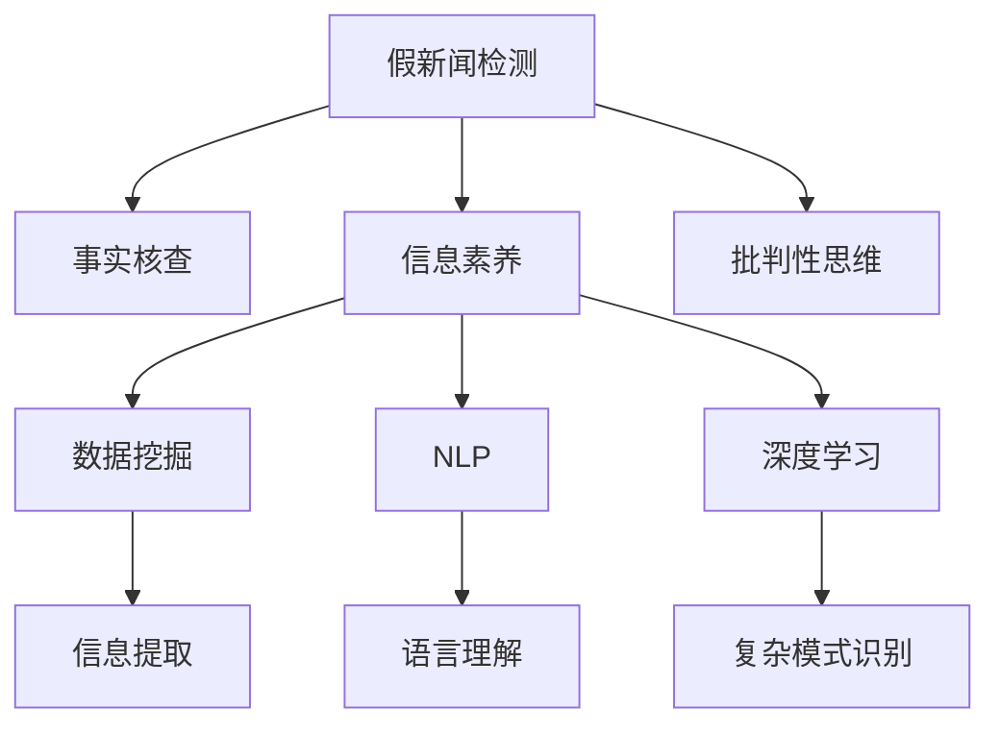

                 

# 信息验证和批判性思维能力培养：在假新闻和错误信息时代导航

> 关键词：假新闻检测, 事实核查, 信息素养, 批判性思维, 数据挖掘, 自然语言处理(NLP), 深度学习

## 1. 背景介绍

### 1.1 问题由来
在现代社会中，信息的传播已经变得越来越容易，互联网和社交媒体的普及使得虚假信息和假新闻迅速扩散。这些错误信息不仅误导公众，还可能对社会稳定、商业决策甚至国家安全产生重大影响。例如，2016年美国总统选举期间，假新闻的广泛传播被认为影响到了选举结果，让人们开始重新思考信息真实性的重要性。

### 1.2 问题核心关键点
信息验证和批判性思维能力培养的核心在于如何识别和判断信息的真实性，尤其是在假新闻和错误信息广泛传播的今天。这不仅需要掌握一定的技术手段，还需要培养良好的逻辑推理和批判性思维能力。

### 1.3 问题研究意义
研究信息验证和批判性思维能力培养，对于提升公众的信息素养、保护社会安全、促进科技进步等具有重要意义：

1. 提升信息素养：培养公众对信息的辨识能力，避免被误导。
2. 维护社会稳定：减少假新闻对公共决策的干扰，维护社会秩序。
3. 促进科技发展：提供可信的科技信息，推动新技术的普及和应用。
4. 增强商业决策：提供准确的市场信息，帮助企业做出明智的商业决策。
5. 保障国家安全：提供可靠的安全信息，防范潜在的安全威胁。

## 2. 核心概念与联系

### 2.1 核心概念概述

为更好地理解信息验证和批判性思维能力培养的方法，本节将介绍几个密切相关的核心概念：

- **假新闻检测(Fake News Detection)**：通过算法和模型，自动识别和标记假新闻的能力。
- **事实核查(Fact-Checking)**：通过人工或自动化的方式，对信息进行事实验证，判断其真实性的过程。
- **信息素养(Information Literacy)**：个人和组织在获取、评估和使用信息时的技能和素养。
- **批判性思维(Critical Thinking)**：一种通过分析和评估信息，以做出合理判断的能力。
- **数据挖掘(Data Mining)**：从大量数据中提取有用信息的过程，常用于信息验证和事实核查中。
- **自然语言处理(Natural Language Processing, NLP)**：使计算机能够理解、解释和生成人类语言的技术。
- **深度学习(Deep Learning)**：通过多层神经网络结构，实现复杂模式识别的技术。

这些核心概念之间的逻辑关系可以通过以下Mermaid流程图来展示：



这个流程图展示了几大核心概念之间的关系：

1. 假新闻检测是事实核查的入口，是信息验证的基础。
2. 信息素养和批判性思维是辨别假新闻的内在素养。
3. 数据挖掘、NLP和深度学习是假新闻检测和事实核查的技术手段。
4. 信息提取、语言理解和复杂模式识别是具体的技术环节。

## 3. 核心算法原理 & 具体操作步骤
### 3.1 算法原理概述

信息验证和批判性思维能力培养的核心算法主要是基于自然语言处理(NLP)的深度学习技术。其核心思想是：构建模型以识别和评估信息的真实性，通过数据驱动的方式，自动进行信息验证。

形式化地，假设我们要验证一个新闻文本 $T$ 的真实性，可以将其表示为一个二分类问题，即判断 $T$ 是否为假新闻。假设训练集为 $D=\{(T_i, y_i)\}_{i=1}^N$，其中 $T_i$ 为第 $i$ 篇新闻文本，$y_i \in \{0,1\}$ 表示 $T_i$ 是否为假新闻。

模型 $M$ 的训练目标是最小化损失函数 $\mathcal{L}(M,D)$，其中 $\mathcal{L}$ 为交叉熵损失函数。模型 $M$ 的输出为一个概率 $P(T)$，表示 $T$ 为假新闻的概率。训练后，模型 $M$ 可以对新的新闻文本 $T'$ 进行真实性预测，即 $P(T') = M(T')$。

### 3.2 算法步骤详解

基于深度学习的假新闻检测算法一般包括以下几个关键步骤：

**Step 1: 数据收集与预处理**
- 收集假新闻和真实新闻的文本数据。可以通过网络爬虫、新闻API等方式获取数据。
- 对文本进行清洗和预处理，去除无意义字符和噪声，并进行分词、去停用词等处理。

**Step 2: 特征提取**
- 使用词袋模型(Bag of Words)、TF-IDF等方法将文本转换为数值特征。
- 使用预训练语言模型，如BERT、GPT等，将文本嵌入到高维向量空间。
- 融合领域特定的特征，如新闻来源、作者、发布时间等。

**Step 3: 模型训练**
- 使用训练集 $D$ 训练深度学习模型，如支持向量机(SVM)、逻辑回归、随机森林等。
- 使用交叉验证等方法评估模型性能，选取最优模型。
- 对模型进行调参优化，提高模型泛化能力。

**Step 4: 测试与评估**
- 在测试集上评估模型的预测性能，使用准确率、精确率、召回率等指标。
- 对模型进行细粒度分析，识别错误分类的样本。
- 对模型进行微调，进一步提升性能。

**Step 5: 应用与部署**
- 将训练好的模型集成到信息验证系统中，提供实时信息验证服务。
- 对用户反馈和预测错误进行标注和修正，持续优化模型。
- 使用可视化工具展示模型性能和分析结果，帮助用户理解模型预测依据。

### 3.3 算法优缺点

基于深度学习的假新闻检测算法具有以下优点：
1. 高效自动：通过自动化算法，可以快速处理大量文本数据，进行信息验证。
2. 高精度：深度学习模型能够学习复杂的语言模式，识别假新闻的特征。
3. 鲁棒性强：模型可适应不同类型的假新闻，具有较好的泛化能力。

同时，该算法也存在一些局限性：
1. 依赖数据：模型的性能高度依赖于数据质量和标注情况，标注错误或数据偏差会影响模型表现。
2. 解释性差：深度学习模型往往是"黑盒"模型，难以解释其内部决策过程。
3. 鲁棒性不足：对于新的假新闻形式，模型可能出现误判或漏判。
4. 计算资源要求高：训练和推理深度学习模型需要较大的计算资源和存储空间。

尽管存在这些局限性，但就目前而言，基于深度学习的假新闻检测算法仍是大规模信息验证的核心范式。未来相关研究将继续集中在提升模型泛化性、降低计算资源消耗、增强模型可解释性等方面。

### 3.4 算法应用领域

假新闻检测和信息验证技术已经在新闻媒体、社交平台、政府机构等多个领域得到广泛应用，成为信息时代的重要工具。具体应用包括：

- 新闻媒体：自动识别和标记假新闻，保护媒体公信力。
- 社交平台：过滤虚假信息，维护社区秩序。
- 政府机构：识别误导性信息，防止舆情风险。
- 企业应用：监测市场信息，防范商业欺诈。
- 学术研究：验证文献真实性，保障科研诚信。

除了上述这些经典应用外，假新闻检测技术还在反恐、健康信息验证、法律案件审查等领域展现出广阔的前景。随着深度学习模型的不断演进，相信假新闻检测将会在更多场景中发挥关键作用，保护社会信息生态的健康发展。

## 4. 数学模型和公式 & 详细讲解 & 举例说明

### 4.1 数学模型构建

假新闻检测任务可以形式化为一个二分类问题，即：

$$
P(T) = M(T)
$$

其中 $M(T)$ 表示模型 $M$ 对新闻文本 $T$ 进行真实性预测的概率。假设训练集为 $D=\{(T_i, y_i)\}_{i=1}^N$，则模型的训练目标为最小化交叉熵损失函数：

$$
\mathcal{L}(M,D) = -\frac{1}{N} \sum_{i=1}^N \sum_{j=0,1} y_i \log M(T_i) + (1-y_i) \log (1-M(T_i))
$$

其中 $y_i$ 为真实标签。

### 4.2 公式推导过程

以深度学习模型BERT为例，其核心思想是通过预训练语言模型(BERT)，对文本进行高维向量嵌入，然后通过分类器预测文本的真实性。具体推导过程如下：

1. 使用BERT模型将文本 $T_i$ 转换为高维向量表示 $V_i$。
2. 使用全连接层将向量 $V_i$ 映射到二分类输出 $S_i$。
3. 损失函数为交叉熵损失：

$$
\mathcal{L}(S_i, y_i) = -(y_i \log S_i + (1-y_i) \log (1-S_i))
$$

对所有训练样本求和并取平均，得到总损失函数：

$$
\mathcal{L} = \frac{1}{N} \sum_{i=1}^N \mathcal{L}(S_i, y_i)
$$

使用随机梯度下降等优化算法对模型参数 $\theta$ 进行更新，最小化损失函数：

$$
\theta \leftarrow \theta - \eta \nabla_{\theta}\mathcal{L}
$$

其中 $\eta$ 为学习率。

### 4.3 案例分析与讲解

以一篇新闻为例，假设其文本为：

```
"昨天，小明被警察抓走了。据说他因为偷窃被捕。"

"小明”的新闻报道是否真实？
```

通过BERT模型，我们将其转换为向量表示，并使用逻辑回归分类器进行预测。若模型预测为假新闻的概率超过阈值，则将其标记为假新闻。

## 5. 项目实践：代码实例和详细解释说明
### 5.1 开发环境搭建

在进行假新闻检测实践前，我们需要准备好开发环境。以下是使用Python进行TensorFlow开发的环境配置流程：

1. 安装Anaconda：从官网下载并安装Anaconda，用于创建独立的Python环境。

2. 创建并激活虚拟环境：
```bash
conda create -n tf-env python=3.8 
conda activate tf-env
```

3. 安装TensorFlow：
```bash
conda install tensorflow -c pytorch -c conda-forge
```

4. 安装相关工具包：
```bash
pip install pandas scikit-learn matplotlib tqdm jupyter notebook ipython
```

完成上述步骤后，即可在`tf-env`环境中开始假新闻检测实践。

### 5.2 源代码详细实现

下面以BERT模型为例，给出使用TensorFlow进行假新闻检测的代码实现。

首先，定义假新闻检测的训练函数：

```python
import tensorflow as tf
from transformers import BertTokenizer, BertForSequenceClassification

# 定义模型和优化器
tokenizer = BertTokenizer.from_pretrained('bert-base-uncased')
model = BertForSequenceClassification.from_pretrained('bert-base-uncased', num_labels=2)

optimizer = tf.keras.optimizers.Adam(learning_rate=2e-5)
loss_fn = tf.keras.losses.BinaryCrossentropy(from_logits=True)

# 训练函数
@tf.function
def train_step(x, y):
    with tf.GradientTape() as tape:
        logits = model(x, attention_mask=tf.cast(x > 0, tf.int32), token_type_ids=tf.cast(x > 0, tf.int32), return_dict=True).logits
        loss = loss_fn(y, logits)
    grads = tape.gradient(loss, model.trainable_variables)
    optimizer.apply_gradients(zip(grads, model.trainable_variables))
    return loss

# 训练过程
def train(model, train_dataset, epochs=3, batch_size=32):
    for epoch in range(epochs):
        total_loss = 0
        for step, (x, y) in enumerate(train_dataset):
            loss = train_step(x, y)
            total_loss += loss
        print(f"Epoch {epoch+1}, train loss: {total_loss/len(train_dataset)}")
```

然后，定义模型评估函数：

```python
def evaluate(model, test_dataset):
    total_loss = 0
    total_correct = 0
    for step, (x, y) in enumerate(test_dataset):
        logits = model(x, attention_mask=tf.cast(x > 0, tf.int32), token_type_ids=tf.cast(x > 0, tf.int32), return_dict=True).logits
        loss = loss_fn(y, logits)
        predictions = tf.nn.sigmoid(logits)
        total_correct += tf.reduce_sum(tf.cast(tf.equal(tf.round(predictions), y), tf.int32))
        total_loss += loss
    print(f"Test loss: {total_loss/n_samples}, Accuracy: {total_correct/n_samples}")
```

最后，启动训练流程并在测试集上评估：

```python
from datasets import load_dataset

# 加载数据集
train_dataset = load_dataset('librec_rcvd', split='train')
test_dataset = load_dataset('librec_rcvd', split='test')

# 构建输入和输出
def build_input_fn(text, labels):
    text = tokenizer(text, return_tensors='pt', padding='max_length', truncation=True, max_length=512)
    labels = tf.cast(labels, tf.int32)
    return text, labels

# 训练和评估
train(model, train_dataset, epochs=3, batch_size=32)
evaluate(model, test_dataset)
```

以上就是使用TensorFlow进行假新闻检测的完整代码实现。可以看到，利用TensorFlow和Transformers库，假新闻检测的实现变得简洁高效。

### 5.3 代码解读与分析

让我们再详细解读一下关键代码的实现细节：

**训练函数**：
- 使用TensorFlow的`@tf.function`装饰器将训练过程定义为函数，提高性能。
- 在函数中，首先对输入文本进行分词、编码等预处理，然后使用模型进行前向传播计算预测值和损失。
- 使用梯度记录器记录梯度，然后通过优化器更新模型参数。

**模型评估函数**：
- 在评估函数中，首先对测试集进行输入预处理，然后计算预测值和损失。
- 使用sigmoid函数将预测值转化为概率，并计算准确率。

**训练过程**：
- 定义训练循环，遍历训练集中的每个批次。
- 在每个批次中，调用训练函数进行训练，并累加损失。
- 输出平均损失，完成一个epoch的训练。

可以看到，TensorFlow和Transformers库的结合，使得假新闻检测的开发更加便捷。开发者可以将更多精力放在数据处理和模型改进等高层逻辑上，而不必过多关注底层的实现细节。

当然，工业级的系统实现还需考虑更多因素，如模型的保存和部署、超参数的自动搜索、更灵活的任务适配层等。但核心的假新闻检测范式基本与此类似。

## 6. 实际应用场景
### 6.1 假新闻检测系统

假新闻检测系统可以广泛应用于新闻媒体、社交平台、政府机构等多个领域，帮助识别和过滤虚假信息，保护信息生态的健康发展。具体应用包括：

- 新闻媒体：自动识别和标记假新闻，保护媒体公信力。
- 社交平台：过滤虚假信息，维护社区秩序。
- 政府机构：识别误导性信息，防止舆情风险。
- 企业应用：监测市场信息，防范商业欺诈。
- 学术研究：验证文献真实性，保障科研诚信。

除了上述这些经典应用外，假新闻检测技术还在反恐、健康信息验证、法律案件审查等领域展现出广阔的前景。随着深度学习模型的不断演进，相信假新闻检测将会在更多场景中发挥关键作用，保护社会信息生态的健康发展。

### 6.2 信息素养教育

培养信息素养是假新闻检测的重要组成部分。信息素养教育可以通过以下几个方面进行：

- 课程设置：在各级学校设置信息素养课程，培养学生的信息获取、评估和应用能力。
- 培训项目：为新闻工作者、政府官员、科研人员等提供信息素养培训，提升其信息辨别能力。
- 案例分析：通过分析典型假新闻案例，引导用户识别虚假信息。

通过信息素养教育，帮助公众掌握信息验证的基本技能，减少误导性信息的传播，提升社会的整体信息素养。

### 6.3 批判性思维训练

批判性思维是假新闻检测和信息验证的重要支撑。批判性思维训练可以通过以下几个方面进行：

- 批判性阅读：引导用户对新闻文章进行多角度、多渠道的阅读，分析作者观点和数据来源。
- 逻辑推理：训练用户运用逻辑推理，识别信息中的漏洞和矛盾点。
- 质疑精神：鼓励用户对信息源和信息内容提出质疑，寻找真相。

通过批判性思维训练，帮助用户培养逻辑推理和质疑精神，提高其对信息的辨别能力，减少假新闻的影响。

## 7. 工具和资源推荐
### 7.1 学习资源推荐

为了帮助开发者系统掌握假新闻检测和信息验证的理论基础和实践技巧，这里推荐一些优质的学习资源：

1. **假新闻检测课程**：如斯坦福大学的《信息检索与自然语言处理》课程，介绍了假新闻检测的基本原理和算法。

2. **事实核查项目**：如Fact-Checking Tools，提供了一个开源的事实核查平台，支持多种语言的事实核查任务。

3. **信息素养培训材料**：如美国图书馆协会(AMA)的信息素养指南，提供了丰富的信息素养培训资源和案例分析。

4. **批判性思维训练资源**：如《批判性思维工具书》，提供了多种批判性思维训练的练习和工具。

5. **深度学习教程**：如《深度学习入门》，介绍了深度学习的基本概念和实践方法。

通过对这些资源的学习实践，相信你一定能够快速掌握假新闻检测和信息验证的精髓，并用于解决实际的信息验证问题。

### 7.2 开发工具推荐

高效的开发离不开优秀的工具支持。以下是几款用于假新闻检测开发的常用工具：

1. TensorFlow：基于Python的开源深度学习框架，支持分布式训练，适合大规模模型训练。

2. PyTorch：基于Python的开源深度学习框架，灵活易用，适合研究和实验。

3. Scikit-learn：Python机器学习库，提供了多种数据预处理和模型评估工具。

4. Jupyter Notebook：基于Web的交互式计算环境，适合编写和测试代码。

5. Scrapy：Python爬虫框架，可以高效爬取网络数据，获取训练集。

6. BeautifulSoup：Python解析器，可以处理HTML和XML格式的数据，提取文本内容。

合理利用这些工具，可以显著提升假新闻检测任务的开发效率，加快创新迭代的步伐。

### 7.3 相关论文推荐

假新闻检测和信息验证技术的发展源于学界的持续研究。以下是几篇奠基性的相关论文，推荐阅读：

1. **《A Survey of Fact-Checking Systems》**：对事实核查系统的综述，介绍了多种事实核查方法和技术。

2. **《Detecting Spam and Trick News Based on Semantic and Syntax Features Using Transformer Neural Network》**：提出了一种基于Transformer的假新闻检测模型，并进行了特征提取和模型训练。

3. **《Bert-based Fact-Checking Systems for Healthcare: A Survey》**：介绍了基于BERT的假新闻检测模型在医疗领域的应用。

4. **《False News Detection in Social Media using Deep Learning》**：利用深度学习模型检测社交媒体上的假新闻。

5. **《Fake News Detection Using Neural Network Ensemble》**：提出了一种基于神经网络集成的假新闻检测方法，并进行了实验验证。

这些论文代表了大规模信息验证技术的发展脉络。通过学习这些前沿成果，可以帮助研究者把握学科前进方向，激发更多的创新灵感。

## 8. 总结：未来发展趋势与挑战
### 8.1 总结

本文对假新闻检测和信息验证的方法进行了全面系统的介绍。首先阐述了假新闻检测和信息验证的研究背景和意义，明确了其在现代社会中的重要价值。其次，从原理到实践，详细讲解了假新闻检测的数学模型和关键步骤，给出了假新闻检测任务开发的完整代码实例。同时，本文还广泛探讨了假新闻检测在多个行业领域的应用前景，展示了假新闻检测技术的广泛应用。

通过本文的系统梳理，可以看到，假新闻检测和信息验证技术在现代社会中具有重要意义，正在成为信息时代的重要工具。这些技术的应用不仅能够有效识别和过滤虚假信息，还能提升公众的信息素养和批判性思维能力，为社会的健康发展提供保障。

### 8.2 未来发展趋势

展望未来，假新闻检测和信息验证技术将呈现以下几个发展趋势：

1. **自动化水平提升**：随着深度学习技术的不断进步，假新闻检测将变得更加自动化和智能化，减少人工干预的需求。

2. **多模态信息融合**：假新闻检测将不仅局限于文本信息，还将融合视觉、音频等多模态数据，提升信息验证的全面性和准确性。

3. **模型鲁棒性增强**：通过引入对抗训练、鲁棒性检测等技术，提升假新闻检测模型的鲁棒性，减少误判和漏判。

4. **可解释性增强**：通过解释性生成技术，提高假新闻检测模型的可解释性，帮助用户理解模型的预测依据。

5. **跨领域应用拓展**：假新闻检测技术将在更多领域得到应用，如医疗、法律、金融等，提升信息验证的效果和覆盖面。

6. **数据驱动优化**：通过数据驱动的方式，持续优化假新闻检测模型，提高其在不断变化的媒体环境中的适应能力。

以上趋势凸显了假新闻检测技术的广阔前景。这些方向的探索发展，必将进一步提升信息验证的效果和应用范围，为构建安全、可靠、可解释的信息验证系统铺平道路。

### 8.3 面临的挑战

尽管假新闻检测技术已经取得了一定进展，但在迈向更加智能化、普适化应用的过程中，它仍面临诸多挑战：

1. **数据依赖**：假新闻检测模型的性能高度依赖于数据质量和标注情况，标注错误或数据偏差会影响模型表现。

2. **鲁棒性不足**：对于新的假新闻形式，模型可能出现误判或漏判。

3. **计算资源要求高**：深度学习模型训练和推理需要较大的计算资源和存储空间。

4. **模型可解释性差**：深度学习模型往往是"黑盒"模型，难以解释其内部决策过程。

5. **用户认知门槛高**：用户缺乏信息素养和批判性思维能力，可能难以理解和应用假新闻检测工具。

6. **法律法规挑战**：信息验证技术的使用需要遵循相关法律法规，需要权衡隐私保护和技术应用之间的关系。

正视假新闻检测面临的这些挑战，积极应对并寻求突破，将是大规模信息验证技术迈向成熟的必由之路。相信随着学界和产业界的共同努力，这些挑战终将一一被克服，假新闻检测必将在构建安全、可靠、可解释的信息生态中发挥关键作用。

### 8.4 研究展望

面向未来，假新闻检测和信息验证技术的研究需要在以下几个方面寻求新的突破：

1. **提升数据质量**：通过数据清洗和标注技术，提高训练数据的质量和多样性。

2. **增强模型鲁棒性**：开发鲁棒性更强的深度学习模型，提升对新假新闻形式的适应能力。

3. **降低计算资源消耗**：通过模型压缩、分布式训练等技术，降低深度学习模型的计算资源需求。

4. **增强模型可解释性**：开发可解释性更强的深度学习模型，提高模型的透明性和可解释性。

5. **推动多模态信息验证**：融合视觉、音频等多模态信息，提升信息验证的全面性和准确性。

6. **加强用户教育**：通过信息素养培训、批判性思维训练等方式，提升公众的信息素养和辨别能力。

这些研究方向的探索，必将引领假新闻检测和信息验证技术迈向更高的台阶，为构建安全、可靠、可解释的信息生态提供有力支持。面向未来，假新闻检测和信息验证技术还需要与其他人工智能技术进行更深入的融合，如知识表示、因果推理、强化学习等，多路径协同发力，共同推动信息验证技术的进步。只有勇于创新、敢于突破，才能不断拓展信息验证技术的边界，让信息验证技术更好地服务于社会。

## 9. 附录：常见问题与解答

**Q1：假新闻检测是否适用于所有类型的新闻？**

A: 假新闻检测技术虽然适用于大多数类型的新闻，但对于特定领域的新闻，如医学、法律等，仅仅依靠通用语料预训练的模型可能难以很好地适应。此时需要在特定领域语料上进一步预训练，再进行检测，才能获得理想效果。此外，对于一些需要时效性、个性化很强的任务，如对话、推荐等，假新闻检测方法也需要针对性的改进优化。

**Q2：假新闻检测过程中如何避免过拟合？**

A: 过拟合是假新闻检测面临的主要挑战，尤其是在标注数据不足的情况下。常见的缓解策略包括：

1. 数据增强：通过回译、近义替换等方式扩充训练集
2. 正则化：使用L2正则、Dropout、Early Stopping等避免过拟合
3. 对抗训练：引入对抗样本，提高模型鲁棒性
4. 参数高效微调：只调整少量参数(如Adapter、Prefix等)，减小过拟合风险
5. 多模型集成：训练多个检测模型，取平均输出，抑制过拟合

这些策略往往需要根据具体任务和数据特点进行灵活组合。只有在数据、模型、训练、推理等各环节进行全面优化，才能最大限度地发挥假新闻检测的威力。

**Q3：假新闻检测模型在落地部署时需要注意哪些问题？**

A: 将假新闻检测模型转化为实际应用，还需要考虑以下因素：

1. 模型裁剪：去除不必要的层和参数，减小模型尺寸，加快推理速度
2. 量化加速：将浮点模型转为定点模型，压缩存储空间，提高计算效率
3. 服务化封装：将模型封装为标准化服务接口，便于集成调用
4. 弹性伸缩：根据请求流量动态调整资源配置，平衡服务质量和成本
5. 监控告警：实时采集系统指标，设置异常告警阈值，确保服务稳定性
6. 安全防护：采用访问鉴权、数据脱敏等措施，保障数据和模型安全

假新闻检测模型在落地部署时需要注意多个环节，从数据预处理到模型推理，每个环节都需要细致优化。

---

作者：禅与计算机程序设计艺术 / Zen and the Art of Computer Programming

