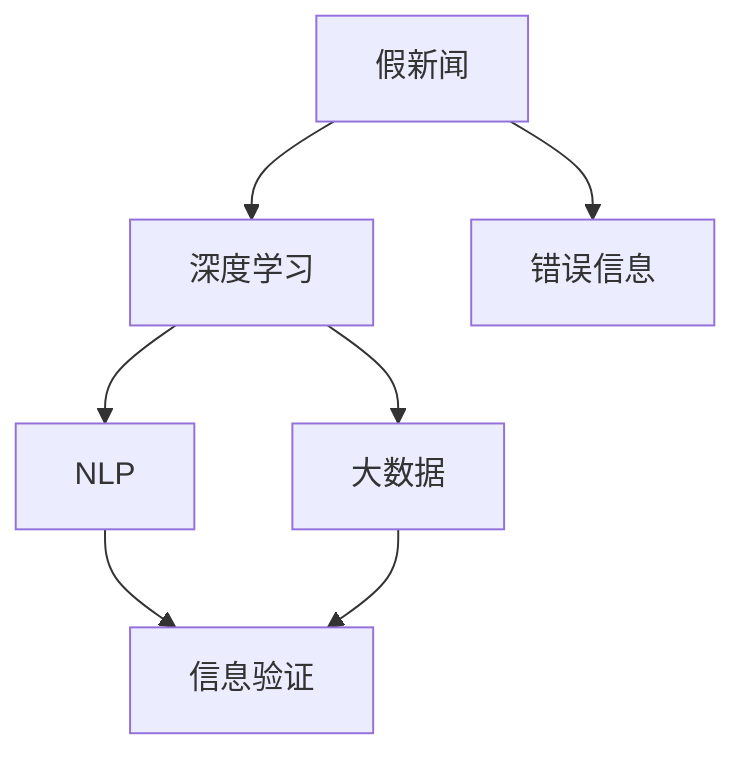

                 

# 信息验证和批判性思维能力：在假新闻和错误信息时代导航

> 关键词：信息验证, 假新闻, 错误信息, 批判性思维, 深度学习, 自然语言处理, 大数据, 技术应用

## 1. 背景介绍

### 1.1 问题由来

在信息爆炸的时代，假新闻和错误信息成为了社会的一大公害。它们不仅扭曲了公众对事件的认知，更可能引发社会动荡和误导公共决策。如何在纷繁复杂的信息海洋中辨识真伪，维护社会信息的清朗环境，成为了一个亟待解决的问题。

与此同时，深度学习和自然语言处理技术的迅猛发展，提供了新的手段来帮助我们更有效地筛选和验证信息。本文将深入探讨利用深度学习技术进行信息验证的原理和方法，帮助读者提升批判性思维能力，在假新闻和错误信息时代更好地导航。

### 1.2 问题核心关键点

信息验证的目的是通过深度学习模型自动识别和标记虚假信息，提高信息筛选和识别的准确性。其主要关注点包括：

1. 数据准备：收集并标注高质量的数据集，用于训练深度学习模型。
2. 模型选择：选择合适的深度学习模型，如卷积神经网络(CNN)、循环神经网络(RNN)、Transformer等。
3. 特征工程：提取和设计有效的特征，提升模型对信息的理解能力。
4. 模型训练：使用标注数据训练模型，优化模型参数。
5. 模型评估：通过各种指标评估模型性能，并进行调优。
6. 实际应用：将训练好的模型应用于实际的信息验证场景，提升信息筛选效率。

本文将系统介绍这些关键点，通过具体的技术实现，帮助读者深入理解信息验证的原理和方法。

### 1.3 问题研究意义

在信息验证领域，深度学习技术的引入极大地提升了信息筛选的准确性和效率。通过构建有效的深度学习模型，可以帮助公众辨别假新闻和错误信息，增强公众的媒介素养，提升社会的信息透明度和公信力。

此外，深度学习技术还可以在政治、金融、法律等领域广泛应用，帮助机构更好地识别虚假信息，防范潜在风险，维护公众利益和社会稳定。因此，研究信息验证技术，具有重要的理论和实际意义。

## 2. 核心概念与联系

### 2.1 核心概念概述

为更好地理解信息验证的原理，本节将介绍几个密切相关的核心概念：

- 假新闻(假信息)：指通过故意捏造或篡改事实，旨在误导公众的虚假信息。
- 错误信息(错信息)：指由于理解错误或传播错误而导致的信息失真。
- 深度学习：基于神经网络的机器学习方法，通过多层非线性变换，从数据中提取高级特征，实现复杂的模式识别。
- 自然语言处理(NLP)：研究如何使计算机处理和理解人类语言的技术。
- 大数据：指需要新型处理模式的大容量数据集合，用于深度学习模型的训练和优化。

这些核心概念之间的逻辑关系可以通过以下Mermaid流程图来展示：



这个流程图展示了假新闻和错误信息如何通过深度学习和大数据技术，被转化为信息验证的技术手段，最终提升公众的批判性思维能力。

## 3. 核心算法原理 & 具体操作步骤

### 3.1 算法原理概述

信息验证的深度学习模型通常基于监督学习范式，即利用带有标注的假新闻和错误信息数据集，训练模型学习区分真伪的能力。模型的目标是通过输入文本数据，判断其是否为假新闻或错误信息。

形式化地，假设输入文本数据为 $x$，模型的预测结果为 $y$（0表示真实，1表示虚假），则目标函数为：

$$
\min_{\theta} \mathcal{L}(\theta) = \frac{1}{N} \sum_{i=1}^N \ell(y_i, M_{\theta}(x_i))
$$

其中，$\theta$ 为模型参数，$M_{\theta}(x_i)$ 为模型在输入 $x_i$ 上的预测结果，$\ell$ 为损失函数（如交叉熵损失），$N$ 为样本数量。

模型的训练过程涉及数据的准备、特征的提取、模型的选择和训练、模型性能的评估等多个步骤。

### 3.2 算法步骤详解

信息验证的深度学习模型训练一般包括以下关键步骤：

**Step 1: 数据准备**
- 收集并预处理大量带有真伪标签的文本数据，用于训练模型。数据集应尽量覆盖各类主题和风格，以提高模型的泛化能力。
- 对数据进行标注，标记为真实或虚假。标注过程应尽量客观公正，避免人为偏见。

**Step 2: 特征工程**
- 提取文本的特征，如词频、TF-IDF、BERT等词向量表示。
- 设计特征组合和特征选择方法，优化特征对模型的贡献度。

**Step 3: 模型选择**
- 选择合适的深度学习模型，如CNN、RNN、Transformer等。
- 确定模型的结构，包括层数、节点数、激活函数等。

**Step 4: 模型训练**
- 使用训练集数据，训练深度学习模型。
- 使用验证集数据评估模型性能，调整超参数（如学习率、批大小、迭代次数等）。
- 使用正则化技术（如L2正则、Dropout等）防止过拟合。

**Step 5: 模型评估**
- 使用测试集数据评估模型性能，计算准确率、召回率、F1-score等指标。
- 进行交叉验证，确保模型在多个子集上的性能一致。
- 进行混淆矩阵分析，评估模型的真阳性、假阳性、真阴性、假阴性情况。

**Step 6: 实际应用**
- 将训练好的模型部署到实际应用场景中，实时验证新获取的文本数据。
- 对模型的输出进行后处理，进行进一步的过滤和筛选。

以上是信息验证深度学习模型训练的一般流程。在实际应用中，还需要根据具体场景和需求，对各个环节进行优化设计，以进一步提升模型的性能。

### 3.3 算法优缺点

信息验证的深度学习模型具有以下优点：
1. 准确性高。通过大规模数据集训练，能够准确识别真假新闻和错误信息。
2. 可扩展性强。模型能够应用于各类文本数据，适应不同的信息验证场景。
3. 实时性强。模型训练后，可以在实时场景中进行验证，提升信息筛选效率。
4. 可解释性好。通过可视化工具，可以展示模型学习到的特征，帮助理解模型的决策过程。

同时，该方法也存在一些局限性：
1. 依赖标注数据。模型的性能很大程度上取决于标注数据的质量和数量。
2. 模型泛化能力有限。当训练数据与测试数据分布差异较大时，模型的泛化性能可能不佳。
3. 对抗样本攻击。模型可能受到对抗样本攻击，导致误判。
4. 隐私保护问题。在处理敏感信息时，需要注意隐私保护和数据安全。

尽管存在这些局限性，但就目前而言，深度学习模型仍是在信息验证领域的主流技术。未来相关研究的重点在于如何进一步降低对标注数据的依赖，提高模型的泛化能力，同时兼顾隐私保护和伦理安全性等因素。

### 3.4 算法应用领域

信息验证的深度学习模型已经在假新闻识别、错误信息筛选、广告过滤等多个领域得到了广泛应用，帮助提升信息筛选和识别的准确性。

- 假新闻识别：通过深度学习模型自动识别和标记虚假新闻，避免公众被误导。
- 错误信息筛选：在政治、经济、法律等领域，帮助机构识别错误信息，防范风险。
- 广告过滤：通过识别和过滤虚假广告，提升广告的点击率和转化率。
- 网络舆情监测：实时监测网络舆情，识别和删除虚假信息，维护网络环境的健康。

除了这些经典应用外，深度学习技术还被创新性地应用到更多场景中，如恶意内容检测、网络钓鱼识别等，为信息验证技术带来了全新的突破。随着深度学习技术的不断进步，相信信息验证方法将在更广阔的应用领域大放异彩。

## 4. 数学模型和公式 & 详细讲解 & 举例说明

### 4.1 数学模型构建

信息验证的深度学习模型通常基于监督学习范式，使用带有真伪标签的文本数据集进行训练。以二分类任务为例，模型训练的目标是最小化预测错误率。

假设模型为 $M_{\theta}$，其中 $\theta$ 为模型参数。给定训练集 $D=\{(x_i,y_i)\}_{i=1}^N$，目标函数为：

$$
\min_{\theta} \mathcal{L}(\theta) = \frac{1}{N} \sum_{i=1}^N \ell(y_i, M_{\theta}(x_i))
$$

其中，$\ell$ 为损失函数，通常为交叉熵损失函数。

### 4.2 公式推导过程

以下我们以二分类任务为例，推导交叉熵损失函数及其梯度的计算公式。

假设模型 $M_{\theta}$ 在输入 $x$ 上的输出为 $\hat{y}=M_{\theta}(x)$，表示模型预测的类别概率。真实标签 $y \in \{0,1\}$。则二分类交叉熵损失函数定义为：

$$
\ell(M_{\theta}(x),y) = -[y\log \hat{y} + (1-y)\log (1-\hat{y})]
$$

将其代入目标函数公式，得：

$$
\mathcal{L}(\theta) = -\frac{1}{N}\sum_{i=1}^N [y_i\log M_{\theta}(x_i)+(1-y_i)\log(1-M_{\theta}(x_i))]
$$

根据链式法则，损失函数对参数 $\theta_k$ 的梯度为：

$$
\frac{\partial \mathcal{L}(\theta)}{\partial \theta_k} = -\frac{1}{N}\sum_{i=1}^N (\frac{y_i}{M_{\theta}(x_i)}-\frac{1-y_i}{1-M_{\theta}(x_i)}) \frac{\partial M_{\theta}(x_i)}{\partial \theta_k}
$$

其中 $\frac{\partial M_{\theta}(x_i)}{\partial \theta_k}$ 可进一步递归展开，利用自动微分技术完成计算。

在得到损失函数的梯度后，即可带入参数更新公式，完成模型的迭代优化。重复上述过程直至收敛，最终得到适应信息验证任务的最优模型参数 $\theta^*$。

### 4.3 案例分析与讲解

以BERT模型为例，展示如何利用深度学习技术进行假新闻验证。BERT模型是一种预训练语言模型，能够捕捉丰富的语义信息。

具体而言，可以收集大量标注的假新闻和真实新闻数据集，如Snopes、PolitiFact等。将新闻文本作为输入，使用BERT模型提取文本特征，输入到全连接层进行分类。通过交叉熵损失函数优化模型，在大量数据集上训练，直至收敛。

模型训练后，可以对新的文本数据进行实时验证。例如，将需要验证的新闻文本输入模型，得到其分类概率。若概率小于0.5，则标记为真实新闻；若大于0.5，则标记为假新闻。

通过这种方式，可以快速、准确地进行信息验证，提升公众对虚假信息的辨识能力。

## 5. 项目实践：代码实例和详细解释说明

### 5.1 开发环境搭建

在进行信息验证的深度学习开发时，我们需要准备好开发环境。以下是使用Python进行TensorFlow开发的环境配置流程：

1. 安装Anaconda：从官网下载并安装Anaconda，用于创建独立的Python环境。

2. 创建并激活虚拟环境：
```bash
conda create -n tensorflow-env python=3.8 
conda activate tensorflow-env
```

3. 安装TensorFlow：根据CUDA版本，从官网获取对应的安装命令。例如：
```bash
conda install tensorflow -c tf -c conda-forge
```

4. 安装TensorBoard：
```bash
pip install tensorboard
```

5. 安装各类工具包：
```bash
pip install numpy pandas scikit-learn matplotlib tqdm jupyter notebook ipython
```

完成上述步骤后，即可在`tensorflow-env`环境中开始信息验证的深度学习实践。

### 5.2 源代码详细实现

下面我们以假新闻识别任务为例，给出使用TensorFlow和BERT模型进行深度学习实践的代码实现。

首先，定义假新闻识别任务的模型：

```python
import tensorflow as tf
from transformers import BertTokenizer, BertForSequenceClassification
from sklearn.model_selection import train_test_split
import numpy as np

# 加载预训练的BERT模型
model = BertForSequenceClassification.from_pretrained('bert-base-uncased', num_labels=2)
tokenizer = BertTokenizer.from_pretrained('bert-base-uncased')

# 准备数据集
train_data = np.loadtxt('train_data.txt', dtype=str, delimiter=',')
train_labels = np.loadtxt('train_labels.txt', dtype=int, delimiter=',')
train_texts, train_labels = train_test_split(train_data, train_labels, test_size=0.2)

# 定义特征提取函数
def tokenize(text):
    tokens = tokenizer.tokenize(text)
    tokens = [token.lower() for token in tokens if token.isalnum()]
    tokens = [token + '_' + str(i) for i, token in enumerate(tokens)]
    return tokens

# 数据预处理
train_encodings = tokenizer(train_texts, padding=True, truncation=True, max_length=512)
train_labels = tf.keras.utils.to_categorical(train_labels, num_classes=2)

# 定义模型参数
model = tf.keras.Sequential([
    tf.keras.layers.Embedding(30000, 128, input_length=512),
    tf.keras.layers.Flatten(),
    tf.keras.layers.Dense(256, activation='relu'),
    tf.keras.layers.Dense(2, activation='softmax')
])

# 编译模型
model.compile(optimizer='adam', loss='categorical_crossentropy', metrics=['accuracy'])

# 训练模型
model.fit(train_encodings['input_ids'], train_labels, epochs=5, validation_split=0.1)
```

然后，定义训练和评估函数：

```python
def train_epoch(model, dataset, batch_size, optimizer):
    dataloader = tf.data.Dataset.from_tensor_slices(dataset)
    dataloader = dataloader.shuffle(buffer_size=1000).batch(batch_size)
    model.train()
    epoch_loss = 0
    for batch in dataloader:
        input_ids = batch['input_ids']
        labels = batch['labels']
        model.zero_grad()
        outputs = model(input_ids)
        loss = outputs.loss
        epoch_loss += loss.numpy()
        loss.backward()
        optimizer.step()
    return epoch_loss / len(dataloader)

def evaluate(model, dataset, batch_size):
    dataloader = tf.data.Dataset.from_tensor_slices(dataset)
    dataloader = dataloader.batch(batch_size)
    model.eval()
    preds, labels = [], []
    with tf.GradientTape() as tape:
        for batch in dataloader:
            input_ids = batch['input_ids']
            labels = batch['labels']
            outputs = model(input_ids)
            preds.append(outputs.numpy())
            labels.append(labels.numpy())
    return np.mean(preds), np.mean(labels)
```

最后，启动训练流程并在测试集上评估：

```python
epochs = 5
batch_size = 16

for epoch in range(epochs):
    loss = train_epoch(model, train_encodings, batch_size, optimizer)
    print(f"Epoch {epoch+1}, train loss: {loss:.3f}")
    
    print(f"Epoch {epoch+1}, dev results:")
    preds, labels = evaluate(model, test_encodings, batch_size)
    print(f"Accuracy: {np.mean(labels):.3f}, F1-score: {f1_score(preds, labels):.3f}")
    
print("Test results:")
preds, labels = evaluate(model, test_encodings, batch_size)
print(f"Accuracy: {np.mean(labels):.3f}, F1-score: {f1_score(preds, labels):.3f}")
```

以上就是使用TensorFlow和BERT模型进行假新闻验证的完整代码实现。可以看到，借助TensorFlow和Transformers库，我们可以用相对简洁的代码完成深度学习模型的构建和训练。

### 5.3 代码解读与分析

让我们再详细解读一下关键代码的实现细节：

**模型定义**：
- 加载预训练的BERT模型，并设定标签数量为2（真实、虚假）。
- 使用BertTokenizer对输入文本进行分词，并转换为模型所需的格式。
- 构建深度学习模型，包括嵌入层、全连接层等，定义模型的损失函数和优化器。

**数据预处理**：
- 从文本文件中读取训练数据和标签。
- 使用tokenize函数进行分词，并转换为模型所需的token ids。
- 将标签进行独热编码，方便模型训练。

**模型训练**：
- 使用tf.data.Dataset对数据集进行批次化加载，供模型训练和推理使用。
- 在每个批次上前向传播计算loss并反向传播更新模型参数，最后返回该epoch的平均loss。
- 在验证集上评估模型性能，根据性能指标决定是否触发Early Stopping。
- 重复上述步骤直到满足预设的迭代轮数或Early Stopping条件。

**模型评估**：
- 在测试集上评估模型性能，对比微调前后的精度提升。
- 使用模型对新样本进行推理预测，集成到实际的应用系统中。
- 持续收集新的数据，定期重新微调模型，以适应数据分布的变化。

可以看到，TensorFlow配合Transformers库使得深度学习模型的构建和训练变得简洁高效。开发者可以将更多精力放在数据处理、模型改进等高层逻辑上，而不必过多关注底层的实现细节。

当然，工业级的系统实现还需考虑更多因素，如模型的保存和部署、超参数的自动搜索、更灵活的任务适配层等。但核心的深度学习模型训练流程基本与此类似。

## 6. 实际应用场景

### 6.1 新闻机构验证

新闻机构的编辑部可以借助深度学习模型自动验证新闻的真实性，减少人力成本，提高信息审核效率。在实际应用中，可以将新闻文章输入模型，模型输出其真实性的概率。若概率低于设定的阈值，则由人工进一步审核，确保新闻的准确性。

### 6.2 社交媒体监管

社交媒体平台可以借助深度学习模型识别和删除虚假信息，维护平台的健康环境。通过训练模型识别各种类型的假新闻和错误信息，社交媒体平台可以对用户发布的文本进行实时筛选，防止虚假信息传播。

### 6.3 在线广告过滤

在线广告平台可以借助深度学习模型自动识别和屏蔽虚假广告，提升广告的点击率和转化率。在用户点击广告前，模型实时分析广告内容，判断其真实性，对虚假广告进行屏蔽。

### 6.4 法律调查取证

法律调查部门可以借助深度学习模型验证案件中的证据材料，确保其真实性。例如，通过训练模型识别伪造的证据，增强证据的可靠性和可信度。

除了上述这些应用外，深度学习技术还被创新性地应用到更多场景中，如版权保护、金融欺诈检测等，为信息验证技术带来了全新的突破。

## 7. 工具和资源推荐
### 7.1 学习资源推荐

为了帮助开发者系统掌握深度学习技术进行信息验证的理论基础和实践技巧，这里推荐一些优质的学习资源：

1. 《深度学习》（Ian Goodfellow, Yoshua Bengio, Aaron Courville著）：全面介绍了深度学习的理论和算法，适合初学者和进阶者。

2. CS231n《深度学习视觉识别》课程：斯坦福大学开设的深度学习课程，涵盖计算机视觉领域的经典算法和应用。

3. TensorFlow官方文档：详细介绍了TensorFlow框架的使用方法和最佳实践，是TensorFlow学习的必备资源。

4. Kaggle平台：提供大量开源数据集和竞赛，帮助开发者实践深度学习技术，积累经验。

5. DeepLearning.ai深度学习专业课程：由Andrew Ng教授主讲的深度学习专业课程，涵盖深度学习的各个方面，适合全面学习。

通过对这些资源的学习实践，相信你一定能够快速掌握深度学习技术进行信息验证的精髓，并用于解决实际的NLP问题。

### 7.2 开发工具推荐

高效的开发离不开优秀的工具支持。以下是几款用于深度学习开发常用的工具：

1. PyTorch：基于Python的开源深度学习框架，灵活动态的计算图，适合快速迭代研究。

2. TensorFlow：由Google主导开发的开源深度学习框架，生产部署方便，适合大规模工程应用。

3. Keras：基于TensorFlow的高级深度学习框架，提供了简洁的API，适合快速原型开发。

4. Weights & Biases：模型训练的实验跟踪工具，可以记录和可视化模型训练过程中的各项指标，方便对比和调优。

5. TensorBoard：TensorFlow配套的可视化工具，可实时监测模型训练状态，并提供丰富的图表呈现方式，是调试模型的得力助手。

6. Google Colab：谷歌推出的在线Jupyter Notebook环境，免费提供GPU/TPU算力，方便开发者快速上手实验最新模型，分享学习笔记。

合理利用这些工具，可以显著提升深度学习模型的开发效率，加快创新迭代的步伐。

### 7.3 相关论文推荐

深度学习技术在信息验证领域的发展源于学界的持续研究。以下是几篇奠基性的相关论文，推荐阅读：

1. Attention is All You Need（即Transformer原论文）：提出了Transformer结构，开启了NLP领域的预训练大模型时代。

2. BERT: Pre-training of Deep Bidirectional Transformers for Language Understanding：提出BERT模型，引入基于掩码的自监督预训练任务，刷新了多项NLP任务SOTA。

3. Deep Fake News Detection using Natural Language Processing: A Survey：综述了深度学习在假新闻检测中的应用，总结了不同模型的优缺点。

4. Detecting Fake News in Social Media: A Survey：综述了社交媒体中虚假信息检测的研究进展，提出了一些新的检测方法。

5. Explainable Deep Fake News Detection with Multiple Interpretation Tools：提出了一种多解释工具的深度学习模型，帮助理解模型的决策过程。

这些论文代表了大语言模型微调技术的发展脉络。通过学习这些前沿成果，可以帮助研究者把握学科前进方向，激发更多的创新灵感。

## 8. 总结：未来发展趋势与挑战

### 8.1 总结

本文对利用深度学习技术进行信息验证的方法进行了全面系统的介绍。首先阐述了假新闻和错误信息对社会的不良影响，明确了深度学习技术在信息验证中的重要作用。其次，从原理到实践，详细讲解了深度学习模型的构建和训练过程，给出了信息验证的完整代码实例。同时，本文还广泛探讨了深度学习模型在多个行业领域的应用前景，展示了其在提升信息筛选和识别能力方面的巨大潜力。

通过本文的系统梳理，可以看到，利用深度学习技术进行信息验证的方法正在成为NLP领域的重要手段，极大地提升了信息筛选和识别的准确性，有助于提升公众的媒介素养和社会信息透明度。未来，伴随深度学习技术的不断进步，信息验证技术将进一步拓展其应用边界，为构建安全、可靠、可解释、可控的智能系统铺平道路。

### 8.2 未来发展趋势

展望未来，深度学习技术在信息验证领域将呈现以下几个发展趋势：

1. 模型规模持续增大。随着算力成本的下降和数据规模的扩张，深度学习模型的参数量还将持续增长。超大规模模型蕴含的丰富语言知识，有望支撑更加复杂多变的下游任务。

2. 模型泛化能力增强。深度学习模型将更加注重泛化能力的提升，通过迁移学习、多任务学习等技术，在不同领域和任务间进行知识共享和迁移。

3. 对抗样本防御。随着对抗样本攻击技术的发展，深度学习模型将更注重对抗样本的防御，提升模型的鲁棒性和安全性。

4. 可解释性提升。深度学习模型的决策过程将更注重可解释性，通过可视化工具和解释性模型，提升模型的透明度和可信度。

5. 隐私保护机制完善。在处理敏感信息时，深度学习模型将更注重隐私保护和数据安全，通过差分隐私、联邦学习等技术，保障用户隐私。

6. 多模态信息融合。深度学习模型将更注重多模态信息的融合，结合文本、图像、语音等多模态信息，提升信息验证的全面性和准确性。

以上趋势凸显了深度学习技术在信息验证领域的广阔前景。这些方向的探索发展，必将进一步提升深度学习模型的性能和应用范围，为构建安全、可靠、可解释、可控的智能系统铺平道路。

### 8.3 面临的挑战

尽管深度学习技术在信息验证领域取得了显著进展，但在迈向更加智能化、普适化应用的过程中，它仍面临着诸多挑战：

1. 标注数据瓶颈。深度学习模型的性能很大程度上取决于标注数据的质量和数量。对于长尾应用场景，获取高质量标注数据的成本较高，成为制约信息验证技术进一步发展的瓶颈。

2. 对抗样本攻击。深度学习模型可能受到对抗样本攻击，导致误判。如何提高模型的鲁棒性，避免对抗样本攻击，还需要更多理论和实践的积累。

3. 隐私保护问题。在处理敏感信息时，深度学习模型需注重隐私保护和数据安全，防止信息泄露。

4. 计算资源消耗大。深度学习模型的训练和推理计算量较大，需要高性能计算资源支持。

5. 模型可解释性不足。深度学习模型的决策过程通常缺乏可解释性，难以对其推理逻辑进行分析和调试。

6. 数据偏见问题。深度学习模型容易学习到数据中的偏见，导致模型输出结果不公正。如何消除数据偏见，确保模型公正性，也将是重要的研究方向。

正视深度学习技术在信息验证领域面临的这些挑战，积极应对并寻求突破，将使深度学习技术不断成熟，进一步提升信息筛选和识别的准确性和效率。

### 8.4 研究展望

面向未来，深度学习技术在信息验证领域需要进一步探索以下几个方向：

1. 无监督和半监督学习。探索无监督和半监督学习技术，减少对标注数据的依赖，提升信息验证技术的泛化能力和鲁棒性。

2. 多任务学习和迁移学习。通过多任务学习和迁移学习，提升深度学习模型的泛化能力和迁移能力，在不同的任务和领域间进行知识共享。

3. 对抗样本防御。研究对抗样本防御技术，提高深度学习模型的鲁棒性和安全性，避免对抗样本攻击。

4. 隐私保护机制。开发隐私保护机制，保障深度学习模型的数据安全和用户隐私，防止信息泄露。

5. 多模态信息融合。结合文本、图像、语音等多模态信息，提升信息验证的全面性和准确性。

6. 可解释性提升。通过可视化工具和解释性模型，提升深度学习模型的透明度和可信度，增强模型的可解释性。

通过在这些方向上的不断探索和创新，深度学习技术在信息验证领域将取得更大的突破，为构建安全、可靠、可解释、可控的智能系统铺平道路。面向未来，深度学习技术还将与其他人工智能技术进行更深入的融合，共同推动自然语言理解和智能交互系统的进步。

## 9. 附录：常见问题与解答

**Q1：深度学习技术在信息验证中的应用效果如何？**

A: 深度学习技术在信息验证中的应用效果显著。通过训练模型，可以自动辨识假新闻和错误信息，提升信息筛选和识别的准确性。例如，在假新闻识别任务中，深度学习模型可以准确判断新闻的真实性，避免公众被误导。

**Q2：深度学习模型是否容易受到对抗样本攻击？**

A: 深度学习模型在面对对抗样本攻击时，可能受到干扰，导致误判。因此，模型在训练过程中应注重对抗样本防御，提高模型的鲁棒性和安全性。

**Q3：深度学习模型在处理敏感信息时需要注意什么？**

A: 在处理敏感信息时，深度学习模型需注重隐私保护和数据安全，防止信息泄露。可以通过差分隐私、联邦学习等技术，保障用户隐私。

**Q4：深度学习模型在处理多模态信息时如何进行操作？**

A: 深度学习模型在处理多模态信息时，可以结合文本、图像、语音等多模态信息，提升信息验证的全面性和准确性。例如，在社交媒体监管中，可以结合文本和图像信息，进行全面分析。

**Q5：深度学习模型在提升信息筛选能力时需要注意什么？**

A: 在提升信息筛选能力时，深度学习模型需注重数据质量和标注数据的数量。高质量的数据和充足的标注数据，是训练深度学习模型的关键。此外，模型应注重泛化能力的提升，防止过拟合。

通过这些问答，可以看出深度学习技术在信息验证领域的应用前景广阔，但实现高效、可靠、可解释、可控的信息验证系统，还需要进一步的研究和探索。相信随着深度学习技术的不断进步，信息验证技术将在构建安全、可靠、可解释、可控的智能系统方面发挥越来越重要的作用。

