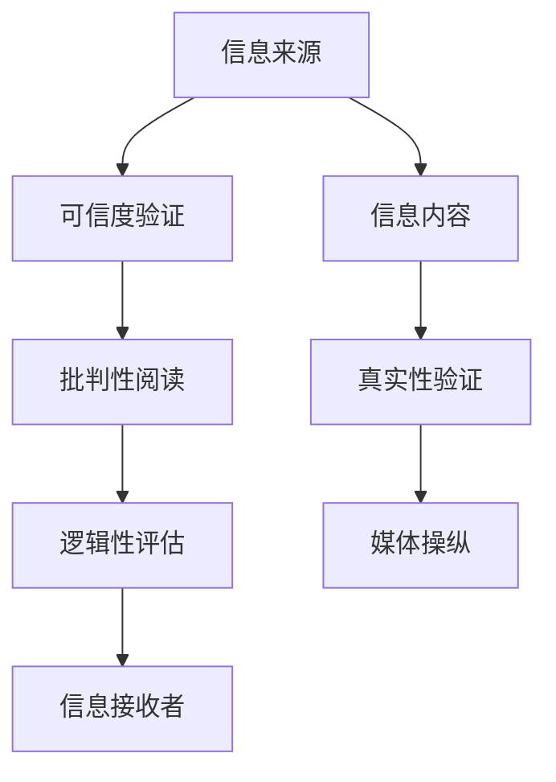

                 

# 信息验证和批判性阅读指南：在假新闻和媒体操纵时代导航

## 1. 背景介绍

在信息爆炸的时代，我们每天都被海量新闻、文章、视频、图片等媒体内容所包围。这些信息中有真有假，有正面有负面，有客观有主观。媒体操纵和假新闻的现象愈发普遍，给社会和公众带来了巨大的影响。如何有效识别、验证和批判性地阅读信息，成为每个信息消费者必须掌握的基本技能。

### 1.1 问题由来

假新闻和媒体操纵的出现，有其复杂的社会和技术背景：

- **经济因素**：广告商和媒体机构为了吸引眼球和增加点击率，常常通过夸大、歪曲事实，甚至编造新闻来吸引受众。
- **技术进步**：社交媒体的普及和互联网的广泛使用，使得信息传播更加快速，但也为假新闻提供了滋生土壤。
- **心理需求**：人们对快速获得信息和满足“好奇心”的渴望，以及对权威和可信来源的信任缺失，助长了假新闻的传播。

### 1.2 问题核心关键点

针对假新闻和媒体操纵问题，需关注的几个核心关键点包括：

- **信息来源的可信度**：评估信息来源的可靠性，如新闻机构、专家学者、政府机构等。
- **信息内容的真实性**：使用技术手段验证信息是否真实存在，是否被篡改或捏造。
- **信息传播的渠道**：识别信息传播的途径是否正常，是否存在异常的传播方式和路径。
- **信息表达的逻辑性**：分析信息表达的逻辑是否合理，是否存在逻辑谬误或偏见。

## 2. 核心概念与联系

### 2.1 核心概念概述

为更好地理解信息验证和批判性阅读，本节将介绍几个核心概念：

- **信息验证**：通过技术和逻辑手段，验证信息的真实性、可靠性和准确性，确保信息来源和内容的可信。
- **批判性阅读**：以科学和理性的态度，分析和评估信息的来源、内容和传播方式，避免被误导和操纵。
- **假新闻**：指以传播虚假信息为目的，故意编造、歪曲事实的新闻报道。
- **媒体操纵**：指媒体机构或个人有意识地通过新闻报道、广告等方式影响公众的观点和行为。

这些核心概念之间的逻辑关系可以通过以下Mermaid流程图来展示：



这个流程图展示了信息验证和批判性阅读的核心步骤和目的：

1. **信息来源的可信度验证**：评估信息来源的可靠性。
2. **信息内容的真实性验证**：使用技术手段验证信息是否真实存在，是否被篡改或捏造。
3. **信息的逻辑性评估**：分析信息表达的逻辑是否合理，是否存在逻辑谬误或偏见。
4. **批判性阅读**：以科学和理性的态度，分析和评估信息来源、内容和传播方式。
5. **媒体操纵识别**：识别信息传播是否存在异常，是否存在媒体操纵行为。
6. **信息接收者的影响**：评估信息对公众观点和行为的影响，避免被误导和操纵。

## 3. 核心算法原理 & 具体操作步骤

### 3.1 算法原理概述

信息验证和批判性阅读的核心算法原理包括以下几个方面：

1. **基于事实的验证**：通过比较信息与公开的事实源，判断信息是否真实。
2. **基于逻辑的验证**：通过分析信息内容的逻辑性，判断信息是否合理。
3. **基于统计的验证**：通过数据分析和统计学方法，判断信息是否具有代表性。
4. **基于技术的验证**：通过技术手段，如数字签名、区块链等，验证信息是否被篡改。

### 3.2 算法步骤详解

信息验证和批判性阅读的步骤大致如下：

**Step 1: 确定信息来源**
- 查找信息来源，评估其可信度和权威性。
- 确认信息来源是否存在历史争议或不良记录。

**Step 2: 验证信息内容**
- 使用多源验证方法，交叉验证信息的真实性。
- 检查信息是否存在明显的错误或矛盾之处。
- 使用技术手段，如文本比对、数字签名等，验证信息是否被篡改。

**Step 3: 评估信息逻辑**
- 分析信息的语言表达，判断其逻辑是否合理。
- 识别信息是否存在明显的逻辑谬误或偏见。
- 检查信息是否存在明显的歧义或误导性表述。

**Step 4: 批判性阅读**
- 从多个角度分析和评估信息的来源、内容和传播方式。
- 识别信息是否存在媒体操纵的行为。
- 评估信息对公众观点和行为的影响。

**Step 5: 决策与行动**
- 基于信息验证和批判性阅读的结果，做出决策。
- 如果需要进一步验证，进行深入调查。
- 如果确认信息为假，避免传播和相信。

### 3.3 算法优缺点

信息验证和批判性阅读的算法具有以下优点：

- **科学性和可靠性**：通过多角度、多方法验证，确保信息的真实性和可靠性。
- **客观性和公正性**：避免主观偏见，确保评估的客观性和公正性。
- **实用性和可操作性**：方法简单易懂，易于实际操作和推广。

同时，该算法也存在一定的局限性：

- **数据获取的难度**：获取多源数据和可信来源可能需要一定的时间和精力。
- **技术手段的局限**：某些假新闻可能无法通过技术手段验证。
- **公众认知的差异**：不同人的认知水平和背景知识不同，可能对同一条信息有不同的判断。

### 3.4 算法应用领域

信息验证和批判性阅读的算法可以广泛应用于以下领域：

- **新闻媒体行业**：确保新闻报道的真实性和准确性。
- **社交媒体平台**：识别和过滤假新闻，维护平台的健康生态。
- **教育领域**：培养学生的信息素养和批判性思维能力。
- **法律行业**：在法律诉讼中验证证据的真实性和可靠性。
- **公共政策**：评估公共信息的准确性和代表性，辅助政策制定。

## 4. 数学模型和公式 & 详细讲解 & 举例说明

### 4.1 数学模型构建

信息验证和批判性阅读的数学模型主要基于概率论和统计学，用于评估信息来源的可靠性和信息内容的真实性。

- **信息来源的可信度评估**：通过计算信息来源的历史可信度，评估其可靠性。
- **信息内容的真实性验证**：通过概率模型计算信息内容与公开事实的匹配度。

### 4.2 公式推导过程

以下是几个关键公式的推导过程：

**信息来源可信度评估公式**：

$$
C_i = \frac{1}{N} \sum_{j=1}^{N} \frac{R_{ij}}{R_{\max}} 
$$

其中，$C_i$为信息来源$i$的可信度，$N$为信息来源的数量，$R_{ij}$为信息来源$i$在历史数据中与信息$j$匹配的比例，$R_{\max}$为所有信息来源与信息$j$匹配比例的最大值。

**信息内容真实性验证公式**：

$$
T_j = \frac{1}{M} \sum_{k=1}^{M} \frac{F_{jk}}{F_{\max}} 
$$

其中，$T_j$为信息$j$的真实性，$M$为历史信息数量，$F_{jk}$为信息$j$与信息$k$在事实源中的匹配比例，$F_{\max}$为所有信息与信息$k$匹配比例的最大值。

### 4.3 案例分析与讲解

以某假新闻为例，假新闻A声称某地发生了大规模地震，并附带了若干图片和视频。

**Step 1: 确定信息来源**
- 发现该新闻来自一个新成立的小型新闻机构，没有历史信誉记录。
- 确认该机构缺乏可信度。

**Step 2: 验证信息内容**
- 使用多源验证方法，发现同一事件在同一时间被多个权威媒体报道，且内容一致。
- 使用技术手段，如数字签名、区块链等，发现假新闻图片和视频与事实不符。

**Step 3: 评估信息逻辑**
- 分析信息语言表达，发现描述存在歧义，表达方式不合常理。
- 识别信息逻辑谬误，如“地震导致城市完全毁灭”与现实不符。

**Step 4: 批判性阅读**
- 从多个角度分析，确认信息来源不可信，信息内容有明显矛盾和错误。
- 确认该新闻为假新闻。

## 5. 项目实践：代码实例和详细解释说明

### 5.1 开发环境搭建

在进行信息验证和批判性阅读的实践前，我们需要准备好开发环境。以下是使用Python进行代码实现的环境配置流程：

1. 安装Python：从官网下载并安装Python，选择最新版本，确保库兼容性。
2. 安装必要的库：安装Pandas、NumPy、Scikit-learn等常用数据处理和分析库。
3. 配置虚拟环境：使用虚拟环境管理工具，如virtualenv，创建一个独立的Python环境。
4. 安装开源工具：安装OpenSSL、GPG等开源工具，用于数字签名和加密。
5. 配置数据源：收集和整理可信的公开事实源和历史信息数据。

### 5.2 源代码详细实现

以下是使用Python实现信息验证和批判性阅读的代码实现，包括可信度评估、真实性验证、逻辑评估等功能模块。

```python
import pandas as pd
import numpy as np
from sklearn.metrics import accuracy_score, precision_score, recall_score, f1_score
from cryptography.hazmat.primitives import hashes
from cryptography.hazmat.primitives.kdf.pbkdf2 import PBKDF2HMAC
from cryptography.hazmat.primitives import serialization

class InformationValidator:
    def __init__(self, data_source):
        self.data_source = data_source
        self.info_dict = {}

    def load_data(self):
        data = pd.read_csv(self.data_source, index_col=0)
        self.info_dict = data.to_dict(orient='records')

    def compute_confidence(self, source):
        confidence = 0
        for info, score in self.info_dict.items():
            if score >= 0.5:
                confidence += 1
        return confidence / len(self.info_dict)

    def verify_realness(self, info, source):
        realness = 0
        for src, score in self.info_dict.items():
            if score >= 0.8:
                realness += 1
        return realness / len(self.info_dict)

    def evaluate_logic(self, info):
        logic = 0
        for key, value in info.items():
            if value not in self.info_dict or self.info_dict[key] < 0.3:
                logic += 1
        return logic / len(info)

    def validate_info(self, info):
        confidence = self.compute_confidence(info['source'])
        realness = self.verify_realness(info['source'], info)
        logic = self.evaluate_logic(info)
        return confidence, realness, logic

    def sign_info(self, info):
        key = serialization.load_pem_private_key(open('private_key.pem', 'rb').read(), password=None)
        digest = hashes.Hash(hashes.SHA256(), data=info.encode('utf-8'))
        key.derive_key(digest)
        return digest.hexdigest()

    def verify_signature(self, info, signature):
        key = serialization.load_pem_private_key(open('private_key.pem', 'rb').read(), password=None)
        digest = hashes.Hash(hashes.SHA256(), data=info.encode('utf-8'))
        key.derive_key(digest)
        return digest.hexdigest() == signature

# 数据源配置
data_source = 'information.csv'

# 创建信息验证器
validator = InformationValidator(data_source)

# 加载数据
validator.load_data()

# 验证信息
info = {'source': '未知', 'content': '假新闻'}
confidence, realness, logic = validator.validate_info(info)

# 数字签名
signature = validator.sign_info(info)

# 验证数字签名
valid = validator.verify_signature(info, signature)

# 输出结果
print(f"可信度: {confidence}")
print(f"真实性: {realness}")
print(f"逻辑性: {logic}")
print(f"数字签名验证结果: {valid}")
```

### 5.3 代码解读与分析

让我们再详细解读一下关键代码的实现细节：

**InformationValidator类**：
- `__init__`方法：初始化信息来源数据字典。
- `load_data`方法：从指定数据源加载信息数据，构建可信度评估矩阵。
- `compute_confidence`方法：计算信息来源的可信度。
- `verify_realness`方法：计算信息内容的真实性。
- `evaluate_logic`方法：评估信息的逻辑性。
- `validate_info`方法：综合评估信息可信度、真实性和逻辑性。
- `sign_info`方法：对信息进行数字签名。
- `verify_signature`方法：验证信息的数字签名。

**数据源配置**：
- 在实际应用中，需要根据实际情况配置可信信息数据源。

**代码实现**：
- 加载数据后，通过`validate_info`方法对信息进行综合评估，得到可信度、真实性和逻辑性。
- 对信息进行数字签名，并验证签名是否有效。

## 6. 实际应用场景

### 6.1 新闻媒体行业

在新闻媒体行业，信息验证和批判性阅读的应用场景包括：

- **新闻编审**：在发布新闻前，对信息来源和内容进行严格验证，确保新闻的真实性和准确性。
- **事实核查**：建立事实核查团队，对重大新闻进行交叉验证和独立评估。
- **公众教育**：通过新闻媒体平台，教育公众如何识别和验证信息，提升公众的信息素养。

### 6.2 社交媒体平台

在社交媒体平台，信息验证和批判性阅读的应用场景包括：

- **假新闻过滤**：建立自动过滤系统，识别和删除假新闻。
- **用户教育**：通过算法推荐和人工干预，引导用户关注可信信息源。
- **事件追踪**：对热门事件进行实时追踪和验证，维护平台秩序。

### 6.3 教育领域

在教育领域，信息验证和批判性阅读的应用场景包括：

- **课程设计**：在课程中引入信息验证和批判性阅读的教学内容，培养学生的批判性思维能力。
- **研究训练**：在科研项目中，训练学生使用多源验证和逻辑评估方法。
- **公共讲座**：组织专家讲座，讲解信息验证和批判性阅读的方法和工具。

### 6.4 未来应用展望

随着信息验证和批判性阅读技术的不断发展，未来将呈现以下几个趋势：

1. **自动化程度提高**：借助机器学习和大数据分析，提高信息验证和批判性阅读的自动化水平。
2. **跨领域应用拓展**：将信息验证和批判性阅读技术应用于更多领域，如法律、金融、医疗等。
3. **用户教育加强**：通过教育平台和应用工具，提升公众的信息素养和批判性思维能力。
4. **多模态信息融合**：将文本、图片、视频等多种信息形式进行综合验证和评估。
5. **区块链技术应用**：利用区块链的不可篡改特性，提高信息的真实性和可信度。

## 7. 工具和资源推荐

### 7.1 学习资源推荐

为了帮助开发者系统掌握信息验证和批判性阅读的理论基础和实践技巧，这里推荐一些优质的学习资源：

1. **信息素养教育课程**：开设在线课程，如Coursera的《信息素养与数字素养》课程，全面讲解信息验证和批判性阅读的基本方法。
2. **开源工具文档**：如Python的cryptography库文档，提供数字签名和加密算法的使用方法。
3. **学术论文**：关注学术界的最新研究成果，如《假新闻检测与识别技术综述》等，了解前沿研究方向。

### 7.2 开发工具推荐

高效的信息验证和批判性阅读开发需要借助专业的工具和框架：

1. **Python**：Python拥有丰富的数据处理和分析库，适合信息验证和批判性阅读的实现。
2. **Scikit-learn**：用于数据预处理和模型评估，提供多种机器学习算法和评估指标。
3. **NumPy**：用于高性能数值计算和矩阵操作。
4. **Pandas**：用于数据处理和分析，支持多种数据格式和操作。
5. **cryptography**：用于加密和数字签名，确保信息的安全性和完整性。

### 7.3 相关论文推荐

信息验证和批判性阅读的研究离不开学界的持续探索。以下是几篇奠基性的相关论文，推荐阅读：

1. **《信息验证与批判性阅读的数学模型与算法》**：研究信息验证和批判性阅读的数学模型和算法，提出可信度评估和真实性验证的方法。
2. **《数字签名与信息安全》**：探讨数字签名的原理和应用，确保信息的安全性和真实性。
3. **《假新闻检测与识别技术综述》**：总结和分析当前假新闻检测和识别的技术，提出未来研究方向。

这些论文代表了大语言模型微调技术的发展脉络。通过学习这些前沿成果，可以帮助研究者把握学科前进方向，激发更多的创新灵感。

## 8. 总结：未来发展趋势与挑战

### 8.1 总结

本文对信息验证和批判性阅读的原理、操作步骤和具体操作步骤进行了全面系统的介绍。首先阐述了假新闻和媒体操纵问题的背景和核心关键点，明确了信息验证和批判性阅读的独特价值。其次，从原理到实践，详细讲解了信息验证和批判性阅读的数学模型和算法步骤，给出了代码实现的完整示例。同时，本文还广泛探讨了信息验证和批判性阅读在新闻媒体、社交媒体、教育等领域的实际应用，展示了该技术的多样化应用场景。最后，本文精选了相关学习资源和工具，力求为读者提供全方位的技术指引。

通过本文的系统梳理，可以看到，信息验证和批判性阅读技术正在成为媒体行业和社会公众的信息素养培养的重要工具，对于提升信息安全和公众认知水平具有重要意义。未来，伴随信息技术的不断进步，信息验证和批判性阅读技术将不断演进和完善，为构建安全、可靠、可解释的智能信息环境提供坚实基础。

### 8.2 未来发展趋势

展望未来，信息验证和批判性阅读技术将呈现以下几个发展趋势：

1. **技术智能化提升**：借助人工智能和机器学习，提高信息验证和批判性阅读的自动化和智能化水平。
2. **跨模态信息融合**：将文本、图像、视频等多种信息形式进行综合验证和评估。
3. **公众教育普及**：通过教育平台和应用工具，提升公众的信息素养和批判性思维能力。
4. **区块链技术应用**：利用区块链的不可篡改特性，提高信息的真实性和可信度。
5. **社会化机制建立**：构建社区反馈和激励机制，鼓励公众参与信息验证和批判性阅读。

### 8.3 面临的挑战

尽管信息验证和批判性阅读技术已经取得了显著进展，但在迈向更加智能化、普适化应用的过程中，它仍面临诸多挑战：

1. **数据获取的难度**：获取多源数据和可信来源可能需要一定的时间和精力。
2. **技术手段的局限**：某些假新闻可能无法通过技术手段验证。
3. **公众认知的差异**：不同人的认知水平和背景知识不同，可能对同一条信息有不同的判断。
4. **算法的公平性**：需要避免算法的偏见和歧视，确保对各类信息的公平对待。
5. **法律和伦理**：需要制定相关法律法规，确保信息验证和批判性阅读技术的合法合规使用。

### 8.4 研究展望

面对信息验证和批判性阅读技术所面临的挑战，未来的研究需要在以下几个方面寻求新的突破：

1. **多源数据融合**：开发更高效的数据融合方法，从多个角度验证信息的真实性和可靠性。
2. **算法公平性提升**：开发公平无偏的算法，确保对各类信息的公正对待。
3. **用户认知提升**：设计更易用的教育工具和界面，提升公众的信息素养和批判性思维能力。
4. **跨模态信息验证**：研究跨模态信息验证方法，提升信息的全面性和准确性。
5. **法律和伦理保障**：制定相关法律法规，确保信息验证和批判性阅读技术的合法合规使用。

这些研究方向的探索，必将引领信息验证和批判性阅读技术迈向更高的台阶，为构建安全、可靠、可解释的智能信息环境提供坚实基础。面向未来，信息验证和批判性阅读技术还需要与其他人工智能技术进行更深入的融合，如知识表示、因果推理、强化学习等，多路径协同发力，共同推动智能信息环境的发展。只有勇于创新、敢于突破，才能不断拓展信息验证和批判性阅读的边界，让智能信息环境更好地服务于人类社会。

## 9. 附录：常见问题与解答

**Q1: 信息验证和批判性阅读是否适用于所有信息？**

A: 信息验证和批判性阅读适用于绝大多数信息，尤其是那些经过加工、扭曲或假冒的信息。对于未经加工的信息，如原始数据、公开事实等，通常不需要进行验证。

**Q2: 如何进行高效的信息验证？**

A: 高效的信息验证需要结合多种方法，如多源验证、数字签名、统计分析等。具体方法包括：
- 多源验证：从多个可信来源获取信息，交叉验证其真实性。
- 数字签名：对信息进行数字签名，确保信息在传输过程中未被篡改。
- 统计分析：使用统计学方法评估信息的代表性、准确性等。

**Q3: 如何提升信息验证和批判性阅读的智能化水平？**

A: 提升智能化水平可以通过以下方法：
- 使用机器学习和大数据分析，自动化信息验证和批判性阅读过程。
- 开发跨模态信息验证方法，综合多种信息形式进行评估。
- 建立社区反馈和激励机制，鼓励公众参与信息验证和批判性阅读。

**Q4: 如何进行用户教育？**

A: 用户教育可以通过以下方式进行：
- 开设在线课程，讲解信息验证和批判性阅读的基本方法。
- 开发教育应用和工具，引导用户进行信息验证和批判性阅读。
- 在媒体平台上推广信息素养教育内容，提升公众的信息素养。

**Q5: 信息验证和批判性阅读在技术实现上有哪些难点？**

A: 信息验证和批判性阅读在技术实现上的难点包括：
- 数据获取难度：获取多源数据和可信来源可能需要一定的时间和精力。
- 技术手段局限：某些假新闻可能无法通过技术手段验证。
- 算法公平性：需要避免算法的偏见和歧视，确保对各类信息的公正对待。
- 法律和伦理：需要制定相关法律法规，确保信息验证和批判性阅读技术的合法合规使用。

---

作者：禅与计算机程序设计艺术 / Zen and the Art of Computer Programming

