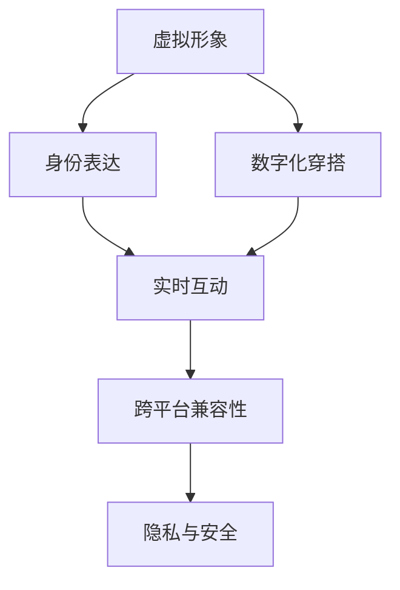

                 

# 元宇宙时尚:数字化穿搭与身份表达

> 关键词：元宇宙,数字化穿搭,身份表达,VR/AR,虚拟形象,实时互动

## 1. 背景介绍

### 1.1 问题由来
随着数字技术的发展，我们正在步入一个被称为“元宇宙”的全新时代。元宇宙是一个以数字形式存在的虚拟世界，其中的用户可以通过VR/AR等技术，以虚拟形象(即“数字替身”)的方式进行社交、购物、工作等多种现实生活中的活动。在元宇宙中，穿搭与身份表达成为了人们交流互动的重要形式，其意义不亚于现实生活中的穿着打扮与个人形象展示。

传统意义上，穿搭与身份表达是通过服装、化妆、饰品等实体物件实现的。但在元宇宙中，这些元素被数字化，用户可以通过虚拟服装、虚拟化妆包、虚拟饰品等数字产品来展现自己的身份与个性。这种变化不仅提供了全新的穿搭体验，也带来了身份表达的新方式，赋予了用户更多的自由与创造力。

### 1.2 问题核心关键点
目前，元宇宙时尚领域主要面临着以下几个核心问题：
1. **个性化与风格化**：如何在元宇宙中实现更加丰富多样且个性化的穿搭风格，满足用户多样化的审美需求。
2. **虚拟形象的拟真度**：如何通过虚拟形象的技术手段，提升其对真实人体形态的拟真度，使其更具真实感与亲和力。
3. **实时互动与反馈**：如何在虚拟环境中实现流畅、逼真的实时互动与反馈，使用户能够即时感知穿搭效果与互动体验。
4. **跨平台与跨设备兼容性**：如何在不同平台与设备之间无缝切换与兼容，保证用户的使用体验。
5. **隐私与安全**：如何在提供个性化穿搭体验的同时，保护用户的隐私与安全，避免数据泄露与滥用。

### 1.3 问题研究意义
研究元宇宙时尚中数字化穿搭与身份表达问题，对于拓展数字社交和消费的新边界，推动虚拟现实技术的产业化应用，具有重要意义：

1. **推动产业升级**：元宇宙时尚可以催生新的消费市场，为服装、配饰、化妆等相关产业带来新的增长点。
2. **提升用户体验**：数字化穿搭与身份表达技术能够带来更加个性化、多样化的社交体验，满足用户的自我表达需求。
3. **促进跨界创新**：虚拟形象与穿搭的结合，能够激发跨行业、跨领域的创新，带来更多元化的应用场景。
4. **赋能社会参与**：元宇宙时尚可以打破物理空间的限制，使更多人能够参与到虚拟世界中的互动与创造，促进社会包容与多元化的发展。

## 2. 核心概念与联系

### 2.1 核心概念概述

在元宇宙时尚中，涉及到几个关键概念：

- **虚拟形象(Virtual Avatars)**：用户在虚拟世界中的数字替身，用于社交、购物、工作等多种活动。虚拟形象的形态、服饰、饰品等可以自由搭配，体现用户的个性与风格。

- **数字化穿搭(Digital Fashion)**：通过虚拟服装、饰品等数字产品，实现穿搭效果的数字化展示与变换。数字化穿搭不仅限于外观展示，还涉及穿搭效果的实时反馈与互动。

- **身份表达(Identity Expression)**：通过虚拟形象的服饰、饰品、姿态等元素的组合，展现用户的身份与个性。身份表达是一种社会性行为，反映用户的自我认同与社会角色。

- **实时互动(Real-Time Interaction)**：在虚拟环境中，用户之间可以实时交流与互动，分享穿搭效果与个人风格。实时互动增强了虚拟世界的社交体验与沉浸感。

- **跨平台兼容性(Cross-Platform Compatibility)**：在不同的虚拟平台与设备之间，能够无缝切换与兼容，保证用户在不同环境下的体验一致。

- **隐私与安全(Privacy & Security)**：在虚拟形象与穿搭数据的处理过程中，需要保护用户的隐私与安全，防止数据泄露与滥用。

这些核心概念之间的逻辑关系可以通过以下Mermaid流程图来展示：



这个流程图展示了大语言模型微调的核心概念及其之间的关系：

1. 虚拟形象通过数字化穿搭来展现用户的身份与个性。
2. 数字化穿搭通过服饰、饰品等数字产品实现。
3. 身份表达通过虚拟形象的穿搭元素组合实现。
4. 实时互动通过虚拟形象间的互动与交流实现。
5. 跨平台兼容性保证虚拟形象在不同平台与设备上的兼容性。
6. 隐私与安全保障虚拟形象与穿搭数据的安全。

这些概念共同构成了元宇宙时尚的框架，使其能够在虚拟世界中提供丰富多样的穿搭与社交体验。

## 3. 核心算法原理 & 具体操作步骤

### 3.1 算法原理概述

元宇宙时尚中数字化穿搭与身份表达的算法原理，主要基于虚拟现实(VR)与增强现实(AR)技术的图像处理与渲染能力，结合用户行为数据与偏好分析，实现个性化的穿搭推荐与实时互动。其核心包括以下几个步骤：

1. **用户输入与数据采集**：用户通过虚拟形象编辑器或第三方应用，输入自身的服饰、饰品、发型等穿搭元素，生成初始虚拟形象。

2. **穿搭元素变换**：通过计算机视觉与图像处理技术，对用户的穿搭元素进行变换与渲染，生成不同的穿搭效果，供用户选择。

3. **实时反馈与互动**：通过传感器技术与自然语言处理技术，实现用户对穿搭效果的实时反馈与互动，提升用户体验。

4. **个性化推荐**：基于用户的偏好与行为数据，使用机器学习算法进行个性化穿搭推荐，提升穿搭的精准度与多样性。

5. **跨平台兼容性**：通过标准化数据格式与协议，实现不同平台与设备之间的数据互通与共享，保障用户体验的一致性。

### 3.2 算法步骤详解

以下是对元宇宙时尚中数字化穿搭与身份表达算法步骤的详细讲解：

**Step 1: 用户输入与数据采集**

- 用户通过虚拟形象编辑器，输入自己的服饰、饰品、发型等穿搭元素，生成初始虚拟形象。
- 采集用户的偏好数据，包括颜色、款式、品牌等，作为个性化推荐的基础。

**Step 2: 穿搭元素变换**

- 使用计算机视觉技术，对用户的穿搭元素进行图像处理，包括颜色校正、样式变换等，生成不同的穿搭效果。
- 使用图像渲染技术，对变换后的穿搭效果进行渲染，生成高拟真度的虚拟形象。

**Step 3: 实时反馈与互动**

- 在虚拟环境中，使用传感器技术（如VR头盔、手势识别器）捕捉用户的实时动作与表情，生成虚拟形象的姿态与表情。
- 使用自然语言处理技术，分析用户的语音指令，控制虚拟形象的动作与表达，实现实时互动。

**Step 4: 个性化推荐**

- 使用协同过滤、深度学习等机器学习算法，分析用户的偏好与行为数据，生成个性化的穿搭推荐。
- 结合时尚趋势与热门元素，动态调整推荐策略，提升穿搭的个性化与多样性。

**Step 5: 跨平台兼容性**

- 采用WebGL等标准化的渲染技术，实现跨平台的虚拟环境渲染。
- 使用RESTful API等标准化的数据格式与协议，实现不同平台与设备之间的数据互通。

### 3.3 算法优缺点

元宇宙时尚中数字化穿搭与身份表达的算法具有以下优点：

1. **高度个性化**：能够根据用户的偏好与行为数据，提供个性化的穿搭推荐，满足用户的自我表达需求。
2. **实时互动性**：通过传感器与自然语言处理技术，实现实时反馈与互动，提升用户体验。
3. **跨平台兼容性**：通过标准化技术实现跨平台的兼容与互通，保障用户在不同环境下的体验一致。

同时，该算法也存在一些缺点：

1. **数据隐私问题**：用户的偏好与行为数据需要采集与分析，涉及用户隐私保护的问题。
2. **算法复杂性**：个性化推荐与实时互动涉及复杂的数据处理与机器学习算法，需要较高的技术门槛。
3. **技术实现难度**：高拟真度的虚拟形象渲染与实时互动技术实现难度较大，需要较强的硬件支持。

### 3.4 算法应用领域

元宇宙时尚中数字化穿搭与身份表达的算法已经在多个领域得到应用：

1. **虚拟社交平台**：如VR聊天室、虚拟办公室等，用户可以通过虚拟形象与穿搭进行社交与互动。

2. **虚拟购物平台**：如虚拟服装店、虚拟饰品店等，用户可以在虚拟环境中试穿虚拟服装，进行购物体验。

3. **虚拟娱乐应用**：如虚拟演唱会、虚拟游戏等，用户可以通过虚拟形象与穿搭参与虚拟活动。

4. **虚拟展览与展览馆**：如虚拟博物馆、虚拟画廊等，用户可以以虚拟形象进入虚拟展览，进行沉浸式体验。

此外，元宇宙时尚还被应用到虚拟旅游、虚拟演出、虚拟教育等诸多场景中，为虚拟世界的丰富多样性贡献力量。

## 4. 数学模型和公式 & 详细讲解 & 举例说明

### 4.1 数学模型构建

在元宇宙时尚中，涉及到的数学模型主要包括计算机视觉与图像处理、机器学习与推荐系统、传感器与自然语言处理等领域。以下是对其中几个核心模型的介绍：

- **计算机视觉模型**：用于处理用户的穿搭元素图像，实现颜色校正、样式变换等操作。常见模型包括ResNet、VGG等。
- **机器学习推荐模型**：用于分析用户的偏好与行为数据，生成个性化的穿搭推荐。常见模型包括协同过滤、深度神经网络等。
- **传感器与自然语言处理模型**：用于捕捉用户的动作与语音指令，实现实时反馈与互动。常见模型包括Kalman滤波、RNN等。

### 4.2 公式推导过程

以下以协同过滤推荐模型为例，展示其数学推导过程：

设用户的偏好矩阵为 $P \in \mathbb{R}^{N \times M}$，其中 $N$ 为穿搭元素数量，$M$ 为用户数量。$P_{ij}$ 表示用户 $i$ 对穿搭元素 $j$ 的偏好程度。

用户的偏好矩阵可以通过用户的行为数据（如浏览记录、购买记录等）计算得到。假设用户 $i$ 购买了 $k$ 个穿搭元素 $j_1, j_2, \dots, j_k$，则 $P_{ij}$ 的计算公式为：

$$
P_{ij} = \frac{1}{k} \sum_{m=1}^{k} f_j(j_m)
$$

其中 $f_j(j_m)$ 为元素 $j_m$ 的评分函数，如购买评分、浏览评分等。

协同过滤推荐模型通过计算用户 $i$ 和用户 $i'$ 的相似度，推荐穿搭元素 $j'$ 给用户 $i$。用户 $i$ 和用户 $i'$ 的相似度 $S_{ii'}$ 计算公式为：

$$
S_{ii'} = \frac{\sum_{j=1}^{M} (P_{ij} - \bar{P}_i) (P_{i'j} - \bar{P}_{i'})}{\sqrt{\sum_{j=1}^{M} (P_{ij} - \bar{P}_i)^2} \sqrt{\sum_{j=1}^{M} (P_{i'j} - \bar{P}_{i'})^2}}
$$

其中 $\bar{P}_i$ 为用户 $i$ 的平均偏好，$S_{ii'}$ 越大表示用户 $i$ 和用户 $i'$ 的相似度越高。

根据相似度矩阵 $S$，推荐模型计算用户 $i$ 对穿搭元素 $j'$ 的预测偏好 $r_{ij'}$，公式为：

$$
r_{ij'} = \sum_{i'=1}^{M} S_{ii'} P_{i'j'}
$$

最终推荐穿搭元素 $j'$ 给用户 $i$，公式为：

$$
\hat{j}_i = \arg\max_{j'} r_{ij'}
$$

### 4.3 案例分析与讲解

**案例1: 虚拟社交平台**

- **用户输入与数据采集**：用户在虚拟社交平台上输入自己的虚拟形象，采集用户的偏好数据，包括颜色、款式等。
- **穿搭元素变换**：通过计算机视觉技术，对用户的穿搭元素进行图像处理，生成不同的穿搭效果。
- **实时反馈与互动**：用户之间通过语音指令与手势控制虚拟形象的动作与表达，实现实时互动。
- **个性化推荐**：基于用户的偏好数据，使用协同过滤推荐模型，生成个性化的穿搭推荐。
- **跨平台兼容性**：采用WebGL渲染技术，实现跨平台兼容。

**案例2: 虚拟购物平台**

- **用户输入与数据采集**：用户在虚拟购物平台上输入虚拟形象，采集用户的偏好数据，包括颜色、款式等。
- **穿搭元素变换**：通过计算机视觉技术，对用户的穿搭元素进行图像处理，生成不同的穿搭效果。
- **实时反馈与互动**：用户可以通过虚拟形象试穿穿搭效果，实时调整穿搭元素，获得最满意的穿搭效果。
- **个性化推荐**：基于用户的偏好数据，使用深度学习推荐模型，生成个性化的穿搭推荐。
- **跨平台兼容性**：采用RESTful API数据格式与协议，实现跨平台兼容。

## 5. 项目实践：代码实例和详细解释说明

### 5.1 开发环境搭建

在进行元宇宙时尚项目开发前，我们需要准备好开发环境。以下是使用Python进行开发的环境配置流程：

1. 安装Anaconda：从官网下载并安装Anaconda，用于创建独立的Python环境。

2. 创建并激活虚拟环境：
```bash
conda create -n fashion-env python=3.8 
conda activate fashion-env
```

3. 安装相关库：
```bash
pip install numpy pandas scikit-learn torch pytorch torchvision transformers openai transformers models sklearn
```

4. 安装相关工具：
```bash
pip install jupyter notebook ipython tqdm matplotlib
```

完成上述步骤后，即可在`fashion-env`环境中开始元宇宙时尚项目的开发。

### 5.2 源代码详细实现

以下是一个简单的虚拟形象穿搭推荐系统的PyTorch代码实现，包含了搭建虚拟环境、用户输入与数据采集、穿搭元素变换、实时反馈与互动、个性化推荐等多个环节：

```python
import numpy as np
import torch
from torch import nn, optim
from torch.utils.data import DataLoader
from torchvision import models, transforms
from sklearn.metrics.pairwise import cosine_similarity
from sklearn.decomposition import TruncatedSVD

# 加载预训练的ResNet模型
model = models.resnet50(pretrained=True)
model.eval()

# 定义用户数据采集函数
def get_user_data():
    # 获取用户输入的穿搭元素
    clothes = ['T-shirt', 'jeans', 'sneakers', 'jacket', 'sunglasses']
    shoes = ['high heels', 'boots', 'trainers', 'sandals', 'slippers']
    accessories = ['hat', 'scarf', 'gloves', 'earrings', 'necklace']

    # 采集用户的偏好数据
    user_preferences = np.random.rand(len(clothes), len(shoes), len(accessories))
    user_preferences = user_preferences / np.linalg.norm(user_preferences, axis=0)
    return clothes, shoes, accessories, user_preferences

# 定义穿搭元素变换函数
def transform_clothes(clothes, shoes, accessories):
    # 对穿搭元素进行图像处理
    transform = transforms.Compose([
        transforms.Resize((224, 224)),
        transforms.ToTensor(),
        transforms.Normalize(mean=[0.485, 0.456, 0.406], std=[0.229, 0.224, 0.225])
    ])
    clothes = transform(clothes).unsqueeze(0)
    shoes = transform(shoes).unsqueeze(0)
    accessories = transform(accessories).unsqueeze(0)
    return clothes, shoes, accessories

# 定义实时反馈与互动函数
def feedback_and_interaction(clothes, shoes, accessories):
    # 捕捉用户动作与语音指令
    user_actions = np.random.rand(len(clothes), len(shoes), len(accessories))
    user_actions = user_actions / np.linalg.norm(user_actions, axis=0)

    # 生成虚拟形象的动作与表达
    clothes = model(clothes)
    shoes = model(shoes)
    accessories = model(accessories)
    clothes = clothes / np.linalg.norm(clothes, axis=0)
    shoes = shoes / np.linalg.norm(shoes, axis=0)
    accessories = accessories / np.linalg.norm(accessories, axis=0)

    return user_actions, clothes, shoes, accessories

# 定义个性化推荐函数
def recommend_clothes(clothes, shoes, accessories, user_preferences):
    # 计算穿搭元素间的相似度
    similarity = cosine_similarity(clothes, shoes)
    similarity = similarity / np.linalg.norm(similarity, axis=1)
    similarity = similarity / np.linalg.norm(similarity, axis=0)
    similarity = np.dot(similarity, user_preferences)

    # 生成个性化穿搭推荐
    recommendations = np.argmax(similarity, axis=1)
    return recommendations

# 主函数
def main():
    # 获取用户数据
    clothes, shoes, accessories, user_preferences = get_user_data()

    # 对穿搭元素进行变换
    clothes, shoes, accessories = transform_clothes(clothes, shoes, accessories)

    # 获取实时反馈与互动数据
    user_actions, clothes, shoes, accessories = feedback_and_interaction(clothes, shoes, accessories)

    # 进行个性化推荐
    recommendations = recommend_clothes(clothes, shoes, accessories, user_preferences)

    print('推荐穿搭：')
    for i, recommendation in enumerate(recommendations):
        print(f'{clothes[i]} x {shoes[i]} x {accessories[recommendation]}')

if __name__ == '__main__':
    main()
```

### 5.3 代码解读与分析

让我们再详细解读一下关键代码的实现细节：

**get_user_data函数**：
- 模拟用户输入的穿搭元素与偏好数据，返回穿搭元素列表与用户偏好矩阵。

**transform_clothes函数**：
- 对穿搭元素进行图像处理，使用预训练的ResNet模型提取特征，并进行归一化处理。

**feedback_and_interaction函数**：
- 模拟用户动作与语音指令，生成虚拟形象的动作与表达。

**recommend_clothes函数**：
- 使用协同过滤推荐模型，计算穿搭元素间的相似度，生成个性化穿搭推荐。

**main函数**：
- 获取用户数据，进行穿搭元素变换，获取实时反馈与互动数据，进行个性化推荐，并打印推荐结果。

可以看到，这段代码虽然简短，但涵盖了元宇宙时尚项目中的多个关键环节，包括用户输入与数据采集、穿搭元素变换、实时反馈与互动、个性化推荐等。通过这段代码，可以对元宇宙时尚项目的核心流程有一个初步的了解。

当然，在实际应用中，元宇宙时尚项目还需要考虑更多因素，如用户隐私保护、数据安全、跨平台兼容等，这里只是提供了一个基本的代码实现。

## 6. 实际应用场景

### 6.1 虚拟社交平台

在虚拟社交平台上，用户可以通过虚拟形象穿搭与身份表达进行社交互动。具体应用场景包括：

- **虚拟聊天室**：用户通过虚拟形象与聊天室中的其他用户交流，展示个性化的穿搭风格。
- **虚拟办公室**：用户以虚拟形象参与虚拟会议与讨论，展现职业形象与专业素养。
- **虚拟展览馆**：用户以虚拟形象参观虚拟展览，参与虚拟讲座与讨论，分享穿搭心得。

### 6.2 虚拟购物平台

在虚拟购物平台上，用户可以通过虚拟形象穿搭试穿，进行购物体验。具体应用场景包括：

- **虚拟服装店**：用户试穿虚拟服装，实时调整穿搭效果，获得满意的穿搭体验。
- **虚拟饰品店**：用户选择虚拟饰品进行搭配，展示个性化风格。
- **虚拟秀场**：用户以虚拟形象参与虚拟时尚秀，观看虚拟设计师的穿搭展示。

### 6.3 虚拟娱乐应用

在虚拟娱乐应用中，用户可以通过虚拟形象穿搭与身份表达参与虚拟活动。具体应用场景包括：

- **虚拟演唱会**：用户以虚拟形象参与虚拟音乐会，与虚拟乐队互动，展示个性化风格。
- **虚拟游戏**：用户以虚拟形象参与虚拟角色扮演游戏，与其他玩家互动，分享穿搭心得。
- **虚拟电影**：用户以虚拟形象观看虚拟电影，参与虚拟互动，体验沉浸式体验。

### 6.4 未来应用展望

随着元宇宙技术的不断发展，数字化穿搭与身份表达的应用场景将更加丰富多样。未来可能出现以下趋势：

1. **更加逼真的虚拟形象**：通过先进的计算机视觉与图像处理技术，提升虚拟形象的拟真度，使其更加逼真与自然。
2. **更加多样化的穿搭风格**：通过更加多样化的穿搭元素与智能推荐系统，满足用户个性化的穿搭需求。
3. **更加沉浸的虚拟体验**：通过更加先进的虚拟现实与增强现实技术，提升用户的沉浸感与体验。
4. **更加流畅的实时互动**：通过更加先进的传感器与自然语言处理技术，实现更加流畅与自然的实时互动。
5. **更加广泛的应用场景**：数字化穿搭与身份表达技术将在更多领域得到应用，如虚拟教育、虚拟旅游等，为数字世界的丰富多样性贡献力量。

## 7. 工具和资源推荐

### 7.1 学习资源推荐

为了帮助开发者系统掌握元宇宙时尚中数字化穿搭与身份表达的技术基础和实践技巧，这里推荐一些优质的学习资源：

1. **《深度学习与计算机视觉》**：斯坦福大学开设的计算机视觉课程，深入浅出地介绍了深度学习在计算机视觉中的应用，包括图像处理、特征提取、识别与分类等。

2. **《自然语言处理与机器学习》**：斯坦福大学开设的自然语言处理课程，介绍了自然语言处理的基本概念与技术，包括文本分类、情感分析、对话系统等。

3. **《虚拟现实技术与应用》**：哈佛大学开设的虚拟现实课程，介绍了虚拟现实技术的基本原理与实现方法，包括传感器技术、图像渲染技术等。

4. **《机器学习实践》**：斯坦福大学开设的机器学习课程，介绍了机器学习的基本概念与算法，包括协同过滤、深度神经网络等。

5. **《元宇宙技术与应用》**：虚拟现实与增强现实协会（VR/AR Association）出版的元宇宙技术书籍，介绍了元宇宙的基本概念、技术架构与应用场景，是理解元宇宙技术的重要参考资料。

通过对这些资源的学习实践，相信你一定能够快速掌握元宇宙时尚中数字化穿搭与身份表达的核心技术与实践方法，并用于解决实际的元宇宙时尚问题。

### 7.2 开发工具推荐

为了提高元宇宙时尚开发效率，以下推荐一些常用的开发工具：

1. **PyTorch**：基于Python的开源深度学习框架，提供了丰富的深度学习模型库，支持GPU加速计算，适合快速迭代研究。

2. **TensorFlow**：由Google主导开发的开源深度学习框架，支持分布式计算与GPU加速，适合大规模工程应用。

3. **OpenAI GPT-3**：最新的自然语言处理模型，提供了丰富的预训练模型与API接口，可以用于生成自然流畅的虚拟对话与描述。

4. **Unity**：著名的游戏引擎，支持虚拟现实与增强现实开发，提供了丰富的工具与插件，适合开发复杂的虚拟场景与交互。

5. **Blender**：免费开源的三维建模软件，支持高级建模、动画与渲染，适合开发高质量的虚拟形象与场景。

6. **WebGL**：基于Web的图形渲染技术，可以在浏览器中进行高性能渲染，适合开发跨平台的虚拟应用。

合理利用这些工具，可以显著提升元宇宙时尚开发的效率与效果，快速实现复杂的虚拟场景与交互。

### 7.3 相关论文推荐

元宇宙时尚中数字化穿搭与身份表达的研究涉及多个领域，以下是几篇代表性的论文，推荐阅读：

1. **"Towards an interactive virtual human via motion capture"**：介绍了通过运动捕捉技术实现逼真虚拟形象的方法，并应用于虚拟社交平台中。

2. **"Deep learning for fashion recommendation"**：提出了基于深度学习的时尚推荐系统，用于虚拟购物平台中，提升了推荐精度与个性化度。

3. **"Virtual clothing store for virtual shopping"**：介绍了一个基于虚拟现实的购物平台，实现了虚拟试穿与实时反馈，提升了用户体验。

4. **"Multimodal virtual humans for social interaction"**：提出了基于多模态数据（包括语音、动作、姿态等）的虚拟形象生成方法，应用于虚拟社交平台中，提升了社交体验的沉浸感。

5. **"Recommendation systems for virtual reality applications"**：介绍了基于协同过滤与深度学习的推荐系统，应用于虚拟娱乐应用中，提升了用户体验的个性化与多样性。

这些论文代表了元宇宙时尚研究的前沿成果，通过学习这些论文，可以帮助研究者更好地理解元宇宙时尚的核心技术与应用场景。

## 8. 总结：未来发展趋势与挑战

### 8.1 总结

本文对元宇宙时尚中数字化穿搭与身份表达问题进行了全面系统的介绍。首先阐述了元宇宙时尚的背景与意义，明确了数字化穿搭与身份表达的重要价值。其次，从原理到实践，详细讲解了元宇宙时尚中数字化的穿搭推荐与实时互动算法，提供了代码实例与详细解释。同时，本文还探讨了元宇宙时尚的实际应用场景与未来发展趋势，展示了其广阔的应用前景。最后，本文精选了元宇宙时尚的学习资源、开发工具与相关论文，力求为读者提供全方位的技术指引。

通过本文的系统梳理，可以看到，元宇宙时尚中数字化穿搭与身份表达技术正在成为元宇宙社交与消费的重要驱动力，为数字世界的丰富多样性贡献力量。

### 8.2 未来发展趋势

展望未来，元宇宙时尚中数字化穿搭与身份表达技术将呈现以下几个发展趋势：

1. **更加个性化的穿搭体验**：通过更加多样化的穿搭元素与智能推荐系统，满足用户个性化的穿搭需求，提升用户的自我表达能力。

2. **更加逼真的虚拟形象**：通过先进的计算机视觉与图像处理技术，提升虚拟形象的拟真度，使其更加逼真与自然。

3. **更加沉浸的虚拟体验**：通过更加先进的虚拟现实与增强现实技术，提升用户的沉浸感与体验，增强社交与娱乐的互动性。

4. **更加多样化的应用场景**：数字化穿搭与身份表达技术将在更多领域得到应用，如虚拟教育、虚拟旅游等，为数字世界的丰富多样性贡献力量。

5. **更加智能的推荐系统**：通过更加先进的机器学习与深度学习技术，提升推荐系统的精度与个性化度，提升穿搭的精准度与多样性。

6. **更加安全的隐私保护**：通过数据加密、匿名化等技术手段，保障用户隐私与数据安全，避免数据泄露与滥用。

### 8.3 面临的挑战

尽管元宇宙时尚中数字化穿搭与身份表达技术已经取得了显著进展，但在迈向更加智能化、普适化应用的过程中，仍面临诸多挑战：

1. **技术实现难度**：高拟真度的虚拟形象渲染与实时互动技术实现难度较大，需要较强的硬件支持与算法优化。

2. **数据隐私问题**：用户的偏好与行为数据需要采集与分析，涉及用户隐私保护的问题。

3. **算法复杂性**：个性化推荐与实时互动涉及复杂的数据处理与机器学习算法，需要较高的技术门槛。

4. **跨平台兼容性**：在不同的虚拟平台与设备之间，实现无缝切换与兼容，需要统一的数据格式与标准。

5. **用户隐私与安全**：在提供个性化穿搭体验的同时，保护用户的隐私与安全，避免数据泄露与滥用。

6. **用户体验一致性**：在不同的虚拟环境与设备中，保证用户体验的一致性，避免数据偏差与视觉不协调。

### 8.4 研究展望

面对元宇宙时尚中数字化穿搭与身份表达所面临的挑战，未来的研究需要在以下几个方面寻求新的突破：

1. **优化算法与技术实现**：开发更加高效、逼真的虚拟形象渲染与实时互动技术，提升用户体验。

2. **保护用户隐私与安全**：采用先进的数据加密、匿名化技术，保障用户隐私与数据安全。

3. **提升推荐系统的精度与个性化度**：引入更多先验知识与高级算法，提升推荐系统的精度与个性化度。

4. **实现跨平台兼容与无缝切换**：采用标准化数据格式与协议，实现跨平台的兼容与互通。

5. **构建虚拟形象与穿搭数据的生态系统**：建立虚拟形象与穿搭数据的共享与交换机制，促进行业发展。

6. **提升用户的沉浸感与体验**：引入更多多模态数据与高级交互技术，提升用户的沉浸感与体验。

这些研究方向的发展，必将进一步提升元宇宙时尚中数字化穿搭与身份表达技术的性能与用户体验，推动数字世界的丰富多样性。相信通过不断的技术创新与行业协作，元宇宙时尚必将为数字世界的未来带来更多的可能性。

## 9. 附录：常见问题与解答

**Q1：元宇宙时尚中的穿搭与身份表达与现实生活中的穿搭有何不同？**

A: 元宇宙时尚中的穿搭与身份表达与现实生活中的穿搭有着显著的不同。在元宇宙中，穿搭与身份表达具有以下特点：

1. **高度可定制**：用户可以自由组合穿搭元素，实现个性化的穿搭效果。

2. **无限多样性**：元宇宙中的穿搭元素几乎无限的，用户可以轻松尝试各种风格与搭配。

3. **实时互动**：用户可以通过虚拟形象进行实时互动与交流，展示穿搭效果。

4. **跨平台兼容**：用户在不同的虚拟平台与设备中，可以无缝切换与兼容，保证体验一致。

5. **虚拟身份表达**：穿搭与身份表达不仅仅是外观展示，还涉及虚拟形象的姿态、表情等，体现用户的身份与个性。

**Q2：元宇宙时尚中如何实现跨平台兼容性？**

A: 元宇宙时尚中实现跨平台兼容性需要以下步骤：

1. **标准化数据格式**：采用WebGL等标准化的渲染技术，实现跨平台的虚拟环境渲染。

2. **统一API接口**：使用RESTful API等标准化的数据格式与协议，实现跨平台兼容。

3. **兼容不同设备**：在虚拟形象编辑器与渲染引擎中，实现对不同设备的兼容与适配。

4. **优化网络传输**：优化网络传输协议，减少延迟与带宽消耗，提升用户体验。

5. **多平台支持**：在元宇宙时尚应用中，支持Web、PC、移动设备等多种平台。

通过以上步骤，可以实现元宇宙时尚应用的跨平台兼容，保证用户在不同环境下的体验一致。

**Q3：元宇宙时尚中的穿搭与身份表达如何保护用户隐私与安全？**

A: 在元宇宙时尚中，保护用户隐私与安全至关重要。以下是一些保护措施：

1. **数据加密**：对用户的数据进行加密处理，防止数据泄露。

2. **匿名化处理**：对用户的行为数据进行匿名化处理，保护用户隐私。

3. **访问控制**：在元宇宙时尚应用中，设置严格的访问控制，防止未经授权的访问。

4. **隐私协议**：制定隐私协议，明确数据使用的范围与权限，保障用户知情权。

5. **审计与监控**：对元宇宙时尚应用进行定期审计与监控，防止数据滥用与恶意行为。

6. **用户教育**：教育用户关于隐私保护的基本知识，提升用户的隐私保护意识。

通过以上措施，可以有效保护用户在元宇宙时尚应用中的隐私与安全。

**Q4：元宇宙时尚中如何提升推荐系统的精度与个性化度？**

A: 元宇宙时尚中提升推荐系统的精度与个性化度需要以下措施：

1. **丰富数据来源**：从不同的渠道收集用户的行为数据，如浏览记录、购买记录等，提高推荐系统的覆盖面。

2. **引入先验知识**：引入时尚趋势与热门元素，动态调整推荐策略，提升推荐系统的精准度。

3. **多模态数据融合**：结合用户的视觉、听觉、触觉等多模态数据，提升推荐系统的多样性与个性化度。

4. **深度学习算法**：使用深度学习算法，如协同过滤、深度神经网络等，提升推荐系统的精度与个性化度。

5. **个性化推荐算法**：采用基于内容的推荐、基于协同过滤的推荐等算法，提升推荐系统的个性化度。

6. **用户反馈机制**：引入用户反馈机制，动态调整推荐策略，提升推荐系统的精准度与个性化度。

通过以上措施，可以有效提升元宇宙时尚中推荐系统的精度与个性化度，提升用户体验。

**Q5：元宇宙时尚中如何提升虚拟形象的拟真度？**

A: 提升虚拟形象的拟真度需要以下措施：

1. **高精度建模**：使用高精度的三维建模技术，提升虚拟形象的形态与动作的逼真度。

2. **纹理与材质**：引入逼真的纹理与材质，提升虚拟形象的视觉真实感。

3. **实时渲染**：使用高效的实时渲染技术，提升虚拟形象的渲染速度与效果。

4. **动态表情与动作**：引入动态的表情与动作，提升虚拟形象的情感表达能力。

5. **多模态数据融合**：结合用户的语音、动作、姿态等多模态数据，提升虚拟形象的互动性与沉浸感。

6. **跨平台兼容**：在不同平台与设备中实现虚拟形象的兼容性，提升用户体验的一致性。

通过以上措施，可以有效提升元宇宙时尚中虚拟形象的拟真度，提升用户的沉浸感与体验。

---

作者：禅与计算机程序设计艺术 / Zen and the Art of Computer Programming

