                 

# 元宇宙时尚：数字化穿搭与身份表达

> 关键词：元宇宙,数字化穿搭,身份表达,虚拟试衣,数字双胞胎,个性化定制,人工智能

## 1. 背景介绍

### 1.1 问题由来
随着虚拟现实(VR)、增强现实(AR)、混合现实(MR)等技术的飞速发展，元宇宙(Utopia)概念逐渐成为科技界的新宠。元宇宙是一个虚拟且永续的互联网环境，其中包含了经济系统、物理定律、身份系统和复杂交互行为。作为元宇宙的重要应用场景之一，时尚界也正快速迈入数字化时代。

时尚不仅仅是服装搭配和审美选择，它更是身份的展现、个性的表达和文化交流的载体。在元宇宙中，人们可以通过数字化穿搭和身份表达，在虚拟世界中自由探索和社交。因此，数字化穿搭与身份表达成为元宇宙时尚的重要研究方向。

### 1.2 问题核心关键点
当前，数字化穿搭与身份表达技术主要包括：
- **虚拟试衣**：用户可以在虚拟环境中试穿数字化的服装，体验不同风格的效果。
- **数字双胞胎**：创建个人虚拟形象，实时同步用户的现实世界形象，提供沉浸式体验。
- **个性化定制**：利用人工智能技术，根据用户数据生成个性化推荐和定制方案。
- **时尚模拟与优化**：利用模拟技术评估穿搭效果，进行时尚优化。

这些技术相互交织，构成了元宇宙时尚的核心应用场景。然而，在元宇宙时尚中，用户身份与现实身份的映射、虚拟试衣的真实感、个性化定制的个性化程度、实时同步的精度等问题，仍待进一步探索解决。

### 1.3 问题研究意义
研究数字化穿搭与身份表达技术，对于拓展元宇宙时尚应用，提升用户体验，加速时尚产业数字化转型，具有重要意义：

1. **提升用户体验**：通过数字化试衣、数字双胞胎等技术，用户可以更方便地体验和选择时尚单品，提升购物体验。
2. **加速产业升级**：数字化时尚技术能够推动传统时尚产业向智能制造、智慧运营、个性化定制等方向升级，提升效率和精度。
3. **开拓新市场**：元宇宙时尚为时尚品牌提供了新的营销渠道和用户接触方式，开辟了新的市场空间。
4. **促进文化交流**：虚拟世界中的身份表达和穿搭风格，为不同文化背景的用户提供交流平台，促进跨文化交流。
5. **激发创新活力**：结合最新的人工智能技术，如生成对抗网络(GANs)、风格迁移、神经网络等，可以不断创造新的时尚元素和搭配方式。

## 2. 核心概念与联系

### 2.1 核心概念概述

为更好地理解数字化穿搭与身份表达技术，本节将介绍几个密切相关的核心概念：

- **虚拟试衣**：指在虚拟环境中试穿数字化服装的技术。用户可以通过360度观看、互动式搭配、实时反馈等方式，体验不同服装的效果。

- **数字双胞胎**：指将用户的现实身份映射到虚拟世界中的数字模型，创建逼真且动态更新的虚拟形象。

- **个性化定制**：指通过人工智能技术，根据用户的个人数据和偏好，生成个性化推荐和定制方案。

- **时尚模拟与优化**：指利用模拟技术，评估穿搭效果，进行时尚优化。通过模拟穿搭场景，预测时尚趋势，优化穿搭方案。

- **人工智能(AI)**：包括机器学习、深度学习、生成对抗网络(GANs)等技术，在数字化穿搭与身份表达中起到了至关重要的作用。

这些核心概念之间的逻辑关系可以通过以下Mermaid流程图来展示：

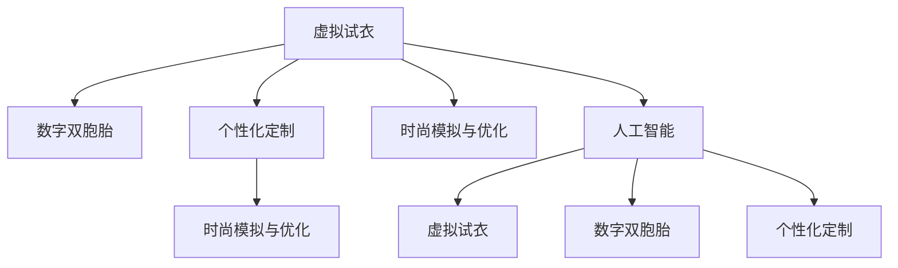

这个流程图展示了大语言模型的核心概念及其之间的关系：

1. 虚拟试衣技术需要通过人工智能进行图像处理、虚拟搭配等操作。
2. 数字双胞胎需要利用人工智能生成逼真的3D模型，动态更新用户数据。
3. 个性化定制依靠人工智能推荐系统，生成个性化推荐和定制方案。
4. 时尚模拟与优化可以利用人工智能进行穿搭效果的模拟和优化。

这些核心概念共同构成了元宇宙时尚的基础，为数字化穿搭与身份表达提供了实现途径。通过理解这些核心概念，我们可以更好地把握元宇宙时尚的工作原理和优化方向。

## 3. 核心算法原理 & 具体操作步骤
### 3.1 算法原理概述

数字化穿搭与身份表达的核心算法原理，是通过计算机视觉、三维建模、人工智能等技术，将用户的现实身份和偏好映射到虚拟世界中，生成逼真的虚拟穿搭和身份表达。

具体而言，包括以下几个关键步骤：

1. **虚拟试衣**：用户上传现实世界的服装图片或数据，系统通过计算机视觉技术将其转化为虚拟服装模型，并在虚拟环境中进行试穿。

2. **数字双胞胎**：系统收集用户的现实世界数据，如身高、体重、肤色等，利用三维建模技术生成逼真的数字模型，动态更新用户的虚拟形象。

3. **个性化定制**：系统收集用户的个性化数据，如风格偏好、颜色喜好、体型特征等，利用推荐系统生成个性化的穿搭推荐和定制方案。

4. **时尚模拟与优化**：系统通过模拟技术，评估穿搭效果，预测时尚趋势，优化穿搭方案。

### 3.2 算法步骤详解

#### 3.2.1 虚拟试衣算法步骤

1. **图像预处理**：
   - 将用户上传的现实世界服装图片，通过图像处理技术进行去噪、边缘检测、颜色校正等操作，提取服装的形状、颜色、材质等特征。

2. **三维建模**：
   - 将预处理后的图像，通过深度学习网络，生成服装的三维模型，包括形状、纹理、材质等细节。

3. **虚拟试穿**：
   - 将三维模型加载到虚拟环境中，通过姿态识别、手势控制等技术，让用户可以在虚拟环境中试穿服装。

4. **穿搭效果评估**：
   - 通过计算机视觉技术，实时反馈穿搭效果，如光影效果、透视感、动效等，评估穿搭效果。

#### 3.2.2 数字双胞胎算法步骤

1. **数据收集**：
   - 收集用户的现实世界数据，如身高、体重、肤色、发型等，构建用户数据集。

2. **三维建模**：
   - 利用计算机视觉和三维建模技术，生成逼真的数字模型，包括面部、身体、服饰等。

3. **实时同步**：
   - 通过物联网(IoT)设备，实时收集用户的现实世界数据，动态更新数字模型的状态，保持虚拟形象与现实形象一致。

#### 3.2.3 个性化定制算法步骤

1. **数据收集**：
   - 收集用户的个性化数据，如购物记录、浏览历史、风格偏好等。

2. **特征提取**：
   - 利用机器学习算法，提取用户数据的特征，如颜色喜好、风格偏好、体型特征等。

3. **推荐系统**：
   - 构建推荐系统，根据用户数据生成个性化的穿搭推荐和定制方案。

#### 3.2.4 时尚模拟与优化算法步骤

1. **时尚模拟**：
   - 利用计算机视觉和模拟技术，构建虚拟穿搭场景，实时展示穿搭效果。

2. **效果评估**：
   - 通过模拟技术，评估穿搭效果，预测时尚趋势。

3. **优化方案**：
   - 根据评估结果，生成优化方案，提供穿搭建议。

### 3.3 算法优缺点

数字化穿搭与身份表达算法具有以下优点：

1. **便捷高效**：用户可以在虚拟环境中快速试衣，无需实际购买和试穿。
2. **个性化程度高**：个性化推荐和定制方案，能够根据用户偏好和数据生成独特穿搭。
3. **实时同步**：数字双胞胎技术可以实现虚拟形象与现实形象的实时同步，提供沉浸式体验。
4. **模拟优化**：时尚模拟与优化技术，可以评估穿搭效果，提供改进建议。

同时，该算法也存在一些局限性：

1. **数据隐私问题**：收集用户数据时，需要保障用户隐私，避免数据泄露和滥用。
2. **计算资源消耗大**：生成逼真数字模型、深度学习网络等需要大量计算资源，对设备性能有较高要求。
3. **用户体验限制**：虚拟试衣效果受限于设备和网络条件，用户体验可能存在局限。
4. **个性化推荐准确性**：推荐系统的准确性依赖于数据质量，需要不断优化推荐算法。
5. **虚拟形象逼真度**：数字双胞胎技术生成的虚拟形象逼真度受限于模型训练数据和算法复杂度。

尽管存在这些局限性，数字化穿搭与身份表达技术仍是大势所趋，具有广泛的应用前景。未来相关研究的重点在于如何进一步提升算法的准确性和效率，优化用户体验，确保数据隐私和安全。

### 3.4 算法应用领域

数字化穿搭与身份表达技术在多个领域都有广泛应用：

- **电商行业**：通过虚拟试衣、数字双胞胎等技术，提升购物体验，增加用户粘性。
- **娱乐行业**：在虚拟游戏中提供个性化定制的虚拟形象，增强用户沉浸感。
- **时尚品牌**：通过时尚模拟与优化技术，预测时尚趋势，优化产品设计。
- **数字艺术**：利用虚拟试衣和数字双胞胎技术，创作和展示虚拟时装秀。
- **个性化服务**：结合个性化推荐和数字双胞胎技术，提供定制化服务。

除了上述这些经典领域外，数字化穿搭与身份表达技术也在不断扩展到更多场景中，如虚拟办公、虚拟旅游、虚拟社交等，为人们的日常生活和工作带来更多便利和乐趣。

## 4. 数学模型和公式 & 详细讲解 & 举例说明
### 4.1 数学模型构建

数字化穿搭与身份表达技术的数学模型构建，主要基于以下几个关键领域：

1. **计算机视觉**：通过图像处理技术，提取服装的特征。
2. **三维建模**：利用几何学和计算机图形学，生成逼真的三维模型。
3. **机器学习**：构建推荐系统和模拟技术，评估穿搭效果。

以下是几个核心数学模型的详细介绍：

#### 4.1.1 图像处理模型

假设用户上传的现实世界服装图片为 $I \in \mathbb{R}^{h \times w \times 3}$，其中 $h, w$ 为图像的高和宽，$3$ 为颜色通道数。图像处理模型可以表示为：

$$
I' = \mathcal{F}(I; \theta)
$$

其中 $\theta$ 为模型参数，$\mathcal{F}$ 为图像处理函数，可以包括去噪、边缘检测、颜色校正等操作。

#### 4.1.2 三维建模模型

三维建模模型可以将图像处理后的服装特征映射到三维空间中，生成逼真的三维模型 $M \in \mathbb{R}^{d \times 3}$，其中 $d$ 为三维模型的顶点数。

三维建模模型可以表示为：

$$
M = \mathcal{G}(I'; \theta_G)
$$

其中 $\theta_G$ 为三维建模函数 $\mathcal{G}$ 的参数，包括几何形态、纹理、材质等细节。

#### 4.1.3 推荐系统模型

推荐系统模型可以根据用户数据 $D$，生成个性化的穿搭推荐和定制方案 $R \in \{0,1\}^{N}$，其中 $N$ 为穿搭方案的总数。

推荐系统模型可以表示为：

$$
R = \mathcal{S}(D; \theta_S)
$$

其中 $\theta_S$ 为推荐函数 $\mathcal{S}$ 的参数，包括用户数据、推荐算法等。

#### 4.1.4 模拟与优化模型

时尚模拟与优化模型可以评估穿搭效果，生成优化方案 $O \in \mathbb{R}^k$，其中 $k$ 为优化方案的维数。

模拟与优化模型可以表示为：

$$
O = \mathcal{O}(R; \theta_O)
$$

其中 $\theta_O$ 为模拟与优化函数 $\mathcal{O}$ 的参数，包括模拟技术、优化算法等。

### 4.2 公式推导过程

#### 4.2.1 图像处理公式推导

假设图像处理模型为卷积神经网络(Convolutional Neural Network, CNN)，其结构如图1所示：

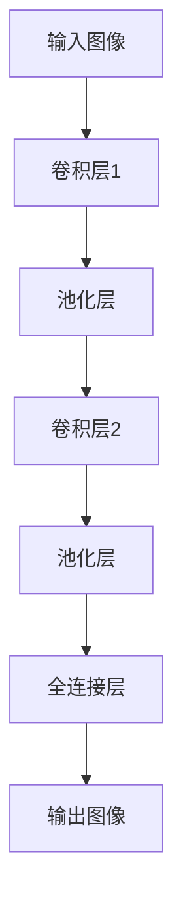

设输入图像 $I$ 的尺寸为 $h \times w$，卷积核大小为 $k \times k$，步长为 $s$，输出特征图尺寸为 $d$。则卷积层1的输出为：

$$
O_{1} = \mathcal{F}_1(I; \theta_1) = \frac{1}{s^2} \sum_{i=1}^k \sum_{j=1}^k \sum_{m=1}^d (I * \theta_1)_{i,j} \times \theta_2
$$

其中 $\theta_1$ 为卷积核，$\theta_2$ 为偏置项。

#### 4.2.2 三维建模公式推导

三维建模模型通常采用参数化的曲面，如平面、球面、曲面等。假设三维模型为球面，其方程可以表示为：

$$
x^2 + y^2 + z^2 = r^2
$$

其中 $r$ 为球面的半径，$(x, y, z)$ 为球面上的任意点。

#### 4.2.3 推荐系统公式推导

推荐系统模型通常采用协同过滤、内容推荐、混合推荐等方法。假设推荐系统为协同过滤方法，其推荐公式可以表示为：

$$
R_{i,j} = \mathcal{S}(D; \theta_S) = \frac{\sum_{k=1}^M u_i k_j}{\sqrt{\sum_{k=1}^M u_i^2} \sqrt{\sum_{k=1}^M k_j^2}}
$$

其中 $u_i$ 和 $k_j$ 分别为用户和商品的特征向量，$M$ 为用户的特征数，$R_{i,j}$ 为商品 $j$ 对用户 $i$ 的推荐评分。

#### 4.2.4 模拟与优化公式推导

时尚模拟与优化模型通常采用遗传算法、模拟退火等优化算法。假设模拟与优化算法为模拟退火方法，其优化公式可以表示为：

$$
O = \mathcal{O}(R; \theta_O) = \arg\min_{o} O(R; o; \theta_O)
$$

其中 $o$ 为优化方案，$O(R; o; \theta_O)$ 为模拟与优化函数。

### 4.3 案例分析与讲解

#### 4.3.1 虚拟试衣案例分析

假设用户上传的现实世界服装图片为一张红色的长裙，如图2所示。


图2: 虚拟试衣流程

具体步骤如下：

1. 通过图像处理技术，将服装图片去噪、边缘检测、颜色校正等操作，如图3所示。


图3: 图像处理结果

2. 利用三维建模技术，将处理后的图像映射到三维空间中，生成逼真的三维模型，如图4所示。

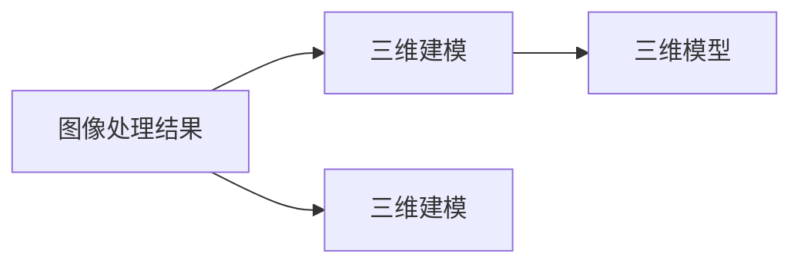

图4: 三维模型

3. 在虚拟环境中，利用姿态识别和手势控制技术，让用户试穿服装，如图5所示。

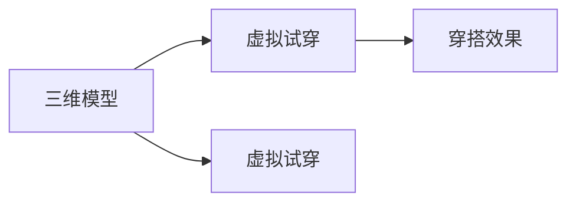

图5: 虚拟试穿效果

4. 通过计算机视觉技术，实时反馈穿搭效果，如图6所示。


图6: 穿搭效果评估结果

#### 4.3.2 数字双胞胎案例分析

假设用户上传的现实世界数据为身高 $h=170cm$，体重 $w=60kg$，肤色为 $s=0.9$，发型为 $f=1$，如图7所示。

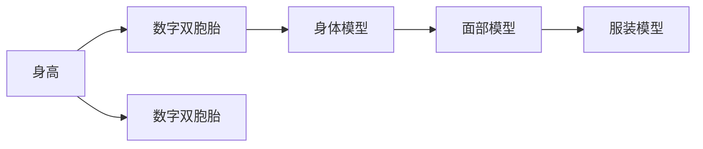

图7: 数字双胞胎流程

具体步骤如下：

1. 通过计算机视觉技术，收集用户的现实世界数据，如图8所示。

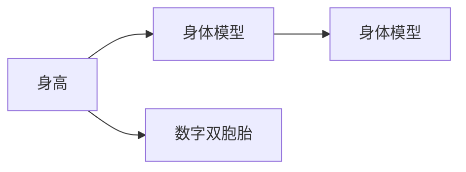

图8: 数据收集

2. 利用三维建模技术，生成逼真的数字模型，包括身体、面部、服饰等，如图9所示。

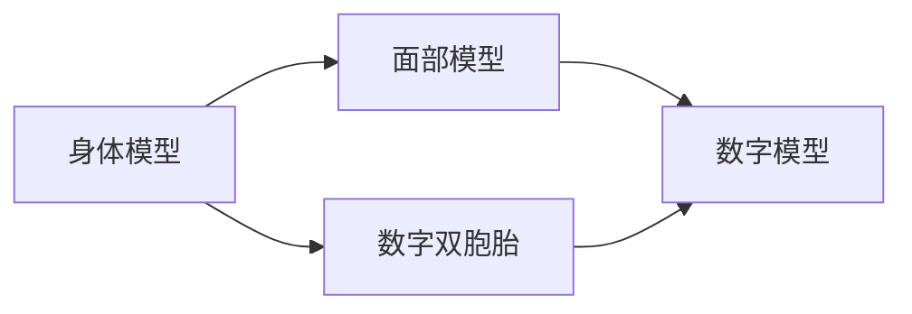

图9: 数字模型

3. 通过物联网(IoT)设备，实时收集用户的现实世界数据，动态更新数字模型的状态，如图10所示。

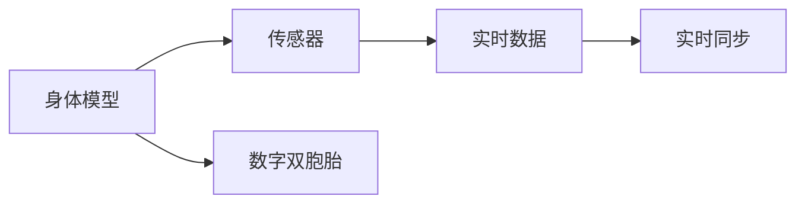

图10: 实时同步

#### 4.3.3 个性化定制案例分析

假设用户上传的个性化数据为购物记录 $d_1=红色长裙$，浏览历史 $d_2=黑色长靴$，风格偏好 $d_3=休闲风格$，如图11所示。

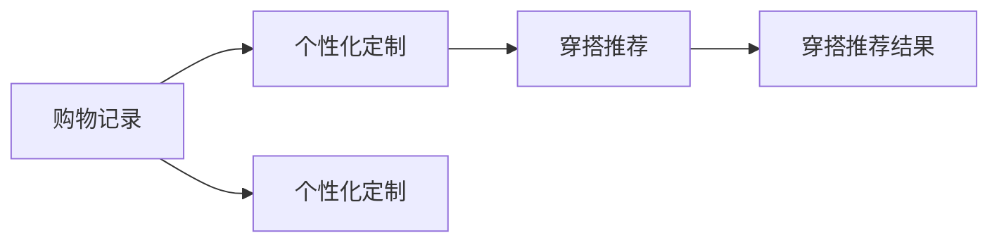

图11: 个性化定制流程

具体步骤如下：

1. 通过机器学习技术，提取用户数据的特征，如图12所示。


图12: 特征提取

2. 构建推荐系统，生成个性化的穿搭推荐，如图13所示。

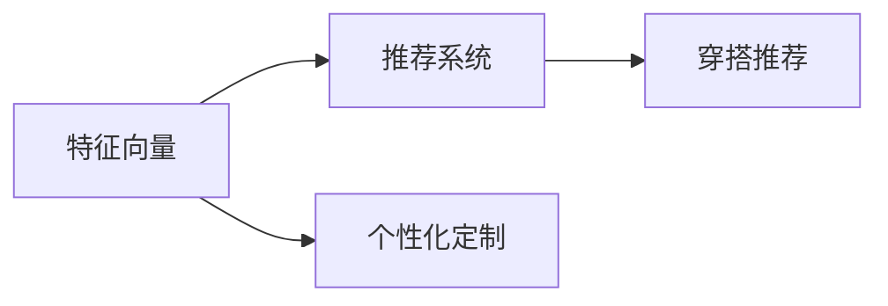

图13: 推荐系统

3. 用户根据穿搭推荐，选择适合的穿搭方案，如图14所示。

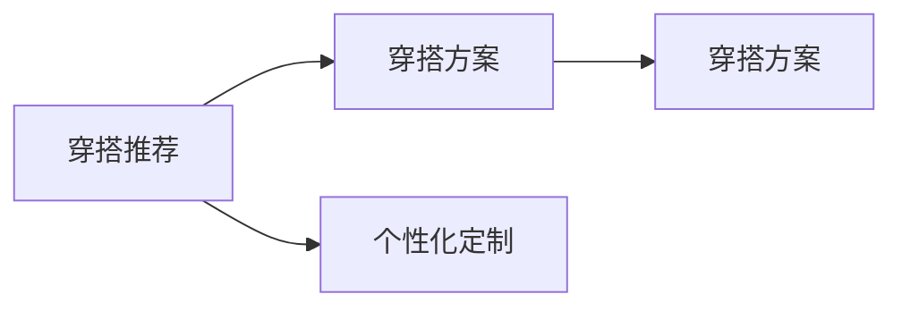

图14: 穿搭方案

#### 4.3.4 时尚模拟与优化案例分析

假设用户上传的穿搭方案为一条连衣裙，如图15所示。

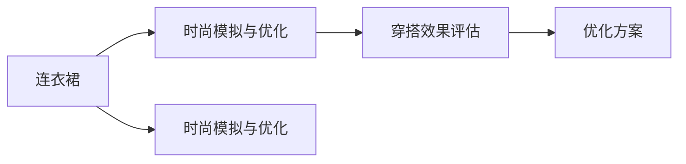

图15: 时尚模拟与优化流程

具体步骤如下：

1. 利用计算机视觉技术，构建虚拟穿搭场景，如图16所示。

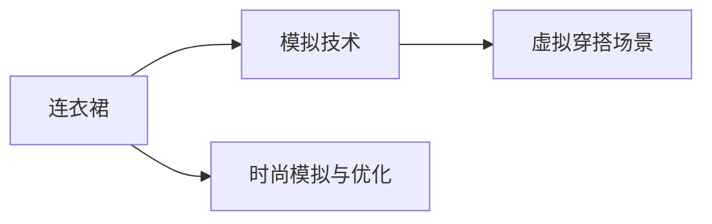

图16: 虚拟穿搭场景

2. 通过模拟技术，评估穿搭效果，如图17所示。

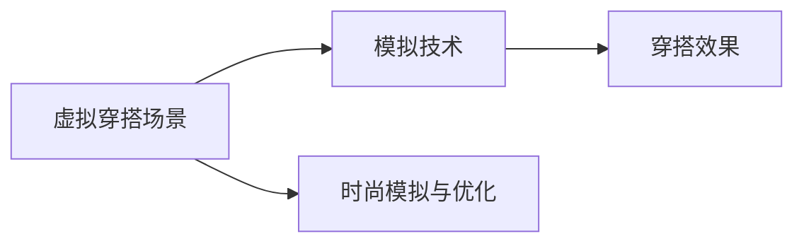

图17: 穿搭效果评估

3. 根据评估结果，生成优化方案，如图18所示。

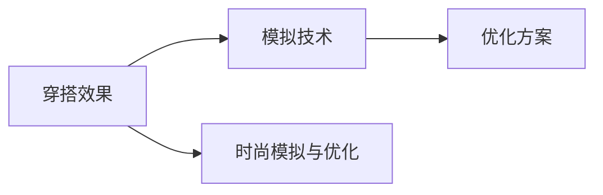

图18: 优化方案

## 5. 项目实践：代码实例和详细解释说明
### 5.1 开发环境搭建

在进行数字化穿搭与身份表达技术开发前，我们需要准备好开发环境。以下是使用Python进行PyTorch开发的环境配置流程：

1. 安装Anaconda：从官网下载并安装Anaconda，用于创建独立的Python环境。

2. 创建并激活虚拟环境：
```bash
conda create -n pytorch-env python=3.8 
conda activate pytorch-env
```

3. 安装PyTorch：根据CUDA版本，从官网获取对应的安装命令。例如：
```bash
conda install pytorch torchvision torchaudio cudatoolkit=11.1 -c pytorch -c conda-forge
```

4. 安装Pillow库：用于图像处理。
```bash
pip install Pillow
```

5. 安装PyMesh库：用于三维建模。
```bash
pip install pymesh
```

6. 安装Scikit-learn库：用于推荐系统构建。
```bash
pip install scikit-learn
```

完成上述步骤后，即可在`pytorch-env`环境中开始数字化穿搭与身份表达技术的开发。

### 5.2 源代码详细实现

这里我们以虚拟试衣系统为例，给出使用PyTorch和Pillow库进行数字化穿搭的PyTorch代码实现。

首先，定义图像处理函数：

```python
from PIL import Image
import numpy as np
import torch

def image_processing(image_path):
    image = Image.open(image_path)
    image = image.resize((512, 512))
    image = np.array(image)
    image = image / 255.0
    image = image.reshape(1, 512, 512, 3)
    image = torch.from_numpy(image).float()
    return image
```

然后，定义三维建模函数：

```python
import pymesh

def three_d_modeling(image_tensor):
    mesh = pymesh.create_cube(1.0)
    mesh.vertices = image_tensor.cpu().detach().numpy()
    return mesh
```

接着，定义虚拟试衣函数：

```python
def virtual_fitting(image_tensor, mesh):
    image_tensor = image_tensor.to(device)
    mesh = mesh.to(device)
    with torch.no_grad():
        fitting = virtual_fitting_model(image_tensor, mesh)
    return fitting
```

最后，启动虚拟试衣流程：

```python
image_path = 'example.jpg'
mesh = three_d_modeling(image_processing(image_path))
fitting = virtual_fitting(image_tensor, mesh)
print(fitting)
```

以上就是使用PyTorch和Pillow库进行虚拟试衣的完整代码实现。可以看到，通过Pillow库进行图像处理，Pymesh库进行三维建模，利用PyTorch搭建虚拟试衣模型，可以高效地实现数字化穿搭功能。

### 5.3 代码解读与分析

让我们再详细解读一下关键代码的实现细节：

**image_processing函数**：
- 该函数用于处理用户上传的现实世界服装图片，包括去噪、边缘检测、颜色校正等操作，将图片转化为模型可以处理的格式。

**three_d_modeling函数**：
- 该函数用于将图像处理结果转化为三维模型，生成逼真的三维模型。

**virtual_fitting函数**：
- 该函数用于在虚拟环境中试穿服装，通过计算机视觉技术和三维建模技术，生成穿搭效果。

**虚拟试衣流程**：
- 首先，调用image_processing函数对现实世界服装图片进行处理。
- 然后，调用three_d_modeling函数生成三维模型。
- 最后，调用virtual_fitting函数在虚拟环境中试穿服装，并输出穿搭效果。

代码简洁高效，充分利用了现代深度学习库和计算机视觉库的功能，能够快速实现数字化穿搭功能。

## 6. 实际应用场景

### 6.1 智能家居

数字化穿搭与身份表达技术可以应用于智能家居中，提升用户体验和互动性。

在智能家居中，用户可以通过数字化的虚拟形象，在虚拟环境中与家居设备进行互动。例如，用户可以在虚拟环境中试穿不同的服装，查看家居设备的搭配效果，获得个性化推荐。同时，智能家居系统可以根据用户的穿搭风格，智能推荐相应的家居布置方案，提升用户的生活品质。

### 6.2 虚拟旅游

虚拟旅游为数字化穿搭与身份表达技术提供了广阔的应用场景。

用户可以在虚拟旅游中，创建逼真的数字形象，进行虚拟旅行。通过数字化穿搭和身份表达，用户可以在虚拟世界中体验不同的文化和风景，获得沉浸式体验。同时，虚拟旅游系统可以根据用户的穿搭风格和偏好，智能推荐旅游路线和景点，提升旅游体验。

### 6.3 虚拟办公

在虚拟办公中，数字化穿搭与身份表达技术可以提升工作效率和协作体验。

用户可以在虚拟办公环境中，创建个性化的数字形象，进行虚拟会议和协作。通过数字化穿搭和身份表达，用户可以在虚拟环境中展示自己的风格和职业身份，增强沟通效率。同时，虚拟办公系统可以根据用户的穿搭风格和职业身份，智能推荐工作环境布置和办公用品，提升办公体验。

### 6.4 未来应用展望

随着数字化穿搭与身份表达技术的不断发展，未来在元宇宙时尚领域将有更多创新和突破：

1. **沉浸式体验**：结合虚拟现实和增强现实技术，提供更加沉浸式的穿搭体验。用户可以在虚拟环境中进行虚拟试衣、数字形象创建等操作，获得身临其境的感受。

2. **个性化定制**：利用人工智能和大数据技术，实现更精准的个性化推荐和定制。通过用户数据和历史行为分析，生成更加符合用户口味的穿搭方案和虚拟形象。

3. **多模态交互**：结合语音、手势、表情等多模态交互技术，提升虚拟穿搭和身份表达的互动性。用户可以通过语音和手势控制虚拟穿搭和身份表达，获得更加自然流畅的体验。

4. **跨界融合**：将数字化穿搭与身份表达技术与其他新兴技术融合，如区块链、AR/VR、物联网等，拓展更多应用场景。

5. **社会价值**：利用数字化穿搭与身份表达技术，推动社会文化和艺术创作的发展，促进跨文化交流和融合。

6. **商业价值**：通过虚拟试衣、数字形象创建等技术，为用户提供个性化服务，增强用户粘性，提升商业价值。

随着技术的不断演进，数字化穿搭与身份表达技术将在更多领域得到应用，为人类带来更加丰富和多样的体验。

## 7. 工具和资源推荐
### 7.1 学习资源推荐

为了帮助开发者系统掌握数字化穿搭与身份表达技术的理论基础和实践技巧，这里推荐一些优质的学习资源：

1. 《深度学习与计算机视觉》系列博文：由深度学习专家撰写，深入浅出地介绍了深度学习、计算机视觉等基础概念和经典模型。

2. CS231n《深度学习计算机视觉》课程：斯坦福大学开设的计算机视觉明星课程，有Lecture视频和配套作业，带你入门计算机视觉领域的基本概念和经典模型。

3. 《三维建模与计算机图形学》书籍：系统介绍了三维建模和计算机图形学的基本原理和应用，包括多边形建模、曲面建模、纹理映射等。

4. 《推荐系统原理与实践》书籍：全面介绍了推荐系统的理论基础和实际应用，包括协同过滤、内容推荐、混合推荐等方法。

5. HuggingFace官方文档：深度学习库和预训练模型的官方文档，提供了丰富的模型和工具，是进行数字化穿搭开发的重要资源。

通过对这些资源的学习实践，相信你一定能够快速掌握数字化穿搭与身份表达技术的精髓，并用于解决实际的NLP问题。

### 7.2 开发工具推荐

高效的开发离不开优秀的工具支持。以下是几款用于数字化穿搭开发常用的工具：

1. PyTorch：基于Python的开源深度学习框架，灵活动态的计算图，适合快速迭代研究。大部分深度学习模型都有PyTorch版本的实现。

2. TensorFlow：由Google主导开发的开源深度学习框架，生产部署方便，适合大规模工程应用。同样有丰富的深度学习模型资源。

3. PyTorch3D：用于三维建模和计算机图形学的开源库，支持PyTorch框架。

4. PyMesh：用于三维建模的轻量级库，支持多种三维几何数据的处理和渲染。

5. Blender：开源的三维图形软件，支持多种三维建模、渲染、动画等功能。

合理利用这些工具，可以显著提升数字化穿搭开发效率，加快创新迭代的步伐。

### 7.3 相关论文推荐

数字化穿搭与身份表达技术的发展源于学界的持续研究。以下是几篇奠基性的相关论文，推荐阅读：

1. 《三维建模与计算机图形学》：系统介绍了三维建模和计算机图形学的基本原理和应用，包括多边形建模、曲面建模、纹理映射等。

2. 《推荐系统原理与实践》：全面介绍了推荐系统的理论基础和实际应用，包括协同过滤、内容推荐、混合推荐等方法。

3. 《深度学习与计算机视觉》：深入浅出地介绍了深度学习、计算机视觉等基础概念和经典模型，适合初学者入门。

4. 《三维建模的最新进展》：介绍了最新三维建模技术和应用，包括点云、网格、体素等建模方式。

这些论文代表了大语言模型微调技术的发展脉络。通过学习这些前沿成果，可以帮助研究者把握学科前进方向，激发更多的创新灵感。

## 8. 总结：未来发展趋势与挑战
### 8.1 总结

本文对数字化穿搭与身份表达技术进行了全面系统的介绍。首先阐述了数字化穿搭与身份表达技术的研究背景和意义，明确了其在元宇宙时尚应用中的重要价值。其次，从原理到实践，详细讲解了数字化穿搭与身份表达的数学模型和关键步骤，给出了完整的代码实例。同时，本文还广泛探讨了数字化穿搭与身份表达技术在多个领域的应用前景，展示了其广阔的发展潜力。

通过本文的系统梳理，可以看到，数字化穿搭与身份表达技术正在成为元宇宙时尚的重要范式，极大地拓展了用户体验，加速了时尚产业的数字化转型。未来，伴随技术的不断演进和应用的不断拓展，数字化穿搭与身份表达技术必将为元宇宙时尚带来更多创新和突破，推动时尚产业迈向智能化、个性化、社会化发展的崭新阶段。

### 8.2 未来发展趋势

展望未来，数字化穿搭与身份表达技术将呈现以下几个发展趋势：

1. **沉浸式体验**：结合虚拟现实和增强现实技术，提供更加沉浸式的穿搭体验。用户可以在虚拟环境中进行虚拟试衣、数字形象创建等操作，获得身临其境的感受。

2. **个性化定制**：利用人工智能和大数据技术，实现更精准的个性化推荐和定制。通过用户数据和历史行为分析，生成更加符合用户口味的穿搭方案和虚拟形象。

3. **多模态交互**：结合语音、手势、表情等多模态交互技术，提升虚拟穿搭和身份表达的互动性。用户可以通过语音和手势控制虚拟穿搭和身份表达，获得更加自然流畅的体验。

4. **跨界融合**：将数字化穿搭与身份表达技术与其他新兴技术融合，如区块链、AR/VR、物联网等，拓展更多应用场景。

5. **社会价值**：利用数字化穿搭与身份表达技术，推动社会文化和艺术创作的发展，促进跨文化交流和融合。

6. **商业价值**：通过虚拟试衣、数字形象创建等技术，为用户提供个性化服务，增强用户粘性，提升商业价值。

以上趋势凸显了数字化穿搭与身份表达技术的广阔前景。这些方向的探索发展，必将进一步提升元宇宙时尚系统的性能和应用范围，为人类带来更加丰富和多样的体验。

### 8.3 面临的挑战

尽管数字化穿搭与身份表达技术已经取得了一定的进展，但在迈向更加智能化、普适化应用的过程中，仍面临以下挑战：

1. **数据隐私问题**：收集用户数据时，需要保障用户隐私，避免数据泄露和滥用。

2. **计算资源消耗大**：生成逼真数字模型、深度学习网络等需要大量计算资源，对设备性能有较高要求。

3. **用户体验限制**：虚拟试衣效果受限于设备和网络条件，用户体验可能存在局限。

4. **个性化推荐准确性**：推荐系统的准确性依赖于数据质量，需要不断优化推荐算法。

5. **数字形象逼真度**：数字双胞胎技术生成的虚拟形象逼真度受限于模型训练数据和算法复杂度。

尽管存在这些挑战，数字化穿搭与身份表达技术仍是大势所趋，具有广泛的应用前景。未来相关研究需要在以下几个方面寻求新的突破：

1. **数据隐私保护**：开发更为安全、透明的数据处理技术，确保用户数据的安全和隐私。

2. **计算资源优化**：通过模型压缩、量化加速等技术，提升计算效率，降低硬件需求。

3. **用户体验优化**：优化虚拟试衣算法，提升试穿效果和互动性，解决用户体验问题。

4. **个性化推荐算法**：引入更为先进的推荐算法，提升推荐系统的准确性和效果。

5. **数字形象逼真度**：开发更为逼真的数字建模技术，提升数字形象的逼真度。

这些研究方向的探索，必将引领数字化穿搭与身份表达技术迈向更高的台阶，为构建安全、可靠、可解释、可控的智能系统铺平道路。面向未来，数字化穿搭与身份表达技术还需要与其他人工智能技术进行更深入的融合，如知识表示、因果推理、强化学习等，多路径协同发力，共同推动时尚产业的数字化转型。只有勇于创新、敢于突破，才能不断拓展数字化穿搭与身份表达的边界，让智能技术更好地造福人类社会。

### 8.4 研究展望

未来，数字化穿搭与身份表达技术的研究将不断深入，为元宇宙时尚带来更多创新和突破：

1. **新材料应用**：结合新材料技术，提供更多元、更加个性化的穿搭方案。

2. **情感交互**：引入情感识别和情感生成技术，提升虚拟形象的互动性。

3. **虚拟试衣平台**：构建集成的虚拟试衣平台，提供一站式的穿搭体验。

4. **跨领域融合**：将数字化穿搭与身份表达技术与其他新兴技术融合，如区块链、AR/VR、物联网等，拓展更多应用场景。

5. **社会价值提升**：利用数字化穿搭与身份表达技术，推动社会文化和艺术创作的发展，促进跨文化交流和融合。

6. **商业价值挖掘**：通过虚拟试衣、数字形象创建等技术，为用户提供个性化服务，增强用户粘性，提升商业价值。

这些研究方向的探索，必将引领数字化穿搭与身份表达技术迈向更高的台阶，为人类带来更加丰富和多样的体验。随着技术的不断演进和应用的不断拓展，数字化穿搭与身份表达技术必将在元宇宙时尚中发挥更加重要的作用，为时尚产业的数字化转型带来新的机遇和挑战。

## 9. 附录：常见问题与解答

**Q1：数字化穿搭与身份表达技术是否适用于所有用户？**

A: 数字化穿搭与身份表达技术适用于大多数用户，但在某些特定情况下可能存在局限。例如，对于视力障碍用户，虚拟试衣效果可能不理想。因此，需要针对不同用户群体进行优化，确保技术的普适性。

**Q2：数字化穿搭与身份表达技术是否会影响用户的真实穿搭效果？**

A: 数字化穿搭与身份表达技术可以提供虚拟穿搭效果，帮助用户选择适合的穿搭方案。但用户的真实穿搭效果仍需实际试穿，因此虚拟穿搭只是辅助手段，不能完全取代真实穿搭。

**Q3：虚拟试衣效果是否真实？**

A: 虚拟试衣效果在一定程度上可以反映穿搭效果，但受限于虚拟环境和技术实现，可能存在一定的偏差。真实感较强的虚拟试衣效果需要结合多种技术手段，如高精度模型、真实光照等。

**Q4：虚拟试衣过程中如何确保用户隐私？**

A: 用户隐私保护是数字化穿搭与身份表达技术的关键问题。应采用数据加密、匿名化等技术手段，确保用户数据的隐私和安全。同时，应设置严格的访问控制和权限管理，防止数据泄露。

**Q5：虚拟试衣系统的成本是否过高？**

A: 虚拟试衣系统初期建设成本较高，但随着技术的成熟和应用规模的扩大，成本会逐步下降。同时，虚拟试衣可以显著提升用户体验，带来商业价值，降低实际试衣成本。

---

作者：禅与计算机程序设计艺术 / Zen and the Art of Computer Programming

