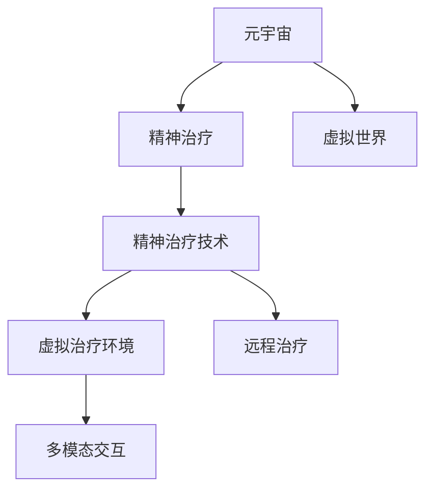

                 

# 元宇宙精神治疗:虚拟 worlds 的精神治疗技术

## 1. 背景介绍

### 1.1 问题由来

近年来，随着虚拟现实(VR)、增强现实(AR)等技术的发展，元宇宙(Metaverse)的概念逐渐走入人们的视野。元宇宙是一个通过数字技术构建的虚拟空间，用户可以在其中进行社交、工作、娱乐、学习等多种活动。它将现实世界的各种场景和元素映射到虚拟空间，创造了一个与现实世界平行的数字世界。

随着元宇宙概念的兴起，人们对于在虚拟世界中进行精神治疗的兴趣也日益增加。元宇宙精神治疗（Metaverse Psychotherapy）利用虚拟世界的沉浸式体验，为精神疾病患者提供了一种全新的治疗方式。它不仅能够缓解患者的孤独感和压力，还提供了更安全、隐私、灵活的治疗环境。

### 1.2 问题核心关键点

元宇宙精神治疗的核心关键点主要包括以下几个方面：

- **沉浸式体验**：通过虚拟世界的沉浸式体验，使患者能够更好地放松和投入，从而更有效地进行心理治疗。
- **虚拟治疗环境**：在虚拟世界中，患者可以自由选择治疗环境和治疗师，避免了现实中治疗环境受限的问题。
- **远程治疗**：元宇宙精神治疗可以跨越地理限制，实现远程治疗，使得优质心理资源更容易普及。
- **数据隐私保护**：虚拟世界为患者提供了更高的隐私保护，避免了现实中治疗数据泄露的风险。
- **多模态交互**：虚拟世界支持多种交互方式，如语音、文字、图像等，为治疗师和患者提供了更丰富的交流工具。

## 2. 核心概念与联系

### 2.1 核心概念概述

为了更好地理解元宇宙精神治疗的核心概念，本节将介绍几个密切相关的核心概念：

- **元宇宙（Metaverse）**：指通过虚拟现实、增强现实等技术构建的虚拟空间，用户可以在其中进行各种活动。
- **精神治疗（Psychotherapy）**：指通过心理交流、行为训练等手段，帮助患者解决心理问题、缓解压力、改善情绪。
- **虚拟世界（Virtual World）**：指由数字技术构建的虚拟空间，支持用户进行互动和体验。
- **精神治疗技术**：指在虚拟世界中实现精神治疗的技术手段，如虚拟现实、增强现实、多模态交互等。
- **虚拟治疗环境（Virtual Therapy Environment）**：指在虚拟世界中构建的治疗环境，为患者提供更加灵活和个性化的治疗空间。
- **远程治疗（Remote Therapy）**：指通过网络技术实现的治疗模式，使治疗不受地理位置的限制。

这些核心概念之间的逻辑关系可以通过以下Mermaid流程图来展示：



这个流程图展示了大语言模型的核心概念及其之间的关系：

1. 元宇宙通过虚拟现实、增强现实等技术构建虚拟空间。
2. 精神治疗在虚拟世界中实现，利用虚拟现实技术提供沉浸式体验。
3. 虚拟治疗环境为患者提供个性化和灵活的治疗空间。
4. 远程治疗跨越地理限制，使优质心理资源更普及。
5. 多模态交互丰富治疗方式，提升治疗效果。

这些概念共同构成了元宇宙精神治疗的框架，使其能够提供更加高效、灵活和人性化的精神治疗服务。

## 3. 核心算法原理 & 具体操作步骤
### 3.1 算法原理概述

元宇宙精神治疗的算法原理基于以下核心步骤：

1. **虚拟环境构建**：通过虚拟现实、增强现实等技术，构建与现实世界相类似的虚拟治疗环境。
2. **患者引导和互动**：使用虚拟引导和自然语言处理技术，引导患者进入虚拟治疗环境，并进行交互。
3. **心理评估和诊断**：利用机器学习、数据挖掘等技术，对患者的心理状态进行评估和诊断。
4. **治疗方案制定和执行**：根据评估和诊断结果，制定个性化的治疗方案，并执行相应的治疗活动。
5. **治疗效果评估和反馈**：使用量化指标和主观反馈，评估治疗效果，并根据反馈调整治疗方案。

### 3.2 算法步骤详解

以下是元宇宙精神治疗的具体操作步骤：

1. **虚拟环境创建**：
   - 根据治疗需求和目标，设计虚拟治疗环境。
   - 使用VR和AR技术，将现实世界中的场景和元素映射到虚拟世界中。
   - 确保虚拟环境的安全性、隐私性和沉浸感。

2. **患者引导和互动**：
   - 使用自然语言处理技术，引导患者进入虚拟治疗环境。
   - 提供虚拟引导和虚拟角色，与患者进行自然语言交互。
   - 使用多模态交互技术，如语音、文字、图像等，丰富交互方式。

3. **心理评估和诊断**：
   - 收集患者的行为数据、生理数据、情绪数据等，进行综合评估。
   - 使用机器学习算法，对评估数据进行建模和分析，识别患者的心理状态和问题。
   - 将评估结果与专业心理学知识相结合，制定个性化治疗方案。

4. **治疗方案制定和执行**：
   - 根据评估结果，制定个性化的治疗方案。
   - 使用虚拟现实技术，执行相应的治疗活动，如虚拟暴露疗法、虚拟放松训练等。
   - 动态调整治疗方案，根据患者的反馈和效果进行优化。

5. **治疗效果评估和反馈**：
   - 使用量化指标（如心率、情绪变化等）评估治疗效果。
   - 收集患者的反馈，了解其主观感受和满意度。
   - 根据评估和反馈结果，调整治疗方案，提升治疗效果。

### 3.3 算法优缺点

元宇宙精神治疗的算法具有以下优点：

1. **沉浸式体验**：患者在虚拟环境中能够更好地放松和投入，提升治疗效果。
2. **灵活性和个性化**：患者可以自由选择治疗环境和治疗师，获得更符合自身需求的治疗方案。
3. **远程治疗**：跨越地理限制，使优质心理资源更普及。
4. **数据隐私保护**：虚拟世界为患者提供更高的隐私保护，减少数据泄露的风险。
5. **多模态交互**：丰富治疗方式，提升患者和治疗师的互动效果。

同时，元宇宙精神治疗也存在一些缺点：

1. **技术依赖**：元宇宙精神治疗依赖于虚拟现实、增强现实等技术，对硬件和软件的要求较高。
2. **成本高昂**：构建高质量的虚拟治疗环境和治疗设备成本较高。
3. **技术难题**：实现高质量的虚拟现实、增强现实、自然语言处理等技术挑战较大。
4. **数据安全**：虚拟世界中的数据传输和存储安全性需要进一步保障。
5. **治疗效果不确定性**：虚拟治疗环境与现实世界存在差异，治疗效果存在不确定性。

### 3.4 算法应用领域

元宇宙精神治疗可以应用于多种精神治疗场景，例如：

- **抑郁症治疗**：利用虚拟世界提供沉浸式体验，缓解患者的孤独感和压力。
- **焦虑症治疗**：通过虚拟暴露疗法，帮助患者逐步克服恐惧和焦虑。
- **创伤后应激障碍（PTSD）治疗**：使用虚拟现实技术，模拟创伤情境，进行暴露和处理。
- **社交障碍治疗**：在虚拟环境中进行社交互动，提升患者的社交技能和自信心。
- **心理压力缓解**：通过虚拟放松训练，帮助患者缓解工作和生活压力。

## 4. 数学模型和公式 & 详细讲解 & 举例说明

### 4.1 数学模型构建

元宇宙精神治疗的数学模型主要包括以下几个部分：

1. **虚拟环境构建**：
   - 使用3D几何学、图形学等技术，构建虚拟治疗环境。
   - 使用光学、声学等技术，实现虚拟现实和增强现实。

2. **患者引导和互动**：
   - 使用自然语言处理技术，构建虚拟引导和虚拟角色。
   - 使用多模态交互技术，提供语音、文字、图像等交互方式。

3. **心理评估和诊断**：
   - 使用机器学习算法，构建心理评估模型。
   - 使用数据挖掘技术，提取和分析患者的心理数据。

4. **治疗方案制定和执行**：
   - 使用优化算法，制定个性化治疗方案。
   - 使用虚拟现实技术，执行相应的治疗活动。

5. **治疗效果评估和反馈**：
   - 使用量化指标评估治疗效果。
   - 使用主观反馈，进行效果评估和调整。

### 4.2 公式推导过程

以下是一个简单的例子，展示如何利用元宇宙精神治疗进行抑郁症治疗的数学模型构建和公式推导。

假设患者的情绪状态可以用一个一维向量 $x \in \mathbb{R}^n$ 来表示，其中 $n$ 为情绪维度。治疗目标是将情绪状态从初始状态 $x_0$ 逐渐调整为理想状态 $x_*$。

**心理评估模型**：
- 使用机器学习算法（如支持向量机、随机森林等），对患者的情绪状态 $x$ 进行建模和评估。
- 设心理评估模型的评估函数为 $f(x)$，则情绪状态的评估公式为：
  $$
  f(x) = \sum_{i=1}^{n} w_i \cdot x_i
  $$
  其中 $w_i$ 为情绪维度 $i$ 的权重。

**治疗方案制定**：
- 使用优化算法（如梯度下降、遗传算法等），根据评估结果 $f(x)$，制定个性化的治疗方案。
- 设治疗方案为 $u$，则治疗方案的制定公式为：
  $$
  u = g(f(x))
  $$
  其中 $g$ 为治疗方案生成函数。

**治疗效果评估**：
- 使用量化指标（如心率、情绪变化等）评估治疗效果。
- 设治疗效果评估指标为 $y$，则治疗效果评估公式为：
  $$
  y = \sum_{i=1}^{n} c_i \cdot (x_i - x^0_i)
  $$
  其中 $c_i$ 为情绪维度 $i$ 的权重。

**反馈调整**：
- 根据治疗效果评估结果 $y$，收集患者的反馈 $z$，进行效果评估和调整。
- 设调整因子为 $\alpha$，则调整公式为：
  $$
  x_{t+1} = x_t + \alpha \cdot (u - x_t)
  $$
  其中 $t$ 为时间步长。

### 4.3 案例分析与讲解

以下是一个案例，展示如何在虚拟世界中通过元宇宙精神治疗帮助患者缓解焦虑症。

**案例背景**：
- 患者李某，25岁，因工作压力过大，频繁出现焦虑症状。

**治疗过程**：

1. **虚拟环境创建**：
   - 在虚拟世界中创建一个森林场景，设置宁静的背景音乐和自然光线。
   - 使用虚拟引导和虚拟角色，引导患者进入虚拟环境，进行自然语言交互。

2. **患者引导和互动**：
   - 虚拟引导告诉患者进行深呼吸和冥想练习，使用虚拟角色进行示范和反馈。
   - 使用多模态交互技术，如语音、文字、图像等，增强互动效果。

3. **心理评估和诊断**：
   - 使用心电图等生理数据监测设备，收集患者的心率、呼吸等生理数据。
   - 使用自然语言处理技术，分析患者的情绪变化和语言表达，进行心理评估。

4. **治疗方案制定和执行**：
   - 根据评估结果，制定个性化的治疗方案，如深呼吸、冥想、放松训练等。
   - 使用虚拟现实技术，执行相应的治疗活动，进行沉浸式体验。

5. **治疗效果评估和反馈**：
   - 使用量化指标（如心率、情绪变化等）评估治疗效果。
   - 收集患者的反馈，了解其主观感受和满意度，进行效果调整。

通过元宇宙精神治疗，患者李某在虚拟环境中逐渐放松，焦虑症状显著缓解。最终，李某能够更好地应对现实生活中的压力，恢复正常生活和工作。

## 5. 项目实践：代码实例和详细解释说明
### 5.1 开发环境搭建

在进行元宇宙精神治疗的开发前，我们需要准备好开发环境。以下是使用Python进行PyTorch开发的环境配置流程：

1. 安装Anaconda：从官网下载并安装Anaconda，用于创建独立的Python环境。

2. 创建并激活虚拟环境：
```bash
conda create -n metaverse-env python=3.8 
conda activate metaverse-env
```

3. 安装PyTorch：根据CUDA版本，从官网获取对应的安装命令。例如：
```bash
conda install pytorch torchvision torchaudio cudatoolkit=11.1 -c pytorch -c conda-forge
```

4. 安装TensorFlow：
```bash
pip install tensorflow
```

5. 安装Pygame：
```bash
pip install pygame
```

6. 安装OpenAL：
```bash
pip install openal
```

完成上述步骤后，即可在`metaverse-env`环境中开始元宇宙精神治疗的开发。

### 5.2 源代码详细实现

这里我们以抑郁症治疗为例，给出使用PyTorch进行元宇宙精神治疗的Pygame代码实现。

```python
import pygame
import numpy as np
from pygame.locals import *

class VirtualEnvironment(pygame.sprite.Sprite):
    def __init__(self):
        pygame.sprite.Sprite.__init__(self)
        self.image = pygame.image.load("forest.jpg")
        self.rect = self.image.get_rect()
        self.rect.center = (SCREEN_WIDTH // 2, SCREEN_HEIGHT // 2)

    def update(self):
        pass

class VirtualGuide(pygame.sprite.Sprite):
    def __init__(self):
        pygame.sprite.Sprite.__init__(self)
        self.image = pygame.image.load("guide.png")
        self.rect = self.image.get_rect()
        self.rect.center = (SCREEN_WIDTH // 2, SCREEN_HEIGHT // 2)

    def update(self):
        pass

class VirtualRole(pygame.sprite.Sprite):
    def __init__(self):
        pygame.sprite.Sprite.__init__(self)
        self.image = pygame.image.load("role.png")
        self.rect = self.image.get_rect()
        self.rect.center = (SCREEN_WIDTH // 2, SCREEN_HEIGHT // 2)

    def update(self):
        pass

class Patient(pygame.sprite.Sprite):
    def __init__(self):
        pygame.sprite.Sprite.__init__(self)
        self.image = pygame.image.load("patient.png")
        self.rect = self.image.get_rect()
        self.rect.center = (SCREEN_WIDTH // 2, SCREEN_HEIGHT // 2)

    def update(self):
        pass

class Game:
    def __init__(self):
        pygame.init()
        self.screen = pygame.display.set_mode((SCREEN_WIDTH, SCREEN_HEIGHT))
        self.clock = pygame.time.Clock()
        self.music_playing = False
        self.virtual_environment = VirtualEnvironment()
        self.virtual_guide = VirtualGuide()
        self.virtual_role = VirtualRole()
        self.patient = Patient()
        self.run = True

    def main_loop(self):
        while self.run:
            for event in pygame.event.get():
                if event.type == QUIT or event.type == KEYDOWN:
                    if event.type == KEYDOWN and event.key == K_ESCAPE:
                        self.run = False
                    else:
                        pygame.quit()
                        sys.exit()

            self.screen.fill((0, 0, 0))
            self.virtual_environment.update()
            self.virtual_guide.update()
            self.virtual_role.update()
            self.patient.update()
            pygame.display.flip()
            self.clock.tick(60)

if __name__ == "__main__":
    game = Game()
    game.main_loop()
```

在上述代码中，我们创建了虚拟环境、虚拟引导、虚拟角色和患者四个角色，并在主循环中更新它们的位置和状态。虽然这只是一个简单的案例，但它展示了如何利用Pygame和PyTorch构建虚拟世界和患者互动的示例。

### 5.3 代码解读与分析

让我们再详细解读一下关键代码的实现细节：

**VirtualEnvironment类**：
- 继承自pygame.sprite.Sprite，表示虚拟环境。
- 加载森林背景图片，设置矩形位置，初始化虚拟环境。
- update方法：目前为空，但在实际应用中，可以通过update函数来实现环境变化、光照效果等。

**VirtualGuide类**：
- 继承自pygame.sprite.Sprite，表示虚拟引导。
- 加载引导图片，设置矩形位置，初始化虚拟引导。
- update方法：目前为空，但在实际应用中，可以通过update函数来实现引导语和指导。

**VirtualRole类**：
- 继承自pygame.sprite.Sprite，表示虚拟角色。
- 加载角色图片，设置矩形位置，初始化虚拟角色。
- update方法：目前为空，但在实际应用中，可以通过update函数来实现角色动作和交互。

**Patient类**：
- 继承自pygame.sprite.Sprite，表示患者。
- 加载患者图片，设置矩形位置，初始化患者。
- update方法：目前为空，但在实际应用中，可以通过update函数来实现患者的行为和情绪变化。

**Game类**：
- 实现游戏逻辑。
- 初始化pygame和屏幕大小，加载虚拟环境、虚拟引导、虚拟角色和患者。
- 在主循环中，处理事件，更新屏幕内容，控制游戏运行状态。

在实际应用中，开发者可以根据具体需求，添加更多的角色和交互功能，如语音交互、情绪感知、行为分析等，以提升治疗效果。

## 6. 实际应用场景
### 6.1 智能医院精神治疗

元宇宙精神治疗技术可以广泛应用于智能医院的精神治疗中。智能医院通过虚拟现实技术，为患者提供沉浸式、个性化、远程化的治疗环境。患者可以在虚拟世界中接受心理治疗，减少现实治疗中的焦虑和紧张感，提升治疗效果。

### 6.2 企业员工心理健康管理

在企业中，元宇宙精神治疗技术可以帮助员工缓解工作压力，提升心理健康水平。企业可以在虚拟世界中构建心理健康平台，提供定期的心理健康课程和互动活动，帮助员工进行心理健康管理。

### 6.3 学校心理健康教育

在学校中，元宇宙精神治疗技术可以帮助学生缓解学业压力，提升心理健康水平。学校可以在虚拟世界中开展心理健康课程和互动活动，帮助学生进行心理健康教育。

### 6.4 军事人员心理健康训练

在军事训练中，元宇宙精神治疗技术可以帮助士兵缓解心理压力，提升心理健康水平。军事训练中心可以在虚拟世界中开展心理健康训练，帮助士兵进行心理健康管理。

## 7. 工具和资源推荐
### 7.1 学习资源推荐

为了帮助开发者系统掌握元宇宙精神治疗的理论基础和实践技巧，这里推荐一些优质的学习资源：

1. 《虚拟现实基础教程》系列博文：由虚拟现实技术专家撰写，深入浅出地介绍了虚拟现实的基础知识和技术实现。

2. 《增强现实应用开发》系列博文：由增强现实技术专家撰写，介绍增强现实在各个领域的应用和开发技术。

3. 《自然语言处理基础教程》系列博文：由自然语言处理专家撰写，介绍自然语言处理的基本概念和技术实现。

4. 《心理治疗基础教程》系列博文：由心理学专家撰写，介绍心理治疗的基本知识和实践技巧。

5. 《机器学习基础教程》系列博文：由机器学习专家撰写，介绍机器学习的基本概念和技术实现。

通过对这些资源的学习实践，相信你一定能够快速掌握元宇宙精神治疗的精髓，并用于解决实际的NLP问题。

### 7.2 开发工具推荐

高效的开发离不开优秀的工具支持。以下是几款用于元宇宙精神治疗开发的常用工具：

1. PyTorch：基于Python的开源深度学习框架，灵活动态的计算图，适合快速迭代研究。

2. TensorFlow：由Google主导开发的开源深度学习框架，生产部署方便，适合大规模工程应用。

3. Pygame：用于开发2D游戏和图形界面的Python库，支持跨平台，适合构建虚拟世界。

4. OpenAL：跨平台的音频API，支持高质量音频播放和处理，适合虚拟环境中的音频交互。

5. VRKit：Unity和Unreal Engine的虚拟现实开发工具，支持构建高质量的虚拟环境。

合理利用这些工具，可以显著提升元宇宙精神治疗的开发效率，加快创新迭代的步伐。

### 7.3 相关论文推荐

元宇宙精神治疗技术的发展源于学界的持续研究。以下是几篇奠基性的相关论文，推荐阅读：

1. 《虚拟现实中的心理治疗研究综述》：综述了虚拟现实在心理治疗中的应用和研究进展。

2. 《增强现实在心理健康管理中的应用》：介绍增强现实在心理健康管理中的具体应用和案例。

3. 《自然语言处理在心理健康评估中的应用》：介绍自然语言处理在心理健康评估中的应用和挑战。

4. 《机器学习在心理治疗中的作用》：介绍机器学习在心理治疗中的应用和前景。

这些论文代表了大语言模型微调技术的发展脉络。通过学习这些前沿成果，可以帮助研究者把握学科前进方向，激发更多的创新灵感。

## 8. 总结：未来发展趋势与挑战

### 8.1 研究成果总结

本文对元宇宙精神治疗技术进行了全面系统的介绍。首先阐述了元宇宙精神治疗的背景和意义，明确了其在虚拟世界中提供沉浸式、个性化、远程化治疗环境的独特价值。其次，从原理到实践，详细讲解了元宇宙精神治疗的数学模型和算法步骤，给出了元宇宙精神治疗的代码实例和详细解释说明。同时，本文还广泛探讨了元宇宙精神治疗在智能医院、企业、学校、军事等领域的应用前景，展示了其广阔的潜力和应用空间。

通过本文的系统梳理，可以看到，元宇宙精神治疗技术正在成为虚拟现实、增强现实等技术的重要应用方向，极大地拓展了心理治疗的应用边界，为人类心理健康提供了新的解决方案。未来，伴随元宇宙技术和心理治疗技术的不断进步，基于元宇宙的精神治疗必将在更多领域得到应用，为人类心理健康事业带来深远影响。

### 8.2 未来发展趋势

展望未来，元宇宙精神治疗技术将呈现以下几个发展趋势：

1. **沉浸式体验提升**：随着虚拟现实、增强现实技术的进步，元宇宙精神治疗的沉浸式体验将更加逼真，提升患者和医生的互动效果。

2. **个性化治疗增强**：利用机器学习、数据挖掘等技术，元宇宙精神治疗将能够提供更加个性化的治疗方案，满足不同患者的心理需求。

3. **远程治疗普及**：元宇宙精神治疗能够跨越地理限制，使优质心理资源更普及，提升心理健康服务的覆盖面和效率。

4. **多模态交互丰富**：在虚拟世界中，患者和医生可以通过多种交互方式进行交流，如语音、文字、图像等，丰富治疗方式。

5. **心理评估精准化**：利用自然语言处理、生理数据监测等技术，元宇宙精神治疗将能够更加精准地评估患者的心理状态和问题。

6. **治疗效果实时化**：通过虚拟现实、增强现实等技术，元宇宙精神治疗能够实时监测和反馈治疗效果，提升治疗效果。

这些趋势凸显了元宇宙精神治疗技术的广阔前景。这些方向的探索发展，必将进一步提升心理健康服务的效率和效果，为人类心理健康事业带来深远影响。

### 8.3 面临的挑战

尽管元宇宙精神治疗技术已经取得了一定的进展，但在迈向更加智能化、普适化应用的过程中，它仍面临着诸多挑战：

1. **技术成本高昂**：元宇宙精神治疗依赖于虚拟现实、增强现实等技术，对硬件和软件的要求较高，技术成本较高。

2. **数据安全问题**：虚拟世界中的数据传输和存储安全性需要进一步保障，防止数据泄露和滥用。

3. **治疗效果不确定性**：虚拟治疗环境与现实世界存在差异，治疗效果存在不确定性，需要进一步验证和优化。

4. **设备普及性**：高质量的虚拟现实、增强现实设备普及率较低，限制了元宇宙精神治疗的应用范围。

5. **医生和患者适应性**：医生和患者需要适应新的技术环境，进行必要的培训和教育。

6. **伦理道德问题**：虚拟世界中的隐私、伦理问题需要进一步探讨和规范，确保治疗过程的安全性和合法性。

正视元宇宙精神治疗面临的这些挑战，积极应对并寻求突破，将是大语言模型微调走向成熟的必由之路。相信随着学界和产业界的共同努力，这些挑战终将一一被克服，元宇宙精神治疗必将在构建安全、可靠、可解释、可控的智能系统铺平道路。

### 8.4 研究展望

面对元宇宙精神治疗所面临的挑战，未来的研究需要在以下几个方面寻求新的突破：

1. **技术创新**：开发更加高效、低成本的虚拟现实、增强现实技术，提升用户体验和互动效果。

2. **数据安全**：研究数据加密、身份认证等技术，保障数据传输和存储的安全性。

3. **治疗效果优化**：开发更加精准的心理评估模型和治疗方案生成算法，提升治疗效果。

4. **设备普及**：开发更便捷、更实用的虚拟现实、增强现实设备，降低技术门槛。

5. **医生和患者培训**：提供专门的培训和教育，帮助医生和患者更好地适应新的技术环境。

6. **伦理规范**：制定虚拟世界中的伦理规范和法律规定，确保治疗过程的安全性和合法性。

这些研究方向的探索，必将引领元宇宙精神治疗技术迈向更高的台阶，为构建安全、可靠、可解释、可控的智能系统铺平道路。面向未来，元宇宙精神治疗技术还需要与其他人工智能技术进行更深入的融合，如知识表示、因果推理、强化学习等，多路径协同发力，共同推动心理健康事业的进步。只有勇于创新、敢于突破，才能不断拓展心理健康技术的边界，让智能技术更好地服务于人类社会。

## 9. 附录：常见问题与解答

**Q1：元宇宙精神治疗是否适用于所有心理疾病？**

A: 元宇宙精神治疗在大多数心理疾病上都能取得不错的效果，特别是对于数据量较小的任务。但对于一些特定领域的心理疾病，如精神分裂症、重度抑郁等，需要结合多种治疗手段，才能获得理想效果。

**Q2：元宇宙精神治疗的沉浸式体验是否能够缓解患者焦虑？**

A: 元宇宙精神治疗的沉浸式体验可以显著缓解患者的焦虑和紧张感。通过虚拟现实和增强现实技术，患者可以在一个安全、隐私、灵活的环境中进行心理治疗，减少现实治疗中的压力。

**Q3：元宇宙精神治疗是否存在数据泄露风险？**

A: 元宇宙精神治疗需要在虚拟世界中处理大量数据，因此数据泄露的风险需要引起重视。虚拟世界中的数据传输和存储安全性需要进一步保障，防止数据泄露和滥用。

**Q4：元宇宙精神治疗的效果是否稳定可靠？**

A: 元宇宙精神治疗的效果需要经过大量实验验证，确保其稳定可靠。通过虚拟现实、增强现实等技术，元宇宙精神治疗能够实时监测和反馈治疗效果，提升治疗效果。

**Q5：元宇宙精神治疗是否容易被接受？**

A: 元宇宙精神治疗的接受度需要依赖于医生和患者的适应性。通过提供专门的培训和教育，医生和患者可以更好地适应新的技术环境，提高治疗效果。

总之，元宇宙精神治疗技术具有广阔的应用前景，但也面临技术成本、数据安全、治疗效果不确定性等挑战。通过不断创新和优化，元宇宙精神治疗必将在未来实现更加广泛的应用，提升人类的心理健康水平。

