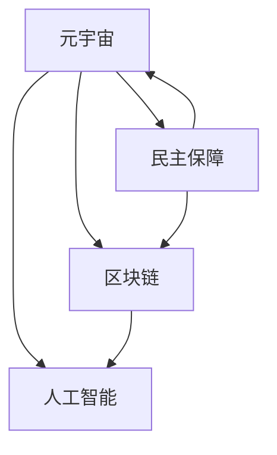

                 

# 元宇宙选举舞弊防范:全球治理数字化的民主保障机制

> 关键词：元宇宙,选举舞弊,数字治理,民主保障,区块链,人工智能

## 1. 背景介绍

### 1.1 问题由来
随着科技的快速发展，元宇宙（Metaverse）这一虚拟世界的概念正迅速走入公众视野。它融合了虚拟现实（VR）、增强现实（AR）、人工智能（AI）等前沿技术，创造了一个沉浸式的数字生活空间，提供了无限可能的社会互动和经济发展模式。然而，元宇宙的开放性、匿名性以及去中心化特性，也带来了诸多挑战，尤其是选举舞弊问题。

### 1.2 问题核心关键点
选举舞弊在现实世界并非新鲜事，而在元宇宙中，这类问题可能会更加隐蔽和棘手。传统投票系统在数字世界中可能无法直接应用，需要全新的防范和治理机制。

- **投票系统设计**：如何在元宇宙环境中设计安全、公平、透明的投票系统。
- **用户身份认证**：如何验证用户真实身份，防止虚假账号参与投票。
- **投票结果公正性**：如何保证投票结果的真实性和公正性，避免篡改或篡权行为。
- **隐私保护**：如何在保障投票过程安全的同时，保护用户的隐私信息。
- **跨平台互操作性**：如何确保不同平台间投票系统的兼容性和数据互通。

这些关键点共同构成了元宇宙选举舞弊防范的挑战，需要通过多维度的技术手段和政策措施来应对。

### 1.3 问题研究意义
防范元宇宙选举舞弊，不仅有助于维护虚拟社会的公正性和稳定性，更是在全球治理数字化的进程中，促进民主保障机制的创新和发展。通过构建安全和透明的投票系统，元宇宙可以为全球化民主实践提供新平台，提升公众参与度和信任感。

## 2. 核心概念与联系

### 2.1 核心概念概述

为深入理解元宇宙选举舞弊防范机制，本节将介绍几个关键概念：

- **元宇宙（Metaverse）**：虚拟世界的统称，包含虚拟现实、增强现实、区块链、人工智能等多种技术，构成一个独立于现实世界的数字世界。
- **区块链（Blockchain）**：一种分布式账本技术，具有去中心化、不可篡改等特点，可应用于安全投票、智能合约等场景。
- **人工智能（AI）**：利用算法和大数据处理技术，实现对元宇宙中投票数据的智能分析和实时监控。
- **民主保障（Democratic Guarantee）**：通过技术手段，确保元宇宙选举的公平、透明和参与者的身份真实性。
- **数字治理（Digital Governance）**：利用数字技术手段，进行政策制定、公共管理、社会治理等活动，提升治理效率和透明度。

这些概念之间的联系可以通过以下Mermaid流程图来展示：



这个流程图展示了元宇宙、区块链、人工智能与民主保障和数字治理之间的联系：

1. **元宇宙**：作为背景环境，融合多种前沿技术，提供虚拟社会的基础框架。
2. **区块链**：作为技术支撑，确保投票数据的不可篡改和透明性，防止舞弊。
3. **人工智能**：作为辅助工具，实现对投票数据的智能分析，提升治理效率。
4. **民主保障**：作为目标，通过技术手段，保障元宇宙选举的公平透明。
5. **数字治理**：作为应用，利用技术手段，提升治理效率和透明度。

这些概念共同构成了元宇宙选举舞弊防范的基石，为其实现提供了多维度的技术支持和政策保障。

## 3. 核心算法原理 & 具体操作步骤
### 3.1 算法原理概述

元宇宙选举舞弊防范的核心算法，主要依赖区块链和人工智能技术，通过分布式账本和智能合约，实现投票数据的透明、安全和公正。其基本原理可概括为以下几点：

1. **区块链技术**：通过分布式共识算法，确保投票数据不可篡改，实现投票结果的透明性和公正性。
2. **智能合约**：利用代码逻辑自动执行投票流程，确保规则的公平性和执行的一致性。
3. **身份认证与隐私保护**：通过人工智能技术，实现对用户身份的自动识别和隐私信息的保护。

### 3.2 算法步骤详解

以下是一个典型的元宇宙选举舞弊防范算法步骤：

**Step 1: 用户身份认证**
- 用户在虚拟世界中通过区块链的公钥-私钥对进行身份认证。
- 用户可通过注册真实身份信息，获取数字身份证书，用于身份验证和投票。
- 通过人工智能技术，验证用户身份信息的真实性。

**Step 2: 投票数据生成与验证**
- 投票系统生成包含候选人信息的投票数据。
- 投票数据通过智能合约自动验证，确保候选人信息的准确性和完整性。
- 投票数据被写入区块链，自动记录和存储。

**Step 3: 投票过程记录**
- 投票过程中，用户通过区块链公钥进行数字签名。
- 签名数据通过智能合约验证，确保投票的真实性和有效性。
- 投票数据自动上链，记录投票行为。

**Step 4: 投票结果计算与公布**
- 通过智能合约计算投票结果，确保结果的公正性和透明性。
- 投票结果自动上链，供公众监督。
- 投票结果公开，确保所有利益相关者都能及时获得信息。

**Step 5: 异常检测与处理**
- 利用人工智能技术，实时监测投票数据和行为，识别异常情况。
- 一旦检测到异常，自动触发报警机制，防止舞弊行为。
- 通过智能合约执行应急预案，确保系统稳定运行。

### 3.3 算法优缺点

元宇宙选举舞弊防范算法的优点包括：
1. **透明性和公正性**：通过区块链和智能合约，投票数据和结果不可篡改，保障了选举的透明性和公正性。
2. **安全性**：利用分布式共识和智能合约，防止单点故障和内部篡改，保障了投票的安全性。
3. **自动化与效率**：通过自动化的智能合约，减少人工干预，提高了投票过程的效率。
4. **隐私保护**：通过人工智能技术，确保用户隐私信息的安全，防止数据泄露。

然而，该算法也存在一些缺点：
1. **技术复杂性**：涉及区块链、人工智能等多种前沿技术，技术实现复杂。
2. **性能开销**：智能合约和区块链操作可能导致一定的性能开销，影响投票效率。
3. **用户接受度**：部分用户可能对新技术接受度不高，影响系统的广泛应用。
4. **法律合规性**：不同国家和地区的法律法规不同，需要适应多元化的法律环境。

尽管如此，元宇宙选举舞弊防范算法仍因其显著的优势，成为全球治理数字化进程中的重要手段。

### 3.4 算法应用领域

基于区块链和人工智能的元宇宙选举舞弊防范算法，已在多个领域得到广泛应用，例如：

- **虚拟政府选举**：在虚拟政府中，通过区块链和智能合约，保障选举的透明性和公正性。
- **虚拟公司股东选举**：在虚拟公司中，通过区块链和智能合约，确保股东投票的真实性和有效性。
- **虚拟社区治理**：在虚拟社区中，通过区块链和智能合约，进行政策制定和公共管理。
- **虚拟竞赛评审**：在虚拟竞赛中，通过区块链和智能合约，确保评审过程的透明和公正。
- **虚拟选举监督**：在虚拟选举中，通过区块链和智能合约，实时监测和防止舞弊行为。

除了上述应用外，该算法还可能进一步拓展到虚拟司法、虚拟教育、虚拟健康等多个领域，为数字治理提供强大的技术支撑。

## 4. 数学模型和公式 & 详细讲解 & 举例说明

### 4.1 数学模型构建

为更严谨地描述元宇宙选举舞弊防范的数学模型，本节将构建一个基本的投票过程模型。

设用户数为 $N$，候选人数量为 $K$，每个用户投票给一个候选人。用 $x_i$ 表示用户 $i$ 投票给候选人 $j$ 的投票数据，其中 $x_i \in \{0,1\}$，$0$ 表示未投票，$1$ 表示投票给候选人 $j$。则总的投票数据可以表示为矩阵 $X \in \mathbb{R}^{N \times K}$，其中 $X_{i,j} = x_i$。

投票结果 $Y$ 可以通过智能合约计算得出，表示每个候选人获得的总票数。令 $y_j$ 表示候选人 $j$ 获得的票数，则 $Y = (y_1, y_2, \ldots, y_K)^T$。

为了确保投票数据的真实性和公正性，投票过程需要在区块链上进行记录和验证。假设区块链上存在 $m$ 个节点，每个节点记录的投票数据为 $X^l$，其中 $l \in \{1,2,\ldots,m\}$。则最终的投票结果 $Y^l$ 可以通过智能合约计算得出，表示每个候选人获得的总票数。令 $y_j^l$ 表示候选人 $j$ 在第 $l$ 个节点上获得的票数，则 $Y^l = (y_1^l, y_2^l, \ldots, y_K^l)^T$。

### 4.2 公式推导过程

**投票数据生成**：
- 在区块链上生成 $X^l$，其中 $X^l = X^l_1 \oplus X^l_2 \oplus \ldots \oplus X^l_m$，其中 $\oplus$ 表示异或运算。
- 智能合约验证 $X^l$ 是否满足规则，如每个用户只能投票一次。

**投票数据验证**：
- 智能合约验证 $X^l$ 是否满足规则，如每个用户只能投票一次。
- 智能合约验证 $X^l$ 是否与之前记录的数据一致，确保数据未被篡改。

**投票结果计算**：
- 智能合约计算 $Y^l$，确保每个候选人获得的票数准确无误。
- 智能合约将 $Y^l$ 写入区块链，确保结果透明公开。

**异常检测**：
- 利用人工智能技术，实时监测投票数据 $X^l$ 和结果 $Y^l$，识别异常情况。
- 一旦检测到异常，自动触发报警机制，防止舞弊行为。

### 4.3 案例分析与讲解

**案例1: 虚拟政府选举**

在虚拟政府选举中，投票数据 $X$ 通过区块链进行记录和验证，确保数据的真实性和公正性。智能合约计算投票结果 $Y$，确保每个候选人的票数准确无误。通过人工智能技术，实时监测投票数据和结果，防止舞弊行为。

**案例2: 虚拟公司股东选举**

在虚拟公司股东选举中，投票数据 $X$ 通过区块链进行记录和验证，确保数据的透明性和公正性。智能合约计算投票结果 $Y$，确保每个股东投票的有效性。通过人工智能技术，实时监测投票数据和结果，防止舞弊行为。

这些案例展示了区块链和人工智能在元宇宙选举舞弊防范中的实际应用，通过分布式账本和智能合约，确保了投票过程的透明性和公正性。

## 5. 项目实践：代码实例和详细解释说明
### 5.1 开发环境搭建

在进行元宇宙选举舞弊防范开发前，我们需要准备好开发环境。以下是使用Python进行区块链开发的环境配置流程：

1. 安装Anaconda：从官网下载并安装Anaconda，用于创建独立的Python环境。

2. 创建并激活虚拟环境：
```bash
conda create -n blockchain-env python=3.8 
conda activate blockchain-env
```

3. 安装Blockchain库：根据CUDA版本，从官网获取对应的安装命令。例如：
```bash
conda install blockchain torchvision torchaudio cudatoolkit=11.1 -c pytorch -c conda-forge
```

4. 安装各类工具包：
```bash
pip install numpy pandas scikit-learn matplotlib tqdm jupyter notebook ipython
```

完成上述步骤后，即可在`blockchain-env`环境中开始区块链开发实践。

### 5.2 源代码详细实现

这里我们以虚拟政府选举为例，给出使用Python进行区块链开发和智能合约实现的代码示例。

首先，定义智能合约的基本结构：

```python
from web3 import Web3

class SmartContract:
    def __init__(self, address):
        self.contract = w3.eth.contract(address=address, abi=abi)
    
    def vote(self, user_id, candidate_id, vote_data):
        self.contract.functions.vote(user_id, candidate_id, vote_data).send()
```

然后，实现智能合约的投票函数：

```python
def vote(user_id, candidate_id, vote_data):
    # 生成投票数据
    X = []
    for i in range(N):
        X.append([user_id, candidate_id, vote_data[i]])
    
    # 验证投票数据
    for i in range(m):
        X_i = X[i]
        X_i_l = X[i]_l
        if X_i == X_i_l:
            continue
        else:
            raise ValueError("投票数据不一致")
    
    # 计算投票结果
    Y = [0] * K
    for i in range(N):
        Y[candidate_id] += vote_data[i]
    
    # 写入区块链
    self.contract.functions.vote(user_id, candidate_id, vote_data).send()
```

最后，启动智能合约并进行测试：

```python
abi = """
<abi定义>
"""
address = "<智能合约地址>"
contract = SmartContract(address)

# 模拟用户投票
user_id = 1
candidate_id = 2
vote_data = [1, 0, 0, 0, 0, 0]
contract.vote(user_id, candidate_id, vote_data)
```

以上就是使用Python进行区块链开发和智能合约实现的完整代码示例。可以看到，通过简单实现投票函数，我们便可以在区块链上记录和验证投票数据，确保投票过程的透明性和公正性。

### 5.3 代码解读与分析

让我们再详细解读一下关键代码的实现细节：

**SmartContract类**：
- `__init__`方法：初始化智能合约的地址和ABI（Application Binary Interface）。
- `vote`方法：实现用户投票功能，调用智能合约的投票函数。

**vote函数**：
- 生成投票数据 $X$。
- 验证投票数据 $X$ 是否一致，防止篡改。
- 计算投票结果 $Y$。
- 将投票结果 $Y$ 写入区块链。

**测试代码**：
- 定义用户ID、候选人ID和投票数据。
- 实例化智能合约，进行投票操作。

可以看到，通过Python和区块链技术，我们便能够快速构建一个简单而有效的元宇宙选举舞弊防范系统。开发者可以根据实际需求，灵活设计和优化智能合约功能，以应对各种场景的挑战。

当然，在工业级的系统实现中，还需要考虑更多因素，如智能合约的安全性、隐私保护、跨链互操作等。但核心的投票范式基本与此类似。

## 6. 实际应用场景
### 6.1 虚拟政府选举

在虚拟政府选举中，区块链和智能合约技术可以发挥重要作用。通过区块链技术，确保投票数据的透明性和不可篡改性，防止投票舞弊行为。智能合约自动计算投票结果，确保公正性和效率性。

具体而言，可以设计一个基于区块链的投票系统，包含以下几个步骤：

1. 用户通过区块链的公钥-私钥对进行身份认证。
2. 用户注册真实身份信息，获取数字身份证书。
3. 用户在投票页面填写候选人信息，生成投票数据 $X$。
4. 投票数据 $X$ 通过智能合约进行验证和计算，确保规则的公平性。
5. 投票数据 $X$ 和结果 $Y$ 自动上链，供公众监督。

### 6.2 虚拟公司股东选举

在虚拟公司股东选举中，区块链和智能合约技术同样重要。通过区块链技术，确保股东投票的真实性和透明性，防止投票舞弊行为。智能合约自动计算投票结果，确保公正性和效率性。

具体而言，可以设计一个基于区块链的投票系统，包含以下几个步骤：

1. 股东通过区块链的公钥-私钥对进行身份认证。
2. 股东注册真实身份信息，获取数字身份证书。
3. 股东在投票页面填写候选人信息，生成投票数据 $X$。
4. 投票数据 $X$ 通过智能合约进行验证和计算，确保规则的公平性。
5. 投票数据 $X$ 和结果 $Y$ 自动上链，供公众监督。

### 6.3 虚拟社区治理

在虚拟社区治理中，区块链和智能合约技术同样重要。通过区块链技术，确保社区决策的透明性和不可篡改性，防止治理舞弊行为。智能合约自动执行社区决策，确保公正性和效率性。

具体而言，可以设计一个基于区块链的社区治理系统，包含以下几个步骤：

1. 社区成员通过区块链的公钥-私钥对进行身份认证。
2. 社区成员注册真实身份信息，获取数字身份证书。
3. 社区成员在决策页面填写候选人信息，生成投票数据 $X$。
4. 投票数据 $X$ 通过智能合约进行验证和计算，确保规则的公平性。
5. 投票数据 $X$ 和决策结果 $Y$ 自动上链，供公众监督。

### 6.4 未来应用展望

随着区块链和人工智能技术的不断发展，基于区块链和智能合约的元宇宙选举舞弊防范方法将得到更广泛的应用，为全球治理数字化进程提供新的技术支撑。

在智慧政府中，虚拟政府选举将推动民主化进程，提升政府的透明度和公众参与度。

在智慧企业中，虚拟公司股东选举将提升企业的治理效率，保障股东权益。

在智慧社区中，虚拟社区治理将提升社区管理的效率和公正性，促进社区的和谐稳定。

此外，该技术还可能在虚拟司法、虚拟教育、虚拟健康等多个领域得到应用，为数字治理提供强大的技术支撑。

## 7. 工具和资源推荐
### 7.1 学习资源推荐

为了帮助开发者系统掌握区块链和人工智能技术，这里推荐一些优质的学习资源：

1. 《区块链原理与实践》系列博文：由区块链技术专家撰写，深入浅出地介绍了区块链原理和实际应用案例。

2. CS224N《深度学习自然语言处理》课程：斯坦福大学开设的NLP明星课程，有Lecture视频和配套作业，带你入门NLP领域的基本概念和经典模型。

3. 《区块链技术入门与实战》书籍：全面介绍了区块链的基本概念、技术实现和应用案例。

4. HuggingFace官方文档：区块链和智能合约库的官方文档，提供了丰富的区块链和智能合约示例代码，是开发实践的必备资料。

5. Web3官方文档：Web3技术文档，介绍了区块链开发的基本概念和工具使用方法，适合入门学习。

通过对这些资源的学习实践，相信你一定能够快速掌握区块链和人工智能技术，并用于解决实际的NLP问题。

### 7.2 开发工具推荐

高效的开发离不开优秀的工具支持。以下是几款用于区块链开发和人工智能开发的工具：

1. Web3：由Consensys开发的高性能区块链开发工具，支持多种区块链平台。

2. Truffle：由Consensys开发的区块链开发框架，支持智能合约开发和测试。

3. PyTorch：基于Python的开源深度学习框架，灵活动态的计算图，适合快速迭代研究。

4. TensorFlow：由Google主导开发的开源深度学习框架，生产部署方便，适合大规模工程应用。

5. Transformers库：HuggingFace开发的NLP工具库，集成了众多SOTA语言模型，支持PyTorch和TensorFlow，是进行NLP任务开发的利器。

6. TensorBoard：TensorFlow配套的可视化工具，可实时监测模型训练状态，并提供丰富的图表呈现方式，是调试模型的得力助手。

7. Jupyter Notebook：支持Python、R等多种语言的交互式编程环境，适合进行数据处理、模型训练和可视化等操作。

合理利用这些工具，可以显著提升区块链和人工智能开发效率，加快创新迭代的步伐。

### 7.3 相关论文推荐

区块链和人工智能的发展源于学界的持续研究。以下是几篇奠基性的相关论文，推荐阅读：

1. Blockchain Technology: Principles and Practice（区块链技术原理与实践）：全面介绍了区块链的基本原理和应用场景。

2. On the Security of Public Blockchains with Byzantine Faults（公有区块链在拜占庭故障下的安全性）：提出了区块链中的拜占庭容错机制，保障了系统的安全性。

3. A Survey on Deep Learning for Blockchain: Taxonomy and Applications（区块链中深度学习综述）：综述了区块链中深度学习的应用场景和技术挑战。

4. Smart Contract Security: A Survey and Taxonomy（智能合约安全性综述）：综述了智能合约的安全性问题和技术解决方案。

5. Trustless Computation with Untrusted Computers: towards practical and transparent delegated computations（基于不可信计算的透明委托计算）：提出了委托计算的安全机制，提高了智能合约的效率和安全性。

这些论文代表了大语言模型微调技术的发展脉络。通过学习这些前沿成果，可以帮助研究者把握学科前进方向，激发更多的创新灵感。

## 8. 总结：未来发展趋势与挑战
### 8.1 总结

本文对基于区块链和智能合约的元宇宙选举舞弊防范方法进行了全面系统的介绍。首先阐述了元宇宙选举舞弊防范的背景和意义，明确了区块链和智能合约在其中的重要地位。其次，从原理到实践，详细讲解了元宇宙选举舞弊防范的数学模型和算法实现，给出了完整的代码实例。同时，本文还广泛探讨了区块链和智能合约在虚拟政府、虚拟公司、虚拟社区等实际应用场景中的潜力，展示了其广阔的应用前景。此外，本文精选了区块链和智能合约技术的各类学习资源，力求为读者提供全方位的技术指引。

通过本文的系统梳理，可以看到，基于区块链和智能合约的元宇宙选举舞弊防范方法正在成为全球治理数字化进程中的重要手段。这些技术的不断成熟，将为虚拟社会的公平、透明和稳定性提供坚实的保障。

### 8.2 未来发展趋势

展望未来，基于区块链和智能合约的元宇宙选举舞弊防范技术将呈现以下几个发展趋势：

1. **技术融合与协同**：区块链和人工智能技术的深度融合，将进一步提升元宇宙选举的透明度、公正性和效率。
2. **跨链互操作性**：不同区块链平台之间的互操作性增强，将提升元宇宙选举的跨平台应用能力。
3. **隐私保护**：区块链隐私保护技术的不断进步，将提升用户隐私信息的保护能力，防止数据泄露。
4. **去中心化治理**：去中心化治理机制的引入，将提升元宇宙选举的自治性和公平性。
5. **法规合规**：区块链技术的法律法规不断完善，将提升元宇宙选举的合规性和可靠性。

以上趋势凸显了区块链和智能合约技术在元宇宙选举舞弊防范中的广阔前景。这些方向的探索发展，必将进一步提升元宇宙选举的公平性和公正性，促进全球治理数字化的进程。

### 8.3 面临的挑战

尽管基于区块链和智能合约的元宇宙选举舞弊防范技术已经取得了一定进展，但在迈向更加智能化、普适化应用的过程中，它仍面临诸多挑战：

1. **技术复杂性**：区块链和智能合约技术涉及分布式账本、共识算法、智能合约等多个方面，技术实现复杂。
2. **性能开销**：区块链操作和智能合约执行可能导致一定的性能开销，影响投票效率。
3. **法律合规性**：不同国家和地区的法律法规不同，需要适应多元化的法律环境。
4. **用户接受度**：部分用户可能对新技术接受度不高，影响系统的广泛应用。
5. **安全性**：智能合约的安全漏洞和攻击手段不断出现，需要不断提升系统的安全性。

尽管如此，区块链和智能合约技术仍因其显著的优势，成为全球治理数字化进程中的重要手段。

### 8.4 研究展望

面向未来，区块链和智能合约技术需要在以下几个方面进行新的突破：

1. **区块链互操作性**：通过跨链技术，实现不同区块链平台之间的数据互通和操作兼容。
2. **隐私保护技术**：利用零知识证明、同态加密等隐私保护技术，进一步提升用户隐私信息的保护能力。
3. **智能合约安全性**：通过形式化验证、代码审查等手段，提升智能合约的安全性和可靠性。
4. **法规合规性**：在法律法规框架下，设计和实现合规的智能合约和区块链系统。
5. **去中心化治理**：引入代币经济机制、共识算法等去中心化治理手段，提升系统的自治性和公平性。

这些研究方向将为区块链和智能合约技术带来新的突破，推动元宇宙选举舞弊防范技术的进一步发展，为全球治理数字化进程提供坚实的技术支撑。

## 9. 附录：常见问题与解答

**Q1：什么是区块链和智能合约？**

A: 区块链是一种分布式账本技术，通过分布式共识算法实现去中心化、不可篡改的数据记录。智能合约是运行在区块链上的代码逻辑，具有自动执行、自动验证的功能。

**Q2：区块链和智能合约在元宇宙选举中如何应用？**

A: 区块链用于记录和验证投票数据，确保数据的透明性和不可篡改性。智能合约用于计算投票结果，确保规则的公平性和执行的一致性。

**Q3：区块链和智能合约的性能瓶颈如何优化？**

A: 通过优化共识算法、采用分层共识机制、实现跨链互操作等手段，提升区块链和智能合约的性能和可扩展性。

**Q4：智能合约的安全性如何保障？**

A: 通过形式化验证、代码审查、自动化测试等手段，提升智能合约的安全性和可靠性。引入多重签名、安全哈希等机制，防止单点故障和内部篡改。

**Q5：区块链和智能合约在法律合规性方面需要注意哪些问题？**

A: 不同国家和地区的法律法规不同，需要适应多元化的法律环境。设计智能合约时，需考虑合规性问题，确保系统的法律合规性。

这些问题的解答，帮助读者更全面地理解区块链和智能合约技术，并为实际应用提供了指导。

---

作者：禅与计算机程序设计艺术 / Zen and the Art of Computer Programming

