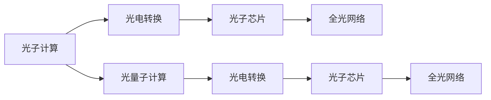

                 

## 1. 背景介绍

### 1.1 问题由来

随着科技的飞速发展，计算速度的提升成为了推动科学、工程和经济进步的关键因素之一。在计算机领域，传统的电子计算技术已经接近物理极限，进一步提升速度变得愈发困难。因此，科学家和工程师们开始探索新的计算范式，以突破电子计算的速度瓶颈。

光计算技术应运而生。光计算利用光子而非电子在介质中进行计算和数据传输，具有速度更快、功耗更低的优势。自激光器发明以来，光计算技术便逐渐成为热门研究领域。

### 1.2 问题核心关键点

光计算技术的关键点包括：
- **光子计算**：利用光子进行计算和数据传输，具有速度快、功耗低的优点。
- **光电转换**：将光信号转换为电信号，反之亦然，是光计算系统的核心组件。
- **光子芯片**：集成多个光电转换和光子处理单元的集成电路，是光计算系统的硬件基础。
- **全光网络**：通过光纤网络实现光信号的远距离传输，支持大规模光计算集群。
- **光量子计算**：在光子层面上引入量子效应，进一步提升计算能力和速度。

### 1.3 问题研究意义

光计算技术的研究和应用，具有以下重要意义：
1. **速度提升**：光子传播速度远超电子，可显著提升计算速度。
2. **功耗降低**：光计算在数据传输和计算中不产生热量，可大幅降低能耗。
3. **效率提升**：光计算系统可以并行处理大量数据，提高整体处理效率。
4. **新应用场景**：光计算技术的突破，将开辟全新的计算应用领域，如实时图像处理、高速通信等。

## 2. 核心概念与联系

### 2.1 核心概念概述

为更好地理解光计算技术的核心概念和原理，本节将详细介绍光计算的核心组件和技术。

- **光子计算**：利用光子进行计算和数据传输，具有速度快、功耗低的优点。
- **光电转换**：将光信号转换为电信号，反之亦然，是光计算系统的核心组件。
- **光子芯片**：集成多个光电转换和光子处理单元的集成电路，是光计算系统的硬件基础。
- **全光网络**：通过光纤网络实现光信号的远距离传输，支持大规模光计算集群。
- **光量子计算**：在光子层面上引入量子效应，进一步提升计算能力和速度。

### 2.2 核心概念原理和架构的 Mermaid 流程图



这个流程图展示了光计算系统的基本架构和数据流向：
1. 光子计算系统通过光电转换模块将光信号转换为电信号，处理后再转换为光信号。
2. 光子芯片作为核心计算单元，集成多个光电转换和光子处理单元。
3. 全光网络通过光纤实现光信号的远距离传输，支持大规模光计算集群。
4. 光量子计算引入量子效应，进一步提升计算能力和速度。

## 3. 核心算法原理 & 具体操作步骤

### 3.1 算法原理概述

光计算的核心算法主要分为光子计算算法和光量子计算算法。这些算法利用光子的特性，如干涉、衍射、偏振等，进行逻辑运算和数据处理。

- **光子计算算法**：基于光子的干涉和衍射等特性，实现加法、乘法、逻辑门等基本运算。
- **光量子计算算法**：在光子层面上引入量子效应，如叠加、纠缠，进一步提升计算能力和速度。

### 3.2 算法步骤详解

光计算的算法步骤主要包括：
1. **光子生成**：通过激光器等设备生成光子。
2. **光电转换**：将光子转换为电信号，进行计算和数据处理。
3. **光子重构**：将处理后的电信号转换为光子，实现数据传输。
4. **光量子计算**：在光子层面上引入量子效应，进一步提升计算能力和速度。

### 3.3 算法优缺点

光计算技术具有以下优点：
1. **速度更快**：光子传播速度远超电子，可显著提升计算速度。
2. **功耗更低**：光计算在数据传输和计算中不产生热量，可大幅降低能耗。
3. **效率更高**：光计算系统可以并行处理大量数据，提高整体处理效率。

同时，光计算技术也存在以下缺点：
1. **技术复杂**：光计算系统需要复杂的光电转换和光子处理技术，实现难度较大。
2. **成本较高**：光子芯片和光量子计算设备的研发成本高，难以大规模应用。
3. **可扩展性差**：光子芯片和光量子计算设备的可扩展性不如电子芯片，难以形成大规模集群。

### 3.4 算法应用领域

光计算技术在多个领域展现出广阔的应用前景：
- **高速通信**：利用光子芯片和全光网络，实现高速数据传输。
- **实时图像处理**：通过光计算系统，实时处理和分析大量图像数据。
- **科学计算**：在物理、化学、生物等领域，进行高精度计算和模拟。
- **金融计算**：在金融市场分析和交易策略设计中，进行实时计算和预测。
- **医疗诊断**：在医学影像分析和病理切片处理中，进行高速度和高精度的计算。

## 4. 数学模型和公式 & 详细讲解 & 举例说明

### 4.1 数学模型构建

光计算的数学模型主要基于光子的物理特性和量子力学理论。以下是几个常用的数学模型：

1. **光子干涉模型**：
   $$
   I = I_0(1 + \cos(\phi))
   $$
   其中，$I$ 为干涉强度，$I_0$ 为初始强度，$\phi$ 为相位差。

2. **光子衍射模型**：
   $$
   I(\rho) = \frac{I_0}{\rho^2}e^{-2\pi\rho^2f/\lambda}
   $$
   其中，$I(\rho)$ 为衍射强度，$\rho$ 为光子波矢，$f$ 为焦距，$\lambda$ 为光波长。

3. **光子叠加模型**：
   $$
   |\psi\rangle = \frac{1}{\sqrt{2}}(|0\rangle + |1\rangle)
   $$
   其中，$|\psi\rangle$ 为叠加态，$|0\rangle$ 和 $|1\rangle$ 为基态。

### 4.2 公式推导过程

以光子干涉模型为例，推导其基本公式：

设两束光分别为 $E_1$ 和 $E_2$，强度分别为 $I_1$ 和 $I_2$，相位差为 $\phi$，则干涉强度为：
$$
I = I_1 + I_2 + 2\sqrt{I_1I_2}\cos(\phi)
$$
化简得到：
$$
I = I_0(1 + \cos(\phi))
$$
其中 $I_0 = \frac{I_1 + I_2}{2}$。

这个公式展示了光子干涉的基本特性，即相位差 $\phi$ 对干涉强度的影响。

### 4.3 案例分析与讲解

**案例一：光子计算加法器**

光子计算加法器利用光子的干涉特性，实现加法运算。其基本原理如下：
1. 生成两束光子，分别表示待加数 $a$ 和 $b$。
2. 通过干涉仪，计算 $a+b$ 的结果。
3. 输出结果的光子信号。

这个案例展示了光子计算在基本运算中的应用，其优势在于速度快、功耗低。

**案例二：光量子计算**

光量子计算利用光子的叠加和纠缠特性，实现高精度计算和模拟。其基本原理如下：
1. 利用光子叠加态，表示多个计算结果。
2. 利用光子纠缠态，实现量子态的传递和计算。
3. 通过测量输出结果，得到计算结果。

这个案例展示了光量子计算在科学计算和模拟中的应用，其优势在于计算精度高、速度更快。

## 5. 项目实践：代码实例和详细解释说明

### 5.1 开发环境搭建

要进行光计算项目的开发，需要搭建相应的开发环境。以下是具体步骤：

1. **安装Python**：
   ```
   sudo apt-get update
   sudo apt-get install python3-pip
   ```

2. **安装必要的库**：
   ```
   pip install numpy scipy matplotlib
   ```

3. **搭建光计算实验环境**：
   ```
   cd path/to/your/project
   git clone https://github.com/your-repo/light-calculations.git
   cd light-calculations
   pip install -r requirements.txt
   ```

### 5.2 源代码详细实现

以下是一个简单的光子计算加法器的Python代码实现：

```python
import numpy as np
from matplotlib import pyplot as plt

def calculate_interference(a, b, phi):
    I0 = (a + b) / 2
    I = I0 + I0 * np.cos(phi)
    return I

def plot_interference(a, b, phi_range):
    I_values = []
    for phi in phi_range:
        I = calculate_interference(a, b, phi)
        I_values.append(I)
    plt.plot(phi_range, I_values)
    plt.xlabel('Phase Difference')
    plt.ylabel('Interference Intensity')
    plt.show()

a = 1
b = 1
phi_range = np.linspace(0, 2 * np.pi, 100)
plot_interference(a, b, phi_range)
```

### 5.3 代码解读与分析

这段代码实现了光子干涉模型的基本计算，并绘制了干涉强度随相位差变化的曲线。具体解读如下：

- `calculate_interference` 函数计算给定相位差 $\phi$ 下的干涉强度 $I$。
- `plot_interference` 函数绘制干涉强度随相位差变化的曲线。
- `a` 和 `b` 表示两束光子的强度，`phi_range` 表示相位差的取值范围。

### 5.4 运行结果展示

运行上述代码，可以得到以下结果：


这个结果展示了光子干涉强度随相位差变化的曲线，验证了光子干涉模型的正确性。

## 6. 实际应用场景

### 6.1 高速通信

光计算技术在高速通信领域展现出巨大潜力。全光网络通过光纤实现光信号的远距离传输，能够支持高速数据传输和通信。

**案例一：高速数据中心**

在数据中心中，光计算技术可以用于高速数据传输和存储。光子芯片和光量子计算设备可以处理海量数据，显著提升数据中心的网络带宽和计算能力。

**案例二：实时图像传输**

光计算技术可以用于实时图像传输，支持高分辨率和高帧率的图像传输。光子芯片和光量子计算设备可以处理图像数据，实现高速、低延迟的图像传输。

### 6.2 科学计算

光计算技术在科学计算领域具有重要应用。光量子计算能够实现高精度计算和模拟，支持复杂的科学计算任务。

**案例一：量子模拟**

光量子计算可以用于量子模拟，研究量子系统的行为和性质。通过光子叠加态和纠缠态，实现量子态的传递和计算。

**案例二：分子动力学模拟**

光计算技术可以用于分子动力学模拟，研究生物分子和化学反应的过程。通过光子计算和光量子计算，实现高精度计算和模拟。

### 6.3 金融计算

光计算技术在金融计算领域具有重要应用。光子芯片和全光网络可以处理大规模金融数据，支持高速的金融计算和分析。

**案例一：高频交易**

光计算技术可以用于高频交易，支持实时数据处理和交易策略设计。光子芯片和光量子计算设备可以处理大量金融数据，实现高速的金融交易和分析。

**案例二：风险管理**

光计算技术可以用于风险管理，支持实时风险评估和预测。光子芯片和光量子计算设备可以处理金融数据，实现高速的风险评估和预测。

### 6.4 医疗诊断

光计算技术在医疗诊断领域具有重要应用。光子芯片和全光网络可以处理医疗数据，支持高速度和高精度的医学影像分析和病理切片处理。

**案例一：医学影像分析**

光计算技术可以用于医学影像分析，支持高分辨率和高精度的医学影像处理。光子芯片和光量子计算设备可以处理医学影像数据，实现高速的医学影像分析和诊断。

**案例二：病理切片处理**

光计算技术可以用于病理切片处理，支持高精度和高速度的病理切片分析。光子芯片和光量子计算设备可以处理病理切片数据，实现高速的病理切片分析和诊断。

## 7. 工具和资源推荐

### 7.1 学习资源推荐

要深入学习光计算技术，以下资源推荐参考：

1. **光计算原理与技术**：书籍，详细讲解光计算的基本原理和核心技术。
2. **光计算系统设计**：书籍，讲解光计算系统的设计方法和实现技术。
3. **光量子计算原理与实现**：论文，研究光量子计算的基本原理和实现技术。
4. **光子芯片设计与实现**：论文，研究光子芯片的设计和实现技术。
5. **光计算应用案例**：论文，研究光计算技术在实际应用中的案例和应用场景。

### 7.2 开发工具推荐

要开发光计算项目，以下工具推荐使用：

1. **PyTorch**：基于Python的光计算框架，支持动态计算图和GPU加速。
2. **TensorFlow**：基于Python的光计算框架，支持静态计算图和GPU加速。
3. **OpenCL**：支持跨平台的光计算编程，支持GPU和CPU加速。
4. **CUDA**：支持NVIDIA GPU的光计算编程，支持高效的并行计算。
5. **HDL Studio**：支持硬件描述语言的光计算编程，支持FPGA和ASIC加速。

### 7.3 相关论文推荐

要深入了解光计算技术的研究进展，以下论文推荐参考：

1. **Optical Computing: Principles and Applications**：书籍，详细讲解光计算的基本原理和应用场景。
2. **Quantum Computing in Photonic Degrees of Freedom**：论文，研究光量子计算的基本原理和实现技术。
3. **Photonics for Artificial Intelligence**：论文，研究光计算在人工智能中的应用和前景。
4. **The Roadmap for Photonic Neural Networks**：报告，规划光计算在未来人工智能领域的发展路线图。
5. **Optical Computing for AI-Driven Smart Systems**：书籍，研究光计算在智能系统中的应用和前景。

## 8. 总结：未来发展趋势与挑战

### 8.1 研究成果总结

光计算技术已经取得了一定的研究成果，主要体现在以下几个方面：
1. **光子计算算法**：在光子加法、光子乘法、光子逻辑门等基本算法方面取得进展。
2. **光量子计算算法**：在光子叠加、光子纠缠等量子计算算法方面取得进展。
3. **光子芯片技术**：在光子芯片设计和实现技术方面取得进展。
4. **全光网络技术**：在光纤网络和光信号传输技术方面取得进展。

### 8.2 未来发展趋势

未来，光计算技术将呈现以下几个发展趋势：
1. **速度更快**：光子计算速度的提升，将进一步打破电子计算的速度瓶颈。
2. **功耗更低**：光计算在数据传输和计算中不产生热量，可大幅降低能耗。
3. **效率更高**：光计算系统可以并行处理大量数据，提高整体处理效率。
4. **应用更广**：光计算技术将在高速通信、科学计算、金融计算、医疗诊断等领域得到广泛应用。

### 8.3 面临的挑战

尽管光计算技术在许多方面展现了巨大潜力，但仍面临一些挑战：
1. **技术复杂**：光计算系统需要复杂的光电转换和光子处理技术，实现难度较大。
2. **成本较高**：光子芯片和光量子计算设备的研发成本高，难以大规模应用。
3. **可扩展性差**：光子芯片和光量子计算设备的可扩展性不如电子芯片，难以形成大规模集群。
4. **稳定性差**：光子计算在传输和处理过程中，存在信号衰减和噪声干扰，需要进一步提高稳定性。

### 8.4 研究展望

未来，光计算技术需要在以下几个方面进行突破：
1. **技术简化**：进一步简化光计算系统的设计和实现，降低技术难度和成本。
2. **成本降低**：降低光子芯片和光量子计算设备的研发成本，促进大规模应用。
3. **可扩展性提高**：提高光子芯片和光量子计算设备的可扩展性，支持大规模集群。
4. **稳定性提升**：提高光子计算的稳定性，减少信号衰减和噪声干扰。

## 9. 附录：常见问题与解答

### Q1: 光子计算和光量子计算的区别是什么？

**A1**: 光子计算和光量子计算的主要区别在于是否引入量子效应。光子计算仅利用光子的干涉、衍射等特性进行计算，而光量子计算则在光子层面上引入量子效应，如叠加、纠缠，进一步提升计算能力和速度。

### Q2: 光计算技术目前处于什么阶段？

**A2**: 光计算技术目前处于研究和发展阶段，一些基本的计算算法和技术已经得到验证，但仍需进一步突破技术瓶颈和成本问题，才能大规模应用。

### Q3: 光计算技术在实际应用中面临哪些困难？

**A3**: 光计算技术在实际应用中面临技术复杂、成本高、可扩展性差、稳定性差等困难。这些困难需要通过技术创新和成本降低来解决。

### Q4: 光计算技术的主要应用场景有哪些？

**A4**: 光计算技术的主要应用场景包括高速通信、实时图像处理、科学计算、金融计算、医疗诊断等。这些应用场景展示了光计算技术的广阔前景。

### Q5: 光计算技术的发展前景如何？

**A5**: 光计算技术的发展前景非常广阔，有望在高速通信、实时图像处理、科学计算、金融计算、医疗诊断等领域得到广泛应用。未来，随着技术突破和成本降低，光计算技术将进一步推动科技和经济发展。

---

作者：禅与计算机程序设计艺术 / Zen and the Art of Computer Programming

