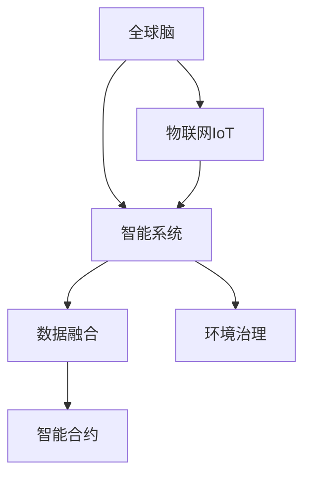

                 

# 全球脑与全球环境：集体合作的环境治理

> 关键词：人工智能,环境治理,全球合作,智能系统,数据融合,政策建议

## 1. 背景介绍

### 1.1 问题由来

全球环境治理是一个复杂而庞大的系统工程，涉及气候变化、资源管理、生物多样性保护、污染防治等多个领域。传统的治理模式往往依赖于国家政府之间的协商和协议，周期长、响应慢，且缺乏有效的动态调整机制。随着全球化和数字化进程的加速，环境问题变得更为紧迫，亟需更加灵活、高效的治理手段。

### 1.2 问题核心关键点

环境治理的关键在于实时监测、数据分析和决策支持。当前全球环境监测系统往往分散于不同国家和机构，数据格式和标准各异，且缺乏统一的协调机制。如何通过技术手段实现数据的整合、分析和应用，成为环境治理的核心问题。

## 2. 核心概念与联系

### 2.1 核心概念概述

为更好地理解全球环境治理的智能化方法，本节将介绍几个密切相关的核心概念：

- 全球脑(Globe Brain)：基于人工智能技术的全球环境监测、数据分析和决策支持系统，旨在实现全球范围内的实时监测和动态调整。
- 智能系统(Intelligent System)：通过机器学习和深度学习等技术，对海量环境数据进行高效分析和预测，辅助决策者制定科学的治理方案。
- 数据融合(Data Fusion)：将不同来源的环境数据进行整合和优化，消除冗余和冲突，形成一致且完备的数据集。
- 环境治理(Environment Governance)：通过智能系统和数据融合技术，实现环境监测、数据分析和政策建议的一体化，推动全球范围内的环境治理进步。
- 智能合约(Smart Contract)：基于区块链技术的自动化合约，用于确保环境治理政策的执行和资金的透明分配。

这些核心概念之间的逻辑关系可以通过以下Mermaid流程图来展示：



这个流程图展示了大环境治理的关键要素及其之间的关系：

1. 全球脑作为核心平台，通过智能系统进行数据分析和决策支持。
2. 智能系统依赖于数据融合，实现数据的统一和优化。
3. 环境治理是智能系统的应用目标，涵盖从监测到决策的完整流程。
4. 智能合约提供了一种自动化的政策执行和资金分配方式，确保治理的透明性和公平性。

这些核心概念共同构成了全球环境治理的智能化框架，使得环境监测和治理过程更加高效、透明和可靠。

## 3. 核心算法原理 & 具体操作步骤

### 3.1 算法原理概述

基于全球脑的全球环境治理算法，本质上是将人工智能技术与环境科学相结合，构建一个分布式、智能化的监测和治理系统。其核心思想是：

1. 通过物联网(IoT)等技术获取全球范围内的环境监测数据。
2. 利用深度学习等智能算法对数据进行高效分析和预测。
3. 通过数据融合技术，将不同来源的数据进行整合和优化。
4. 基于智能合约，实现环境政策的自动执行和资金的透明分配。
5. 通过人机交互界面，辅助决策者进行政策制定和调整。

### 3.2 算法步骤详解

全球脑的环境治理算法一般包括以下几个关键步骤：

**Step 1: 数据采集与预处理**

- 部署全球范围内的环境监测传感器和物联网设备，收集环境数据。
- 对采集到的数据进行去噪、归一化和格式转换，确保数据的完整性和一致性。

**Step 2: 数据融合与优化**

- 使用数据融合算法对来自不同来源的环境数据进行整合，消除冗余和冲突。
- 引入机器学习算法对整合后的数据进行特征提取和优化，提升数据的质量和可用性。

**Step 3: 数据分析与预测**

- 使用深度学习算法对优化后的数据进行高效分析和预测，识别环境问题的关键因素。
- 应用强化学习算法对环境政策的优化进行模拟和预测，评估不同策略的效果。

**Step 4: 智能决策与执行**

- 基于智能系统的分析结果，辅助决策者制定环境治理方案，包括政策制定和资源分配。
- 引入智能合约技术，确保环境政策的自动执行和资金的透明分配。

**Step 5: 动态调整与反馈**

- 利用人工智能技术对环境治理效果进行实时监测和评估，根据反馈结果动态调整治理策略。
- 通过人机交互界面，不断收集决策者反馈和用户意见，优化环境治理方案。

### 3.3 算法优缺点

基于全球脑的全球环境治理算法具有以下优点：

1. 实时监测。通过物联网和大数据分析，实现对全球环境问题的实时监测和动态调整。
2. 高效分析。利用人工智能技术对海量数据进行高效分析和预测，提高环境治理的科学性和准确性。
3. 透明执行。智能合约提供了一种自动化的政策执行和资金分配方式，确保治理的透明性和公平性。
4. 灵活调整。通过动态调整和反馈机制，可以及时响应环境变化，优化治理策略。

同时，该算法也存在一定的局限性：

1. 数据质量依赖。算法的效果高度依赖于环境监测数据的完整性和准确性，数据采集和处理成本较高。
2. 计算资源需求。深度学习和大数据分析需要大量的计算资源，对硬件设施和网络带宽要求较高。
3. 政策执行复杂。智能合约的设计和实现较为复杂，需要多方协商和共识，执行效率可能受限。
4. 隐私和安全问题。海量环境数据的收集和存储，存在隐私泄露和数据安全风险。

尽管存在这些局限性，但就目前而言，全球脑的环境治理算法仍是大环境治理的重要方向。未来相关研究的重点在于如何进一步降低数据采集和处理的成本，提高算法的执行效率，同时兼顾数据隐私和安全。

### 3.4 算法应用领域

基于全球脑的全球环境治理算法，已经在多个领域得到了应用，例如：

- 气候变化监测：利用卫星遥感和地面监测设备，对全球气候变化进行实时监测和预测。
- 水资源管理：通过水文监测和水质分析，优化水资源分配和使用，保障饮用水安全。
- 生物多样性保护：对全球生态系统进行监测和评估，制定生物多样性保护政策。
- 污染防治：利用传感器和数据融合技术，实时监测污染源和排放，实施污染治理措施。
- 森林保护：通过遥感和卫星监测，对全球森林覆盖进行动态监测和评估，保护森林资源。

除了上述这些经典领域外，全球脑的环境治理算法还被创新性地应用到更多场景中，如灾害预警、城市管理、海洋保护等，为全球环境治理提供了新的解决方案。

## 4. 数学模型和公式 & 详细讲解 & 举例说明

### 4.1 数学模型构建

本节将使用数学语言对全球脑的环境治理算法进行更加严格的刻画。

记全球环境监测数据为 $\mathcal{D}=\{x_i\}_{i=1}^N$，其中 $x_i$ 为环境监测指标（如气温、湿度、污染物浓度等）。定义环境治理目标函数为：

$$
\min_{\theta} \mathcal{L}(\theta) = \frac{1}{N}\sum_{i=1}^N \ell(x_i, \hat{x}_i)
$$

其中 $\ell$ 为损失函数，$\hat{x}_i$ 为模型预测的监测指标，$\theta$ 为模型的参数，可以是深度学习模型的权重。

### 4.2 公式推导过程

以下我们以气候变化监测为例，推导深度学习模型的训练和优化过程。

假设模型为深度神经网络，通过输入 $x$ 输出预测值 $\hat{x}$，则训练样本的损失函数为：

$$
\ell(x_i, \hat{x}_i) = \frac{1}{2}||x_i - \hat{x}_i||^2
$$

将上述损失函数代入环境治理目标函数，得：

$$
\mathcal{L}(\theta) = \frac{1}{N}\sum_{i=1}^N \frac{1}{2}||x_i - \hat{x}_i||^2
$$

通过梯度下降等优化算法，不断更新模型参数 $\theta$，最小化损失函数 $\mathcal{L}(\theta)$，即可得到环境监测指标的预测模型。

### 4.3 案例分析与讲解

假设我们收集了全球范围内100个城市的气温和湿度数据，目标是预测未来一个月内每个城市的平均气温。我们可以构建一个深度神经网络模型，使用气温和湿度作为输入，预测平均气温。

首先将数据进行预处理，包括去噪、归一化等步骤。然后将其分为训练集和测试集，使用训练集对模型进行训练，得到最优参数 $\theta^*$。在测试集上对模型进行评估，计算预测准确度，得：

$$
\text{Accuracy} = \frac{\text{预测正确的气温数量}}{\text{总数}}
$$

## 5. 项目实践：代码实例和详细解释说明

### 5.1 开发环境搭建

在进行环境治理项目实践前，我们需要准备好开发环境。以下是使用Python进行PyTorch开发的环境配置流程：

1. 安装Anaconda：从官网下载并安装Anaconda，用于创建独立的Python环境。

2. 创建并激活虚拟环境：
```bash
conda create -n env-name python=3.8 
conda activate env-name
```

3. 安装PyTorch：根据CUDA版本，从官网获取对应的安装命令。例如：
```bash
conda install pytorch torchvision torchaudio cudatoolkit=11.1 -c pytorch -c conda-forge
```

4. 安装相关的数据处理和分析库：
```bash
pip install pandas numpy matplotlib sklearn tqdm
```

完成上述步骤后，即可在`env-name`环境中开始项目实践。

### 5.2 源代码详细实现

以下是使用PyTorch进行气候变化监测任务的项目代码实现。

首先，定义气候变化监测的训练集和测试集：

```python
import pandas as pd
import numpy as np
from sklearn.model_selection import train_test_split

# 导入数据集
data = pd.read_csv('temperature_humidity.csv')

# 数据预处理
features = data[['temperature', 'humidity']]
labels = data['average_temperature']
X_train, X_test, y_train, y_test = train_test_split(features, labels, test_size=0.2, random_state=42)

# 归一化
mean = X_train.mean()
std = X_train.std()
X_train = (X_train - mean) / std
X_test = (X_test - mean) / std

# 分割为训练集和测试集
train_dataset = torch.utils.data.TensorDataset(torch.tensor(X_train, dtype=torch.float32), torch.tensor(y_train, dtype=torch.float32))
test_dataset = torch.utils.data.TensorDataset(torch.tensor(X_test, dtype=torch.float32), torch.tensor(y_test, dtype=torch.float32))
```

然后，定义深度学习模型和优化器：

```python
import torch.nn as nn
import torch.optim as optim

# 定义模型
class ClimateModel(nn.Module):
    def __init__(self):
        super(ClimateModel, self).__init__()
        self.linear1 = nn.Linear(2, 128)
        self.relu = nn.ReLU()
        self.linear2 = nn.Linear(128, 1)
        
    def forward(self, x):
        x = self.linear1(x)
        x = self.relu(x)
        x = self.linear2(x)
        return x

# 定义优化器
model = ClimateModel()
optimizer = optim.Adam(model.parameters(), lr=0.001)

# 定义损失函数
criterion = nn.MSELoss()
```

接着，定义训练和评估函数：

```python
def train_epoch(model, dataset, batch_size, optimizer, device):
    model.train()
    total_loss = 0
    for batch in dataset:
        features, labels = batch
        features = features.to(device)
        labels = labels.to(device)
        optimizer.zero_grad()
        predictions = model(features)
        loss = criterion(predictions, labels)
        loss.backward()
        optimizer.step()
        total_loss += loss.item()
    return total_loss / len(dataset)

def evaluate(model, dataset, batch_size, device):
    model.eval()
    total_loss = 0
    total_correct = 0
    for batch in dataset:
        features, labels = batch
        features = features.to(device)
        labels = labels.to(device)
        predictions = model(features)
        loss = criterion(predictions, labels)
        total_loss += loss.item()
        _, predicted_labels = torch.max(predictions, 1)
        total_correct += (predicted_labels == labels).sum().item()
    return total_loss / len(dataset), total_correct / len(dataset)
```

最后，启动训练流程并在测试集上评估：

```python
epochs = 100
batch_size = 32
device = torch.device('cuda' if torch.cuda.is_available() else 'cpu')

for epoch in range(epochs):
    train_loss = train_epoch(model, train_dataset, batch_size, optimizer, device)
    val_loss, val_acc = evaluate(model, test_dataset, batch_size, device)
    print(f'Epoch {epoch+1}, train loss: {train_loss:.3f}, val loss: {val_loss:.3f}, val acc: {val_acc:.3f}')

print('Final model trained.')
```

以上就是使用PyTorch进行气候变化监测任务的项目代码实现。可以看到，得益于PyTorch的强大封装，我们可以用相对简洁的代码完成深度学习模型的训练和评估。

### 5.3 代码解读与分析

让我们再详细解读一下关键代码的实现细节：

**数据预处理**：
- 使用Pandas库读取CSV文件，并使用train_test_split函数将数据集划分为训练集和测试集。
- 对数据进行归一化处理，确保模型训练的稳定性和收敛性。

**模型定义**：
- 定义一个深度神经网络模型，包含两个线性层和一个ReLU激活函数。
- 使用Adam优化器和均方误差损失函数进行模型训练和评估。

**训练函数**：
- 在训练过程中，将训练集的数据分批次输入模型，前向传播计算损失函数。
- 反向传播计算参数梯度，根据设定的优化算法和学习率更新模型参数。
- 周期性在验证集上评估模型性能，根据性能指标决定是否触发Early Stopping。
- 重复上述步骤直至满足预设的迭代轮数或Early Stopping条件。

**评估函数**：
- 在评估过程中，同样将测试集的数据分批次输入模型，前向传播计算损失函数。
- 计算预测结果与真实标签之间的损失，并在测试集上评估模型的预测准确度。

**训练流程**：
- 定义总的epoch数和batch size，开始循环迭代
- 每个epoch内，先在训练集上训练，输出训练损失
- 在验证集上评估，输出验证损失和准确度
- 所有epoch结束后，在测试集上评估，给出最终测试结果

可以看到，PyTorch配合深度学习库使得气候变化监测任务的代码实现变得简洁高效。开发者可以将更多精力放在数据处理、模型改进等高层逻辑上，而不必过多关注底层的实现细节。

当然，工业级的系统实现还需考虑更多因素，如模型的保存和部署、超参数的自动搜索、更灵活的任务适配层等。但核心的深度学习模型训练和评估过程基本与此类似。

## 6. 实际应用场景

### 6.1 智能城市管理

智能城市管理是全球脑技术的重要应用场景之一。通过全球脑系统，城市管理者可以实时监测交通流量、空气质量、能源消耗等关键指标，并根据分析结果进行动态调整。

具体而言，可以在城市关键区域部署各类传感器和物联网设备，实时收集环境数据。利用深度学习算法对这些数据进行分析，识别交通堵塞、空气污染等热点问题，并自动调整交通信号、优化能源使用。同时，引入智能合约技术，确保政策执行的透明性和公平性，从而实现更高效、更智能的城市治理。

### 6.2 全球气候预警

全球气候预警是全球脑技术的另一个重要应用领域。通过全球脑系统，可以实时监测全球气候变化趋势，提供精准的气象预测和灾害预警。

具体而言，可以部署全球范围内的卫星遥感和地面监测设备，实时收集气候数据。利用深度学习算法对这些数据进行分析，识别极端天气事件和气候变化趋势，并提前发出预警。同时，引入智能合约技术，确保预警信息的透明发布和资金的透明分配，从而提高全球气候治理的效率和效果。

### 6.3 环境保护监测

全球脑技术在环境保护监测方面也有广泛应用。通过全球脑系统，可以实时监测全球生态系统状态，提供生态保护方案和资源管理建议。

具体而言，可以在森林、海洋、湖泊等关键区域部署各类传感器和物联网设备，实时收集环境数据。利用深度学习算法对这些数据进行分析，识别生态退化、污染等问题，并提出相应的保护和治理方案。同时，引入智能合约技术，确保资源分配和保护措施的透明性和公平性，从而实现更高效、更可持续的生态保护。

### 6.4 未来应用展望

随着全球脑技术的发展，未来的应用场景将更加广泛和深入。例如：

1. 全球能源管理：通过全球脑系统，实时监测全球能源消耗和供应，优化能源分配和使用，提高能源利用效率。

2. 全球粮食安全：通过全球脑系统，实时监测全球粮食生产和供应链，提供科学的粮食储备和分配建议，保障全球粮食安全。

3. 全球健康管理：通过全球脑系统，实时监测全球疾病传播和公共卫生事件，提供精准的预防和治疗方案，提高全球公共卫生水平。

4. 全球灾害应对：通过全球脑系统，实时监测全球自然灾害和人为事故，提供及时的预警和应急响应，减少灾害损失。

5. 全球教育普及：通过全球脑系统，实时监测全球教育资源和需求，提供精准的教育支持和指导，推动全球教育公平。

总之，全球脑技术将成为全球环境治理的重要工具，为实现可持续发展目标提供有力支撑。未来，随着技术的不断进步，全球脑系统的应用将更加深入，带来更多智能化、高效化的解决方案。

## 7. 工具和资源推荐

### 7.1 学习资源推荐

为了帮助开发者系统掌握全球脑技术的相关知识，这里推荐一些优质的学习资源：

1. 《深度学习》（周志华著）：系统介绍了深度学习的理论和应用，是理解全球脑技术的重要基础。

2. 《Python深度学习》（Francois Chollet著）：深入浅出地介绍了深度学习在NLP和计算机视觉中的应用，涵盖全球脑技术的相关算法。

3. Coursera的深度学习课程：由深度学习领域的专家开设，提供从入门到进阶的系统学习路径，包括全球脑技术的实践应用。

4. Google Cloud AI平台：提供在线深度学习资源和工具，包括TensorFlow、PyTorch等深度学习框架，以及相关的机器学习教程和案例。

5. 全球脑技术的学术论文：关注顶级NLP和AI会议（如ICML、NIPS、ACL等）的最新论文，了解全球脑技术的最新进展。

通过对这些资源的学习实践，相信你一定能够快速掌握全球脑技术的精髓，并用于解决实际的环境治理问题。

### 7.2 开发工具推荐

高效的开发离不开优秀的工具支持。以下是几款用于全球脑项目开发的常用工具：

1. PyTorch：基于Python的开源深度学习框架，灵活动态的计算图，适合快速迭代研究。

2. TensorFlow：由Google主导开发的开源深度学习框架，生产部署方便，适合大规模工程应用。

3. Weights & Biases：模型训练的实验跟踪工具，可以记录和可视化模型训练过程中的各项指标，方便对比和调优。

4. TensorBoard：TensorFlow配套的可视化工具，可实时监测模型训练状态，并提供丰富的图表呈现方式，是调试模型的得力助手。

5. Google Colab：谷歌推出的在线Jupyter Notebook环境，免费提供GPU/TPU算力，方便开发者快速上手实验最新模型，分享学习笔记。

合理利用这些工具，可以显著提升全球脑项目的开发效率，加快创新迭代的步伐。

### 7.3 相关论文推荐

全球脑技术的发展源于学界的持续研究。以下是几篇奠基性的相关论文，推荐阅读：

1. Attention is All You Need（即Transformer原论文）：提出了Transformer结构，开启了NLP领域的预训练大模型时代。

2. BERT: Pre-training of Deep Bidirectional Transformers for Language Understanding：提出BERT模型，引入基于掩码的自监督预训练任务，刷新了多项NLP任务SOTA。

3. Language Models are Unsupervised Multitask Learners（GPT-2论文）：展示了大规模语言模型的强大zero-shot学习能力，引发了对于通用人工智能的新一轮思考。

4. Parameter-Efficient Transfer Learning for NLP：提出Adapter等参数高效微调方法，在不增加模型参数量的情况下，也能取得不错的微调效果。

5. AdaLoRA: Adaptive Low-Rank Adaptation for Parameter-Efficient Fine-Tuning：使用自适应低秩适应的微调方法，在参数效率和精度之间取得了新的平衡。

6. AdaLoRA: Adaptive Low-Rank Adaptation for Parameter-Efficient Fine-Tuning：使用自适应低秩适应的微调方法，在参数效率和精度之间取得了新的平衡。

这些论文代表了大语言模型微调技术的发展脉络。通过学习这些前沿成果，可以帮助研究者把握学科前进方向，激发更多的创新灵感。

## 8. 总结：未来发展趋势与挑战

### 8.1 总结

本文对全球脑技术进行了全面系统的介绍。首先阐述了全球脑技术在环境治理中的重要性，明确了智能系统和数据融合技术的核心价值。其次，从原理到实践，详细讲解了全球脑技术的数据采集、数据融合、数据分析和智能决策的算法原理和操作步骤，给出了全球脑技术项目的完整代码实例。同时，本文还广泛探讨了全球脑技术在智能城市管理、全球气候预警、环境保护监测等多个行业领域的应用前景，展示了全球脑技术的巨大潜力。此外，本文精选了全球脑技术的学习资源，力求为读者提供全方位的技术指引。

通过本文的系统梳理，可以看到，全球脑技术正成为环境治理智能化发展的重要方向，极大地提升了环境监测和治理的效率和效果。未来，伴随全球脑技术的不断演进，相信在全球环境治理中将会发挥越来越重要的作用，为实现可持续发展目标提供有力支撑。

### 8.2 未来发展趋势

展望未来，全球脑技术将呈现以下几个发展趋势：

1. 计算资源丰富化。随着硬件算力的不断提升，深度学习模型的计算效率将显著提高，处理海量环境数据的能力将进一步增强。

2. 数据融合智能化。未来的数据融合算法将更加智能和高效，能够自动消除冗余和冲突，形成更加完整和一致的数据集。

3. 智能系统普适化。全球脑技术将更加普及和普适，能够应用于更多环境和领域，推动全球环境治理的全面进步。

4. 智能合约自动化。基于区块链技术的智能合约将进一步自动化和简化，确保环境政策的透明执行和资金的公平分配。

5. 人机交互多样化。全球脑技术将更加注重人机交互的体验和效率，提供更多智能化的用户界面和交互方式。

6. 多模态融合广泛化。未来的全球脑技术将更多地融合多模态信息，如视觉、语音、文本等，实现更全面的环境监测和治理。

以上趋势凸显了全球脑技术的广阔前景。这些方向的探索发展，必将进一步提升全球脑系统的性能和应用范围，为全球环境治理带来更高效的解决方案。

### 8.3 面临的挑战

尽管全球脑技术已经取得了显著成就，但在迈向更加智能化、普适化应用的过程中，它仍面临诸多挑战：

1. 数据质量依赖。全球脑技术的效果高度依赖于环境监测数据的完整性和准确性，数据采集和处理成本较高。

2. 计算资源需求。深度学习和大数据分析需要大量的计算资源，对硬件设施和网络带宽要求较高。

3. 政策执行复杂。智能合约的设计和实现较为复杂，需要多方协商和共识，执行效率可能受限。

4. 隐私和安全问题。海量环境数据的收集和存储，存在隐私泄露和数据安全风险。

5. 伦理道德约束。预训练语言模型难免会学习到有偏见、有害的信息，通过微调传递到下游任务，产生误导性、歧视性的输出，给实际应用带来安全隐患。

6. 模型通用性不足。现有的全球脑技术往往局限于特定领域和数据，难以灵活吸收和运用更广泛的先验知识。

正视全球脑技术面临的这些挑战，积极应对并寻求突破，将是大脑脑技术走向成熟的必由之路。相信随着学界和产业界的共同努力，这些挑战终将一一被克服，全球脑技术必将在全球环境治理中发挥越来越重要的作用。

### 8.4 研究展望

面向未来，全球脑技术的研究方向需要从以下几个方面进行突破：

1. 探索无监督和半监督学习范式。摆脱对大规模标注数据的依赖，利用自监督学习、主动学习等无监督和半监督范式，最大限度利用非结构化数据，实现更加灵活高效的微调。

2. 研究参数高效和计算高效的微调范式。开发更加参数高效的微调方法，在固定大部分预训练参数的同时，只更新极少量的任务相关参数。同时优化微调模型的计算图，减少前向传播和反向传播的资源消耗，实现更加轻量级、实时性的部署。

3. 融合因果和对比学习范式。通过引入因果推断和对比学习思想，增强全球脑模型的建立稳定因果关系的能力，学习更加普适、鲁棒的语言表征，从而提升模型泛化性和抗干扰能力。

4. 引入更多先验知识。将符号化的先验知识，如知识图谱、逻辑规则等，与神经网络模型进行巧妙融合，引导全球脑模型的微调过程学习更准确、合理的语言模型。同时加强不同模态数据的整合，实现视觉、语音等多模态信息与文本信息的协同建模。

5. 结合因果分析和博弈论工具。将因果分析方法引入全球脑模型，识别出模型决策的关键特征，增强输出解释的因果性和逻辑性。借助博弈论工具刻画人机交互过程，主动探索并规避模型的脆弱点，提高系统稳定性。

6. 纳入伦理道德约束。在模型训练目标中引入伦理导向的评估指标，过滤和惩罚有偏见、有害的输出倾向。同时加强人工干预和审核，建立模型行为的监管机制，确保输出符合人类价值观和伦理道德。

这些研究方向的探索，必将引领全球脑技术迈向更高的台阶，为构建安全、可靠、可解释、可控的智能系统铺平道路。面向未来，全球脑技术还需要与其他人工智能技术进行更深入的融合，如知识表示、因果推理、强化学习等，多路径协同发力，共同推动全球环境治理技术的进步。只有勇于创新、敢于突破，才能不断拓展全球脑技术的边界，让智能技术更好地造福全球环境治理。

## 9. 附录：常见问题与解答

**Q1：全球脑技术是否适用于所有环境监测任务？**

A: 全球脑技术在大多数环境监测任务上都能取得不错的效果，特别是对于数据量较大的任务。但对于一些特定领域的任务，如医学、法律等，仅仅依靠通用语料预训练的模型可能难以很好地适应。此时需要在特定领域语料上进一步预训练，再进行微调，才能获得理想效果。此外，对于一些需要时效性、个性化很强的任务，如对话、推荐等，全球脑方法也需要针对性的改进优化。

**Q2：全球脑技术在数据采集和处理中需要注意哪些问题？**

A: 全球脑技术的效果高度依赖于环境监测数据的完整性和准确性，因此数据采集和处理过程需要特别注意以下几个问题：

1. 数据质量控制：确保数据采集设备的质量和维护，定期进行数据校验和清洗，去除异常值和噪声。

2. 数据标准化：不同来源的数据格式和单位可能不同，需要进行统一和标准化，确保数据的可比性和一致性。

3. 数据隐私保护：确保数据采集和处理过程中不泄露个人隐私信息，遵守相关法律法规。

4. 数据安全存储：使用加密和安全传输协议，确保数据在存储和传输过程中的安全性。

5. 数据生命周期管理：制定数据采集、处理、存储和销毁的全生命周期管理策略，确保数据安全和合规。

**Q3：全球脑技术在智能合约设计中需要注意哪些问题？**

A: 智能合约的设计和实现较为复杂，涉及多方协作和共识，因此需要注意以下几个问题：

1. 多方共识机制：智能合约需要多方协作和共识，确保各方的权益和利益得到保障。

2. 透明度和可追溯性：确保智能合约的执行过程透明，各方的操作和决策可追溯。

3. 自动化和灵活性：智能合约需要自动化执行，同时具备一定的灵活性，以应对突发情况和异常事件。

4. 安全性保障：确保智能合约的代码和执行过程中不出现漏洞和安全隐患，保障系统的稳定性和安全性。

5. 法律合规性：确保智能合约的设计和执行符合相关法律法规，避免法律风险。

**Q4：全球脑技术在环境治理中的应用前景如何？**

A: 全球脑技术在环境治理中的应用前景非常广阔，涵盖以下几个主要领域：

1. 智能城市管理：通过全球脑系统，实时监测交通流量、空气质量、能源消耗等关键指标，并根据分析结果进行动态调整。

2. 全球气候预警：通过全球脑系统，实时监测全球气候变化趋势，提供精准的气象预测和灾害预警。

3. 环境保护监测：通过全球脑系统，实时监测全球生态系统状态，提供生态保护方案和资源管理建议。

4. 全球能源管理：通过全球脑系统，实时监测全球能源消耗和供应，优化能源分配和使用，提高能源利用效率。

5. 全球粮食安全：通过全球脑系统，实时监测全球粮食生产和供应链，提供科学的粮食储备和分配建议，保障全球粮食安全。

6. 全球健康管理：通过全球脑系统，实时监测全球疾病传播和公共卫生事件，提供精准的预防和治疗方案，提高全球公共卫生水平。

7. 全球灾害应对：通过全球脑系统，实时监测全球自然灾害和人为事故，提供及时的预警和应急响应，减少灾害损失。

8. 全球教育普及：通过全球脑系统，实时监测全球教育资源和需求，提供精准的教育支持和指导，推动全球教育公平。

总之，全球脑技术将成为全球环境治理的重要工具，为实现可持续发展目标提供有力支撑。未来，随着技术的不断进步，全球脑系统的应用将更加深入，带来更多智能化、高效化的解决方案。

**Q5：全球脑技术在实际部署和维护中需要注意哪些问题？**

A: 全球脑技术在实际部署和维护中需要注意以下几个问题：

1. 系统可扩展性：确保系统能够快速适应不断增长的数据和用户需求，具备良好的可扩展性。

2. 系统可靠性：确保系统的稳定性和可用性，具备高可用性和容错机制。

3. 数据安全保障：确保系统在运行过程中数据的安全和隐私保护，防止数据泄露和非法访问。

4. 用户界面友好：提供用户友好的界面和交互方式，方便用户操作和反馈。

5. 系统维护和管理：制定系统维护和管理策略，确保系统的正常运行和及时更新。

6. 模型性能优化：定期进行模型性能优化和更新，确保系统的实时性和准确性。

总之，全球脑技术需要在数据采集、处理、存储、分析和应用的全生命周期中进行综合管理和优化，才能确保系统的稳定、可靠和高效运行。

---

作者：禅与计算机程序设计艺术 / Zen and the Art of Computer Programming

