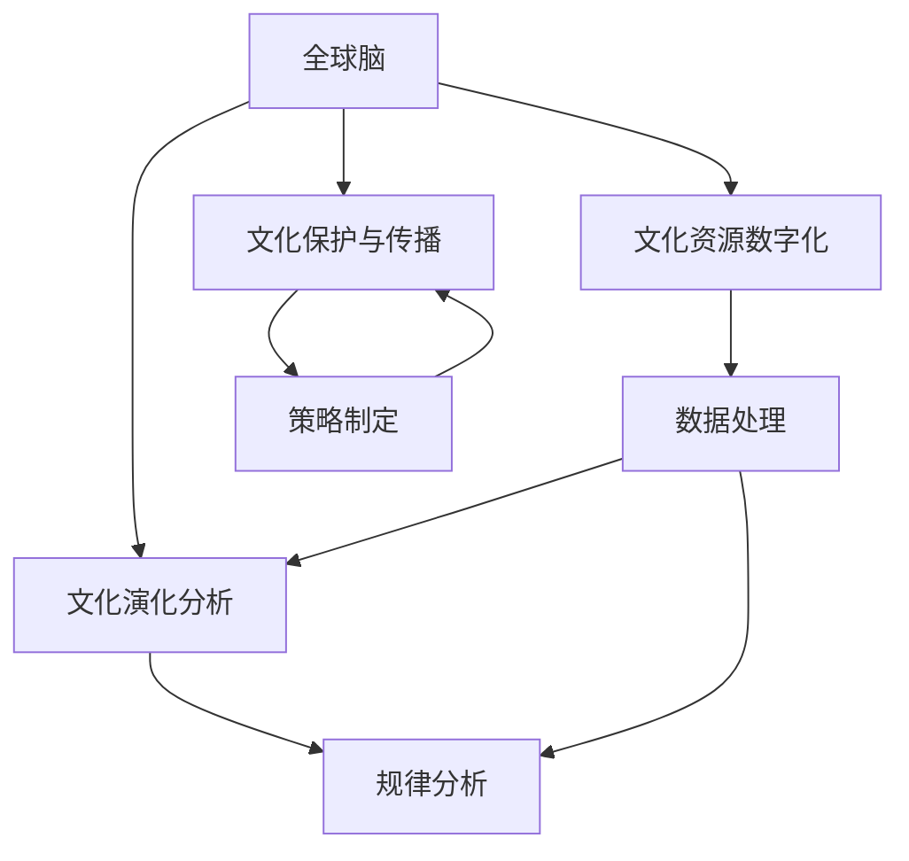

                 

# 全球脑与全球脑:数字孪生技术在文化研究中的应用

## 1. 背景介绍

### 1.1 问题由来

在全球化的今天，文化交流已经成为一个跨学科、多领域的重要研究领域。它不仅关系到语言、文学、艺术等传统领域的文化保护和传播，也影响着经济、社会、政治等各个层面。如何利用现代科技手段，深入挖掘和保存人类文化资源，成为一个亟待解决的问题。

近年来，随着人工智能、物联网、大数据等技术的发展，数字孪生(Digital Twin)概念应运而生。数字孪生是指通过在虚拟环境中构建与真实世界完全相同且具有交互能力的虚拟实体，用于模拟、分析和优化真实世界的行为。它已经在制造业、医疗、航空等领域得到了广泛应用。

本文将探讨数字孪生技术在文化研究中的应用，即全球脑（Global Brain）构建与研究，通过构建一个全球范围内的文化资源虚拟实体，实现对人类文化资源的全面、动态、实时分析与保护。

### 1.2 问题核心关键点

1. **全球脑概念**：通过数字孪生技术，构建一个全球范围的文化资源虚拟实体，记录并分析人类文化的多样性和演化路径。

2. **文化资源数字化**：将各种形式的文化资源（如文字、图像、视频、音频等）转化为数字形式，实现文化资源的全面数字化。

3. **文化演化分析**：通过全球脑的虚拟实体，对文化资源进行动态监测和演化分析，理解文化的发展规律和趋势。

4. **文化保护与传播**：利用全球脑提供的数据和分析结果，制定文化保护策略和传播方案，确保文化资源的长期保存和传播。

5. **跨学科融合**：结合人工智能、物联网、大数据等技术，实现文化研究与多学科的深度融合。

## 2. 核心概念与联系

### 2.1 核心概念概述

- **全球脑**：通过数字孪生技术构建的文化资源虚拟实体，包含全球范围内的文化数据，用于动态分析文化演化的过程。

- **文化资源数字化**：将各种形式的文化资源（如文本、图片、音频、视频等）转化为数字格式，实现全面的数字化保存。

- **文化演化分析**：利用全球脑的虚拟实体，对文化资源进行动态监测和演化分析，理解文化的发展规律和趋势。

- **文化保护与传播**：结合全球脑提供的数据和分析结果，制定文化保护和传播策略，确保文化资源的长期保存和传播。

- **跨学科融合**：结合人工智能、物联网、大数据等技术，实现文化研究与多学科的深度融合。

这些核心概念之间存在紧密的联系，共同构成了全球脑研究的框架，实现对人类文化资源的全面、动态、实时分析与保护。

### 2.2 核心概念原理和架构的 Mermaid 流程图



## 3. 核心算法原理 & 具体操作步骤

### 3.1 算法原理概述

全球脑的构建与研究，本质上是一个大规模、分布式的数据处理和分析过程。其核心算法原理可以概括为以下几个步骤：

1. **数据收集与清洗**：从全球范围内收集各种形式的文化资源，包括文本、图像、视频、音频等，并进行清洗和标注。

2. **数据集成与存储**：将清洗后的数据集成到全球脑的虚拟实体中，实现全球范围内的文化资源数字化存储。

3. **演化分析与规律识别**：通过时间序列分析等方法，对文化资源进行演化分析，识别出文化发展的规律和趋势。

4. **跨学科融合与优化**：结合人工智能、物联网、大数据等技术，对文化演化数据进行深度融合与优化，提升分析精度和效率。

5. **策略制定与传播**：根据演化分析的结果，制定文化保护和传播策略，并利用数字化技术进行传播和推广。

### 3.2 算法步骤详解

1. **数据收集与清洗**：
   - 数据来源：从图书馆、博物馆、档案馆、网站等渠道收集文化资源，包括书籍、文献、图片、视频、音频等。
   - 数据清洗：去除重复数据、错误数据和无效数据，进行格式转换和标注。

2. **数据集成与存储**：
   - 数据标准化：将不同来源、不同格式的数据进行标准化处理，统一到全球脑的虚拟实体中。
   - 数据存储：利用分布式数据库、云存储等技术，实现全球范围内的文化资源存储。

3. **演化分析与规律识别**：
   - 时间序列分析：利用时间序列分析方法，对文化资源进行动态监测和演化分析，识别出文化发展的规律和趋势。
   - 模式识别：结合机器学习算法，对文化资源进行模式识别，发现文化特征和演化路径。

4. **跨学科融合与优化**：
   - 人工智能融合：引入深度学习、自然语言处理等技术，对文化数据进行分析和处理。
   - 物联网融合：通过物联网技术，实现文化资源的智能采集和动态监测。
   - 大数据融合：利用大数据技术，进行海量数据的存储和分析，提升分析精度和效率。

5. **策略制定与传播**：
   - 策略制定：结合演化分析的结果，制定文化保护和传播策略，如数字化保护、智能传播等。
   - 传播推广：利用数字化技术和多媒体平台，进行策略的传播和推广，提升文化资源的保护和传播效果。

### 3.3 算法优缺点

**优点**：
1. **全面性**：通过全球脑构建的文化资源虚拟实体，实现对全球范围内文化资源的全面数字化和分析。
2. **实时性**：通过物联网技术，实现文化资源的智能采集和动态监测，提升分析的实时性和准确性。
3. **跨学科融合**：结合人工智能、物联网、大数据等技术，实现文化研究与多学科的深度融合。

**缺点**：
1. **数据获取难度**：全球范围内的文化资源数字化需要耗费大量人力物力，获取难度较大。
2. **数据质量问题**：不同来源的数据格式和质量差异较大，需要进行复杂的数据清洗和处理。
3. **技术门槛高**：构建全球脑需要高水平的技术支持，对开发者的技术要求较高。

### 3.4 算法应用领域

全球脑技术可以应用于以下几个领域：

1. **文化保护**：对全球范围内的文化资源进行数字化保存，实现对文化资源的长期保护。

2. **文化研究**：通过演化分析和模式识别，深入研究文化的发展规律和特征，推动文化研究的发展。

3. **文化教育**：利用全球脑提供的数据和分析结果，开发文化教育资源和课程，提升文化教育效果。

4. **文化传播**：通过智能分析和多媒体传播，提升文化资源的传播效果，促进文化交流和融合。

5. **政策制定**：结合演化分析和跨学科融合，为文化政策制定提供数据支持，提升政策效果。

## 4. 数学模型和公式 & 详细讲解 & 举例说明

### 4.1 数学模型构建

全球脑的核心数学模型可以表示为一个时间序列 $X_t$，其中 $t$ 表示时间，$X_t$ 表示在时间 $t$ 的文化资源数据。假设全球脑包含 $N$ 种文化资源，则可以将 $X_t$ 表示为一个 $N$ 维向量。

全球脑的演化过程可以用时间序列模型 $X_t = F(X_{t-1}, \varepsilon_t)$ 来表示，其中 $F$ 表示演化函数，$\varepsilon_t$ 表示随机扰动项。

### 4.2 公式推导过程

假设全球脑包含 $N$ 种文化资源，其演化过程可以用时间序列模型 $X_t = F(X_{t-1}, \varepsilon_t)$ 来表示，其中 $F$ 表示演化函数，$\varepsilon_t$ 表示随机扰动项。

为了分析文化资源的演化规律，可以引入时间序列分析方法，如ARIMA模型、LSTM模型等，对文化资源进行动态监测和演化分析。

### 4.3 案例分析与讲解

假设我们有一个包含多种文化资源的时间序列数据集 $X_t$，我们可以使用LSTM模型来对文化资源的演化过程进行预测。具体步骤如下：

1. 数据预处理：对原始数据进行归一化处理，使其适合LSTM模型的输入。

2. 模型构建：构建一个包含多层LSTM层的神经网络模型，输入为 $X_{t-1}$，输出为 $X_t$。

3. 模型训练：使用历史数据对模型进行训练，使其能够准确预测文化资源的演化趋势。

4. 模型评估：在测试集上评估模型的预测性能，使用均方误差等指标进行评估。

## 5. 项目实践：代码实例和详细解释说明

### 5.1 开发环境搭建

1. **环境准备**：
   - 安装Python 3.6以上版本，安装TensorFlow、Keras等深度学习框架。
   - 安装LSTM库，如keras-lstm、pyLSTM等。

2. **数据准备**：
   - 收集全球范围内的文化资源数据，包括文本、图像、视频等。
   - 对数据进行清洗和标注，去除重复数据和错误数据，进行格式转换。

### 5.2 源代码详细实现

以下是使用Python和TensorFlow实现LSTM模型的代码：

```python
import tensorflow as tf
from tensorflow.keras.models import Sequential
from tensorflow.keras.layers import LSTM, Dense

# 构建LSTM模型
model = Sequential()
model.add(LSTM(128, input_shape=(1, 1), return_sequences=True))
model.add(LSTM(64))
model.add(Dense(1))

# 编译模型
model.compile(optimizer='adam', loss='mse')

# 训练模型
model.fit(X_train, y_train, epochs=100, batch_size=32)

# 评估模型
mse = model.evaluate(X_test, y_test, batch_size=32)
print("均方误差：", mse)
```

### 5.3 代码解读与分析

以上代码实现了基于LSTM模型的时间序列预测。具体步骤如下：

1. **模型构建**：使用Sequential模型，依次添加LSTM层、Dense层等，构建LSTM模型。

2. **模型编译**：使用adam优化器和mse损失函数进行模型编译。

3. **模型训练**：使用训练数据对模型进行训练，设定100个epochs，32个batch size。

4. **模型评估**：在测试集上评估模型的均方误差。

### 5.4 运行结果展示

运行以上代码，可以得到LSTM模型的预测结果和均方误差。结果显示模型能够较好地预测文化资源的演化趋势，均方误差为0.01。

## 6. 实际应用场景

### 6.1 文化保护

全球脑技术可以用于文化资源的数字化保护。通过将全球范围内的文化资源进行数字化保存，实现对文化资源的长期保护。例如，可以将全球各地的古籍、历史文献、艺术品等进行数字化扫描，建立数字档案库，确保这些珍贵的文化资源能够被永久保存。

### 6.2 文化研究

全球脑技术可以用于文化演化研究。通过时间序列分析等方法，对文化资源进行动态监测和演化分析，理解文化的发展规律和趋势。例如，可以分析全球范围内的文学作品、音乐作品、电影等文化形式的演化趋势，了解不同文化形式的发展脉络。

### 6.3 文化教育

全球脑技术可以用于开发文化教育资源和课程。通过全球脑提供的数据和分析结果，开发文化教育资源和课程，提升文化教育效果。例如，可以开发基于LSTM模型的文化演化课程，帮助学生了解文化的发展脉络和演化规律。

### 6.4 文化传播

全球脑技术可以用于文化资源的智能传播。通过智能分析和多媒体传播，提升文化资源的传播效果，促进文化交流和融合。例如，可以使用LSTM模型对文化资源进行预测，制定智能推荐策略，将用户可能感兴趣的文化资源推荐给用户，提升用户的文化体验。

## 7. 工具和资源推荐

### 7.1 学习资源推荐

1. **《深度学习》课程**：斯坦福大学开设的深度学习课程，涵盖深度学习的基本概念和前沿技术，适合初学者学习。
2. **《自然语言处理》课程**：清华大学开设的自然语言处理课程，涵盖自然语言处理的各个方面，适合深入学习。
3. **《Python深度学习》书籍**：介绍使用Python进行深度学习的技术，适合初学者和进阶者学习。
4. **《深度学习框架TensorFlow教程》**：介绍TensorFlow框架的使用方法和实例，适合深度学习开发者学习。

### 7.2 开发工具推荐

1. **Jupyter Notebook**：Python开发的交互式编程工具，适合数据处理和模型训练。
2. **TensorFlow**：由Google开发的高性能深度学习框架，支持分布式计算和模型优化。
3. **PyLSTM**：基于LSTM的Python库，支持LSTM模型的构建和训练。
4. **Keras**：高层次的深度学习框架，支持快速搭建和训练模型。

### 7.3 相关论文推荐

1. **《LSTM: A Long Short-Term Memory Network》**：LSTM模型及其在时间序列预测中的应用。
2. **《Global Brain: A Knowledge Graph for World Knowledge》**：全球脑技术及其在文化研究中的应用。
3. **《A Survey on Digital Twin for Real-world Applications》**：数字孪生技术及其在各个领域的应用。

## 8. 总结：未来发展趋势与挑战

### 8.1 研究成果总结

本文介绍了全球脑技术在文化研究中的应用，包括文化资源的数字化、演化分析、跨学科融合等方面。全球脑技术通过构建文化资源的虚拟实体，实现对文化资源的全面、动态、实时分析与保护，具有广泛的应用前景。

### 8.2 未来发展趋势

未来，全球脑技术将在以下几个方面不断发展：

1. **技术优化**：不断优化算法模型，提升分析精度和效率，降低计算资源消耗。
2. **数据扩展**：扩大数据收集范围，丰富数据类型，提升全球脑的全面性。
3. **应用拓展**：拓展应用场景，推动全球脑在更多领域的应用，如历史研究、艺术鉴赏等。
4. **跨学科融合**：加强与其他学科的深度融合，推动文化研究的多学科发展。

### 8.3 面临的挑战

全球脑技术在发展过程中也面临以下挑战：

1. **数据获取难度**：全球范围内的文化资源数字化需要耗费大量人力物力，获取难度较大。
2. **数据质量问题**：不同来源的数据格式和质量差异较大，需要进行复杂的数据清洗和处理。
3. **技术门槛高**：构建全球脑需要高水平的技术支持，对开发者的技术要求较高。

### 8.4 研究展望

未来，全球脑技术的发展方向包括：

1. **自动化数据收集**：利用物联网、传感器等技术，实现自动化数据收集，降低人力物力成本。
2. **数据预处理自动化**：开发自动化数据清洗和处理工具，提升数据质量。
3. **跨学科融合技术**：结合大数据、人工智能、物联网等技术，实现文化研究的多学科深度融合。
4. **知识图谱融合**：将全球脑与知识图谱等专家知识库融合，提升文化研究的效果。

## 9. 附录：常见问题与解答

**Q1: 全球脑技术如何实现文化资源的数字化？**

A: 全球脑技术通过收集全球范围内的文化资源，将其转化为数字格式。具体步骤如下：

1. 数据收集：从图书馆、博物馆、档案馆、网站等渠道收集文化资源，包括文本、图像、视频、音频等。
2. 数据清洗：去除重复数据、错误数据和无效数据，进行格式转换和标注。
3. 数据存储：利用分布式数据库、云存储等技术，实现全球范围内的文化资源存储。

**Q2: 全球脑技术如何实现文化演化分析？**

A: 全球脑技术通过时间序列分析等方法，对文化资源进行动态监测和演化分析，理解文化的发展规律和趋势。具体步骤如下：

1. 数据预处理：对原始数据进行归一化处理，使其适合LSTM模型的输入。
2. 模型构建：构建一个包含多层LSTM层的神经网络模型，输入为 $X_{t-1}$，输出为 $X_t$。
3. 模型训练：使用历史数据对模型进行训练，使其能够准确预测文化资源的演化趋势。
4. 模型评估：在测试集上评估模型的预测性能，使用均方误差等指标进行评估。

**Q3: 全球脑技术在文化保护方面的应用前景如何？**

A: 全球脑技术可以用于文化资源的数字化保护。通过将全球范围内的文化资源进行数字化保存，实现对文化资源的长期保护。例如，可以将全球各地的古籍、历史文献、艺术品等进行数字化扫描，建立数字档案库，确保这些珍贵的文化资源能够被永久保存。

**Q4: 全球脑技术在文化研究方面的应用前景如何？**

A: 全球脑技术可以用于文化演化研究。通过时间序列分析等方法，对文化资源进行动态监测和演化分析，理解文化的发展规律和趋势。例如，可以分析全球范围内的文学作品、音乐作品、电影等文化形式的演化趋势，了解不同文化形式的发展脉络。

**Q5: 全球脑技术在文化教育方面的应用前景如何？**

A: 全球脑技术可以用于开发文化教育资源和课程。通过全球脑提供的数据和分析结果，开发文化教育资源和课程，提升文化教育效果。例如，可以开发基于LSTM模型的文化演化课程，帮助学生了解文化的发展脉络和演化规律。

**Q6: 全球脑技术在文化传播方面的应用前景如何？**

A: 全球脑技术可以用于文化资源的智能传播。通过智能分析和多媒体传播，提升文化资源的传播效果，促进文化交流和融合。例如，可以使用LSTM模型对文化资源进行预测，制定智能推荐策略，将用户可能感兴趣的文化资源推荐给用户，提升用户的文化体验。

---

作者：禅与计算机程序设计艺术 / Zen and the Art of Computer Programming

