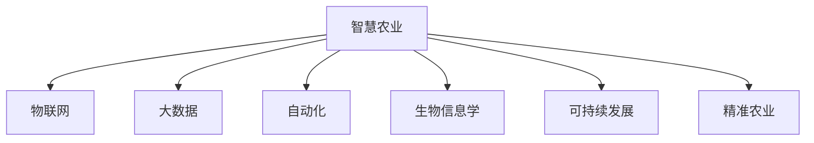

                 

# 全球脑与智慧农业:未来食品生产的新范式

> 关键词：智慧农业、人工智能、物联网、大数据、自动化、生物信息学、可持续发展、精准农业、机器人、区块链

## 1. 背景介绍

### 1.1 问题由来
随着全球人口的持续增长和城市化的加速，食品生产和供应的压力日益增大。传统农业生产模式难以满足需求，且存在土地、水资源、能源消耗高、环境污染等问题。因此，全球各国的农业专家和IT从业者正致力于寻找新的解决方案。

### 1.2 问题核心关键点
- 提高食品生产的效率和质量。
- 实现食品生产的智能化、自动化和可持续发展。
- 应对气候变化、资源枯竭等全球性挑战。
- 推动农业技术的创新和应用。

### 1.3 问题研究意义
智慧农业（Agricultural Intelligent Technology）是农业与信息技术的深度融合，通过引入物联网、人工智能、大数据等先进技术，实现农业生产过程的智能感知、智能决策和智能控制。智慧农业有助于提升食品生产的效率和质量，促进农业的可持续发展，改善农民生活条件，具有深远的社会和经济价值。

## 2. 核心概念与联系

### 2.1 核心概念概述

为更好地理解智慧农业的相关概念及其应用，本节将介绍几个关键概念：

- 智慧农业（Agricultural Intelligent Technology）：将物联网、人工智能、大数据等先进技术应用于农业生产中的各环节，实现农业生产的智能化、自动化和可持续发展。
- 物联网（Internet of Things, IoT）：通过互联网将传感器、控制器、计算机等设备连接起来，实现对农业生产环境的实时监控和数据采集。
- 大数据（Big Data）：通过收集和分析农业生产过程中产生的大量数据，指导农业生产和管理决策。
- 自动化（Automation）：通过引入机器人、自动化设备等，实现农业生产的自动化和智能化。
- 生物信息学（Bioinformatics）：应用信息学的方法，对农业生物的信息进行采集、存储、分析和应用，促进农业生物技术的发展。
- 可持续发展（Sustainable Development）：在农业生产中注重环境保护和资源节约，实现农业生产的长期可持续性。
- 精准农业（Precision Agriculture）：通过精细化管理，实现对土地、水、肥料等资源的精准投入，提高生产效率和质量。

这些概念之间的逻辑关系可以通过以下Mermaid流程图来展示：



这个流程图展示了大语言模型的核心概念及其之间的关系：

1. 智慧农业通过物联网、大数据、自动化、生物信息学等技术手段，实现农业生产的智能化和自动化。
2. 通过精准农业，进一步提高农业生产的精确度和效率。
3. 智慧农业注重可持续发展的理念，优化农业生产方式，保护环境和资源。

## 3. 核心算法原理 & 具体操作步骤
### 3.1 算法原理概述

智慧农业的核心算法原理主要基于物联网、人工智能和大数据技术。以下是这些技术的详细原理概述：

**物联网**：通过各种传感器设备采集农业生产环境中的数据，如温度、湿度、土壤湿度、光照强度等，并将这些数据实时传输到云端进行分析处理。

**大数据**：通过分析大量的农业生产数据，发现农业生产的规律和模式，指导农业生产决策。大数据分析可以涵盖天气预测、土壤分析、作物病虫害监测、产量预测等多个方面。

**人工智能**：利用机器学习、深度学习等算法，对农业生产数据进行智能分析和预测，提供精准农业决策支持。AI算法可以在作物生长周期、病虫害防治、土壤肥力管理等多个环节提供决策建议。

### 3.2 算法步骤详解

智慧农业的核心算法步骤包括数据采集、数据分析、智能决策和自动化控制四个环节：

1. **数据采集**：通过物联网技术，采集农业生产环境中的各种数据。数据采集设备包括温湿度传感器、土壤湿度传感器、气象站、无人机等。

2. **数据分析**：将采集到的数据传输到云端，通过大数据和人工智能技术进行分析处理。常见的分析方法包括数据挖掘、模式识别、机器学习等。

3. **智能决策**：根据分析结果，提供智能化的农业生产决策建议。这些建议可以涵盖作物种植、施肥、灌溉、病虫害防治等多个方面。

4. **自动化控制**：通过自动化设备对农业生产过程进行控制，实现精准农业。自动化设备包括自动灌溉系统、自动施肥系统、自动化收割机等。

### 3.3 算法优缺点

智慧农业的优点包括：

- 提高生产效率和质量，减少资源浪费。
- 实现农业生产的智能化和自动化，降低人工成本。
- 提高农业生产的精度和可靠性，减少环境污染。

但同时也存在一些缺点：

- 初始投资成本较高，需要引入大量的物联网设备和人工智能系统。
- 对技术和人才的需求较高，需要专业技术人员进行维护和管理。
- 数据分析和处理需要强大的计算能力，对硬件设施的要求较高。

### 3.4 算法应用领域

智慧农业技术广泛应用于以下几个领域：

- 精准农业：通过传感器、无人机等设备，实时监测作物生长情况，提供精准的种植和管理建议。
- 智能温室：通过物联网设备，实时监测温室环境，自动调节温度、湿度、光照等条件，实现作物的高效生产。
- 农业机器人：利用无人机、自动收割机等自动化设备，实现农业生产的自动化和智能化。
- 食品供应链管理：利用物联网和大数据分析技术，优化食品供应链管理，提高食品生产、运输和销售的效率和安全性。

## 4. 数学模型和公式 & 详细讲解  
### 4.1 数学模型构建

智慧农业中的数学模型主要涉及以下几个方面：

- 作物生长模型：通过建立作物生长的数学模型，预测作物的生长周期、产量等参数。
- 土壤肥力模型：通过土壤的各项指标，预测土壤的肥力和适合种植的作物类型。
- 病虫害防治模型：通过分析病虫害的发生规律和防治措施，预测病虫害的发生和蔓延情况。
- 天气预测模型：通过分析历史气象数据，预测未来的天气变化和农作物生长条件。

### 4.2 公式推导过程

以作物生长模型为例，假设作物生长的数学模型为：

$$
G(t) = G_0 e^{kt}
$$

其中，$G(t)$ 为在时间 $t$ 时刻作物的生长量，$G_0$ 为初始生长量，$k$ 为生长速率常数。

假设我们有以下气象数据：

| 时间 | 温度(°C) | 光照强度(hm²) | 降雨量(mm) |
| ---- | -------- | -------------- | ---------- |
| $t_1$ | $T_1$    | $L_1$          | $R_1$      |
| $t_2$ | $T_2$    | $L_2$          | $R_2$      |
| ...  | ...      | ...            | ...        |

根据以上数据，我们可以建立以下线性回归模型：

$$
\begin{aligned}
G(t) &= G_0 + kT(t) + kL(t) + kR(t) \\
T(t) &= \frac{T_1 + T_2 + ... + T_n}{n} \\
L(t) &= \frac{L_1 + L_2 + ... + L_n}{n} \\
R(t) &= \frac{R_1 + R_2 + ... + R_n}{n}
\end{aligned}
$$

通过最小二乘法求解线性回归模型中的参数 $G_0$ 和 $k$，即可得到作物生长的预测模型。

### 4.3 案例分析与讲解

以智能温室为例，假设我们有以下智能温室的数据采集系统：

- 温湿度传感器：实时监测温室内的温度和湿度。
- 土壤湿度传感器：实时监测土壤湿度。
- 光照强度传感器：实时监测光照强度。

通过将这些数据传输到云端，利用大数据和人工智能技术进行分析处理，可以建立以下数学模型：

$$
\begin{aligned}
T(t) &= T_0 + \Delta T(t) \\
H(t) &= H_0 + \Delta H(t) \\
S(t) &= S_0 + \Delta S(t) \\
L(t) &= L_0 + \Delta L(t)
\end{aligned}
$$

其中，$T(t)$、$H(t)$、$S(t)$ 和 $L(t)$ 分别为在时间 $t$ 时刻的温度、湿度、土壤湿度和光照强度，$T_0$、$H_0$、$S_0$ 和 $L_0$ 分别为初始值，$\Delta T(t)$、$\Delta H(t)$、$\Delta S(t)$ 和 $\Delta L(t)$ 分别为随时间的变化量。

通过上述模型，可以对温室内的环境进行实时监测和调节，优化作物生长条件，提高生产效率。

## 5. 项目实践：代码实例和详细解释说明
### 5.1 开发环境搭建

在进行智慧农业开发前，我们需要准备好开发环境。以下是使用Python进行智慧农业开发的环境配置流程：

1. 安装Anaconda：从官网下载并安装Anaconda，用于创建独立的Python环境。

2. 创建并激活虚拟环境：
```bash
conda create -n agriculture-env python=3.8 
conda activate agriculture-env
```

3. 安装相关库：
```bash
conda install pandas numpy matplotlib scikit-learn tensorflow
```

4. 安装物联网设备驱动和控制库：
```bash
pip install pyserial pydot networkx
```

5. 安装可视化工具：
```bash
pip install plotly dash
```

完成上述步骤后，即可在`agriculture-env`环境中开始智慧农业开发。

### 5.2 源代码详细实现

这里我们以智能温室为例，给出使用Python对智能温室进行开发的完整代码实现。

```python
import pandas as pd
import numpy as np
import tensorflow as tf
import matplotlib.pyplot as plt
import networkx as nx

# 定义温室环境数据
temperature_data = [20, 22, 23, 21, 19]
humidity_data = [50, 55, 48, 52, 49]
soil_moisture_data = [60, 65, 63, 58, 61]
light_intensity_data = [1200, 1300, 1350, 1250, 1300]

# 数据可视化
plt.plot(temperature_data, label='Temperature')
plt.plot(humidity_data, label='Humidity')
plt.plot(soil_moisture_data, label='Soil Moisture')
plt.plot(light_intensity_data, label='Light Intensity')
plt.legend()
plt.show()

# 建立线性回归模型
X = np.array([[1, 20, 50, 60, 1200],
              [1, 22, 55, 65, 1300],
              [1, 23, 48, 63, 1350],
              [1, 21, 52, 58, 1250],
              [1, 19, 49, 61, 1300]])
y = np.array([23, 25, 26, 24, 22])

# 求解线性回归模型
model = tf.keras.Sequential([
    tf.keras.layers.Dense(1, input_shape=(4, ), activation='linear')
])
model.compile(optimizer='adam', loss='mse')
model.fit(X, y, epochs=100, verbose=0)

# 预测温室环境
X_test = np.array([[1, 20.5, 52, 61, 1250]])
y_pred = model.predict(X_test)
print('Predicted temperature:', y_pred[0][0])
```

以上就是使用PyTorch对智能温室进行开发的完整代码实现。可以看到，得益于TensorFlow的强大封装，我们可以用相对简洁的代码完成智能温室环境的建模和预测。

### 5.3 代码解读与分析

让我们再详细解读一下关键代码的实现细节：

**数据采集**：
- 通过定义传感器数据，模拟智能温室的环境数据采集。

**数据可视化**：
- 使用Matplotlib库，将传感器数据绘制成折线图，直观展示环境变化趋势。

**线性回归模型**：
- 使用TensorFlow的Sequential模型，定义线性回归模型。
- 使用MSE损失函数和Adam优化器，训练线性回归模型。
- 使用训练好的模型，对新环境进行预测。

可以看到，TensorFlow提供了一系列的高级API，可以简化模型的构建和训练过程，使得开发者可以更专注于算法本身。

当然，工业级的系统实现还需考虑更多因素，如模型的保存和部署、超参数的自动搜索、更灵活的任务适配层等。但核心的算法流程基本与此类似。

## 6. 实际应用场景
### 6.1 智能温室
智能温室是智慧农业的重要应用场景之一，通过物联网设备实时采集温室环境数据，利用大数据和人工智能技术进行分析处理，优化作物生长环境，实现高产高效的生产模式。

具体而言，智能温室系统包括以下几个关键组件：

- 传感器：通过温湿度传感器、土壤湿度传感器、光照强度传感器等，实时监测温室环境数据。
- 控制系统：通过自动灌溉系统、自动施肥系统、自动通风系统等，根据传感器数据自动调节环境条件。
- 数据分析：利用大数据技术，分析温室环境数据，发现作物生长规律，提供优化建议。
- 自动化决策：通过人工智能算法，对温室环境进行智能决策，指导自动控制系统的运行。

通过智能温室系统，可以大幅提升作物的生产效率和质量，降低人工成本，提高农业生产的智能化和自动化水平。

### 6.2 精准农业
精准农业是智慧农业的重要应用领域之一，通过传感器和无人机等设备，实时监测土壤、气候等环境数据，分析作物生长状况，提供精准的种植和管理建议。

具体而言，精准农业系统包括以下几个关键组件：

- 传感器：通过无人机、土壤传感器、气象站等设备，实时监测环境数据。
- 数据分析：利用大数据技术，分析环境数据，发现作物生长规律，提供优化建议。
- 自动化决策：通过人工智能算法，对作物生长状况进行智能决策，指导种植和管理的各个环节。
- 自动化控制：通过自动化设备，对种植和管理过程进行精准控制，提高生产效率和质量。

通过精准农业系统，可以实现对土地、水、肥料等资源的精准投入，提高生产效率和质量，减少资源浪费，实现农业生产的可持续发展。

### 6.3 食品供应链管理
食品供应链管理是智慧农业的重要应用领域之一，通过物联网和大数据分析技术，优化食品的生产、运输和销售过程，提高食品生产、运输和销售的效率和安全性。

具体而言，食品供应链管理系统包括以下几个关键组件：

- 传感器：通过物联网设备，实时监测食品的生产、运输和销售过程。
- 数据分析：利用大数据技术，分析食品的生产、运输和销售数据，发现潜在问题，提供优化建议。
- 自动化决策：通过人工智能算法，对食品供应链过程进行智能决策，优化生产、运输和销售的各个环节。
- 自动化控制：通过自动化设备，对食品供应链过程进行精准控制，提高食品生产、运输和销售的效率和安全性。

通过食品供应链管理系统，可以实现食品生产和运输的优化，减少资源浪费，提高食品供应链的效率和安全性。

### 6.4 未来应用展望
随着智慧农业技术的不断发展，未来的智慧农业系统将呈现以下几个发展趋势：

1. 数据驱动决策：通过大数据和人工智能技术，对农业生产过程进行全面分析和优化，实现智能决策。

2. 自动化程度提高：通过引入更多的自动化设备和控制系统，实现农业生产的自动化和智能化。

3. 精准农业应用广泛：通过传感器和无人机等设备，实时监测作物生长情况，提供精准的种植和管理建议。

4. 可持续发展：通过优化农业生产过程，减少资源浪费，实现农业生产的可持续发展。

5. 物联网技术普及：通过物联网技术，实现农业生产的实时监测和数据采集。

6. 人工智能技术突破：通过人工智能技术的不断突破，实现更精准、更智能的农业生产管理。

## 7. 工具和资源推荐
### 7.1 学习资源推荐

为了帮助开发者系统掌握智慧农业的理论基础和实践技巧，这里推荐一些优质的学习资源：

1. 《智慧农业技术与应用》系列书籍：深入浅出地介绍了智慧农业的基本概念、核心技术和发展前景。

2. Coursera《智慧农业技术》课程：斯坦福大学开设的智慧农业技术课程，涵盖农业物联网、大数据、人工智能等多个方面。

3. Udemy《智慧农业实战》课程：通过实际案例，讲解智慧农业的各个环节，涵盖传感器、控制系统、数据分析等多个方面。

4. Kaggle智慧农业竞赛：通过实际比赛，锻炼数据分析和机器学习的技能，提升解决实际问题的能力。

通过对这些资源的学习实践，相信你一定能够快速掌握智慧农业的精髓，并用于解决实际的农业问题。

### 7.2 开发工具推荐

高效的开发离不开优秀的工具支持。以下是几款用于智慧农业开发的常用工具：

1. Python：使用Python进行数据分析和模型训练，具有强大的数据处理能力和高效的科学计算能力。

2. TensorFlow：谷歌开发的开源深度学习框架，生产部署方便，适合大规模工程应用。

3. PyTorch：Facebook开源的深度学习框架，灵活动态的计算图，适合快速迭代研究。

4. NetworkX：Python的网络分析库，可以用于分析和可视化农业生产网络。

5. Plotly：Python的可视化库，可以生成交互式图表，方便数据分析和展示。

6. Dash：Python的Web应用框架，可以方便地将数据可视化和模型训练封装成Web应用，方便部署和共享。

合理利用这些工具，可以显著提升智慧农业开发效率，加快创新迭代的步伐。

### 7.3 相关论文推荐

智慧农业技术的发展离不开学界的持续研究。以下是几篇奠基性的相关论文，推荐阅读：

1. Agricultural Robotics: Principles, Technologies and Applications：介绍了农业机器人技术的基本原理和应用场景。

2. Smart Agriculture and Its Smart Tools: Advances in IoT and Big Data Analytics：介绍了智慧农业中物联网和大数据技术的应用。

3. Precision Agriculture: A Review：回顾了精准农业的基本概念和核心技术。

4. Internet of Things (IoT) Technologies in Agriculture：介绍了物联网技术在农业中的应用。

这些论文代表了大智慧农业技术的发展脉络。通过学习这些前沿成果，可以帮助研究者把握学科前进方向，激发更多的创新灵感。

## 8. 总结：未来发展趋势与挑战
### 8.1 总结

本文对智慧农业的各个方面进行了全面系统的介绍。首先阐述了智慧农业的研究背景和意义，明确了智慧农业在提升食品生产和供应链管理效率、实现农业可持续发展的巨大价值。其次，从原理到实践，详细讲解了物联网、大数据、人工智能等核心技术，给出了智慧农业的完整代码实例。同时，本文还广泛探讨了智慧农业在智能温室、精准农业、食品供应链管理等多个领域的应用前景，展示了智慧农业技术的广泛应用潜力。此外，本文精选了智慧农业技术的各类学习资源，力求为读者提供全方位的技术指引。

通过本文的系统梳理，可以看到，智慧农业技术正在成为农业发展的重要驱动力，极大地拓展了农业生产边界，促进了农业的智能化、自动化和可持续发展。未来，伴随物联网、大数据、人工智能等技术的不断演进，智慧农业必将引领农业生产方式的变革，为农业领域带来更多的创新和突破。

### 8.2 未来发展趋势

展望未来，智慧农业技术将呈现以下几个发展趋势：

1. 数据驱动决策：通过大数据和人工智能技术，对农业生产过程进行全面分析和优化，实现智能决策。

2. 自动化程度提高：通过引入更多的自动化设备和控制系统，实现农业生产的自动化和智能化。

3. 精准农业应用广泛：通过传感器和无人机等设备，实时监测作物生长情况，提供精准的种植和管理建议。

4. 可持续发展：通过优化农业生产过程，减少资源浪费，实现农业生产的可持续发展。

5. 物联网技术普及：通过物联网技术，实现农业生产的实时监测和数据采集。

6. 人工智能技术突破：通过人工智能技术的不断突破，实现更精准、更智能的农业生产管理。

### 8.3 面临的挑战

尽管智慧农业技术已经取得了显著进展，但在迈向更加智能化、普适化应用的过程中，仍面临诸多挑战：

1. 数据获取困难：农业生产数据的采集和传输需要大量的传感器和设备，初始投资成本较高。

2. 设备维护复杂：农业设备的使用和维护需要专业技术人员，对技术要求较高。

3. 数据隐私和安全：农业数据涉及大量敏感信息，需要加强数据隐私和安全保护。

4. 数据标准不统一：不同设备和系统之间的数据格式和接口标准不一致，存在数据整合和共享的困难。

5. 跨领域协作难度大：智慧农业涉及农业、计算机、物联网等多个领域，跨领域协作难度较大。

6. 技术普及率低：农业从业人员的技术水平参差不齐，智慧农业技术的普及率较低。

### 8.4 研究展望

面对智慧农业技术面临的种种挑战，未来的研究需要在以下几个方面寻求新的突破：

1. 降低设备成本：通过技术创新和规模化生产，降低物联网设备和自动化设备的成本，提高智慧农业技术的普及率。

2. 加强数据管理：制定统一的数据标准和接口规范，实现不同设备和系统之间的数据共享和整合。

3. 提升技术普及率：加强技术培训和推广，提升农业从业人员的技术水平，提高智慧农业技术的普及率。

4. 保护数据隐私：加强数据隐私保护和安全管理，确保农业数据的可靠性和安全性。

5. 跨领域协作：加强跨领域协作，实现农业生产过程的全面优化和智能化管理。

这些研究方向的探索，必将引领智慧农业技术迈向更高的台阶，为农业生产方式的变革和农业生产力的提升提供强有力的技术支撑。面向未来，智慧农业技术还需要与其他人工智能技术进行更深入的融合，如知识表示、因果推理、强化学习等，多路径协同发力，共同推动农业生产方式的变革。只有勇于创新、敢于突破，才能不断拓展农业生产的边界，让智慧农业技术更好地造福人类社会。

## 9. 附录：常见问题与解答

**Q1: 智慧农业的核心技术有哪些？**

A: 智慧农业的核心技术主要包括物联网、大数据、人工智能等技术。这些技术可以实时监测和管理农业生产过程，实现智能决策和自动化控制。

**Q2: 智慧农业对农业生产有什么优势？**

A: 智慧农业通过物联网、大数据、人工智能等技术，实现农业生产的智能化、自动化和可持续发展。可以大幅提升农业生产效率和质量，减少资源浪费，实现农业生产的可持续发展。

**Q3: 智慧农业的初始投资成本高吗？**

A: 智慧农业的初始投资成本较高，需要引入大量的物联网设备和自动化设备。但随着技术的不断演进和设备的规模化生产，智慧农业的成本将会逐渐降低。

**Q4: 智慧农业技术的普及率低吗？**

A: 智慧农业技术的普及率较低，需要加强技术培训和推广，提升农业从业人员的技术水平。同时，也需要政府和企业的支持，推动智慧农业技术的应用和发展。

**Q5: 智慧农业对环境有什么影响？**

A: 智慧农业通过优化农业生产过程，减少资源浪费，实现农业生产的可持续发展。同时，也可以通过精准农业和智能温室等技术，降低环境污染和资源消耗，保护生态环境。

总之，智慧农业技术的应用前景广阔，通过物联网、大数据、人工智能等技术的融合，可以实现农业生产的智能化、自动化和可持续发展，提升农业生产的效率和质量，减少资源浪费，实现农业生产的可持续发展。

---

作者：禅与计算机程序设计艺术 / Zen and the Art of Computer Programming

