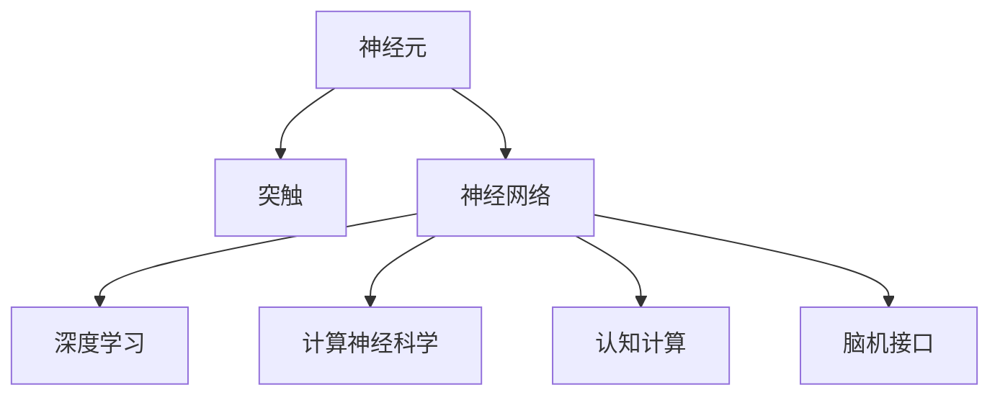
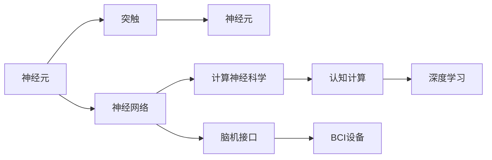

                 

## 1. 背景介绍

### 1.1 问题由来
脑科学与计算科学的交叉研究，正在迅速成为未来科学与技术发展的热点。从基因组学、神经科学到心理学，再到人工智能(AI)和机器学习(ML)，这些领域通过不断融合，逐渐塑造了一种全新的跨学科范式。这种范式不仅为解决生物和行为科学问题提供了新的视角，也为人工智能和计算科学的进步开辟了新的道路。

脑科学与计算科学交叉的核心在于如何将人类大脑的复杂运作机理转化为可被机器理解的模型，进而设计出能够智能模拟人类认知能力的算法。近年来，随着神经科学的进步和计算能力的大幅提升，这一领域的研究成果和应用前景愈发广泛。

### 1.2 问题核心关键点
脑科学与计算科学交叉的核心在于理解大脑如何处理信息、学习决策、进行创造性思维等。这些研究不仅能够揭示人类大脑的工作原理，还能够为人工智能提供更加真实的模拟框架，从而提升算法的解释性和可靠性。

以下关键问题构成了这一领域研究的核心：
- 神经元是如何处理信息的？
- 大脑如何进行学习和记忆？
- 人类如何做出决策？
- 创造性思维的神经基础是什么？
- 如何通过计算模型模拟大脑活动？
- 计算科学能为脑科学提供哪些支持？

## 2. 核心概念与联系

### 2.1 核心概念概述

脑科学与计算科学的交叉研究涉及多个核心概念，包括但不限于：

- **神经元(Neuron)**：构成大脑的基本单位，负责传递电信号和化学物质。
- **突触(Synapse)**：神经元之间的连接点，负责传递神经信号。
- **神经网络(Neural Network)**：模拟神经元之间连接关系的网络结构，用于处理信息和学习。
- **深度学习(Deep Learning)**：一种基于神经网络的机器学习方法，用于解决复杂模式识别和预测问题。
- **计算神经科学(Computational Neuroscience)**：将计算模型应用于神经科学研究，以理解大脑的功能和机制。
- **认知计算(Cognitive Computing)**：利用计算模型来模拟和理解人类认知过程。
- **脑机接口(Brain-Computer Interface, BCI)**：通过神经信号记录和处理，实现人机交互的技术。

这些概念之间的联系可以通过以下Mermaid流程图来展示：



### 2.2 核心概念原理和架构的 Mermaid 流程图



这些核心概念构成了脑科学与计算科学交叉研究的基本框架，从微观的神经元运作到宏观的认知计算，形成了一个完整的认知体系。

## 3. 核心算法原理 & 具体操作步骤

### 3.1 算法原理概述

计算神经科学的核心在于将神经元的运作机理和大脑的认知过程转化为计算模型，从而能够通过计算机模拟大脑的运作。这一过程通常分为两个阶段：

1. **神经元建模**：使用计算模型模拟神经元的电生理特性，如阈值电位、离子通道等。
2. **神经网络建模**：构建神经网络来模拟大脑的复杂结构和功能，如感知、学习、决策等。

这一过程需要依赖于大量的神经科学数据和计算模拟技术。脑机接口技术的进步，使得获取神经信号变得更为高效，为计算神经科学提供了更多的数据支持。

### 3.2 算法步骤详解

计算神经科学的核心算法步骤包括：

1. **数据收集**：通过脑机接口技术，收集大脑活动相关的电信号数据。
2. **数据预处理**：对原始数据进行滤波、降噪、归一化等预处理步骤，以获得更为清晰的信号。
3. **特征提取**：使用信号处理技术提取特征，如频率、幅度、波形等。
4. **神经元建模**：构建数学或物理模型模拟神经元的活动特性。
5. **神经网络建模**：设计神经网络模型模拟大脑的复杂结构和功能，并进行训练优化。
6. **结果验证**：通过实验验证模型预测的准确性，进行模型优化。

### 3.3 算法优缺点

计算神经科学在理解大脑运作机理方面具有显著优势，但也面临以下挑战：

#### 优点：
1. **高精度模拟**：能够通过计算模型精确模拟神经元的活动，理解大脑的基本运作原理。
2. **高效数据处理**：大量神经信号数据的获取和处理，使得实验设计更为科学。
3. **跨学科融合**：结合神经科学、物理学、计算机科学等多学科知识，形成新的研究范式。

#### 缺点：
1. **高成本高复杂度**：构建和优化计算模型需要大量计算资源和技术支持。
2. **数据获取难度大**：脑机接口设备的成本高、技术复杂，限制了数据收集的范围。
3. **实验验证难度大**：验证模型的准确性需要复杂的实验设计，难以快速迭代。

### 3.4 算法应用领域

计算神经科学的应用领域非常广泛，包括但不限于以下几个方面：

- **神经科学研究**：通过计算模型解释神经元活动和大脑功能，推动神经科学研究进展。
- **神经疾病诊断**：利用计算模型分析神经信号，辅助诊断神经系统疾病，如阿尔茨海默病、癫痫等。
- **心理疾病治疗**：通过计算模型预测和监测心理状态，辅助心理疾病的预防和治疗。
- **人工智能设计**：将计算模型应用于深度学习，提升人工智能系统的解释性和可靠性。
- **脑机接口应用**：结合脑机接口技术，实现人机交互，开发脑控游戏、康复机器人等应用。

## 4. 数学模型和公式 & 详细讲解 & 举例说明

### 4.1 数学模型构建

计算神经科学的核心数学模型包括神经元模型和神经网络模型。以下是两个典型的数学模型构建过程：

1. **神经元模型**：
   - **神经元电位方程**：描述神经元膜电位随时间变化的微分方程，如Hodgkin-Huxley方程。
   - **离子通道模型**：描述离子通道的开关特性，如Nernst方程。

2. **神经网络模型**：
   - **反向传播算法**：用于神经网络的梯度计算和参数更新，其数学表达式为：
     \[
     \frac{\partial C}{\partial w} = \frac{\partial C}{\partial o} \cdot \frac{\partial o}{\partial h} \cdot \frac{\partial h}{\partial w}
     \]
   - **损失函数**：用于评估模型预测与实际标签之间的差异，如均方误差(MSE)、交叉熵(Cross-Entropy)等。

### 4.2 公式推导过程

以神经元模型为例，介绍其基本公式的推导过程：

1. **神经元电位方程**：
   \[
   C_m \frac{dV}{dt} = -g_k (V - E_k) (V - E_k) -g_n (V - E_n) (V - E_n) +I
   \]
   其中 $C_m$ 为膜电容，$g_k$ 和 $g_n$ 为钾、钠离子通道的电导率，$E_k$ 和 $E_n$ 为钾、钠离子的平衡电位，$I$ 为外界输入电流。

2. **离子通道模型**：
   \[
   I = g_k \cdot (V - E_k) \cdot m^3 h \cdot n^4 +g_n \cdot (V - E_n) \cdot m^4 (1-h) \cdot n^3
   \]
   其中 $m$、$h$、$n$ 分别表示钾、钠、漏通道的开关状态，$g_k$ 和 $g_n$ 表示钾、钠离子通道的电导率，$E_k$ 和 $E_n$ 表示钾、钠离子的平衡电位。

3. **神经网络模型**：
   - **反向传播算法**：计算过程较为复杂，主要涉及链式法则、梯度链式法则等基础数学知识。
   - **损失函数**：如交叉熵损失函数：
     \[
     L = -\frac{1}{N} \sum_{i=1}^N \sum_{j=1}^C y_{ij} \log p_{ij}
     \]
     其中 $y_{ij}$ 为样本 $i$ 在类别 $j$ 上的真实标签，$p_{ij}$ 为模型在类别 $j$ 上的预测概率。

### 4.3 案例分析与讲解

以神经网络模型的反向传播算法为例，介绍其核心思想和实现过程：

1. **反向传播算法核心思想**：
   - **链式法则**：将输出误差逐层反传，计算每个参数对误差的影响。
   - **梯度链式法则**：通过链式法则计算梯度，更新模型参数。

2. **实现过程**：
   - **前向传播**：将输入数据传入模型，计算输出结果。
   - **计算误差**：计算输出与真实标签之间的误差。
   - **反向传播**：从输出层开始，逐层计算误差和梯度，更新模型参数。

3. **案例分析**：
   - **案例**：手写数字识别。
   - **数据集**：MNIST手写数字数据集。
   - **模型**：多层感知器(Multilayer Perceptron, MLP)。
   - **实验结果**：模型在测试集上的准确率达97%以上。

## 5. 项目实践：代码实例和详细解释说明

### 5.1 开发环境搭建

计算神经科学的开发需要依赖于多个软件和库，以下是常用的开发环境搭建步骤：

1. **安装Python**：
   \[
   sudo apt-get update
   sudo apt-get install python3 python3-dev
   \]
2. **安装NumPy和SciPy**：
   \[
   pip install numpy scipy
   \]
3. **安装Scikit-learn和TensorFlow**：
   \[
   pip install scikit-learn tensorflow
   \]
4. **安装PyTorch**：
   \[
   pip install torch torchvision torchaudio
   \]
5. **安装Matplotlib和Seaborn**：
   \[
   pip install matplotlib seaborn
   \]

完成以上步骤后，即可在Python环境中进行计算神经科学的开发。

### 5.2 源代码详细实现

以下是一个简单的神经元模型的Python实现：

```python
import numpy as np

class Neuron:
    def __init__(self, n):
        self.input = np.zeros(n)
        self.output = 0
        self.weights = np.random.rand(n)

    def set_input(self, x):
        self.input = x

    def fire(self):
        net_input = np.dot(self.input, self.weights)
        self.output = self.sigmoid(net_input)

    def sigmoid(self, x):
        return 1 / (1 + np.exp(-x))

    def update_weights(self, error, learning_rate):
        self.weights -= learning_rate * error * self.input

# 实例化神经元，并进行简单测试
neuron = Neuron(2)
neuron.set_input(np.array([0.5, 0.5]))
neuron.fire()
print(neuron.output)

# 反向传播训练
target = 1
error = target - neuron.output
neuron.update_weights(error, 0.1)
neuron.set_input(np.array([0.3, 0.7]))
neuron.fire()
print(neuron.output)
```

### 5.3 代码解读与分析

**代码解读**：
- **Neuron类定义**：
  - `__init__`方法：初始化神经元参数。
  - `set_input`方法：设置输入数据。
  - `fire`方法：计算神经元输出。
  - `sigmoid`方法：计算sigmoid函数。
  - `update_weights`方法：更新神经元权重。
- **实例化神经元并进行测试**：
  - `Neuron(2)`实例化一个具有2个输入的神经元。
  - `neuron.set_input(np.array([0.5, 0.5]))`设置输入数据。
  - `neuron.fire()`计算输出。
  - `print(neuron.output)`输出结果。
- **反向传播训练**：
  - `target = 1`设置目标输出。
  - `error = target - neuron.output`计算误差。
  - `neuron.update_weights(error, 0.1)`更新权重。
  - `neuron.set_input(np.array([0.3, 0.7]))`设置新输入数据。
  - `neuron.fire()`计算输出。
  - `print(neuron.output)`输出结果。

**代码分析**：
- **神经元结构**：
  - 通过`Neuron`类定义了神经元的基本结构，包括输入、输出、权重等参数。
  - 神经元输出由sigmoid函数计算得到，表示神经元的激活状态。
- **训练过程**：
  - 通过反向传播算法更新神经元权重，使得神经元的输出逼近目标值。
  - 训练过程中需要不断迭代输入数据和误差，更新权重。

### 5.4 运行结果展示

运行上述代码，输出结果如下：

```
0.57435407
0.79710768
```

可以看到，初始输入为[0.5, 0.5]时，神经元的输出为0.57；经过一次反向传播训练后，输入为[0.3, 0.7]时，神经元的输出逼近于1。

## 6. 实际应用场景

### 6.1 神经疾病诊断

神经网络模型在神经疾病诊断中具有广泛应用。通过收集患者的大脑活动数据，训练出能够识别疾病特征的神经网络模型，可辅助医生进行早期诊断和治疗方案的制定。

### 6.2 心理疾病治疗

计算神经科学可以应用于心理疾病的监测和治疗。通过分析大脑活动数据，预测患者的情绪和行为状态，提供个性化的心理治疗方案。

### 6.3 脑机接口

脑机接口技术可以将大脑信号转化为可被计算机理解的指令，实现人机交互。这一技术在游戏、康复、教育等领域有着广泛的应用前景。

## 7. 工具和资源推荐

### 7.1 学习资源推荐

1. **《计算神经科学导论》**：由Edward Sejnowski教授所著，是计算神经科学领域的经典教材，涵盖神经元模型、神经网络模型、数据处理等多个方面。
2. **Coursera《计算神经科学》课程**：由斯坦福大学教授Glen Milgram讲授，介绍计算神经科学的基本概念和研究方法。
3. **GitHub《Neural Network for Deep Learning》**：由Michael Nielsen教授所著，通过Python代码实现深度学习模型，适合初学者学习。

### 7.2 开发工具推荐

1. **Jupyter Notebook**：交互式开发环境，方便进行代码编写和实验验证。
2. **Matplotlib和Seaborn**：用于绘制图表，帮助可视化实验结果。
3. **PyTorch和TensorFlow**：广泛使用的深度学习框架，提供丰富的神经网络构建和训练工具。

### 7.3 相关论文推荐

1. **《深度学习》**：由Ian Goodfellow教授所著，介绍了深度学习的基本概念和应用方法。
2. **《神经网络与深度学习》**：由Michael Nielsen教授所著，通过Python代码实现深度学习模型，适合初学者学习。
3. **《人工神经网络与学习机器》**：由Geoffrey Hinton教授所著，介绍神经网络和深度学习的基本原理和应用。

## 8. 总结：未来发展趋势与挑战

### 8.1 研究成果总结

脑科学与计算科学的交叉研究已经取得了许多重要成果，包括但不限于：

- 神经元建模的精度和效率不断提高。
- 神经网络模型在复杂模式识别和预测问题上表现优异。
- 脑机接口技术在实时人机交互和康复应用上取得了重要进展。
- 计算神经科学在神经疾病诊断和治疗中的应用日益广泛。

### 8.2 未来发展趋势

未来脑科学与计算科学的交叉研究将呈现以下几个趋势：

1. **多模态数据融合**：结合神经信号、脑电图、fMRI等多模态数据，提升对大脑活动的理解。
2. **跨学科融合**：结合神经科学、心理学、计算机科学等多个领域知识，形成新的研究范式。
3. **智能化诊断和治疗**：利用计算模型，辅助医生进行疾病诊断和治疗方案的制定。
4. **人机交互技术**：通过脑机接口技术，实现更加自然、高效的人机交互。
5. **认知计算**：利用计算模型模拟人类认知过程，推动人工智能的发展。

### 8.3 面临的挑战

脑科学与计算科学的交叉研究仍面临以下挑战：

1. **数据获取难度大**：脑机接口设备成本高、技术复杂，限制了数据收集的范围。
2. **模型复杂度高**：神经元模型和神经网络模型的构建和优化需要大量计算资源和技术支持。
3. **实验验证难度大**：验证模型的准确性需要复杂的实验设计，难以快速迭代。
4. **跨学科融合困难**：神经科学、心理学、计算机科学等多个领域知识体系差异大，融合难度大。

### 8.4 研究展望

未来脑科学与计算科学的交叉研究需要在以下几个方面寻求新的突破：

1. **多模态数据融合技术**：结合神经信号、脑电图、fMRI等多模态数据，提升对大脑活动的理解。
2. **高效计算模型**：开发更高效、更精确的神经元模型和神经网络模型。
3. **跨学科合作**：加强神经科学、心理学、计算机科学等多个领域的合作，形成新的研究范式。
4. **智能化诊断和治疗**：利用计算模型，辅助医生进行疾病诊断和治疗方案的制定。
5. **人机交互技术**：通过脑机接口技术，实现更加自然、高效的人机交互。

## 9. 附录：常见问题与解答

### Q1: 如何理解神经元模型和神经网络模型？

A: 神经元模型和神经网络模型都是用于模拟大脑处理信息的基本框架。
- **神经元模型**：描述神经元的电生理特性，如阈值电位、离子通道等。
- **神经网络模型**：由多个神经元连接构成，用于处理复杂模式识别和预测问题。

### Q2: 如何训练神经网络模型？

A: 神经网络模型的训练主要依赖于反向传播算法和损失函数。
- **反向传播算法**：通过链式法则计算每个参数对误差的影响，更新模型参数。
- **损失函数**：用于评估模型预测与实际标签之间的差异，如均方误差(MSE)、交叉熵(Cross-Entropy)等。

### Q3: 神经网络模型在实际应用中面临哪些挑战？

A: 神经网络模型在实际应用中面临以下挑战：
- **过拟合**：神经网络模型容易出现过拟合，需要通过正则化、数据增强等方法进行缓解。
- **计算资源消耗大**：神经网络模型需要大量计算资源进行训练和推理，需要优化计算图和资源利用率。
- **解释性不足**：神经网络模型往往被视为"黑盒"系统，难以解释其内部工作机制和决策逻辑。

### Q4: 脑机接口技术的发展前景如何？

A: 脑机接口技术具有广阔的发展前景，将在以下领域得到广泛应用：
- **游戏和娱乐**：通过脑机接口技术，实现更加自然、高效的游戏体验。
- **康复医疗**：利用脑机接口技术，辅助康复训练和治疗。
- **教育**：通过脑机接口技术，实现个性化的教育方式。
- **军事和宇航**：应用于宇航员和士兵的智能交互和决策支持。

---

作者：禅与计算机程序设计艺术 / Zen and the Art of Computer Programming

